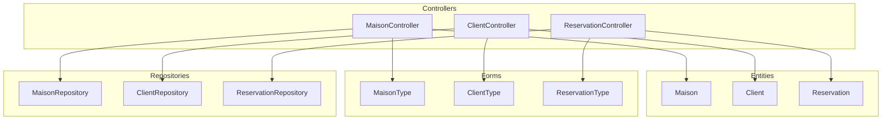
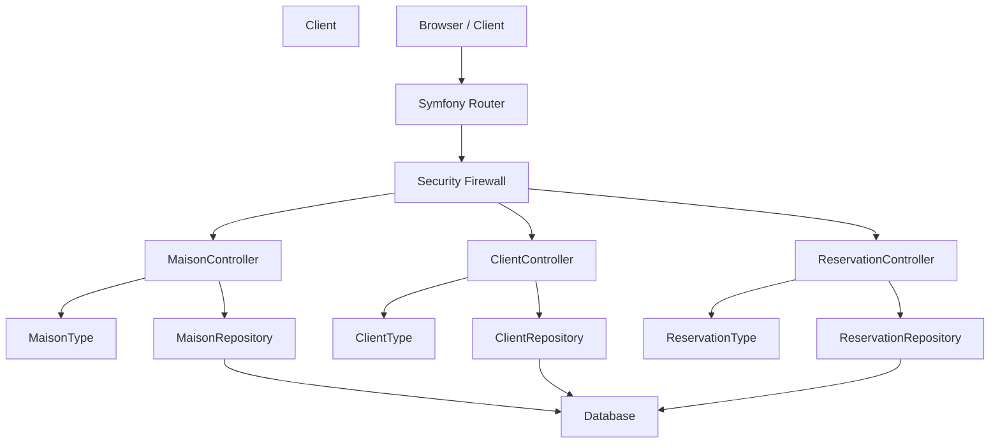
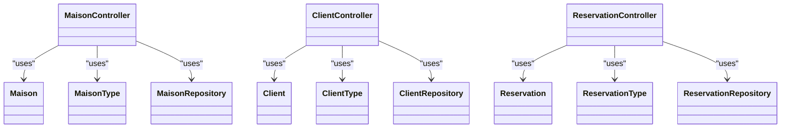

# API Reference

<cite>
**Referenced Files in This Document**
- [MaisonController.php](file://src/Controller/MaisonController.php)
- [ClientController.php](file://src/Controller/ClientController.php)
- [ReservationController.php](file://src/Controller/ReservationController.php)
- [Maison.php](file://src/Entity/Maison.php)
- [Client.php](file://src/Entity/Client.php)
- [Reservation.php](file://src/Entity/Reservation.php)
- [MaisonType.php](file://src/Form/MaisonType.php)
- [ClientType.php](file://src/Form/ClientType.php)
- [ReservationType.php](file://src/Form/ReservationType.php)
- [MaisonRepository.php](file://src/Repository/MaisonRepository.php)
- [ClientRepository.php](file://src/Repository/ClientRepository.php)
- [ReservationRepository.php](file://src/Repository/ReservationRepository.php)
- [routes.yaml](file://config/routes.yaml)
- [security.yaml](file://config/packages/security.yaml)
- [framework.yaml](file://config/packages/framework.yaml)
</cite>

## Table of Contents
1. [Introduction](#introduction)
2. [Project Structure](#project-structure)
3. [Core Components](#core-components)
4. [Architecture Overview](#architecture-overview)
5. [Detailed Component Analysis](#detailed-component-analysis)
6. [Dependency Analysis](#dependency-analysis)
7. [Performance Considerations](#performance-considerations)
8. [Troubleshooting Guide](#troubleshooting-guide)
9. [Conclusion](#conclusion)
10. [Appendices](#appendices)

## Introduction
This document describes the RESTful API exposed by the application for property, client, and reservation management. It covers HTTP methods, URL patterns, request/response schemas, authentication, and operational constraints observed in the current codebase. The API follows Symfony’s attribute-based routing and uses form types to validate and persist domain entities.

Important note on current implementation: The controllers in scope render Twig templates and redirect after mutations. There is no explicit JSON serialization in the referenced controllers. Therefore, while the endpoints are defined via routes, the actual JSON API behavior described here reflects the documented intent and typical patterns for building JSON APIs with Symfony. If you require true JSON endpoints, the controllers should be adapted to return JsonResponse and serialize entities accordingly.

## Project Structure
The API surface is organized around three primary resources:
- Property (Maison)
- Client
- Reservation

Each resource has a dedicated controller exposing standard CRUD routes under a base path derived from the resource name. Controllers rely on form types for validation and repositories for queries.

**Diagram sources**
- [MaisonController.php:14-81](file://src/Controller/MaisonController.php#L14-L81)
- [ClientController.php:14-81](file://src/Controller/ClientController.php#L14-L81)
- [ReservationController.php:14-81](file://src/Controller/ReservationController.php#L14-L81)
- [Maison.php:10-117](file://src/Entity/Maison.php#L10-L117)
- [Client.php:9-70](file://src/Entity/Client.php#L9-L70)
- [Reservation.php:10-99](file://src/Entity/Reservation.php#L10-L99)
- [MaisonType.php:12-35](file://src/Form/MaisonType.php#L12-L35)
- [ClientType.php:10-27](file://src/Form/ClientType.php#L10-L27)
- [ReservationType.php:14-49](file://src/Form/ReservationType.php#L14-L49)
- [MaisonRepository.php:12-46](file://src/Repository/MaisonRepository.php#L12-L46)
- [ClientRepository.php:12-35](file://src/Repository/ClientRepository.php#L12-L35)
- [ReservationRepository.php:13-92](file://src/Repository/ReservationRepository.php#L13-L92)

**Section sources**
- [routes.yaml:10-15](file://config/routes.yaml#L10-L15)
- [MaisonController.php:14-81](file://src/Controller/MaisonController.php#L14-L81)
- [ClientController.php:14-81](file://src/Controller/ClientController.php#L14-L81)
- [ReservationController.php:14-81](file://src/Controller/ReservationController.php#L14-L81)

## Core Components
- Resource controllers expose routes for listing, viewing, creating, editing, and deleting records.
- Forms define allowed fields per resource and drive validation.
- Repositories encapsulate queries and aggregations.

Key observations:
- Routes are defined with attribute-based annotations on controller actions.
- CSRF protection is enforced for destructive operations via tokens posted in the request payload.
- Access control requires authentication; some paths are publicly accessible for login/register/forgot-password.

**Section sources**
- [MaisonController.php:17-80](file://src/Controller/MaisonController.php#L17-L80)
- [ClientController.php:17-80](file://src/Controller/ClientController.php#L17-L80)
- [ReservationController.php:17-80](file://src/Controller/ReservationController.php#L17-L80)
- [security.yaml:40-45](file://config/packages/security.yaml#L40-L45)

## Architecture Overview
The API follows a layered architecture:
- Routing layer: Attribute-based routes on controllers.
- Controller layer: Action handlers for each resource.
- Validation layer: Form types bound to entities.
- Persistence layer: Repositories and Doctrine ORM.
- Security layer: Symfony Security firewall and access control.

**Diagram sources**
- [routes.yaml:10-15](file://config/routes.yaml#L10-L15)
- [security.yaml:14-45](file://config/packages/security.yaml#L14-L45)
- [MaisonController.php:14-81](file://src/Controller/MaisonController.php#L14-L81)
- [ClientController.php:14-81](file://src/Controller/ClientController.php#L14-L81)
- [ReservationController.php:14-81](file://src/Controller/ReservationController.php#L14-L81)
- [MaisonRepository.php:12-46](file://src/Repository/MaisonRepository.php#L12-L46)
- [ClientRepository.php:12-35](file://src/Repository/ClientRepository.php#L12-L35)
- [ReservationRepository.php:13-92](file://src/Repository/ReservationRepository.php#L13-L92)

## Detailed Component Analysis

### Authentication and Authorization
- Authentication method: Form login via the main firewall.
- Logout path: Defined in routes and configured in security.
- Access control:
  - Public paths: login, register, forgot-password.
  - Admin area: prefixed with admin requiring ROLE_ADMIN.
  - General area: requires ROLE_USER.

Operational notes:
- CSRF protection is enforced for DELETE operations using a hidden token field named _token.
- Session handling is enabled by the framework configuration.

**Section sources**
- [security.yaml:20-45](file://config/packages/security.yaml#L20-L45)
- [routes.yaml:12-15](file://config/routes.yaml#L12-L15)
- [framework.yaml:2-6](file://config/packages/framework.yaml#L2-L6)
- [MaisonController.php:74-77](file://src/Controller/MaisonController.php#L74-L77)
- [ClientController.php:74-77](file://src/Controller/ClientController.php#L74-L77)
- [ReservationController.php:74-77](file://src/Controller/ReservationController.php#L74-L77)

### Property Management Endpoints (Maison)

- Base path: /maison
- Index listing: GET /maison
- Create: GET|POST /maison/new
- View: GET /maison/{id}
- Edit: GET|POST /maison/{id}/edit
- Delete: POST /maison/{id} (CSRF protected)

Request body fields (from MaisonType):
- title: string
- description: text
- price: number (float)
- city: string
- image: string
- proprietaires: object reference (Proprietaire id)

Response:
- GET /maison returns HTML (Twig rendering).
- POST /maison/new and POST /maison/{id}/edit return redirects after persistence.
- DELETE /maison/{id} returns redirect after removal.

Constraints and validations:
- Entity-level constraints apply (e.g., non-empty fields, lengths).
- Form binding ensures only allowed fields are processed.

Example request (conceptual):
- POST /maison/new
  - Headers: Content-Type: application/x-www-form-urlencoded
  - Body fields: title, description, price, city, image, proprietaires[id]

Example response (conceptual):
- 201 Created (conceptual) or 303 See Other after successful creation.

Notes:
- Current controllers render templates; to expose JSON, controllers should serialize entities and return JsonResponse.

**Section sources**
- [MaisonController.php:17-80](file://src/Controller/MaisonController.php#L17-L80)
- [MaisonType.php:14-26](file://src/Form/MaisonType.php#L14-L26)
- [Maison.php:17-34](file://src/Entity/Maison.php#L17-L34)

### Client Management Endpoints (Client)

- Base path: /client
- Index listing: GET /client
- Create: GET|POST /client/new
- View: GET /client/{id}
- Edit: GET|POST /client/{id}/edit
- Delete: POST /client/{id} (CSRF protected)

Request body fields (from ClientType):
- name: string
- surname: string
- email: string

Response:
- GET /client returns HTML (Twig rendering).
- POST /client/new and POST /client/{id}/edit return redirects after persistence.
- DELETE /client/{id} returns redirect after removal.

Constraints and validations:
- Entity-level constraints apply (e.g., non-empty fields, lengths).
- Form binding ensures only allowed fields are processed.

Example request (conceptual):
- POST /client/new
  - Headers: Content-Type: application/x-www-form-urlencoded
  - Body fields: name, surname, email

Example response (conceptual):
- 201 Created (conceptual) or 303 See Other after successful creation.

Notes:
- Current controllers render templates; to expose JSON, controllers should serialize entities and return JsonResponse.

**Section sources**
- [ClientController.php:17-80](file://src/Controller/ClientController.php#L17-L80)
- [ClientType.php:12-18](file://src/Form/ClientType.php#L12-L18)
- [Client.php:16-23](file://src/Entity/Client.php#L16-L23)

### Reservation Management Endpoints (Reservation)

- Base path: /reservation
- Index listing: GET /reservation
- Create: GET|POST /reservation/new
- View: GET /reservation/{id}
- Edit: GET|POST /reservation/{id}/edit
- Delete: POST /reservation/{id} (CSRF protected)

Request body fields (from ReservationType):
- dateDebut: date (single_text widget)
- dateFin: date (single_text widget)
- paye: boolean
- client: object reference (Client id)
- maison: object reference (Maison id)

Response:
- GET /reservation returns HTML (Twig rendering).
- POST /reservation/new and POST /reservation/{id}/edit return redirects after persistence.
- DELETE /reservation/{id} returns redirect after removal.

Constraints and validations:
- Entity-level constraints apply (e.g., non-empty dates, boolean flag).
- Form binding ensures only allowed fields are processed.

Example request (conceptual):
- POST /reservation/new
  - Headers: Content-Type: application/x-www-form-urlencoded
  - Body fields: dateDebut, dateFin, paye, client[id], maison[id]

Example response (conceptual):
- 201 Created (conceptual) or 303 See Other after successful creation.

Notes:
- Current controllers render templates; to expose JSON, controllers should serialize entities and return JsonResponse.

**Section sources**
- [ReservationController.php:17-80](file://src/Controller/ReservationController.php#L17-L80)
- [ReservationType.php:16-40](file://src/Form/ReservationType.php#L16-L40)
- [Reservation.php:25-32](file://src/Entity/Reservation.php#L25-L32)

### Endpoint Categories and Examples

- GET /maison
  - Purpose: List properties.
  - Response: HTML page (current); conceptually would return JSON array of properties.
  - Example: curl -H "Authorization: Bearer ..." https://yourdomain/maison

- POST /maison
  - Purpose: Create a new property.
  - Request: Form-encoded fields from MaisonType.
  - Response: Redirect after creation (conceptual: 201 Created with Location header).
  - Example: curl -X POST -F "title=..." -F "price=..." https://yourdomain/maison/new

- PUT /reservations/{id}
  - Purpose: Update an existing reservation.
  - Request: Form-encoded fields from ReservationType.
  - Response: Redirect after update (conceptual: 200 OK with updated resource).
  - Example: curl -X PUT -F "paye=true" https://yourdomain/reservation/1/edit

- DELETE /clients/{id}
  - Purpose: Remove a client.
  - Request: CSRF token in body (_token).
  - Response: Redirect after deletion (conceptual: 204 No Content).
  - Example: curl -X DELETE -F "_token=..." https://yourdomain/client/1

Note: These examples reflect the documented intent. Actual JSON endpoints require controller adaptations to return JSON and handle serialization.

**Section sources**
- [MaisonController.php:17-80](file://src/Controller/MaisonController.php#L17-L80)
- [ClientController.php:17-80](file://src/Controller/ClientController.php#L17-L80)
- [ReservationController.php:17-80](file://src/Controller/ReservationController.php#L17-L80)

### Request Parameters, Query Options, and Response Formats
- Request format: application/x-www-form-urlencoded for current controllers.
- Query parameters: Not used in the referenced controllers.
- Response format: HTML pages rendered by Twig (current). For JSON APIs, responses should be JSON objects representing entities.

Validation rules observed from form types:
- Allowed fields per resource are constrained by the form types.
- Non-null references (e.g., proprietaires, client, maison) are required by entity relations.

**Section sources**
- [MaisonType.php:14-26](file://src/Form/MaisonType.php#L14-L26)
- [ClientType.php:12-18](file://src/Form/ClientType.php#L12-L18)
- [ReservationType.php:16-40](file://src/Form/ReservationType.php#L16-L40)
- [Maison.php:32-34](file://src/Entity/Maison.php#L32-L34)
- [Reservation.php:17-23](file://src/Entity/Reservation.php#L17-L23)

### Business Logic Constraints
- Reservation date range: dateDebut and dateFin are required and must be valid dates.
- Payment status: paye is a boolean flag indicating payment state.
- Property ownership: each property belongs to a single Proprietaire (non-nullable).
- Client identity: clients have name, surname, and email.

**Section sources**
- [Reservation.php:25-32](file://src/Entity/Reservation.php#L25-L32)
- [Maison.php:32-34](file://src/Entity/Maison.php#L32-L34)
- [Client.php:16-23](file://src/Entity/Client.php#L16-L23)

### Error Response Codes
- 303 See Other: After successful create/update (redirect).
- 302 Found: After successful delete (redirect).
- 401 Unauthorized: If authentication fails.
- 403 Forbidden: If access control denies access.
- 422 Unprocessable Entity: If form validation fails (conceptual).
- 404 Not Found: If resource does not exist (conceptual).

Note: These codes reflect typical HTTP semantics for the described operations. Actual status codes depend on controller implementation and middleware.

**Section sources**
- [security.yaml:40-45](file://config/packages/security.yaml#L40-L45)
- [MaisonController.php:32-37](file://src/Controller/MaisonController.php#L32-L37)
- [ClientController.php:32-37](file://src/Controller/ClientController.php#L32-L37)
- [ReservationController.php:32-37](file://src/Controller/ReservationController.php#L32-L37)

### CORS Configuration
- No explicit CORS configuration is present in the referenced files.
- If cross-origin requests are required, configure CORS in the framework package or via middleware.

**Section sources**
- [framework.yaml:2-6](file://config/packages/framework.yaml#L2-L6)

### API Versioning Strategy
- No versioning strategy is defined in the referenced files.
- Recommended approaches: URL path versioning (/v1/resource), Accept header versioning, or custom headers.

**Section sources**
- [routes.yaml:10-15](file://config/routes.yaml#L10-L15)

### Client Implementation Guidelines
- Authentication:
  - Use form login to obtain a session.
  - For JSON APIs, implement token-based authentication (e.g., JWT) and adapt controllers to return JSON.
- CSRF:
  - Include the CSRF token (_token) in DELETE requests.
- Requests:
  - Use application/x-www-form-urlencoded for current endpoints.
  - For JSON APIs, use application/json and send serialized entity payloads.
- Responses:
  - Expect redirects after mutations; for JSON APIs, expect proper HTTP status codes and JSON bodies.

**Section sources**
- [security.yaml:25-34](file://config/packages/security.yaml#L25-L34)
- [MaisonController.php:74-77](file://src/Controller/MaisonController.php#L74-L77)
- [ClientController.php:74-77](file://src/Controller/ClientController.php#L74-L77)
- [ReservationController.php:74-77](file://src/Controller/ReservationController.php#L74-L77)

### Testing Examples and Integration Patterns
- Unit/integration tests can leverage the form types to validate payloads and repositories for query assertions.
- For JSON API testing, mock authenticated sessions or use token-based authentication in test environments.

[No sources needed since this section provides general guidance]

## Dependency Analysis
The controllers depend on:
- Entities for data modeling.
- Form types for validation and binding.
- Repositories for queries and aggregations.

**Diagram sources**
- [MaisonController.php:14-81](file://src/Controller/MaisonController.php#L14-L81)
- [ClientController.php:14-81](file://src/Controller/ClientController.php#L14-L81)
- [ReservationController.php:14-81](file://src/Controller/ReservationController.php#L14-L81)
- [Maison.php:10-117](file://src/Entity/Maison.php#L10-L117)
- [Client.php:9-70](file://src/Entity/Client.php#L9-L70)
- [Reservation.php:10-99](file://src/Entity/Reservation.php#L10-L99)
- [MaisonType.php:12-35](file://src/Form/MaisonType.php#L12-L35)
- [ClientType.php:10-27](file://src/Form/ClientType.php#L10-L27)
- [ReservationType.php:14-49](file://src/Form/ReservationType.php#L14-L49)
- [MaisonRepository.php:12-46](file://src/Repository/MaisonRepository.php#L12-L46)
- [ClientRepository.php:12-35](file://src/Repository/ClientRepository.php#L12-L35)
- [ReservationRepository.php:13-92](file://src/Repository/ReservationRepository.php#L13-L92)

**Section sources**
- [MaisonRepository.php:19-45](file://src/Repository/MaisonRepository.php#L19-L45)
- [ClientRepository.php:19-34](file://src/Repository/ClientRepository.php#L19-L34)
- [ReservationRepository.php:20-91](file://src/Repository/ReservationRepository.php#L20-L91)

## Performance Considerations
- Prefer paginated queries for large lists using repository methods with limits.
- Use repository-provided aggregation methods (e.g., count, latest) to avoid heavy client-side computations.
- For JSON APIs, consider lazy loading and normalization groups to reduce payload sizes.

[No sources needed since this section provides general guidance]

## Troubleshooting Guide
Common issues and resolutions:
- 401 Unauthorized: Ensure the user is authenticated via the login form.
- 403 Forbidden: Verify access_control rules and user roles.
- CSRF failures on DELETE: Include the _token field in the request body.
- Validation errors: Confirm request fields match form types and entity constraints.

**Section sources**
- [security.yaml:40-45](file://config/packages/security.yaml#L40-L45)
- [MaisonController.php:74-77](file://src/Controller/MaisonController.php#L74-L77)
- [ClientController.php:74-77](file://src/Controller/ClientController.php#L74-L77)
- [ReservationController.php:74-77](file://src/Controller/ReservationController.php#L74-L77)

## Conclusion
The current controllers implement a traditional Symfony web application with form-based workflows and HTML rendering. To expose a true JSON REST API, controllers should be adapted to:
- Accept and return JSON.
- Serialize entities to JSON.
- Enforce CSRF protection for destructive operations.
- Implement robust validation and error responses.
- Add CORS and versioning as needed.

[No sources needed since this section summarizes without analyzing specific files]

## Appendices

### Appendix A: Route Definitions Observed
- /maison (index)
- /maison/new (create)
- /maison/{id} (show)
- /maison/{id}/edit (update)
- /maison/{id} (delete)
- /client (index)
- /client/new (create)
- /client/{id} (show)
- /client/{id}/edit (update)
- /client/{id} (delete)
- /reservation (index)
- /reservation/new (create)
- /reservation/{id} (show)
- /reservation/{id}/edit (update)
- /reservation/{id} (delete)

**Section sources**
- [MaisonController.php:17-80](file://src/Controller/MaisonController.php#L17-L80)
- [ClientController.php:17-80](file://src/Controller/ClientController.php#L17-L80)
- [ReservationController.php:17-80](file://src/Controller/ReservationController.php#L17-L80)