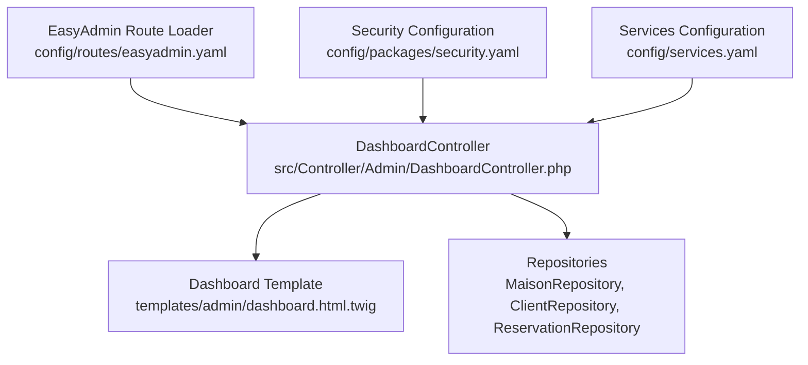
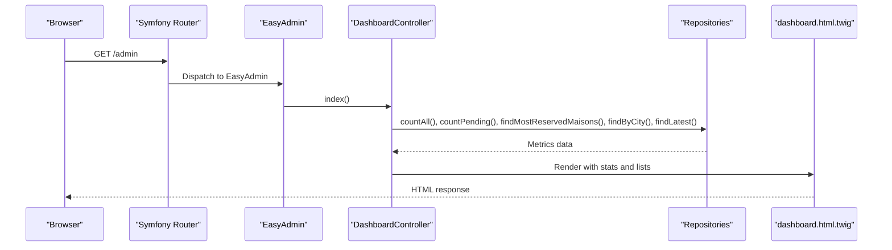
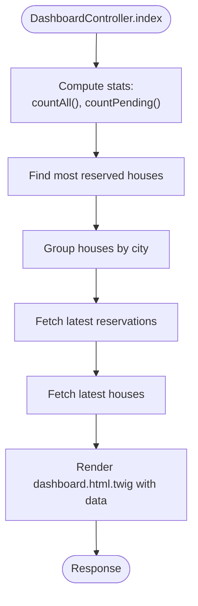
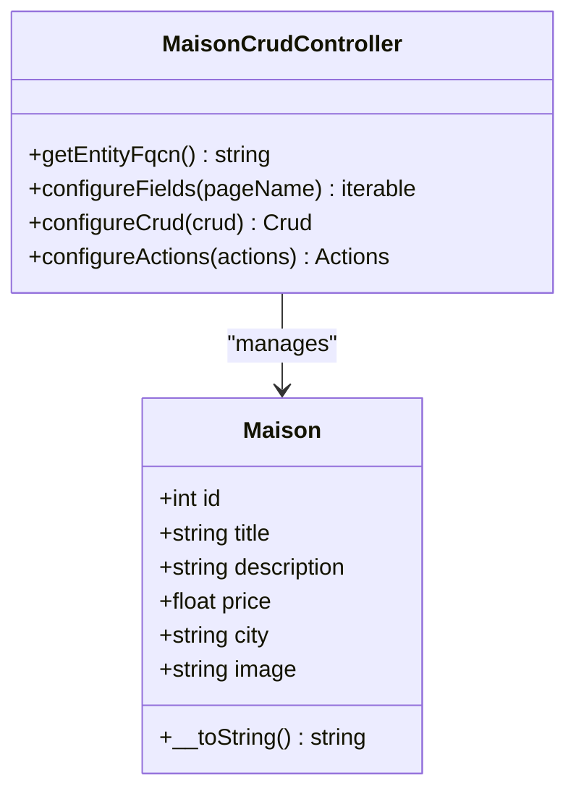
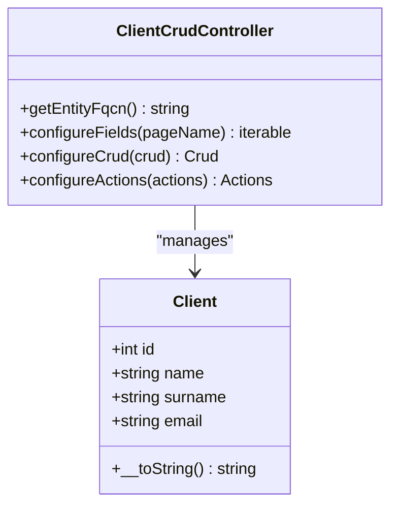
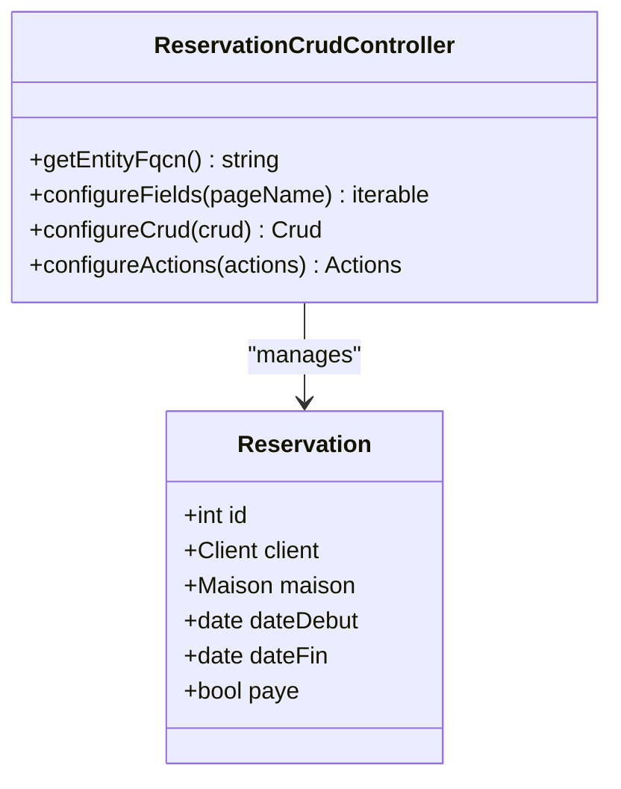
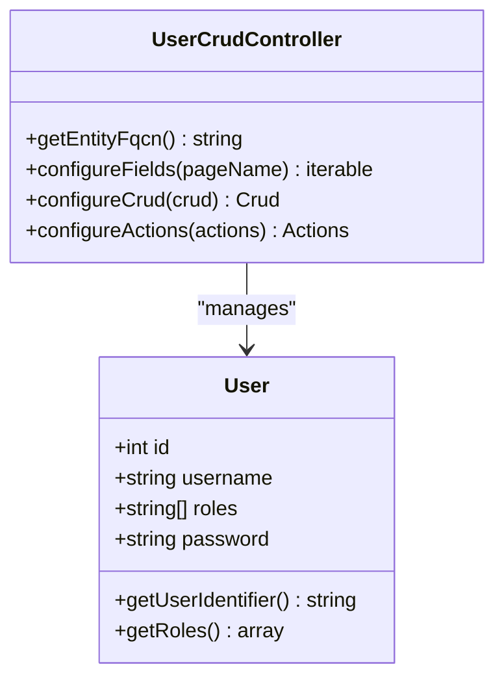
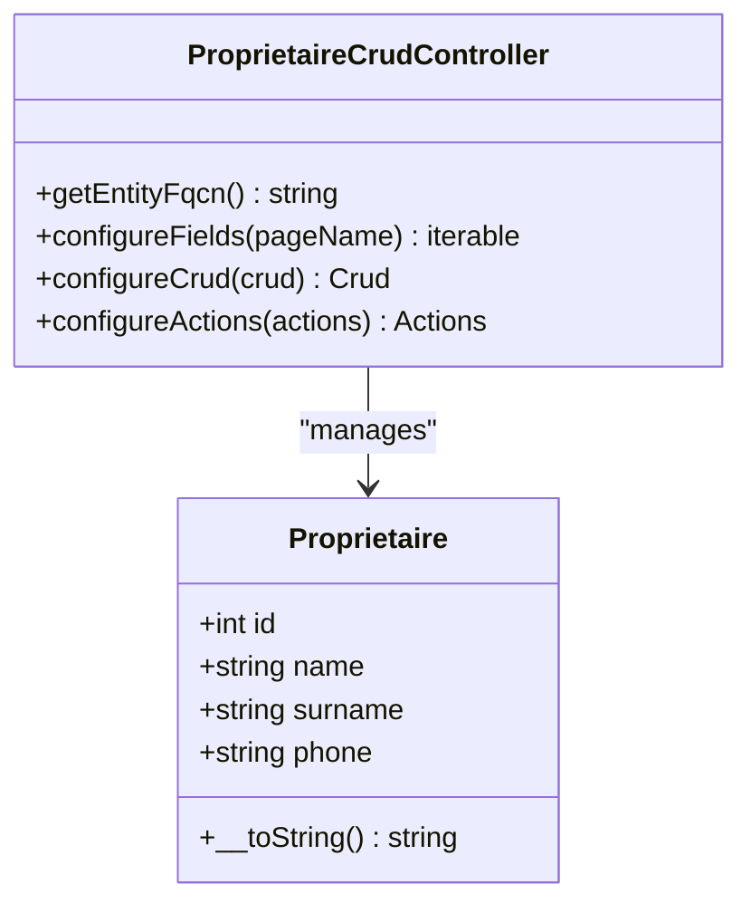
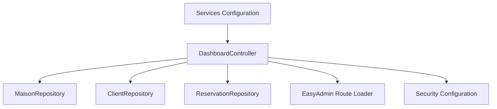
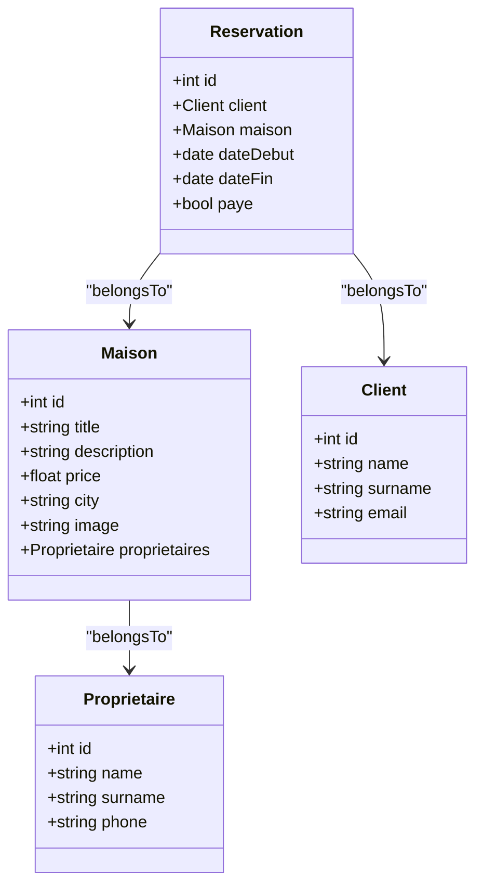

# Administrative Dashboard

<cite>
**Referenced Files in This Document**
- [easyadmin.yaml](file://config/routes/easyadmin.yaml)
- [DashboardController.php](file://src/Controller/Admin/DashboardController.php)
- [dashboard.html.twig](file://templates/admin/dashboard.html.twig)
- [security.yaml](file://config/packages/security.yaml)
- [services.yaml](file://config/services.yaml)
- [MaisonCrudController.php](file://src/Controller/Admin/MaisonCrudController.php)
- [ClientCrudController.php](file://src/Controller/Admin/ClientCrudController.php)
- [ReservationCrudController.php](file://src/Controller/Admin/ReservationCrudController.php)
- [UserCrudController.php](file://src/Controller/Admin/UserCrudController.php)
- [ProprietaireCrudController.php](file://src/Controller/Admin/ProprietaireCrudController.php)
- [Maison.php](file://src/Entity/Maison.php)
- [Client.php](file://src/Entity/Client.php)
- [Reservation.php](file://src/Entity/Reservation.php)
- [User.php](file://src/Entity/User.php)
- [Proprietaire.php](file://src/Entity/Proprietaire.php)
</cite>

## Table of Contents
1. [Introduction](#introduction)
2. [Project Structure](#project-structure)
3. [Core Components](#core-components)
4. [Architecture Overview](#architecture-overview)
5. [Detailed Component Analysis](#detailed-component-analysis)
6. [Dependency Analysis](#dependency-analysis)
7. [Performance Considerations](#performance-considerations)
8. [Troubleshooting Guide](#troubleshooting-guide)
9. [Conclusion](#conclusion)
10. [Appendices](#appendices)

## Introduction
This document describes the EasyAdmin administrative dashboard for the guest house management application. It explains the dashboard configuration, custom dashboard design, analytics integration, CRUD controllers for Maison, Client, Reservation, and User entities, administrative interface customization, field configurations, list/search capabilities, reporting features, data visualization, business metrics display, user management with roles and permissions, dashboard security and access control, administrative workflows, custom admin forms, bulk operations, and administrative reporting dashboards.

## Project Structure
The EasyAdmin integration is configured via a dedicated route loader and a primary dashboard controller. The dashboard renders a custom Twig template that displays statistics cards, charts, and recent activity tables. Security is enforced through Symfony’s security configuration with role-based access control.

**Diagram sources**
- [easyadmin.yaml:1-4](file://config/routes/easyadmin.yaml#L1-L4)
- [DashboardController.php:21-87](file://src/Controller/Admin/DashboardController.php#L21-L87)
- [dashboard.html.twig:1-263](file://templates/admin/dashboard.html.twig#L1-L263)
- [security.yaml:14-46](file://config/packages/security.yaml#L14-L46)
- [services.yaml:13-29](file://config/services.yaml#L13-L29)

**Section sources**
- [easyadmin.yaml:1-4](file://config/routes/easyadmin.yaml#L1-L4)
- [DashboardController.php:21-87](file://src/Controller/Admin/DashboardController.php#L21-L87)
- [dashboard.html.twig:1-263](file://templates/admin/dashboard.html.twig#L1-L263)
- [security.yaml:14-46](file://config/packages/security.yaml#L14-L46)
- [services.yaml:13-29](file://config/services.yaml#L13-L29)

## Core Components
- DashboardController: Defines the admin dashboard entry point, menu items, and analytics rendering. It collects statistics and passes them to the template for visualization.
- Dashboard Template: Renders statistics cards, top reserved houses, houses by city, latest reservations, and latest houses.
- Security Configuration: Enforces access control so that only administrators can access the admin area.
- Services Configuration: Provides dependency injection and binds environment variables for external services.

Key responsibilities:
- DashboardController.index: Aggregates counts, pending payments, top houses, city distribution, latest reservations, and latest houses.
- DashboardController.configureDashboard: Sets the dashboard title, maximized content layout, and favicon.
- DashboardController.configureMenuItems: Builds the navigation menu linking to each CRUD controller and a return-to-site link.

**Section sources**
- [DashboardController.php:32-61](file://src/Controller/Admin/DashboardController.php#L32-L61)
- [DashboardController.php:63-69](file://src/Controller/Admin/DashboardController.php#L63-L69)
- [DashboardController.php:71-86](file://src/Controller/Admin/DashboardController.php#L71-L86)
- [dashboard.html.twig:15-260](file://templates/admin/dashboard.html.twig#L15-L260)
- [security.yaml:40-45](file://config/packages/security.yaml#L40-L45)

## Architecture Overview
The EasyAdmin dashboard integrates with Symfony routing and controllers. The route loader delegates to EasyAdmin, which then invokes the configured dashboard controller. The controller orchestrates repositories to compute metrics and renders a custom Twig template.

**Diagram sources**
- [easyadmin.yaml:1-4](file://config/routes/easyadmin.yaml#L1-L4)
- [DashboardController.php:32-61](file://src/Controller/Admin/DashboardController.php#L32-L61)
- [dashboard.html.twig:1-263](file://templates/admin/dashboard.html.twig#L1-L263)

## Detailed Component Analysis

### Dashboard Analytics and Rendering
The dashboard controller computes:
- Counts: total houses, clients, reservations, pending payments.
- Top reserved houses: aggregated by reservation frequency.
- Houses by city: grouped counts per city.
- Latest reservations and latest houses: recent additions for quick monitoring.

The template presents:
- Statistics cards for totals and pending payments.
- Two data tables: most reserved houses and houses by city.
- Two recent activity panels: latest reservations and latest houses.

**Diagram sources**
- [DashboardController.php:34-50](file://src/Controller/Admin/DashboardController.php#L34-L50)
- [dashboard.html.twig:15-260](file://templates/admin/dashboard.html.twig#L15-L260)

**Section sources**
- [DashboardController.php:32-61](file://src/Controller/Admin/DashboardController.php#L32-L61)
- [dashboard.html.twig:15-260](file://templates/admin/dashboard.html.twig#L15-L260)

### Maison CRUD Controller
Customizes the Maison entity administration:
- Fields: id (hidden on form), title, description, price, city, image with upload configuration.
- Pagination: page size 10, range size 4.
- Actions: adds a detail action on the index view.

**Diagram sources**
- [MaisonCrudController.php:16-51](file://src/Controller/Admin/MaisonCrudController.php#L16-L51)
- [Maison.php:10-118](file://src/Entity/Maison.php#L10-L118)

**Section sources**
- [MaisonCrudController.php:23-37](file://src/Controller/Admin/MaisonCrudController.php#L23-L37)
- [MaisonCrudController.php:39-44](file://src/Controller/Admin/MaisonCrudController.php#L39-L44)
- [MaisonCrudController.php:46-50](file://src/Controller/Admin/MaisonCrudController.php#L46-L50)
- [Maison.php:10-118](file://src/Entity/Maison.php#L10-L118)

### Client CRUD Controller
Customizes the Client entity administration:
- Fields: id (hidden on form), name, surname, email.
- Pagination: page size 10, range size 4.
- Actions: adds a detail action on the index view.

**Diagram sources**
- [ClientCrudController.php:13-42](file://src/Controller/Admin/ClientCrudController.php#L13-L42)
- [Client.php:9-71](file://src/Entity/Client.php#L9-L71)

**Section sources**
- [ClientCrudController.php:20-28](file://src/Controller/Admin/ClientCrudController.php#L20-L28)
- [ClientCrudController.php:30-35](file://src/Controller/Admin/ClientCrudController.php#L30-L35)
- [ClientCrudController.php:37-41](file://src/Controller/Admin/ClientCrudController.php#L37-L41)
- [Client.php:9-71](file://src/Entity/Client.php#L9-L71)

### Reservation CRUD Controller
Customizes the Reservation entity administration:
- Fields: id (hidden on form), client, maison, dateDebut, dateFin, paye (boolean).
- Pagination: page size 10, range size 4.
- Actions: adds a detail action on the index view.

**Diagram sources**
- [ReservationCrudController.php:15-46](file://src/Controller/Admin/ReservationCrudController.php#L15-L46)
- [Reservation.php:10-100](file://src/Entity/Reservation.php#L10-L100)

**Section sources**
- [ReservationCrudController.php:22-32](file://src/Controller/Admin/ReservationCrudController.php#L22-L32)
- [ReservationCrudController.php:34-39](file://src/Controller/Admin/ReservationCrudController.php#L34-L39)
- [ReservationCrudController.php:41-45](file://src/Controller/Admin/ReservationCrudController.php#L41-L45)
- [Reservation.php:10-100](file://src/Entity/Reservation.php#L10-L100)

### User CRUD Controller
Customizes the User entity administration:
- Fields: id (hidden on form), username, roles (array), password (hidden on index/detail).
- Pagination: page size 10, range size 4.
- Actions: adds a detail action on the index view.

**Diagram sources**
- [UserCrudController.php:15-44](file://src/Controller/Admin/UserCrudController.php#L15-L44)
- [User.php:14-119](file://src/Entity/User.php#L14-L119)

**Section sources**
- [UserCrudController.php:22-30](file://src/Controller/Admin/UserCrudController.php#L22-L30)
- [UserCrudController.php:32-37](file://src/Controller/Admin/UserCrudController.php#L32-L37)
- [UserCrudController.php:39-43](file://src/Controller/Admin/UserCrudController.php#L39-L43)
- [User.php:68-85](file://src/Entity/User.php#L68-L85)

### Proprietaire CRUD Controller
Customizes the Proprietaire entity administration:
- Fields: id (hidden on form), name, surname, phone.
- Pagination: page size 10, range size 4.
- Actions: adds a detail action on the index view.

**Diagram sources**
- [ProprietaireCrudController.php:12-40](file://src/Controller/Admin/ProprietaireCrudController.php#L12-L40)
- [Proprietaire.php:9-70](file://src/Entity/Proprietaire.php#L9-L70)

**Section sources**
- [ProprietaireCrudController.php:19-27](file://src/Controller/Admin/ProprietaireCrudController.php#L19-L27)
- [ProprietaireCrudController.php:29-34](file://src/Controller/Admin/ProprietaireCrudController.php#L29-L34)
- [ProprietaireCrudController.php:35-39](file://src/Controller/Admin/ProprietaireCrudController.php#L35-L39)
- [Proprietaire.php:9-70](file://src/Entity/Proprietaire.php#L9-L70)

### Administrative Interface Customization
- Dashboard title and favicon are configured in the dashboard controller.
- Menu items link to each CRUD controller and include a return-to-site option.
- Pagination settings are centralized in each CRUD controller’s configureCrud method.
- Actions are extended to include a detail action on the index list for all entities.

**Section sources**
- [DashboardController.php:63-69](file://src/Controller/Admin/DashboardController.php#L63-L69)
- [DashboardController.php:71-86](file://src/Controller/Admin/DashboardController.php#L71-L86)
- [MaisonCrudController.php:39-44](file://src/Controller/Admin/MaisonCrudController.php#L39-L44)
- [ClientCrudController.php:30-35](file://src/Controller/Admin/ClientCrudController.php#L30-L35)
- [ReservationCrudController.php:34-39](file://src/Controller/Admin/ReservationCrudController.php#L34-L39)
- [UserCrudController.php:32-37](file://src/Controller/Admin/UserCrudController.php#L32-L37)
- [ProprietaireCrudController.php:29-34](file://src/Controller/Admin/ProprietaireCrudController.php#L29-L34)

### Field Configurations and List/Search Capabilities
- Field visibility and behavior are defined per controller’s configureFields method.
- Lists present essential attributes; forms hide internal identifiers.
- Search is not explicitly configured in the provided controllers; defaults apply unless additional configuration is added.

**Section sources**
- [MaisonCrudController.php:23-37](file://src/Controller/Admin/MaisonCrudController.php#L23-L37)
- [ClientCrudController.php:20-28](file://src/Controller/Admin/ClientCrudController.php#L20-L28)
- [ReservationCrudController.php:22-32](file://src/Controller/Admin/ReservationCrudController.php#L22-L32)
- [UserCrudController.php:22-30](file://src/Controller/Admin/UserCrudController.php#L22-L30)
- [ProprietaireCrudController.php:19-27](file://src/Controller/Admin/ProprietaireCrudController.php#L19-L27)

### Reporting Features, Data Visualization, and Business Metrics
- The dashboard template displays:
  - Statistics cards for total houses, clients, reservations, and pending payments.
  - Most reserved houses table with reservation counts.
  - Houses by city table with counts.
  - Latest reservations table with payment status badges.
  - Latest houses table with pricing.
- These visuals reflect computed metrics from repositories and are rendered directly in the template.

**Section sources**
- [DashboardController.php:34-50](file://src/Controller/Admin/DashboardController.php#L34-L50)
- [dashboard.html.twig:15-260](file://templates/admin/dashboard.html.twig#L15-L260)

### User Management Through EasyAdmin, Role Assignments, and Permissions
- Users are managed via the User entity with username, roles array, and password.
- Roles are normalized to include at least ROLE_USER.
- Access control is enforced by the security configuration, requiring ROLE_ADMIN for the admin area.

**Section sources**
- [User.php:68-85](file://src/Entity/User.php#L68-L85)
- [UserCrudController.php:22-30](file://src/Controller/Admin/UserCrudController.php#L22-L30)
- [security.yaml:40-45](file://config/packages/security.yaml#L40-L45)

### Administrative Workflows
- Navigation: The dashboard menu links to each entity’s CRUD interface.
- Bulk operations: Not configured in the provided controllers; bulk actions would require explicit configuration in each CRUD controller.
- Custom forms: Forms are defined in separate PHP form types; EasyAdmin uses the entity fields configuration for its forms.

**Section sources**
- [DashboardController.php:71-86](file://src/Controller/Admin/DashboardController.php#L71-L86)
- [MaisonCrudController.php:23-37](file://src/Controller/Admin/MaisonCrudController.php#L23-L37)
- [ClientCrudController.php:20-28](file://src/Controller/Admin/ClientCrudController.php#L20-L28)
- [ReservationCrudController.php:22-32](file://src/Controller/Admin/ReservationCrudController.php#L22-L32)
- [UserCrudController.php:22-30](file://src/Controller/Admin/UserCrudController.php#L22-L30)
- [ProprietaireCrudController.php:19-27](file://src/Controller/Admin/ProprietaireCrudController.php#L19-L27)

## Dependency Analysis
The dashboard controller depends on repositories to compute metrics and on the EasyAdmin route loader to expose the admin area. Security configuration enforces access control. Services configuration enables dependency injection.

**Diagram sources**
- [DashboardController.php:24-30](file://src/Controller/Admin/DashboardController.php#L24-L30)
- [easyadmin.yaml:1-4](file://config/routes/easyadmin.yaml#L1-L4)
- [security.yaml:14-46](file://config/packages/security.yaml#L14-L46)
- [services.yaml:13-29](file://config/services.yaml#L13-L29)

**Section sources**
- [DashboardController.php:24-30](file://src/Controller/Admin/DashboardController.php#L24-L30)
- [easyadmin.yaml:1-4](file://config/routes/easyadmin.yaml#L1-L4)
- [security.yaml:14-46](file://config/packages/security.yaml#L14-L46)
- [services.yaml:13-29](file://config/services.yaml#L13-L29)

## Performance Considerations
- Pagination is configured consistently across CRUD controllers to limit page load sizes.
- Dashboard queries aggregate counts and recent records; ensure database indexes exist on frequently filtered columns (e.g., cities, dates).
- Image uploads are configured with safe patterns; ensure upload directories are writable and secure.

[No sources needed since this section provides general guidance]

## Troubleshooting Guide
- Access denied to admin area: Verify ROLE_ADMIN is assigned to the current user and that access_control rules match the admin path.
- Empty dashboard widgets: Confirm repositories return data and that the template handles empty collections gracefully.
- Upload issues: Ensure the upload directory exists, is writable, and matches the configured base path and directory.

**Section sources**
- [security.yaml:40-45](file://config/packages/security.yaml#L40-L45)
- [dashboard.html.twig:105-107](file://templates/admin/dashboard.html.twig#L105-L107)
- [MaisonCrudController.php:32-35](file://src/Controller/Admin/MaisonCrudController.php#L32-L35)

## Conclusion
The EasyAdmin dashboard provides a centralized, role-protected administrative interface for managing guest house entities. It offers customizable CRUD controllers, a rich dashboard with analytics and recent activity, and robust security enforcement. Extending reporting, search, and bulk operations requires additional EasyAdmin configuration in each controller and supporting repository methods.

[No sources needed since this section summarizes without analyzing specific files]

## Appendices
- Entities and relationships:
  - Maison belongs to Proprietaire.
  - Reservation belongs to Client and Maison.
  - User implements Symfony’s UserInterface and PasswordAuthenticatedUserInterface.

**Diagram sources**
- [Maison.php:32-34](file://src/Entity/Maison.php#L32-L34)
- [Reservation.php:17-23](file://src/Entity/Reservation.php#L17-L23)
- [Client.php:14-23](file://src/Entity/Client.php#L14-L23)
- [Proprietaire.php:14-23](file://src/Entity/Proprietaire.php#L14-L23)