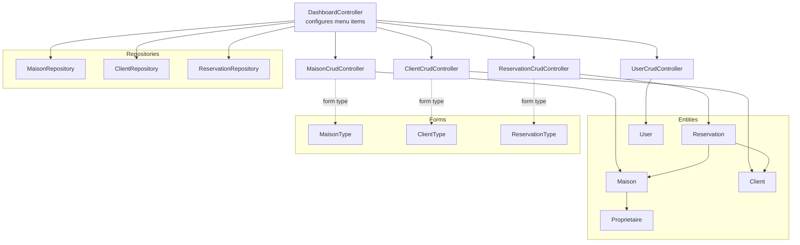
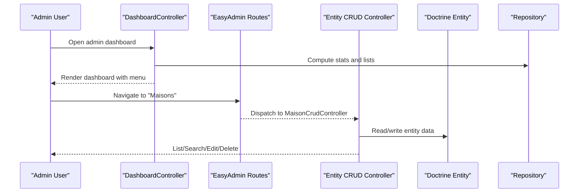
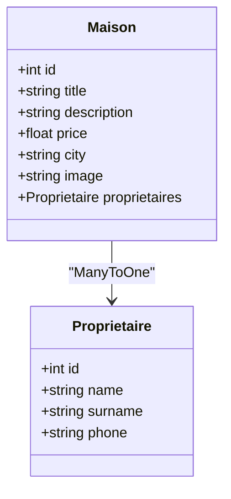
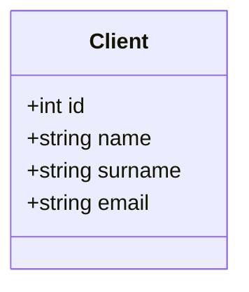
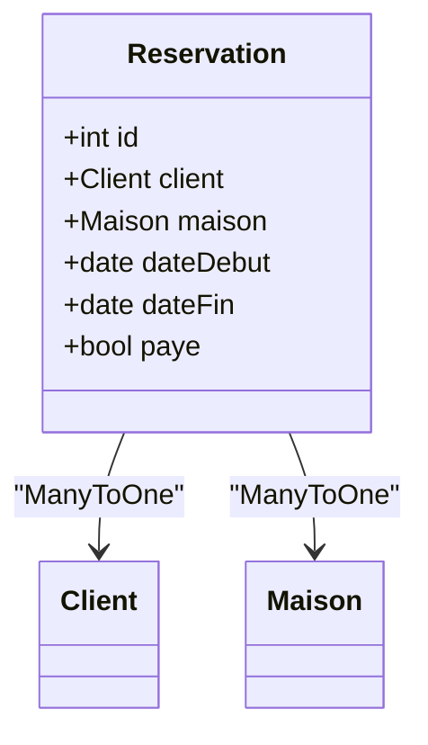
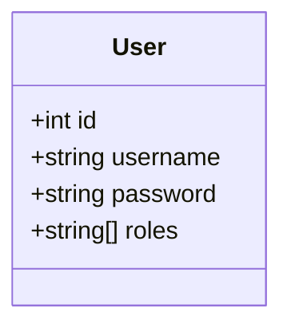
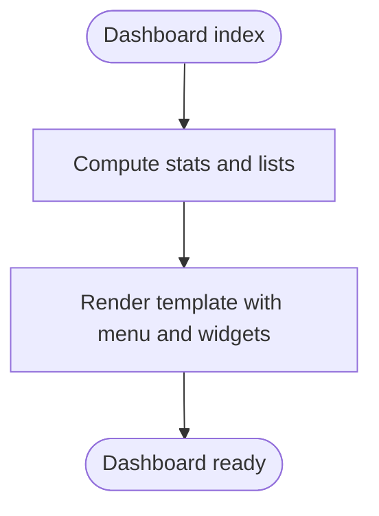
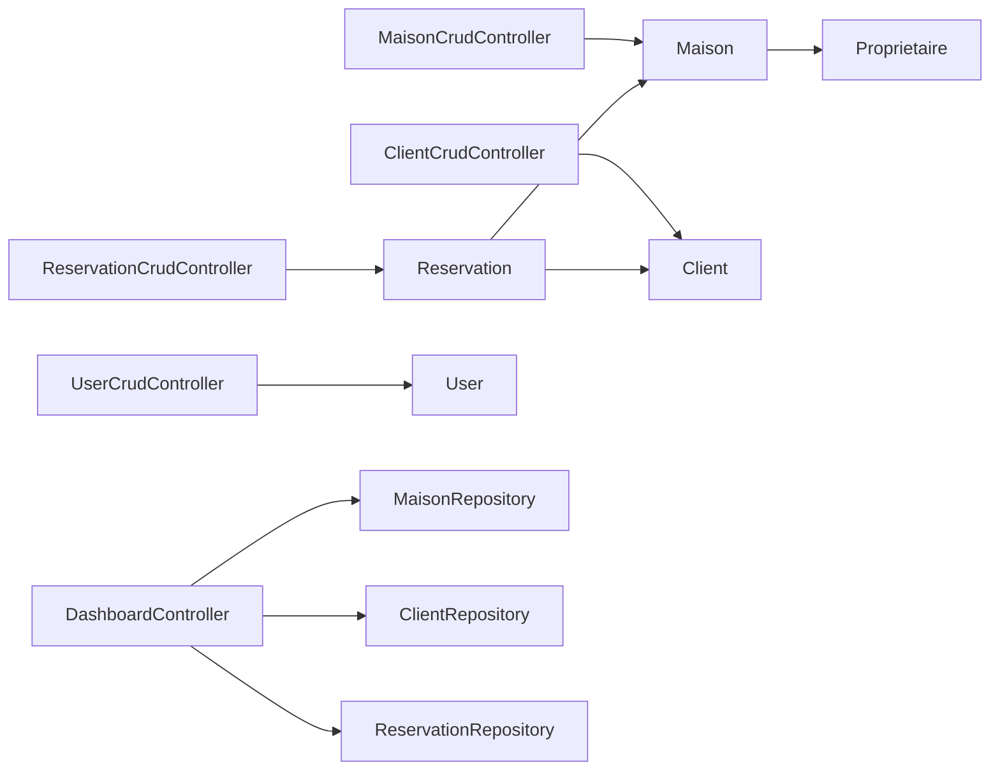

# CRUD Controllers

<cite>
**Referenced Files in This Document**
- [MaisonCrudController.php](file://src/Controller/Admin/MaisonCrudController.php)
- [ClientCrudController.php](file://src/Controller/Admin/ClientCrudController.php)
- [ReservationCrudController.php](file://src/Controller/Admin/ReservationCrudController.php)
- [UserCrudController.php](file://src/Controller/Admin/UserCrudController.php)
- [DashboardController.php](file://src/Controller/Admin/DashboardController.php)
- [Maison.php](file://src/Entity/Maison.php)
- [Client.php](file://src/Entity/Client.php)
- [Reservation.php](file://src/Entity/Reservation.php)
- [User.php](file://src/Entity/User.php)
- [Proprietaire.php](file://src/Entity/Proprietaire.php)
- [MaisonType.php](file://src/Form/MaisonType.php)
- [ClientType.php](file://src/Form/ClientType.php)
- [ReservationType.php](file://src/Form/ReservationType.php)
- [MaisonRepository.php](file://src/Repository/MaisonRepository.php)
- [ClientRepository.php](file://src/Repository/ClientRepository.php)
- [ReservationRepository.php](file://src/Repository/ReservationRepository.php)
- [easyadmin.yaml](file://config/routes/easyadmin.yaml)
</cite>

## Table of Contents
1. [Introduction](#introduction)
2. [Project Structure](#project-structure)
3. [Core Components](#core-components)
4. [Architecture Overview](#architecture-overview)
5. [Detailed Component Analysis](#detailed-component-analysis)
6. [Dependency Analysis](#dependency-analysis)
7. [Performance Considerations](#performance-considerations)
8. [Troubleshooting Guide](#troubleshooting-guide)
9. [Conclusion](#conclusion)

## Introduction
This document describes the EasyAdmin CRUD controllers for the entities Maison (House), Client, Reservation, and User. It explains how each controller is configured, which fields are exposed in the administrative interface, and how associations are handled. It also documents pagination, actions, and the dashboard menu integration. Validation and administrative workflows leverage the underlying Doctrine entities and Symfony forms.

## Project Structure
The administrative backend is organized around EasyAdmin controllers per entity, with supporting Doctrine entities, repositories, and Symfony forms. Routes are registered via EasyAdmin’s route loader.

**Diagram sources**
- [DashboardController.php:71-86](file://src/Controller/Admin/DashboardController.php#L71-L86)
- [MaisonCrudController.php:16-51](file://src/Controller/Admin/MaisonCrudController.php#L16-L51)
- [ClientCrudController.php:13-42](file://src/Controller/Admin/ClientCrudController.php#L13-L42)
- [ReservationCrudController.php:15-46](file://src/Controller/Admin/ReservationCrudController.php#L15-L46)
- [UserCrudController.php:15-44](file://src/Controller/Admin/UserCrudController.php#L15-L44)
- [Maison.php:32-34](file://src/Entity/Maison.php#L32-L34)
- [Reservation.php:17-23](file://src/Entity/Reservation.php#L17-L23)
- [MaisonRepository.php:12-46](file://src/Repository/MaisonRepository.php#L12-L46)
- [ClientRepository.php:12-35](file://src/Repository/ClientRepository.php#L12-L35)
- [ReservationRepository.php:13-92](file://src/Repository/ReservationRepository.php#L13-L92)
- [MaisonType.php:12-35](file://src/Form/MaisonType.php#L12-L35)
- [ClientType.php:10-27](file://src/Form/ClientType.php#L10-L27)
- [ReservationType.php:14-49](file://src/Form/ReservationType.php#L14-L49)

**Section sources**
- [easyadmin.yaml:1-4](file://config/routes/easyadmin.yaml#L1-L4)
- [DashboardController.php:71-86](file://src/Controller/Admin/DashboardController.php#L71-L86)

## Core Components
- MaisonCrudController: Manages the house entity with image upload configuration and pagination.
- ClientCrudController: Manages client profiles with basic contact fields.
- ReservationCrudController: Manages reservations with date ranges, payment status, and foreign keys to Client and Maison.
- UserCrudController: Manages application users with username, roles, and secure password handling.
- DashboardController: Provides the main navigation menu linking to each CRUD controller and renders summary statistics.

Key behaviors:
- Pagination: All controllers set page size and range size for efficient browsing.
- Actions: All controllers enable a “detail” action on the index view.
- Field visibility: Some fields are hidden on forms or indexes as appropriate (for example, ID and password).

**Section sources**
- [MaisonCrudController.php:23-51](file://src/Controller/Admin/MaisonCrudController.php#L23-L51)
- [ClientCrudController.php:20-42](file://src/Controller/Admin/ClientCrudController.php#L20-L42)
- [ReservationCrudController.php:22-46](file://src/Controller/Admin/ReservationCrudController.php#L22-L46)
- [UserCrudController.php:22-44](file://src/Controller/Admin/UserCrudController.php#L22-L44)
- [DashboardController.php:71-86](file://src/Controller/Admin/DashboardController.php#L71-L86)

## Architecture Overview
The administrative interface is driven by EasyAdmin controllers that map to Doctrine entities. The dashboard aggregates statistics and links to each CRUD section. Repositories encapsulate queries used by the dashboard.

**Diagram sources**
- [DashboardController.php:32-61](file://src/Controller/Admin/DashboardController.php#L32-L61)
- [easyadmin.yaml:1-4](file://config/routes/easyadmin.yaml#L1-L4)
- [MaisonCrudController.php:16-51](file://src/Controller/Admin/MaisonCrudController.php#L16-L51)

## Detailed Component Analysis

### Maison (House) CRUD
- Entity configuration:
  - Fields: title, description, price, city, image, and a ManyToOne to Proprietaire.
  - String representation returns the title for display.
- Controller configuration:
  - Fields: id (hidden on form), title, description, price, city, image with upload directory and pattern.
  - Pagination: page size and range size configured.
  - Actions: detail action added to index.
- Administrative workflow:
  - Create/edit houses with optional image upload.
  - Assign a proprietor via association field.
- Search and filtering:
  - No explicit filters configured in the controller; search relies on EasyAdmin defaults for text fields.

**Diagram sources**
- [Maison.php:10-117](file://src/Entity/Maison.php#L10-L117)
- [Proprietaire.php:9-69](file://src/Entity/Proprietaire.php#L9-L69)

**Section sources**
- [Maison.php:17-34](file://src/Entity/Maison.php#L17-L34)
- [MaisonCrudController.php:23-51](file://src/Controller/Admin/MaisonCrudController.php#L23-L51)
- [MaisonType.php:14-26](file://src/Form/MaisonType.php#L14-L26)

### Client CRUD
- Entity configuration:
  - Fields: name, surname, email.
  - String representation concatenates name and surname.
- Controller configuration:
  - Fields: id (hidden on form), name, surname, email.
  - Pagination and actions similar to other controllers.
- Administrative workflow:
  - Add or update client profiles with contact details.
- Search and filtering:
  - No explicit filters configured; EasyAdmin defaults apply.

**Diagram sources**
- [Client.php:9-70](file://src/Entity/Client.php#L9-L70)

**Section sources**
- [Client.php:16-23](file://src/Entity/Client.php#L16-L23)
- [ClientCrudController.php:20-42](file://src/Controller/Admin/ClientCrudController.php#L20-L42)
- [ClientType.php:12-18](file://src/Form/ClientType.php#L12-L18)

### Reservation CRUD
- Entity configuration:
  - Fields: client (ManyToOne), maison (ManyToOne), dateDebut, dateFin, paye (boolean).
- Controller configuration:
  - Fields: id (hidden on form), client, maison, dateDebut, dateFin, paye.
  - Pagination and actions similar to other controllers.
- Administrative workflow:
  - Create reservations linking clients to houses with date ranges and payment status.
- Search and filtering:
  - No explicit filters configured; EasyAdmin defaults apply.

**Diagram sources**
- [Reservation.php:10-99](file://src/Entity/Reservation.php#L10-L99)
- [Client.php:9-70](file://src/Entity/Client.php#L9-L70)
- [Maison.php:10-117](file://src/Entity/Maison.php#L10-L117)

**Section sources**
- [Reservation.php:17-32](file://src/Entity/Reservation.php#L17-L32)
- [ReservationCrudController.php:22-46](file://src/Controller/Admin/ReservationCrudController.php#L22-L46)
- [ReservationType.php:16-40](file://src/Form/ReservationType.php#L16-L40)

### User CRUD
- Entity configuration:
  - Implements UserInterface and PasswordAuthenticatedUserInterface.
  - Unique constraint on username; roles stored as an array.
  - Password is hashed and serialized securely.
- Controller configuration:
  - Fields: id (hidden on form), username, roles, password (hidden on index and detail).
  - Pagination and actions similar to other controllers.
- Administrative workflow:
  - Manage usernames, roles, and passwords for administrative access.
- Search and filtering:
  - No explicit filters configured; EasyAdmin defaults apply.

**Diagram sources**
- [User.php:14-118](file://src/Entity/User.php#L14-L118)

**Section sources**
- [User.php:21-34](file://src/Entity/User.php#L21-L34)
- [UserCrudController.php:22-44](file://src/Controller/Admin/UserCrudController.php#L22-L44)

### Dashboard and Navigation
- Menu items:
  - Links to Maison, Client, Reservation, Proprietaire, and User CRUD controllers.
  - Includes a link back to the public website.
- Statistics:
  - Counts of entities and pending payments.
  - Most reserved houses, houses by city, latest reservations, and latest houses.

**Diagram sources**
- [DashboardController.php:32-61](file://src/Controller/Admin/DashboardController.php#L32-L61)

**Section sources**
- [DashboardController.php:71-86](file://src/Controller/Admin/DashboardController.php#L71-L86)

## Dependency Analysis
- Controllers depend on their respective entities and repositories for dashboard statistics.
- Entities define relationships that controllers expose via AssociationField.
- Forms complement controllers by providing richer editing experiences in the public area.

**Diagram sources**
- [MaisonCrudController.php:16-51](file://src/Controller/Admin/MaisonCrudController.php#L16-L51)
- [ClientCrudController.php:13-42](file://src/Controller/Admin/ClientCrudController.php#L13-L42)
- [ReservationCrudController.php:15-46](file://src/Controller/Admin/ReservationCrudController.php#L15-L46)
- [UserCrudController.php:15-44](file://src/Controller/Admin/UserCrudController.php#L15-L44)
- [DashboardController.php:24-30](file://src/Controller/Admin/DashboardController.php#L24-L30)
- [Maison.php:32-34](file://src/Entity/Maison.php#L32-L34)
- [Reservation.php:17-23](file://src/Entity/Reservation.php#L17-L23)

**Section sources**
- [MaisonRepository.php:12-46](file://src/Repository/MaisonRepository.php#L12-L46)
- [ClientRepository.php:12-35](file://src/Repository/ClientRepository.php#L12-L35)
- [ReservationRepository.php:13-92](file://src/Repository/ReservationRepository.php#L13-L92)

## Performance Considerations
- Pagination: Page size and range size are configured to keep lists responsive.
- Queries: Repositories use optimized DQL queries for counts and top lists; consider adding indexes on frequently filtered columns (for example, city on Maison, dateDebut/dateFin on Reservation).
- Image uploads: Ensure upload directories are writable and consider limiting file sizes and types for performance and security.

## Troubleshooting Guide
- Image upload issues:
  - Verify upload directory permissions and paths configured in the controller.
  - Confirm the base path and upload directory match the configured asset location.
- Association selection:
  - Ensure related entities (Client, Maison, Proprietaire) exist before creating Reservations.
- Role and password handling:
  - When creating users, ensure roles are properly set and passwords are hashed before persisting.
- Menu navigation:
  - Confirm EasyAdmin routes are loaded so controllers are reachable.

**Section sources**
- [MaisonCrudController.php:32-35](file://src/Controller/Admin/MaisonCrudController.php#L32-L35)
- [UserCrudController.php:27-28](file://src/Controller/Admin/UserCrudController.php#L27-L28)
- [easyadmin.yaml:1-4](file://config/routes/easyadmin.yaml#L1-L4)

## Conclusion
The EasyAdmin controllers provide a streamlined administrative interface for managing houses, clients, reservations, and users. Field definitions, pagination, and actions are consistently configured across controllers. Associations are clearly mapped in the entities and surfaced in the controllers. The dashboard integrates statistics and navigation, while repositories support reporting needs. Extending functionality can focus on adding filters, custom actions, and validations aligned with the existing patterns.