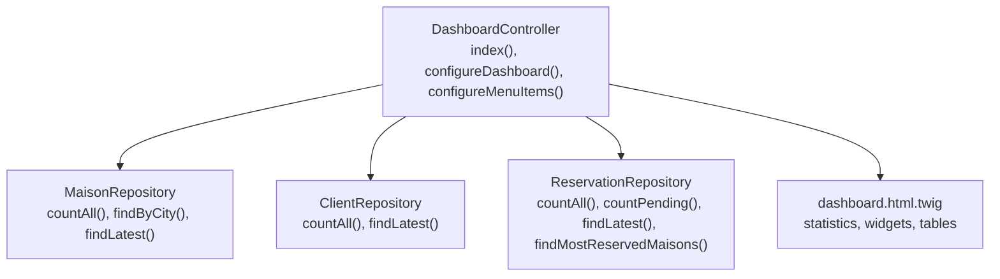
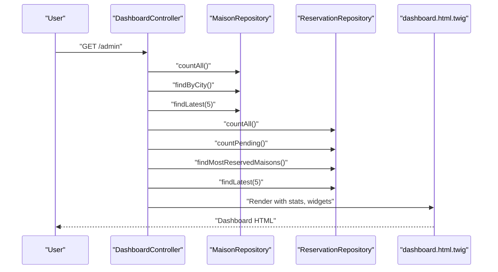
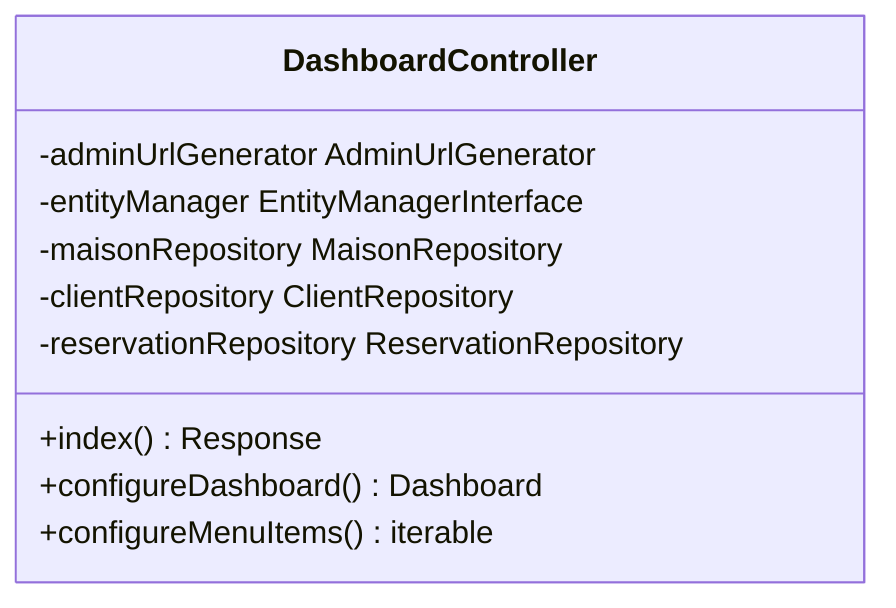
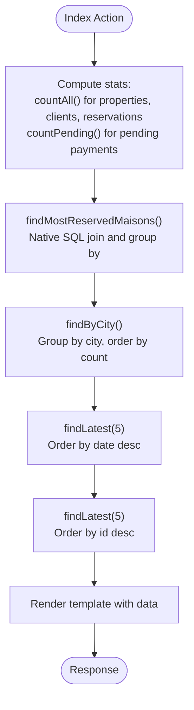
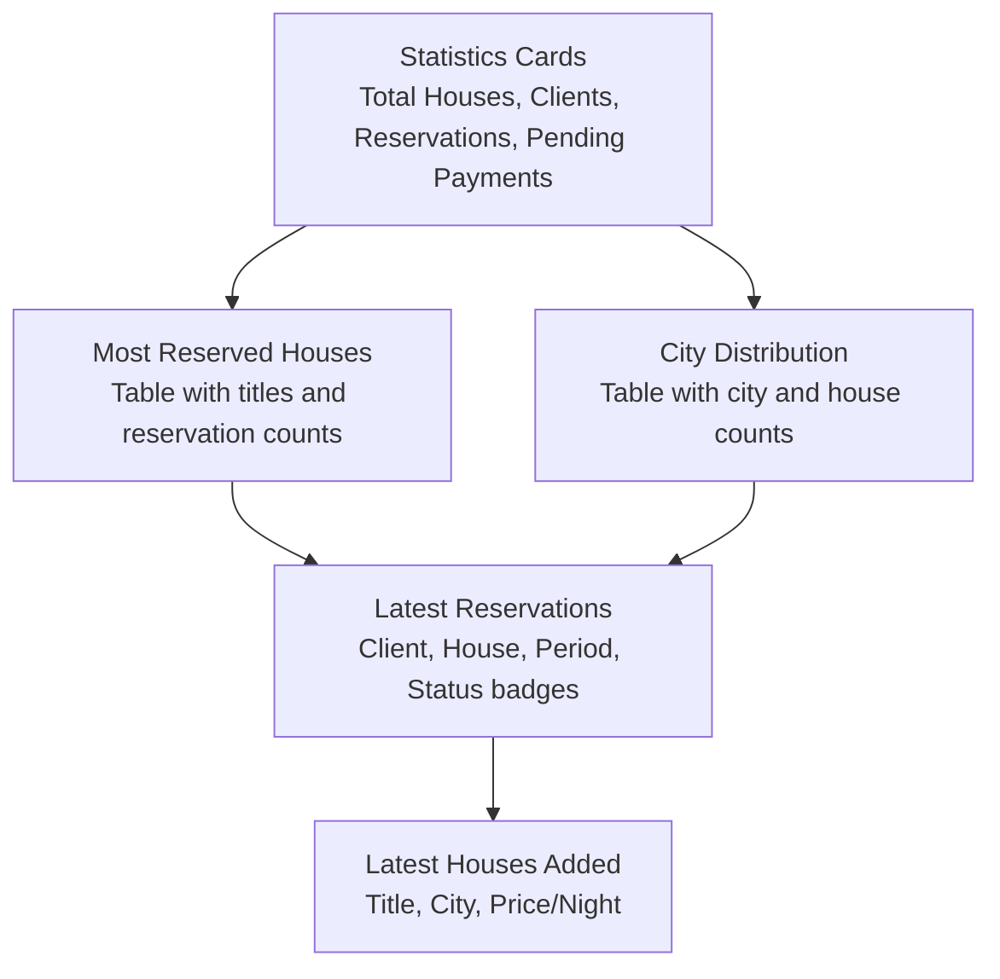
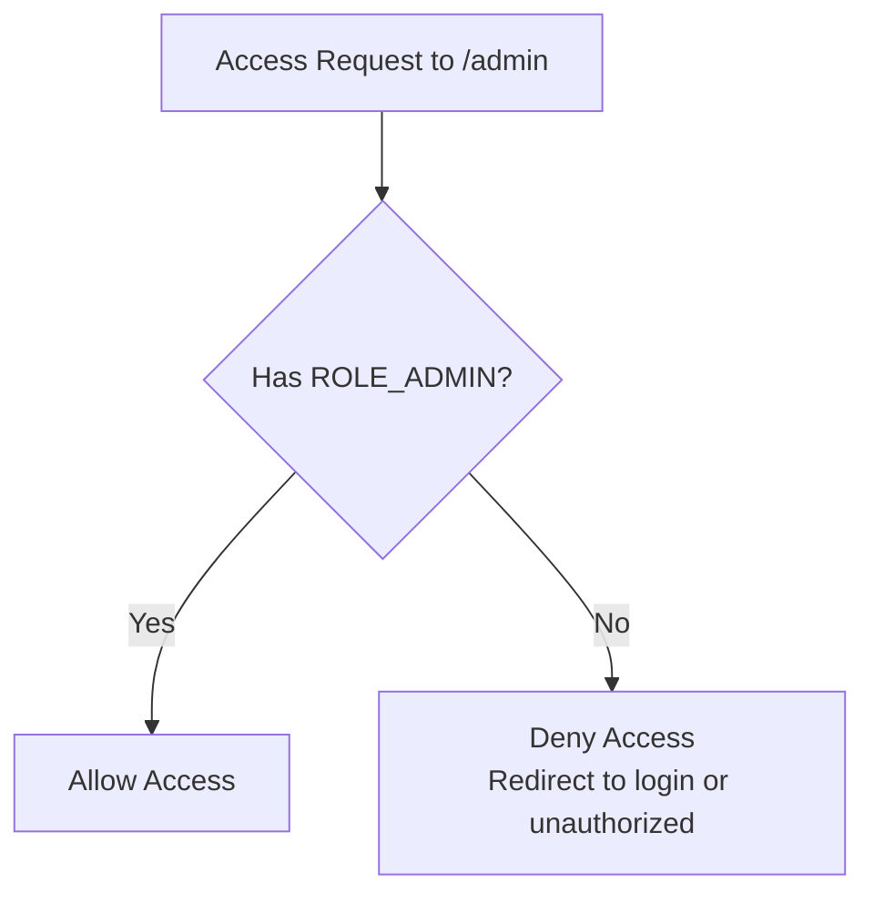
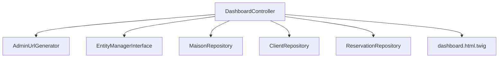

# Dashboard Configuration

<cite>
**Referenced Files in This Document**
- [DashboardController.php](file://src/Controller/Admin/DashboardController.php)
- [dashboard.html.twig](file://templates/admin/dashboard.html.twig)
- [MaisonRepository.php](file://src/Repository/MaisonRepository.php)
- [ClientRepository.php](file://src/Repository/ClientRepository.php)
- [ReservationRepository.php](file://src/Repository/ReservationRepository.php)
- [security.yaml](file://config/packages/security.yaml)
- [easyadmin.yaml](file://config/routes/easyadmin.yaml)
- [services.yaml](file://config/services.yaml)
</cite>

## Table of Contents
1. [Introduction](#introduction)
2. [Project Structure](#project-structure)
3. [Core Components](#core-components)
4. [Architecture Overview](#architecture-overview)
5. [Detailed Component Analysis](#detailed-component-analysis)
6. [Dependency Analysis](#dependency-analysis)
7. [Performance Considerations](#performance-considerations)
8. [Troubleshooting Guide](#troubleshooting-guide)
9. [Conclusion](#conclusion)
10. [Appendices](#appendices)

## Introduction
This document explains the EasyAdmin dashboard configuration for the guest house management application. It covers dashboard setup (title, favicon, layout), statistics display (counts, pending payments), widget areas (most reserved properties, city distribution, latest reservations, recent property additions), controller implementation, statistics calculation methods, and template rendering. It also documents security configuration, access control, and administrative interface customization. Finally, it provides practical examples for extending the dashboard with custom widgets, modifying layout, and implementing analytics.

## Project Structure
The dashboard is implemented using EasyAdmin’s controller-based approach. The main controller handles dashboard initialization, menu items, and data preparation. Repositories encapsulate statistics queries. The Twig template renders the dashboard UI with Bootstrap cards and tables.

**Diagram sources**
- [DashboardController.php:32-86](file://src/Controller/Admin/DashboardController.php#L32-L86)
- [MaisonRepository.php:19-45](file://src/Repository/MaisonRepository.php#L19-L45)
- [ClientRepository.php:19-34](file://src/Repository/ClientRepository.php#L19-L34)
- [ReservationRepository.php:20-68](file://src/Repository/ReservationRepository.php#L20-L68)
- [dashboard.html.twig:1-263](file://templates/admin/dashboard.html.twig#L1-L263)

**Section sources**
- [DashboardController.php:21-86](file://src/Controller/Admin/DashboardController.php#L21-L86)
- [dashboard.html.twig:1-263](file://templates/admin/dashboard.html.twig#L1-L263)

## Core Components
- DashboardController: Entry point for the admin dashboard. Prepares statistics and widget data, sets dashboard title, favicon, and maximized content mode, and defines menu items.
- Repositories: Provide optimized database queries for counts, grouped aggregations, and latest records.
- Template: Renders statistics cards and four dashboard widgets with responsive layout.

Key responsibilities:
- Statistics aggregation: total properties, clients, reservations, pending payments.
- Widget data: most reserved properties, city distribution, latest reservations, latest properties.
- UI presentation: Bootstrap-styled cards and tables with icons and badges.

**Section sources**
- [DashboardController.php:32-86](file://src/Controller/Admin/DashboardController.php#L32-L86)
- [MaisonRepository.php:19-45](file://src/Repository/MaisonRepository.php#L19-L45)
- [ClientRepository.php:19-34](file://src/Repository/ClientRepository.php#L19-L34)
- [ReservationRepository.php:20-68](file://src/Repository/ReservationRepository.php#L20-L68)
- [dashboard.html.twig:15-260](file://templates/admin/dashboard.html.twig#L15-L260)

## Architecture Overview
The dashboard follows a clean separation of concerns:
- Controller orchestrates data retrieval via repositories.
- Repositories encapsulate Doctrine ORM and native SQL for performance.
- Twig template renders the UI with minimal logic.

**Diagram sources**
- [DashboardController.php:32-61](file://src/Controller/Admin/DashboardController.php#L32-L61)
- [MaisonRepository.php:19-45](file://src/Repository/MaisonRepository.php#L19-L45)
- [ReservationRepository.php:20-68](file://src/Repository/ReservationRepository.php#L20-L68)
- [dashboard.html.twig:1-263](file://templates/admin/dashboard.html.twig#L1-L263)

## Detailed Component Analysis

### DashboardController
Responsibilities:
- Index action: computes statistics and widget datasets, passes them to the template.
- Dashboard configuration: sets title, favicon, and layout.
- Menu configuration: links to CRUD controllers and a return-to-site route.

Implementation highlights:
- Statistics: total properties, clients, reservations, pending payments.
- Widgets: most reserved properties (SQL aggregation), city distribution (group by), latest reservations and properties (ordered by date/id).

**Diagram sources**
- [DashboardController.php:24-86](file://src/Controller/Admin/DashboardController.php#L24-L86)

**Section sources**
- [DashboardController.php:32-86](file://src/Controller/Admin/DashboardController.php#L32-L86)

### Statistics Calculation Methods
Statistics are computed via dedicated repository methods:
- Total counts: countAll() for properties and clients; countAll() and countPending() for reservations.
- Aggregations: findMostReservedMaisons() uses a native SQL query joining reservations and properties; findByCity() groups by city and orders by count.
- Latest records: findLatest(limit) sorts by primary key or date to fetch newest entries.

**Diagram sources**
- [DashboardController.php:34-52](file://src/Controller/Admin/DashboardController.php#L34-L52)
- [MaisonRepository.php:27-45](file://src/Repository/MaisonRepository.php#L27-L45)
- [ReservationRepository.php:38-68](file://src/Repository/ReservationRepository.php#L38-L68)

**Section sources**
- [MaisonRepository.php:19-45](file://src/Repository/MaisonRepository.php#L19-L45)
- [ClientRepository.php:19-34](file://src/Repository/ClientRepository.php#L19-L34)
- [ReservationRepository.php:20-68](file://src/Repository/ReservationRepository.php#L20-L68)

### Template Rendering
The Twig template organizes the dashboard into:
- Statistics cards: total properties, clients, reservations, pending payments.
- Two widget columns: most reserved properties and city distribution.
- Two bottom columns: latest reservations and latest properties.

Each widget includes:
- Card header with icon and title.
- Responsive table with badges and status indicators.
- Empty-state handling when no data is available.

**Diagram sources**
- [dashboard.html.twig:15-260](file://templates/admin/dashboard.html.twig#L15-L260)

**Section sources**
- [dashboard.html.twig:15-260](file://templates/admin/dashboard.html.twig#L15-L260)

### Security Configuration and Access Control
Access control ensures only administrators can reach the dashboard:
- Roles: ROLE_ADMIN for /admin, ROLE_USER for general site access.
- Authentication: form_login with login and logout routes.
- Providers and hashers configured for the User entity.

**Diagram sources**
- [security.yaml:40-45](file://config/packages/security.yaml#L40-L45)

**Section sources**
- [security.yaml:14-45](file://config/packages/security.yaml#L14-L45)

### Administrative Interface Customization
Customization points:
- Dashboard title and favicon set in configureDashboard().
- Menu items defined in configureMenuItems() linking to CRUD controllers and a return route.
- Layout maximized content mode enabled.

These methods integrate with EasyAdmin’s fluent configuration API to tailor the admin UI.

**Section sources**
- [DashboardController.php:63-86](file://src/Controller/Admin/DashboardController.php#L63-L86)

## Dependency Analysis
The dashboard controller depends on repositories and the admin URL generator. Repositories depend on Doctrine ORM. The template depends on the controller-provided variables.

**Diagram sources**
- [DashboardController.php:24-30](file://src/Controller/Admin/DashboardController.php#L24-L30)
- [DashboardController.php:54-61](file://src/Controller/Admin/DashboardController.php#L54-L61)

**Section sources**
- [DashboardController.php:24-30](file://src/Controller/Admin/DashboardController.php#L24-L30)
- [services.yaml:13-29](file://config/services.yaml#L13-L29)

## Performance Considerations
- Prefer repository methods for aggregated queries to avoid loading full entity collections.
- Use limit clauses (e.g., findLatest with default 5) to cap widget sizes.
- Native SQL for complex joins (most reserved properties) can be efficient; ensure proper indexing on foreign keys and date columns.
- Consider caching for static dashboards if data updates are infrequent.

## Troubleshooting Guide
Common issues and resolutions:
- Missing data in widgets: verify repository queries and ensure entities are properly linked (foreign keys).
- Access denied to /admin: confirm user role assignment and firewall configuration.
- Empty statistics: check countAll() implementations and database connectivity.
- Layout not maximized: ensure configureDashboard() is called and not overridden elsewhere.

**Section sources**
- [DashboardController.php:63-69](file://src/Controller/Admin/DashboardController.php#L63-L69)
- [security.yaml:40-45](file://config/packages/security.yaml#L40-L45)

## Conclusion
The dashboard integrates EasyAdmin’s controller-driven approach with custom statistics and widgets. It provides a centralized overview of properties, clients, reservations, and pending payments, alongside actionable insights through city distribution and recent activity. Security is enforced via role-based access control, and the UI is customizable through EasyAdmin configuration methods.

## Appendices

### Adding Custom Dashboard Widgets
Steps:
- Extend the index action to compute additional metrics via existing or new repository methods.
- Pass the new dataset to the template in the render call.
- Add a new card or table in the Twig template to display the data.

Example references:
- Index action data preparation: [DashboardController.php:34-61](file://src/Controller/Admin/DashboardController.php#L34-L61)
- Template rendering blocks: [dashboard.html.twig:15-260](file://templates/admin/dashboard.html.twig#L15-L260)

### Modifying Dashboard Layout
Options:
- Change dashboard title and favicon in configureDashboard().
- Adjust content layout or branding via EasyAdmin’s configuration methods.

Reference:
- Dashboard configuration: [DashboardController.php:63-69](file://src/Controller/Admin/DashboardController.php#L63-L69)

### Implementing Dashboard Analytics
Approaches:
- Use ReservationRepository methods for revenue or occupancy analytics (e.g., monthly revenue aggregation).
- Add new repository methods for KPIs and render them in the template.

References:
- Monthly revenue method: [ReservationRepository.php:80-91](file://src/Repository/ReservationRepository.php#L80-L91)
- Template placeholders for analytics: [dashboard.html.twig:15-260](file://templates/admin/dashboard.html.twig#L15-L260)