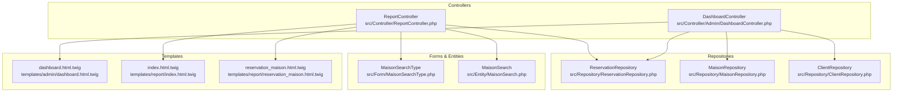
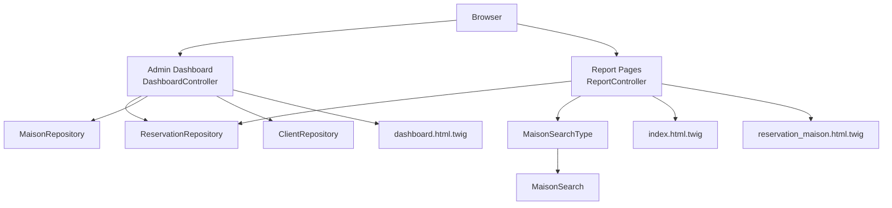
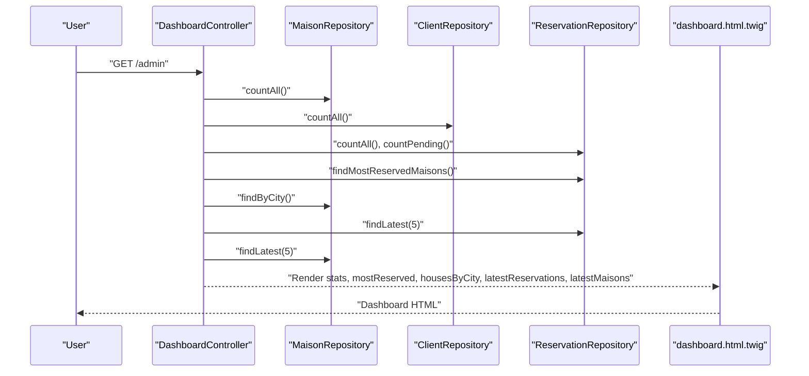
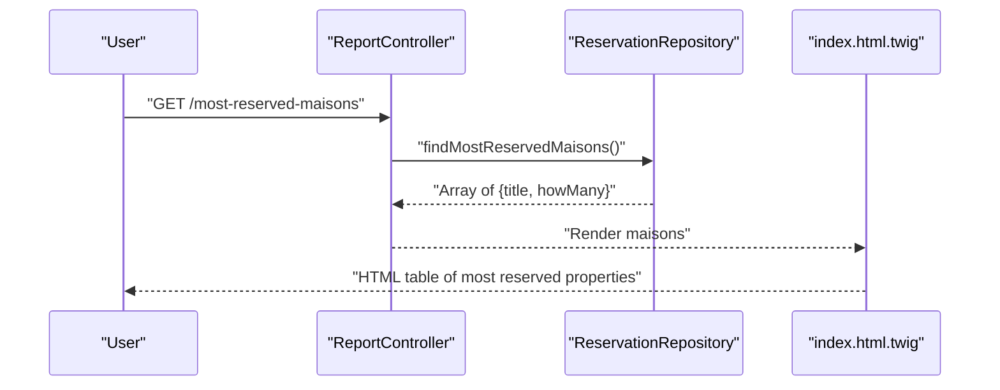
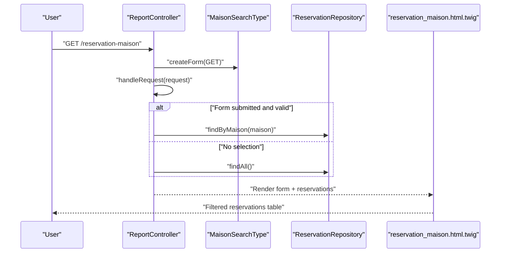
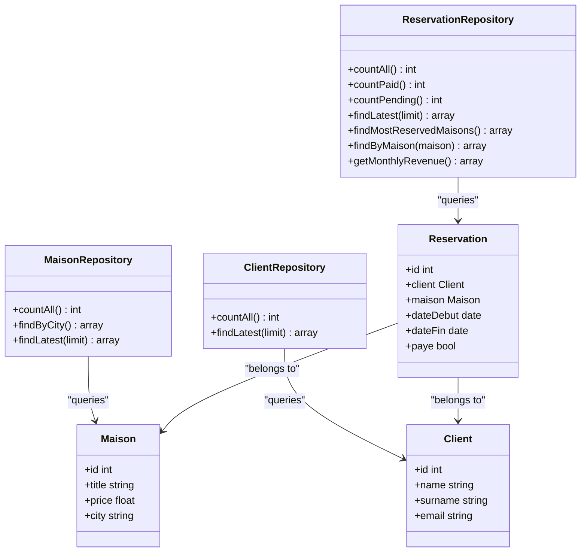
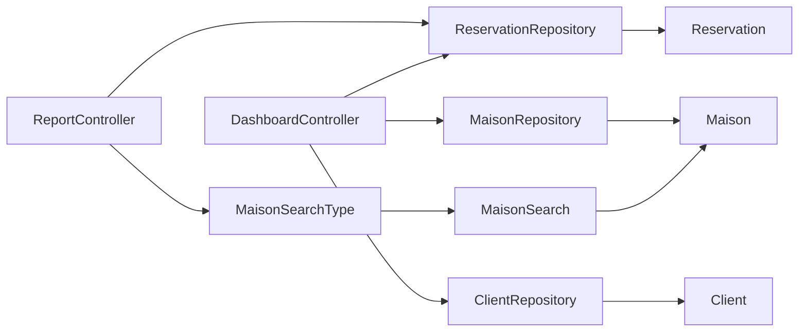

# Reporting and Analytics

<cite>
**Referenced Files in This Document**
- [ReportController.php](file://src/Controller/ReportController.php)
- [DashboardController.php](file://src/Controller/Admin/DashboardController.php)
- [dashboard.html.twig](file://templates/admin/dashboard.html.twig)
- [index.html.twig](file://templates/report/index.html.twig)
- [reservation_maison.html.twig](file://templates/report/reservation_maison.html.twig)
- [ReservationRepository.php](file://src/Repository/ReservationRepository.php)
- [MaisonRepository.php](file://src/Repository/MaisonRepository.php)
- [ClientRepository.php](file://src/Repository/ClientRepository.php)
- [MaisonSearchType.php](file://src/Form/MaisonSearchType.php)
- [MaisonSearch.php](file://src/Entity/MaisonSearch.php)
- [Reservation.php](file://src/Entity/Reservation.php)
- [Maison.php](file://src/Entity/Maison.php)
- [Client.php](file://src/Entity/Client.php)
</cite>

## Table of Contents
1. [Introduction](#introduction)
2. [Project Structure](#project-structure)
3. [Core Components](#core-components)
4. [Architecture Overview](#architecture-overview)
5. [Detailed Component Analysis](#detailed-component-analysis)
6. [Dependency Analysis](#dependency-analysis)
7. [Performance Considerations](#performance-considerations)
8. [Troubleshooting Guide](#troubleshooting-guide)
9. [Conclusion](#conclusion)
10. [Appendices](#appendices)

## Introduction
This document describes the administrative reporting and analytics system for the guest house management platform. It covers the dashboard statistics (property counts, client statistics, reservation metrics, and pending payment tracking), the most reserved properties reporting, city-based property distribution, and recent activity displays. It also documents the custom reporting templates, data visualization components, and business metrics presentation. The reporting controller implementation, data aggregation methods, and statistical calculations are explained, along with report customization, export capabilities, and administrative analytics dashboards. Practical examples demonstrate creating custom reports, implementing data filters, and generating business insights from administrative data.

## Project Structure
The reporting and analytics features are implemented across controllers, repositories, forms, and Twig templates:
- Controllers handle HTTP requests and orchestrate data retrieval and rendering.
- Repositories encapsulate data aggregation and statistical queries.
- Forms provide filtering mechanisms for targeted reporting.
- Twig templates render dashboards and report views.

**Diagram sources**
- [ReportController.php:1-54](file://src/Controller/ReportController.php#L1-L54)
- [DashboardController.php:1-88](file://src/Controller/Admin/DashboardController.php#L1-L88)
- [ReservationRepository.php:1-93](file://src/Repository/ReservationRepository.php#L1-L93)
- [MaisonRepository.php:1-47](file://src/Repository/MaisonRepository.php#L1-L47)
- [ClientRepository.php:1-36](file://src/Repository/ClientRepository.php#L1-L36)
- [MaisonSearchType.php:1-33](file://src/Form/MaisonSearchType.php#L1-L33)
- [MaisonSearch.php:1-19](file://src/Entity/MaisonSearch.php#L1-L19)
- [dashboard.html.twig:1-263](file://templates/admin/dashboard.html.twig#L1-L263)
- [index.html.twig:1-22](file://templates/report/index.html.twig#L1-L22)
- [reservation_maison.html.twig:1-42](file://templates/report/reservation_maison.html.twig#L1-L42)

**Section sources**
- [ReportController.php:1-54](file://src/Controller/ReportController.php#L1-L54)
- [DashboardController.php:1-88](file://src/Controller/Admin/DashboardController.php#L1-L88)
- [dashboard.html.twig:1-263](file://templates/admin/dashboard.html.twig#L1-L263)

## Core Components
- Administrative Dashboard: Aggregates and presents key business metrics, most reserved properties, city distribution, and recent activity.
- Reporting Routes: Provides specialized report pages for “Most Reserved Houses” and “Reservations by House.”
- Data Repositories: Implement counting, grouping, sorting, and custom SQL aggregations for statistics.
- Filtering Form: Enables filtering reservations by a specific property via a GET form.

Key responsibilities:
- DashboardController: Collects stats, executes repository queries, and renders the admin dashboard.
- ReportController: Renders report pages and applies filters for reservations by property.
- Repositories: Provide count totals, pending payments, latest records, grouped city counts, most reserved properties, and monthly revenue.
- Forms and Entities: Support property-based filtering for reservation reports.

**Section sources**
- [DashboardController.php:32-61](file://src/Controller/Admin/DashboardController.php#L32-L61)
- [ReportController.php:15-53](file://src/Controller/ReportController.php#L15-L53)
- [ReservationRepository.php:20-91](file://src/Repository/ReservationRepository.php#L20-L91)
- [MaisonRepository.php:19-45](file://src/Repository/MaisonRepository.php#L19-L45)
- [ClientRepository.php:19-34](file://src/Repository/ClientRepository.php#L19-L34)
- [MaisonSearchType.php:14-32](file://src/Form/MaisonSearchType.php#L14-L32)
- [MaisonSearch.php:7-18](file://src/Entity/MaisonSearch.php#L7-L18)

## Architecture Overview
The reporting and analytics architecture follows a layered pattern:
- Presentation Layer: Twig templates render dashboards and reports.
- Controller Layer: Controllers coordinate data retrieval and view rendering.
- Repository Layer: Repositories encapsulate data access and aggregation logic.
- Domain Entities: Define the data model and relationships.

**Diagram sources**
- [DashboardController.php:21-87](file://src/Controller/Admin/DashboardController.php#L21-L87)
- [ReportController.php:13-53](file://src/Controller/ReportController.php#L13-L53)
- [ReservationRepository.php:13-92](file://src/Repository/ReservationRepository.php#L13-L92)
- [MaisonRepository.php:12-46](file://src/Repository/MaisonRepository.php#L12-L46)
- [ClientRepository.php:12-35](file://src/Repository/ClientRepository.php#L12-L35)
- [MaisonSearchType.php:12-32](file://src/Form/MaisonSearchType.php#L12-L32)
- [MaisonSearch.php:5-18](file://src/Entity/MaisonSearch.php#L5-L18)
- [dashboard.html.twig:1-263](file://templates/admin/dashboard.html.twig#L1-L263)
- [index.html.twig:1-22](file://templates/report/index.html.twig#L1-L22)
- [reservation_maison.html.twig:1-42](file://templates/report/reservation_maison.html.twig#L1-L42)

## Detailed Component Analysis

### Administrative Dashboard
The dashboard aggregates:
- Property counts: total number of houses.
- Client statistics: total number of clients.
- Reservation metrics: total reservations and pending payments.
- Most reserved properties: top properties by reservation count.
- City-based property distribution: top cities by house count.
- Recent activity: latest reservations and newly added houses.

Rendering logic:
- Statistics cards present aggregated counts.
- Most reserved properties are shown in a table with reservation counts.
- City distribution table lists top cities and house counts.
- Recent activity tables display latest reservations with payment status and latest houses with pricing.

**Diagram sources**
- [DashboardController.php:32-61](file://src/Controller/Admin/DashboardController.php#L32-L61)
- [MaisonRepository.php:19-35](file://src/Repository/MaisonRepository.php#L19-L35)
- [ClientRepository.php:19-24](file://src/Repository/ClientRepository.php#L19-L24)
- [ReservationRepository.php:20-46](file://src/Repository/ReservationRepository.php#L20-L46)
- [ReservationRepository.php:57-68](file://src/Repository/ReservationRepository.php#L57-L68)
- [dashboard.html.twig:15-260](file://templates/admin/dashboard.html.twig#L15-L260)

**Section sources**
- [DashboardController.php:32-61](file://src/Controller/Admin/DashboardController.php#L32-L61)
- [dashboard.html.twig:15-260](file://templates/admin/dashboard.html.twig#L15-L260)

### Most Reserved Properties Report
This report lists properties ordered by the number of reservations. The controller delegates the calculation to the repository using a custom SQL query that joins reservations with properties, groups by property title, and orders by reservation count.

**Diagram sources**
- [ReportController.php:15-22](file://src/Controller/ReportController.php#L15-L22)
- [ReservationRepository.php:57-68](file://src/Repository/ReservationRepository.php#L57-L68)
- [index.html.twig:8-20](file://templates/report/index.html.twig#L8-L20)

**Section sources**
- [ReportController.php:15-22](file://src/Controller/ReportController.php#L15-L22)
- [ReservationRepository.php:57-68](file://src/Repository/ReservationRepository.php#L57-L68)
- [index.html.twig:8-20](file://templates/report/index.html.twig#L8-L20)

### Reservations by Property Report with Filters
This report allows filtering reservations by a specific property using a GET form. The controller:
- Creates a MaisonSearchType form configured for GET method.
- Submits and handles the form.
- Retrieves all reservations by default or filters by the selected property.
- Renders a table of reservations with dates and property titles.

**Diagram sources**
- [ReportController.php:24-53](file://src/Controller/ReportController.php#L24-L53)
- [MaisonSearchType.php:14-32](file://src/Form/MaisonSearchType.php#L14-L32)
- [ReservationRepository.php:70-78](file://src/Repository/ReservationRepository.php#L70-L78)
- [reservation_maison.html.twig:8-41](file://templates/report/reservation_maison.html.twig#L8-L41)

**Section sources**
- [ReportController.php:24-53](file://src/Controller/ReportController.php#L24-L53)
- [MaisonSearchType.php:14-32](file://src/Form/MaisonSearchType.php#L14-L32)
- [MaisonSearch.php:7-18](file://src/Entity/MaisonSearch.php#L7-L18)
- [ReservationRepository.php:70-78](file://src/Repository/ReservationRepository.php#L70-L78)
- [reservation_maison.html.twig:8-41](file://templates/report/reservation_maison.html.twig#L8-L41)

### Data Aggregation Methods and Statistical Calculations
Repositories implement the following aggregation methods:
- Counting:
  - Total reservations, paid reservations, pending reservations.
  - Total properties and clients.
- Sorting and limiting:
  - Latest reservations and properties.
- Grouping and ordering:
  - Most reserved properties by count.
  - Properties by city with counts.
- Monthly revenue:
  - Revenue computed from price and duration for paid reservations.

**Diagram sources**
- [ReservationRepository.php:13-92](file://src/Repository/ReservationRepository.php#L13-L92)
- [MaisonRepository.php:12-46](file://src/Repository/MaisonRepository.php#L12-L46)
- [ClientRepository.php:12-35](file://src/Repository/ClientRepository.php#L12-L35)
- [Reservation.php:10-98](file://src/Entity/Reservation.php#L10-L98)
- [Maison.php:10-111](file://src/Entity/Maison.php#L10-L111)
- [Client.php:9-69](file://src/Entity/Client.php#L9-L69)

**Section sources**
- [ReservationRepository.php:20-91](file://src/Repository/ReservationRepository.php#L20-L91)
- [MaisonRepository.php:19-45](file://src/Repository/MaisonRepository.php#L19-L45)
- [ClientRepository.php:19-34](file://src/Repository/ClientRepository.php#L19-L34)

### Business Metrics Presentation
The dashboard presents:
- Statistics cards for total properties, clients, reservations, and pending payments.
- Most reserved properties table with reservation counts.
- City distribution table with house counts.
- Recent activity tables for latest reservations and newly added properties.

These visuals are rendered using Bootstrap-styled tables and badges for status indicators.

**Section sources**
- [dashboard.html.twig:15-260](file://templates/admin/dashboard.html.twig#L15-L260)

### Custom Reporting Templates
- Most Reserved Houses: Displays a simple table of property titles and reservation counts.
- Reservations by House: Provides a filterable table of reservations with property details.

Templates leverage form rendering helpers and conditional blocks for empty states.

**Section sources**
- [index.html.twig:1-22](file://templates/report/index.html.twig#L1-L22)
- [reservation_maison.html.twig:1-42](file://templates/report/reservation_maison.html.twig#L1-L42)

### Data Visualization Components
- Dashboard cards: Numeric summaries with icons.
- Tables: Structured listings for most reserved properties, city distribution, recent reservations, and latest properties.
- Status badges: Paid vs pending indicators for reservations.

**Section sources**
- [dashboard.html.twig:15-260](file://templates/admin/dashboard.html.twig#L15-L260)

### Report Customization and Export Capabilities
- Customization:
  - Extend repository methods to add new aggregations (e.g., revenue by period).
  - Add new filters via forms and update controllers to handle parameters.
  - Customize dashboard widgets by adding new repository queries and template sections.
- Export:
  - Current templates render HTML tables. To enable exports, integrate CSV/PDF libraries in controllers and add export actions that render appropriate content types.

[No sources needed since this section provides general guidance]

## Dependency Analysis
The reporting system exhibits clear separation of concerns:
- Controllers depend on repositories for data.
- Repositories depend on Doctrine ORM for persistence.
- Forms depend on entities for data binding.
- Templates depend on controller-provided data arrays.

**Diagram sources**
- [ReportController.php:13-53](file://src/Controller/ReportController.php#L13-L53)
- [DashboardController.php:24-61](file://src/Controller/Admin/DashboardController.php#L24-L61)
- [ReservationRepository.php:13-92](file://src/Repository/ReservationRepository.php#L13-L92)
- [MaisonRepository.php:12-46](file://src/Repository/MaisonRepository.php#L12-L46)
- [ClientRepository.php:12-35](file://src/Repository/ClientRepository.php#L12-L35)
- [MaisonSearchType.php:12-32](file://src/Form/MaisonSearchType.php#L12-L32)
- [MaisonSearch.php:5-18](file://src/Entity/MaisonSearch.php#L5-L18)
- [Reservation.php:10-98](file://src/Entity/Reservation.php#L10-L98)
- [Maison.php:10-111](file://src/Entity/Maison.php#L10-L111)
- [Client.php:9-69](file://src/Entity/Client.php#L9-L69)

**Section sources**
- [ReportController.php:13-53](file://src/Controller/ReportController.php#L13-L53)
- [DashboardController.php:24-61](file://src/Controller/Admin/DashboardController.php#L24-L61)
- [ReservationRepository.php:13-92](file://src/Repository/ReservationRepository.php#L13-L92)
- [MaisonRepository.php:12-46](file://src/Repository/MaisonRepository.php#L12-L46)
- [ClientRepository.php:12-35](file://src/Repository/ClientRepository.php#L12-L35)

## Performance Considerations
- Prefer repository methods that use SQL aggregation to avoid loading unnecessary entities.
- Limit result sets for “latest” queries to reduce payload sizes.
- Use indexed columns for joins and filters (e.g., property foreign keys).
- Cache frequently accessed dashboard metrics if data volume grows significantly.

[No sources needed since this section provides general guidance]

## Troubleshooting Guide
Common issues and resolutions:
- Empty dashboard rows: Ensure repository queries return data; verify database content and relationships.
- Filter not applied: Confirm form submission and parameter handling; check form configuration for GET method.
- Incorrect counts: Validate repository count queries and parameter bindings.
- Template rendering errors: Verify variable existence and type in templates.

**Section sources**
- [dashboard.html.twig:105-107](file://templates/admin/dashboard.html.twig#L105-L107)
- [reservation_maison.html.twig:35-39](file://templates/report/reservation_maison.html.twig#L35-L39)

## Conclusion
The administrative reporting and analytics system provides a solid foundation for monitoring key business metrics, identifying top-performing properties, understanding geographic distribution, and tracking recent activity. The modular design enables straightforward extension for additional reports, filters, and export capabilities while maintaining clean separation of concerns.

[No sources needed since this section summarizes without analyzing specific files]

## Appendices

### Creating Custom Reports
Steps to add a new report:
- Create a controller action that orchestrates data retrieval via repositories.
- Implement a repository method for the desired aggregation or filter.
- Build a Twig template to render the report data.
- Register a route for the new report action.

Example references:
- New controller action: [ReportController.php:15-22](file://src/Controller/ReportController.php#L15-L22)
- Repository aggregation: [ReservationRepository.php:57-68](file://src/Repository/ReservationRepository.php#L57-L68)
- Report template: [index.html.twig:1-22](file://templates/report/index.html.twig#L1-L22)

**Section sources**
- [ReportController.php:15-22](file://src/Controller/ReportController.php#L15-L22)
- [ReservationRepository.php:57-68](file://src/Repository/ReservationRepository.php#L57-L68)
- [index.html.twig:1-22](file://templates/report/index.html.twig#L1-L22)

### Implementing Data Filters
To add filters:
- Extend the form type to include new fields.
- Update the controller to handle form submission and apply filters.
- Adjust repository methods to accept parameters and refine queries.

Example references:
- Form type: [MaisonSearchType.php:14-32](file://src/Form/MaisonSearchType.php#L14-L32)
- Controller filter handling: [ReportController.php:24-53](file://src/Controller/ReportController.php#L24-L53)
- Repository filtering: [ReservationRepository.php:70-78](file://src/Repository/ReservationRepository.php#L70-L78)

**Section sources**
- [MaisonSearchType.php:14-32](file://src/Form/MaisonSearchType.php#L14-L32)
- [ReportController.php:24-53](file://src/Controller/ReportController.php#L24-L53)
- [ReservationRepository.php:70-78](file://src/Repository/ReservationRepository.php#L70-L78)

### Generating Business Insights
Use the existing metrics to derive insights:
- Compare pending payments against total reservations to assess cash flow trends.
- Analyze most reserved properties to identify peak seasons or popular features.
- Review city distribution to guide expansion or marketing efforts.
- Monitor recent activity to track growth and responsiveness.

[No sources needed since this section provides general guidance]