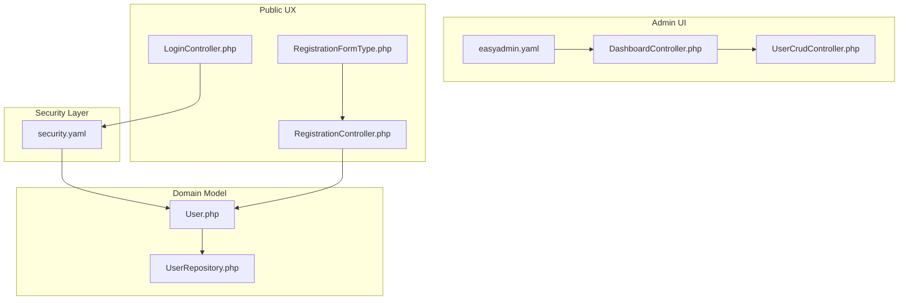
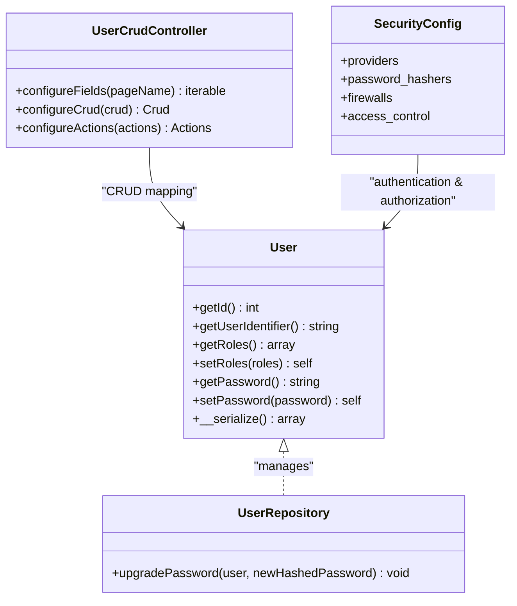
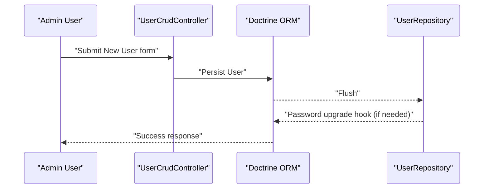
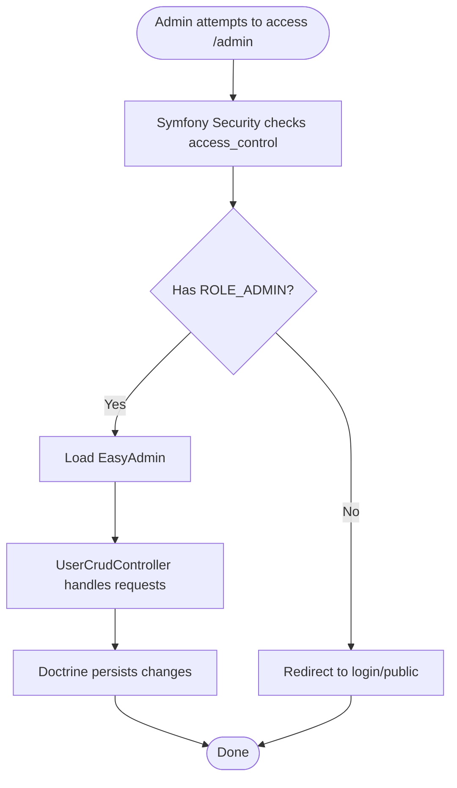
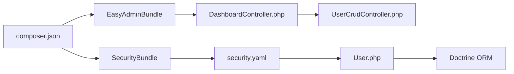

# User Administration

<cite>
**Referenced Files in This Document**
- [User.php](file://src/Entity/User.php)
- [UserRepository.php](file://src/Repository/UserRepository.php)
- [UserCrudController.php](file://src/Controller/Admin/UserCrudController.php)
- [DashboardController.php](file://src/Controller/Admin/DashboardController.php)
- [security.yaml](file://config/packages/security.yaml)
- [easyadmin.yaml](file://config/routes/easyadmin.yaml)
- [bundles.php](file://config/bundles.php)
- [RegistrationController.php](file://src/Controller/RegistrationController.php)
- [RegistrationFormType.php](file://src/Form/RegistrationFormType.php)
- [LoginController.php](file://src/Controller/LoginController.php)
- [composer.json](file://composer.json)
- [dashboard.html.twig](file://templates/admin/dashboard.html.twig)
</cite>

## Table of Contents
1. [Introduction](#introduction)
2. [Project Structure](#project-structure)
3. [Core Components](#core-components)
4. [Architecture Overview](#architecture-overview)
5. [Detailed Component Analysis](#detailed-component-analysis)
6. [Dependency Analysis](#dependency-analysis)
7. [Performance Considerations](#performance-considerations)
8. [Troubleshooting Guide](#troubleshooting-guide)
9. [Conclusion](#conclusion)
10. [Appendices](#appendices)

## Introduction
This document describes the administrative user management system built with Symfony and EasyAdmin. It explains how users are represented as an Entity, how roles and permissions are configured via Symfony Security, and how administrators manage users through the EasyAdmin interface. It covers user creation, modification, and deletion workflows, role-based access control, authentication management, and administrative permissions. It also documents password handling, account-related business logic, and UI customization for the admin panel.

## Project Structure
The user administration system spans several layers:
- Domain model: the User entity and its repository
- Security configuration: password hashing, user provider, firewalls, and access control
- Administrative UI: EasyAdmin controllers and dashboard menu
- Public registration and login flows: separate from EasyAdmin but integrated with the same User entity

**Diagram sources**
- [security.yaml:1-55](file://config/packages/security.yaml#L1-L55)
- [User.php:1-119](file://src/Entity/User.php#L1-L119)
- [UserRepository.php:1-61](file://src/Repository/UserRepository.php#L1-L61)
- [DashboardController.php:1-88](file://src/Controller/Admin/DashboardController.php#L1-L88)
- [UserCrudController.php:1-44](file://src/Controller/Admin/UserCrudController.php#L1-L44)
- [easyadmin.yaml:1-4](file://config/routes/easyadmin.yaml#L1-L4)
- [RegistrationController.php:1-44](file://src/Controller/RegistrationController.php#L1-L44)
- [RegistrationFormType.php:1-56](file://src/Form/RegistrationFormType.php#L1-L56)
- [LoginController.php:1-22](file://src/Controller/LoginController.php#L1-L22)

**Section sources**
- [User.php:1-119](file://src/Entity/User.php#L1-L119)
- [UserRepository.php:1-61](file://src/Repository/UserRepository.php#L1-L61)
- [UserCrudController.php:1-44](file://src/Controller/Admin/UserCrudController.php#L1-L44)
- [DashboardController.php:1-88](file://src/Controller/Admin/DashboardController.php#L1-L88)
- [security.yaml:1-55](file://config/packages/security.yaml#L1-L55)
- [easyadmin.yaml:1-4](file://config/routes/easyadmin.yaml#L1-L4)
- [RegistrationController.php:1-44](file://src/Controller/RegistrationController.php#L1-L44)
- [RegistrationFormType.php:1-56](file://src/Form/RegistrationFormType.php#L1-L56)
- [LoginController.php:1-22](file://src/Controller/LoginController.php#L1-L22)

## Core Components
- User entity: defines identity, credentials, and roles; ensures a minimum default role for all users
- User repository: integrates with Symfony’s password upgrade mechanism
- EasyAdmin user controller: exposes CRUD fields for username, roles, and password
- Security configuration: password hashing, user provider, form login, logout, and access control
- Registration and login controllers: handle public user onboarding and authentication

Key responsibilities:
- Identity and roles: managed by the User entity and enforced by Symfony Security
- Password lifecycle: hashing during registration and automatic upgrades via the repository
- Admin CRUD: EasyAdmin fields expose username, roles, and password while hiding sensitive fields on index/detail
- Access control: path-based rules enforce ROLE_ADMIN for the admin area and ROLE_USER for general access

**Section sources**
- [User.php:14-119](file://src/Entity/User.php#L14-L119)
- [UserRepository.php:15-34](file://src/Repository/UserRepository.php#L15-L34)
- [UserCrudController.php:15-44](file://src/Controller/Admin/UserCrudController.php#L15-L44)
- [security.yaml:4-45](file://config/packages/security.yaml#L4-L45)
- [RegistrationController.php:17-38](file://src/Controller/RegistrationController.php#L17-L38)
- [LoginController.php:9-21](file://src/Controller/LoginController.php#L9-L21)

## Architecture Overview
The system integrates Symfony Security with EasyAdmin to provide a secure administrative interface for user management. The User entity is the central domain object, used by both the public registration/login flows and the admin interface. EasyAdmin delegates persistence to Doctrine repositories, which in turn use the User entity.

**Diagram sources**
- [User.php:14-119](file://src/Entity/User.php#L14-L119)
- [UserRepository.php:15-34](file://src/Repository/UserRepository.php#L15-L34)
- [UserCrudController.php:15-44](file://src/Controller/Admin/UserCrudController.php#L15-L44)
- [security.yaml:4-45](file://config/packages/security.yaml#L4-L45)

## Detailed Component Analysis

### User Entity Configuration
- Identity: username serves as the primary identifier and UserInterface identifier
- Roles: stored as an array and guaranteed to include at least the default user role
- Password: persisted as a hashed value; serialization avoids exposing raw hashes
- Validation: unique username constraint prevents duplicates

Operational implications:
- Role management is centralized in the entity; no separate role entity is used
- Default role enforcement ensures consistent baseline permissions
- Password serialization mitigates accidental exposure of hashed passwords in sessions

**Section sources**
- [User.php:14-119](file://src/Entity/User.php#L14-L119)

### Role Assignments and Permission Management via EasyAdmin
- Fields exposed in the admin:
  - Username: editable
  - Roles: editable array field
  - Password: hidden from index and detail views
- Pagination and action customization:
  - Paginators configured for efficient browsing
  - Additional detail action added on the index view

Administrative workflows:
- Creation: fill username and roles; leave password blank (handled by backend)
- Modification: adjust roles to grant or revoke privileges
- Deletion: remove users when accounts are no longer needed

Note: Password changes are not exposed in the admin form; use the registration flow or programmatic updates to change passwords.

**Section sources**
- [UserCrudController.php:22-44](file://src/Controller/Admin/UserCrudController.php#L22-L44)

### Role-Based Access Control (RBAC)
- Access control rules:
  - Public pages: login, register, forgot-password are publicly accessible
  - Admin area: requires ROLE_ADMIN
  - General site: requires ROLE_USER
- Impersonation: switch_user is available but disabled by default

Practical outcomes:
- Only users with ROLE_ADMIN can access EasyAdmin
- All authenticated users receive ROLE_USER by default
- Public routes bypass authentication

**Section sources**
- [security.yaml:40-45](file://config/packages/security.yaml#L40-L45)

### Authentication Management
- Provider: entity provider using the User class and username property
- Password hashing: automatic algorithm selection for the User entity
- Form login: configured with login and check paths, plus post-login redirect
- Logout: configured with a dedicated logout path and target redirect

Integration points:
- Login form renders last username and error messages
- Successful login redirects to the main site index

**Section sources**
- [security.yaml:8-35](file://config/packages/security.yaml#L8-L35)
- [LoginController.php:9-21](file://src/Controller/LoginController.php#L9-L21)

### Password Administration
- Registration flow:
  - Plain-text password collected via a form field
  - Hashed via the password hasher and persisted
- Password upgrades:
  - The repository implements the upgrade interface to rehash passwords over time

Guidelines:
- Do not manually edit hashed passwords in the admin; use the registration controller or the upgrade mechanism
- Ensure password constraints are met during registration

**Section sources**
- [RegistrationController.php:17-38](file://src/Controller/RegistrationController.php#L17-L38)
- [RegistrationFormType.php:29-45](file://src/Form/RegistrationFormType.php#L29-L45)
- [UserRepository.php:25-34](file://src/Repository/UserRepository.php#L25-L34)

### Administrative Permissions and UI Customization
- EasyAdmin dashboard:
  - Menu items include a link to the Users section
  - Dashboard template extends EasyAdmin layout and adds custom branding
- Route wiring:
  - EasyAdmin routes are loaded globally via the easyadmin route loader

Access to admin:
- The navigation link to the admin is visible only to authenticated users with ROLE_ADMIN

**Section sources**
- [DashboardController.php:71-86](file://src/Controller/Admin/DashboardController.php#L71-L86)
- [dashboard.html.twig:1-263](file://templates/admin/dashboard.html.twig#L1-L263)
- [easyadmin.yaml:1-4](file://config/routes/easyadmin.yaml#L1-L4)
- [bundles.php:17-17](file://config/bundles.php#L17-L17)

### User Creation, Modification, and Deletion Workflows
- Creation:
  - Use the admin “New” action to create a user with username and roles
  - Set a temporary or generated password; the system will hash it on save
- Modification:
  - Adjust roles to reflect desired permissions
  - Update username if needed
- Deletion:
  - Remove users from the admin list; ensure no dependent records prevent cascade deletion

**Diagram sources**
- [UserCrudController.php:22-30](file://src/Controller/Admin/UserCrudController.php#L22-L30)
- [UserRepository.php:25-34](file://src/Repository/UserRepository.php#L25-L34)

### User Profile Management and Account Status Controls
- Profile fields:
  - Username and roles are the primary attributes managed in the admin
  - Password is handled securely via hashing and not exposed in admin forms
- Account status:
  - There is no dedicated “active/inactive” flag in the current model
  - Account status can be controlled by removing roles or by deleting the user

Recommendations:
- To disable an account, remove higher roles (e.g., ROLE_ADMIN) or delete the user
- For soft-deletion semantics, extend the entity with an “enabled” flag and add a filter in queries

**Section sources**
- [User.php:68-85](file://src/Entity/User.php#L68-L85)
- [UserCrudController.php:22-30](file://src/Controller/Admin/UserCrudController.php#L22-L30)

### Integration Between EasyAdmin and Symfony Security
- EasyAdmin uses the configured entity provider and security rules to authorize access
- The admin UI respects access_control rules; only ROLE_ADMIN users can open the admin
- Password hashing and upgrades are handled by the security configuration and repository

**Diagram sources**
- [security.yaml:40-45](file://config/packages/security.yaml#L40-L45)
- [UserCrudController.php:15-20](file://src/Controller/Admin/UserCrudController.php#L15-L20)

### Administrative User Interface Customization
- Dashboard branding and favicon are customized in the dashboard controller
- The admin menu links to all major CRUD controllers, including users
- The dashboard template extends EasyAdmin layout and adds custom cards and tables

**Section sources**
- [DashboardController.php:63-86](file://src/Controller/Admin/DashboardController.php#L63-L86)
- [dashboard.html.twig:1-263](file://templates/admin/dashboard.html.twig#L1-L263)

### Bulk User Operations
- Current admin configuration does not expose batch actions for users
- To perform bulk operations, extend the UserCrudController with custom actions or use a console command

[No sources needed since this section provides general guidance]

## Dependency Analysis
- EasyAdmin bundle is enabled and routes are loaded globally
- Security bundle is enabled and integrates with Doctrine ORM
- The User entity depends on Doctrine ORM annotations and Symfony Security interfaces
- The admin dashboard depends on repositories for statistics and menu items

**Diagram sources**
- [composer.json:14-37](file://composer.json#L14-L37)
- [bundles.php:17-17](file://config/bundles.php#L17-L17)
- [DashboardController.php:21-30](file://src/Controller/Admin/DashboardController.php#L21-L30)
- [UserCrudController.php:15-20](file://src/Controller/Admin/UserCrudController.php#L15-L20)
- [security.yaml:1-55](file://config/packages/security.yaml#L1-L55)
- [User.php:11-13](file://src/Entity/User.php#L11-L13)

**Section sources**
- [composer.json:1-111](file://composer.json#L1-L111)
- [bundles.php:1-18](file://config/bundles.php#L1-L18)
- [security.yaml:1-55](file://config/packages/security.yaml#L1-L55)

## Performance Considerations
- Pagination: the admin uses small page sizes and range sizes to keep lists responsive
- Password hashing: automatic algorithm selection balances security and performance
- Serialization: avoiding raw password exposure reduces payload size and risk

[No sources needed since this section provides general guidance]

## Troubleshooting Guide
Common issues and resolutions:
- Authentication failures:
  - Verify form_login paths and that the provider matches the User entity
  - Check access_control rules for the intended paths
- Password upgrade errors:
  - Ensure the repository upgrade method is invoked during password changes
- Admin access denied:
  - Confirm the user has ROLE_ADMIN
  - Ensure EasyAdmin routes are loaded

**Section sources**
- [security.yaml:20-35](file://config/packages/security.yaml#L20-L35)
- [UserRepository.php:25-34](file://src/Repository/UserRepository.php#L25-L34)
- [easyadmin.yaml:1-4](file://config/routes/easyadmin.yaml#L1-L4)

## Conclusion
The administrative user management system leverages Symfony’s robust security model and EasyAdmin’s rapid CRUD capabilities. Users are modeled as a single entity with roles and hashed passwords, while EasyAdmin provides a streamlined interface for managing usernames, roles, and account lifecycle. Access control is enforced centrally, ensuring that only authorized administrators can modify users. The system is extensible: adding account status flags, bulk operations, or custom actions is straightforward given the current architecture.

## Appendices

### Setting Up User Roles and Managing Administrative Access
- Grant administrative access:
  - Assign ROLE_ADMIN to the user’s roles array in the admin
- Revoke administrative access:
  - Remove ROLE_ADMIN from the roles array
- Enforce admin-only access:
  - Keep the access_control rule for the admin path requiring ROLE_ADMIN

**Section sources**
- [User.php:68-85](file://src/Entity/User.php#L68-L85)
- [security.yaml:44-44](file://config/packages/security.yaml#L44-L44)

### Implementing User-Based Business Logic
- Use the User entity in services to enforce role-based policies
- Extend the entity with additional fields (e.g., enabled flag) for business needs
- Integrate with repositories to query users by roles or status

**Section sources**
- [User.php:14-119](file://src/Entity/User.php#L14-L119)
- [UserRepository.php:15-34](file://src/Repository/UserRepository.php#L15-L34)