# Authentication & Authorization

<cite>
**Referenced Files in This Document**
- [security.yaml](file://config/packages/security.yaml)
- [security.yaml (routes)](file://config/routes/security.yaml)
- [User.php](file://src/Entity/User.php)
- [LoginController.php](file://src/Controller/LoginController.php)
- [RegistrationController.php](file://src/Controller/RegistrationController.php)
- [ResetPasswordController.php](file://src/Controller/ResetPasswordController.php)
- [RegistrationFormType.php](file://src/Form/RegistrationFormType.php)
- [ResetPasswordType.php](file://src/Form/ResetPasswordType.php)
- [index.html.twig (login)](file://templates/login/index.html.twig)
- [register.html.twig](file://templates/registration/register.html.twig)
- [index.html.twig (reset_password)](file://templates/reset_password/index.html.twig)
- [reset.html.twig](file://templates/reset_password/reset.html.twig)
- [DashboardController.php](file://src/Controller/Admin/DashboardController.php)
- [easyadmin.yaml](file://config/routes/easyadmin.yaml)
</cite>

## Table of Contents
1. [Introduction](#introduction)
2. [Project Structure](#project-structure)
3. [Core Components](#core-components)
4. [Architecture Overview](#architecture-overview)
5. [Detailed Component Analysis](#detailed-component-analysis)
6. [Dependency Analysis](#dependency-analysis)
7. [Performance Considerations](#performance-considerations)
8. [Troubleshooting Guide](#troubleshooting-guide)
9. [Conclusion](#conclusion)
10. [Appendices](#appendices)

## Introduction
This document explains the authentication and authorization system built with Symfony Security. It covers configuration, user roles (ROLE_USER, ROLE_ADMIN), access control rules, user registration, password hashing, login/logout workflows, custom user entity, role-based access control, and security constraints. It also documents password reset, CSRF protection, session management, firewall configuration, and best practices.

## Project Structure
The security system spans configuration, controllers, forms, templates, and the user entity:
- Security configuration defines password hashing, user provider, firewalls, and access control.
- Controllers implement login, registration, and password reset flows.
- Forms encapsulate validation and submission for registration and password reset.
- Templates render the UI and integrate with Symfony’s Security helpers.
- The User entity implements the security interfaces and ensures safe session storage.

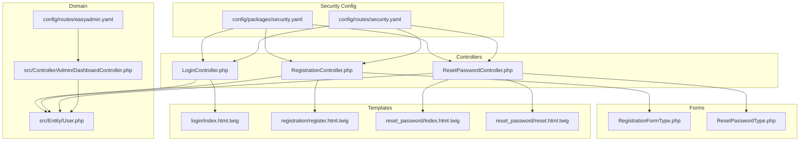

**Diagram sources**
- [security.yaml:1-55](file://config/packages/security.yaml#L1-L55)
- [security.yaml (routes):1-4](file://config/routes/security.yaml#L1-L4)
- [LoginController.php:1-22](file://src/Controller/LoginController.php#L1-L22)
- [RegistrationController.php:1-44](file://src/Controller/RegistrationController.php#L1-L44)
- [ResetPasswordController.php:1-102](file://src/Controller/ResetPasswordController.php#L1-L102)
- [RegistrationFormType.php:1-56](file://src/Form/RegistrationFormType.php#L1-L56)
- [ResetPasswordType.php:1-52](file://src/Form/ResetPasswordType.php#L1-L52)
- [index.html.twig (login):1-59](file://templates/login/index.html.twig#L1-L59)
- [register.html.twig:1-42](file://templates/registration/register.html.twig#L1-L42)
- [index.html.twig (reset_password):1-44](file://templates/reset_password/index.html.twig#L1-L44)
- [reset.html.twig:1-34](file://templates/reset_password/reset.html.twig#L1-L34)
- [User.php:1-119](file://src/Entity/User.php#L1-L119)
- [DashboardController.php:1-88](file://src/Controller/Admin/DashboardController.php#L1-L88)
- [easyadmin.yaml:1-4](file://config/routes/easyadmin.yaml#L1-L4)

**Section sources**
- [security.yaml:1-55](file://config/packages/security.yaml#L1-L55)
- [security.yaml (routes):1-4](file://config/routes/security.yaml#L1-L4)
- [User.php:1-119](file://src/Entity/User.php#L1-L119)
- [LoginController.php:1-22](file://src/Controller/LoginController.php#L1-L22)
- [RegistrationController.php:1-44](file://src/Controller/RegistrationController.php#L1-L44)
- [ResetPasswordController.php:1-102](file://src/Controller/ResetPasswordController.php#L1-L102)
- [RegistrationFormType.php:1-56](file://src/Form/RegistrationFormType.php#L1-L56)
- [ResetPasswordType.php:1-52](file://src/Form/ResetPasswordType.php#L1-L52)
- [index.html.twig (login):1-59](file://templates/login/index.html.twig#L1-L59)
- [register.html.twig:1-42](file://templates/registration/register.html.twig#L1-L42)
- [index.html.twig (reset_password):1-44](file://templates/reset_password/index.html.twig#L1-L44)
- [reset.html.twig:1-34](file://templates/reset_password/reset.html.twig#L1-L34)
- [DashboardController.php:1-88](file://src/Controller/Admin/DashboardController.php#L1-L88)
- [easyadmin.yaml:1-4](file://config/routes/easyadmin.yaml#L1-L4)

## Core Components
- Security configuration
  - Password hashing configured via the User entity hasher.
  - User provider using the User entity and username property.
  - Firewalls: dev (development bypass) and main (production).
  - Access control rules define public and protected areas.
- User entity
  - Implements UserInterface and PasswordAuthenticatedUserInterface.
  - Ensures every user has ROLE_USER and exposes roles and credentials.
  - Serializes safely to avoid storing raw password hashes in sessions.
- Controllers
  - LoginController renders the login form and displays last authentication errors.
  - RegistrationController handles form submission, validates, hashes password, persists user, and redirects.
  - ResetPasswordController manages password reset requests and updates.
- Forms
  - RegistrationFormType defines username and password constraints.
  - ResetPasswordType defines repeated new password fields.
- Templates
  - Login template integrates with Security helpers and displays flashes.
  - Registration and reset templates render forms and messages.

**Section sources**
- [security.yaml:1-55](file://config/packages/security.yaml#L1-L55)
- [User.php:1-119](file://src/Entity/User.php#L1-L119)
- [LoginController.php:1-22](file://src/Controller/LoginController.php#L1-L22)
- [RegistrationController.php:1-44](file://src/Controller/RegistrationController.php#L1-L44)
- [ResetPasswordController.php:1-102](file://src/Controller/ResetPasswordController.php#L1-L102)
- [RegistrationFormType.php:1-56](file://src/Form/RegistrationFormType.php#L1-L56)
- [ResetPasswordType.php:1-52](file://src/Form/ResetPasswordType.php#L1-L52)
- [index.html.twig (login):1-59](file://templates/login/index.html.twig#L1-L59)
- [register.html.twig:1-42](file://templates/registration/register.html.twig#L1-L42)
- [index.html.twig (reset_password):1-44](file://templates/reset_password/index.html.twig#L1-L44)
- [reset.html.twig:1-34](file://templates/reset_password/reset.html.twig#L1-L34)

## Architecture Overview
The system uses Symfony’s Security component with a form-login firewall and access control. The admin area leverages EasyAdmin, which enforces ROLE_ADMIN via access maps.

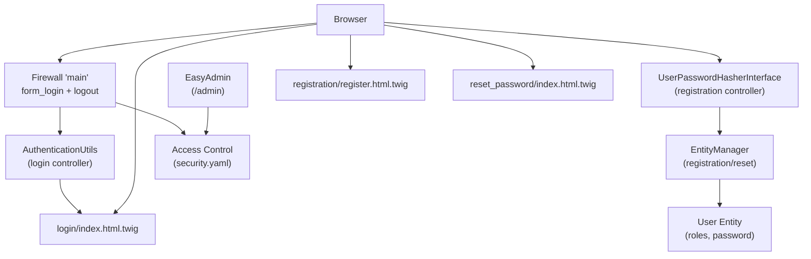

**Diagram sources**
- [security.yaml:14-45](file://config/packages/security.yaml#L14-L45)
- [LoginController.php:9-21](file://src/Controller/LoginController.php#L9-L21)
- [RegistrationController.php:16-43](file://src/Controller/RegistrationController.php#L16-L43)
- [ResetPasswordController.php:25-101](file://src/Controller/ResetPasswordController.php#L25-L101)
- [User.php:68-100](file://src/Entity/User.php#L68-L100)
- [index.html.twig (login):13-18](file://templates/login/index.html.twig#L13-L18)
- [register.html.twig:15-37](file://templates/registration/register.html.twig#L15-L37)
- [index.html.twig (reset_password):20-39](file://templates/reset_password/index.html.twig#L20-L39)
- [easyadmin.yaml:1-4](file://config/routes/easyadmin.yaml#L1-L4)

## Detailed Component Analysis

### Security Configuration
- Password hashing: Uses the User entity hasher.
- Provider: Entity provider for App\Entity\User using username.
- Firewalls:
  - dev: development-only pass-through.
  - main: lazy, form_login with login_path/check_path/default_target_path, logout with path/target.
- Access control:
  - Public pages: /login$, /register$, /forgot-password.
  - Admin area: /admin requires ROLE_ADMIN.
  - Root and other areas: ROLE_USER.

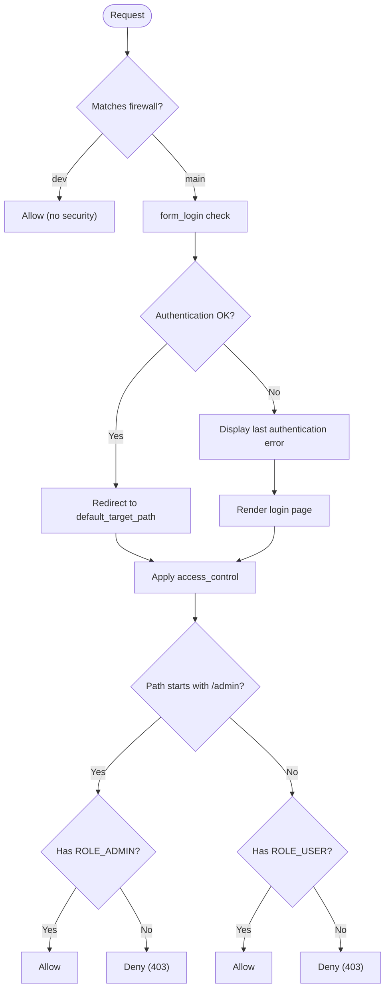

**Diagram sources**
- [security.yaml:14-45](file://config/packages/security.yaml#L14-L45)

**Section sources**
- [security.yaml:1-55](file://config/packages/security.yaml#L1-L55)

### User Entity Implementation
- Implements UserInterface and PasswordAuthenticatedUserInterface.
- Guarantees ROLE_USER for every user.
- Exposes roles and password.
- Safely serializes to avoid storing raw password hashes in sessions.

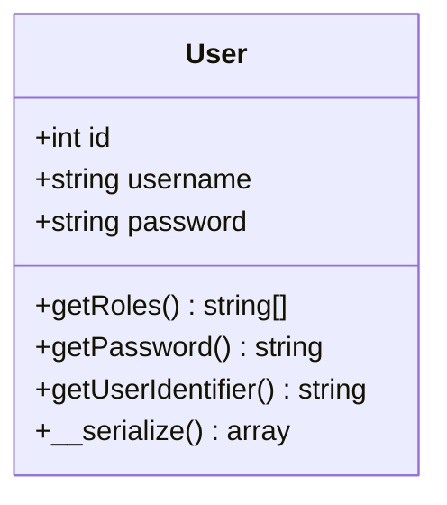

**Diagram sources**
- [User.php:14-119](file://src/Entity/User.php#L14-L119)

**Section sources**
- [User.php:68-111](file://src/Entity/User.php#L68-L111)

### Login Workflow
- Controller retrieves last authentication error and last username.
- Template renders the login form with hidden fields expected by form_login.
- On submit, firewall authenticates against the provider and redirects on success.

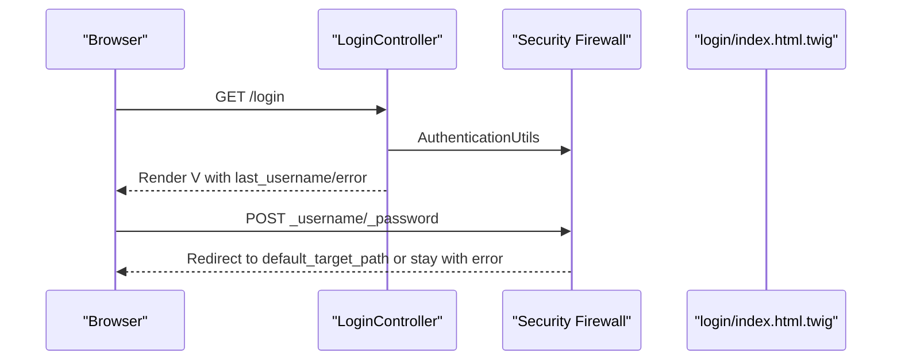

**Diagram sources**
- [LoginController.php:9-21](file://src/Controller/LoginController.php#L9-L21)
- [index.html.twig (login):32-45](file://templates/login/index.html.twig#L32-L45)
- [security.yaml:25-34](file://config/packages/security.yaml#L25-L34)

**Section sources**
- [LoginController.php:1-22](file://src/Controller/LoginController.php#L1-L22)
- [index.html.twig (login):1-59](file://templates/login/index.html.twig#L1-L59)
- [security.yaml:25-34](file://config/packages/security.yaml#L25-L34)

### Registration Workflow
- Controller builds form, handles submission, hashes password, persists user, and redirects.
- Form enforces terms agreement and password constraints.

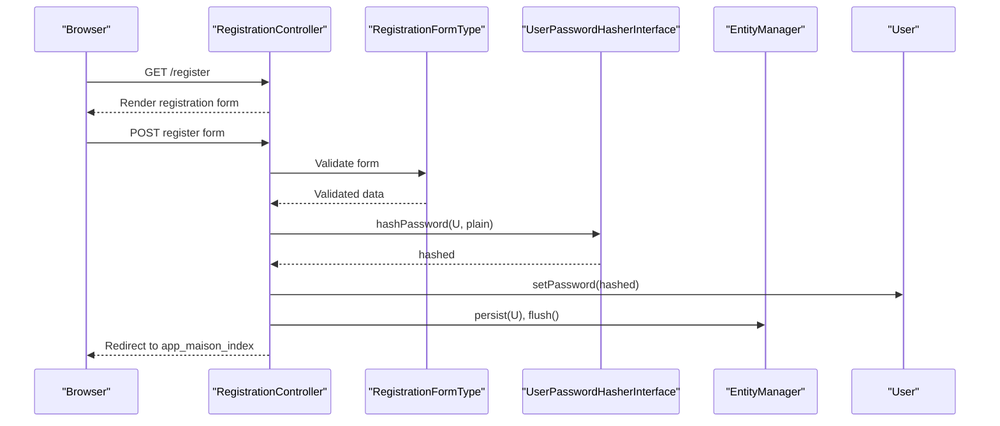

**Diagram sources**
- [RegistrationController.php:16-43](file://src/Controller/RegistrationController.php#L16-L43)
- [RegistrationFormType.php:17-46](file://src/Form/RegistrationFormType.php#L17-L46)
- [User.php:95-100](file://src/Entity/User.php#L95-L100)

**Section sources**
- [RegistrationController.php:1-44](file://src/Controller/RegistrationController.php#L1-L44)
- [RegistrationFormType.php:1-56](file://src/Form/RegistrationFormType.php#L1-L56)
- [User.php:95-100](file://src/Entity/User.php#L95-L100)

### Password Reset Workflow
- Request: Controller validates email, creates a reset token, sends an email, and shows notice.
- Update: Controller verifies token and expiration, rehashes password, persists, and redirects to login.

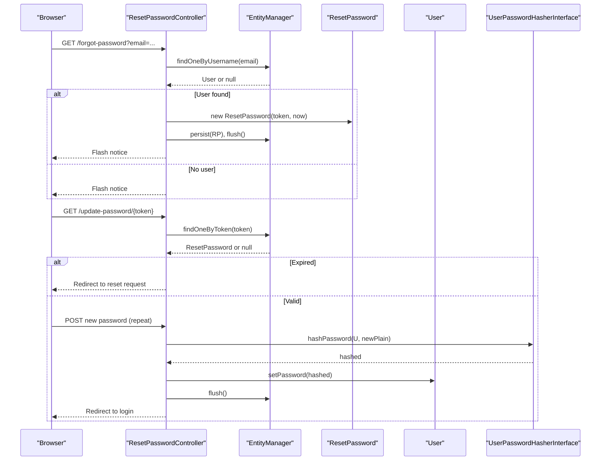

**Diagram sources**
- [ResetPasswordController.php:25-101](file://src/Controller/ResetPasswordController.php#L25-L101)
- [reset.html.twig:26-28](file://templates/reset_password/reset.html.twig#L26-L28)

**Section sources**
- [ResetPasswordController.php:1-102](file://src/Controller/ResetPasswordController.php#L1-L102)
- [reset.html.twig:1-34](file://templates/reset_password/reset.html.twig#L1-L34)

### Access Control and Roles
- Roles:
  - ROLE_USER: guaranteed by the User entity.
  - ROLE_ADMIN: enforced for /admin via access control and EasyAdmin.
- Access control rules:
  - Public: /login$, /register$, /forgot-password.
  - Admin: /admin requires ROLE_ADMIN.
  - Other: / requires ROLE_USER.

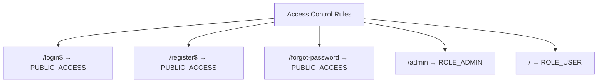

**Diagram sources**
- [security.yaml:40-45](file://config/packages/security.yaml#L40-L45)

**Section sources**
- [security.yaml:40-45](file://config/packages/security.yaml#L40-L45)
- [User.php:68-75](file://src/Entity/User.php#L68-L75)
- [DashboardController.php:21-87](file://src/Controller/Admin/DashboardController.php#L21-L87)
- [easyadmin.yaml:1-4](file://config/routes/easyadmin.yaml#L1-L4)

### Session Management and CSRF Protection
- Session management:
  - User serialization avoids storing raw password hashes in sessions.
- CSRF protection:
  - Symfony automatically generates and validates CSRF tokens for forms.
  - The login form posts to the firewall’s check_path, which is protected by CSRF.

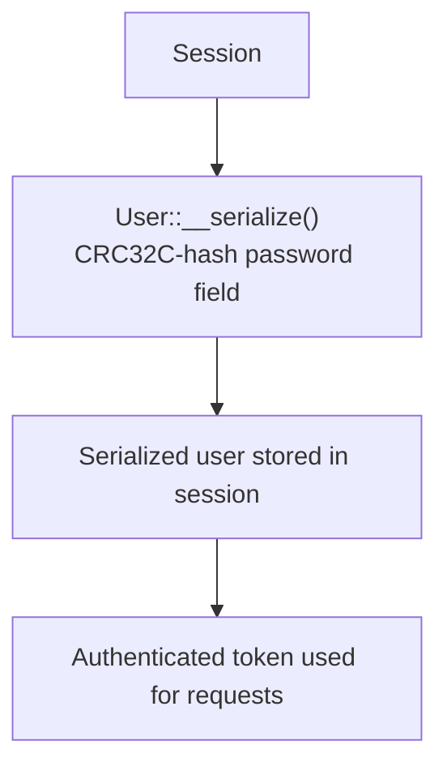

**Diagram sources**
- [User.php:105-111](file://src/Entity/User.php#L105-L111)

**Section sources**
- [User.php:105-111](file://src/Entity/User.php#L105-L111)
- [index.html.twig (login):32-45](file://templates/login/index.html.twig#L32-L45)

### Logout Workflow
- Logout path is registered via the security route loader.
- After logout, the user is redirected to the login page.

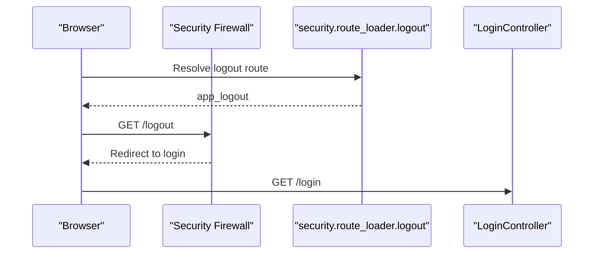

**Diagram sources**
- [security.yaml (routes):1-4](file://config/routes/security.yaml#L1-L4)
- [security.yaml:31-34](file://config/packages/security.yaml#L31-L34)

**Section sources**
- [security.yaml (routes):1-4](file://config/routes/security.yaml#L1-L4)
- [security.yaml:31-34](file://config/packages/security.yaml#L31-L34)

### Examples of Role Checks in Templates
- Use the is_granted helper to conditionally render admin-only content.
- Example usage appears in compiled Twig caches and templates generated by EasyAdmin.

**Section sources**
- [DashboardController.php:71-86](file://src/Controller/Admin/DashboardController.php#L71-L86)

## Dependency Analysis
- Controllers depend on Security components (AuthenticationUtils, form handlers).
- Registration depends on the password hasher and persistence layer.
- ResetPassword depends on the persistence layer and mail utility.
- Templates depend on Security helpers and flash messages.
- Access control depends on the firewall and access maps.

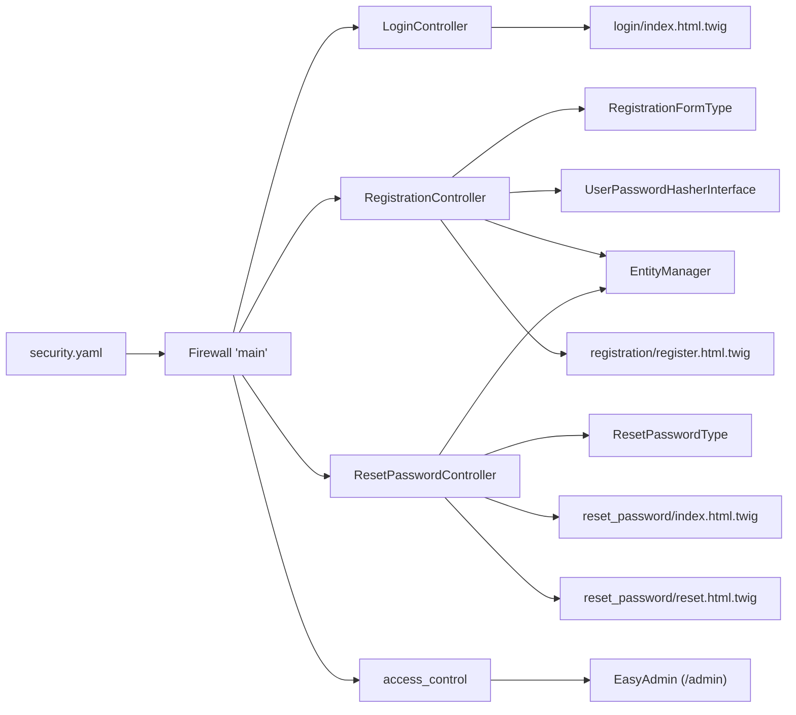

**Diagram sources**
- [security.yaml:14-45](file://config/packages/security.yaml#L14-L45)
- [LoginController.php:1-22](file://src/Controller/LoginController.php#L1-L22)
- [RegistrationController.php:1-44](file://src/Controller/RegistrationController.php#L1-L44)
- [ResetPasswordController.php:1-102](file://src/Controller/ResetPasswordController.php#L1-L102)
- [RegistrationFormType.php:1-56](file://src/Form/RegistrationFormType.php#L1-L56)
- [ResetPasswordType.php:1-52](file://src/Form/ResetPasswordType.php#L1-L52)
- [index.html.twig (login):1-59](file://templates/login/index.html.twig#L1-L59)
- [register.html.twig:1-42](file://templates/registration/register.html.twig#L1-L42)
- [index.html.twig (reset_password):1-44](file://templates/reset_password/index.html.twig#L1-L44)
- [reset.html.twig:1-34](file://templates/reset_password/reset.html.twig#L1-L34)
- [easyadmin.yaml:1-4](file://config/routes/easyadmin.yaml#L1-L4)

**Section sources**
- [security.yaml:1-55](file://config/packages/security.yaml#L1-L55)
- [LoginController.php:1-22](file://src/Controller/LoginController.php#L1-L22)
- [RegistrationController.php:1-44](file://src/Controller/RegistrationController.php#L1-L44)
- [ResetPasswordController.php:1-102](file://src/Controller/ResetPasswordController.php#L1-L102)
- [RegistrationFormType.php:1-56](file://src/Form/RegistrationFormType.php#L1-L56)
- [ResetPasswordType.php:1-52](file://src/Form/ResetPasswordType.php#L1-L52)
- [index.html.twig (login):1-59](file://templates/login/index.html.twig#L1-L59)
- [register.html.twig:1-42](file://templates/registration/register.html.twig#L1-L42)
- [index.html.twig (reset_password):1-44](file://templates/reset_password/index.html.twig#L1-L44)
- [reset.html.twig:1-34](file://templates/reset_password/reset.html.twig#L1-L34)
- [easyadmin.yaml:1-4](file://config/routes/easyadmin.yaml#L1-L4)

## Performance Considerations
- Use lazy firewalls to reduce overhead.
- Keep password hashing costs reasonable for production while secure.
- Minimize database queries in access control decisions by leveraging roles and cached access maps.
- Avoid heavy computations in the authentication provider.

[No sources needed since this section provides general guidance]

## Troubleshooting Guide
- Login fails:
  - Verify form_login paths and that the provider returns a valid UserInterface implementation.
  - Check last authentication error rendering in the login template.
- Registration errors:
  - Ensure the form is submitted and validated, and that the password is hashed before persisting.
- Password reset:
  - Confirm token existence and expiration window.
  - Ensure the mail utility is configured and emails are delivered.
- Access denied:
  - Confirm the user has the required role and that access_control rules match the requested path.

**Section sources**
- [LoginController.php:13-15](file://src/Controller/LoginController.php#L13-L15)
- [index.html.twig (login):13-18](file://templates/login/index.html.twig#L13-L18)
- [RegistrationController.php:23-31](file://src/Controller/RegistrationController.php#L23-L31)
- [ResetPasswordController.php:67-77](file://src/Controller/ResetPasswordController.php#L67-L77)
- [security.yaml:40-45](file://config/packages/security.yaml#L40-L45)

## Conclusion
The application implements a robust Symfony Security setup with form-based authentication, secure password hashing, and clear access control rules. The admin area is protected via EasyAdmin and access maps. The system supports user registration, password reset, CSRF protection, and safe session management. Following the outlined best practices will help maintain a secure and reliable authentication layer.

[No sources needed since this section summarizes without analyzing specific files]

## Appendices

### Best Practices and Vulnerability Prevention
- Enforce HTTPS in production to protect credentials and CSRF tokens.
- Use strong password policies and consider rate limiting on login attempts.
- Sanitize and validate all inputs, especially in forms.
- Rotate secrets regularly and restrict access to sensitive configuration.
- Monitor failed login attempts and implement account lockout if appropriate.
- Keep Symfony and dependencies up to date to mitigate known vulnerabilities.

[No sources needed since this section provides general guidance]

### Role-Based Access Examples
- Controllers: Use the Security component to enforce roles before actions.
- Templates: Use the is_granted helper to conditionally render admin links and menus.

**Section sources**
- [DashboardController.php:71-86](file://src/Controller/Admin/DashboardController.php#L71-L86)