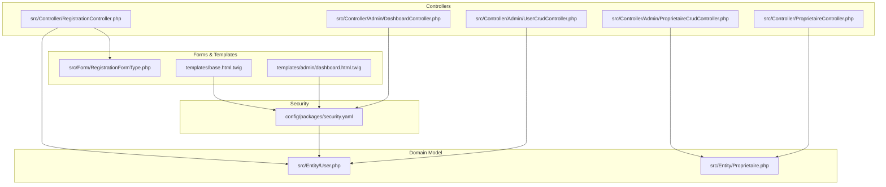
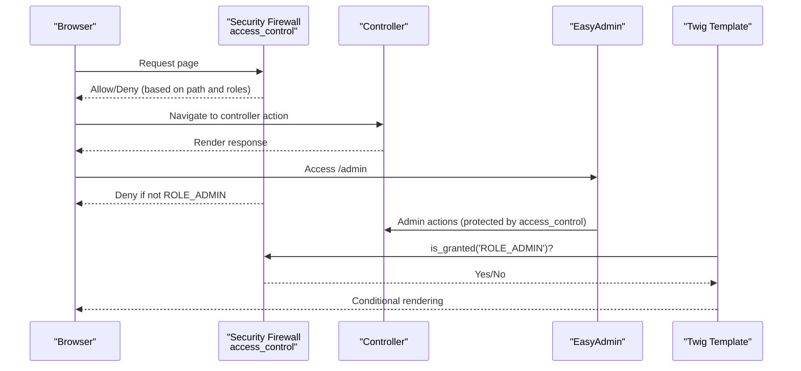
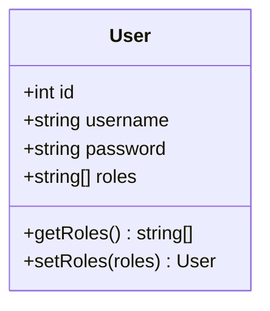
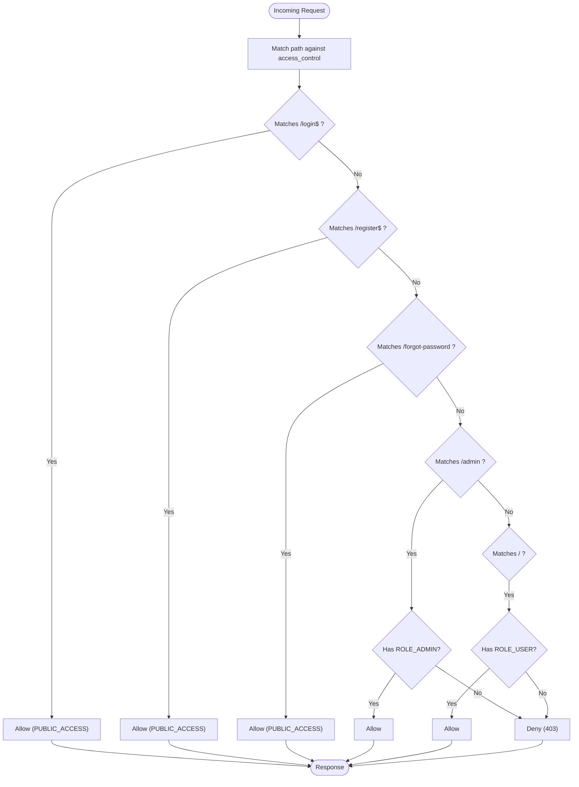
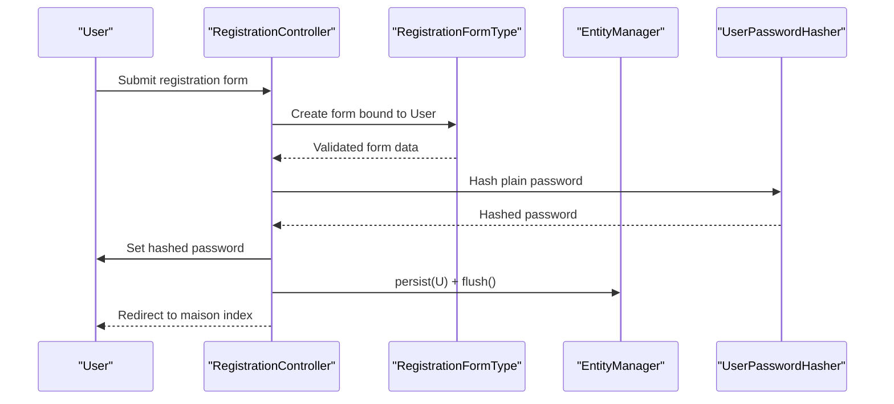
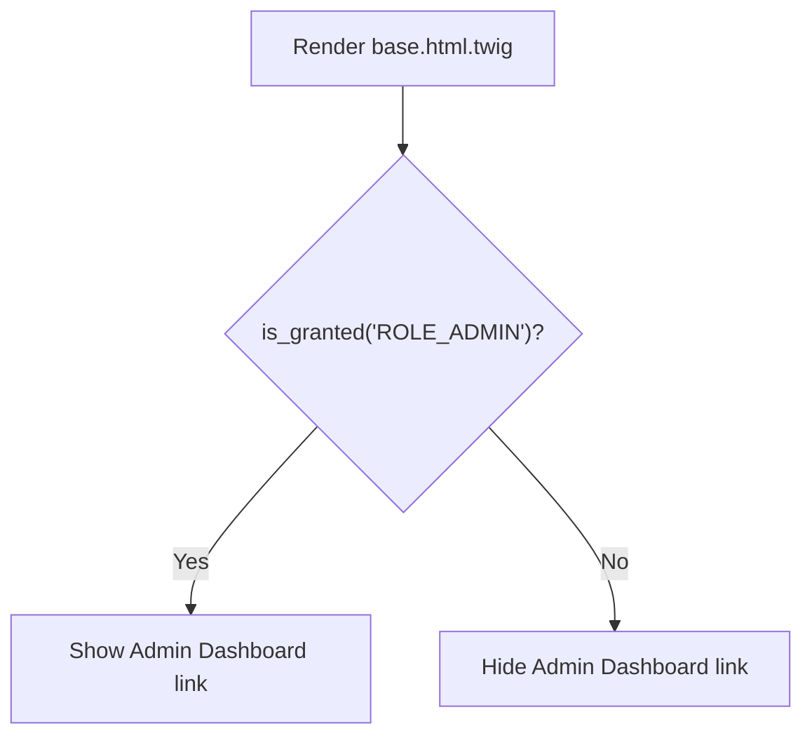
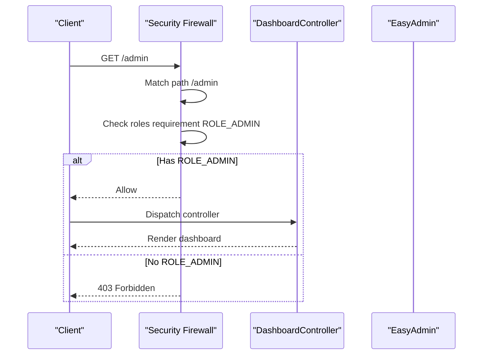
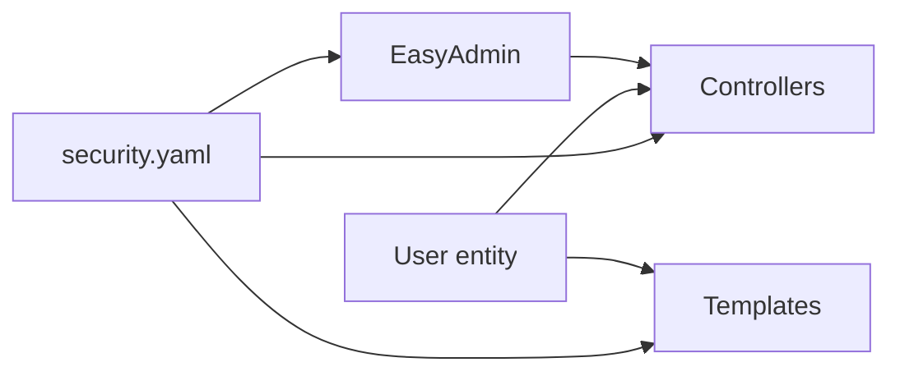

# Role-Based Access Control

<cite>
**Referenced Files in This Document**
- [security.yaml](file://config/packages/security.yaml)
- [User.php](file://src/Entity/User.php)
- [RegistrationController.php](file://src/Controller/RegistrationController.php)
- [RegistrationFormType.php](file://src/Form/RegistrationFormType.php)
- [base.html.twig](file://templates/base.html.twig)
- [dashboard.html.twig](file://templates/admin/dashboard.html.twig)
- [DashboardController.php](file://src/Controller/Admin/DashboardController.php)
- [UserCrudController.php](file://src/Controller/Admin/UserCrudController.php)
- [ProprietaireCrudController.php](file://src/Controller/Admin/ProprietaireCrudController.php)
- [ProprietaireController.php](file://src/Controller/ProprietaireController.php)
- [Proprietaire.php](file://src/Entity/Proprietaire.php)
</cite>

## Table of Contents
1. [Introduction](#introduction)
2. [Project Structure](#project-structure)
3. [Core Components](#core-components)
4. [Architecture Overview](#architecture-overview)
5. [Detailed Component Analysis](#detailed-component-analysis)
6. [Dependency Analysis](#dependency-analysis)
7. [Performance Considerations](#performance-considerations)
8. [Troubleshooting Guide](#troubleshooting-guide)
9. [Conclusion](#conclusion)

## Introduction
This document explains the role-based access control (RBAC) system used in the application. It defines the three user roles, documents how access_control rules are enforced, describes how roles are assigned during registration, and shows how roles are checked in controllers and Twig templates. It also covers admin dashboard access restrictions and property owner-related privileges.

## Project Structure
The RBAC system spans configuration, entities, controllers, forms, and templates:
- Security configuration defines authentication, logout, and access_control rules.
- The User entity stores roles and ensures every user has at least ROLE_USER.
- Controllers handle registration and admin CRUD operations.
- Twig templates conditionally render links and content based on granted roles.
- Property owner resources are exposed via dedicated controllers and templates.

**Diagram sources**
- [security.yaml:1-55](file://config/packages/security.yaml#L1-L55)
- [User.php:1-119](file://src/Entity/User.php#L1-L119)
- [RegistrationController.php:1-44](file://src/Controller/RegistrationController.php#L1-L44)
- [RegistrationFormType.php:1-56](file://src/Form/RegistrationFormType.php#L1-L56)
- [DashboardController.php:1-88](file://src/Controller/Admin/DashboardController.php#L1-L88)
- [UserCrudController.php:1-44](file://src/Controller/Admin/UserCrudController.php#L1-L44)
- [ProprietaireCrudController.php:1-40](file://src/Controller/Admin/ProprietaireCrudController.php#L1-L40)
- [ProprietaireController.php:1-81](file://src/Controller/ProprietaireController.php#L1-L81)
- [Proprietaire.php:1-70](file://src/Entity/Proprietaire.php#L1-L70)
- [base.html.twig:1-184](file://templates/base.html.twig#L1-L184)
- [dashboard.html.twig:1-263](file://templates/admin/dashboard.html.twig#L1-L263)

**Section sources**
- [security.yaml:1-55](file://config/packages/security.yaml#L1-L55)
- [User.php:1-119](file://src/Entity/User.php#L1-L119)
- [RegistrationController.php:1-44](file://src/Controller/RegistrationController.php#L1-L44)
- [RegistrationFormType.php:1-56](file://src/Form/RegistrationFormType.php#L1-L56)
- [base.html.twig:1-184](file://templates/base.html.twig#L1-L184)
- [dashboard.html.twig:1-263](file://templates/admin/dashboard.html.twig#L1-L263)
- [DashboardController.php:1-88](file://src/Controller/Admin/DashboardController.php#L1-L88)
- [UserCrudController.php:1-44](file://src/Controller/Admin/UserCrudController.php#L1-L44)
- [ProprietaireCrudController.php:1-40](file://src/Controller/Admin/ProprietaireCrudController.php#L1-L40)
- [ProprietaireController.php:1-81](file://src/Controller/ProprietaireController.php#L1-L81)
- [Proprietaire.php:1-70](file://src/Entity/Proprietaire.php#L1-L70)

## Core Components
- Roles and defaults
  - Every authenticated user automatically receives ROLE_USER via the User entity’s getRoles method.
  - Additional roles can be stored in the User.roles field.
  - No explicit ROLE_PROPRIETAIRE is defined in the configuration; it is not a standard Symfony role and would require custom voter or ACL if used.

- Access_control rules
  - Public pages: login, register, forgot-password are publicly accessible.
  - Admin area: access restricted to ROLE_ADMIN.
  - Everything else: requires ROLE_USER.

- Role checking in templates
  - Navigation items and admin dashboard link are rendered conditionally using is_granted('ROLE_ADMIN').
  - Other role checks are not present in the base template.

- Role checking in controllers
  - Controllers do not explicitly check roles using is_granted in the examined files. Access is primarily enforced by access_control.

- Role assignment during registration
  - The registration form does not expose roles; the controller persists the User entity without setting extra roles.
  - Therefore, newly registered users receive only ROLE_USER by default.

- Admin dashboard and CRUD
  - EasyAdmin routes under /admin are protected by access_control requiring ROLE_ADMIN.
  - The admin dashboard renders statistics and menu items for managing entities.

- Property owner privileges
  - Property owner CRUD is handled by dedicated controllers and templates.
  - There is no role-based restriction on property owner operations in the examined files; access_control does not restrict these paths.

**Section sources**
- [User.php:68-85](file://src/Entity/User.php#L68-L85)
- [security.yaml:40-45](file://config/packages/security.yaml#L40-L45)
- [base.html.twig:128-134](file://templates/base.html.twig#L128-L134)
- [RegistrationController.php:16-43](file://src/Controller/RegistrationController.php#L16-L43)
- [RegistrationFormType.php:17-46](file://src/Form/RegistrationFormType.php#L17-L46)
- [DashboardController.php:21-87](file://src/Controller/Admin/DashboardController.php#L21-L87)
- [UserCrudController.php:15-43](file://src/Controller/Admin/UserCrudController.php#L15-L43)
- [ProprietaireCrudController.php:12-39](file://src/Controller/Admin/ProprietaireCrudController.php#L12-L39)
- [ProprietaireController.php:14-81](file://src/Controller/ProprietaireController.php#L14-L81)

## Architecture Overview
The RBAC enforcement follows a layered approach:
- Security configuration enforces path-based access_control.
- The User entity guarantees a minimum role for all authenticated users.
- Controllers and templates rely on is_granted checks for UI decisions.
- Admin CRUD leverages EasyAdmin with access_control protection.

**Diagram sources**
- [security.yaml:40-45](file://config/packages/security.yaml#L40-L45)
- [base.html.twig:128-134](file://templates/base.html.twig#L128-L134)
- [DashboardController.php:21-87](file://src/Controller/Admin/DashboardController.php#L21-L87)

## Detailed Component Analysis

### Role Definitions and Defaults
- ROLE_USER
  - Guaranteed for every authenticated user via the User entity’s getRoles method.
- ROLE_ADMIN
  - Required to access admin routes (/admin).
- ROLE_PROPRIETAIRE
  - Not defined in security.yaml nor enforced by access_control.
  - If used elsewhere, it would require a custom voter or explicit role assignment.

**Diagram sources**
- [User.php:14-119](file://src/Entity/User.php#L14-L119)

**Section sources**
- [User.php:68-85](file://src/Entity/User.php#L68-L85)
- [security.yaml:40-45](file://config/packages/security.yaml#L40-L45)

### Access_Control Configuration
- Public paths: login, register, forgot-password are open to everyone.
- Admin area: /admin requires ROLE_ADMIN.
- Root path: / requires ROLE_USER.

**Diagram sources**
- [security.yaml:40-45](file://config/packages/security.yaml#L40-L45)

**Section sources**
- [security.yaml:40-45](file://config/packages/security.yaml#L40-L45)

### Role Assignment During Registration
- The registration form collects username and password; roles are not part of the form.
- The controller persists the User entity after hashing the password.
- The User entity’s getRoles ensures ROLE_USER is always present.

**Diagram sources**
- [RegistrationController.php:16-43](file://src/Controller/RegistrationController.php#L16-L43)
- [RegistrationFormType.php:17-46](file://src/Form/RegistrationFormType.php#L17-L46)
- [User.php:90-100](file://src/Entity/User.php#L90-L100)

**Section sources**
- [RegistrationController.php:16-43](file://src/Controller/RegistrationController.php#L16-L43)
- [RegistrationFormType.php:17-46](file://src/Form/RegistrationFormType.php#L17-L46)
- [User.php:68-85](file://src/Entity/User.php#L68-L85)

### Role Checking in Controllers
- Controllers in the examined files do not explicitly call is_granted.
- Access is enforced by access_control rules configured in security.yaml.
- Admin controllers are protected because EasyAdmin routes match /admin, which requires ROLE_ADMIN.

**Section sources**
- [security.yaml:40-45](file://config/packages/security.yaml#L40-L45)
- [DashboardController.php:21-87](file://src/Controller/Admin/DashboardController.php#L21-L87)

### Role Checking in Twig Templates
- The base template conditionally renders the Admin Dashboard link only when the user has ROLE_ADMIN.
- Other role checks are not present in the base template.

**Diagram sources**
- [base.html.twig:128-134](file://templates/base.html.twig#L128-L134)

**Section sources**
- [base.html.twig:128-134](file://templates/base.html.twig#L128-L134)

### Admin Dashboard Access Restrictions
- The admin dashboard is implemented by EasyAdmin and is reachable under /admin.
- access_control explicitly requires ROLE_ADMIN for /admin, ensuring only administrators can access it.

**Diagram sources**
- [security.yaml:44-44](file://config/packages/security.yaml#L44-L44)
- [DashboardController.php:21-87](file://src/Controller/Admin/DashboardController.php#L21-L87)

**Section sources**
- [security.yaml:44-44](file://config/packages/security.yaml#L44-L44)
- [DashboardController.php:21-87](file://src/Controller/Admin/DashboardController.php#L21-L87)
- [dashboard.html.twig:1-263](file://templates/admin/dashboard.html.twig#L1-L263)

### Property Owner Privileges
- Property owner CRUD is handled by dedicated controllers and templates.
- There is no role-based restriction on property owner operations in the examined files; access_control does not restrict these paths.
- The base template exposes navigation to property owner lists and creation forms but does not gate them by role.

**Section sources**
- [ProprietaireController.php:14-81](file://src/Controller/ProprietaireController.php#L14-L81)
- [ProprietaireCrudController.php:12-39](file://src/Controller/Admin/ProprietaireCrudController.php#L12-L39)
- [Proprietaire.php:1-70](file://src/Entity/Proprietaire.php#L1-L70)
- [base.html.twig:119-127](file://templates/base.html.twig#L119-L127)

### Role-Based Conditional Rendering Examples
- Admin Dashboard link in the base template:
  - Condition: is_granted('ROLE_ADMIN')
  - Effect: Renders a link to the admin dashboard when the user has ROLE_ADMIN.

- Property owner navigation:
  - The base template provides links to list and create property owners without role checks.

Note: These examples demonstrate how is_granted is used in Twig to conditionally render UI elements.

**Section sources**
- [base.html.twig:128-134](file://templates/base.html.twig#L128-L134)
- [base.html.twig:119-127](file://templates/base.html.twig#L119-L127)

## Dependency Analysis
- User entity depends on the security component to provide roles.
- Controllers depend on the security context for role checks and on EasyAdmin for admin routes.
- Templates depend on the security context for is_granted checks.
- access_control depends on the routing configuration to match paths.

**Diagram sources**
- [security.yaml:1-55](file://config/packages/security.yaml#L1-L55)
- [User.php:1-119](file://src/Entity/User.php#L1-L119)
- [base.html.twig:1-184](file://templates/base.html.twig#L1-L184)
- [DashboardController.php:1-88](file://src/Controller/Admin/DashboardController.php#L1-L88)

**Section sources**
- [security.yaml:1-55](file://config/packages/security.yaml#L1-L55)
- [User.php:1-119](file://src/Entity/User.php#L1-L119)
- [base.html.twig:1-184](file://templates/base.html.twig#L1-L184)
- [DashboardController.php:1-88](file://src/Controller/Admin/DashboardController.php#L1-L88)

## Performance Considerations
- Role evaluation occurs during security checks; ensure minimal role comparisons in templates.
- Keep access_control rules concise and ordered to avoid unnecessary matches.
- Avoid heavy computations inside Twig is_granted checks.

## Troubleshooting Guide
- Users cannot access /admin
  - Verify the user has ROLE_ADMIN assigned.
  - Confirm access_control allows /admin only for ROLE_ADMIN.
- Newly registered users cannot access admin
  - By design, registration does not grant ROLE_ADMIN; assign it explicitly if needed.
- Admin dashboard link missing in navigation
  - Ensure the user has ROLE_ADMIN; otherwise the link is intentionally hidden.
- Property owner CRUD access denied
  - No role-based restriction exists for property owner routes; check for other middleware or controller-level guards if access is unexpectedly denied.

**Section sources**
- [security.yaml:40-45](file://config/packages/security.yaml#L40-L45)
- [User.php:68-85](file://src/Entity/User.php#L68-L85)
- [base.html.twig:128-134](file://templates/base.html.twig#L128-L134)
- [RegistrationController.php:16-43](file://src/Controller/RegistrationController.php#L16-L43)

## Conclusion
The application enforces RBAC primarily through access_control rules and the User entity’s default role assignment. ROLE_USER is guaranteed for authenticated users, ROLE_ADMIN protects the admin area, and ROLE_PROPRIETAIRE is not defined or enforced. Role checks in Twig enable conditional UI rendering, while controllers rely on access_control for access enforcement. Property owner operations are not role-restricted in the examined files.