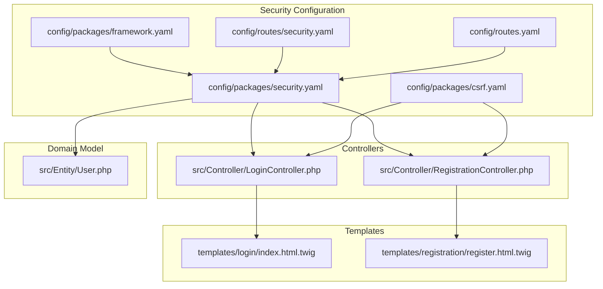
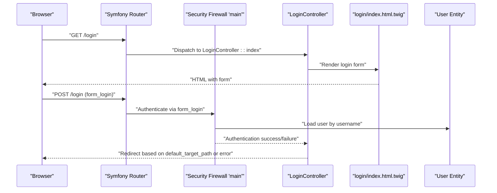
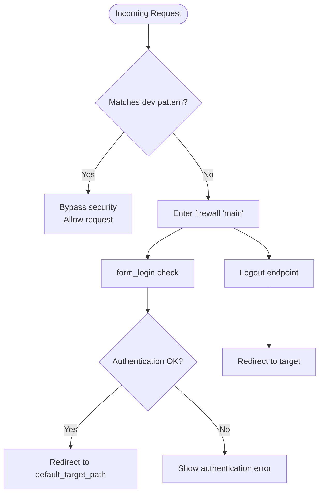
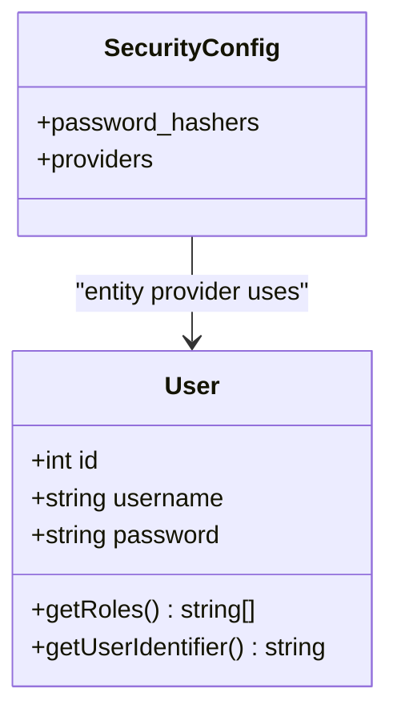
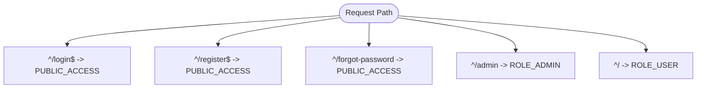
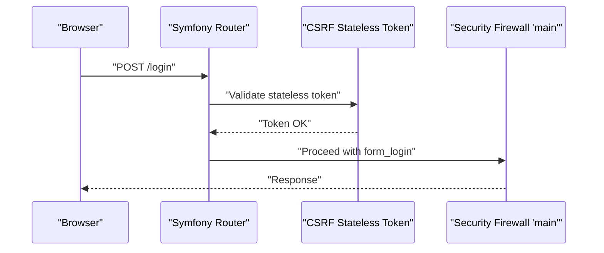
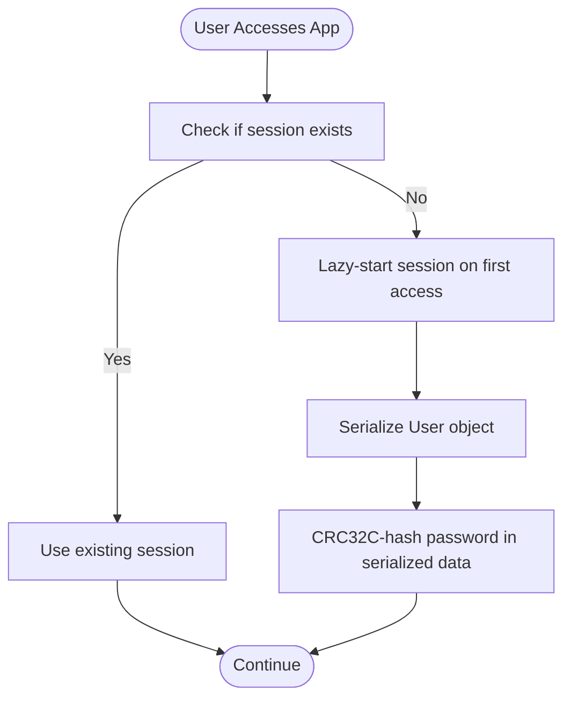
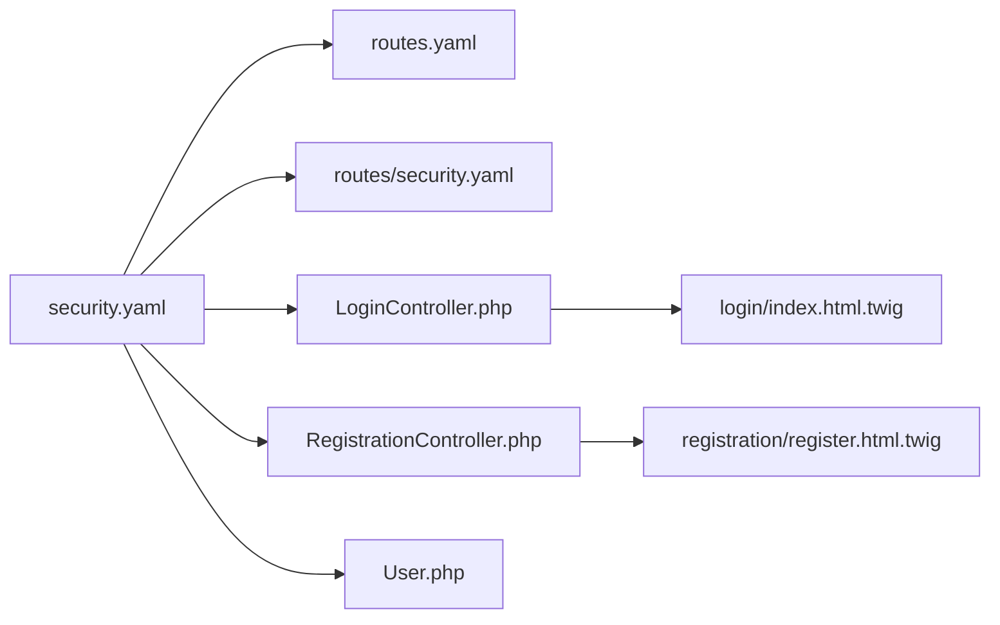

# Security Configuration

<cite>
**Referenced Files in This Document**
- [security.yaml](file://config/packages/security.yaml)
- [csrf.yaml](file://config/packages/csrf.yaml)
- [framework.yaml](file://config/packages/framework.yaml)
- [security.yaml](file://config/routes/security.yaml)
- [routes.yaml](file://config/routes.yaml)
- [LoginController.php](file://src/Controller/LoginController.php)
- [RegistrationController.php](file://src/Controller/RegistrationController.php)
- [User.php](file://src/Entity/User.php)
- [index.html.twig](file://templates/login/index.html.twig)
- [register.html.twig](file://templates/registration/register.html.twig)
</cite>

## Table of Contents
1. [Introduction](#introduction)
2. [Project Structure](#project-structure)
3. [Core Components](#core-components)
4. [Architecture Overview](#architecture-overview)
5. [Detailed Component Analysis](#detailed-component-analysis)
6. [Dependency Analysis](#dependency-analysis)
7. [Performance Considerations](#performance-considerations)
8. [Troubleshooting Guide](#troubleshooting-guide)
9. [Conclusion](#conclusion)

## Introduction
This document explains the Symfony Security component configuration for the project. It covers the firewall setup (including the main firewall with form_login and logout), password hashers, security providers, access_control enforcement order, CSRF protection configuration and form security, session management, and development versus production differences. It also includes troubleshooting tips and best practices for security hardening.

## Project Structure
Security-related configuration is split across several files:
- Application-wide security settings and access control
- CSRF protection configuration
- Framework session and testing configuration
- Route definitions for logout and security-related services
- Controllers and templates that render login and registration forms

**Diagram sources**
- [security.yaml:1-55](file://config/packages/security.yaml#L1-L55)
- [csrf.yaml:1-12](file://config/packages/csrf.yaml#L1-L12)
- [framework.yaml:1-16](file://config/packages/framework.yaml#L1-L16)
- [security.yaml:1-4](file://config/routes/security.yaml#L1-L4)
- [routes.yaml:10-15](file://config/routes.yaml#L10-L15)
- [LoginController.php:1-22](file://src/Controller/LoginController.php#L1-L22)
- [RegistrationController.php:1-44](file://src/Controller/RegistrationController.php#L1-L44)
- [User.php:1-119](file://src/Entity/User.php#L1-L119)
- [index.html.twig:1-59](file://templates/login/index.html.twig#L1-L59)
- [register.html.twig:1-42](file://templates/registration/register.html.twig#L1-L42)

**Section sources**
- [security.yaml:1-55](file://config/packages/security.yaml#L1-L55)
- [csrf.yaml:1-12](file://config/packages/csrf.yaml#L1-L12)
- [framework.yaml:1-16](file://config/packages/framework.yaml#L1-L16)
- [security.yaml:1-4](file://config/routes/security.yaml#L1-L4)
- [routes.yaml:10-15](file://config/routes.yaml#L10-L15)
- [LoginController.php:1-22](file://src/Controller/LoginController.php#L1-L22)
- [RegistrationController.php:1-44](file://src/Controller/RegistrationController.php#L1-L44)
- [User.php:1-119](file://src/Entity/User.php#L1-L119)
- [index.html.twig:1-59](file://templates/login/index.html.twig#L1-L59)
- [register.html.twig:1-42](file://templates/registration/register.html.twig#L1-L42)

## Core Components
- Password hashers: configured to use automatic algorithm selection for the User entity.
- Security providers: entity provider backed by the User entity and the username property.
- Firewalls:
  - dev: allows profiling and static assets without security checks.
  - main: lazy firewall with form_login and logout, using the entity provider.
- Access control: ordered rules enforcing public access for login/register/forgot-password and role-based access for admin and general site.
- CSRF protection: stateless tokens enabled for submit, authenticate, and logout actions.
- Session management: sessions are enabled and lazily started when accessed.

**Section sources**
- [security.yaml:4-38](file://config/packages/security.yaml#L4-L38)
- [security.yaml:39-45](file://config/packages/security.yaml#L39-L45)
- [csrf.yaml:7-11](file://config/packages/csrf.yaml#L7-L11)
- [framework.yaml:5-6](file://config/packages/framework.yaml#L5-L6)

## Architecture Overview
The security flow integrates configuration, controllers, templates, and domain model. Authentication relies on the main firewall’s form_login and logout endpoints, enforced by access_control rules. CSRF protection is applied to sensitive actions via stateless tokens.

**Diagram sources**
- [security.yaml:20-38](file://config/packages/security.yaml#L20-L38)
- [LoginController.php:9-21](file://src/Controller/LoginController.php#L9-L21)
- [index.html.twig:32-53](file://templates/login/index.html.twig#L32-L53)
- [User.php:41-63](file://src/Entity/User.php#L41-L63)

## Detailed Component Analysis

### Firewall Setup: dev and main
- dev firewall:
  - Pattern matches profiler and static assets.
  - Disables security for these paths.
- main firewall:
  - Lazy loading enabled.
  - Uses the entity provider for user lookup.
  - form_login configured with login_path, check_path, and default_target_path.
  - logout configured with path and target redirect.

**Diagram sources**
- [security.yaml:14-38](file://config/packages/security.yaml#L14-L38)
- [routes.yaml:12-14](file://config/routes.yaml#L12-L14)

**Section sources**
- [security.yaml:14-38](file://config/packages/security.yaml#L14-L38)
- [routes.yaml:12-14](file://config/routes.yaml#L12-L14)

### Password Hashers and Security Providers
- Password hashers:
  - Automatic algorithm selection for the User entity.
  - Test environment overrides reduce computational cost for faster tests.
- Security providers:
  - Entity provider pointing to the User class and username property.

**Diagram sources**
- [security.yaml:4-12](file://config/packages/security.yaml#L4-L12)
- [User.php:14-119](file://src/Entity/User.php#L14-L119)

**Section sources**
- [security.yaml:4-12](file://config/packages/security.yaml#L4-L12)
- [User.php:14-119](file://src/Entity/User.php#L14-L119)

### Access Control Enforcement Order
Access control rules are evaluated in order:
- Public access for login, registration, and forgot-password paths.
- Admin area restricted to ROLE_ADMIN.
- Everything else requires ROLE_USER.

**Diagram sources**
- [security.yaml:39-45](file://config/packages/security.yaml#L39-L45)

**Section sources**
- [security.yaml:39-45](file://config/packages/security.yaml#L39-L45)

### CSRF Protection and Form Security
- Stateless CSRF tokens are enabled for submit, authenticate, and logout actions.
- The framework also checks CSRF tokens via request headers when configured.
- Login form posts to the login route; registration uses a Symfony Form with built-in CSRF rendering.

**Diagram sources**
- [csrf.yaml:7-11](file://config/packages/csrf.yaml#L7-L11)
- [index.html.twig:32-45](file://templates/login/index.html.twig#L32-L45)

**Section sources**
- [csrf.yaml:1-12](file://config/packages/csrf.yaml#L1-L12)
- [index.html.twig:32-45](file://templates/login/index.html.twig#L32-L45)
- [register.html.twig:15-37](file://templates/registration/register.html.twig#L15-L37)

### Session Management Settings and Security Constraints
- Sessions are enabled and lazily started when accessed.
- The User entity implements serialization safeguards to avoid storing raw password hashes in serialized sessions.

**Diagram sources**
- [framework.yaml:5-6](file://config/packages/framework.yaml#L5-L6)
- [User.php:102-111](file://src/Entity/User.php#L102-L111)

**Section sources**
- [framework.yaml:5-6](file://config/packages/framework.yaml#L5-L6)
- [User.php:102-111](file://src/Entity/User.php#L102-L111)

### Development vs Production Differences
- Development:
  - dev firewall allows profiling and static assets without security checks.
- Testing:
  - Reduced computational cost for password hashing to speed up tests.
- Production:
  - Keep default security settings; ensure HTTPS and secure cookies in deployment environments.

**Section sources**
- [security.yaml:14-18](file://config/packages/security.yaml#L14-L18)
- [security.yaml:47-55](file://config/packages/security.yaml#L47-L55)

## Dependency Analysis
Security depends on routing, controllers, templates, and the User entity. Routes define the logout endpoint and the login path; controllers render forms and handle submission; templates provide the HTML forms and CSRF rendering.

**Diagram sources**
- [security.yaml:1-55](file://config/packages/security.yaml#L1-L55)
- [routes.yaml:10-15](file://config/routes.yaml#L10-L15)
- [security.yaml:1-4](file://config/routes/security.yaml#L1-L4)
- [LoginController.php:1-22](file://src/Controller/LoginController.php#L1-L22)
- [RegistrationController.php:1-44](file://src/Controller/RegistrationController.php#L1-L44)
- [User.php:1-119](file://src/Entity/User.php#L1-L119)
- [index.html.twig:1-59](file://templates/login/index.html.twig#L1-L59)
- [register.html.twig:1-42](file://templates/registration/register.html.twig#L1-L42)

**Section sources**
- [security.yaml:1-55](file://config/packages/security.yaml#L1-L55)
- [routes.yaml:10-15](file://config/routes.yaml#L10-L15)
- [security.yaml:1-4](file://config/routes/security.yaml#L1-L4)
- [LoginController.php:1-22](file://src/Controller/LoginController.php#L1-L22)
- [RegistrationController.php:1-44](file://src/Controller/RegistrationController.php#L1-L44)
- [User.php:1-119](file://src/Entity/User.php#L1-L119)
- [index.html.twig:1-59](file://templates/login/index.html.twig#L1-L59)
- [register.html.twig:1-42](file://templates/registration/register.html.twig#L1-L42)

## Performance Considerations
- Use lazy firewalls to minimize overhead for public areas.
- Prefer automatic password hasher algorithms to benefit from modern defaults; adjust test settings only for CI/test environments.
- Keep CSRF stateless tokens minimal and targeted to sensitive actions.
- Ensure sessions are only started when needed to reduce overhead.

## Troubleshooting Guide
Common issues and resolutions:
- Authentication fails silently:
  - Verify form_login login_path and check_path match the route names and controller actions.
  - Confirm the User entity implements the required interface and the provider property matches the username field.
- Access denied errors:
  - Review access_control order and ensure more specific rules appear before general ones.
  - Confirm roles are properly assigned and normalized to ROLE_USER for all authenticated users.
- CSRF token errors:
  - Ensure stateless token IDs include submit, authenticate, and logout.
  - Confirm forms include CSRF tokens rendered by the framework.
- Session issues:
  - Check that sessions are enabled and lazily started.
  - Verify the User entity does not expose raw password hashes in serialized data.

**Section sources**
- [security.yaml:20-38](file://config/packages/security.yaml#L20-L38)
- [security.yaml:39-45](file://config/packages/security.yaml#L39-L45)
- [csrf.yaml:7-11](file://config/packages/csrf.yaml#L7-L11)
- [framework.yaml:5-6](file://config/packages/framework.yaml#L5-L6)
- [User.php:68-75](file://src/Entity/User.php#L68-L75)
- [User.php:102-111](file://src/Entity/User.php#L102-L111)

## Conclusion
The security configuration establishes a clear separation between development and production concerns, enforces role-based access control, and applies CSRF protection to sensitive actions. By leveraging automatic password hashing, lazy firewalls, and stateless CSRF tokens, the system balances usability and security. Follow the troubleshooting steps and best practices to maintain a robust and hardened security posture.