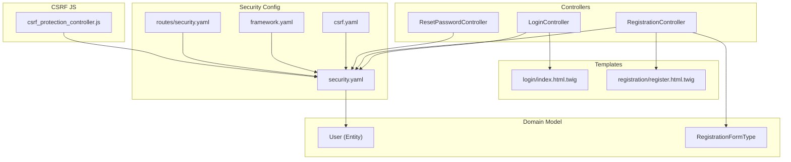
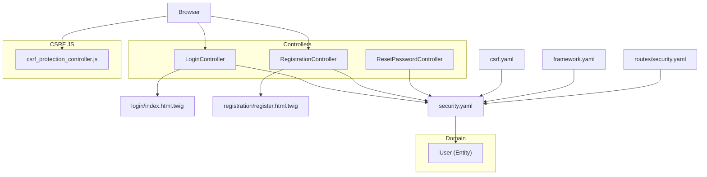
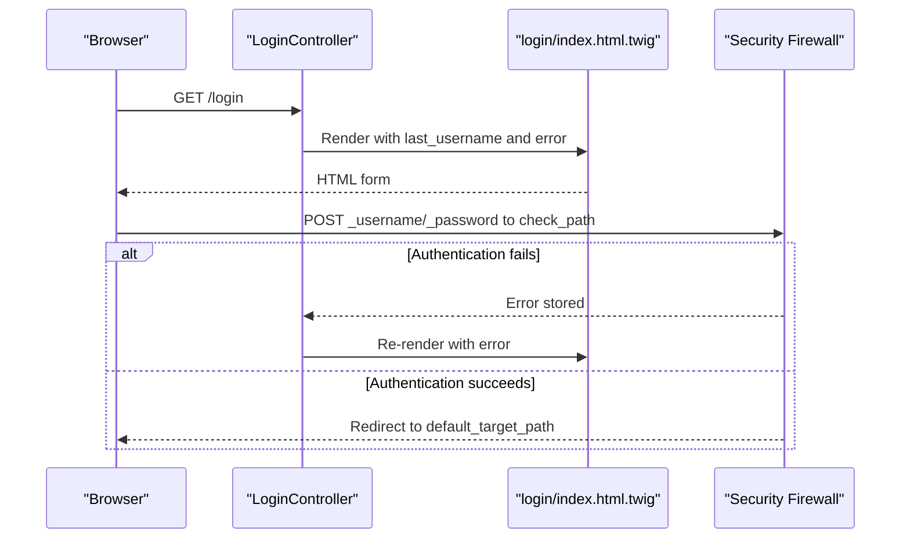
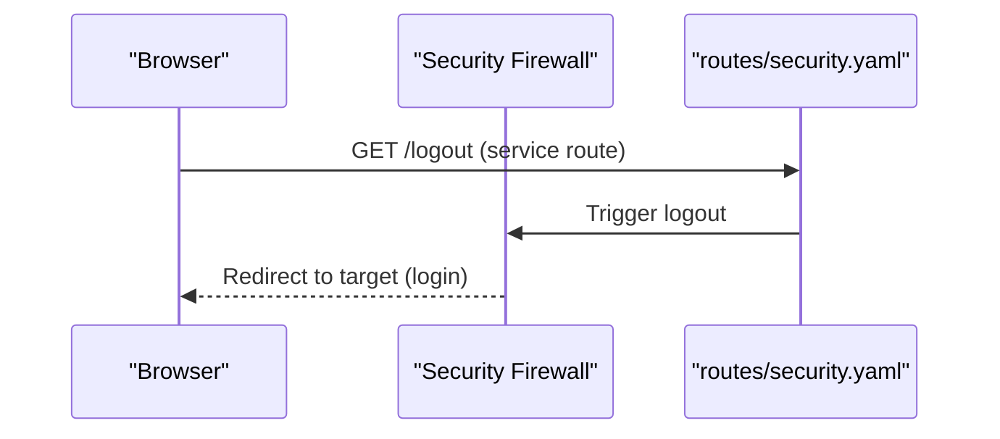
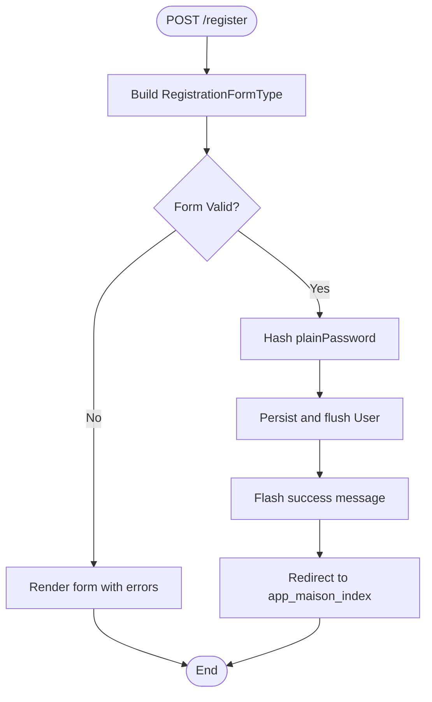
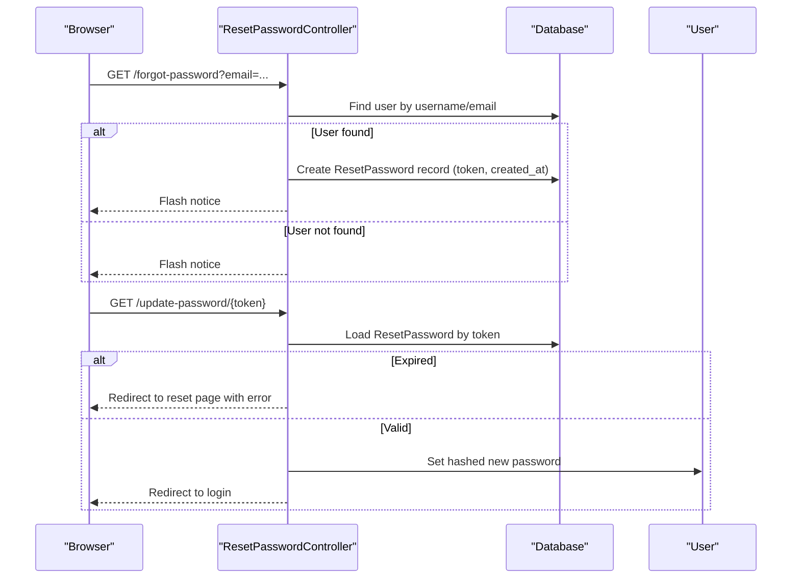
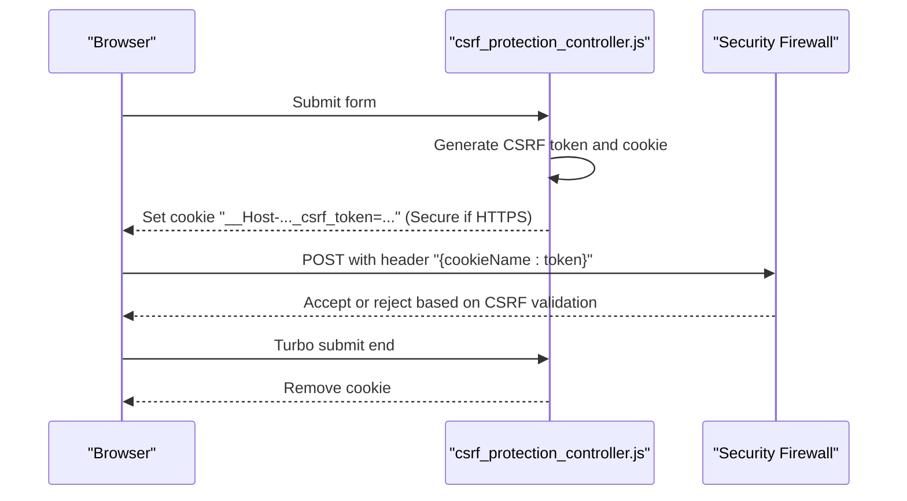
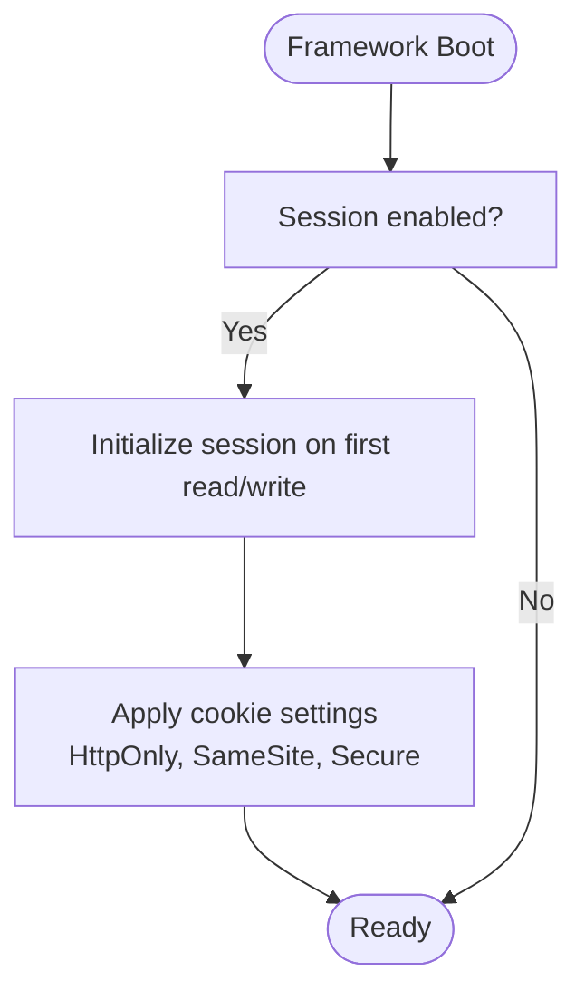
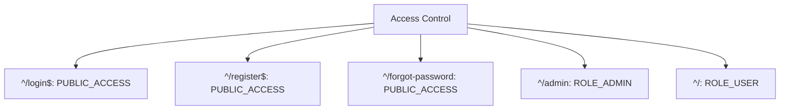
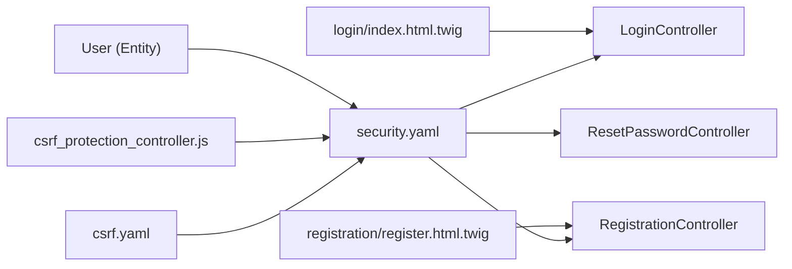

# Session and Authentication

<cite>
**Referenced Files in This Document**
- [LoginController.php](file://src/Controller/LoginController.php)
- [RegistrationController.php](file://src/Controller/RegistrationController.php)
- [ResetPasswordController.php](file://src/Controller/ResetPasswordController.php)
- [security.yaml](file://config/packages/security.yaml)
- [csrf.yaml](file://config/packages/csrf.yaml)
- [framework.yaml](file://config/packages/framework.yaml)
- [security.yaml (routes)](file://config/routes/security.yaml)
- [index.html.twig (login)](file://templates/login/index.html.twig)
- [register.html.twig](file://templates/registration/register.html.twig)
- [User.php](file://src/Entity/User.php)
- [RegistrationFormType.php](file://src/Form/RegistrationFormType.php)
- [csrf_protection_controller.js](file://assets/controllers/csrf_protection_controller.js)
</cite>

## Table of Contents
1. [Introduction](#introduction)
2. [Project Structure](#project-structure)
3. [Core Components](#core-components)
4. [Architecture Overview](#architecture-overview)
5. [Detailed Component Analysis](#detailed-component-analysis)
6. [Dependency Analysis](#dependency-analysis)
7. [Performance Considerations](#performance-considerations)
8. [Troubleshooting Guide](#troubleshooting-guide)
9. [Conclusion](#conclusion)
10. [Appendices](#appendices)

## Introduction
This document explains the session management and authentication workflows implemented in the project. It covers the login and logout processes, credential validation, session configuration, CSRF protection, error handling, automatic login after registration, persistent login options, session timeout handling, concurrent session management, and security token refresh mechanisms. It also provides examples of programmatic authentication and session manipulation.

## Project Structure
The authentication system spans controllers, Twig templates, configuration files, and frontend JavaScript for CSRF protection. Key areas:
- Controllers handle login, registration, and password reset flows.
- Security configuration defines firewalls, providers, access control, and logout behavior.
- Twig templates render login and registration forms and display errors.
- Frontend JavaScript generates and submits CSRF tokens for form and logout actions.
- The User entity implements security interfaces and serializes safely.

**Diagram sources**
- [LoginController.php:1-22](file://src/Controller/LoginController.php#L1-L22)
- [RegistrationController.php:1-44](file://src/Controller/RegistrationController.php#L1-L44)
- [ResetPasswordController.php:1-102](file://src/Controller/ResetPasswordController.php#L1-L102)
- [security.yaml:1-55](file://config/packages/security.yaml#L1-L55)
- [csrf.yaml:1-12](file://config/packages/csrf.yaml#L1-L12)
- [framework.yaml:1-16](file://config/packages/framework.yaml#L1-L16)
- [security.yaml (routes):1-4](file://config/routes/security.yaml#L1-L4)
- [index.html.twig (login):1-59](file://templates/login/index.html.twig#L1-L59)
- [register.html.twig:1-42](file://templates/registration/register.html.twig#L1-L42)
- [User.php:1-119](file://src/Entity/User.php#L1-L119)
- [RegistrationFormType.php:1-56](file://src/Form/RegistrationFormType.php#L1-L56)
- [csrf_protection_controller.js:1-82](file://assets/controllers/csrf_protection_controller.js#L1-L82)

**Section sources**
- [LoginController.php:1-22](file://src/Controller/LoginController.php#L1-L22)
- [RegistrationController.php:1-44](file://src/Controller/RegistrationController.php#L1-L44)
- [ResetPasswordController.php:1-102](file://src/Controller/ResetPasswordController.php#L1-L102)
- [security.yaml:1-55](file://config/packages/security.yaml#L1-L55)
- [csrf.yaml:1-12](file://config/packages/csrf.yaml#L1-L12)
- [framework.yaml:1-16](file://config/packages/framework.yaml#L1-L16)
- [security.yaml (routes):1-4](file://config/routes/security.yaml#L1-L4)
- [index.html.twig (login):1-59](file://templates/login/index.html.twig#L1-L59)
- [register.html.twig:1-42](file://templates/registration/register.html.twig#L1-L42)
- [User.php:1-119](file://src/Entity/User.php#L1-L119)
- [RegistrationFormType.php:1-56](file://src/Form/RegistrationFormType.php#L1-L56)
- [csrf_protection_controller.js:1-82](file://assets/controllers/csrf_protection_controller.js#L1-L82)

## Core Components
- LoginController renders the login page and exposes last username and authentication error to the template.
- RegistrationController handles user registration, password hashing, persistence, and redirects to the main page after success.
- ResetPasswordController manages password reset requests and updates passwords securely.
- Security configuration defines the main firewall with form-based authentication, logout, and access control.
- CSRF configuration enables stateless CSRF tokens for authentication and logout.
- Twig templates render forms and display flash messages and errors.
- User entity implements security interfaces and serializes safely to avoid storing raw password hashes in sessions.
- Frontend CSRF protection script generates and submits CSRF tokens for forms and logout.

**Section sources**
- [LoginController.php:1-22](file://src/Controller/LoginController.php#L1-L22)
- [RegistrationController.php:1-44](file://src/Controller/RegistrationController.php#L1-L44)
- [ResetPasswordController.php:1-102](file://src/Controller/ResetPasswordController.php#L1-L102)
- [security.yaml:1-55](file://config/packages/security.yaml#L1-L55)
- [csrf.yaml:1-12](file://config/packages/csrf.yaml#L1-L12)
- [index.html.twig (login):1-59](file://templates/login/index.html.twig#L1-L59)
- [register.html.twig:1-42](file://templates/registration/register.html.twig#L1-L42)
- [User.php:1-119](file://src/Entity/User.php#L1-L119)
- [csrf_protection_controller.js:1-82](file://assets/controllers/csrf_protection_controller.js#L1-L82)

## Architecture Overview
The authentication architecture combines Symfony’s Security component with Twig rendering and frontend CSRF protection. The main firewall handles form_login and logout via dedicated routes. Access control ensures protected paths require appropriate roles.

**Diagram sources**
- [LoginController.php:1-22](file://src/Controller/LoginController.php#L1-L22)
- [RegistrationController.php:1-44](file://src/Controller/RegistrationController.php#L1-L44)
- [ResetPasswordController.php:1-102](file://src/Controller/ResetPasswordController.php#L1-L102)
- [security.yaml:1-55](file://config/packages/security.yaml#L1-L55)
- [csrf.yaml:1-12](file://config/packages/csrf.yaml#L1-L12)
- [framework.yaml:1-16](file://config/packages/framework.yaml#L1-L16)
- [security.yaml (routes):1-4](file://config/routes/security.yaml#L1-L4)
- [index.html.twig (login):1-59](file://templates/login/index.html.twig#L1-L59)
- [register.html.twig:1-42](file://templates/registration/register.html.twig#L1-L42)
- [User.php:1-119](file://src/Entity/User.php#L1-L119)
- [csrf_protection_controller.js:1-82](file://assets/controllers/csrf_protection_controller.js#L1-L82)

## Detailed Component Analysis

### Login Workflow
- The login controller exposes the last username and the latest authentication error to the template.
- The login form posts to the firewall’s check_path, which is the same route as the login path.
- On failure, the firewall stores an authentication error; on success, the user is redirected to the configured default target path.

**Diagram sources**
- [LoginController.php:1-22](file://src/Controller/LoginController.php#L1-L22)
- [index.html.twig (login):1-59](file://templates/login/index.html.twig#L1-L59)
- [security.yaml:25-30](file://config/packages/security.yaml#L25-L30)

**Section sources**
- [LoginController.php:1-22](file://src/Controller/LoginController.php#L1-L22)
- [index.html.twig (login):1-59](file://templates/login/index.html.twig#L1-L59)
- [security.yaml:25-30](file://config/packages/security.yaml#L25-L30)

### Logout Workflow
- The logout path is provided by a service route loader and configured in the security firewall.
- On logout, the firewall invalidates the session and redirects to the configured target path.

**Diagram sources**
- [security.yaml:31-35](file://config/packages/security.yaml#L31-L35)
- [security.yaml (routes):1-4](file://config/routes/security.yaml#L1-L4)

**Section sources**
- [security.yaml:31-35](file://config/packages/security.yaml#L31-L35)
- [security.yaml (routes):1-4](file://config/routes/security.yaml#L1-L4)

### Registration and Automatic Login After Registration
- The registration controller builds a form, validates input, hashes the plain password, persists the user, and flashes a success message.
- After successful creation, the controller redirects to the main page; it does not automatically log in the user.
- To enable automatic login after registration, integrate a post-registration authentication step in the controller.

**Diagram sources**
- [RegistrationController.php:1-44](file://src/Controller/RegistrationController.php#L1-L44)
- [RegistrationFormType.php:1-56](file://src/Form/RegistrationFormType.php#L1-L56)
- [User.php:1-119](file://src/Entity/User.php#L1-L119)

**Section sources**
- [RegistrationController.php:1-44](file://src/Controller/RegistrationController.php#L1-L44)
- [RegistrationFormType.php:1-56](file://src/Form/RegistrationFormType.php#L1-L56)
- [User.php:1-119](file://src/Entity/User.php#L1-L119)

### Password Reset Workflow
- The reset controller sends a reset link to the user’s email and validates the token with an expiration window.
- On successful validation, it updates the user’s password and redirects to the login page.

**Diagram sources**
- [ResetPasswordController.php:1-102](file://src/Controller/ResetPasswordController.php#L1-L102)
- [User.php:1-119](file://src/Entity/User.php#L1-L119)

**Section sources**
- [ResetPasswordController.php:1-102](file://src/Controller/ResetPasswordController.php#L1-L102)
- [User.php:1-119](file://src/Entity/User.php#L1-L119)

### CSRF Protection
- Stateless CSRF tokens are enabled for authentication and logout actions.
- The frontend controller generates a CSRF cookie and token pair and attaches the token as a header during Turbo submissions.
- The cookie is removed after submission to prevent reuse.

**Diagram sources**
- [csrf.yaml:1-12](file://config/packages/csrf.yaml#L1-L12)
- [csrf_protection_controller.js:1-82](file://assets/controllers/csrf_protection_controller.js#L1-L82)
- [security.yaml:31-35](file://config/packages/security.yaml#L31-L35)

**Section sources**
- [csrf.yaml:1-12](file://config/packages/csrf.yaml#L1-L12)
- [csrf_protection_controller.js:1-82](file://assets/controllers/csrf_protection_controller.js#L1-L82)
- [security.yaml:31-35](file://config/packages/security.yaml#L31-L35)

### Session Configuration and Security Considerations
- Sessions are enabled globally; the session will start only on read/write.
- Secret is configured via environment variable.
- Cookie security defaults include HttpOnly and SameSite=Lax; consider setting SameSite=Strict for sensitive endpoints.
- For HTTPS environments, cookies can be marked Secure; the CSRF script adds the __Host prefix under HTTPS.

**Diagram sources**
- [framework.yaml:1-16](file://config/packages/framework.yaml#L1-L16)
- [csrf_protection_controller.js:42-44](file://assets/controllers/csrf_protection_controller.js#L42-L44)

**Section sources**
- [framework.yaml:1-16](file://config/packages/framework.yaml#L1-L16)
- [csrf_protection_controller.js:42-44](file://assets/controllers/csrf_protection_controller.js#L42-L44)

### Access Control and Role-Based Authorization
- Access control rules define public routes for login, registration, and password reset.
- Admin paths require ROLE_ADMIN; general application paths require ROLE_USER.

**Diagram sources**
- [security.yaml:40-45](file://config/packages/security.yaml#L40-L45)

**Section sources**
- [security.yaml:40-45](file://config/packages/security.yaml#L40-L45)

### Programmatic Authentication and Session Manipulation
- To programmatically authenticate a user after registration, use the Security component’s guard or token storage to create an authenticated token and set it on the current request.
- To manipulate sessions, use the Request object to read/write attributes or the session service to manage data.
- To refresh security tokens, regenerate the CSRF token after sensitive operations and ensure the cookie is updated accordingly.

[No sources needed since this section provides general guidance]

## Dependency Analysis
The authentication system depends on:
- Security configuration for firewall, provider, and access control.
- Controllers for rendering and handling requests.
- Templates for user-facing forms and error displays.
- CSRF configuration and frontend script for token management.
- Domain model implementing security interfaces.

**Diagram sources**
- [security.yaml:1-55](file://config/packages/security.yaml#L1-L55)
- [csrf.yaml:1-12](file://config/packages/csrf.yaml#L1-L12)
- [csrf_protection_controller.js:1-82](file://assets/controllers/csrf_protection_controller.js#L1-L82)
- [User.php:1-119](file://src/Entity/User.php#L1-L119)
- [LoginController.php:1-22](file://src/Controller/LoginController.php#L1-L22)
- [RegistrationController.php:1-44](file://src/Controller/RegistrationController.php#L1-L44)
- [ResetPasswordController.php:1-102](file://src/Controller/ResetPasswordController.php#L1-L102)
- [index.html.twig (login):1-59](file://templates/login/index.html.twig#L1-L59)
- [register.html.twig:1-42](file://templates/registration/register.html.twig#L1-L42)

**Section sources**
- [security.yaml:1-55](file://config/packages/security.yaml#L1-L55)
- [csrf.yaml:1-12](file://config/packages/csrf.yaml#L1-L12)
- [csrf_protection_controller.js:1-82](file://assets/controllers/csrf_protection_controller.js#L1-L82)
- [User.php:1-119](file://src/Entity/User.php#L1-L119)
- [LoginController.php:1-22](file://src/Controller/LoginController.php#L1-L22)
- [RegistrationController.php:1-44](file://src/Controller/RegistrationController.php#L1-L44)
- [ResetPasswordController.php:1-102](file://src/Controller/ResetPasswordController.php#L1-L102)
- [index.html.twig (login):1-59](file://templates/login/index.html.twig#L1-L59)
- [register.html.twig:1-42](file://templates/registration/register.html.twig#L1-L42)

## Performance Considerations
- Keep sessions lazy by relying on the lazy firewall option to avoid unnecessary session reads.
- Minimize session writes; only store essential data.
- Use CSRF stateless tokens to reduce server-side token storage overhead.
- Ensure password hashing cost is appropriate for your environment to balance security and performance.

[No sources needed since this section provides general guidance]

## Troubleshooting Guide
- Login errors: Inspect the authentication error exposed in the login template and verify credentials and provider configuration.
- CSRF failures: Confirm the CSRF cookie and header are present during submission and that stateless token IDs include the authentication/logout actions.
- Logout issues: Verify the logout route is registered and the firewall’s logout configuration matches the route path.
- Session not starting: Ensure the session is accessed (read/write) or explicitly enabled in framework configuration.
- Role-based access denied: Review access control rules and user roles.

**Section sources**
- [index.html.twig (login):1-59](file://templates/login/index.html.twig#L1-L59)
- [csrf.yaml:1-12](file://config/packages/csrf.yaml#L1-L12)
- [security.yaml:31-35](file://config/packages/security.yaml#L31-L35)
- [framework.yaml:1-16](file://config/packages/framework.yaml#L1-L16)
- [security.yaml:40-45](file://config/packages/security.yaml#L40-L45)

## Conclusion
The project implements a robust authentication system using Symfony’s Security component with form-based login, logout, and CSRF protection. Access control and role-based permissions are enforced centrally. Sessions are configured securely with cookie defaults suitable for production. The system can be extended to support automatic login after registration, persistent login options, session timeout handling, and concurrent session management by adjusting configuration and adding custom logic.

## Appendices
- Automatic login after registration: Add a step in the registration controller to authenticate the user programmatically after persisting and flushing.
- Persistent login: Introduce “remember me” functionality via a remember-me token mechanism configured in the firewall.
- Session timeout: Configure session lifetime and idle timeouts in framework session settings and enforce inactivity checks.
- Concurrent sessions: Limit concurrent sessions per user via custom logic or session identifiers.
- Token refresh: Refresh CSRF tokens after sensitive operations and ensure the frontend script updates cookies and headers accordingly.

[No sources needed since this section provides general guidance]