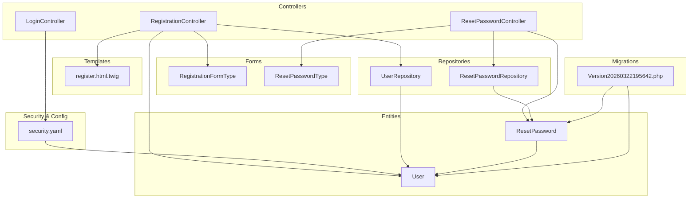
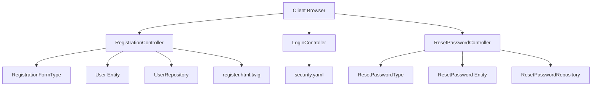
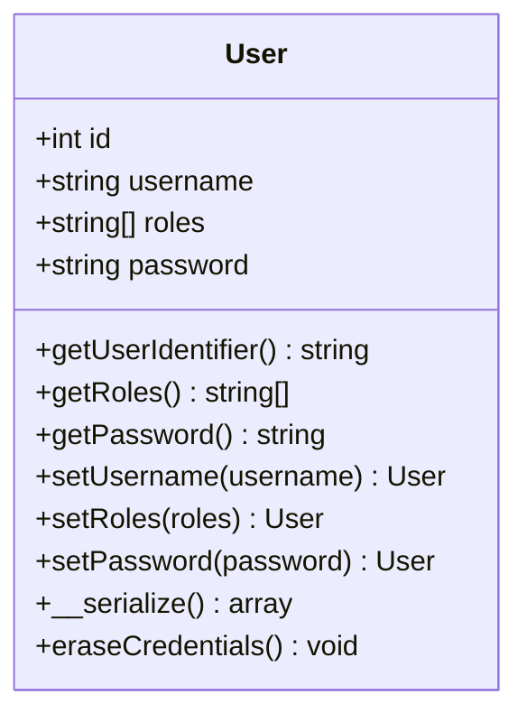
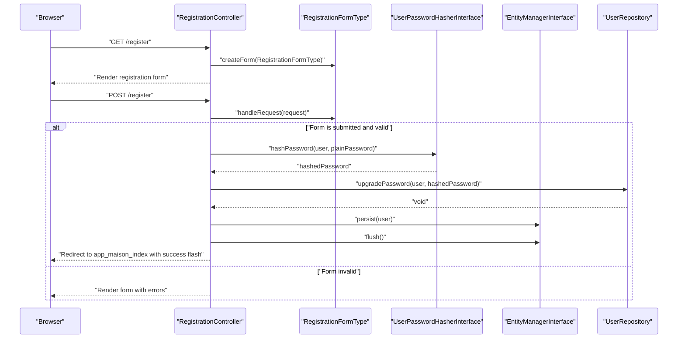
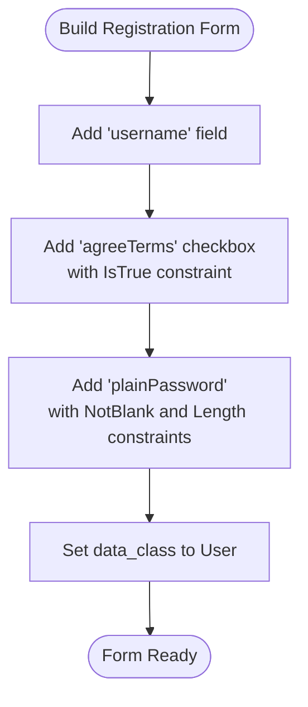
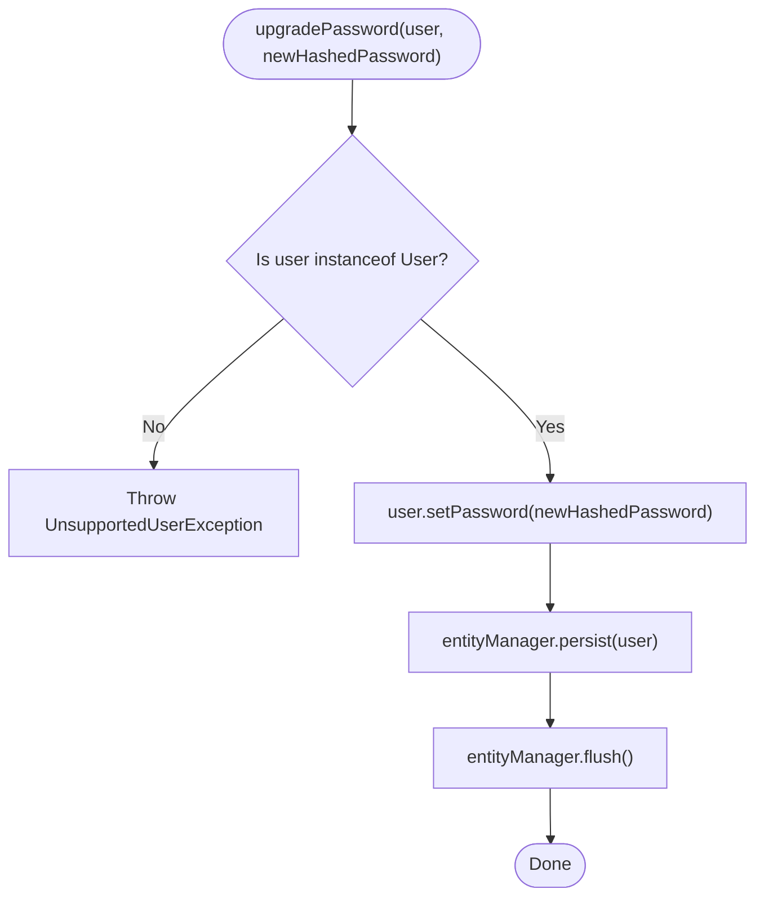
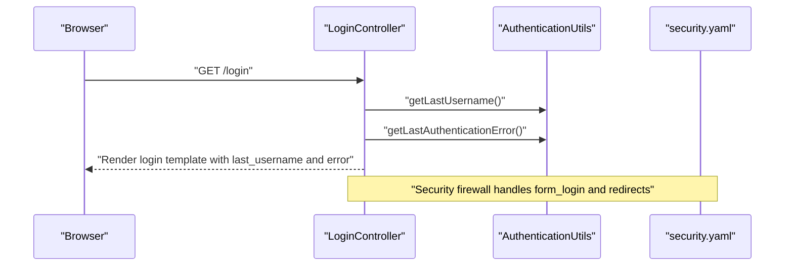
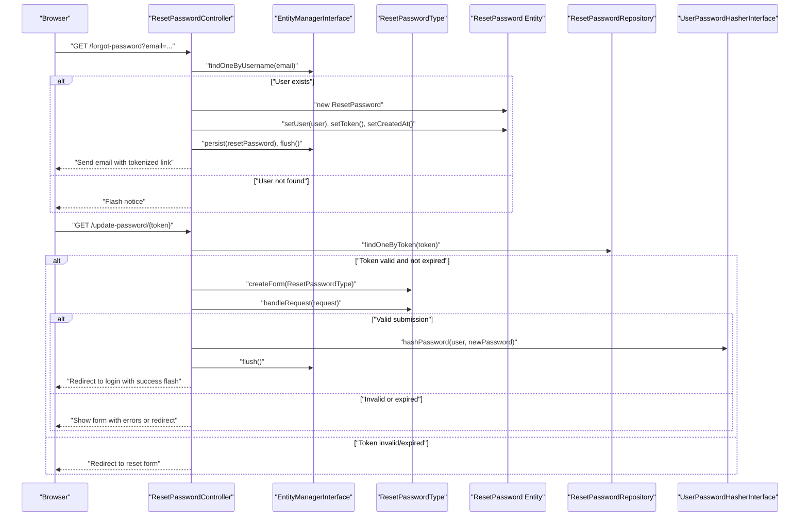
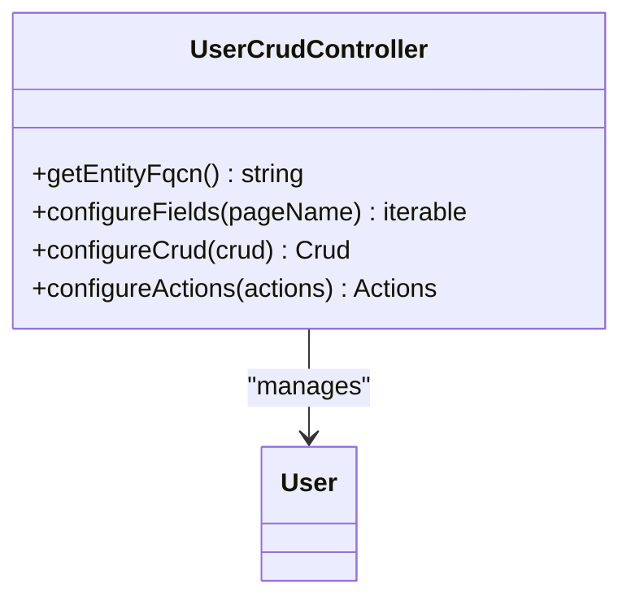
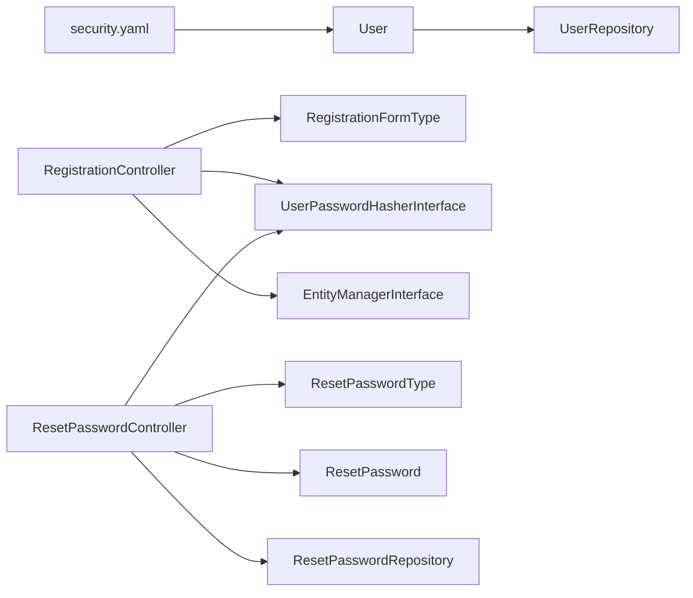

# User Management

<cite>
**Referenced Files in This Document**
- [User.php](file://src/Entity/User.php)
- [UserRepository.php](file://src/Repository/UserRepository.php)
- [RegistrationController.php](file://src/Controller/RegistrationController.php)
- [RegistrationFormType.php](file://src/Form/RegistrationFormType.php)
- [register.html.twig](file://templates/registration/register.html.twig)
- [LoginController.php](file://src/Controller/LoginController.php)
- [ResetPasswordController.php](file://src/Controller/ResetPasswordController.php)
- [ResetPasswordType.php](file://src/Form/ResetPasswordType.php)
- [ResetPassword.php](file://src/Entity/ResetPassword.php)
- [ResetPasswordRepository.php](file://src/Repository/ResetPasswordRepository.php)
- [security.yaml](file://config/packages/security.yaml)
- [Version20260322195642.php](file://migrations/Version20260322195642.php)
- [UserCrudController.php](file://src/Controller/Admin/UserCrudController.php)
</cite>

## Table of Contents
1. [Introduction](#introduction)
2. [Project Structure](#project-structure)
3. [Core Components](#core-components)
4. [Architecture Overview](#architecture-overview)
5. [Detailed Component Analysis](#detailed-component-analysis)
6. [Dependency Analysis](#dependency-analysis)
7. [Performance Considerations](#performance-considerations)
8. [Troubleshooting Guide](#troubleshooting-guide)
9. [Conclusion](#conclusion)
10. [Appendices](#appendices)

## Introduction
This document provides comprehensive documentation for the user management system. It covers the User entity definition, validation constraints, and relationships; the end-to-end registration workflow including form handling, password hashing, and role assignment; the UserRepository methods for user lookup and password upgrades; the RegistrationController implementation; and supporting features such as password reset and administrative management. Guidance is included for integrating the User entity in controllers and services, along with diagrams and references to the relevant source files.

## Project Structure
The user management system spans several layers:
- Entities define the persistent model (User, ResetPassword).
- Repositories encapsulate data access and special operations (UserRepository, ResetPasswordRepository).
- Forms provide server-side validation and binding (RegistrationFormType, ResetPasswordType).
- Controllers orchestrate workflows (RegistrationController, LoginController, ResetPasswordController).
- Security configuration defines authentication and access control.
- Templates render forms and views (registration/register.html.twig, login templates).
- Migrations define database schema changes (including JSON roles and reset_password table).

**Diagram sources**
- [security.yaml:1-55](file://config/packages/security.yaml#L1-L55)
- [RegistrationController.php:14-44](file://src/Controller/RegistrationController.php#L14-L44)
- [LoginController.php:7-22](file://src/Controller/LoginController.php#L7-L22)
- [ResetPasswordController.php:16-102](file://src/Controller/ResetPasswordController.php#L16-L102)
- [RegistrationFormType.php:15-56](file://src/Form/RegistrationFormType.php#L15-L56)
- [ResetPasswordType.php:12-52](file://src/Form/ResetPasswordType.php#L12-L52)
- [User.php:14-118](file://src/Entity/User.php#L14-L118)
- [ResetPassword.php:9-66](file://src/Entity/ResetPassword.php#L9-L66)
- [UserRepository.php:15-61](file://src/Repository/UserRepository.php#L15-L61)
- [ResetPasswordRepository.php:12-44](file://src/Repository/ResetPasswordRepository.php#L12-L44)
- [register.html.twig:1-42](file://templates/registration/register.html.twig#L1-L42)
- [Version20260322195642.php:13-38](file://migrations/Version20260322195642.php#L13-L38)

**Section sources**
- [security.yaml:1-55](file://config/packages/security.yaml#L1-L55)
- [RegistrationController.php:14-44](file://src/Controller/RegistrationController.php#L14-L44)
- [User.php:14-118](file://src/Entity/User.php#L14-L118)
- [UserRepository.php:15-61](file://src/Repository/UserRepository.php#L15-L61)
- [RegistrationFormType.php:15-56](file://src/Form/RegistrationFormType.php#L15-L56)
- [ResetPasswordController.php:16-102](file://src/Controller/ResetPasswordController.php#L16-L102)
- [ResetPassword.php:9-66](file://src/Entity/ResetPassword.php#L9-L66)
- [ResetPasswordRepository.php:12-44](file://src/Repository/ResetPasswordRepository.php#L12-L44)
- [register.html.twig:1-42](file://templates/registration/register.html.twig#L1-L42)
- [Version20260322195642.php:13-38](file://migrations/Version20260322195642.php#L13-L38)

## Core Components
- User entity: Implements security interfaces, stores username, roles, and hashed password, and ensures serialized session safety.
- UserRepository: Provides password upgrade capability and serves as the persistence gateway for User.
- RegistrationController: Handles registration form submission, validation, password hashing, persistence, and redirect.
- RegistrationFormType: Declares form fields and validation constraints for registration.
- LoginController: Integrates with Symfony Security to present login form and handle errors.
- ResetPasswordController: Manages password reset requests and updates via tokenized links.
- ResetPassword entity and repository: Support password reset tokens and lifecycle.
- Security configuration: Defines password hashers, providers, firewalls, and access control.
- Migration: Defines database schema for user roles and reset_password table.

**Section sources**
- [User.php:14-118](file://src/Entity/User.php#L14-L118)
- [UserRepository.php:15-61](file://src/Repository/UserRepository.php#L15-L61)
- [RegistrationController.php:14-44](file://src/Controller/RegistrationController.php#L14-L44)
- [RegistrationFormType.php:15-56](file://src/Form/RegistrationFormType.php#L15-L56)
- [LoginController.php:7-22](file://src/Controller/LoginController.php#L7-L22)
- [ResetPasswordController.php:16-102](file://src/Controller/ResetPasswordController.php#L16-L102)
- [ResetPassword.php:9-66](file://src/Entity/ResetPassword.php#L9-L66)
- [ResetPasswordRepository.php:12-44](file://src/Repository/ResetPasswordRepository.php#L12-L44)
- [security.yaml:1-55](file://config/packages/security.yaml#L1-L55)
- [Version20260322195642.php:13-38](file://migrations/Version20260322195642.php#L13-L38)

## Architecture Overview
The system follows a layered architecture:
- Presentation layer: Controllers and Twig templates.
- Application layer: Controllers coordinate workflows and delegate to services where applicable.
- Domain layer: Entities represent the user model and reset tokens.
- Infrastructure layer: Repositories, security configuration, and migrations.

**Diagram sources**
- [RegistrationController.php:14-44](file://src/Controller/RegistrationController.php#L14-L44)
- [LoginController.php:7-22](file://src/Controller/LoginController.php#L7-L22)
- [ResetPasswordController.php:16-102](file://src/Controller/ResetPasswordController.php#L16-L102)
- [RegistrationFormType.php:15-56](file://src/Form/RegistrationFormType.php#L15-L56)
- [ResetPasswordType.php:12-52](file://src/Form/ResetPasswordType.php#L12-L52)
- [User.php:14-118](file://src/Entity/User.php#L14-L118)
- [ResetPassword.php:9-66](file://src/Entity/ResetPassword.php#L9-L66)
- [UserRepository.php:15-61](file://src/Repository/UserRepository.php#L15-L61)
- [ResetPasswordRepository.php:12-44](file://src/Repository/ResetPasswordRepository.php#L12-L44)
- [security.yaml:1-55](file://config/packages/security.yaml#L1-L55)
- [register.html.twig:1-42](file://templates/registration/register.html.twig#L1-L42)

## Detailed Component Analysis

### User Entity
- Fields and constraints:
  - id: auto-incremented integer primary key.
  - username: unique, non-blank string used as the user identifier.
  - roles: array of role strings persisted as JSON.
  - password: hashed password string.
- Validation:
  - Unique username enforced at the ORM level and via a unique constraint.
  - Roles are normalized to ensure every user has at least ROLE_USER.
- Security serialization:
  - Password is CRC32C-hashed during serialization to avoid storing raw hashes in sessions.

**Diagram sources**
- [User.php:14-118](file://src/Entity/User.php#L14-L118)

**Section sources**
- [User.php:14-118](file://src/Entity/User.php#L14-L118)
- [Version20260322195642.php:25](file://migrations/Version20260322195642.php#L25)

### Registration Workflow
End-to-end registration flow:
- The controller creates a User instance and binds it to RegistrationFormType.
- On valid submission, the plain password is hashed and stored.
- The user is persisted and flushed to the database.
- A success flash message is shown and the user is redirected to the main page.

**Diagram sources**
- [RegistrationController.php:17-42](file://src/Controller/RegistrationController.php#L17-L42)
- [RegistrationFormType.php:17-46](file://src/Form/RegistrationFormType.php#L17-L46)
- [UserRepository.php:25-34](file://src/Repository/UserRepository.php#L25-L34)

**Section sources**
- [RegistrationController.php:14-44](file://src/Controller/RegistrationController.php#L14-L44)
- [RegistrationFormType.php:15-56](file://src/Form/RegistrationFormType.php#L15-L56)
- [UserRepository.php:15-61](file://src/Repository/UserRepository.php#L15-L61)
- [register.html.twig:1-42](file://templates/registration/register.html.twig#L1-L42)

### RegistrationFormType
- Fields:
  - username: mapped to the User entity.
  - agreeTerms: checkbox constraint ensuring agreement to terms.
  - plainPassword: un-mapped field for password input with constraints.
- Constraints:
  - Not blank and minimum length for password.
  - Terms agreement required.

**Diagram sources**
- [RegistrationFormType.php:17-54](file://src/Form/RegistrationFormType.php#L17-L54)

**Section sources**
- [RegistrationFormType.php:15-56](file://src/Form/RegistrationFormType.php#L15-L56)

### UserRepository Methods
- upgradePassword:
  - Validates user type, sets the new hashed password, persists, and flushes.
- Additional custom queries:
  - Example commented blocks demonstrate typical finder patterns (findByExampleField, findOneBySomeField) that can be enabled as needed.

**Diagram sources**
- [UserRepository.php:25-34](file://src/Repository/UserRepository.php#L25-L34)

**Section sources**
- [UserRepository.php:15-61](file://src/Repository/UserRepository.php#L15-L61)

### LoginController
- Integrates with AuthenticationUtils to retrieve last username and last authentication error.
- Renders the login template with contextual data.

**Diagram sources**
- [LoginController.php:10-21](file://src/Controller/LoginController.php#L10-L21)
- [security.yaml:26-34](file://config/packages/security.yaml#L26-L34)

**Section sources**
- [LoginController.php:7-22](file://src/Controller/LoginController.php#L7-L22)
- [security.yaml:14-46](file://config/packages/security.yaml#L14-L46)

### Password Reset Workflow
- Request reset:
  - Controller checks for an existing user by username/email, creates a ResetPassword record with a token and timestamp, and sends an email with a tokenized link.
- Update password:
  - Token verification and expiration check; form validation; password hashing and update; success redirect.

**Diagram sources**
- [ResetPasswordController.php:25-102](file://src/Controller/ResetPasswordController.php#L25-L102)
- [ResetPassword.php:9-66](file://src/Entity/ResetPassword.php#L9-L66)
- [ResetPasswordRepository.php:12-44](file://src/Repository/ResetPasswordRepository.php#L12-L44)
- [ResetPasswordType.php:14-51](file://src/Form/ResetPasswordType.php#L14-L51)

**Section sources**
- [ResetPasswordController.php:16-102](file://src/Controller/ResetPasswordController.php#L16-L102)
- [ResetPassword.php:9-66](file://src/Entity/ResetPassword.php#L9-L66)
- [ResetPasswordRepository.php:12-44](file://src/Repository/ResetPasswordRepository.php#L12-L44)
- [ResetPasswordType.php:12-52](file://src/Form/ResetPasswordType.php#L12-L52)

### Administrative User Management
- EasyAdmin integration:
  - UserCrudController exposes fields for id, username, roles, and password (hidden in index/detail).
  - Pagination and action customization are configured.

**Diagram sources**
- [UserCrudController.php:15-44](file://src/Controller/Admin/UserCrudController.php#L15-L44)
- [User.php:14-118](file://src/Entity/User.php#L14-L118)

**Section sources**
- [UserCrudController.php:15-44](file://src/Controller/Admin/UserCrudController.php#L15-L44)
- [User.php:14-118](file://src/Entity/User.php#L14-L118)

## Dependency Analysis
- User depends on UserRepository for persistence and password upgrades.
- RegistrationController depends on RegistrationFormType, UserPasswordHasherInterface, and EntityManagerInterface.
- ResetPasswordController depends on ResetPasswordType, ResetPassword entity/repository, and UserPasswordHasherInterface.
- Security configuration ties providers, firewalls, and access control to the User entity.

**Diagram sources**
- [User.php:14-118](file://src/Entity/User.php#L14-L118)
- [UserRepository.php:15-61](file://src/Repository/UserRepository.php#L15-L61)
- [RegistrationController.php:17-42](file://src/Controller/RegistrationController.php#L17-L42)
- [RegistrationFormType.php:17-54](file://src/Form/RegistrationFormType.php#L17-L54)
- [ResetPasswordController.php:64-102](file://src/Controller/ResetPasswordController.php#L64-L102)
- [ResetPassword.php:9-66](file://src/Entity/ResetPassword.php#L9-L66)
- [ResetPasswordRepository.php:12-44](file://src/Repository/ResetPasswordRepository.php#L12-L44)
- [security.yaml:14-46](file://config/packages/security.yaml#L14-L46)

**Section sources**
- [User.php:14-118](file://src/Entity/User.php#L14-L118)
- [UserRepository.php:15-61](file://src/Repository/UserRepository.php#L15-L61)
- [RegistrationController.php:14-44](file://src/Controller/RegistrationController.php#L14-L44)
- [ResetPasswordController.php:16-102](file://src/Controller/ResetPasswordController.php#L16-L102)
- [security.yaml:1-55](file://config/packages/security.yaml#L1-L55)

## Performance Considerations
- Password hashing is handled by the framework’s hasher interface; ensure appropriate algorithm selection in production.
- Role storage as JSON reduces normalization overhead compared to separate role tables.
- Prefer batch operations and pagination in administrative views to manage large datasets efficiently.
- Use database indexes on frequently queried fields (e.g., username) to optimize lookups.

## Troubleshooting Guide
- Registration form validation failures:
  - Verify constraints in RegistrationFormType and ensure the form is bound to the User entity.
  - Confirm that the form submission triggers validation and that errors are rendered in the template.
- Password reset token issues:
  - Check token existence and expiration logic in ResetPasswordController.
  - Ensure ResetPassword entity and repository are correctly configured.
- Authentication errors:
  - Review security.yaml firewall configuration and access_control rules.
  - Confirm that the provider uses the correct entity and property for user identification.

**Section sources**
- [RegistrationFormType.php:17-54](file://src/Form/RegistrationFormType.php#L17-L54)
- [register.html.twig:13-30](file://templates/registration/register.html.twig#L13-L30)
- [ResetPasswordController.php:64-102](file://src/Controller/ResetPasswordController.php#L64-L102)
- [security.yaml:14-46](file://config/packages/security.yaml#L14-L46)

## Conclusion
The user management system integrates a secure User entity, robust form validation, and clear controller workflows for registration and password reset. Security is configured centrally, and administrative capabilities are provided via EasyAdmin. The documented components and flows enable reliable user lifecycle management with maintainable code and clear separation of concerns.

## Appendices
- Database schema highlights:
  - User roles stored as JSON.
  - ResetPassword table with foreign key to User.

**Section sources**
- [Version20260322195642.php:23-25](file://migrations/Version20260322195642.php#L23-L25)