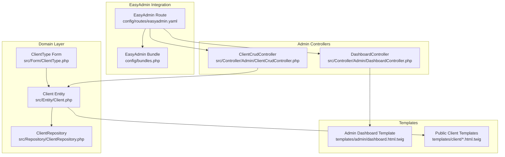
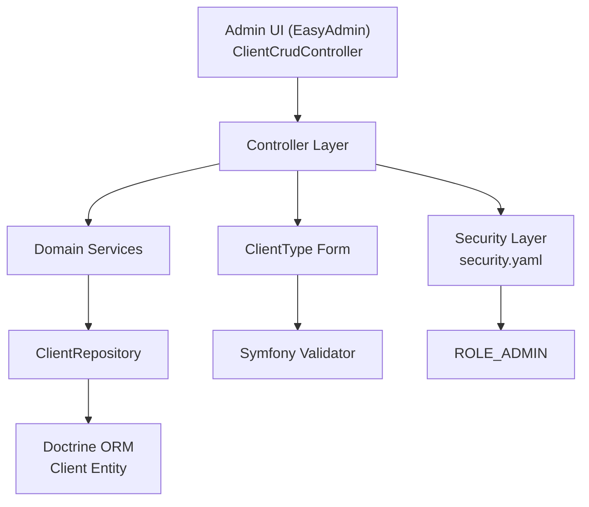
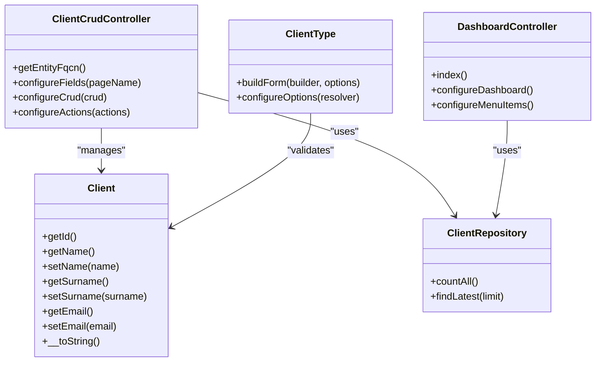
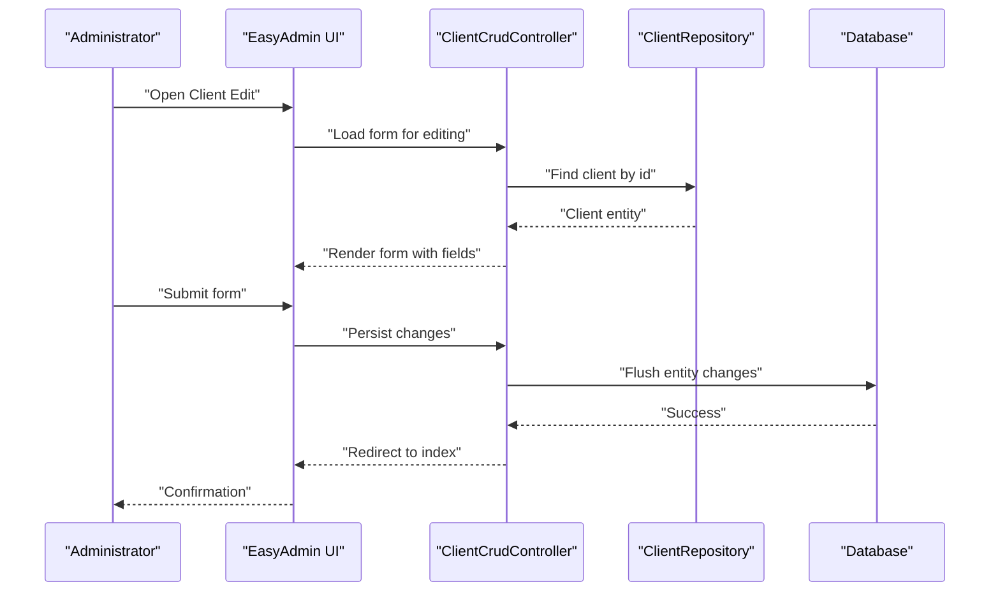
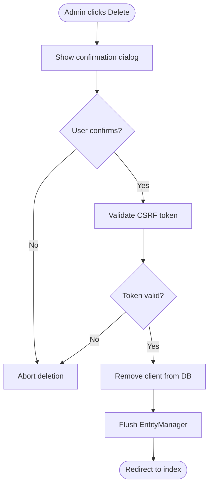

# Administrative Client Management

<cite>
**Referenced Files in This Document**
- [ClientCrudController.php](file://src/Controller/Admin/ClientCrudController.php)
- [Client.php](file://src/Entity/Client.php)
- [ClientType.php](file://src/Form/ClientType.php)
- [ClientRepository.php](file://src/Repository/ClientRepository.php)
- [DashboardController.php](file://src/Controller/Admin/DashboardController.php)
- [dashboard.html.twig](file://templates/admin/dashboard.html.twig)
- [security.yaml](file://config/packages/security.yaml)
- [easyadmin.yaml](file://config/routes/easyadmin.yaml)
- [bundles.php](file://config/bundles.php)
- [composer.json](file://composer.json)
- [index.html.twig](file://templates/client/index.html.twig)
- [show.html.twig](file://templates/client/show.html.twig)
- [edit.html.twig](file://templates/client/edit.html.twig)
- [new.html.twig](file://templates/client/new.html.twig)
- [_form.html.twig](file://templates/client/_form.html.twig)
- [_delete_form.html.twig](file://templates/client/_delete_form.html.twig)
- [ClientController.php](file://src/Controller/ClientController.php)
- [Version20260322195642.php](file://migrations/Version20260322195642.php)
</cite>

## Table of Contents
1. [Introduction](#introduction)
2. [Project Structure](#project-structure)
3. [Core Components](#core-components)
4. [Architecture Overview](#architecture-overview)
5. [Detailed Component Analysis](#detailed-component-analysis)
6. [Dependency Analysis](#dependency-analysis)
7. [Performance Considerations](#performance-considerations)
8. [Troubleshooting Guide](#troubleshooting-guide)
9. [Conclusion](#conclusion)
10. [Appendices](#appendices)

## Introduction
This document explains how administrative client management is implemented using EasyAdmin in the project. It covers the ClientCrudController configuration, CRUD operation setup, and administrative interface customization. It also documents administrative forms for client creation, editing, and deletion, including field validation and display options. The administrative workflow for client oversight, data modification capabilities, and bulk operations is described, along with EasyAdmin bundle integration, custom field configurations, and administrative permission requirements. Finally, it addresses client data auditing, change tracking, and administrative reporting features, with examples of administrative client management interfaces and operational procedures.

## Project Structure
The administrative client management is centered around EasyAdmin’s CRUD controllers and supporting Symfony components:
- EasyAdmin integration via routes and bundles
- Client entity and repository for persistence
- Client form type for validation and rendering
- Admin controllers for dashboards and CRUD
- Twig templates for admin and public-facing client views

**Diagram sources**
- [easyadmin.yaml:1-4](file://config/routes/easyadmin.yaml#L1-L4)
- [bundles.php:17-17](file://config/bundles.php#L17-L17)
- [DashboardController.php:21-87](file://src/Controller/Admin/DashboardController.php#L21-L87)
- [ClientCrudController.php:13-42](file://src/Controller/Admin/ClientCrudController.php#L13-L42)
- [Client.php:8-8](file://src/Entity/Client.php#L8-L8)
- [ClientRepository.php:12-35](file://src/Repository/ClientRepository.php#L12-L35)
- [ClientType.php:10-27](file://src/Form/ClientType.php#L10-L27)
- [dashboard.html.twig:1-263](file://templates/admin/dashboard.html.twig#L1-L263)
- [index.html.twig:1-37](file://templates/client/index.html.twig#L1-L37)

**Section sources**
- [easyadmin.yaml:1-4](file://config/routes/easyadmin.yaml#L1-L4)
- [bundles.php:17-17](file://config/bundles.php#L17-L17)
- [DashboardController.php:21-87](file://src/Controller/Admin/DashboardController.php#L21-L87)
- [ClientCrudController.php:13-42](file://src/Controller/Admin/ClientCrudController.php#L13-L42)
- [Client.php:8-8](file://src/Entity/Client.php#L8-L8)
- [ClientRepository.php:12-35](file://src/Repository/ClientRepository.php#L12-L35)
- [ClientType.php:10-27](file://src/Form/ClientType.php#L10-L27)
- [dashboard.html.twig:1-263](file://templates/admin/dashboard.html.twig#L1-L263)
- [index.html.twig:1-37](file://templates/client/index.html.twig#L1-L37)

## Core Components
- ClientCrudController: Defines the EasyAdmin CRUD interface for the Client entity, including field layout, pagination, and actions.
- Client entity: Represents persisted client data with basic attributes and string representation.
- ClientRepository: Provides domain queries for client counts and latest entries.
- ClientType form: Validates and renders client creation/editing forms.
- DashboardController: Integrates the admin dashboard with menu items and statistics.
- Security configuration: Enforces role-based access control for admin routes.

Key responsibilities:
- EasyAdmin CRUD: Listing, filtering, sorting, paginating, and performing create/edit/delete on clients.
- Validation: Form-level validation via ClientType.
- Permissions: Access control enforced by security.yaml for admin routes.
- Reporting: Dashboard aggregates client and reservation metrics.

**Section sources**
- [ClientCrudController.php:13-42](file://src/Controller/Admin/ClientCrudController.php#L13-L42)
- [Client.php:8-70](file://src/Entity/Client.php#L8-L70)
- [ClientRepository.php:12-35](file://src/Repository/ClientRepository.php#L12-L35)
- [ClientType.php:10-27](file://src/Form/ClientType.php#L10-L27)
- [DashboardController.php:21-87](file://src/Controller/Admin/DashboardController.php#L21-L87)
- [security.yaml:40-45](file://config/packages/security.yaml#L40-L45)

## Architecture Overview
The administrative client management follows a layered architecture:
- Presentation: EasyAdmin renders admin pages and integrates with the dashboard.
- Domain: Client entity encapsulates client data and behavior.
- Persistence: ClientRepository provides data access methods.
- Forms: ClientType handles validation and rendering.
- Security: Role-based access controls protect admin routes.

**Diagram sources**
- [ClientCrudController.php:13-42](file://src/Controller/Admin/ClientCrudController.php#L13-L42)
- [ClientRepository.php:12-35](file://src/Repository/ClientRepository.php#L12-L35)
- [Client.php:8-70](file://src/Entity/Client.php#L8-L70)
- [ClientType.php:10-27](file://src/Form/ClientType.php#L10-L27)
- [security.yaml:40-45](file://config/packages/security.yaml#L40-L45)

## Detailed Component Analysis

### ClientCrudController Configuration
- Entity binding: Declares the Client entity as the managed resource.
- Fields configuration: Displays ID (hidden on forms), name, surname, and email; ID is hidden on forms to prevent manual edits.
- Pagination: Sets page size and paginator range for efficient browsing.
- Actions: Adds a detail action to the index view for quick inspection.

Operational implications:
- Administrators can create, update, and delete clients via the EasyAdmin interface.
- Sorting and filtering are available by default on textual fields.
- Bulk operations are not explicitly configured in this controller; administrators can select multiple items on the index page and apply available actions.

**Section sources**
- [ClientCrudController.php:15-18](file://src/Controller/Admin/ClientCrudController.php#L15-L18)
- [ClientCrudController.php:20-28](file://src/Controller/Admin/ClientCrudController.php#L20-L28)
- [ClientCrudController.php:30-35](file://src/Controller/Admin/ClientCrudController.php#L30-L35)
- [ClientCrudController.php:37-41](file://src/Controller/Admin/ClientCrudController.php#L37-L41)

### Client Entity and Repository
- Entity: Provides getters/setters for id, name, surname, and email, plus a string representation combining name and surname.
- Repository: Offers countAll and findLatest methods to support dashboard statistics and recent entries.

Data integrity:
- The entity uses Doctrine ORM annotations for mapping.
- String length constraints are defined at the ORM level.

**Section sources**
- [Client.php:8-70](file://src/Entity/Client.php#L8-L70)
- [ClientRepository.php:12-35](file://src/Repository/ClientRepository.php#L12-L35)

### Client Form Type
- Fields: Mirrors the entity with name, surname, and email.
- Validation: Delegated to Symfony’s validation pipeline; constraints can be added via annotations or configuration.
- Rendering: Used by both EasyAdmin and public templates for consistent UX.

Best practices:
- Add validation constraints (e.g., NotBlank, Email) to enforce data quality.
- Consider adding normalization (trimming whitespace) in a custom form extension.

**Section sources**
- [ClientType.php:10-27](file://src/Form/ClientType.php#L10-L27)

### Dashboard and Menu Integration
- DashboardController builds statistics and menu items linking to CRUD controllers.
- Menu items include links to Clients, Maisons, Reservations, Propriétaires, and Users.
- The dashboard template renders cards and tables for quick insights.

**Section sources**
- [DashboardController.php:21-87](file://src/Controller/Admin/DashboardController.php#L21-L87)
- [dashboard.html.twig:1-263](file://templates/admin/dashboard.html.twig#L1-L263)

### Security and Permissions
- Access control enforces ROLE_ADMIN for admin routes.
- Public routes remain accessible to unauthenticated users as needed.

Administrative access:
- Only users with ROLE_ADMIN can navigate to the admin area and manage clients.

**Section sources**
- [security.yaml:40-45](file://config/packages/security.yaml#L40-L45)

### Administrative Forms for Creation, Editing, and Deletion
- Creation: EasyAdmin form renders fields from ClientType; submission persists via the CRUD controller.
- Editing: Same form is reused; validation ensures data integrity.
- Deletion: Confirmation dialog precedes removal; CSRF protection is enforced.

Validation and display:
- Field visibility is controlled by EasyAdmin (ID hidden on forms).
- No custom validators are present in the current code; consider adding constraints in ClientType or entity annotations.

**Section sources**
- [ClientCrudController.php:20-28](file://src/Controller/Admin/ClientCrudController.php#L20-L28)
- [_delete_form.html.twig:1-4](file://templates/client/_delete_form.html.twig#L1-L4)
- [ClientType.php:10-27](file://src/Form/ClientType.php#L10-L27)

### Administrative Workflow and Data Modification
- Oversight: The dashboard provides aggregated metrics and recent activity.
- Modification: CRUD operations are performed through EasyAdmin forms.
- Bulk operations: Not explicitly configured; administrators can select multiple rows and apply available actions.

Operational procedure:
- Navigate to the Clients menu item.
- Use filters and search to locate clients.
- Click Edit to modify fields; click Delete to remove entries after confirmation.

**Section sources**
- [DashboardController.php:32-61](file://src/Controller/Admin/DashboardController.php#L32-L61)
- [ClientCrudController.php:37-41](file://src/Controller/Admin/ClientCrudController.php#L37-L41)

### EasyAdmin Bundle Integration
- Bundle registration: EasyAdminBundle is enabled in bundles.php.
- Routing: easyadmin.yaml loads EasyAdmin routes.
- Composer: easycorp/easyadmin-bundle is included in composer.json.

Integration highlights:
- EasyAdmin automatically discovers CRUD controllers under the Admin namespace.
- The dashboard controller integrates with EasyAdmin’s menu system.

**Section sources**
- [bundles.php:17-17](file://config/bundles.php#L17-L17)
- [easyadmin.yaml:1-4](file://config/routes/easyadmin.yaml#L1-L4)
- [composer.json:14-14](file://composer.json#L14-L14)

### Administrative Reporting Features
- Dashboard statistics: Counts of clients, reservations, and pending payments.
- Recent activity: Latest reservations and newly added houses.
- Customization: Additional reports can be added by extending the dashboard controller and templates.

**Section sources**
- [DashboardController.php:32-61](file://src/Controller/Admin/DashboardController.php#L32-L61)
- [dashboard.html.twig:15-260](file://templates/admin/dashboard.html.twig#L15-L260)

### Client Data Auditing and Change Tracking
Current state:
- No explicit audit logs or change tracking are implemented in the provided files.

Recommendations:
- Introduce an AuditLog entity and listeners/subscribers to capture create/update/delete events.
- Store metadata such as actor, timestamp, and changed fields.
- Expose audit trails via EasyAdmin for compliance and oversight.

[No sources needed since this section provides general guidance]

### Examples of Administrative Interfaces
- Admin Dashboard: Displays statistics and recent activity.
- Clients Index: Lists clients with actions for show/edit.
- Client Edit: Renders the form for updates.
- Client New: Renders the form for creation.
- Client Show: Public-facing view of a single client.

**Section sources**
- [dashboard.html.twig:1-263](file://templates/admin/dashboard.html.twig#L1-L263)
- [index.html.twig:1-37](file://templates/client/index.html.twig#L1-L37)
- [edit.html.twig:1-13](file://templates/client/edit.html.twig#L1-L13)
- [new.html.twig:1-13](file://templates/client/new.html.twig#L1-L13)
- [show.html.twig:1-34](file://templates/client/show.html.twig#L1-L34)

## Dependency Analysis
The following diagram shows key dependencies among components involved in administrative client management:

**Diagram sources**
- [ClientCrudController.php:13-42](file://src/Controller/Admin/ClientCrudController.php#L13-L42)
- [Client.php:8-70](file://src/Entity/Client.php#L8-L70)
- [ClientRepository.php:12-35](file://src/Repository/ClientRepository.php#L12-L35)
- [ClientType.php:10-27](file://src/Form/ClientType.php#L10-L27)
- [DashboardController.php:21-87](file://src/Controller/Admin/DashboardController.php#L21-L87)

**Section sources**
- [ClientCrudController.php:13-42](file://src/Controller/Admin/ClientCrudController.php#L13-L42)
- [Client.php:8-70](file://src/Entity/Client.php#L8-L70)
- [ClientRepository.php:12-35](file://src/Repository/ClientRepository.php#L12-L35)
- [ClientType.php:10-27](file://src/Form/ClientType.php#L10-L27)
- [DashboardController.php:21-87](file://src/Controller/Admin/DashboardController.php#L21-L87)

## Performance Considerations
- Pagination: The client CRUD controller sets a fixed page size and paginator range, balancing responsiveness and navigation efficiency.
- Queries: ClientRepository provides optimized queries for counts and latest entries; consider adding indexes on frequently filtered/sorted fields (e.g., email).
- Dashboard computations: Aggregations are executed on demand; cache or precompute metrics for high-traffic dashboards.

[No sources needed since this section provides general guidance]

## Troubleshooting Guide
Common issues and resolutions:
- Access denied to admin area: Verify ROLE_ADMIN is assigned to the user and access_control rules are satisfied.
- CSRF errors on delete: Ensure the delete form includes a valid CSRF token.
- Field not visible: Confirm EasyAdmin field configuration matches the entity fields and that ID is hidden on forms as intended.
- Validation failures: Add appropriate constraints in ClientType or entity annotations.

**Section sources**
- [security.yaml:40-45](file://config/packages/security.yaml#L40-L45)
- [_delete_form.html.twig:1-4](file://templates/client/_delete_form.html.twig#L1-L4)
- [ClientCrudController.php:20-28](file://src/Controller/Admin/ClientCrudController.php#L20-L28)
- [ClientType.php:10-27](file://src/Form/ClientType.php#L10-L27)

## Conclusion
The administrative client management leverages EasyAdmin to provide a streamlined interface for overseeing clients. The ClientCrudController defines a clean CRUD surface, while the Client entity and repository encapsulate persistence concerns. Security is enforced through role-based access control, and the dashboard offers insightful reporting. While current implementations focus on essential operations, extending validation, audit logging, and bulk actions would further enhance administrative capabilities.

[No sources needed since this section summarizes without analyzing specific files]

## Appendices

### Sequence: Client Edit Flow in EasyAdmin

**Diagram sources**
- [ClientCrudController.php:13-42](file://src/Controller/Admin/ClientCrudController.php#L13-L42)
- [ClientRepository.php:12-35](file://src/Repository/ClientRepository.php#L12-L35)

### Flowchart: Client Deletion Confirmation

**Diagram sources**
- [_delete_form.html.twig:1-4](file://templates/client/_delete_form.html.twig#L1-L4)
- [ClientController.php:71-81](file://src/Controller/ClientController.php#L71-L81)

### Database Schema Notes
- The migration introduces auxiliary tables and adjusts column types; client-related schema is defined by the Client entity.
- Ensure migrations are applied to keep schema aligned with entity definitions.

**Section sources**
- [Version20260322195642.php:20-27](file://migrations/Version20260322195642.php#L20-L27)