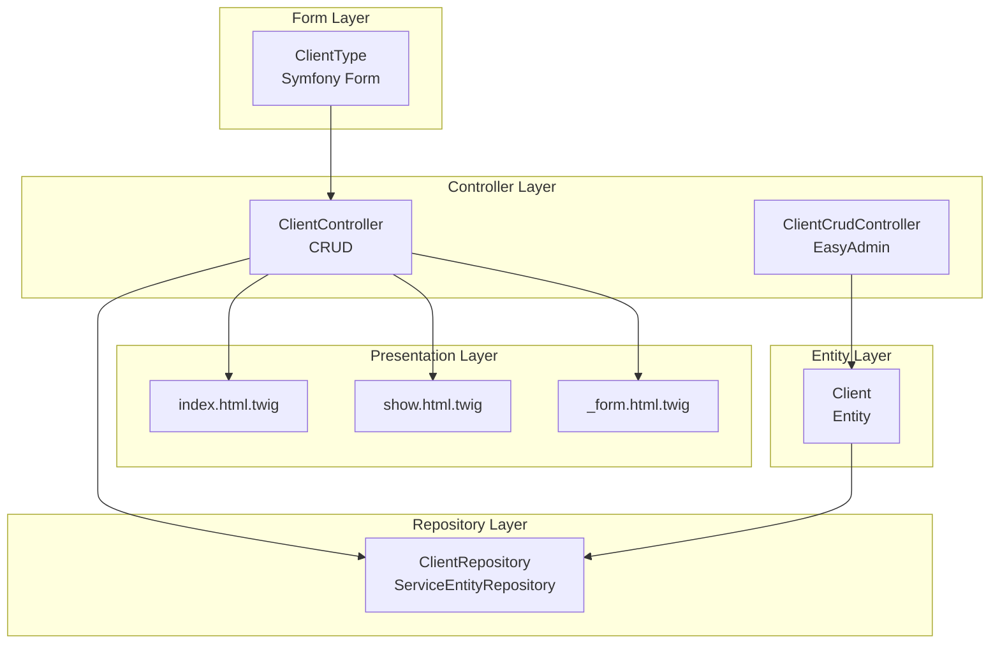
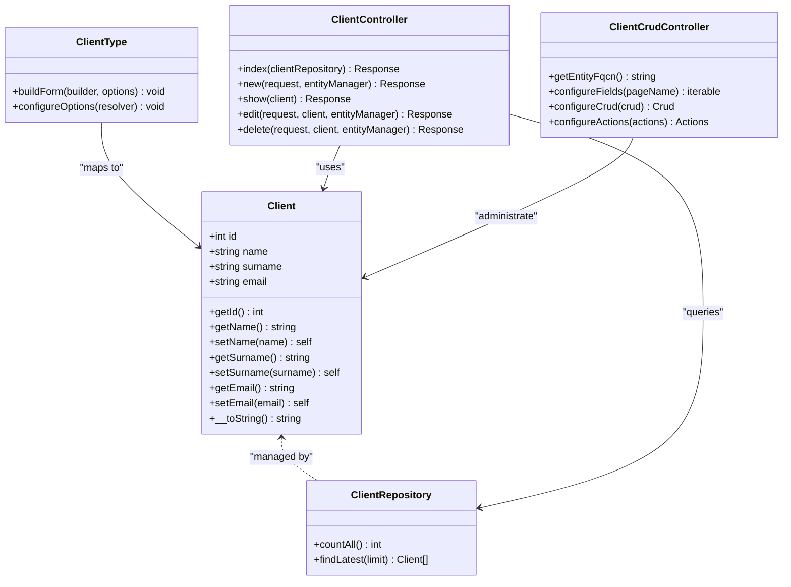
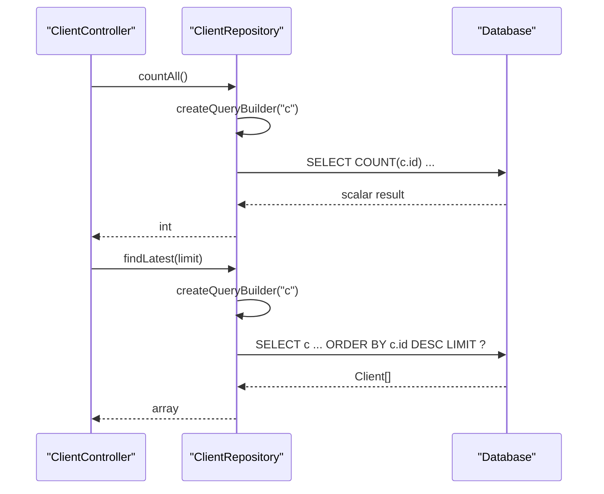
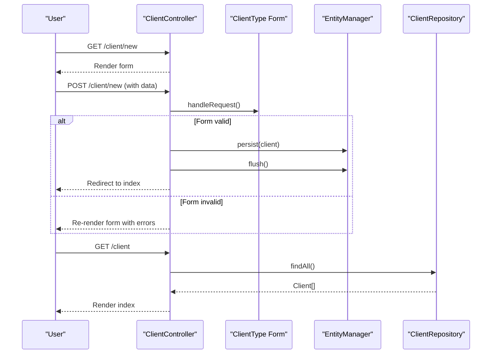
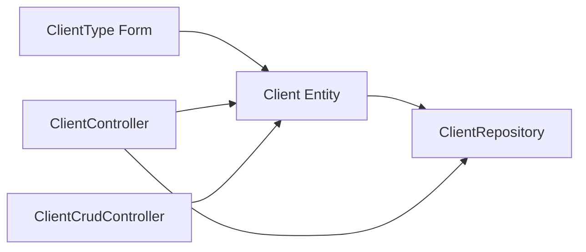

# Client Entity and Profiles

<cite>
**Referenced Files in This Document**
- [Client.php](file://src/Entity/Client.php)
- [ClientRepository.php](file://src/Repository/ClientRepository.php)
- [ClientType.php](file://src/Form/ClientType.php)
- [ClientController.php](file://src/Controller/ClientController.php)
- [ClientCrudController.php](file://src/Controller/Admin/ClientCrudController.php)
- [index.html.twig](file://templates/client/index.html.twig)
- [show.html.twig](file://templates/client/show.html.twig)
- [_form.html.twig](file://templates/client/_form.html.twig)
- [validator.yaml](file://config/packages/validator.yaml)
</cite>

## Table of Contents
1. [Introduction](#introduction)
2. [Project Structure](#project-structure)
3. [Core Components](#core-components)
4. [Architecture Overview](#architecture-overview)
5. [Detailed Component Analysis](#detailed-component-analysis)
6. [Dependency Analysis](#dependency-analysis)
7. [Performance Considerations](#performance-considerations)
8. [Troubleshooting Guide](#troubleshooting-guide)
9. [Conclusion](#conclusion)

## Introduction
This document provides comprehensive documentation for the Client entity and profile management system. It explains the Client entity structure, Doctrine ORM annotations, getter and setter methods, string representation, and integration with the ClientRepository. It also covers data types, validation behavior, persistence workflows, repository query methods, and performance considerations for retrieving client data.

## Project Structure
The Client domain spans several layers:
- Entity layer: Client entity with ORM annotations and basic accessors
- Repository layer: ClientRepository extending the Doctrine ServiceEntityRepository with convenience queries
- Form layer: ClientType form mapped to the Client entity
- Controller layer: ClientController for CRUD operations and ClientCrudController for the admin interface
- Presentation layer: Twig templates rendering client lists, forms, and details

**Diagram sources**
- [Client.php:8-70](file://src/Entity/Client.php#L8-L70)
- [ClientRepository.php:12-35](file://src/Repository/ClientRepository.php#L12-L35)
- [ClientType.php:10-27](file://src/Form/ClientType.php#L10-L27)
- [ClientController.php:14-82](file://src/Controller/ClientController.php#L14-L82)
- [ClientCrudController.php:13-42](file://src/Controller/Admin/ClientCrudController.php#L13-L42)
- [index.html.twig:1-38](file://templates/client/index.html.twig#L1-L38)
- [show.html.twig:1-35](file://templates/client/show.html.twig#L1-L35)
- [_form.html.twig:1-30](file://templates/client/_form.html.twig#L1-L30)

**Section sources**
- [Client.php:8-70](file://src/Entity/Client.php#L8-L70)
- [ClientRepository.php:12-35](file://src/Repository/ClientRepository.php#L12-L35)
- [ClientType.php:10-27](file://src/Form/ClientType.php#L10-L27)
- [ClientController.php:14-82](file://src/Controller/ClientController.php#L14-L82)
- [ClientCrudController.php:13-42](file://src/Controller/Admin/ClientCrudController.php#L13-L42)
- [index.html.twig:1-38](file://templates/client/index.html.twig#L1-L38)
- [show.html.twig:1-35](file://templates/client/show.html.twig#L1-L35)
- [_form.html.twig:1-30](file://templates/client/_form.html.twig#L1-L30)

## Core Components
- Client entity
  - Fields: id (integer, auto-generated), name (string, max length 255), surname (string, max length 255), email (string, max length 255)
  - ORM annotations define the entity mapping and repository association
  - Accessors: getId, getName, setName, getSurname, setSurname, getEmail, setEmail
  - String representation: concatenation of name and surname for display purposes
- ClientRepository
  - Extends ServiceEntityRepository for Client
  - Provides countAll and findLatest convenience methods using query builder
- ClientType form
  - Maps to Client entity fields: name, surname, email
- Controllers
  - ClientController: handles listing, creation, viewing, editing, and deletion of clients
  - ClientCrudController: admin interface configuration via EasyAdmin
- Templates
  - index.html.twig: renders a table of clients
  - show.html.twig: displays a single client’s details
  - _form.html.twig: renders the client creation/editing form

**Section sources**
- [Client.php:8-70](file://src/Entity/Client.php#L8-L70)
- [ClientRepository.php:12-35](file://src/Repository/ClientRepository.php#L12-L35)
- [ClientType.php:10-27](file://src/Form/ClientType.php#L10-L27)
- [ClientController.php:14-82](file://src/Controller/ClientController.php#L14-L82)
- [ClientCrudController.php:13-42](file://src/Controller/Admin/ClientCrudController.php#L13-L42)
- [index.html.twig:1-38](file://templates/client/index.html.twig#L1-L38)
- [show.html.twig:1-35](file://templates/client/show.html.twig#L1-L35)
- [_form.html.twig:1-30](file://templates/client/_form.html.twig#L1-L30)

## Architecture Overview
The Client domain follows a layered architecture:
- Entity encapsulates data and identity
- Repository abstracts persistence concerns and exposes domain-specific queries
- Form bridges user input to the entity
- Controllers orchestrate workflows and render views
- Templates present data and collect user input

**Diagram sources**
- [Client.php:8-70](file://src/Entity/Client.php#L8-L70)
- [ClientRepository.php:12-35](file://src/Repository/ClientRepository.php#L12-L35)
- [ClientType.php:10-27](file://src/Form/ClientType.php#L10-L27)
- [ClientController.php:14-82](file://src/Controller/ClientController.php#L14-L82)
- [ClientCrudController.php:13-42](file://src/Controller/Admin/ClientCrudController.php#L13-L42)

## Detailed Component Analysis

### Client Entity
- Data model and annotations
  - id: integer, auto-generated primary key
  - name, surname, email: strings with length constraint of 255
  - repository association via ORM annotation
- Accessors and mutators
  - getId/getName/getSurname/getEmail return nullable types
  - setName/setSurname/setEmail return static for method chaining
- String representation
  - __toString returns a human-readable full name for display contexts

Examples of usage patterns:
- Instantiation and property access
  - Instantiate a new Client and set properties via setters
  - Retrieve properties via getters for display or downstream processing
- Relationship considerations
  - No explicit associations are defined in the Client entity; it is a standalone entity

**Section sources**
- [Client.php:8-70](file://src/Entity/Client.php#L8-L70)

### ClientRepository
- Base class
  - Extends ServiceEntityRepository for Client
- Provided methods
  - countAll: returns total number of clients using COUNT on id
  - findLatest: returns clients ordered by id descending with configurable limit

**Diagram sources**
- [ClientRepository.php:19-34](file://src/Repository/ClientRepository.php#L19-L34)

**Section sources**
- [ClientRepository.php:12-35](file://src/Repository/ClientRepository.php#L12-L35)

### ClientType Form
- Field mapping
  - name, surname, email mapped to the Client entity
- Options
  - data_class defaults to Client

Validation behavior:
- Validation is configured globally via the framework configuration
- Auto-mapping is enabled, so basic constraints inferred from Doctrine metadata are applied automatically

**Section sources**
- [ClientType.php:10-27](file://src/Form/ClientType.php#L10-L27)
- [validator.yaml:1-12](file://config/packages/validator.yaml#L1-L12)

### ClientController
- Routes and actions
  - Index: lists all clients using repository findAll
  - New: creates a new client via form submission and persists
  - Show: displays a single client
  - Edit: updates an existing client via form submission and flushes
  - Delete: removes a client after CSRF verification and flushes
- Persistence workflow
  - Creation and update persist/flush the entity manager
  - Deletion removes and flushes

**Diagram sources**
- [ClientController.php:17-43](file://src/Controller/ClientController.php#L17-L43)
- [ClientController.php:18-22](file://src/Controller/ClientController.php#L18-L22)
- [ClientController.php:25-43](file://src/Controller/ClientController.php#L25-L43)
- [ClientController.php:45-51](file://src/Controller/ClientController.php#L45-L51)
- [ClientController.php:53-69](file://src/Controller/ClientController.php#L53-L69)
- [ClientController.php:71-81](file://src/Controller/ClientController.php#L71-L81)

**Section sources**
- [ClientController.php:14-82](file://src/Controller/ClientController.php#L14-L82)

### ClientCrudController (Admin)
- Entity mapping
  - Returns Client::class for administration
- Fields configuration
  - Displays id (hidden in forms), name, surname, email
- Pagination and actions
  - Paginator page size and range configured
  - Adds a detail action to index

**Section sources**
- [ClientCrudController.php:13-42](file://src/Controller/Admin/ClientCrudController.php#L13-L42)

### Presentation Templates
- index.html.twig
  - Renders a table of clients with name, surname, email, and action links
- show.html.twig
  - Displays detailed client information including id, name, surname, email
- _form.html.twig
  - Renders the form with labeled inputs for name, surname, and email

**Section sources**
- [index.html.twig:1-38](file://templates/client/index.html.twig#L1-L38)
- [show.html.twig:1-35](file://templates/client/show.html.twig#L1-L35)
- [_form.html.twig:1-30](file://templates/client/_form.html.twig#L1-L30)

## Dependency Analysis
- Entity-to-Repository
  - Client is mapped to ClientRepository via ORM annotation
- Controller-to-Repository
  - ClientController injects ClientRepository for listing clients
- Controller-to-Form
  - ClientController uses ClientType for create/update
- Controller-to-Entity
  - ClientController operates on Client instances for show/edit/delete
- Admin-to-Entity
  - ClientCrudController administers Client entity fields

**Diagram sources**
- [Client.php:8-70](file://src/Entity/Client.php#L8-L70)
- [ClientRepository.php:12-35](file://src/Repository/ClientRepository.php#L12-L35)
- [ClientType.php:10-27](file://src/Form/ClientType.php#L10-L27)
- [ClientController.php:14-82](file://src/Controller/ClientController.php#L14-L82)
- [ClientCrudController.php:13-42](file://src/Controller/Admin/ClientCrudController.php#L13-L42)

**Section sources**
- [Client.php:8-70](file://src/Entity/Client.php#L8-L70)
- [ClientRepository.php:12-35](file://src/Repository/ClientRepository.php#L12-L35)
- [ClientType.php:10-27](file://src/Form/ClientType.php#L10-L27)
- [ClientController.php:14-82](file://src/Controller/ClientController.php#L14-L82)
- [ClientCrudController.php:13-42](file://src/Controller/Admin/ClientCrudController.php#L13-L42)

## Performance Considerations
- Query patterns
  - findAll retrieves all clients; consider pagination or limiting results for large datasets
  - findLatest orders by id descending and limits results; suitable for recent items
  - countAll performs a COUNT query; efficient for totals but avoid unnecessary calls
- Display optimization
  - index.html.twig iterates clients; ensure only required fields are rendered
  - Consider lazy loading and selectivity if associations are introduced later
- Form and validation
  - ClientType maps three string fields; keep input constraints minimal to reduce validation overhead
  - Global auto-mapping applies basic constraints; keep entity fields aligned with form expectations

[No sources needed since this section provides general guidance]

## Troubleshooting Guide
- Validation failures during create/update
  - Ensure form submission passes isValid() checks
  - Review global validator configuration for auto-mapping behavior
- Persistence errors
  - Confirm EntityManager is properly injected and flush is called after persist/merge
- CSRF protection on delete
  - Verify CSRF token generation and validation match the expected pattern
- Display issues
  - Confirm __toString returns a safe concatenated value for display contexts
  - Ensure templates access properties consistently with entity getters

**Section sources**
- [validator.yaml:1-12](file://config/packages/validator.yaml#L1-L12)
- [ClientController.php:25-43](file://src/Controller/ClientController.php#L25-L43)
- [ClientController.php:53-69](file://src/Controller/ClientController.php#L53-L69)
- [ClientController.php:71-81](file://src/Controller/ClientController.php#L71-L81)
- [Client.php:66-70](file://src/Entity/Client.php#L66-L70)

## Conclusion
The Client entity and profile management system provide a clean, layered implementation:
- The Client entity defines a straightforward data model with ORM annotations and simple accessors
- ClientRepository offers convenient queries for counting and retrieving latest clients
- ClientType integrates with Symfony Forms for robust input handling
- ClientController orchestrates persistence and presentation, while ClientCrudController enables admin management
- Templates render client data efficiently and consistently

This design supports scalable enhancements, such as adding associations, refined validation, and advanced querying patterns, while maintaining clear separation of concerns and predictable performance characteristics.