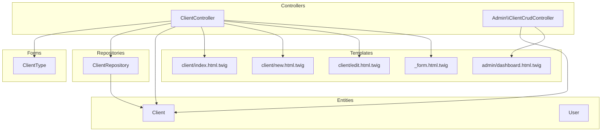
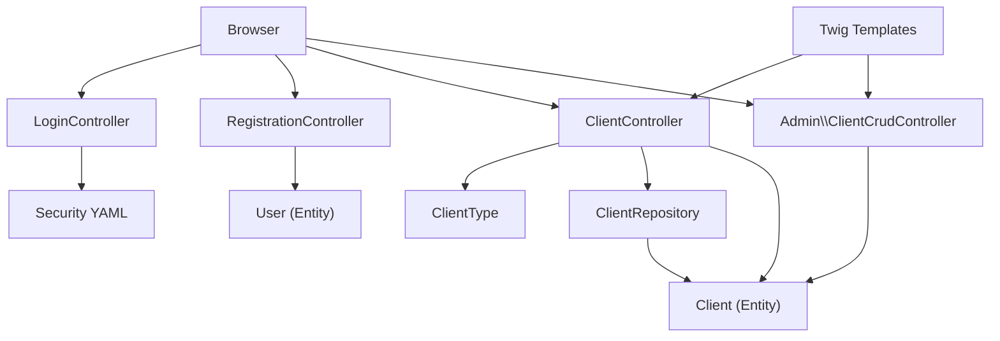
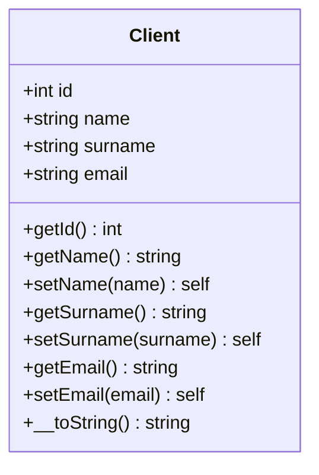
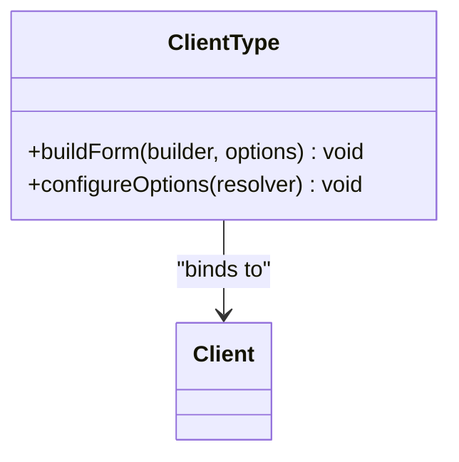
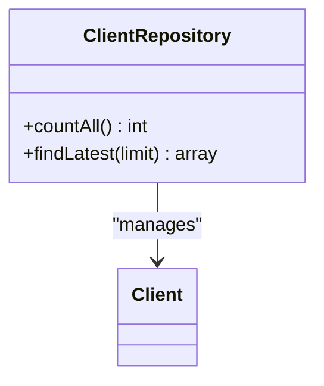
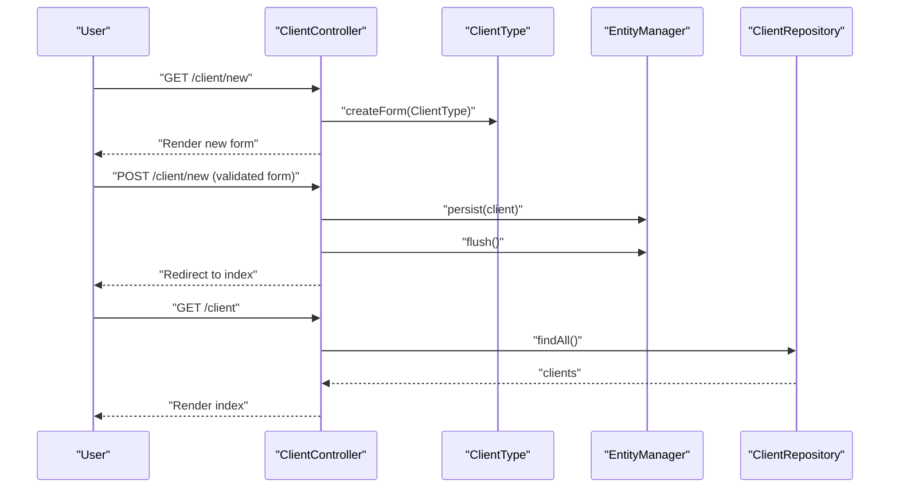
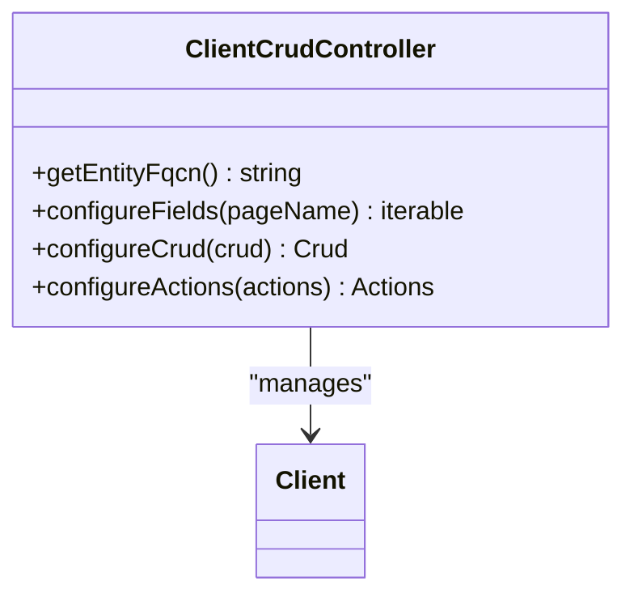
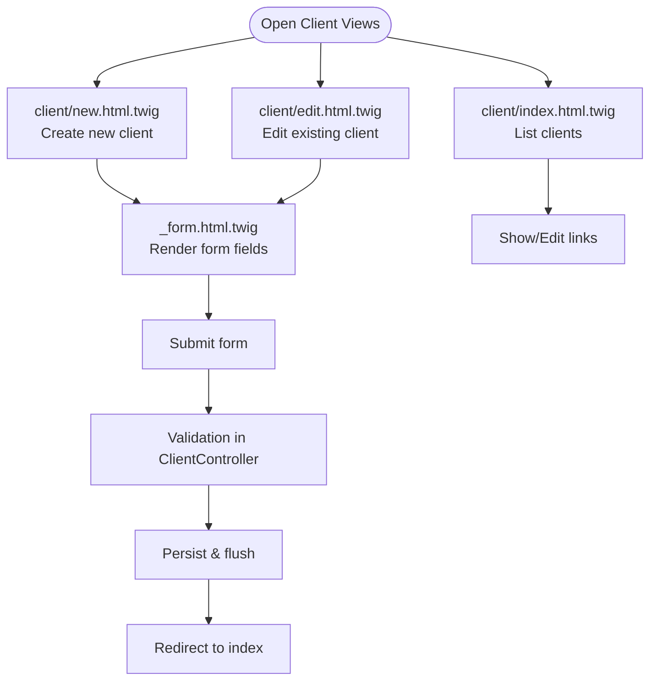
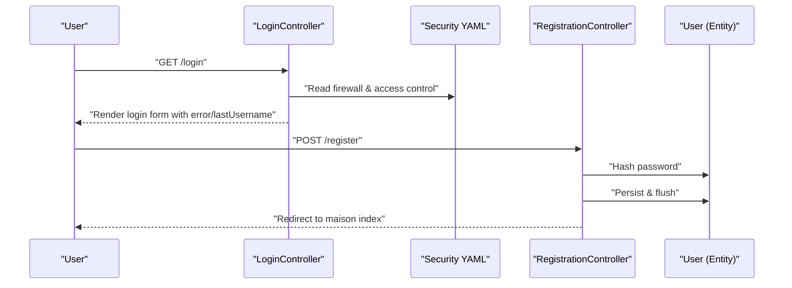
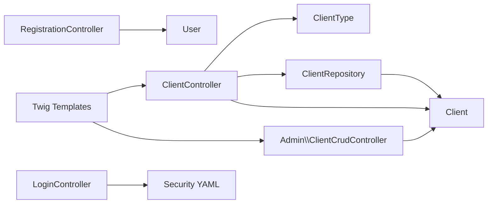

# Client Management System

<cite>
**Referenced Files in This Document**
- [Client.php](file://src/Entity/Client.php)
- [ClientType.php](file://src/Form/ClientType.php)
- [ClientRepository.php](file://src/Repository/ClientRepository.php)
- [ClientController.php](file://src/Controller/ClientController.php)
- [ClientCrudController.php](file://src/Controller/Admin/ClientCrudController.php)
- [index.html.twig](file://templates/client/index.html.twig)
- [new.html.twig](file://templates/client/new.html.twig)
- [edit.html.twig](file://templates/client/edit.html.twig)
- [_form.html.twig](file://templates/client/_form.html.twig)
- [dashboard.html.twig](file://templates/admin/dashboard.html.twig)
- [User.php](file://src/Entity/User.php)
- [LoginController.php](file://src/Controller/LoginController.php)
- [RegistrationController.php](file://src/Controller/RegistrationController.php)
- [security.yaml](file://config/packages/security.yaml)
- [security.yaml (routes)](file://config/routes/security.yaml)
</cite>

## Table of Contents
1. [Introduction](#introduction)
2. [Project Structure](#project-structure)
3. [Core Components](#core-components)
4. [Architecture Overview](#architecture-overview)
5. [Detailed Component Analysis](#detailed-component-analysis)
6. [Dependency Analysis](#dependency-analysis)
7. [Performance Considerations](#performance-considerations)
8. [Troubleshooting Guide](#troubleshooting-guide)
9. [Conclusion](#conclusion)
10. [Appendices](#appendices)

## Introduction
This document describes the client management system for a guest house platform. It explains the Client entity, customer profile management, and personal data handling. It documents the client registration workflow, profile updates, and data validation. It also covers the client controller functionality, form processing, and data persistence. Authentication integration, password management, and account security features are included. The document outlines the relationship between Clients and Users, client preferences, and booking history tracking. GDPR compliance, data protection, and client privacy controls are addressed. Finally, it provides examples of client dashboard functionality, profile management interfaces, and administrative client oversight via EasyAdmin.

## Project Structure
The client management system is organized around Symfony MVC conventions:
- Entities define domain models (Client, User).
- Forms encapsulate input validation and rendering.
- Controllers handle HTTP requests and orchestrate persistence.
- Repositories provide data access and queries.
- Twig templates render views and forms.
- EasyAdmin provides administrative CRUD for Clients.

**Diagram sources**
- [ClientController.php:14-82](file://src/Controller/ClientController.php#L14-L82)
- [ClientCrudController.php:13-42](file://src/Controller/Admin/ClientCrudController.php#L13-L42)
- [ClientType.php:10-27](file://src/Form/ClientType.php#L10-L27)
- [Client.php:8-71](file://src/Entity/Client.php#L8-L71)
- [ClientRepository.php:12-35](file://src/Repository/ClientRepository.php#L12-L35)
- [index.html.twig:1-38](file://templates/client/index.html.twig#L1-L38)
- [new.html.twig:1-14](file://templates/client/new.html.twig#L1-L14)
- [edit.html.twig:1-14](file://templates/client/edit.html.twig#L1-L14)
- [_form.html.twig:1-30](file://templates/client/_form.html.twig#L1-L30)
- [dashboard.html.twig:1-263](file://templates/admin/dashboard.html.twig#L1-L263)

**Section sources**
- [ClientController.php:14-82](file://src/Controller/ClientController.php#L14-L82)
- [ClientCrudController.php:13-42](file://src/Controller/Admin/ClientCrudController.php#L13-L42)
- [ClientType.php:10-27](file://src/Form/ClientType.php#L10-L27)
- [Client.php:8-71](file://src/Entity/Client.php#L8-L71)
- [ClientRepository.php:12-35](file://src/Repository/ClientRepository.php#L12-L35)
- [index.html.twig:1-38](file://templates/client/index.html.twig#L1-L38)
- [new.html.twig:1-14](file://templates/client/new.html.twig#L1-L14)
- [edit.html.twig:1-14](file://templates/client/edit.html.twig#L1-L14)
- [_form.html.twig:1-30](file://templates/client/_form.html.twig#L1-L30)
- [dashboard.html.twig:1-263](file://templates/admin/dashboard.html.twig#L1-L263)

## Core Components
- Client entity: Stores client identity (name, surname, email) and provides a string representation.
- Client form type: Declares the fields for client creation and editing.
- Client repository: Provides counting and latest-client queries.
- Client controller: Implements listing, creation, viewing, editing, and deletion with CSRF protection and validation.
- Admin client CRUD: EasyAdmin integration for administrative management of clients.
- Templates: Render lists, forms, and actions for client management.
- Authentication and security: User entity, login, registration, and security configuration.

**Section sources**
- [Client.php:8-71](file://src/Entity/Client.php#L8-L71)
- [ClientType.php:10-27](file://src/Form/ClientType.php#L10-L27)
- [ClientRepository.php:12-35](file://src/Repository/ClientRepository.php#L12-L35)
- [ClientController.php:14-82](file://src/Controller/ClientController.php#L14-L82)
- [ClientCrudController.php:13-42](file://src/Controller/Admin/ClientCrudController.php#L13-L42)
- [index.html.twig:1-38](file://templates/client/index.html.twig#L1-L38)
- [new.html.twig:1-14](file://templates/client/new.html.twig#L1-L14)
- [edit.html.twig:1-14](file://templates/client/edit.html.twig#L1-L14)
- [_form.html.twig:1-30](file://templates/client/_form.html.twig#L1-L30)
- [User.php:14-119](file://src/Entity/User.php#L14-L119)
- [LoginController.php:7-22](file://src/Controller/LoginController.php#L7-L22)
- [RegistrationController.php:14-44](file://src/Controller/RegistrationController.php#L14-L44)
- [security.yaml:1-55](file://config/packages/security.yaml#L1-L55)

## Architecture Overview
The system follows a layered architecture:
- Presentation layer: Twig templates and EasyAdmin.
- Application layer: Controllers and form processing.
- Domain and persistence layer: Entities and repositories.
- Security layer: Symfony Security configuration and password hashing.

**Diagram sources**
- [ClientController.php:14-82](file://src/Controller/ClientController.php#L14-L82)
- [ClientCrudController.php:13-42](file://src/Controller/Admin/ClientCrudController.php#L13-L42)
- [ClientType.php:10-27](file://src/Form/ClientType.php#L10-L27)
- [ClientRepository.php:12-35](file://src/Repository/ClientRepository.php#L12-L35)
- [Client.php:8-71](file://src/Entity/Client.php#L8-L71)
- [User.php:14-119](file://src/Entity/User.php#L14-L119)
- [LoginController.php:7-22](file://src/Controller/LoginController.php#L7-L22)
- [RegistrationController.php:14-44](file://src/Controller/RegistrationController.php#L14-L44)
- [security.yaml:1-55](file://config/packages/security.yaml#L1-L55)
- [index.html.twig:1-38](file://templates/client/index.html.twig#L1-L38)
- [new.html.twig:1-14](file://templates/client/new.html.twig#L1-L14)
- [edit.html.twig:1-14](file://templates/client/edit.html.twig#L1-L14)
- [_form.html.twig:1-30](file://templates/client/_form.html.twig#L1-L30)
- [dashboard.html.twig:1-263](file://templates/admin/dashboard.html.twig#L1-L263)

## Detailed Component Analysis

### Client Entity
The Client entity defines the client model with:
- Identifier
- Name
- Surname
- Email
- String representation for display

**Diagram sources**
- [Client.php:8-71](file://src/Entity/Client.php#L8-L71)

**Section sources**
- [Client.php:8-71](file://src/Entity/Client.php#L8-L71)

### Client Form Type
The ClientType form declares the fields for client creation and editing:
- name
- surname
- email

**Diagram sources**
- [ClientType.php:10-27](file://src/Form/ClientType.php#L10-L27)
- [Client.php:8-71](file://src/Entity/Client.php#L8-L71)

**Section sources**
- [ClientType.php:10-27](file://src/Form/ClientType.php#L10-L27)

### Client Repository
The ClientRepository provides:
- Count of all clients
- Latest clients with configurable limit

**Diagram sources**
- [ClientRepository.php:12-35](file://src/Repository/ClientRepository.php#L12-L35)
- [Client.php:8-71](file://src/Entity/Client.php#L8-L71)

**Section sources**
- [ClientRepository.php:12-35](file://src/Repository/ClientRepository.php#L12-L35)

### Client Controller
The ClientController handles:
- Listing clients
- Creating new clients via form submission and validation
- Viewing individual clients
- Editing existing clients with validation
- Deleting clients with CSRF token verification

**Diagram sources**
- [ClientController.php:17-43](file://src/Controller/ClientController.php#L17-L43)
- [ClientType.php:10-27](file://src/Form/ClientType.php#L10-L27)
- [ClientRepository.php:12-35](file://src/Repository/ClientRepository.php#L12-L35)

**Section sources**
- [ClientController.php:14-82](file://src/Controller/ClientController.php#L14-L82)

### Admin Client CRUD (EasyAdmin)
The Admin ClientCrudController integrates EasyAdmin to manage Clients:
- Fields configured: id (hidden on form), name, surname, email
- Pagination settings
- Additional action to show details in index view

**Diagram sources**
- [ClientCrudController.php:13-42](file://src/Controller/Admin/ClientCrudController.php#L13-L42)
- [Client.php:8-71](file://src/Entity/Client.php#L8-L71)

**Section sources**
- [ClientCrudController.php:13-42](file://src/Controller/Admin/ClientCrudController.php#L13-L42)

### Client Views and Forms
- Index view displays a table of clients with actions.
- New view renders the client form.
- Edit view renders the form with update label and includes the delete form.
- Shared form partial renders labels, widgets, and submit button.

**Diagram sources**
- [index.html.twig:1-38](file://templates/client/index.html.twig#L1-L38)
- [new.html.twig:1-14](file://templates/client/new.html.twig#L1-L14)
- [edit.html.twig:1-14](file://templates/client/edit.html.twig#L1-L14)
- [_form.html.twig:1-30](file://templates/client/_form.html.twig#L1-L30)
- [ClientController.php:25-43](file://src/Controller/ClientController.php#L25-L43)

**Section sources**
- [index.html.twig:1-38](file://templates/client/index.html.twig#L1-L38)
- [new.html.twig:1-14](file://templates/client/new.html.twig#L1-L14)
- [edit.html.twig:1-14](file://templates/client/edit.html.twig#L1-L14)
- [_form.html.twig:1-30](file://templates/client/_form.html.twig#L1-L30)

### Authentication and Security
- User entity implements security interfaces and stores roles and hashed passwords.
- LoginController retrieves last authentication error and last username for the login form.
- RegistrationController handles form submission, password hashing, persistence, and redirect.
- Security configuration enables form-login, logout, password hashers, and access control.

**Diagram sources**
- [User.php:14-119](file://src/Entity/User.php#L14-L119)
- [LoginController.php:7-22](file://src/Controller/LoginController.php#L7-L22)
- [RegistrationController.php:14-44](file://src/Controller/RegistrationController.php#L14-L44)
- [security.yaml:1-55](file://config/packages/security.yaml#L1-L55)

**Section sources**
- [User.php:14-119](file://src/Entity/User.php#L14-L119)
- [LoginController.php:7-22](file://src/Controller/LoginController.php#L7-L22)
- [RegistrationController.php:14-44](file://src/Controller/RegistrationController.php#L14-L44)
- [security.yaml:1-55](file://config/packages/security.yaml#L1-L55)
- [security.yaml (routes):1-4](file://config/routes/security.yaml#L1-L4)

### Client Preferences and Booking History
- The Client entity currently stores name, surname, and email.
- No explicit preference or booking history fields are present in the Client entity.
- Administrative dashboard aggregates statistics and recent activity but does not expose client-specific booking history in the provided templates.

Recommendations:
- Extend the Client entity with optional preferences and associations to bookings/reservations.
- Add dedicated views and controllers for client profiles, preferences, and booking history.
- Implement role-based access so clients can view and update their own data.

[No sources needed since this section provides recommendations without analyzing specific files]

### GDPR Compliance and Privacy Controls
- Personal data handled: name, surname, email.
- Passwords are hashed via Symfony’s password hasher.
- Access control restricts admin areas to ROLE_ADMIN.
- CSRF protection is used for delete operations.

Recommendations:
- Implement data minimization and retention policies.
- Provide data export and deletion capabilities.
- Add consent management and privacy notices.
- Enforce encryption at rest and in transit.

[No sources needed since this section provides general guidance]

## Dependency Analysis
The following diagram shows key dependencies among components:

**Diagram sources**
- [ClientController.php:14-82](file://src/Controller/ClientController.php#L14-L82)
- [ClientCrudController.php:13-42](file://src/Controller/Admin/ClientCrudController.php#L13-L42)
- [ClientType.php:10-27](file://src/Form/ClientType.php#L10-L27)
- [ClientRepository.php:12-35](file://src/Repository/ClientRepository.php#L12-L35)
- [Client.php:8-71](file://src/Entity/Client.php#L8-L71)
- [RegistrationController.php:14-44](file://src/Controller/RegistrationController.php#L14-L44)
- [User.php:14-119](file://src/Entity/User.php#L14-L119)
- [LoginController.php:7-22](file://src/Controller/LoginController.php#L7-L22)
- [security.yaml:1-55](file://config/packages/security.yaml#L1-L55)
- [index.html.twig:1-38](file://templates/client/index.html.twig#L1-L38)
- [new.html.twig:1-14](file://templates/client/new.html.twig#L1-L14)
- [edit.html.twig:1-14](file://templates/client/edit.html.twig#L1-L14)
- [_form.html.twig:1-30](file://templates/client/_form.html.twig#L1-L30)
- [dashboard.html.twig:1-263](file://templates/admin/dashboard.html.twig#L1-L263)

**Section sources**
- [ClientController.php:14-82](file://src/Controller/ClientController.php#L14-L82)
- [ClientCrudController.php:13-42](file://src/Controller/Admin/ClientCrudController.php#L13-L42)
- [ClientType.php:10-27](file://src/Form/ClientType.php#L10-L27)
- [ClientRepository.php:12-35](file://src/Repository/ClientRepository.php#L12-L35)
- [Client.php:8-71](file://src/Entity/Client.php#L8-L71)
- [RegistrationController.php:14-44](file://src/Controller/RegistrationController.php#L14-L44)
- [User.php:14-119](file://src/Entity/User.php#L14-L119)
- [LoginController.php:7-22](file://src/Controller/LoginController.php#L7-L22)
- [security.yaml:1-55](file://config/packages/security.yaml#L1-L55)
- [index.html.twig:1-38](file://templates/client/index.html.twig#L1-L38)
- [new.html.twig:1-14](file://templates/client/new.html.twig#L1-L14)
- [edit.html.twig:1-14](file://templates/client/edit.html.twig#L1-L14)
- [_form.html.twig:1-30](file://templates/client/_form.html.twig#L1-L30)
- [dashboard.html.twig:1-263](file://templates/admin/dashboard.html.twig#L1-L263)

## Performance Considerations
- Use pagination in admin listings to avoid loading large datasets.
- Apply database indexes on frequently filtered fields (e.g., email).
- Cache statistics and dashboard data where appropriate.
- Minimize N+1 queries by eager-loading associations when displaying client-related data.

[No sources needed since this section provides general guidance]

## Troubleshooting Guide
Common issues and resolutions:
- Validation errors on client form submission: Ensure all required fields are present and correctly bound in the form type.
- CSRF token invalid during delete: Verify the token generation and inclusion in the delete form.
- Access denied to admin pages: Confirm user roles include ROLE_ADMIN and access_control rules match the requested path.
- Login failures: Check form_login configuration, username field, and password hasher settings.

**Section sources**
- [ClientController.php:74-79](file://src/Controller/ClientController.php#L74-L79)
- [security.yaml:40-45](file://config/packages/security.yaml#L40-L45)

## Conclusion
The client management system provides a solid foundation for managing client profiles with secure authentication and administrative oversight via EasyAdmin. The Client entity, form, controller, and repository work together to support CRUD operations and basic reporting. Extending the system to include client preferences, booking history, and robust GDPR-compliant data handling will further strengthen the platform’s capabilities.

[No sources needed since this section summarizes without analyzing specific files]

## Appendices

### Client Dashboard Functionality
- The administrative dashboard aggregates statistics and recent activity. While it does not directly display client-specific booking history, it surfaces counts and recent items useful for oversight.

**Section sources**
- [dashboard.html.twig:1-263](file://templates/admin/dashboard.html.twig#L1-L263)

### Administrative Client Oversight via EasyAdmin
- EasyAdmin provides a streamlined interface to view, create, update, and delete clients with configurable fields and pagination.

**Section sources**
- [ClientCrudController.php:13-42](file://src/Controller/Admin/ClientCrudController.php#L13-L42)