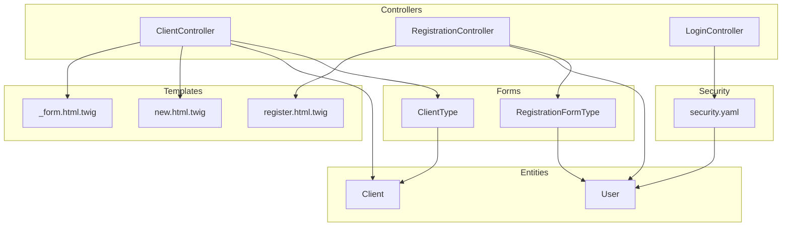
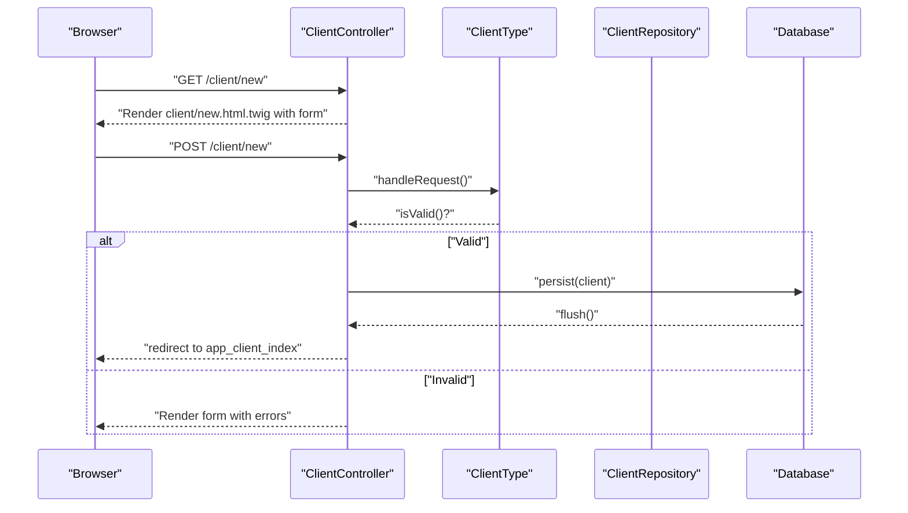
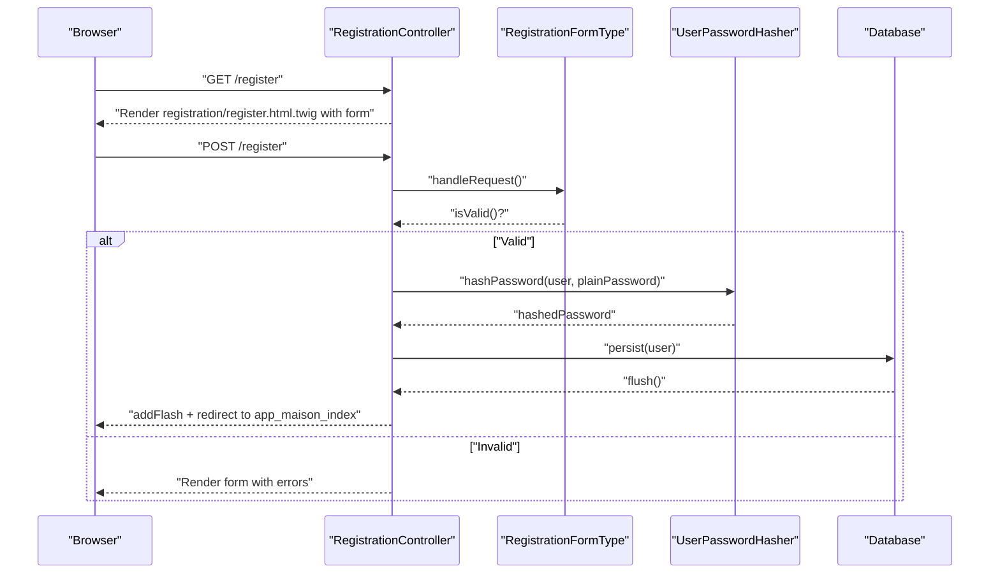
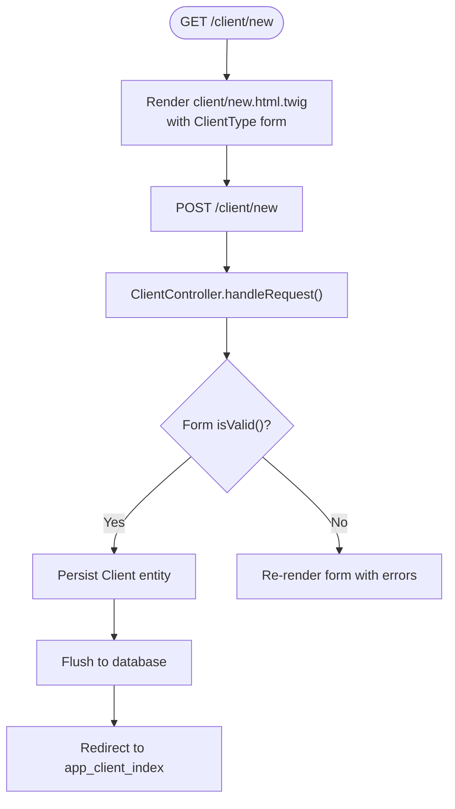
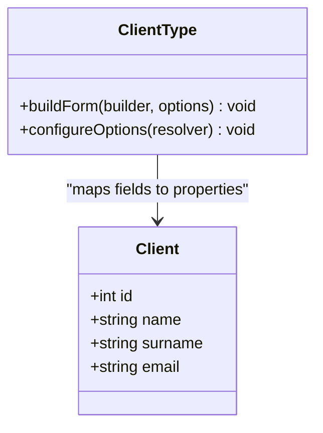
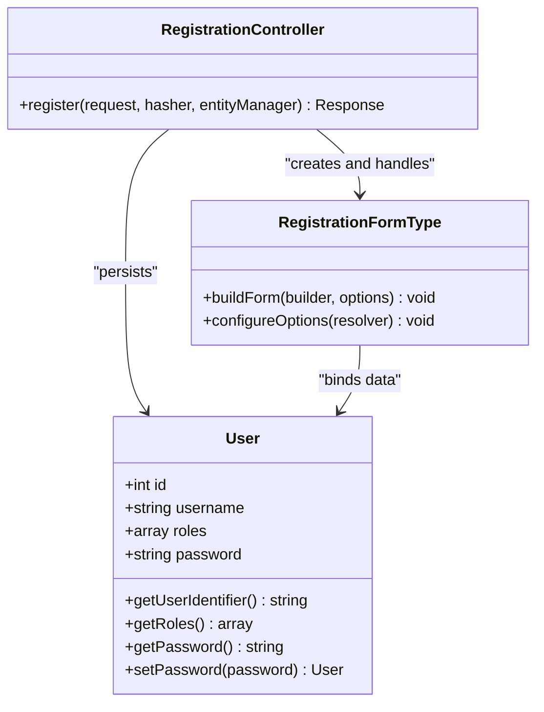
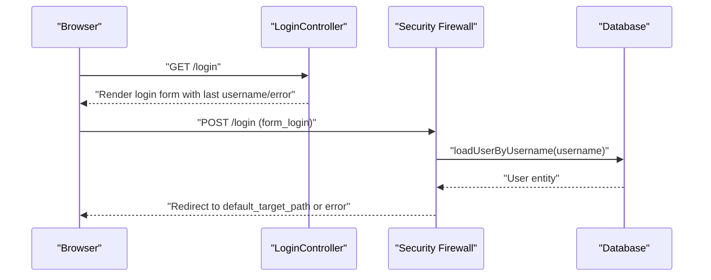
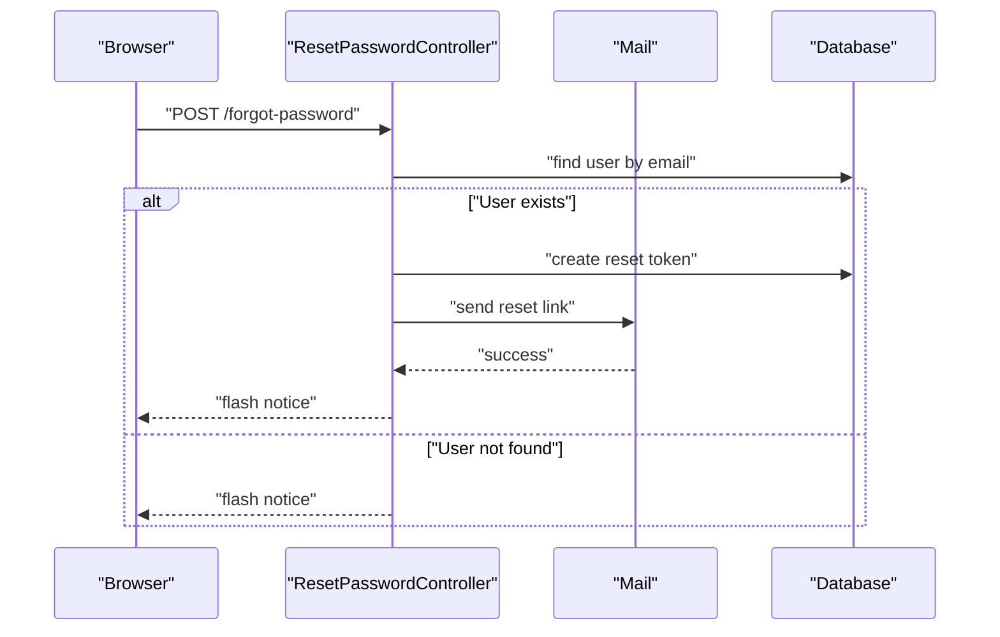
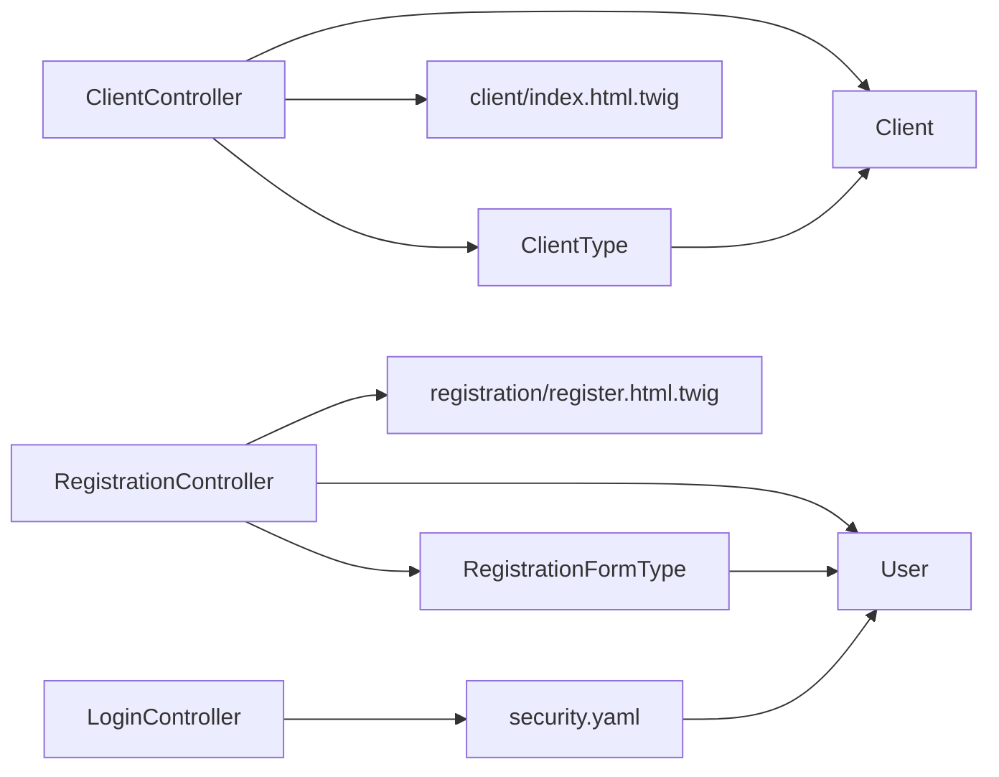

# Client Registration and Authentication

<cite>
**Referenced Files in This Document**
- [ClientController.php](file://src/Controller/ClientController.php)
- [ClientType.php](file://src/Form/ClientType.php)
- [Client.php](file://src/Entity/Client.php)
- [RegistrationController.php](file://src/Controller/RegistrationController.php)
- [RegistrationFormType.php](file://src/Form/RegistrationFormType.php)
- [User.php](file://src/Entity/User.php)
- [security.yaml](file://config/packages/security.yaml)
- [register.html.twig](file://templates/registration/register.html.twig)
- [new.html.twig](file://templates/client/new.html.twig)
- [_form.html.twig](file://templates/client/_form.html.twig)
- [LoginController.php](file://src/Controller/LoginController.php)
- [Mail.php](file://src/Classe/Mail.php)
- [Version20260322195642.php](file://migrations/Version20260322195642.php)
</cite>

## Table of Contents
1. [Introduction](#introduction)
2. [Project Structure](#project-structure)
3. [Core Components](#core-components)
4. [Architecture Overview](#architecture-overview)
5. [Detailed Component Analysis](#detailed-component-analysis)
6. [Dependency Analysis](#dependency-analysis)
7. [Performance Considerations](#performance-considerations)
8. [Troubleshooting Guide](#troubleshooting-guide)
9. [Conclusion](#conclusion)

## Introduction
This document explains the client registration and authentication workflows in the application. It covers:
- Client registration via the Client entity and form
- User registration and authentication with the User entity
- Form validation, data processing, and account creation
- Controller handling for registration requests and user redirection
- Security configuration and password handling
- Email-based verification and account activation mechanisms
- Examples of registration forms, validation error handling, and successful registration flows

## Project Structure
The registration and authentication features span controllers, forms, entities, templates, and security configuration:
- Controllers handle HTTP requests and orchestrate persistence
- Forms define validation constraints and field rendering
- Entities model data and relationships
- Templates render forms and present feedback
- Security configuration governs authentication and access control

**Diagram sources**
- [ClientController.php:14-81](file://src/Controller/ClientController.php#L14-L81)
- [RegistrationController.php:14-44](file://src/Controller/RegistrationController.php#L14-L44)
- [LoginController.php:7-22](file://src/Controller/LoginController.php#L7-L22)
- [ClientType.php:10-27](file://src/Form/ClientType.php#L10-L27)
- [RegistrationFormType.php:15-55](file://src/Form/RegistrationFormType.php#L15-L55)
- [Client.php:8-70](file://src/Entity/Client.php#L8-L70)
- [User.php:11-118](file://src/Entity/User.php#L11-L118)
- [register.html.twig:1-42](file://templates/registration/register.html.twig#L1-L42)
- [new.html.twig:1-14](file://templates/client/new.html.twig#L1-L14)
- [_form.html.twig:1-30](file://templates/client/_form.html.twig#L1-L30)
- [security.yaml:1-55](file://config/packages/security.yaml#L1-L55)

**Section sources**
- [ClientController.php:14-81](file://src/Controller/ClientController.php#L14-L81)
- [RegistrationController.php:14-44](file://src/Controller/RegistrationController.php#L14-L44)
- [ClientType.php:10-27](file://src/Form/ClientType.php#L10-L27)
- [RegistrationFormType.php:15-55](file://src/Form/RegistrationFormType.php#L15-L55)
- [Client.php:8-70](file://src/Entity/Client.php#L8-L70)
- [User.php:11-118](file://src/Entity/User.php#L11-L118)
- [register.html.twig:1-42](file://templates/registration/register.html.twig#L1-L42)
- [new.html.twig:1-14](file://templates/client/new.html.twig#L1-L14)
- [_form.html.twig:1-30](file://templates/client/_form.html.twig#L1-L30)
- [security.yaml:1-55](file://config/packages/security.yaml#L1-L55)

## Core Components
- Client registration flow:
  - Controller action handles GET/POST requests, builds the Client form, validates submission, persists the Client entity, and redirects to the client list.
  - The ClientType form exposes name, surname, and email fields.
  - Templates render the form and include error handling.

- User registration and authentication:
  - RegistrationController creates a User, processes the RegistrationFormType, hashes the plain password, persists the User, and redirects to the main page with a success flash.
  - RegistrationFormType enforces agreement to terms and password length constraints.
  - User entity implements security interfaces and stores roles and hashed passwords.
  - Security configuration enables form-login, defines providers, and sets access control rules.

**Section sources**
- [ClientController.php:25-43](file://src/Controller/ClientController.php#L25-L43)
- [ClientType.php:12-19](file://src/Form/ClientType.php#L12-L19)
- [RegistrationController.php:16-43](file://src/Controller/RegistrationController.php#L16-L43)
- [RegistrationFormType.php:17-47](file://src/Form/RegistrationFormType.php#L17-L47)
- [User.php:14-118](file://src/Entity/User.php#L14-L118)
- [security.yaml:2-46](file://config/packages/security.yaml#L2-L46)

## Architecture Overview
The system integrates form-based registration with database persistence and security. The following diagram maps the primary components involved in client and user registration.

**Diagram sources**
- [ClientController.php:25-43](file://src/Controller/ClientController.php#L25-L43)
- [ClientType.php:12-19](file://src/Form/ClientType.php#L12-L19)
- [new.html.twig:1-14](file://templates/client/new.html.twig#L1-L14)
- [_form.html.twig:1-30](file://templates/client/_form.html.twig#L1-L30)

**Diagram sources**
- [RegistrationController.php:16-43](file://src/Controller/RegistrationController.php#L16-L43)
- [RegistrationFormType.php:17-47](file://src/Form/RegistrationFormType.php#L17-L47)
- [register.html.twig:1-42](file://templates/registration/register.html.twig#L1-L42)

## Detailed Component Analysis

### Client Registration Workflow
- Controller responsibilities:
  - Build the Client form with ClientType
  - Handle form submission and validation
  - Persist and flush the Client entity
  - Redirect to the client index after success
  - Render the form with errors on validation failure

- Form configuration:
  - ClientType adds name, surname, and email fields
  - Options specify the Client entity as data class

- Template rendering:
  - new.html.twig includes the client form partial
  - _form.html.twig renders labels, widgets, and errors for each field

**Diagram sources**
- [ClientController.php:25-43](file://src/Controller/ClientController.php#L25-L43)
- [ClientType.php:12-19](file://src/Form/ClientType.php#L12-L19)
- [new.html.twig:1-14](file://templates/client/new.html.twig#L1-L14)
- [_form.html.twig:1-30](file://templates/client/_form.html.twig#L1-L30)

**Section sources**
- [ClientController.php:25-43](file://src/Controller/ClientController.php#L25-L43)
- [ClientType.php:12-19](file://src/Form/ClientType.php#L12-L19)
- [Client.php:8-70](file://src/Entity/Client.php#L8-L70)
- [new.html.twig:1-14](file://templates/client/new.html.twig#L1-L14)
- [_form.html.twig:1-30](file://templates/client/_form.html.twig#L1-L30)

### ClientType Form Class
- Fields: name, surname, email
- Data class: Client entity
- Rendering: templates apply Bootstrap classes and include error blocks

**Diagram sources**
- [ClientType.php:10-27](file://src/Form/ClientType.php#L10-L27)
- [Client.php:8-70](file://src/Entity/Client.php#L8-L70)

**Section sources**
- [ClientType.php:10-27](file://src/Form/ClientType.php#L10-L27)
- [Client.php:8-70](file://src/Entity/Client.php#L8-L70)

### User Registration and Authentication
- RegistrationController:
  - Creates a User, binds RegistrationFormType, hashes the plain password, persists and flushes, then redirects with a success flash

- RegistrationFormType:
  - Username field
  - Terms agreement checkbox with a constraint requiring acceptance
  - Plain password field with minimum length and maximum length constraints

- User entity:
  - Implements UserInterface and PasswordAuthenticatedUserInterface
  - Stores roles and hashed password
  - Provides serialization behavior for password hashing

- Security configuration:
  - Password hashers configured for User
  - Provider uses User entity and username property
  - Firewall enables form_login with login and check paths
  - Access control allows public access to registration and login routes

**Diagram sources**
- [RegistrationController.php:16-43](file://src/Controller/RegistrationController.php#L16-L43)
- [RegistrationFormType.php:15-55](file://src/Form/RegistrationFormType.php#L15-L55)
- [User.php:14-118](file://src/Entity/User.php#L14-L118)

**Section sources**
- [RegistrationController.php:16-43](file://src/Controller/RegistrationController.php#L16-L43)
- [RegistrationFormType.php:17-47](file://src/Form/RegistrationFormType.php#L17-L47)
- [User.php:14-118](file://src/Entity/User.php#L14-L118)
- [security.yaml:2-46](file://config/packages/security.yaml#L2-L46)

### Authentication Integration and Security Considerations
- LoginController retrieves last authentication error and last username for feedback
- Security configuration:
  - Password hashers configured for automatic algorithm selection
  - Provider configured to use User entity and username property
  - form_login configured with login_path and check_path
  - access_control grants PUBLIC_ACCESS to registration and login routes
- Password handling:
  - Plain password extracted from the form and hashed before persisting
  - User serialization ensures password hashes are not exposed in sessions

**Diagram sources**
- [LoginController.php:9-22](file://src/Controller/LoginController.php#L9-L22)
- [security.yaml:20-35](file://config/packages/security.yaml#L20-L35)

**Section sources**
- [LoginController.php:9-22](file://src/Controller/LoginController.php#L9-L22)
- [security.yaml:2-46](file://config/packages/security.yaml#L2-L46)
- [RegistrationController.php:23-31](file://src/Controller/RegistrationController.php#L23-L31)
- [User.php:105-111](file://src/Entity/User.php#L105-L111)

### Verification Processes, Email Confirmation, and Account Activation
- Current implementation:
  - User registration persists the User entity immediately upon successful validation
  - No explicit email confirmation or account activation logic is present in the referenced files
- Reset password mechanism:
  - ResetPasswordController generates tokens and sends emails via Mail class
  - Migrations introduce a reset_password table and adjust user roles storage

**Diagram sources**
- [ResetPasswordController.php:44-71](file://src/Controller/ResetPasswordController.php#L44-L71)
- [Mail.php:19-46](file://src/Classe/Mail.php#L19-L46)
- [Version20260322195642.php:20-36](file://migrations/Version20260322195642.php#L20-L36)

**Section sources**
- [ResetPasswordController.php:44-71](file://src/Controller/ResetPasswordController.php#L44-L71)
- [Mail.php:19-46](file://src/Classe/Mail.php#L19-L46)
- [Version20260322195642.php:20-36](file://migrations/Version20260322195642.php#L20-L36)

### Examples and Workflows
- Client registration form example:
  - Template path: [new.html.twig:1-14](file://templates/client/new.html.twig#L1-L14)
  - Form partial path: [_form.html.twig:1-30](file://templates/client/_form.html.twig#L1-L30)
  - Controller action: [ClientController.new:25-43](file://src/Controller/ClientController.php#L25-L43)

- User registration form example:
  - Template path: [register.html.twig:1-42](file://templates/registration/register.html.twig#L1-L42)
  - Form type: [RegistrationFormType:15-55](file://src/Form/RegistrationFormType.php#L15-L55)
  - Controller action: [RegistrationController.register:16-43](file://src/Controller/RegistrationController.php#L16-L43)

- Validation error handling:
  - Registration form displays global and field-specific errors
  - Client form includes label, widget, and error markup per field

- Successful registration flows:
  - Client registration redirects to the client index after persistence
  - User registration adds a success flash and redirects to the main page

**Section sources**
- [new.html.twig:1-14](file://templates/client/new.html.twig#L1-L14)
- [_form.html.twig:1-30](file://templates/client/_form.html.twig#L1-L30)
- [ClientController.php:25-43](file://src/Controller/ClientController.php#L25-L43)
- [register.html.twig:1-42](file://templates/registration/register.html.twig#L1-L42)
- [RegistrationFormType.php:17-47](file://src/Form/RegistrationFormType.php#L17-L47)
- [RegistrationController.php:16-43](file://src/Controller/RegistrationController.php#L16-L43)

## Dependency Analysis
The following diagram shows key dependencies among controllers, forms, entities, and templates.

**Diagram sources**
- [ClientController.php:14-81](file://src/Controller/ClientController.php#L14-L81)
- [RegistrationController.php:14-44](file://src/Controller/RegistrationController.php#L14-L44)
- [LoginController.php:7-22](file://src/Controller/LoginController.php#L7-L22)
- [ClientType.php:10-27](file://src/Form/ClientType.php#L10-L27)
- [RegistrationFormType.php:15-55](file://src/Form/RegistrationFormType.php#L15-L55)
- [Client.php:8-70](file://src/Entity/Client.php#L8-L70)
- [User.php:11-118](file://src/Entity/User.php#L11-L118)
- [security.yaml:1-55](file://config/packages/security.yaml#L1-L55)

**Section sources**
- [ClientController.php:14-81](file://src/Controller/ClientController.php#L14-L81)
- [RegistrationController.php:14-44](file://src/Controller/RegistrationController.php#L14-L44)
- [ClientType.php:10-27](file://src/Form/ClientType.php#L10-L27)
- [RegistrationFormType.php:15-55](file://src/Form/RegistrationFormType.php#L15-L55)
- [Client.php:8-70](file://src/Entity/Client.php#L8-L70)
- [User.php:11-118](file://src/Entity/User.php#L11-L118)
- [security.yaml:1-55](file://config/packages/security.yaml#L1-L55)

## Performance Considerations
- Minimize database round-trips by batching operations when extending the client registration flow
- Use appropriate validation constraints to reduce server-side processing overhead
- Keep form rendering efficient by avoiding unnecessary computations in templates
- Consider caching roles and identifiers for frequently accessed users

## Troubleshooting Guide
- Registration form validation errors:
  - Verify constraints in RegistrationFormType and ensure messages are displayed in the template
  - Confirm that the form is bound to the User entity and that the password is hashed before persisting

- Client form validation errors:
  - Ensure ClientType fields match the Client entity properties
  - Check template rendering for label, widget, and error blocks

- Authentication issues:
  - Confirm security.yaml firewall configuration for form_login paths
  - Verify that the User entity implements required interfaces and that password hashers are configured

- Email-based verification:
  - Review reset password controller logic and Mail class usage
  - Ensure migrations are applied and the reset_password table exists

**Section sources**
- [RegistrationFormType.php:17-47](file://src/Form/RegistrationFormType.php#L17-L47)
- [register.html.twig:13-30](file://templates/registration/register.html.twig#L13-L30)
- [ClientType.php:12-19](file://src/Form/ClientType.php#L12-L19)
- [_form.html.twig:3-22](file://templates/client/_form.html.twig#L3-L22)
- [security.yaml:20-35](file://config/packages/security.yaml#L20-L35)
- [User.php:14-118](file://src/Entity/User.php#L14-L118)
- [ResetPasswordController.php:44-71](file://src/Controller/ResetPasswordController.php#L44-L71)
- [Mail.php:19-46](file://src/Classe/Mail.php#L19-L46)
- [Version20260322195642.php:20-36](file://migrations/Version20260322195642.php#L20-L36)

## Conclusion
The application provides distinct pathways for client and user registration:
- Client registration uses a straightforward form-to-entity flow with basic validation and immediate persistence
- User registration incorporates password hashing, validation constraints, and security integration
- Authentication relies on form_login with configurable access control
- Email-based verification and account activation are not implemented in the referenced files but can be integrated via the existing reset password infrastructure