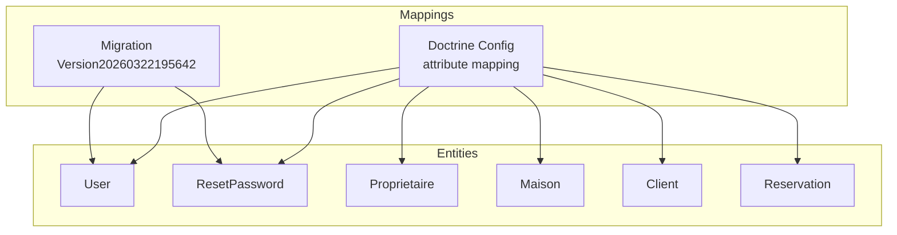
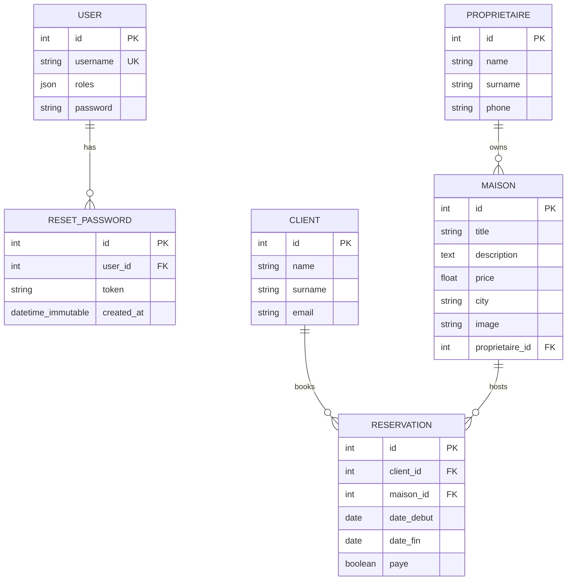
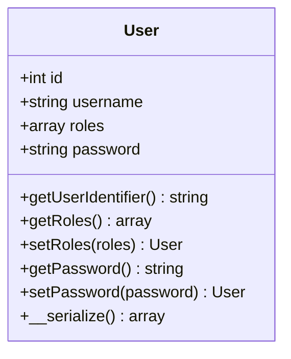
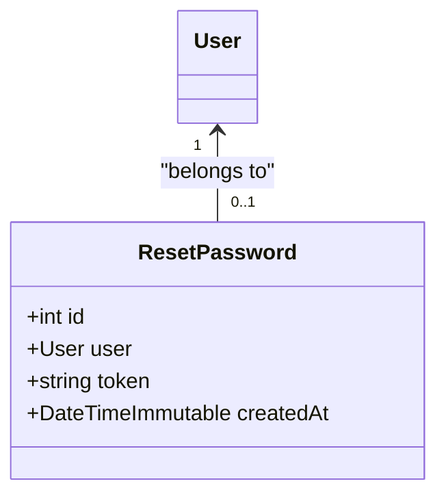
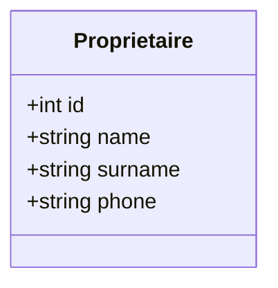
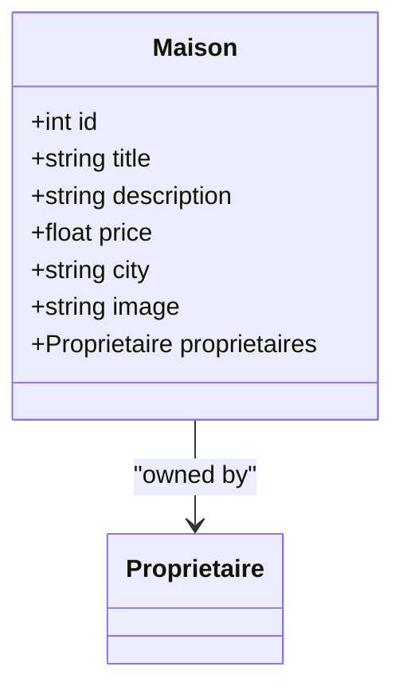
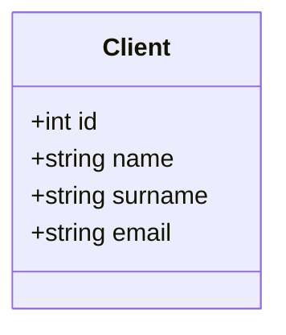
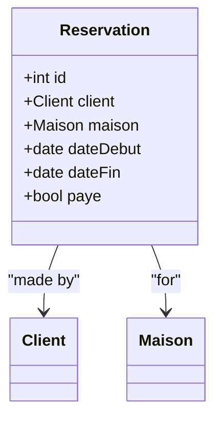
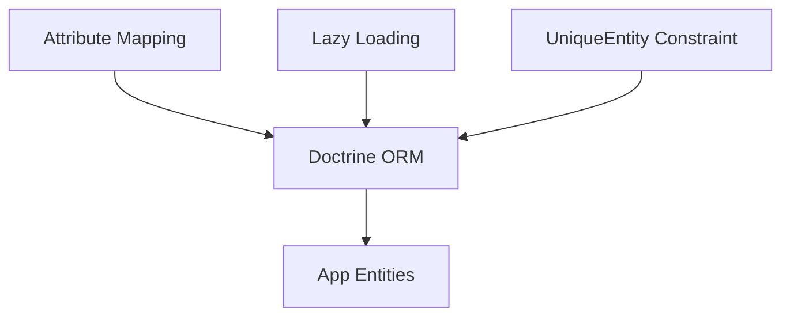

# Database Design

<cite>
**Referenced Files in This Document**
- [Maison.php](file://src/Entity/Maison.php)
- [Client.php](file://src/Entity/Client.php)
- [Reservation.php](file://src/Entity/Reservation.php)
- [User.php](file://src/Entity/User.php)
- [Proprietaire.php](file://src/Entity/Proprietaire.php)
- [ResetPassword.php](file://src/Entity/ResetPassword.php)
- [Version20260322195642.php](file://migrations/Version20260322195642.php)
- [doctrine.yaml](file://config/packages/doctrine.yaml)
- [composer.json](file://composer.json)
</cite>

## Table of Contents
1. [Introduction](#introduction)
2. [Project Structure](#project-structure)
3. [Core Components](#core-components)
4. [Architecture Overview](#architecture-overview)
5. [Detailed Component Analysis](#detailed-component-analysis)
6. [Dependency Analysis](#dependency-analysis)
7. [Performance Considerations](#performance-considerations)
8. [Troubleshooting Guide](#troubleshooting-guide)
9. [Conclusion](#conclusion)
10. [Appendices](#appendices)

## Introduction
This document describes the Maisons d'Hôtes database schema and its associated Doctrine ORM entities. It focuses on the core entities Maison (properties), Client (customers), Reservation (bookings), User (authentication), Proprietaire (property owners), and ResetPassword (password reset tokens). The documentation covers entity fields, data types, primary and foreign keys, indexes, constraints, business rules, and ORM mapping characteristics such as lazy loading and cascade behavior. It also presents entity relationship diagrams, data integrity considerations, and practical scenarios to illustrate design choices.

## Project Structure
The data model is defined via PHP attributes in the src/Entity directory and mapped to the database using Doctrine ORM. Migrations manage schema evolution. The Doctrine configuration enables attribute-based mapping and lazy loading.



**Diagram sources**
- [doctrine.yaml:11-26](file://config/packages/doctrine.yaml#L11-L26)
- [Version20260322195642.php:20-27](file://migrations/Version20260322195642.php#L20-L27)

**Section sources**
- [doctrine.yaml:11-26](file://config/packages/doctrine.yaml#L11-L26)
- [composer.json:10-48](file://composer.json#L10-L48)

## Core Components
This section documents each entity’s fields, data types, primary keys, and relationships inferred from the ORM annotations. Constraints and indexes are derived from the entity definitions and migration.

- User
  - Fields: id (integer, PK), username (string, unique), roles (JSON array), password (string).
  - Unique constraint: username.
  - Business rule: roles guaranteed to include at least ROLE_USER; serialization ensures password hashes are not stored in sessions.
  - ORM: attribute mapping enabled; lazy loading supported.

- ResetPassword
  - Fields: id (integer, PK), user (many-to-one to User), token (string), createdAt (datetime immutable).
  - Foreign key: user_id -> user.id.
  - Index: user_id.
  - Business rule: enforces per-user reset token lifecycle.

- Proprietaire
  - Fields: id (integer, PK), name (string), surname (string), phone (string).
  - Business rule: string concatenation for display (__toString).

- Maison
  - Fields: id (integer, PK), title (string), description (text), price (float), city (string), image (string), proprietaires (many-to-one to Proprietaire).
  - Foreign key: proprietaires -> proprietaire.id (not nullable).
  - Business rule: string concatenation for display (__toString).

- Client
  - Fields: id (integer, PK), name (string), surname (string), email (string).
  - Business rule: string concatenation for display (__toString).

- Reservation
  - Fields: id (integer, PK), client (many-to-one to Client), maison (many-to-one to Maison), dateDebut (date), dateFin (date), paye (boolean).
  - Foreign keys: client -> client.id; maison -> maison.id (both not nullable).
  - Business rule: payment flag presence.

Notes on constraints and indexes:
- Unique constraint on User.username.
- Foreign key constraints enforced by migrations for ResetPassword.user_id.
- Index on ResetPassword.user_id.
- Not-null constraints on foreign keys in Maison, Reservation, and ResetPassword.

**Section sources**
- [User.php:14-100](file://src/Entity/User.php#L14-L100)
- [ResetPassword.php:8-65](file://src/Entity/ResetPassword.php#L8-L65)
- [Proprietaire.php:8-68](file://src/Entity/Proprietaire.php#L8-L68)
- [Maison.php:9-116](file://src/Entity/Maison.php#L9-L116)
- [Client.php:8-69](file://src/Entity/Client.php#L8-L69)
- [Reservation.php:9-98](file://src/Entity/Reservation.php#L9-L98)
- [Version20260322195642.php:23-25](file://migrations/Version20260322195642.php#L23-L25)

## Architecture Overview
The schema models a hospitality booking system with clear ownership and reservation flows. Owners (Proprietaire) own properties (Maison), guests (Client) make reservations (Reservation) against properties, and users (User) handle authentication and password resets (ResetPassword).



**Diagram sources**
- [User.php:14-100](file://src/Entity/User.php#L14-L100)
- [ResetPassword.php:8-65](file://src/Entity/ResetPassword.php#L8-L65)
- [Proprietaire.php:8-68](file://src/Entity/Proprietaire.php#L8-L68)
- [Maison.php:9-116](file://src/Entity/Maison.php#L9-L116)
- [Client.php:8-69](file://src/Entity/Client.php#L8-L69)
- [Reservation.php:9-98](file://src/Entity/Reservation.php#L9-L98)
- [Version20260322195642.php:23-25](file://migrations/Version20260322195642.php#L23-L25)

## Detailed Component Analysis

### User Entity
- Purpose: Authentication and authorization backbone.
- Key constraints: Unique username enforced at DB level; role normalization guarantees minimal role set.
- Security note: Serialization override avoids storing password hashes in serialized sessions.



**Diagram sources**
- [User.php:14-100](file://src/Entity/User.php#L14-L100)

**Section sources**
- [User.php:14-100](file://src/Entity/User.php#L14-L100)
- [doctrine.yaml:11-16](file://config/packages/doctrine.yaml#L11-L16)

### ResetPassword Entity
- Purpose: Manage password reset tokens linked to a User.
- Integrity: Foreign key to User; indexed user_id; immutable creation timestamp.
- Lifecycle: Token validity and cleanup policies are application-level concerns not encoded in schema.



**Diagram sources**
- [ResetPassword.php:8-65](file://src/Entity/ResetPassword.php#L8-L65)
- [User.php:14-100](file://src/Entity/User.php#L14-L100)

**Section sources**
- [ResetPassword.php:8-65](file://src/Entity/ResetPassword.php#L8-L65)
- [Version20260322195642.php:23-25](file://migrations/Version20260322195642.php#L23-L25)

### Proprietaire Entity
- Purpose: Represent property owners.
- Display: String representation combines name and surname.



**Diagram sources**
- [Proprietaire.php:8-68](file://src/Entity/Proprietaire.php#L8-L68)

**Section sources**
- [Proprietaire.php:8-68](file://src/Entity/Proprietaire.php#L8-L68)

### Maison Entity
- Purpose: Represent available properties for booking.
- Ownership: Many-to-one relationship to Proprietaire; not nullable.
- Display: String representation uses title.



**Diagram sources**
- [Maison.php:9-116](file://src/Entity/Maison.php#L9-L116)
- [Proprietaire.php:8-68](file://src/Entity/Proprietaire.php#L8-L68)

**Section sources**
- [Maison.php:9-116](file://src/Entity/Maison.php#L9-L116)

### Client Entity
- Purpose: Represent guests/customers.
- Display: String representation combines name and surname.



**Diagram sources**
- [Client.php:8-69](file://src/Entity/Client.php#L8-L69)

**Section sources**
- [Client.php:8-69](file://src/Entity/Client.php#L8-L69)

### Reservation Entity
- Purpose: Represent bookings made by Clients for specific Maison dates.
- Integrity: Both foreign keys are not nullable; payment flag present.
- Business rule: dateDebut and dateFin are required; paye indicates payment status.



**Diagram sources**
- [Reservation.php:9-98](file://src/Entity/Reservation.php#L9-L98)
- [Client.php:8-69](file://src/Entity/Client.php#L8-L69)
- [Maison.php:9-116](file://src/Entity/Maison.php#L9-L116)

**Section sources**
- [Reservation.php:9-98](file://src/Entity/Reservation.php#L9-L98)

### Relationship Cardinalities and Associations
- Proprietaire to Maison: One-to-Many (one owner can own many properties).
- Maison to Reservation: One-to-Many (one property hosts many reservations).
- Client to Reservation: One-to-Many (one client can have many reservations).
- User to ResetPassword: One-to-Many (one user can have multiple reset tokens over time).
- ResetPassword to User: Many-to-One (reset tokens belong to one user).

```mermaid
graph LR
P["Proprietaire"] -- "1" --> |"0..*"| M["Maison"]
M -- "1" --> |"0..*"| R["Reservation"]
C["Client"] -- "1" --> |"0..*"| R
U["User"] -- "1" --> |"0..*"| RP["ResetPassword"]
RP -- "0..1" --> |"belongs to"| U
```

**Diagram sources**
- [Proprietaire.php:8-68](file://src/Entity/Proprietaire.php#L8-L68)
- [Maison.php:9-116](file://src/Entity/Maison.php#L9-L116)
- [Client.php:8-69](file://src/Entity/Client.php#L8-L69)
- [Reservation.php:9-98](file://src/Entity/Reservation.php#L9-L98)
- [User.php:14-100](file://src/Entity/User.php#L14-L100)
- [ResetPassword.php:8-65](file://src/Entity/ResetPassword.php#L8-L65)

## Dependency Analysis
- ORM mapping: Attribute-based mapping configured; auto_mapping enabled for App namespace.
- Lazy loading: Enabled via orm.enable_lazy_ghost_objects.
- Validation: UniqueEntity constraint on User.username enforced by ORM.
- External dependencies: Doctrine ORM and migrations bundles.



**Diagram sources**
- [doctrine.yaml:11-26](file://config/packages/doctrine.yaml#L11-L26)
- [User.php:13](file://src/Entity/User.php#L13)

**Section sources**
- [doctrine.yaml:11-26](file://config/packages/doctrine.yaml#L11-L26)
- [composer.json:10-48](file://composer.json#L10-L48)

## Performance Considerations
- Lazy loading: Enabled to reduce unnecessary object hydration; relationships remain proxies until accessed.
- Indexes: An index exists on ResetPassword.user_id to optimize joins and lookups.
- Data types: JSON storage for User.roles supports flexible role arrays; ensure appropriate indexing if querying roles frequently.
- Cascading: No explicit cascade operations are defined in the entities; changes to parent entities require manual propagation.

[No sources needed since this section provides general guidance]

## Troubleshooting Guide
- Unique username violation: Creating or updating a User with an existing username triggers a unique constraint error; resolve by changing the username.
- Missing foreign keys: If foreign keys are null or invalid, persistence will fail due to not-null constraints; ensure related entities exist before linking.
- Reset token lifecycle: Tokens are stored with createdAt; implement application-level cleanup policies to avoid orphan entries.
- Role normalization: Roles are normalized to include at least ROLE_USER; verify role arrays are properly maintained.

**Section sources**
- [User.php:13](file://src/Entity/User.php#L13)
- [Version20260322195642.php:23-25](file://migrations/Version20260322195642.php#L23-L25)
- [Reservation.php:17-23](file://src/Entity/Reservation.php#L17-L23)
- [Maison.php:32-34](file://src/Entity/Maison.php#L32-L34)

## Conclusion
The schema cleanly separates concerns across entities while enforcing referential integrity through foreign keys and constraints. Attribute-based ORM mapping simplifies development, and lazy loading improves runtime efficiency. The design supports core business flows: property ownership, customer profiles, reservations, and secure authentication with reset tokens. Future enhancements could include explicit cascade strategies, additional indexes for high-cardinality fields, and application-level validations for date ranges and pricing.

## Appendices

### Field Reference and Constraints
- User
  - id: integer, PK
  - username: string, unique
  - roles: JSON array
  - password: string
- ResetPassword
  - id: integer, PK
  - user_id: integer, FK to user.id
  - token: string
  - created_at: datetime immutable
- Proprietaire
  - id: integer, PK
  - name: string
  - surname: string
  - phone: string
- Maison
  - id: integer, PK
  - title: string
  - description: text
  - price: float
  - city: string
  - image: string
  - proprietaire_id: integer, FK to proprietaire.id (not null)
- Client
  - id: integer, PK
  - name: string
  - surname: string
  - email: string
- Reservation
  - id: integer, PK
  - client_id: integer, FK to client.id (not null)
  - maison_id: integer, FK to maison.id (not null)
  - dateDebut: date
  - dateFin: date
  - paye: boolean

**Section sources**
- [User.php:14-100](file://src/Entity/User.php#L14-L100)
- [ResetPassword.php:8-65](file://src/Entity/ResetPassword.php#L8-L65)
- [Proprietaire.php:8-68](file://src/Entity/Proprietaire.php#L8-L68)
- [Maison.php:9-116](file://src/Entity/Maison.php#L9-L116)
- [Client.php:8-69](file://src/Entity/Client.php#L8-L69)
- [Reservation.php:9-98](file://src/Entity/Reservation.php#L9-L98)
- [Version20260322195642.php:23-25](file://migrations/Version20260322195642.php#L23-L25)

### Sample Scenarios
- Scenario 1: Owner creates a property
  - Create a Proprietaire, then create a Maison with that owner.
  - Verify foreign key constraint on maison.proprietaire_id.
- Scenario 2: Guest makes a reservation
  - Create a Client, create a Maison, then create a Reservation linking both.
  - Ensure dateDebut and dateFin are set; paye can be toggled.
- Scenario 3: User password reset
  - Create a User, then create a ResetPassword record with a unique token.
  - Use index on reset_password.user_id for efficient lookups.

[No sources needed since this section provides general guidance]