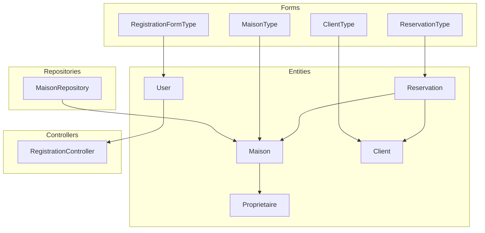
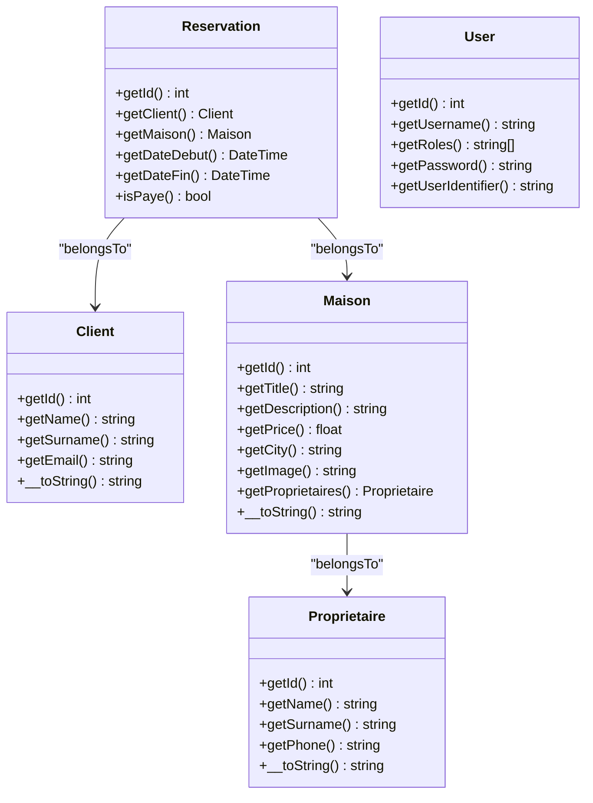
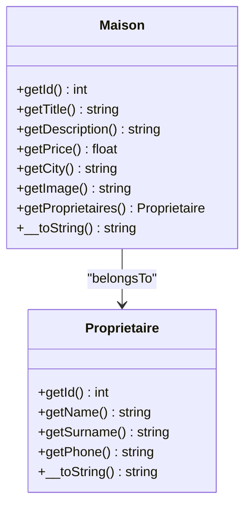
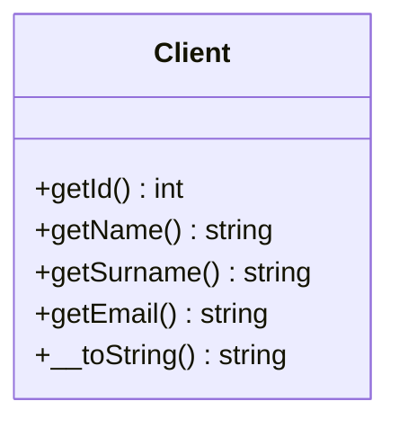
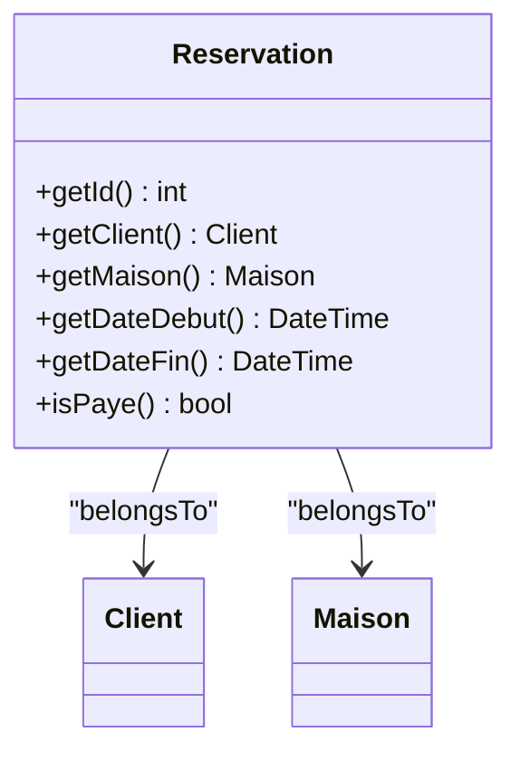
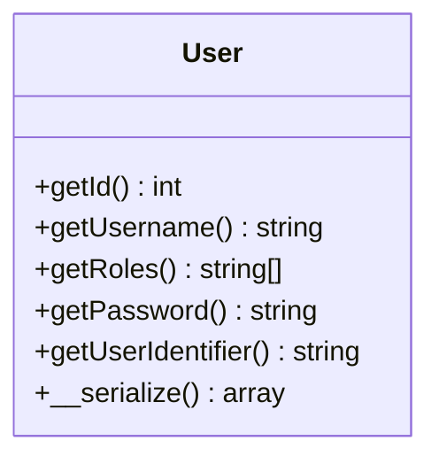
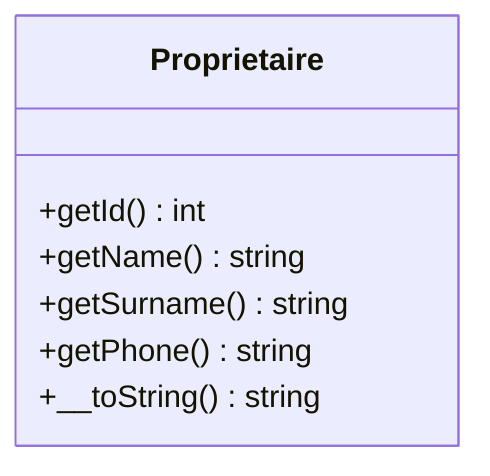
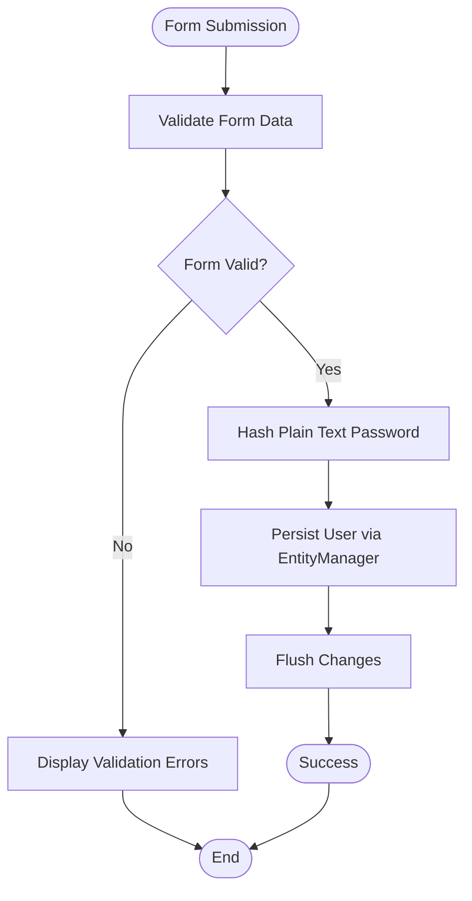
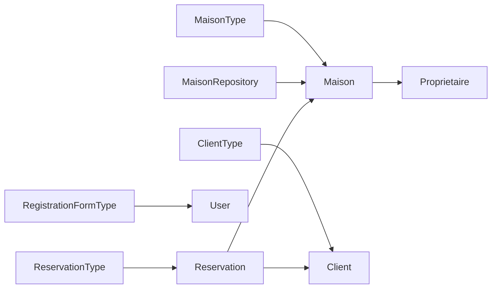

# Entity Specifications

<cite>
**Referenced Files in This Document**
- [Maison.php](file://src/Entity/Maison.php)
- [Client.php](file://src/Entity/Client.php)
- [Reservation.php](file://src/Entity/Reservation.php)
- [User.php](file://src/Entity/User.php)
- [Proprietaire.php](file://src/Entity/Proprietaire.php)
- [MaisonRepository.php](file://src/Repository/MaisonRepository.php)
- [MaisonType.php](file://src/Form/MaisonType.php)
- [ClientType.php](file://src/Form/ClientType.php)
- [ReservationType.php](file://src/Form/ReservationType.php)
- [RegistrationFormType.php](file://src/Form/RegistrationFormType.php)
- [RegistrationController.php](file://src/Controller/RegistrationController.php)
- [validator.yaml](file://config/packages/validator.yaml)
</cite>

## Table of Contents
1. [Introduction](#introduction)
2. [Project Structure](#project-structure)
3. [Core Components](#core-components)
4. [Architecture Overview](#architecture-overview)
5. [Detailed Component Analysis](#detailed-component-analysis)
6. [Dependency Analysis](#dependency-analysis)
7. [Performance Considerations](#performance-considerations)
8. [Troubleshooting Guide](#troubleshooting-guide)
9. [Conclusion](#conclusion)

## Introduction
This document provides comprehensive entity specifications for the Maisons d'Hôtes system. It details each entity’s field definitions, data types, validation constraints, and Doctrine ORM annotations. It also documents business logic, relationships, and common usage patterns derived from the entity classes, their associated forms, repositories, and controllers.

## Project Structure
The entities are located under src/Entity and are accompanied by:
- Form types under src/Form that map to entities and define UI-level validation constraints.
- Repositories under src/Repository that encapsulate data access logic.
- Controllers under src/Controller that orchestrate persistence and validation flows.
- Validation configuration under config/packages/validator.yaml enabling auto-mapping of constraints from Doctrine metadata.

**Diagram sources**
- [Maison.php:1-118](file://src/Entity/Maison.php#L1-L118)
- [Client.php:1-71](file://src/Entity/Client.php#L1-L71)
- [Reservation.php:1-100](file://src/Entity/Reservation.php#L1-L100)
- [User.php:1-119](file://src/Entity/User.php#L1-L119)
- [Proprietaire.php:1-70](file://src/Entity/Proprietaire.php#L1-L70)
- [MaisonType.php:1-36](file://src/Form/MaisonType.php#L1-L36)
- [ClientType.php:1-28](file://src/Form/ClientType.php#L1-L28)
- [ReservationType.php:1-50](file://src/Form/ReservationType.php#L1-L50)
- [RegistrationFormType.php:1-56](file://src/Form/RegistrationFormType.php#L1-L56)
- [MaisonRepository.php:1-47](file://src/Repository/MaisonRepository.php#L1-L47)
- [RegistrationController.php:1-44](file://src/Controller/RegistrationController.php#L1-L44)

**Section sources**
- [Maison.php:1-118](file://src/Entity/Maison.php#L1-L118)
- [Client.php:1-71](file://src/Entity/Client.php#L1-L71)
- [Reservation.php:1-100](file://src/Entity/Reservation.php#L1-L100)
- [User.php:1-119](file://src/Entity/User.php#L1-L119)
- [Proprietaire.php:1-70](file://src/Entity/Proprietaire.php#L1-L70)
- [MaisonRepository.php:1-47](file://src/Repository/MaisonRepository.php#L1-L47)
- [MaisonType.php:1-36](file://src/Form/MaisonType.php#L1-L36)
- [ClientType.php:1-28](file://src/Form/ClientType.php#L1-L28)
- [ReservationType.php:1-50](file://src/Form/ReservationType.php#L1-L50)
- [RegistrationFormType.php:1-56](file://src/Form/RegistrationFormType.php#L1-L56)
- [RegistrationController.php:1-44](file://src/Controller/RegistrationController.php#L1-L44)
- [validator.yaml:1-12](file://config/packages/validator.yaml#L1-L12)

## Core Components
This section summarizes each entity’s fields, data types, ORM annotations, and notable behaviors.

- Maison
  - Fields: id (integer), title (string, max length 255), description (text), price (float), city (string, max length 255), image (string, max length 255), proprietaires (manyToOne to Proprietaire).
  - Annotations: Id, GeneratedValue, Column, ManyToOne with joinColumn not nullable.
  - Business logic: Implements __toString returning title.
  - Relationships: Belongs to Proprietaire via foreign key.

- Client
  - Fields: id (integer), name (string, max length 255), surname (string, max length 255), email (string, max length 255).
  - Annotations: Id, GeneratedValue, Column with length constraints.
  - Business logic: Implements __toString returning “name surname”.

- Reservation
  - Fields: id (integer), client (manyToOne to Client), maison (manyToOne to Maison), dateDebut (date), dateFin (date), paye (boolean).
  - Annotations: Id, GeneratedValue, ManyToOne with non-nullable joinColumns, Date column types, Boolean column.
  - Business logic: Accessors for client, maison, dates, and payment flag.

- User
  - Fields: id (integer), username (string, max length 180), roles (array), password (string).
  - Annotations: Id, GeneratedValue, Column, Unique constraint on username, UniqueEntity constraint at class level.
  - Security behavior: Implements UserInterface and PasswordAuthenticatedUserInterface; ensures serialized representation does not expose raw password hash; guarantees at least ROLE_USER.

- Proprietaire
  - Fields: id (integer), name (string, max length 255), surname (string, max length 255), phone (string, max length 255).
  - Annotations: Id, GeneratedValue, Column with length constraints.
  - Business logic: Implements __toString returning “name surname”.

Validation constraints
- Entity-level constraints inferred from Doctrine metadata are enabled via auto-mapping in validator configuration.
- Additional constraints enforced at the form level:
  - RegistrationFormType enforces a minimum password length and a terms agreement checkbox.
  - Form types for Maison, Client, and Reservation map to their respective entities and expose fields for editing.

Usage patterns
- Entities are persisted via controllers using the EntityManagerInterface after form validation.
- Repositories provide convenience methods for counting, grouping by city, and fetching latest records.

**Section sources**
- [Maison.php:1-118](file://src/Entity/Maison.php#L1-L118)
- [Client.php:1-71](file://src/Entity/Client.php#L1-L71)
- [Reservation.php:1-100](file://src/Entity/Reservation.php#L1-L100)
- [User.php:1-119](file://src/Entity/User.php#L1-L119)
- [Proprietaire.php:1-70](file://src/Entity/Proprietaire.php#L1-L70)
- [validator.yaml:1-12](file://config/packages/validator.yaml#L1-L12)
- [RegistrationFormType.php:1-56](file://src/Form/RegistrationFormType.php#L1-L56)
- [MaisonType.php:1-36](file://src/Form/MaisonType.php#L1-L36)
- [ClientType.php:1-28](file://src/Form/ClientType.php#L1-L28)
- [ReservationType.php:1-50](file://src/Form/ReservationType.php#L1-L50)
- [RegistrationController.php:1-44](file://src/Controller/RegistrationController.php#L1-L44)
- [MaisonRepository.php:1-47](file://src/Repository/MaisonRepository.php#L1-L47)

## Architecture Overview
The entities form a small but cohesive domain model:
- Client and Maison are central to the booking process.
- Reservation links Client and Maison with temporal and payment attributes.
- Proprietaire is associated with Maison.
- User is the authenticated identity used by the application.

**Diagram sources**
- [Maison.php:1-118](file://src/Entity/Maison.php#L1-L118)
- [Client.php:1-71](file://src/Entity/Client.php#L1-L71)
- [Reservation.php:1-100](file://src/Entity/Reservation.php#L1-L100)
- [User.php:1-119](file://src/Entity/User.php#L1-L119)
- [Proprietaire.php:1-70](file://src/Entity/Proprietaire.php#L1-L70)

## Detailed Component Analysis

### Maison Entity
- Field definitions and types
  - id: integer, auto-generated primary key.
  - title: string, length 255.
  - description: text.
  - price: float.
  - city: string, length 255.
  - image: string, length 255.
  - proprietaires: manyToOne to Proprietaire, non-nullable.
- ORM annotations
  - #[ORM\Id], #[ORM\GeneratedValue], #[ORM\Column], #[ORM\ManyToOne], #[ORM\JoinColumn(notNull: true)].
- Business logic
  - __toString returns the title.
- Relationships
  - ManyToOne to Proprietaire via a foreign key.

**Diagram sources**
- [Maison.php:1-118](file://src/Entity/Maison.php#L1-L118)
- [Proprietaire.php:1-70](file://src/Entity/Proprietaire.php#L1-L70)

**Section sources**
- [Maison.php:1-118](file://src/Entity/Maison.php#L1-L118)

### Client Entity
- Field definitions and types
  - id: integer, auto-generated primary key.
  - name: string, length 255.
  - surname: string, length 255.
  - email: string, length 255.
- ORM annotations
  - #[ORM\Id], #[ORM\GeneratedValue], #[ORM\Column(length: 255)].
- Business logic
  - __toString returns “name surname”.

**Diagram sources**
- [Client.php:1-71](file://src/Entity/Client.php#L1-L71)

**Section sources**
- [Client.php:1-71](file://src/Entity/Client.php#L1-L71)

### Reservation Entity
- Field definitions and types
  - id: integer, auto-generated primary key.
  - client: manyToOne to Client, non-nullable.
  - maison: manyToOne to Maison, non-nullable.
  - dateDebut: date.
  - dateFin: date.
  - paye: boolean.
- ORM annotations
  - #[ORM\Id], #[ORM\GeneratedValue], #[ORM\ManyToOne], #[ORM\JoinColumn(notNull: true)], #[ORM\Column(type: DATE_MUTABLE)], #[ORM\Column].
- Business logic
  - Accessors for client, maison, dateDebut, dateFin, and paye.

**Diagram sources**
- [Reservation.php:1-100](file://src/Entity/Reservation.php#L1-L100)
- [Client.php:1-71](file://src/Entity/Client.php#L1-L71)
- [Maison.php:1-118](file://src/Entity/Maison.php#L1-L118)

**Section sources**
- [Reservation.php:1-100](file://src/Entity/Reservation.php#L1-L100)

### User Entity
- Field definitions and types
  - id: integer, auto-generated primary key.
  - username: string, length 180, unique.
  - roles: array of strings.
  - password: string (hashed).
- ORM annotations
  - #[ORM\Id], #[ORM\GeneratedValue], #[ORM\Column(length: 180)], #[ORM\Column], #[ORM\UniqueConstraint(name: "UNIQ_IDENTIFIER_USERNAME", fields: ["username"])], #[UniqueEntity(fields: ["username"], message: "...")].
- Security behavior
  - Implements UserInterface and PasswordAuthenticatedUserInterface.
  - Ensures serialized representation does not expose raw password hash.
  - Guarantees at least ROLE_USER.
- Validation constraints
  - Unique username enforced at the database and entity level.
  - Password constraints enforced via RegistrationFormType.

**Diagram sources**
- [User.php:1-119](file://src/Entity/User.php#L1-L119)

**Section sources**
- [User.php:1-119](file://src/Entity/User.php#L1-L119)
- [RegistrationFormType.php:1-56](file://src/Form/RegistrationFormType.php#L1-L56)

### Proprietaire Entity
- Field definitions and types
  - id: integer, auto-generated primary key.
  - name: string, length 255.
  - surname: string, length 255.
  - phone: string, length 255.
- ORM annotations
  - #[ORM\Id], #[ORM\GeneratedValue], #[ORM\Column(length: 255)].
- Business logic
  - __toString returns “name surname”.

**Diagram sources**
- [Proprietaire.php:1-70](file://src/Entity/Proprietaire.php#L1-L70)

**Section sources**
- [Proprietaire.php:1-70](file://src/Entity/Proprietaire.php#L1-L70)

### Validation Rules and Constraints
- Auto-mapping of constraints from Doctrine metadata is enabled in validator configuration.
- Additional constraints enforced at the form level:
  - RegistrationFormType:
    - Terms agreement checkbox constraint.
    - Password length constraints (minimum and maximum).
  - Form types for Maison, Client, and Reservation map entity fields to form widgets without additional explicit constraints in the form classes.

**Diagram sources**
- [RegistrationFormType.php:1-56](file://src/Form/RegistrationFormType.php#L1-L56)
- [RegistrationController.php:1-44](file://src/Controller/RegistrationController.php#L1-L44)

**Section sources**
- [validator.yaml:1-12](file://config/packages/validator.yaml#L1-L12)
- [RegistrationFormType.php:1-56](file://src/Form/RegistrationFormType.php#L1-L56)
- [RegistrationController.php:1-44](file://src/Controller/RegistrationController.php#L1-L44)

### Common Usage Patterns
- Creating and persisting a Maison:
  - Instantiate Maison.
  - Set title, description, price, city, image, and proprietaires.
  - Persist and flush via EntityManager.
- Creating and persisting a Client:
  - Instantiate Client.
  - Set name, surname, email.
  - Persist and flush via EntityManager.
- Creating and persisting a Reservation:
  - Instantiate Reservation.
  - Set client, maison, dateDebut, dateFin, paye.
  - Persist and flush via EntityManager.
- Registering a User:
  - Create User via RegistrationFormType.
  - Hash password in RegistrationController.
  - Persist and flush via EntityManager.

**Section sources**
- [Maison.php:1-118](file://src/Entity/Maison.php#L1-L118)
- [Client.php:1-71](file://src/Entity/Client.php#L1-L71)
- [Reservation.php:1-100](file://src/Entity/Reservation.php#L1-L100)
- [User.php:1-119](file://src/Entity/User.php#L1-L119)
- [RegistrationController.php:1-44](file://src/Controller/RegistrationController.php#L1-L44)

## Dependency Analysis
- Entity-to-Entity dependencies
  - Maison belongsTo Proprietaire.
  - Reservation belongsTo Client and Maison.
- Form-to-Entity dependencies
  - MaisonType maps to Maison.
  - ClientType maps to Client.
  - ReservationType maps to Reservation.
  - RegistrationFormType maps to User.
- Repository dependencies
  - MaisonRepository operates on Maison.

**Diagram sources**
- [MaisonType.php:1-36](file://src/Form/MaisonType.php#L1-L36)
- [ClientType.php:1-28](file://src/Form/ClientType.php#L1-L28)
- [ReservationType.php:1-50](file://src/Form/ReservationType.php#L1-L50)
- [RegistrationFormType.php:1-56](file://src/Form/RegistrationFormType.php#L1-L56)
- [MaisonRepository.php:1-47](file://src/Repository/MaisonRepository.php#L1-L47)
- [Maison.php:1-118](file://src/Entity/Maison.php#L1-L118)
- [Client.php:1-71](file://src/Entity/Client.php#L1-L71)
- [Reservation.php:1-100](file://src/Entity/Reservation.php#L1-L100)
- [User.php:1-119](file://src/Entity/User.php#L1-L119)
- [Proprietaire.php:1-70](file://src/Entity/Proprietaire.php#L1-L70)

**Section sources**
- [MaisonType.php:1-36](file://src/Form/MaisonType.php#L1-L36)
- [ClientType.php:1-28](file://src/Form/ClientType.php#L1-L28)
- [ReservationType.php:1-50](file://src/Form/ReservationType.php#L1-L50)
- [RegistrationFormType.php:1-56](file://src/Form/RegistrationFormType.php#L1-L56)
- [MaisonRepository.php:1-47](file://src/Repository/MaisonRepository.php#L1-L47)

## Performance Considerations
- Prefer repository methods for aggregations (e.g., counting, grouping by city) to avoid loading full entity graphs unnecessarily.
- Use projections (select only needed fields) in queries to reduce memory footprint.
- Keep validation constraints minimal and targeted to avoid excessive server-side checks.

## Troubleshooting Guide
- Unique username errors
  - Symptom: Duplicate username during registration.
  - Cause: UniqueEntity and database unique constraint on username.
  - Resolution: Choose a different username or clear conflicting entries.
- Password hashing
  - Symptom: Authentication failures after registration.
  - Cause: Plain password not hashed before persistence.
  - Resolution: Ensure password is hashed in RegistrationController before setting on User.
- Form validation failures
  - Symptom: Form submission rejected.
  - Cause: Missing or invalid data, missing terms agreement, or password length violations.
  - Resolution: Review form constraints and user input; ensure terms are agreed and password meets length requirements.

**Section sources**
- [User.php:1-119](file://src/Entity/User.php#L1-L119)
- [RegistrationFormType.php:1-56](file://src/Form/RegistrationFormType.php#L1-L56)
- [RegistrationController.php:1-44](file://src/Controller/RegistrationController.php#L1-L44)

## Conclusion
The Maisons d'Hôtes entities define a clear, relational domain model with straightforward field-level constraints and ORM mappings. Validation is enforced both at the entity level (via Doctrine metadata and UniqueEntity) and at the form level (via explicit constraints). The provided repositories and controllers demonstrate standard usage patterns for persistence and validation, ensuring maintainable and secure operations.