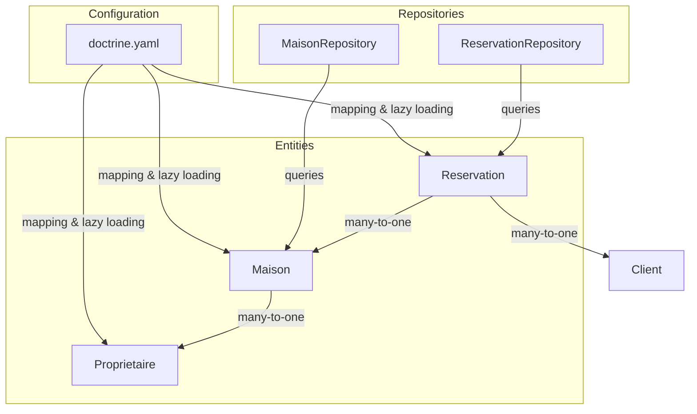
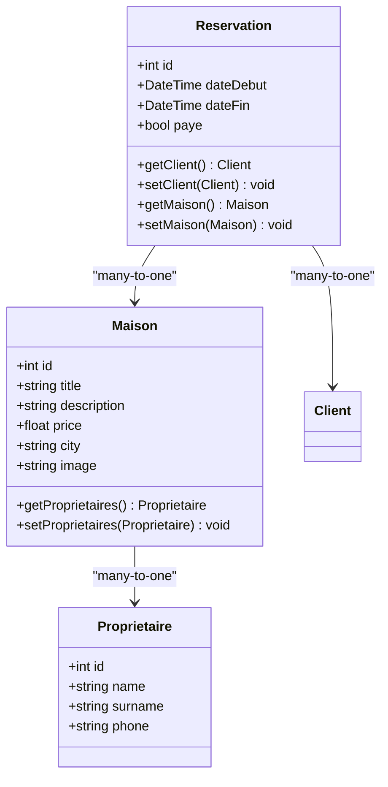
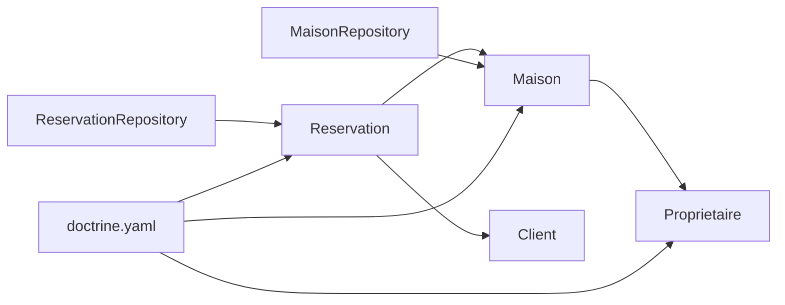

# Relationships and Associations

<cite>
**Referenced Files in This Document**
- [Maison.php](file://src/Entity/Maison.php)
- [Proprietaire.php](file://src/Entity/Proprietaire.php)
- [Reservation.php](file://src/Entity/Reservation.php)
- [MaisonRepository.php](file://src/Repository/MaisonRepository.php)
- [ReservationRepository.php](file://src/Repository/ReservationRepository.php)
- [MaisonType.php](file://src/Form/MaisonType.php)
- [doctrine.yaml](file://config/packages/doctrine.yaml)
- [Version20260322195642.php](file://migrations/Version20260322195642.php)
</cite>

## Table of Contents
1. [Introduction](#introduction)
2. [Project Structure](#project-structure)
3. [Core Components](#core-components)
4. [Architecture Overview](#architecture-overview)
5. [Detailed Component Analysis](#detailed-component-analysis)
6. [Dependency Analysis](#dependency-analysis)
7. [Performance Considerations](#performance-considerations)
8. [Troubleshooting Guide](#troubleshooting-guide)
9. [Conclusion](#conclusion)

## Introduction
This document explains the entity relationships and associations in the Maisons d'Hôtes database schema. It focuses on the many-to-one relationship between Maison and Proprietaire, detailing foreign key constraints, cascade behavior, and bidirectional management via Doctrine ORM. It also covers the broader association patterns used in the system (one-to-many, many-to-one, one-to-one), lazy loading strategies, eager loading scenarios, and performance implications. Practical examples demonstrate querying related entities, joining tables, and navigating object relationships, along with cascade operations, orphan removal, and referential integrity constraints.

## Project Structure
The project follows a standard Symfony/Doctrine layout with entities under src/Entity, repositories under src/Repository, and Doctrine configuration under config/packages. The relevant entities for this document are Maison, Proprietaire, and Reservation. The Doctrine configuration enables attribute-based mapping and lazy loading support.

**Diagram sources**
- [Maison.php:32-34](file://src/Entity/Maison.php#L32-L34)
- [Proprietaire.php:1-70](file://src/Entity/Proprietaire.php#L1-L70)
- [Reservation.php:17-23](file://src/Entity/Reservation.php#L17-L23)
- [MaisonRepository.php:12-46](file://src/Repository/MaisonRepository.php#L12-L46)
- [ReservationRepository.php:13-92](file://src/Repository/ReservationRepository.php#L13-L92)
- [doctrine.yaml:11-28](file://config/packages/doctrine.yaml#L11-L28)

**Section sources**
- [doctrine.yaml:11-28](file://config/packages/doctrine.yaml#L11-L28)

## Core Components
- Maison: Represents rental properties. It has a many-to-one relationship with Proprietaire through a foreign key column on the maison table referencing the id of Proprietaire. The relationship is mandatory (non-nullable).
- Proprietaire: Represents property owners. It is referenced by Maison but does not declare a reverse association in the provided entity.
- Reservation: Represents bookings. It has two many-to-one relationships: one to Client and one to Maison. Both are mandatory.

Key observations:
- The many-to-one relationship between Maison and Proprietaire is unidirectional from Maison’s perspective.
- There is no explicit inverse side declared on Proprietaire, so navigation from Proprietaire to its Maison(s) is not exposed in the entity model.
- Reservation demonstrates a many-to-one relationship to both Client and Maison, forming a classic junction-like pattern for bookings.

**Section sources**
- [Maison.php:32-34](file://src/Entity/Maison.php#L32-L34)
- [Proprietaire.php:1-70](file://src/Entity/Proprietaire.php#L1-L70)
- [Reservation.php:17-23](file://src/Entity/Reservation.php#L17-L23)

## Architecture Overview
The relationship architecture centers on:
- Many-to-one: Maison to Proprietaire, and Reservation to both Client and Maison.
- One-to-many: Not explicitly declared in the provided entities, but implied by the many-to-one sides. For example, a Proprietaire “owns” zero or more Maisons, and a Maison “hosts” zero or more Reservations.
- One-to-one: Not present among the entities examined here.

**Diagram sources**
- [Maison.php:10-117](file://src/Entity/Maison.php#L10-L117)
- [Proprietaire.php:9-69](file://src/Entity/Proprietaire.php#L9-L69)
- [Reservation.php:10-99](file://src/Entity/Reservation.php#L10-L99)

## Detailed Component Analysis

### Many-to-One: Maison to Proprietaire
- Relationship definition: Maison declares a many-to-one association to Proprietaire with a non-nullable join column. This enforces referential integrity at the database level.
- Foreign key constraint: The underlying database table for Maison includes a foreign key column referencing Proprietaire.id. The migration file for reset_password indicates foreign key usage elsewhere in the schema, supporting the expectation of referential constraints.
- Cascade operations: No explicit cascade options are configured in the entity mapping. This means default behavior applies (no automatic cascading deletes or updates).
- Bidirectional management: The relationship is not mapped as inverse on the Proprietaire side. To navigate from Proprietaire to its Maisons, you would need to add an inverse side collection on Proprietaire and update the mapping accordingly.
- Lazy loading: Doctrine lazy loads the related Proprietaire when accessing Maison.getProprietaires(). Accessing the association outside a transaction boundary may trigger lazy-loading exceptions if not handled properly.

Practical usage patterns:
- Setting the owner on a Maison instance and persisting cascades to the owning entity.
- Querying Maisons with their owners using joins in repositories or query builders.
- Navigating from a Maison to its owner in controllers or templates.

**Section sources**
- [Maison.php:32-34](file://src/Entity/Maison.php#L32-L34)
- [MaisonType.php:22-25](file://src/Form/MaisonType.php#L22-L25)
- [Version20260322195642.php:20-26](file://migrations/Version20260322195642.php#L20-L26)

### Many-to-One: Reservation to Maison and Client
- Relationship definitions: Reservation has two many-to-one associations—client and maison—both marked as non-nullable.
- Implications: Every reservation must reference a valid client and a valid maison. This ensures referential integrity.
- Bidirectional management: Similar to Maison to Proprietaire, there is no explicit inverse side on Maison or Client. If you need to fetch reservations for a given Maison or Client, you can use repository methods or query builders.

Practical usage patterns:
- Fetching reservations for a specific Maison using a repository method.
- Performing SQL joins to compute metrics like most reserved maisons or monthly revenue.

**Section sources**
- [Reservation.php:17-23](file://src/Entity/Reservation.php#L17-L23)
- [ReservationRepository.php:70-78](file://src/Repository/ReservationRepository.php#L70-L78)

### One-to-One Associations
- Not observed in the examined entities. If a one-to-one relationship is needed (for example, a unique profile per user), it would require explicit mapping on both sides with unique constraints.

**Section sources**
- [User.php:14-118](file://src/Entity/User.php#L14-L118)

### One-to-Many Associations
- Not explicitly declared in the provided entities. However, conceptually:
  - Proprietaire could own many Maisons (one-to-many).
  - Maison could host many Reservations (one-to-many).
- To implement these, add an inverse side collection on the “one” side and adjust the owning side mapping to specify the inverse side.

[No sources needed since this section doesn't analyze specific files]

## Dependency Analysis
The following diagram shows how entities and repositories depend on each other and how Doctrine configuration influences lazy loading and mapping.

**Diagram sources**
- [Maison.php:32-34](file://src/Entity/Maison.php#L32-L34)
- [Reservation.php:17-23](file://src/Entity/Reservation.php#L17-L23)
- [MaisonRepository.php:12-46](file://src/Repository/MaisonRepository.php#L12-L46)
- [ReservationRepository.php:13-92](file://src/Repository/ReservationRepository.php#L13-L92)
- [doctrine.yaml:11-28](file://config/packages/doctrine.yaml#L11-L28)

**Section sources**
- [MaisonRepository.php:12-46](file://src/Repository/MaisonRepository.php#L12-L46)
- [ReservationRepository.php:13-92](file://src/Repository/ReservationRepository.php#L13-L92)
- [doctrine.yaml:11-28](file://config/packages/doctrine.yaml#L11-L28)

## Performance Considerations
- Lazy loading: Enabled by default for associations. Accessing related objects triggers a separate SELECT unless fetched via JOIN in a single query. This can cause the N+1 problem if not addressed.
- Eager loading: Use JOIN FETCH in DQL or QueryBuilder to load associated entities in the same query. This reduces round-trips and avoids N+1 queries when rendering lists.
- Indexes and foreign keys: Foreign keys improve referential integrity and can speed up JOINs. Ensure indexes exist on frequently joined columns (e.g., maison_id in reservation).
- Proxies and ghost objects: Doctrine’s lazy ghost objects reduce memory overhead for uninitialized proxies. Keep lazy loading enabled unless you have a strong reason to disable it.
- Query construction: Prefer repository methods that encapsulate JOIN logic to keep controllers clean and avoid repeated ad-hoc queries.

[No sources needed since this section provides general guidance]

## Troubleshooting Guide
Common issues and resolutions:
- LazyInitializationException: Occurs when accessing lazy-loaded associations outside an active EntityManager or transaction. Ensure the entity is initialized within the same persistence context or use JOIN FETCH in queries.
- Missing inverse side: If you need to navigate from Proprietaire to its Maisons, add an inverse side collection on Proprietaire and update the mapping to reflect the relationship direction.
- Non-nullable associations: Violating non-null constraints on many-to-one relationships causes persistence errors. Always set valid related entities before persisting.
- Orphan removal: Not configured in the examined entities. If you intend to remove child entities when unlinking them from a parent, configure orphan removal on the inverse side mapping.
- Cascade operations: Defaults apply if not explicitly configured. Configure cascade persist/remove/update only when necessary to avoid unintended side effects.

**Section sources**
- [Maison.php:32-34](file://src/Entity/Maison.php#L32-L34)
- [Reservation.php:17-23](file://src/Entity/Reservation.php#L17-L23)

## Conclusion
The Maisons d'Hôtes schema primarily uses many-to-one relationships to model real-world associations: Maison belongs to Proprietaire, and Reservation belongs to both Client and Maison. The entities are configured with non-nullable join columns, enforcing referential integrity. While lazy loading is enabled by default, careful query design and optional eager loading strategies are essential to maintain performance. Bidirectional navigation is not currently exposed on the inverse sides; adding inverse collections would improve object graph traversal. Cascade operations and orphan removal are not configured in the examined entities and should be introduced deliberately when needed.