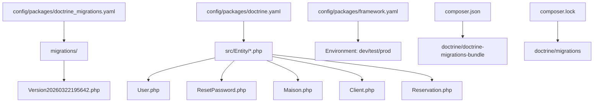
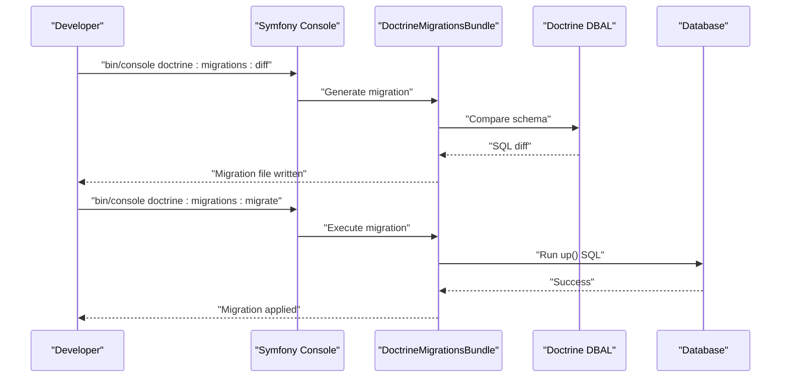
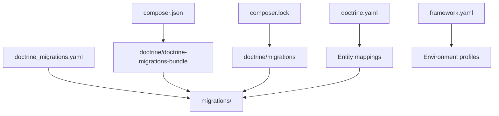
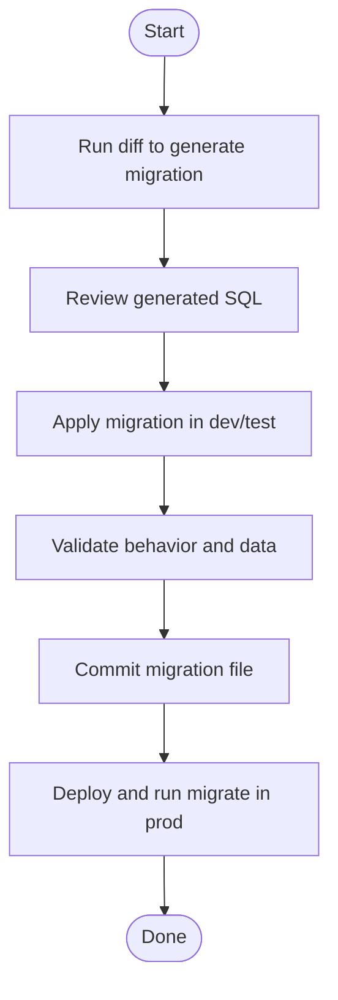

# Schema Evolution and Migrations

<cite>
**Referenced Files in This Document**
- [doctrine_migrations.yaml](file://config/packages/doctrine_migrations.yaml)
- [doctrine.yaml](file://config/packages/doctrine.yaml)
- [framework.yaml](file://config/packages/framework.yaml)
- [composer.json](file://composer.json)
- [composer.lock](file://composer.lock)
- [Version20260322195642.php](file://migrations/Version20260322195642.php)
- [User.php](file://src/Entity/User.php)
- [ResetPassword.php](file://src/Entity/ResetPassword.php)
- [Maison.php](file://src/Entity/Maison.php)
- [Client.php](file://src/Entity/Client.php)
- [Reservation.php](file://src/Entity/Reservation.php)
</cite>

## Table of Contents
1. [Introduction](#introduction)
2. [Project Structure](#project-structure)
3. [Core Components](#core-components)
4. [Architecture Overview](#architecture-overview)
5. [Detailed Component Analysis](#detailed-component-analysis)
6. [Dependency Analysis](#dependency-analysis)
7. [Performance Considerations](#performance-considerations)
8. [Troubleshooting Guide](#troubleshooting-guide)
9. [Conclusion](#conclusion)
10. [Appendices](#appendices)

## Introduction
This document explains how schema evolution and migration management work in the Maisons d'Hôtes system. It covers the migration file structure, naming conventions, execution procedures, and the relationship between Doctrine ORM entities and database migrations. It also provides best practices for creating safe, backward-compatible migrations, including data migrations, column updates, and constraint modifications. Examples illustrate common scenarios such as adding new fields, modifying existing columns, and creating new tables. Rollback procedures, testing in development, and deployment strategies are included to support reliable production changes.

## Project Structure
The migration system is configured via Symfony’s DoctrineMigrationsBundle and stored under the migrations directory. Entities are defined in the src/Entity directory and mapped by Doctrine ORM. The configuration files define the migration path, bundle dependencies, and environment-specific behavior.

**Diagram sources**
- [doctrine_migrations.yaml:1-7](file://config/packages/doctrine_migrations.yaml#L1-L7)
- [doctrine.yaml:1-55](file://config/packages/doctrine.yaml#L1-L55)
- [framework.yaml:1-16](file://config/packages/framework.yaml#L1-L16)
- [composer.json:1-111](file://composer.json#L1-L111)
- [composer.lock:534-1029](file://composer.lock#L534-L1029)
- [Version20260322195642.php:1-38](file://migrations/Version20260322195642.php#L1-L38)
- [User.php:1-119](file://src/Entity/User.php#L1-L119)
- [ResetPassword.php:1-67](file://src/Entity/ResetPassword.php#L1-L67)
- [Maison.php:1-118](file://src/Entity/Maison.php#L1-L118)
- [Client.php:1-71](file://src/Entity/Client.php#L1-L71)
- [Reservation.php:1-100](file://src/Entity/Reservation.php#L1-L100)

**Section sources**
- [doctrine_migrations.yaml:1-7](file://config/packages/doctrine_migrations.yaml#L1-L7)
- [doctrine.yaml:1-55](file://config/packages/doctrine.yaml#L1-L55)
- [framework.yaml:1-16](file://config/packages/framework.yaml#L1-L16)
- [composer.json:1-111](file://composer.json#L1-L111)
- [composer.lock:534-1029](file://composer.lock#L534-L1029)

## Core Components
- Migration path configuration: The migrations directory is registered under the DoctrineMigrations namespace so that generated classes are not autoloaded automatically.
- Migration class: A concrete migration defines up() and down() methods to evolve the schema forward and backward.
- Entities: Doctrine ORM annotations define the schema model; migrations synchronize the database to match the current entity definitions.

Key configuration and class references:
- Migration path registration: [doctrine_migrations.yaml:1-7](file://config/packages/doctrine_migrations.yaml#L1-L7)
- Migration class example: [Version20260322195642.php:1-38](file://migrations/Version20260322195642.php#L1-L38)
- Entity mappings: [User.php:1-119](file://src/Entity/User.php#L1-L119), [ResetPassword.php:1-67](file://src/Entity/ResetPassword.php#L1-L67), [Maison.php:1-118](file://src/Entity/Maison.php#L1-L118), [Client.php:1-71](file://src/Entity/Client.php#L1-L71), [Reservation.php:1-100](file://src/Entity/Reservation.php#L1-L100)

**Section sources**
- [doctrine_migrations.yaml:1-7](file://config/packages/doctrine_migrations.yaml#L1-L7)
- [Version20260322195642.php:1-38](file://migrations/Version20260322195642.php#L1-L38)
- [User.php:1-119](file://src/Entity/User.php#L1-L119)
- [ResetPassword.php:1-67](file://src/Entity/ResetPassword.php#L1-L67)
- [Maison.php:1-118](file://src/Entity/Maison.php#L1-L118)
- [Client.php:1-71](file://src/Entity/Client.php#L1-L71)
- [Reservation.php:1-100](file://src/Entity/Reservation.php#L1-L100)

## Architecture Overview
The migration lifecycle connects configuration, entity definitions, and database changes:

**Diagram sources**
- [doctrine_migrations.yaml:1-7](file://config/packages/doctrine_migrations.yaml#L1-L7)
- [composer.json:10-48](file://composer.json#L10-L48)
- [composer.lock:534-1029](file://composer.lock#L534-L1029)

## Detailed Component Analysis

### Migration File Structure and Naming
- Namespace: Migrations live under the DoctrineMigrations namespace and are stored in the configured migrations path.
- Filename convention: Versions use a timestamp-like suffix indicating generation time (e.g., VersionYYYYMMDDHHMMSS).
- Class structure: Each migration extends AbstractMigration and implements up() and down() methods. The up() method applies changes; the down() method reverts them.

References:
- Path registration: [doctrine_migrations.yaml:1-7](file://config/packages/doctrine_migrations.yaml#L1-L7)
- Example migration: [Version20260322195642.php:1-38](file://migrations/Version20260322195642.php#L1-L38)

**Section sources**
- [doctrine_migrations.yaml:1-7](file://config/packages/doctrine_migrations.yaml#L1-L7)
- [Version20260322195642.php:1-38](file://migrations/Version20260322195642.php#L1-L38)

### Creating New Migrations
- Generate a diff migration: Use the diff command to compare the current schema with entity definitions and produce a migration file.
- Edit the migration: Add or refine SQL statements in up() and down() to reflect desired schema changes.
- Test locally: Apply the migration in a local or test environment before committing.
- Commit and deploy: Include the migration file with your code and apply it during deployment.

References:
- Bundle dependency: [composer.json:10-48](file://composer.json#L10-L48)
- Lock file for doctrine/migrations: [composer.lock:938-1029](file://composer.lock#L938-L1029)

**Section sources**
- [composer.json:10-48](file://composer.json#L10-L48)
- [composer.lock:938-1029](file://composer.lock#L938-L1029)

### Relationship Between Entities and Migrations
- Entities define the schema model via attributes.
- Migrations synchronize the database to match the current entity state.
- Foreign keys and indexes declared in migrations should align with entity relationships and constraints.

References:
- User entity: [User.php:1-119](file://src/Entity/User.php#L1-L119)
- ResetPassword entity: [ResetPassword.php:1-67](file://src/Entity/ResetPassword.php#L1-L67)
- Example foreign key creation: [Version20260322195642.php:20-36](file://migrations/Version20260322195642.php#L20-L36)

**Section sources**
- [User.php:1-119](file://src/Entity/User.php#L1-L119)
- [ResetPassword.php:1-67](file://src/Entity/ResetPassword.php#L1-L67)
- [Version20260322195642.php:20-36](file://migrations/Version20260322195642.php#L20-L36)

### Common Migration Scenarios

#### Adding a New Field
- Modify the entity to add the new property.
- Generate a diff migration to add the column.
- Ensure the down() method reverses the change.

References:
- Example of adding a table and altering a column: [Version20260322195642.php:20-26](file://migrations/Version20260322195642.php#L20-L26)

**Section sources**
- [Version20260322195642.php:20-26](file://migrations/Version20260322195642.php#L20-L26)

#### Modifying an Existing Column
- Change the entity mapping (e.g., type, length, nullable).
- Generate a diff migration to alter the column.
- Provide a reversible down() change.

References:
- Example altering a column default: [Version20260322195642.php:25-26](file://migrations/Version20260322195642.php#L25-L26)

**Section sources**
- [Version20260322195642.php:25-26](file://migrations/Version20260322195642.php#L25-L26)

#### Creating a New Table
- Define the entity for the new table.
- Generate a diff migration to create the table and indexes.
- Add foreign keys in the migration if needed.

References:
- Example creating a table and adding a foreign key: [Version20260322195642.php:20-24](file://migrations/Version20260322195642.php#L20-L24)

**Section sources**
- [Version20260322195642.php:20-24](file://migrations/Version20260322195642.php#L20-L24)

#### Data Migrations and Constraint Modifications
- Data migrations: Use raw SQL in up() to transform data; ensure down() restores previous state.
- Constraint changes: Add or drop indexes, unique constraints, and foreign keys as needed; mirror entity constraints in migrations.

References:
- Example altering a column default and roles JSON handling: [Version20260322195642.php:25-36](file://migrations/Version20260322195642.php#L25-L36)

**Section sources**
- [Version20260322195642.php:25-36](file://migrations/Version20260322195642.php#L25-L36)

### Rollback Procedures
- Use the migrate command with a target version to roll back to a previous state.
- Ensure down() methods are complete and reversible.
- Test rollback in a non-production environment before applying in production.

References:
- Migration class with down() implementation: [Version20260322195642.php:29-36](file://migrations/Version20260322195642.php#L29-L36)

**Section sources**
- [Version20260322195642.php:29-36](file://migrations/Version20260322195642.php#L29-L36)

### Testing Migrations in Development Environments
- Use the test environment configuration to isolate test databases.
- Apply migrations locally and verify entity behavior.
- Keep migrations small and focused to simplify testing.

References:
- Test environment configuration: [framework.yaml:11-16](file://config/packages/framework.yaml#L11-L16)
- Doctrine test settings: [doctrine.yaml:30-34](file://config/packages/doctrine.yaml#L30-L34)

**Section sources**
- [framework.yaml:11-16](file://config/packages/framework.yaml#L11-L16)
- [doctrine.yaml:30-34](file://config/packages/doctrine.yaml#L30-L34)

### Deployment Strategies
- Include migration files with application code.
- Apply migrations during deployment using the migrate command.
- Prefer zero-downtime changes where possible; otherwise schedule maintenance windows.
- Back up the database before applying migrations in production.

References:
- Migration path configuration: [doctrine_migrations.yaml:1-7](file://config/packages/doctrine_migrations.yaml#L1-L7)

**Section sources**
- [doctrine_migrations.yaml:1-7](file://config/packages/doctrine_migrations.yaml#L1-L7)

### Maintaining Backward Compatibility
- Ensure down() methods restore previous schema and data state.
- Avoid destructive changes; prefer additive or non-destructive alterations.
- Validate migrations against multiple environments (dev, staging, prod).

References:
- Down method example: [Version20260322195642.php:29-36](file://migrations/Version20260322195642.php#L29-L36)

**Section sources**
- [Version20260322195642.php:29-36](file://migrations/Version20260322195642.php#L29-L36)

## Dependency Analysis
The migration system relies on Symfony console commands, Doctrine DBAL for schema comparison, and Doctrine ORM for entity mapping.

**Diagram sources**
- [composer.json:10-48](file://composer.json#L10-L48)
- [composer.lock:534-1029](file://composer.lock#L534-L1029)
- [doctrine_migrations.yaml:1-7](file://config/packages/doctrine_migrations.yaml#L1-L7)
- [doctrine.yaml:1-55](file://config/packages/doctrine.yaml#L1-L55)
- [framework.yaml:1-16](file://config/packages/framework.yaml#L1-L16)

**Section sources**
- [composer.json:10-48](file://composer.json#L10-L48)
- [composer.lock:534-1029](file://composer.lock#L534-L1029)
- [doctrine_migrations.yaml:1-7](file://config/packages/doctrine_migrations.yaml#L1-L7)
- [doctrine.yaml:1-55](file://config/packages/doctrine.yaml#L1-L55)
- [framework.yaml:1-16](file://config/packages/framework.yaml#L1-L16)

## Performance Considerations
- Keep migrations small and atomic to reduce lock times and risk.
- Avoid long-running operations inside migrations; split into multiple migrations if necessary.
- Use transactions where supported to ensure consistency.
- Monitor slow queries after applying migrations, especially after index additions.

## Troubleshooting Guide
- Migration not found: Verify the migration path configuration and that the migration file exists under the configured directory.
- Platform mismatch: Ensure the migration targets the correct database platform.
- Conflicts in down(): Confirm that all changes in up() are properly reverted in down().
- Test vs. production differences: Use environment-specific configurations to avoid unintended side effects.

References:
- Migration path configuration: [doctrine_migrations.yaml:1-7](file://config/packages/doctrine_migrations.yaml#L1-L7)
- Environment configuration: [framework.yaml:11-16](file://config/packages/framework.yaml#L11-L16)

**Section sources**
- [doctrine_migrations.yaml:1-7](file://config/packages/doctrine_migrations.yaml#L1-L7)
- [framework.yaml:11-16](file://config/packages/framework.yaml#L11-L16)

## Conclusion
The Maisons d'Hôtes system uses Symfony’s DoctrineMigrationsBundle to manage schema evolution. By aligning entity definitions with migrations, teams can safely introduce schema changes, maintain backward compatibility, and deploy reliably across environments. Following the recommended procedures for generating, testing, and applying migrations ensures predictable outcomes and reduces risk in production.

## Appendices

### Appendix A: Example Migration Flow

[No sources needed since this diagram shows conceptual workflow, not actual code structure]