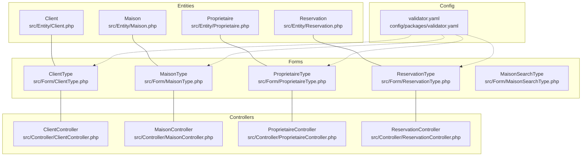
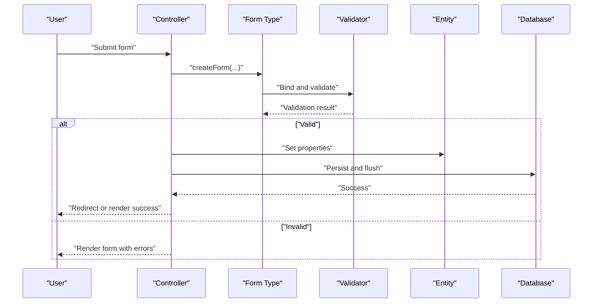
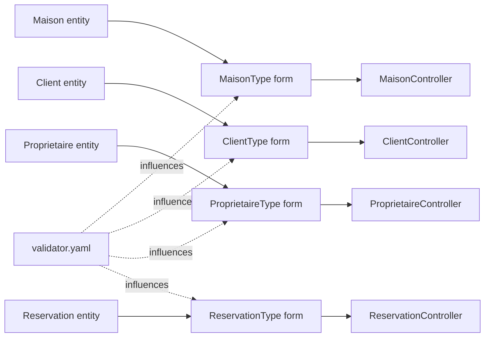

# Validation and Business Rules

<cite>
**Referenced Files in This Document**
- [Maison.php](file://src/Entity/Maison.php)
- [Client.php](file://src/Entity/Client.php)
- [Proprietaire.php](file://src/Entity/Proprietaire.php)
- [Reservation.php](file://src/Entity/Reservation.php)
- [MaisonType.php](file://src/Form/MaisonType.php)
- [ClientType.php](file://src/Form/ClientType.php)
- [ProprietaireType.php](file://src/Form/ProprietaireType.php)
- [ReservationType.php](file://src/Form/ReservationType.php)
- [MaisonSearchType.php](file://src/Form/MaisonSearchType.php)
- [validator.yaml](file://config/packages/validator.yaml)
- [RegistrationFormType.php](file://src/Form/RegistrationFormType.php)
- [ClientController.php](file://src/Controller/ClientController.php)
- [MaisonController.php](file://src/Controller/MaisonController.php)
- [ReservationController.php](file://src/Controller/ReservationController.php)
- [ProprietaireController.php](file://src/Controller/ProprietaireController.php)
- [client/_form.html.twig](file://templates/client/_form.html.twig)
- [ConstraintViolationException.php](file://vendor/doctrine/dbal/src/Exception/ConstraintViolationException.php)
- [NotNullConstraintViolationException.php](file://vendor/doctrine/dbal/src/Exception/NotNullConstraintViolationException.php)
- [UniqueConstraintViolationException.php](file://vendor/doctrine/dbal/src/Exception/UniqueConstraintViolationException.php)
- [ForeignKeyConstraintViolationException.php](file://vendor/doctrine/dbal/src/Exception/ForeignKeyConstraintViolationException.php)
</cite>

## Table of Contents
1. [Introduction](#introduction)
2. [Project Structure](#project-structure)
3. [Core Components](#core-components)
4. [Architecture Overview](#architecture-overview)
5. [Detailed Component Analysis](#detailed-component-analysis)
6. [Dependency Analysis](#dependency-analysis)
7. [Performance Considerations](#performance-considerations)
8. [Troubleshooting Guide](#troubleshooting-guide)
9. [Conclusion](#conclusion)
10. [Appendices](#appendices)

## Introduction
This document explains validation constraints and business rules embedded in the application’s database entities and forms. It covers:
- Field-level validation rules (length, data type, required fields)
- Business logic validations (positivity checks, date range validations, uniqueness constraints)
- Integration between Doctrine ORM annotations and Symfony Form types
- Custom validation constraints and their implementation
- Validation error handling and user feedback mechanisms
- Data integrity enforced at the database level versus application level
- Guidance for extending validation rules and adding new business constraints

## Project Structure
The validation system spans three layers:
- Entities define schema-level constraints via Doctrine ORM annotations
- Forms define UI-level constraints and bind user input to entities
- Controllers orchestrate validation, persistence, and error feedback

**Diagram sources**
- [Maison.php:1-118](file://src/Entity/Maison.php#L1-L118)
- [Client.php:1-71](file://src/Entity/Client.php#L1-L71)
- [Proprietaire.php:1-70](file://src/Entity/Proprietaire.php#L1-L70)
- [Reservation.php:1-100](file://src/Entity/Reservation.php#L1-L100)
- [MaisonType.php:1-36](file://src/Form/MaisonType.php#L1-L36)
- [ClientType.php:1-28](file://src/Form/ClientType.php#L1-L28)
- [ProprietaireType.php:1-28](file://src/Form/ProprietaireType.php#L1-L28)
- [ReservationType.php:1-50](file://src/Form/ReservationType.php#L1-L50)
- [MaisonSearchType.php:1-33](file://src/Form/MaisonSearchType.php#L1-L33)
- [validator.yaml:1-12](file://config/packages/validator.yaml#L1-L12)
- [ClientController.php:1-82](file://src/Controller/ClientController.php#L1-L82)
- [MaisonController.php:1-82](file://src/Controller/MaisonController.php#L1-L82)
- [ProprietaireController.php:1-82](file://src/Controller/ProprietaireController.php#L1-L82)
- [ReservationController.php:1-82](file://src/Controller/ReservationController.php#L1-L82)

**Section sources**
- [Maison.php:1-118](file://src/Entity/Maison.php#L1-L118)
- [Client.php:1-71](file://src/Entity/Client.php#L1-L71)
- [Proprietaire.php:1-70](file://src/Entity/Proprietaire.php#L1-L70)
- [Reservation.php:1-100](file://src/Entity/Reservation.php#L1-L100)
- [MaisonType.php:1-36](file://src/Form/MaisonType.php#L1-L36)
- [ClientType.php:1-28](file://src/Form/ClientType.php#L1-L28)
- [ProprietaireType.php:1-28](file://src/Form/ProprietaireType.php#L1-L28)
- [ReservationType.php:1-50](file://src/Form/ReservationType.php#L1-L50)
- [MaisonSearchType.php:1-33](file://src/Form/MaisonSearchType.php#L1-L33)
- [validator.yaml:1-12](file://config/packages/validator.yaml#L1-L12)

## Core Components
This section documents field-level and business rules present in entities and forms, and how they integrate with Symfony validation.

- Entities and schema-level constraints
  - String-length limits are defined via ORM column annotations (e.g., length constraints on textual fields)
  - Numeric and date-time fields are typed accordingly
  - Required fields are indicated by non-nullable columns or explicit constraints
  - Foreign keys enforce referential integrity at the database level

- Forms and UI-level constraints
  - Form types map to entity fields and rely on Symfony’s validation pipeline
  - Some forms explicitly add constraints (e.g., checkbox agreement, password length)
  - Optional filters (e.g., search form) disable CSRF and use GET method

- Validation configuration
  - The validator configuration enables attributes-based validation and can auto-map constraints from Doctrine metadata
  - Test environment disables compromised password checks

- Controllers and validation lifecycle
  - Controllers create forms, handle submissions, and persist validated entities
  - On invalid submissions, errors are propagated to templates for user feedback

**Section sources**
- [Maison.php:17-34](file://src/Entity/Maison.php#L17-L34)
- [Client.php:16-23](file://src/Entity/Client.php#L16-L23)
- [Proprietaire.php:16-23](file://src/Entity/Proprietaire.php#L16-L23)
- [Reservation.php:25-32](file://src/Entity/Reservation.php#L25-L32)
- [MaisonType.php:14-26](file://src/Form/MaisonType.php#L14-L26)
- [ClientType.php:12-18](file://src/Form/ClientType.php#L12-L18)
- [ProprietaireType.php:12-18](file://src/Form/ProprietaireType.php#L12-L18)
- [ReservationType.php:16-40](file://src/Form/ReservationType.php#L16-L40)
- [MaisonSearchType.php:14-32](file://src/Form/MaisonSearchType.php#L14-L32)
- [validator.yaml:1-12](file://config/packages/validator.yaml#L1-L12)
- [ClientController.php:25-42](file://src/Controller/ClientController.php#L25-L42)
- [MaisonController.php:25-42](file://src/Controller/MaisonController.php#L25-L42)
- [ReservationController.php:25-42](file://src/Controller/ReservationController.php#L25-L42)
- [ProprietaireController.php:25-42](file://src/Controller/ProprietaireController.php#L25-L42)

## Architecture Overview
The validation flow integrates Symfony Form, Validator, and Doctrine ORM:

**Diagram sources**
- [ClientController.php:25-42](file://src/Controller/ClientController.php#L25-L42)
- [MaisonController.php:25-42](file://src/Controller/MaisonController.php#L25-L42)
- [ReservationController.php:25-42](file://src/Controller/ReservationController.php#L25-L42)
- [ProprietaireController.php:25-42](file://src/Controller/ProprietaireController.php#L25-L42)
- [MaisonType.php:14-26](file://src/Form/MaisonType.php#L14-L26)
- [ClientType.php:12-18](file://src/Form/ClientType.php#L12-L18)
- [ProprietaireType.php:12-18](file://src/Form/ProprietaireType.php#L12-L18)
- [ReservationType.php:16-40](file://src/Form/ReservationType.php#L16-L40)

## Detailed Component Analysis

### Entities: Field-Level Constraints and Business Rules
- String length constraints
  - Title, description, city, image, name, surname, phone, and email fields specify length limits via ORM annotations
- Data type constraints
  - Price is numeric; date fields are date/time types; boolean flags are mapped appropriately
- Required constraints
  - Non-nullable columns enforce presence at the database level
  - Foreign keys (e.g., property owner association) are declared as non-nullable, ensuring referential integrity
- Business rules
  - Price positivity: currently not enforced in the entity; should be added via a constraint
  - Date range validation (start before end): not enforced in the entity; should be added via a constraint
  - Uniqueness constraints: not defined as ORM unique constraints in the examined entities; consider adding where applicable

**Section sources**
- [Maison.php:17-34](file://src/Entity/Maison.php#L17-L34)
- [Client.php:16-23](file://src/Entity/Client.php#L16-L23)
- [Proprietaire.php:16-23](file://src/Entity/Proprietaire.php#L16-L23)
- [Reservation.php:25-32](file://src/Entity/Reservation.php#L25-L32)

### Forms: Integration with Symfony Validation
- Basic field mapping
  - Form types add fields that map to entity properties
- Explicit constraints
  - Registration form demonstrates adding constraints such as “must agree” and “password length”
- Search form specifics
  - Uses GET method and disables CSRF for filter forms

**Section sources**
- [MaisonType.php:14-26](file://src/Form/MaisonType.php#L14-L26)
- [ClientType.php:12-18](file://src/Form/ClientType.php#L12-L18)
- [ProprietaireType.php:12-18](file://src/Form/ProprietaireType.php#L12-L18)
- [ReservationType.php:16-40](file://src/Form/ReservationType.php#L16-L40)
- [MaisonSearchType.php:14-32](file://src/Form/MaisonSearchType.php#L14-L32)
- [RegistrationFormType.php:15-55](file://src/Form/RegistrationFormType.php#L15-L55)

### Controllers: Validation Lifecycle and Error Feedback
- Controllers create forms, handle submissions, and persist entities when valid
- On invalid submissions, the form remains bound with errors and is re-rendered
- Templates receive the form and render labels/widgets with associated error messages

```mermaid
flowchart TD
Start(["Controller action"]) --> CreateForm["Create form with data_class"]
CreateForm --> HandleRequest["Handle form request"]
HandleRequest --> IsSubmitted{"Is submitted?"}
IsSubmitted --> |No| RenderForm["Render form template"]
IsSubmitted --> |Yes| IsValid{"Is valid?"}
IsValid --> |Yes| Persist["Persist and flush"]
Persist --> Redirect["Redirect to index"]
IsValid --> |No| RenderFormWithErrors["Render form with validation errors"]
RenderForm --> End(["Exit"])
RenderFormWithErrors --> End
Redirect --> End
```

**Diagram sources**
- [ClientController.php:25-42](file://src/Controller/ClientController.php#L25-L42)
- [MaisonController.php:25-42](file://src/Controller/MaisonController.php#L25-L42)
- [ReservationController.php:25-42](file://src/Controller/ReservationController.php#L25-L42)
- [ProprietaireController.php:25-42](file://src/Controller/ProprietaireController.php#L25-L42)

**Section sources**
- [ClientController.php:25-42](file://src/Controller/ClientController.php#L25-L42)
- [MaisonController.php:25-42](file://src/Controller/MaisonController.php#L25-L42)
- [ReservationController.php:25-42](file://src/Controller/ReservationController.php#L25-L42)
- [ProprietaireController.php:25-42](file://src/Controller/ProprietaireController.php#L25-L42)
- [client/_form.html.twig:1-29](file://templates/client/_form.html.twig#L1-L29)

### Validation Configuration and Auto-Mapping
- Attributes-based validation is enabled
- Auto-mapping can infer constraints from Doctrine metadata
- Test environment disables compromised password checks

**Section sources**
- [validator.yaml:1-12](file://config/packages/validator.yaml#L1-L12)

## Dependency Analysis
The following diagram shows how entities, forms, controllers, and configuration interact:

**Diagram sources**
- [Maison.php:1-118](file://src/Entity/Maison.php#L1-L118)
- [Client.php:1-71](file://src/Entity/Client.php#L1-L71)
- [Proprietaire.php:1-70](file://src/Entity/Proprietaire.php#L1-L70)
- [Reservation.php:1-100](file://src/Entity/Reservation.php#L1-L100)
- [MaisonType.php:1-36](file://src/Form/MaisonType.php#L1-L36)
- [ClientType.php:1-28](file://src/Form/ClientType.php#L1-L28)
- [ProprietaireType.php:1-28](file://src/Form/ProprietaireType.php#L1-L28)
- [ReservationType.php:1-50](file://src/Form/ReservationType.php#L1-L50)
- [MaisonController.php:1-82](file://src/Controller/MaisonController.php#L1-L82)
- [ClientController.php:1-82](file://src/Controller/ClientController.php#L1-L82)
- [ProprietaireController.php:1-82](file://src/Controller/ProprietaireController.php#L1-L82)
- [ReservationController.php:1-82](file://src/Controller/ReservationController.php#L1-L82)
- [validator.yaml:1-12](file://config/packages/validator.yaml#L1-L12)

**Section sources**
- [Maison.php:1-118](file://src/Entity/Maison.php#L1-L118)
- [Client.php:1-71](file://src/Entity/Client.php#L1-L71)
- [Proprietaire.php:1-70](file://src/Entity/Proprietaire.php#L1-L70)
- [Reservation.php:1-100](file://src/Entity/Reservation.php#L1-L100)
- [MaisonType.php:1-36](file://src/Form/MaisonType.php#L1-L36)
- [ClientType.php:1-28](file://src/Form/ClientType.php#L1-L28)
- [ProprietaireType.php:1-28](file://src/Form/ProprietaireType.php#L1-L28)
- [ReservationType.php:1-50](file://src/Form/ReservationType.php#L1-L50)
- [MaisonController.php:1-82](file://src/Controller/MaisonController.php#L1-L82)
- [ClientController.php:1-82](file://src/Controller/ClientController.php#L1-L82)
- [ProprietaireController.php:1-82](file://src/Controller/ProprietaireController.php#L1-L82)
- [ReservationController.php:1-82](file://src/Controller/ReservationController.php#L1-L82)
- [validator.yaml:1-12](file://config/packages/validator.yaml#L1-L12)

## Performance Considerations
- Keep validation logic lightweight; avoid heavy computations inside constraints
- Prefer server-side validation for critical business rules (e.g., price positivity, date ranges)
- Use database constraints to prevent inconsistent data at rest
- Leverage form-level constraints to reduce round-trips and improve UX

## Troubleshooting Guide
Common validation and integrity issues and how to address them:

- Constraint violation exceptions
  - NotNullConstraintViolationException: indicates missing required values
  - UniqueConstraintViolationException: indicates duplicate unique values
  - ForeignKeyConstraintViolationException: indicates invalid foreign key references
  - General ConstraintViolationException: generic integrity violations

- Handling in controllers
  - When validation fails, the form remains bound with errors; controllers render the form again
  - Templates display labels and widgets with associated error messages

- Recommendations
  - Add explicit business rule constraints to entities or forms for clarity
  - Provide user-friendly messages for common violations
  - Log validation failures for diagnostics

**Section sources**
- [ConstraintViolationException.php](file://vendor/doctrine/dbal/src/Exception/ConstraintViolationException.php)
- [NotNullConstraintViolationException.php](file://vendor/doctrine/dbal/src/Exception/NotNullConstraintViolationException.php)
- [UniqueConstraintViolationException.php](file://vendor/doctrine/dbal/src/Exception/UniqueConstraintViolationException.php)
- [ForeignKeyConstraintViolationException.php](file://vendor/doctrine/dbal/src/Exception/ForeignKeyConstraintViolationException.php)
- [ClientController.php:25-42](file://src/Controller/ClientController.php#L25-L42)
- [MaisonController.php:25-42](file://src/Controller/MaisonController.php#L25-L42)
- [ReservationController.php:25-42](file://src/Controller/ReservationController.php#L25-L42)
- [ProprietaireController.php:25-42](file://src/Controller/ProprietaireController.php#L25-L42)
- [client/_form.html.twig:1-29](file://templates/client/_form.html.twig#L1-L29)

## Conclusion
The application enforces validation primarily through:
- Doctrine ORM annotations for schema-level constraints
- Symfony Form types for UI-level binding and validation
- Controller actions that gate persistence on validation success
- Database-level integrity via non-nulls, foreign keys, and unique constraints

To strengthen the system:
- Add explicit business rule constraints (e.g., price positivity, date range checks)
- Define uniqueness constraints where appropriate
- Extend validators and forms to surface actionable user feedback
- Maintain consistency by aligning application-level and database-level rules

## Appendices

### Field-Level Validation Summary
- String fields with length limits:
  - Title, description, city, image, name, surname, phone, email
- Numeric and temporal fields:
  - Price (numeric), date fields (date/time), boolean flags
- Required fields:
  - Non-nullable columns and foreign keys

**Section sources**
- [Maison.php:17-34](file://src/Entity/Maison.php#L17-L34)
- [Client.php:16-23](file://src/Entity/Client.php#L16-L23)
- [Proprietaire.php:16-23](file://src/Entity/Proprietaire.php#L16-L23)
- [Reservation.php:25-32](file://src/Entity/Reservation.php#L25-L32)

### Business Rule Constraints to Implement
- Price positivity: add a constraint to ensure non-negative prices
- Date range validation: ensure start date precedes end date
- Uniqueness constraints: add unique indices for fields requiring uniqueness (e.g., email)
- Cross-field validation: ensure foreign key relationships remain valid after edits

**Section sources**
- [Maison.php:24-24](file://src/Entity/Maison.php#L24-L24)
- [Reservation.php:64-86](file://src/Entity/Reservation.php#L64-L86)

### Extending Validation Rules
- Add custom constraints to entities or forms as needed
- Use form-level constraints for user-facing rules
- Rely on Doctrine constraints for schema-level guarantees
- Keep messages localized and user-friendly

**Section sources**
- [RegistrationFormType.php:15-55](file://src/Form/RegistrationFormType.php#L15-L55)
- [validator.yaml:1-12](file://config/packages/validator.yaml#L1-L12)