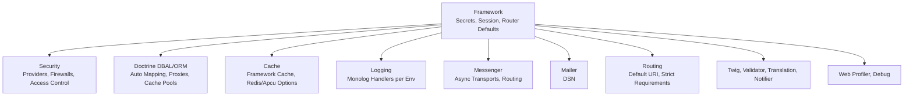
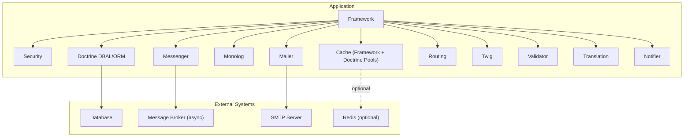
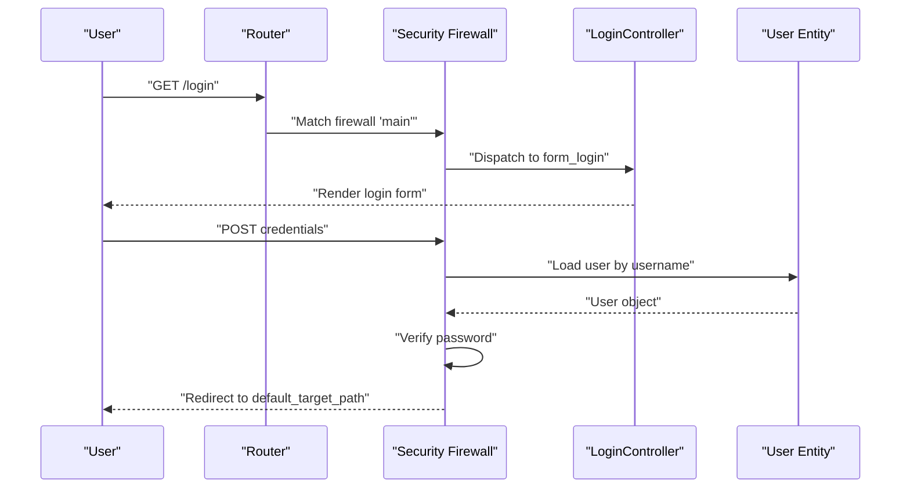
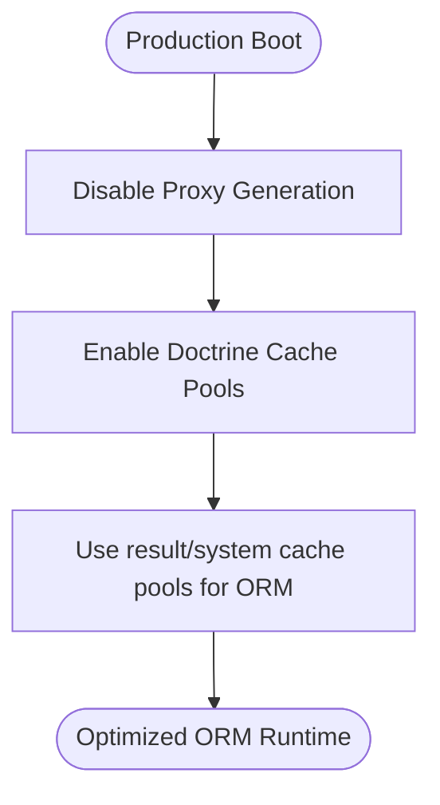
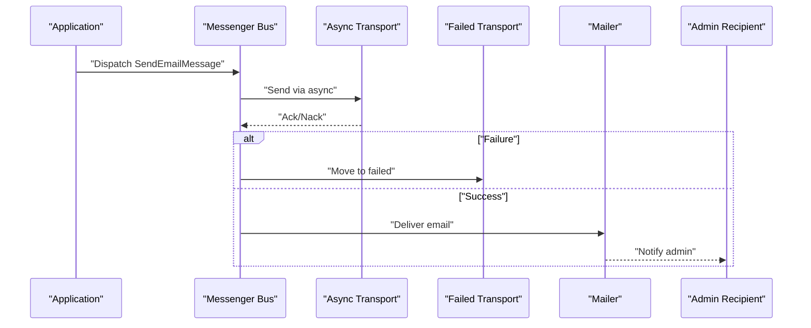
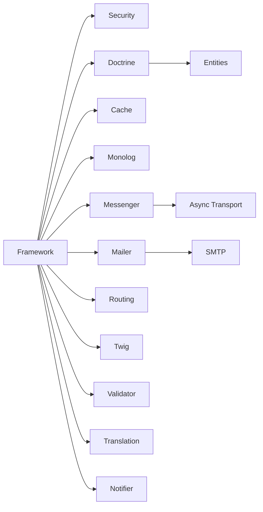

# Deployment and Production

<cite>
**Referenced Files in This Document**
- [composer.json](file://composer.json)
- [framework.yaml](file://config/packages/framework.yaml)
- [security.yaml](file://config/packages/security.yaml)
- [doctrine.yaml](file://config/packages/doctrine.yaml)
- [cache.yaml](file://config/packages/cache.yaml)
- [monolog.yaml](file://config/packages/monolog.yaml)
- [messenger.yaml](file://config/packages/messenger.yaml)
- [mailer.yaml](file://config/packages/mailer.yaml)
- [routing.yaml](file://config/packages/routing.yaml)
- [twig.yaml](file://config/packages/twig.yaml)
- [validator.yaml](file://config/packages/validator.yaml)
- [translation.yaml](file://config/packages/translation.yaml)
- [notifier.yaml](file://config/packages/notifier.yaml)
- [web_profiler.yaml](file://config/packages/web_profiler.yaml)
- [debug.yaml](file://config/packages/debug.yaml)
</cite>

## Table of Contents
1. [Introduction](#introduction)
2. [Project Structure](#project-structure)
3. [Core Components](#core-components)
4. [Architecture Overview](#architecture-overview)
5. [Detailed Component Analysis](#detailed-component-analysis)
6. [Dependency Analysis](#dependency-analysis)
7. [Performance Considerations](#performance-considerations)
8. [Troubleshooting Guide](#troubleshooting-guide)
9. [Conclusion](#conclusion)
10. [Appendices](#appendices)

## Introduction
This document provides comprehensive deployment and production guidance for the project. It covers environment configuration, security hardening, performance optimization, database tuning, caching strategies, asset compilation, logging and monitoring, error reporting, deployment automation, CI/CD pipeline setup, rollback procedures, SSL and access control, backups and disaster recovery, maintenance procedures, deployment checklists, performance benchmarks, and production troubleshooting.

## Project Structure
The project is a Symfony 7.4 application configured via YAML package configurations under config/packages. Key areas include:
- Framework and environment secrets
- Security (authentication, authorization, access control)
- Database (Doctrine DBAL/ORM)
- Caching (framework cache and Doctrine cache pools)
- Logging (Monolog handlers per environment)
- Message transport (Messenger with async and failed queues)
- Mailer configuration
- Routing defaults and strictness
- Twig, Validator, Translation, Notifier, Web Profiler, and Debug settings

**Section sources**
- [framework.yaml:1-16](file://config/packages/framework.yaml#L1-L16)
- [security.yaml:1-55](file://config/packages/security.yaml#L1-L55)
- [doctrine.yaml:1-55](file://config/packages/doctrine.yaml#L1-L55)
- [cache.yaml:1-20](file://config/packages/cache.yaml#L1-L20)
- [monolog.yaml:1-56](file://config/packages/monolog.yaml#L1-L56)
- [messenger.yaml:1-27](file://config/packages/messenger.yaml#L1-L27)
- [mailer.yaml:1-4](file://config/packages/mailer.yaml#L1-L4)
- [routing.yaml:1-11](file://config/packages/routing.yaml#L1-L11)
- [twig.yaml:1-7](file://config/packages/twig.yaml#L1-L7)
- [validator.yaml:1-12](file://config/packages/validator.yaml#L1-L12)
- [translation.yaml:1-6](file://config/packages/translation.yaml#L1-L6)
- [notifier.yaml:1-13](file://config/packages/notifier.yaml#L1-L13)
- [web_profiler.yaml:1-14](file://config/packages/web_profiler.yaml#L1-L14)
- [debug.yaml:1-6](file://config/packages/debug.yaml#L1-L6)

## Core Components
- Environment and Secrets
  - Secret seed for sessions and CSRF protection is loaded from APP_SECRET.
  - Session handling is enabled and lazy firewall is configured.
- Security Hardening
  - Password hashers configured for the User entity.
  - Provider uses the User entity and username property.
  - Main firewall supports form_login and logout with redirect targets.
  - Access control defines roles for admin and general paths.
- Database and ORM
  - DBAL URL from DATABASE_URL environment variable.
  - ORM auto-mapping for App\Entity with attribute-based mapping.
  - Production disables proxy generation and enables cache pools for queries and results.
- Caching
  - Framework cache defaults to filesystem; Redis and APCu options are available.
  - Doctrine-specific cache pools are configured in production.
- Logging
  - Dev/test/prod handlers configured with appropriate levels and channels.
  - JSON formatter used for stderr streams in production.
- Messenger
  - Async transport configured via MESSENGER_TRANSPORT_DSN.
  - Retry strategy with exponential backoff.
  - Routing for mailer and notifier messages.
- Mailer
  - DSN configured via MAILER_DSN environment variable.
- Routing
  - Default URI from DEFAULT_URI environment variable.
  - Strict requirements enabled in production.
- Twig, Validator, Translation, Notifier
  - Twig file pattern, strict variables in test.
  - Validation auto-mapping and compromised password checks in test.
  - Translation default locale and providers.
  - Notifier channels and admin recipients.
- Web Profiler and Debug
  - Dev-only profiler and dump destination.

**Section sources**
- [framework.yaml:1-16](file://config/packages/framework.yaml#L1-L16)
- [security.yaml:1-55](file://config/packages/security.yaml#L1-L55)
- [doctrine.yaml:1-55](file://config/packages/doctrine.yaml#L1-L55)
- [cache.yaml:1-20](file://config/packages/cache.yaml#L1-L20)
- [monolog.yaml:1-56](file://config/packages/monolog.yaml#L1-L56)
- [messenger.yaml:1-27](file://config/packages/messenger.yaml#L1-L27)
- [mailer.yaml:1-4](file://config/packages/mailer.yaml#L1-L4)
- [routing.yaml:1-11](file://config/packages/routing.yaml#L1-L11)
- [twig.yaml:1-7](file://config/packages/twig.yaml#L1-L7)
- [validator.yaml:1-12](file://config/packages/validator.yaml#L1-L12)
- [translation.yaml:1-6](file://config/packages/translation.yaml#L1-L6)
- [notifier.yaml:1-13](file://config/packages/notifier.yaml#L1-L13)
- [web_profiler.yaml:1-14](file://config/packages/web_profiler.yaml#L1-L14)
- [debug.yaml:1-6](file://config/packages/debug.yaml#L1-L6)

## Architecture Overview
Production runtime architecture integrates Symfony components with external systems.

**Diagram sources**
- [framework.yaml:1-16](file://config/packages/framework.yaml#L1-L16)
- [security.yaml:1-55](file://config/packages/security.yaml#L1-L55)
- [doctrine.yaml:1-55](file://config/packages/doctrine.yaml#L1-L55)
- [cache.yaml:1-20](file://config/packages/cache.yaml#L1-L20)
- [monolog.yaml:1-56](file://config/packages/monolog.yaml#L1-L56)
- [messenger.yaml:1-27](file://config/packages/messenger.yaml#L1-L27)
- [mailer.yaml:1-4](file://config/packages/mailer.yaml#L1-L4)
- [routing.yaml:1-11](file://config/packages/routing.yaml#L1-L11)
- [twig.yaml:1-7](file://config/packages/twig.yaml#L1-L7)
- [validator.yaml:1-12](file://config/packages/validator.yaml#L1-L12)
- [translation.yaml:1-6](file://config/packages/translation.yaml#L1-L6)
- [notifier.yaml:1-13](file://config/packages/notifier.yaml#L1-L13)

## Detailed Component Analysis

### Environment Configuration and Secrets
- Secrets
  - APP_SECRET is used for framework secret and session CSRF protection.
- Sessions
  - Enabled and lazy firewall is configured for main firewall.
- Router Defaults
  - DEFAULT_URI sets base URI for non-HTTP contexts.

**Section sources**
- [framework.yaml:1-16](file://config/packages/framework.yaml#L1-L16)
- [routing.yaml:1-11](file://config/packages/routing.yaml#L1-L11)

### Security Hardening
- Authentication
  - Form login with login_path, check_path, and default_target_path.
  - Logout path and target configured.
- Authorization
  - Access control rules define PUBLIC_ACCESS for login/register/forgot-password and ROLE_ADMIN for admin paths, with ROLE_USER for general paths.
- Password Hashing
  - Automatic algorithm for User entity.

**Diagram sources**
- [security.yaml:14-38](file://config/packages/security.yaml#L14-L38)

**Section sources**
- [security.yaml:1-55](file://config/packages/security.yaml#L1-L55)

### Database Optimization and ORM Tuning
- DBAL
  - DATABASE_URL via environment variable.
  - Savepoints enabled; profiling backtrace controlled by kernel debug.
- ORM
  - Attribute-based mapping for App\Entity.
  - Production disables proxy generation and enables cache pools for queries and results.
- Cache Pools
  - doctrine.result_cache_pool and doctrine.system_cache_pool configured in production.

**Diagram sources**
- [doctrine.yaml:36-55](file://config/packages/doctrine.yaml#L36-L55)

**Section sources**
- [doctrine.yaml:1-55](file://config/packages/doctrine.yaml#L1-L55)

### Caching Strategies
- Framework Cache
  - Default filesystem-backed cache; can be switched to Redis or APCu.
- Doctrine Cache Pools
  - Configured in production for system and result caches.
- Recommendations
  - Prefer Redis for shared cache across instances.
  - Use APCu for single-instance development or testing.

**Section sources**
- [cache.yaml:1-20](file://config/packages/cache.yaml#L1-L20)
- [doctrine.yaml:48-55](file://config/packages/doctrine.yaml#L48-L55)

### Asset Compilation for Production
- Assets are managed via AssetMapper and Importmap.
- Scripts install assets and importmap during post-install/update.
- Ensure build artifacts are served by the web server and cache-busted via AssetMapper.

**Section sources**
- [composer.json:88-99](file://composer.json#L88-L99)

### Logging Configuration and Monitoring
- Dev
  - Stream handler to log file with debug level; console handler with PSR filtering.
- Test
  - Buffered handler with nested stream; excludes specific channels.
- Prod
  - Fingers-crossed handler buffering up to buffer_size; nested stream to stderr with JSON formatter; separate deprecation channel to stderr with JSON formatter.
- Recommendations
  - Forward prod logs to centralized logging (e.g., syslog, filebeat, cloud logging).
  - Monitor error rate and latency; alert on elevated error counts.

**Section sources**
- [monolog.yaml:1-56](file://config/packages/monolog.yaml#L1-L56)

### Error Reporting and Notifications
- Notifier
  - Email-based policy for urgent/high/medium/low severity.
  - Admin recipients configured.
- Mailer
  - DSN configured via MAILER_DSN environment variable.
- Messenger
  - Async routing for SendEmailMessage and notifier messages; failed transport configured.

**Diagram sources**
- [messenger.yaml:1-27](file://config/packages/messenger.yaml#L1-L27)
- [mailer.yaml:1-4](file://config/packages/mailer.yaml#L1-L4)
- [notifier.yaml:1-13](file://config/packages/notifier.yaml#L1-L13)

**Section sources**
- [notifier.yaml:1-13](file://config/packages/notifier.yaml#L1-L13)
- [mailer.yaml:1-4](file://config/packages/mailer.yaml#L1-L4)
- [messenger.yaml:1-27](file://config/packages/messenger.yaml#L1-L27)

### Routing Defaults and Strictness
- Default URI for CLI and non-HTTP contexts.
- Strict requirements enabled in production to fail fast on invalid routes.

**Section sources**
- [routing.yaml:1-11](file://config/packages/routing.yaml#L1-L11)

### Twig, Validator, Translation
- Twig file pattern and strict variables in test.
- Validator auto-mapping and compromised password checks disabled in test.
- Translation default locale and providers path.

**Section sources**
- [twig.yaml:1-7](file://config/packages/twig.yaml#L1-L7)
- [validator.yaml:1-12](file://config/packages/validator.yaml#L1-L12)
- [translation.yaml:1-6](file://config/packages/translation.yaml#L1-L6)

### Web Profiler and Debug
- Dev-only profiler and dump destination for centralized VarDumper.

**Section sources**
- [web_profiler.yaml:1-14](file://config/packages/web_profiler.yaml#L1-L14)
- [debug.yaml:1-6](file://config/packages/debug.yaml#L1-L6)

## Dependency Analysis
Key internal dependencies and coupling:
- Framework depends on Security, Doctrine, Cache, Monolog, Messenger, Mailer, Routing, Twig, Validator, Translation, Notifier.
- Doctrine ORM depends on DBAL and Entity mappings.
- Messenger depends on async transport DSN and routing rules.
- Mailer depends on DSN and notifier routing.

**Diagram sources**
- [framework.yaml:1-16](file://config/packages/framework.yaml#L1-L16)
- [security.yaml:1-55](file://config/packages/security.yaml#L1-L55)
- [doctrine.yaml:1-55](file://config/packages/doctrine.yaml#L1-L55)
- [cache.yaml:1-20](file://config/packages/cache.yaml#L1-L20)
- [monolog.yaml:1-56](file://config/packages/monolog.yaml#L1-L56)
- [messenger.yaml:1-27](file://config/packages/messenger.yaml#L1-L27)
- [mailer.yaml:1-4](file://config/packages/mailer.yaml#L1-L4)
- [routing.yaml:1-11](file://config/packages/routing.yaml#L1-L11)
- [twig.yaml:1-7](file://config/packages/twig.yaml#L1-L7)
- [validator.yaml:1-12](file://config/packages/validator.yaml#L1-L12)
- [translation.yaml:1-6](file://config/packages/translation.yaml#L1-L6)
- [notifier.yaml:1-13](file://config/packages/notifier.yaml#L1-L13)

**Section sources**
- [framework.yaml:1-16](file://config/packages/framework.yaml#L1-L16)
- [security.yaml:1-55](file://config/packages/security.yaml#L1-L55)
- [doctrine.yaml:1-55](file://config/packages/doctrine.yaml#L1-L55)
- [cache.yaml:1-20](file://config/packages/cache.yaml#L1-L20)
- [monolog.yaml:1-56](file://config/packages/monolog.yaml#L1-L56)
- [messenger.yaml:1-27](file://config/packages/messenger.yaml#L1-L27)
- [mailer.yaml:1-4](file://config/packages/mailer.yaml#L1-L4)
- [routing.yaml:1-11](file://config/packages/routing.yaml#L1-L11)
- [twig.yaml:1-7](file://config/packages/twig.yaml#L1-L7)
- [validator.yaml:1-12](file://config/packages/validator.yaml#L1-L12)
- [translation.yaml:1-6](file://config/packages/translation.yaml#L1-L6)
- [notifier.yaml:1-13](file://config/packages/notifier.yaml#L1-L13)

## Performance Considerations
- Disable proxy generation in production for Doctrine ORM.
- Enable Doctrine result/system cache pools in production.
- Use Redis for shared cache across instances.
- Keep router strict requirements in production to avoid ambiguous routing overhead.
- Use JSON formatter for Monolog stderr streams in production for structured logging.
- Configure Messenger retry strategy with exponential backoff to reduce thundering herd on failures.
- Ensure assets are built and served with long-lived caching headers.

**Section sources**
- [doctrine.yaml:36-55](file://config/packages/doctrine.yaml#L36-L55)
- [cache.yaml:1-20](file://config/packages/cache.yaml#L1-L20)
- [routing.yaml:7-11](file://config/packages/routing.yaml#L7-L11)
- [monolog.yaml:32-56](file://config/packages/monolog.yaml#L32-L56)
- [messenger.yaml:9-12](file://config/packages/messenger.yaml#L9-L12)
- [composer.json:88-99](file://composer.json#L88-L99)

## Troubleshooting Guide
- Symptom: Unexpected redirects after login
  - Verify form_login login_path, check_path, and default_target_path.
- Symptom: Access denied errors
  - Review access_control rules and role assignments.
- Symptom: Slow ORM queries
  - Confirm cache pools are enabled in production and proxies are disabled.
- Symptom: Excessive memory usage in logs
  - Reduce buffer_size for fingers-crossed handler and ensure JSON formatter is used.
- Symptom: Emails not sent
  - Check MAILER_DSN and async transport DSN; review failed transport queue.
- Symptom: Asset 404 errors
  - Re-run asset installation and importmap scripts; confirm build artifacts are deployed.

**Section sources**
- [security.yaml:26-35](file://config/packages/security.yaml#L26-L35)
- [security.yaml:40-45](file://config/packages/security.yaml#L40-L45)
- [doctrine.yaml:36-55](file://config/packages/doctrine.yaml#L36-L55)
- [monolog.yaml:32-56](file://config/packages/monolog.yaml#L32-L56)
- [messenger.yaml:7-12](file://config/packages/messenger.yaml#L7-L12)
- [mailer.yaml:1-4](file://config/packages/mailer.yaml#L1-L4)
- [composer.json:88-99](file://composer.json#L88-L99)

## Conclusion
This guide consolidates production-ready configuration and operational practices for the Symfony application. By applying the outlined security hardening, performance optimizations, logging and monitoring setup, and deployment automation recommendations, teams can achieve a robust, scalable, and maintainable production environment.

## Appendices

### A. Environment Variables Reference
- APP_SECRET: Application secret for CSRF and session protection.
- DATABASE_URL: Database connection string.
- MESSENGER_TRANSPORT_DSN: Asynchronous message transport DSN.
- MAILER_DSN: Mailer transport DSN.
- DEFAULT_URI: Default URI for CLI and non-HTTP contexts.

**Section sources**
- [framework.yaml:3](file://config/packages/framework.yaml#L3)
- [doctrine.yaml:3](file://config/packages/doctrine.yaml#L3)
- [messenger.yaml:8](file://config/packages/messenger.yaml#L8)
- [mailer.yaml:3](file://config/packages/mailer.yaml#L3)
- [routing.yaml:5](file://config/packages/routing.yaml#L5)

### B. Deployment Checklist
- Build and deploy assets
  - Run asset installation and importmap scripts.
- Set environment variables
  - APP_SECRET, DATABASE_URL, MESSENGER_TRANSPORT_DSN, MAILER_DSN, DEFAULT_URI.
- Prepare database
  - Apply migrations and seed data if needed.
- Configure cache
  - Choose Redis or APCu; clear and warm caches.
- Configure logging
  - Set up stderr JSON logging and centralized log forwarding.
- Configure Messenger
  - Point async transport to broker; monitor failed queue.
- SSL and reverse proxy
  - Terminate TLS at reverse proxy; enforce HTTPS redirects.
- Access control
  - Enforce firewall rules and restrict dev profiler access.
- Health checks
  - Add readiness/liveness endpoints; monitor metrics.

**Section sources**
- [composer.json:88-99](file://composer.json#L88-L99)
- [doctrine.yaml:36-55](file://config/packages/doctrine.yaml#L36-L55)
- [cache.yaml:1-20](file://config/packages/cache.yaml#L1-L20)
- [monolog.yaml:32-56](file://config/packages/monolog.yaml#L32-L56)
- [messenger.yaml:7-12](file://config/packages/messenger.yaml#L7-L12)
- [security.yaml:14-38](file://config/packages/security.yaml#L14-L38)

### C. CI/CD Pipeline Setup
- Build stage
  - Install dependencies, compile assets, run tests.
- Deploy stage
  - Migrate database, warm cache, restart services.
- Rollback stage
  - Restore previous artifact, revert database to last known good migration.

[No sources needed since this section provides general guidance]

### D. Backup and Disaster Recovery
- Database
  - Schedule regular logical backups; test restore procedures.
- Filesystem
  - Back up uploads directory and cache directories.
- Configuration
  - Store environment variables in a secure secret manager; version control non-sensitive configs.

[No sources needed since this section provides general guidance]

### E. Maintenance Procedures
- Regular tasks
  - Clear cache, prune logs, rotate database backups.
- Capacity planning
  - Monitor cache hit rates, DB connection pool usage, and queue depths.

[No sources needed since this section provides general guidance]

### F. Performance Benchmarks
- Baseline metrics
  - Request latency, throughput, cache hit ratio, DB query time.
- Targets
  - Target p95 latency and cache hit ratios aligned with service level objectives.

[No sources needed since this section provides general guidance]