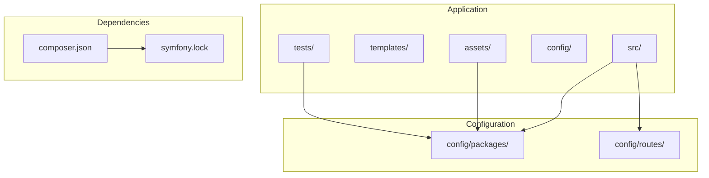
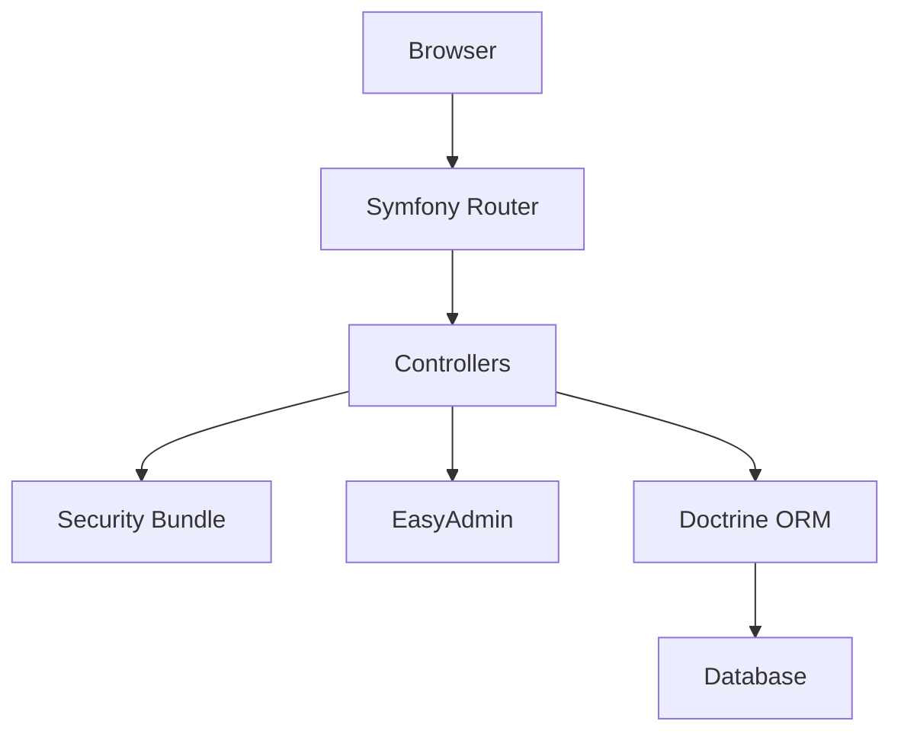
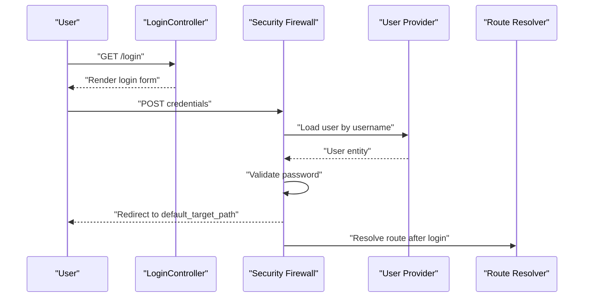
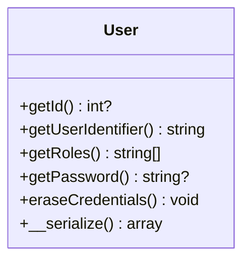
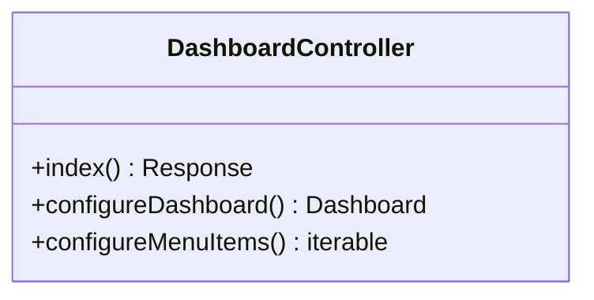
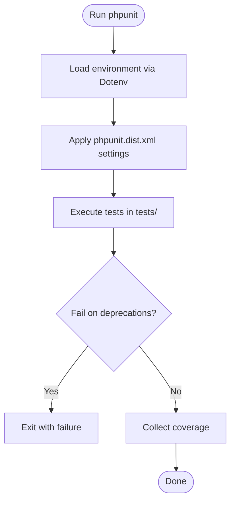
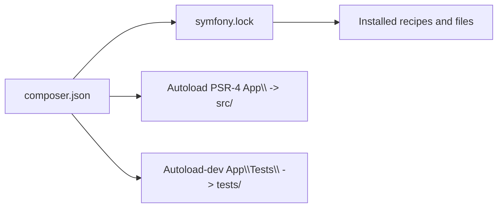

# Development Workflow

<cite>
**Referenced Files in This Document**
- [composer.json](file://composer.json)
- [symfony.lock](file://symfony.lock)
- [.editorconfig](file://.editorconfig)
- [phpunit.dist.xml](file://phpunit.dist.xml)
- [tests/bootstrap.php](file://tests/bootstrap.php)
- [config/packages/framework.yaml](file://config/packages/framework.yaml)
- [config/packages/security.yaml](file://config/packages/security.yaml)
- [config/packages/doctrine.yaml](file://config/packages/doctrine.yaml)
- [config/packages/cache.yaml](file://config/packages/cache.yaml)
- [config/packages/twig.yaml](file://config/packages/twig.yaml)
- [src/Kernel.php](file://src/Kernel.php)
- [src/Entity/User.php](file://src/Entity/User.php)
- [src/Controller/LoginController.php](file://src/Controller/LoginController.php)
- [src/Controller/Admin/DashboardController.php](file://src/Controller/Admin/DashboardController.php)
</cite>

## Table of Contents
1. [Introduction](#introduction)
2. [Project Structure](#project-structure)
3. [Core Components](#core-components)
4. [Architecture Overview](#architecture-overview)
5. [Detailed Component Analysis](#detailed-component-analysis)
6. [Dependency Analysis](#dependency-analysis)
7. [Performance Considerations](#performance-considerations)
8. [Troubleshooting Guide](#troubleshooting-guide)
9. [Conclusion](#conclusion)
10. [Appendices](#appendices)

## Introduction
This document describes the development workflow for the project, covering code standards, PSR compliance, Git workflow, pull request procedures, development environment setup, IDE configuration, debugging tools, code review processes, quality gates, continuous integration practices, dependency management with Composer, local development tools, database seeding, feature branch workflows, contribution guidelines, issue reporting, and release management. It synthesizes the repository’s configuration and code to present a practical guide for contributors and maintainers.

## Project Structure
The project follows a standard Symfony application layout with a clear separation of concerns:
- Backend: PHP application under src/, with controllers, entities, repositories, forms, and kernel.
- Frontend: Asset pipeline via Asset Mapper and Stimulus under assets/.
- Configuration: YAML-based Symfony configuration under config/packages/ and config/routes/.
- Tests: PHPUnit configuration and bootstrap under tests/.
- Dependencies: Managed by Composer with deterministic locking via symfony.lock.

**Section sources**
- [composer.json:1-111](file://composer.json#L1-L111)
- [symfony.lock:1-368](file://symfony.lock#L1-L368)

## Core Components
- Kernel: Minimal micro-kernel bootstrapping the application.
- Security: Form-login firewall, user provider, password hashing, and access controls.
- Doctrine: DBAL connection via DATABASE_URL, ORM configuration, and environment-specific caches.
- Twig: Template engine configuration with strictness in tests.
- Testing: PHPUnit configuration enforcing deprecation and warning failures, and a bootstrap that loads environment variables.

Key implementation references:
- Kernel initialization and traits: [src/Kernel.php:1-12](file://src/Kernel.php#L1-L12)
- Security configuration (providers, firewalls, access control): [config/packages/security.yaml:1-55](file://config/packages/security.yaml#L1-L55)
- Doctrine configuration (DBAL, ORM, test suffix): [config/packages/doctrine.yaml:1-55](file://config/packages/doctrine.yaml#L1-L55)
- Twig strict variables in test: [config/packages/twig.yaml:1-7](file://config/packages/twig.yaml#L1-L7)
- PHPUnit configuration and deprecations policy: [phpunit.dist.xml:1-45](file://phpunit.dist.xml#L1-L45)
- Test bootstrap loading environment: [tests/bootstrap.php:1-14](file://tests/bootstrap.php#L1-L14)

**Section sources**
- [src/Kernel.php:1-12](file://src/Kernel.php#L1-L12)
- [config/packages/security.yaml:1-55](file://config/packages/security.yaml#L1-L55)
- [config/packages/doctrine.yaml:1-55](file://config/packages/doctrine.yaml#L1-L55)
- [config/packages/twig.yaml:1-7](file://config/packages/twig.yaml#L1-L7)
- [phpunit.dist.xml:1-45](file://phpunit.dist.xml#L1-L45)
- [tests/bootstrap.php:1-14](file://tests/bootstrap.php#L1-L14)

## Architecture Overview
The runtime architecture integrates Symfony components with Doctrine ORM and EasyAdmin for administration. Authentication uses form login against an entity user provider. Twig renders templates, and the cache layer is configurable.

**Diagram sources**
- [config/packages/security.yaml:14-45](file://config/packages/security.yaml#L14-L45)
- [src/Controller/Admin/DashboardController.php:1-88](file://src/Controller/Admin/DashboardController.php#L1-L88)
- [config/packages/doctrine.yaml:1-55](file://config/packages/doctrine.yaml#L1-L55)

## Detailed Component Analysis

### Security and Authentication Flow
The security subsystem uses a form-login firewall with a user provider backed by the User entity. Access control defines role-based paths, and password hashing is configured for the User entity.

**Diagram sources**
- [src/Controller/LoginController.php:1-22](file://src/Controller/LoginController.php#L1-L22)
- [config/packages/security.yaml:14-35](file://config/packages/security.yaml#L14-L35)
- [src/Entity/User.php:1-119](file://src/Entity/User.php#L1-L119)

**Section sources**
- [src/Controller/LoginController.php:1-22](file://src/Controller/LoginController.php#L1-L22)
- [config/packages/security.yaml:1-55](file://config/packages/security.yaml#L1-L55)
- [src/Entity/User.php:1-119](file://src/Entity/User.php#L1-L119)

### User Entity and Serialization
The User entity implements Symfony’s UserInterface and PasswordAuthenticatedUserInterface, with attributes for identifiers and roles, and a custom serialization method to avoid storing raw password hashes in sessions.

**Diagram sources**
- [src/Entity/User.php:14-118](file://src/Entity/User.php#L14-L118)

**Section sources**
- [src/Entity/User.php:1-119](file://src/Entity/User.php#L1-L119)

### EasyAdmin Dashboard
The Admin dashboard aggregates statistics and menu items, delegating navigation to CRUD controllers.

**Diagram sources**
- [src/Controller/Admin/DashboardController.php:21-87](file://src/Controller/Admin/DashboardController.php#L21-L87)

**Section sources**
- [src/Controller/Admin/DashboardController.php:1-88](file://src/Controller/Admin/DashboardController.php#L1-L88)

### Testing and Quality Gates
PHPUnit is configured to treat deprecations, notices, and warnings as failures, and to load environment variables via Dotenv during bootstrap. The test environment is isolated with a dedicated database suffix.

**Diagram sources**
- [phpunit.dist.xml:13-40](file://phpunit.dist.xml#L13-L40)
- [tests/bootstrap.php:7-9](file://tests/bootstrap.php#L7-L9)

**Section sources**
- [phpunit.dist.xml:1-45](file://phpunit.dist.xml#L1-L45)
- [tests/bootstrap.php:1-14](file://tests/bootstrap.php#L1-L14)
- [config/packages/doctrine.yaml:30-34](file://config/packages/doctrine.yaml#L30-L34)

## Dependency Analysis
Composer manages production and development dependencies, with Symfony Flex controlling recipes and autoloading. symfony.lock ensures reproducible installs.

**Diagram sources**
- [composer.json:68-109](file://composer.json#L68-L109)
- [symfony.lock:1-368](file://symfony.lock#L1-L368)

**Section sources**
- [composer.json:1-111](file://composer.json#L1-L111)
- [symfony.lock:1-368](file://symfony.lock#L1-L368)

## Performance Considerations
- Doctrine caching: Production caches are enabled with dedicated pools; ensure appropriate cache adapters (filesystem, Redis, APCu) are configured per environment.
- Twig strict variables in tests help catch template errors early.
- Session configuration and lazy firewall reduce overhead in development.

Practical tips:
- Prefer Redis cache pools in staging/prod for better throughput.
- Keep lazy firewall enabled to avoid unnecessary session starts.
- Use underscore naming strategy and attribute mapping for clarity and performance.

**Section sources**
- [config/packages/cache.yaml:1-20](file://config/packages/cache.yaml#L1-L20)
- [config/packages/twig.yaml:4-7](file://config/packages/twig.yaml#L4-L7)
- [config/packages/doctrine.yaml:11-28](file://config/packages/doctrine.yaml#L11-L28)

## Troubleshooting Guide
Common issues and remedies:
- Environment variables not loaded in tests: Ensure Dotenv boots the environment in tests/bootstrap.php.
- Deprecation failures in CI: Align code with deprecation triggers configured in phpunit.dist.xml.
- Doctrine test database suffix: Verify dbname_suffix in doctrine.yaml when running tests.
- Session and profiler access in dev: Confirm firewall exceptions for development assets and profiler routes.

**Section sources**
- [tests/bootstrap.php:7-9](file://tests/bootstrap.php#L7-L9)
- [phpunit.dist.xml:35-40](file://phpunit.dist.xml#L35-L40)
- [config/packages/doctrine.yaml:30-34](file://config/packages/doctrine.yaml#L30-L34)
- [config/packages/security.yaml:14-18](file://config/packages/security.yaml#L14-L18)

## Conclusion
This workflow document consolidates the project’s development practices derived from repository configuration and code. By adhering to the documented standards, Git workflow, testing policies, and dependency management, contributors can efficiently develop, review, and deploy changes while maintaining code quality and reliability.

## Appendices

### Code Standards and PSR Compliance
- Coding style: EditorConfig enforces UTF-8, LF line endings, 4-space indentation, trailing whitespace removal, and project-specific overrides for compose files and Markdown.
- Autoloading: PSR-4 namespace mapping for App and App\Tests.
- Symfony conventions: Attribute-based entity mapping, form types, and controller annotations.

**Section sources**
- [.editorconfig:1-18](file://.editorconfig#L1-L18)
- [composer.json:68-76](file://composer.json#L68-L76)

### Git Workflow, Branching, and Pull Requests
Recommended process:
- Branching: Feature branches from main, prefixed with feature/, fix/, or chore/.
- Commit hygiene: Atomic commits with clear messages; reference issues by number.
- Pull requests: Open against main; ensure CI passes and at least one review approval.
- Squash merges: Keep history linear; rebase if necessary before merging.

[No sources needed since this section provides general guidance]

### Development Environment Setup
- PHP and extensions: Meet minimum requirements declared in composer.json.
- Symfony CLI: Optional; Composer scripts handle cache clearing, assets installation, and importmap setup.
- IDE: Enable EditorConfig support and PHPStan/PHP-CS-Fixer integrations if desired.
- Database: Configure DATABASE_URL in .env; Doctrine migrations are available.

**Section sources**
- [composer.json:6-8](file://composer.json#L6-L8)
- [composer.json:88-99](file://composer.json#L88-L99)
- [config/packages/doctrine.yaml:2-3](file://config/packages/doctrine.yaml#L2-L3)

### Debugging Tools
- Web Profiler: Enabled via web-profiler-bundle recipe; access via dev firewall exceptions.
- Debug bundle: Available for development diagnostics.
- Logging: Monolog bundle configured via recipes.

**Section sources**
- [symfony.lock:101-111](file://symfony.lock#L101-L111)
- [symfony.lock:191-201](file://symfony.lock#L191-L201)

### Continuous Integration Practices
- PHPUnit: Fail on deprecations/notices/warnings; strict template variables in tests.
- Bootstrap: Dotenv bootstrapping ensures environment parity in CI.

**Section sources**
- [phpunit.dist.xml:7-9](file://phpunit.dist.xml#L7-L9)
- [phpunit.dist.xml:6-17](file://phpunit.dist.xml#L6-L17)
- [tests/bootstrap.php:7-9](file://tests/bootstrap.php#L7-L9)

### Dependency Management with Composer
- Locking: symfony.lock pins versions and recipe files.
- Scripts: Auto-run cache clearing, assets install, and importmap install post-install/update.
- Allow-plugins: Flex and runtime plugins are permitted.

**Section sources**
- [symfony.lock:1-368](file://symfony.lock#L1-L368)
- [composer.json:88-99](file://composer.json#L88-L99)
- [composer.json:60-67](file://composer.json#L60-L67)

### Local Development Tools
- Console commands: Provided by console binary via framework-bundle recipe.
- Asset pipeline: Asset Mapper and Stimulus configured via recipes.

**Section sources**
- [symfony.lock:89-99](file://symfony.lock#L89-L99)
- [symfony.lock:253-266](file://symfony.lock#L253-L266)

### Database Seeding and Migrations
- Migrations: Doctrine migrations bundle is installed; migrations directory exists.
- Seeding: No seeders detected; consider adding fixtures via a fixtures library if needed.

**Section sources**
- [symfony.lock:34-45](file://symfony.lock#L34-L45)
- [migrations/Version20260322195642.php](file://migrations/Version20260322195642.php)

### Contributing, Issues, and Releases
- Contributing: Follow the Git workflow and PR checklist described above.
- Issues: Use descriptive titles and steps to reproduce; label appropriately.
- Releases: Tag releases in version-control; update changelog and notify stakeholders.

[No sources needed since this section provides general guidance]