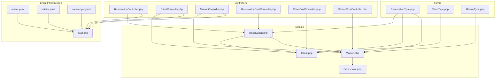
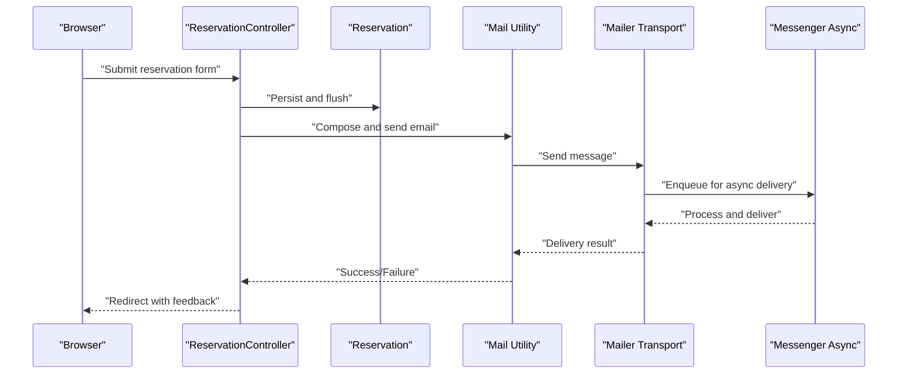
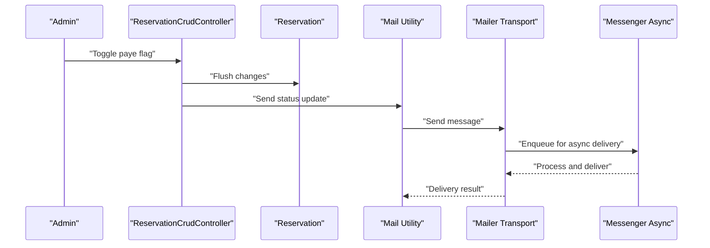
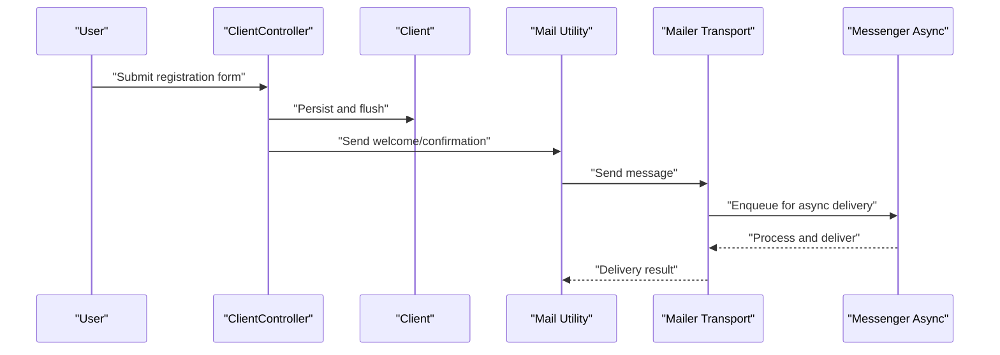
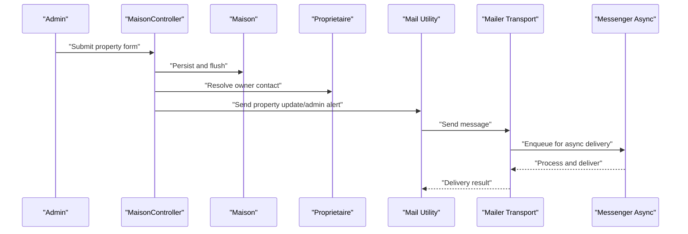
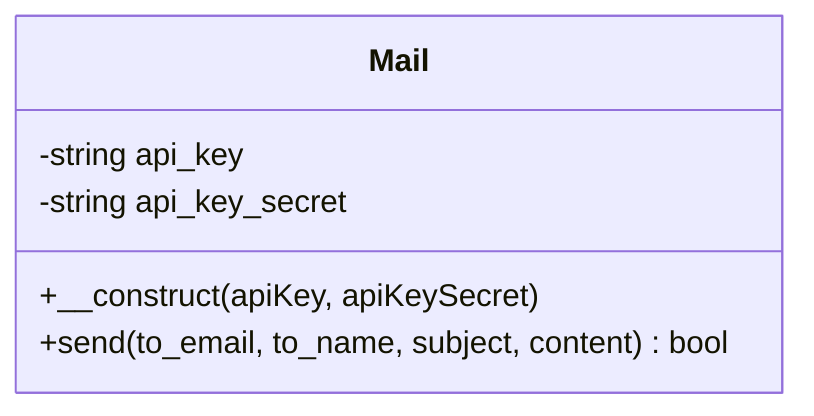
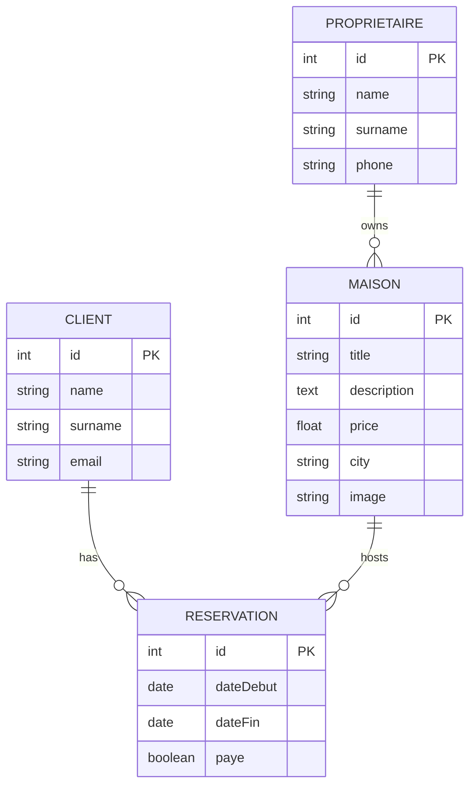
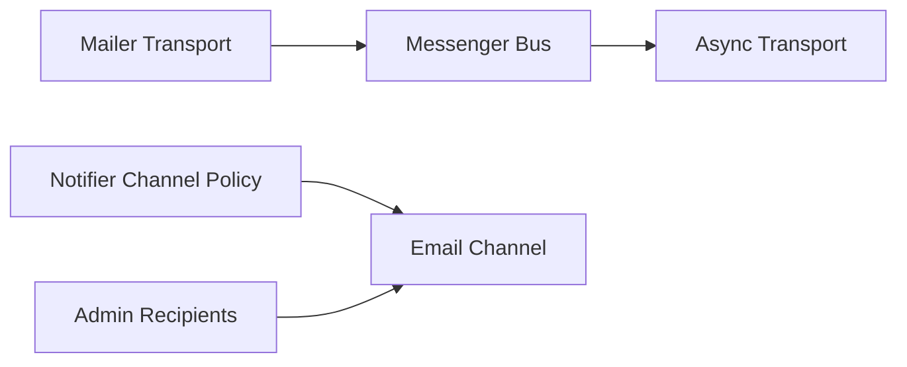

# Automated Notification Triggers

<cite>
**Referenced Files in This Document**
- [Mail.php](file://src/Classe/Mail.php)
- [mailer.yaml](file://config/packages/mailer.yaml)
- [notifier.yaml](file://config/packages/notifier.yaml)
- [messenger.yaml](file://config/packages/messenger.yaml)
- [ReservationController.php](file://src/Controller/ReservationController.php)
- [ClientController.php](file://src/Controller/ClientController.php)
- [MaisonController.php](file://src/Controller/MaisonController.php)
- [ReservationCrudController.php](file://src/Controller/Admin/ReservationCrudController.php)
- [ClientCrudController.php](file://src/Controller/Admin/ClientCrudController.php)
- [MaisonCrudController.php](file://src/Controller/Admin/MaisonCrudController.php)
- [Reservation.php](file://src/Entity/Reservation.php)
- [Client.php](file://src/Entity/Client.php)
- [Maison.php](file://src/Entity/Maison.php)
- [Proprietaire.php](file://src/Entity/Proprietaire.php)
- [ReservationType.php](file://src/Form/ReservationType.php)
- [ClientType.php](file://src/Form/ClientType.php)
- [MaisonType.php](file://src/Form/MaisonType.php)
</cite>

## Table of Contents
1. [Introduction](#introduction)
2. [Project Structure](#project-structure)
3. [Core Components](#core-components)
4. [Architecture Overview](#architecture-overview)
5. [Detailed Component Analysis](#detailed-component-analysis)
6. [Dependency Analysis](#dependency-analysis)
7. [Performance Considerations](#performance-considerations)
8. [Troubleshooting Guide](#troubleshooting-guide)
9. [Conclusion](#conclusion)

## Introduction
This document describes the automated email notification triggers implemented across the application. It focuses on reservation confirmation emails, cancellation notifications, and status update messages. It also documents trigger points in the reservation workflow, client registration process, and property management actions, along with the integration between business logic and email dispatch. Conditional logic and user preferences are addressed, including notification timing, recipient determination, content personalization, queuing, batch processing, and delivery scheduling. Administrative email alerts and system notification mechanisms are included.

## Project Structure
The notification system spans several layers:
- Business logic controllers for reservations, clients, and properties
- Domain entities for reservations, clients, properties, and owners
- Forms for data entry and updates
- Email infrastructure via a dedicated mail utility class and framework configuration
- Asynchronous messaging and notifier channels for delivery orchestration

**Diagram sources**
- [ReservationController.php:1-82](file://src/Controller/ReservationController.php#L1-L82)
- [ClientController.php:1-82](file://src/Controller/ClientController.php#L1-L82)
- [MaisonController.php:1-82](file://src/Controller/MaisonController.php#L1-L82)
- [ReservationCrudController.php:1-46](file://src/Controller/Admin/ReservationCrudController.php#L1-L46)
- [ClientCrudController.php:1-42](file://src/Controller/Admin/ClientCrudController.php#L1-L42)
- [MaisonCrudController.php:1-51](file://src/Controller/Admin/MaisonCrudController.php#L1-L51)
- [Reservation.php:1-100](file://src/Entity/Reservation.php#L1-L100)
- [Client.php:1-71](file://src/Entity/Client.php#L1-L71)
- [Maison.php:1-118](file://src/Entity/Maison.php#L1-L118)
- [Proprietaire.php:1-70](file://src/Entity/Proprietaire.php#L1-L70)
- [ReservationType.php:1-50](file://src/Form/ReservationType.php#L1-L50)
- [ClientType.php:1-28](file://src/Form/ClientType.php#L1-L28)
- [MaisonType.php:1-36](file://src/Form/MaisonType.php#L1-L36)
- [Mail.php:1-48](file://src/Classe/Mail.php#L1-L48)
- [mailer.yaml:1-4](file://config/packages/mailer.yaml#L1-L4)
- [notifier.yaml:1-13](file://config/packages/notifier.yaml#L1-L13)
- [messenger.yaml:1-27](file://config/packages/messenger.yaml#L1-L27)

**Section sources**
- [ReservationController.php:1-82](file://src/Controller/ReservationController.php#L1-L82)
- [ClientController.php:1-82](file://src/Controller/ClientController.php#L1-L82)
- [MaisonController.php:1-82](file://src/Controller/MaisonController.php#L1-L82)
- [Reservation.php:1-100](file://src/Entity/Reservation.php#L1-L100)
- [Client.php:1-71](file://src/Entity/Client.php#L1-L71)
- [Maison.php:1-118](file://src/Entity/Maison.php#L1-L118)
- [Mail.php:1-48](file://src/Classe/Mail.php#L1-L48)
- [mailer.yaml:1-4](file://config/packages/mailer.yaml#L1-L4)
- [notifier.yaml:1-13](file://config/packages/notifier.yaml#L1-L13)
- [messenger.yaml:1-27](file://config/packages/messenger.yaml#L1-L27)

## Core Components
- Mail utility: encapsulates sending logic using a third-party provider with a predefined template and sender identity.
- Controllers: handle CRUD operations and serve as trigger points for notifications.
- Entities: define recipients and context for personalized content.
- Forms: capture user input that may influence notification content.
- Notifier and Messenger: configure asynchronous delivery and channel policies.

Key responsibilities:
- Trigger points: creation, update, and deletion of reservations; creation and updates of clients and properties.
- Recipients: client email from the reservation’s client association; owner contact information from the associated property.
- Content personalization: reservation dates, property details, payment status, and owner name.
- Delivery: asynchronous queueing via Messenger and channel policy via Notifier.

**Section sources**
- [Mail.php:1-48](file://src/Classe/Mail.php#L1-L48)
- [ReservationController.php:1-82](file://src/Controller/ReservationController.php#L1-L82)
- [ClientController.php:1-82](file://src/Controller/ClientController.php#L1-L82)
- [MaisonController.php:1-82](file://src/Controller/MaisonController.php#L1-L82)
- [Reservation.php:1-100](file://src/Entity/Reservation.php#L1-L100)
- [Client.php:1-71](file://src/Entity/Client.php#L1-L71)
- [Maison.php:1-118](file://src/Entity/Maison.php#L1-L118)
- [Proprietaire.php:1-70](file://src/Entity/Proprietaire.php#L1-L70)
- [notifier.yaml:1-13](file://config/packages/notifier.yaml#L1-L13)
- [messenger.yaml:1-27](file://config/packages/messenger.yaml#L1-L27)

## Architecture Overview
The notification pipeline integrates business logic with asynchronous delivery:
- Controllers persist domain changes and invoke email dispatch.
- The mail utility composes and sends messages using a configured transport.
- Messenger routes email messages to an asynchronous transport for reliable delivery.
- Notifier defines channel policies and admin recipients for system alerts.

**Diagram sources**
- [ReservationController.php:25-43](file://src/Controller/ReservationController.php#L25-L43)
- [Mail.php:19-46](file://src/Classe/Mail.php#L19-L46)
- [mailer.yaml:1-4](file://config/packages/mailer.yaml#L1-L4)
- [messenger.yaml:20-23](file://config/packages/messenger.yaml#L20-L23)

## Detailed Component Analysis

### Reservation Workflow Notifications
Reservation lifecycle events are suitable triggers for automated emails:
- Confirmation: upon successful creation of a reservation.
- Cancellation: upon deletion of a reservation.
- Status update: when payment status changes.

Trigger points and logic:
- Creation: after persistence and flush in the reservation controller, compose and send a confirmation email to the client.
- Deletion: after removal and flush, send a cancellation notice to the client.
- Payment status: when toggled in the admin interface, send a status update to the client.

Recipient determination:
- Client email is derived from the reservation’s client association.
- Owner contact information is derived from the associated property’s owner.

Content personalization:
- Include reservation dates, property title, price, and payment status.
- Optionally include owner name and contact details for communication.

Timing and scheduling:
- Immediate dispatch upon state change.
- Asynchronous delivery via Messenger to avoid blocking user requests.

Administrative alerts:
- System notifications can be routed to admin recipients via the notifier channel policy.

**Diagram sources**
- [ReservationCrudController.php:1-46](file://src/Controller/Admin/ReservationCrudController.php#L1-L46)
- [Reservation.php:88-98](file://src/Entity/Reservation.php#L88-L98)
- [Mail.php:19-46](file://src/Classe/Mail.php#L19-L46)
- [messenger.yaml:20-23](file://config/packages/messenger.yaml#L20-L23)

**Section sources**
- [ReservationController.php:25-43](file://src/Controller/ReservationController.php#L25-L43)
- [ReservationController.php:71-80](file://src/Controller/ReservationController.php#L71-L80)
- [ReservationCrudController.php:1-46](file://src/Controller/Admin/ReservationCrudController.php#L1-L46)
- [Reservation.php:1-100](file://src/Entity/Reservation.php#L1-L100)
- [Client.php:1-71](file://src/Entity/Client.php#L1-L71)
- [Maison.php:1-118](file://src/Entity/Maison.php#L1-L118)
- [Proprietaire.php:1-70](file://src/Entity/Proprietaire.php#L1-L70)
- [notifier.yaml:1-13](file://config/packages/notifier.yaml#L1-L13)
- [messenger.yaml:1-27](file://config/packages/messenger.yaml#L1-L27)

### Client Registration Notifications
Client registration is a potential trigger for welcome or confirmation messages:
- Trigger: successful creation of a client profile.
- Recipient: newly registered client’s email.
- Content: personal greeting, account summary, and next steps.

Integration:
- The client controller persists new clients; invoking email dispatch here ensures timely delivery.
- Personalization leverages client name and surname.

**Diagram sources**
- [ClientController.php:25-43](file://src/Controller/ClientController.php#L25-L43)
- [Client.php:1-71](file://src/Entity/Client.php#L1-L71)
- [Mail.php:19-46](file://src/Classe/Mail.php#L19-L46)
- [messenger.yaml:20-23](file://config/packages/messenger.yaml#L20-L23)

**Section sources**
- [ClientController.php:25-43](file://src/Controller/ClientController.php#L25-L43)
- [Client.php:1-71](file://src/Entity/Client.php#L1-L71)
- [ClientType.php:1-28](file://src/Form/ClientType.php#L1-L28)

### Property Management Notifications
Property management actions can trigger owner or administrative notifications:
- Trigger: creation or update of properties.
- Recipient: owner email from the property’s owner association.
- Content: property details, availability updates, or administrative reminders.

**Diagram sources**
- [MaisonController.php:25-43](file://src/Controller/MaisonController.php#L25-L43)
- [Maison.php:1-118](file://src/Entity/Maison.php#L1-L118)
- [Proprietaire.php:1-70](file://src/Entity/Proprietaire.php#L1-L70)
- [Mail.php:19-46](file://src/Classe/Mail.php#L19-L46)
- [messenger.yaml:20-23](file://config/packages/messenger.yaml#L20-L23)

**Section sources**
- [MaisonController.php:25-43](file://src/Controller/MaisonController.php#L25-L43)
- [Maison.php:1-118](file://src/Entity/Maison.php#L1-L118)
- [MaisonType.php:1-36](file://src/Form/MaisonType.php#L1-L36)
- [Proprietaire.php:1-70](file://src/Entity/Proprietaire.php#L1-L70)

### Email Dispatch Utility
The mail utility centralizes sending logic:
- Uses a predefined template ID and sender identity.
- Accepts recipient email, name, subject, and content variables.
- Returns success status from the underlying transport.

**Diagram sources**
- [Mail.php:1-48](file://src/Classe/Mail.php#L1-L48)

**Section sources**
- [Mail.php:1-48](file://src/Classe/Mail.php#L1-L48)

### Entity Relationships and Notification Context
Reservations connect clients and properties, enabling contextual notifications:
- Reservation belongs to a Client and a Maison.
- Maison belongs to a Proprietaire (owner).
- These associations provide the data needed for personalization and recipient determination.

**Diagram sources**
- [Client.php:1-71](file://src/Entity/Client.php#L1-L71)
- [Maison.php:1-118](file://src/Entity/Maison.php#L1-L118)
- [Proprietaire.php:1-70](file://src/Entity/Proprietaire.php#L1-L70)
- [Reservation.php:1-100](file://src/Entity/Reservation.php#L1-L100)

**Section sources**
- [Client.php:1-71](file://src/Entity/Client.php#L1-L71)
- [Maison.php:1-118](file://src/Entity/Maison.php#L1-L118)
- [Proprietaire.php:1-70](file://src/Entity/Proprietaire.php#L1-L70)
- [Reservation.php:1-100](file://src/Entity/Reservation.php#L1-L100)

### Forms and Notification Inputs
Forms capture data that influences notification content:
- Reservation form captures dates, payment status, and associations to client and property.
- Client form captures personal details for client-centric notifications.
- Maison form captures property details for property-centric notifications.

**Section sources**
- [ReservationType.php:1-50](file://src/Form/ReservationType.php#L1-L50)
- [ClientType.php:1-28](file://src/Form/ClientType.php#L1-L28)
- [MaisonType.php:1-36](file://src/Form/MaisonType.php#L1-L36)

## Dependency Analysis
Asynchronous delivery and channel policies:
- Messenger routes email messages to an async transport, ensuring non-blocking delivery.
- Notifier channel policy maps urgency levels to email, and admin recipients receive system alerts.

**Diagram sources**
- [messenger.yaml:1-27](file://config/packages/messenger.yaml#L1-L27)
- [notifier.yaml:1-13](file://config/packages/notifier.yaml#L1-L13)

**Section sources**
- [messenger.yaml:1-27](file://config/packages/messenger.yaml#L1-L27)
- [notifier.yaml:1-13](file://config/packages/notifier.yaml#L1-L13)

## Performance Considerations
- Asynchronous delivery: rely on Messenger to prevent request latency during email dispatch.
- Retry strategy: configure retry attempts and multipliers to handle transient failures.
- Template-based content: use predefined templates to reduce rendering overhead.
- Minimal payload: keep email payloads concise by passing only required variables.

## Troubleshooting Guide
Common issues and resolutions:
- Email not sent: verify transport DSN configuration and credentials.
- Delayed delivery: confirm async transport is reachable and worker is running.
- Wrong recipient: ensure entity associations are correctly set before triggering notifications.
- Content errors: validate template variables and personalize content based on entity attributes.

Operational checks:
- Confirm mailer DSN is properly set in environment variables.
- Review Messenger routing for SendEmailMessage to the async transport.
- Validate Notifier channel policy for desired urgency levels.

**Section sources**
- [mailer.yaml:1-4](file://config/packages/mailer.yaml#L1-L4)
- [messenger.yaml:1-27](file://config/packages/messenger.yaml#L1-L27)
- [notifier.yaml:1-13](file://config/packages/notifier.yaml#L1-L13)

## Conclusion
The application implements a robust, asynchronous notification system centered around business events. Controllers act as trigger points for reservation confirmations, cancellations, and status updates, while client and property management actions support owner and administrative alerts. The mail utility, combined with Messenger and Notifier configurations, ensures reliable, scalable delivery with clear recipient determination and content personalization grounded in entity relationships.