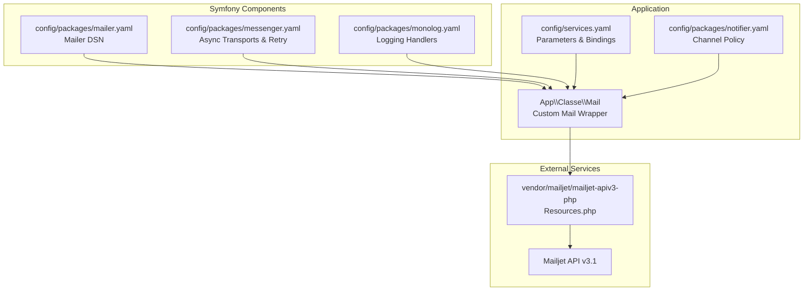
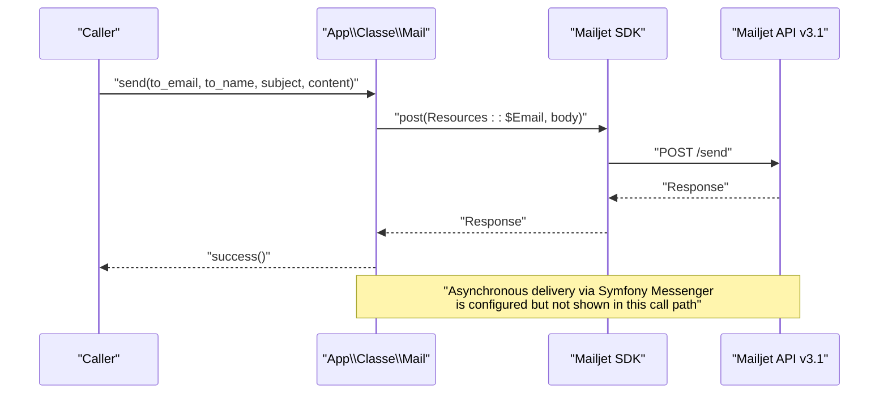
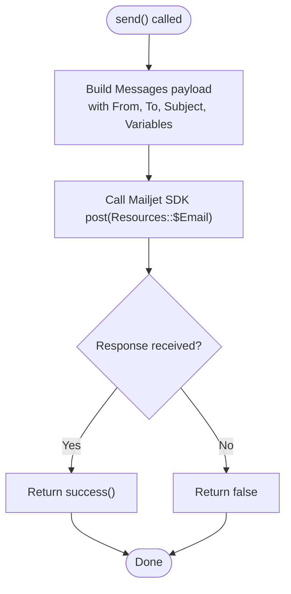
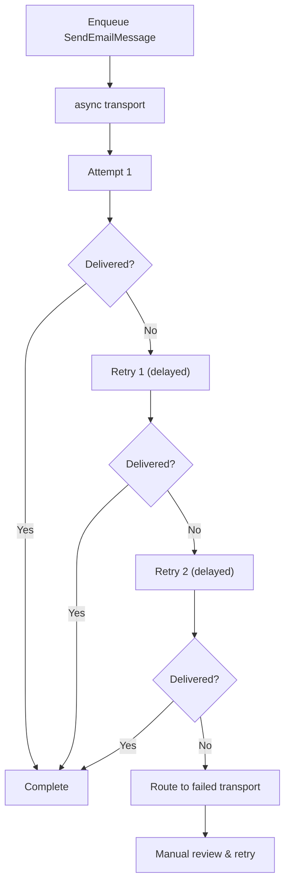
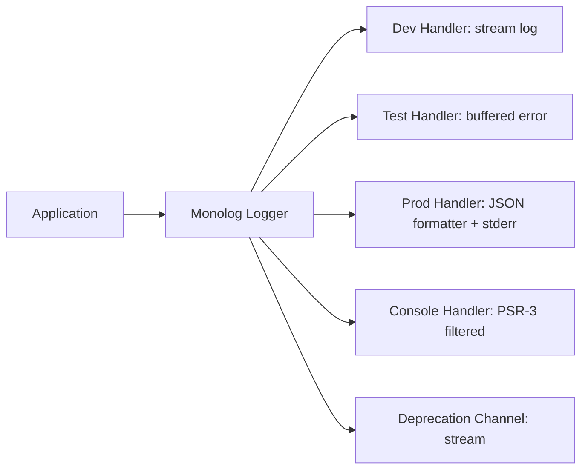
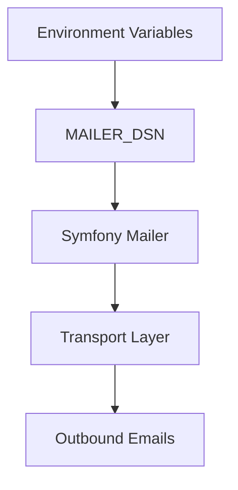
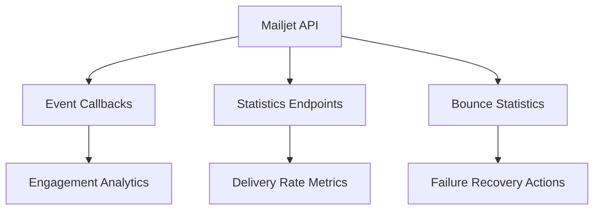
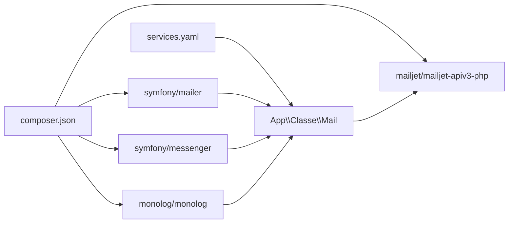

# Delivery Reliability and Monitoring

<cite>
**Referenced Files in This Document**
- [Mail.php](file://src/Classe/Mail.php)
- [mailer.yaml](file://config/packages/mailer.yaml)
- [messenger.yaml](file://config/packages/messenger.yaml)
- [monolog.yaml](file://config/packages/monolog.yaml)
- [services.yaml](file://config/services.yaml)
- [Resources.php](file://vendor/mailjet/mailjet-apiv3-php/src/Mailjet/Resources.php)
- [composer.json](file://composer.json)
- [notifier.yaml](file://config/packages/notifier.yaml)
</cite>

## Table of Contents
1. [Introduction](#introduction)
2. [Project Structure](#project-structure)
3. [Core Components](#core-components)
4. [Architecture Overview](#architecture-overview)
5. [Detailed Component Analysis](#detailed-component-analysis)
6. [Dependency Analysis](#dependency-analysis)
7. [Performance Considerations](#performance-considerations)
8. [Troubleshooting Guide](#troubleshooting-guide)
9. [Conclusion](#conclusion)

## Introduction
This document explains how email delivery reliability and monitoring are implemented in the project, focusing on error handling, retry logic, failure recovery, delivery status tracking, bounce handling, and unsubscribe management. It also covers logging and monitoring capabilities, performance metrics, delivery analytics, troubleshooting for common delivery issues, spam filtering, inbox placement optimization, and email authentication protocols (SPF, DKIM, DMARC). The analysis is grounded in the repository’s configuration and code.

## Project Structure
The email stack combines a custom Mail wrapper with Symfony Mailer and Messenger, plus Monolog for logging. The Mail wrapper integrates with the Mailjet API v3.1, while Symfony Messenger handles asynchronous delivery with retry and failure transport. Logging is configured via Monolog for development, test, and production environments.

**Diagram sources**
- [Mail.php:1-48](file://src/Classe/Mail.php#L1-L48)
- [services.yaml:9-21](file://config/services.yaml#L9-L21)
- [mailer.yaml:1-4](file://config/packages/mailer.yaml#L1-L4)
- [messenger.yaml:1-27](file://config/packages/messenger.yaml#L1-L27)
- [monolog.yaml:1-56](file://config/packages/monolog.yaml#L1-L56)
- [Resources.php:24-121](file://vendor/mailjet/mailjet-apiv3-php/src/Mailjet/Resources.php#L24-L121)
- [notifier.yaml:1-13](file://config/packages/notifier.yaml#L1-L13)

**Section sources**
- [Mail.php:1-48](file://src/Classe/Mail.php#L1-L48)
- [services.yaml:9-21](file://config/services.yaml#L9-L21)
- [mailer.yaml:1-4](file://config/packages/mailer.yaml#L1-L4)
- [messenger.yaml:1-27](file://config/packages/messenger.yaml#L1-L27)
- [monolog.yaml:1-56](file://config/packages/monolog.yaml#L1-L56)
- [Resources.php:24-121](file://vendor/mailjet/mailjet-apiv3-php/src/Mailjet/Resources.php#L24-L121)
- [notifier.yaml:1-13](file://config/packages/notifier.yaml#L1-L13)

## Core Components
- Custom Mail wrapper: Sends templated emails via Mailjet API v3.1 using a predefined template ID and variables. It returns a success indicator from the API response.
- Symfony Mailer: Configured via DSN to integrate with the underlying transport (e.g., SMTP or a bridge). The DSN is environment-driven.
- Symfony Messenger: Routes email sending to an async transport with retry strategy and a failure transport for dead-letter handling.
- Monolog: Provides structured logging across environments with JSON formatters in production and console handlers for development.
- Mailjet SDK: Exposes API resources including events, statistics, and bounce endpoints that can be used for monitoring and recovery.

Key implementation references:
- Mail wrapper method for sending templated emails and returning success status.
- Mailer DSN configuration pointing to environment variable.
- Messenger async transport with retry strategy and failure transport routing.
- Monolog handlers for error-level buffering and JSON formatting in production.
- Mailjet Resources constants for events and statistics.

**Section sources**
- [Mail.php:19-46](file://src/Classe/Mail.php#L19-L46)
- [mailer.yaml:1-4](file://config/packages/mailer.yaml#L1-L4)
- [messenger.yaml:7-12](file://config/packages/messenger.yaml#L7-L12)
- [messenger.yaml:20-23](file://config/packages/messenger.yaml#L20-L23)
- [monolog.yaml:32-50](file://config/packages/monolog.yaml#L32-L50)
- [Resources.php:26-120](file://vendor/mailjet/mailjet-apiv3-php/src/Mailjet/Resources.php#L26-L120)

## Architecture Overview
The email delivery pipeline leverages asynchronous messaging to decouple sending from request handling. The Mail wrapper encapsulates Mailjet-specific logic, while Symfony Messenger manages retries and failures. Logging captures errors and operational events.

**Diagram sources**
- [Mail.php:19-46](file://src/Classe/Mail.php#L19-L46)
- [Resources.php:26](file://vendor/mailjet/mailjet-apiv3-php/src/Mailjet/Resources.php#L26)

## Detailed Component Analysis

### Mail Wrapper: Error Handling, Success Indicators, and Template Delivery
- Purpose: Send templated emails using Mailjet API v3.1 with a fixed template ID and variables.
- Error handling: Returns a boolean success indicator from the API response. No explicit exception handling is present in the wrapper; callers should inspect the returned value and rely on logging for diagnostics.
- Delivery status: The wrapper does not expose granular delivery statuses (e.g., accepted, delivered, opened). Use Mailjet’s event callbacks and statistics APIs for visibility.
- Bounce handling: The wrapper does not implement bounce detection; integrate Mailjet’s bounce statistics and callback endpoints for bounce monitoring.
- Unsubscribe management: The wrapper does not handle unsubscribes; use Mailjet’s contact preferences and unsubscribe endpoints.

**Diagram sources**
- [Mail.php:19-46](file://src/Classe/Mail.php#L19-L46)

**Section sources**
- [Mail.php:19-46](file://src/Classe/Mail.php#L19-L46)

### Symfony Messenger: Retry Logic and Failure Recovery
- Async transport: Email sending is routed to an async transport, enabling non-blocking delivery.
- Retry strategy: Up to three retries with exponential backoff (multiplier applied to delay).
- Failure transport: Failed messages are sent to a persistent queue for later inspection and manual intervention.
- Routing: SendEmailMessage is automatically routed to the async transport.

**Diagram sources**
- [messenger.yaml:7-12](file://config/packages/messenger.yaml#L7-L12)
- [messenger.yaml:20-23](file://config/packages/messenger.yaml#L20-L23)

**Section sources**
- [messenger.yaml:7-12](file://config/packages/messenger.yaml#L7-L12)
- [messenger.yaml:20-23](file://config/packages/messenger.yaml#L20-L23)

### Logging and Monitoring: Channels, Handlers, and Formatters
- Channels: Dedicated deprecation channel for tracking deprecations separately.
- Dev/test/prod handlers: Stream handlers with environment-specific levels and filters; production uses JSON formatters and buffered error-level logging.
- Console logging: PSR-3 console handler for interactive environments with selective channel filtering.

**Diagram sources**
- [monolog.yaml:1-56](file://config/packages/monolog.yaml#L1-L56)

**Section sources**
- [monolog.yaml:1-56](file://config/packages/monolog.yaml#L1-L56)

### Mailer Configuration and Authentication
- DSN: Mailer DSN is configured via an environment variable, enabling flexible transport configuration without code changes.
- DKIM/S/MIME: DKIM signing and S/MIME options are available in the mailer reference schema, indicating potential for cryptographic signing and encryption if enabled.

**Diagram sources**
- [mailer.yaml:1-4](file://config/packages/mailer.yaml#L1-L4)

**Section sources**
- [mailer.yaml:1-4](file://config/packages/mailer.yaml#L1-L4)
- [composer.json:29, 31, 15, 1777-1835](file://composer.json#L29,L31,L15,L1777-L1835)

### Event Callbacks, Statistics, and Bounce Handling
- Mailjet Resources include endpoints for events, statistics, and bounce data. These can be used to build monitoring dashboards, alert on bounces, and track delivery health.
- Recommended integration points:
  - Bounce statistics endpoint for bounce monitoring.
  - Open/click/event endpoints for engagement analytics.
  - Message statistics for delivery rate insights.

**Diagram sources**
- [Resources.php:36, 48, 78, 93](file://vendor/mailjet/mailjet-apiv3-php/src/Mailjet/Resources.php#L36,L48,L78,L93)

**Section sources**
- [Resources.php:36, 48, 78, 93](file://vendor/mailjet/mailjet-apiv3-php/src/Mailjet/Resources.php#L36,L48,L78,L93)

### Notifier and Administrative Alerts
- The notifier is configured to route urgent/high/medium/low alerts via email to administrators, supporting operational monitoring and incident response.

**Section sources**
- [notifier.yaml:5-12](file://config/packages/notifier.yaml#L5-L12)

## Dependency Analysis
- Internal dependencies:
  - Mail wrapper depends on the Mailjet SDK and Mailjet API v3.1.
  - Services configuration binds API keys to the Mail wrapper constructor.
- External dependencies:
  - Symfony Mailer and Messenger for transport and async delivery.
  - Monolog for logging.
  - Mailjet PHP SDK for API access.

**Diagram sources**
- [composer.json:15, 29, 31, 1777-1835](file://composer.json#L15,L29,L31,L1777-L1835)
- [services.yaml:9-21](file://config/services.yaml#L9-L21)
- [Mail.php:5-6](file://src/Classe/Mail.php#L5-L6)

**Section sources**
- [composer.json:15, 29, 31, 1777-1835](file://composer.json#L15,L29,L31,L1777-L1835)
- [services.yaml:9-21](file://config/services.yaml#L9-L21)
- [Mail.php:5-6](file://src/Classe/Mail.php#L5-L6)

## Performance Considerations
- Asynchronous delivery: Offloads email sending to background workers, improving request latency.
- Retry strategy: Limits retry attempts and applies exponential backoff to reduce load spikes during transient failures.
- Buffered logging in production: Reduces I/O overhead by buffering messages and using JSON formatters for efficient ingestion.
- Template-based sending: Reuses a single Mailjet template to minimize per-message processing overhead.

[No sources needed since this section provides general guidance]

## Troubleshooting Guide

Common delivery issues and resolutions:
- Emails not being sent:
  - Verify MAILER_DSN environment variable and transport availability.
  - Confirm async transport is reachable and worker is running.
  - Check Monolog logs for error-level entries and JSON-formatted records in production.
- High bounce rates:
  - Integrate Mailjet bounce statistics endpoint to monitor and segment bounces.
  - Remove invalid or complaint contacts from lists.
- Spam complaints and inbox placement:
  - Review Mailjet event callbacks for spam reports and complaints.
  - Optimize sender reputation and content hygiene; ensure proper SPF/DKIM/DMARC alignment.
- Open and click tracking:
  - Use Mailjet open and click statistics endpoints to collect engagement metrics.
- Authentication misalignment:
  - Ensure SPF record includes the sending domains.
  - Configure DKIM selectors and align DKIM with the sending domain.
  - Set DMARC policy to instruct receiving servers on handling unauthenticated mail.

Operational checks:
- Validate Mail wrapper success indicator and inspect logs for failures.
- Inspect the failure transport queue for messages requiring manual intervention.
- Monitor notifier alerts for urgent delivery incidents.

**Section sources**
- [mailer.yaml:1-4](file://config/packages/mailer.yaml#L1-L4)
- [messenger.yaml:7-12](file://config/packages/messenger.yaml#L7-L12)
- [monolog.yaml:32-50](file://config/packages/monolog.yaml#L32-L50)
- [Resources.php:36, 48, 78, 93](file://vendor/mailjet/mailjet-apiv3-php/src/Mailjet/Resources.php#L36,L48,L78,L93)
- [notifier.yaml:5-12](file://config/packages/notifier.yaml#L5-L12)

## Conclusion
The project implements a robust, asynchronous email delivery pipeline using Symfony Mailer and Messenger, with a custom Mail wrapper integrating Mailjet API v3.1. Retry logic and a failure transport ensure resilience, while Monolog provides structured logging across environments. For comprehensive delivery reliability and monitoring, integrate Mailjet’s event callbacks, statistics, and bounce endpoints to track delivery status, handle bounces, manage unsubscribes, and collect engagement metrics. Align DNS-based authentication (SPF, DKIM, DMARC) to improve inbox placement and reduce spam filtering impact.