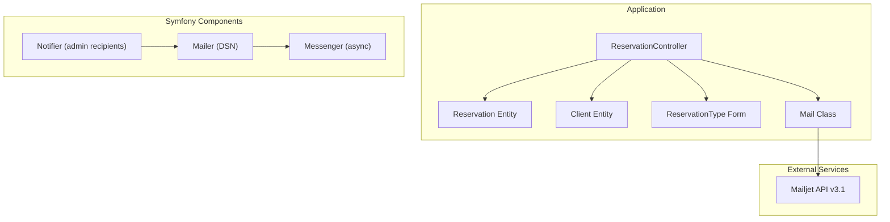
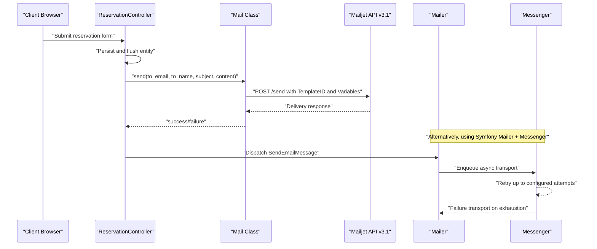
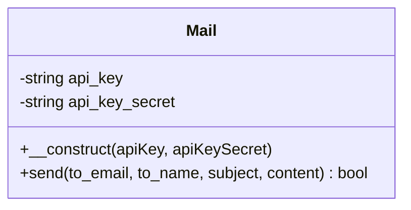
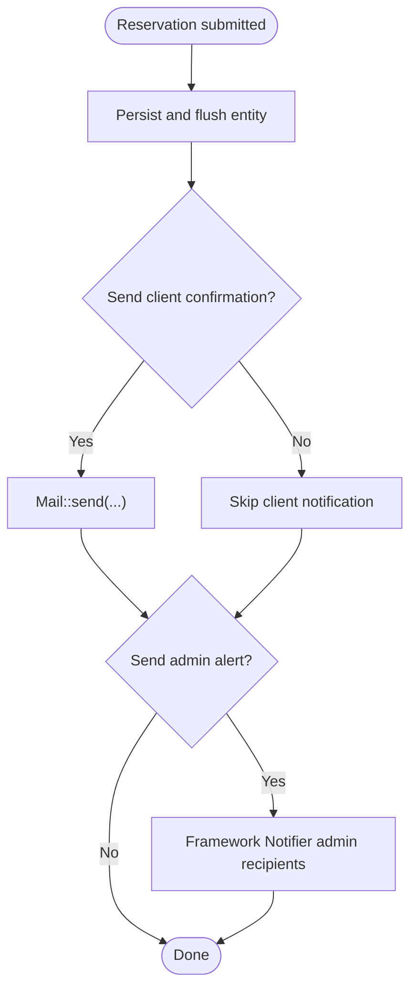
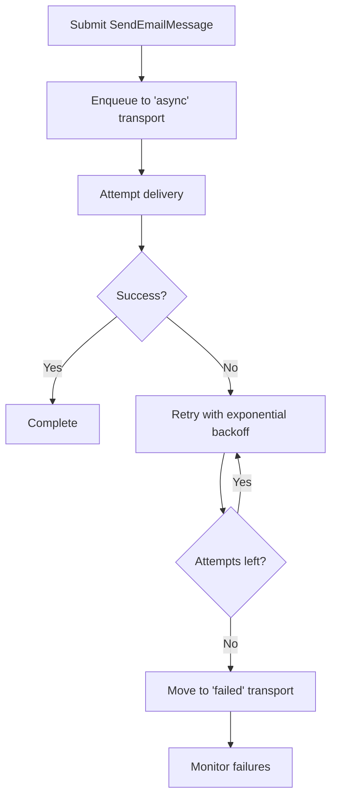
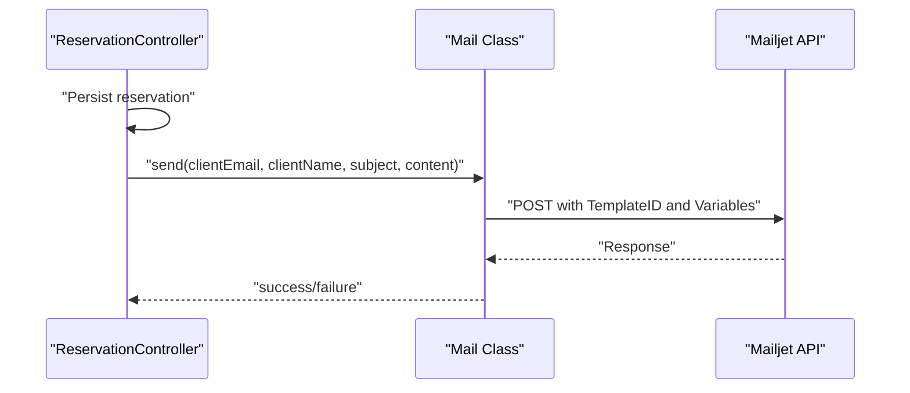
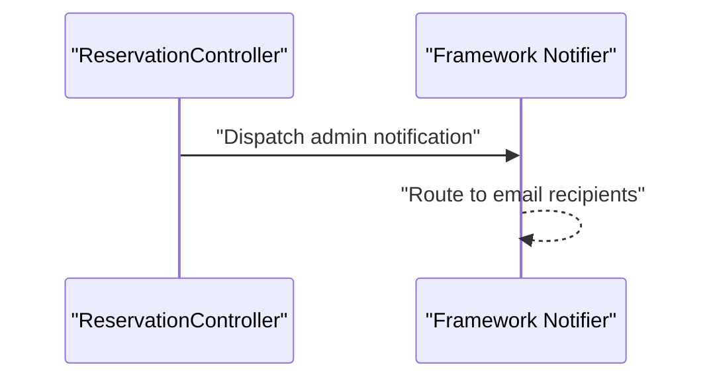
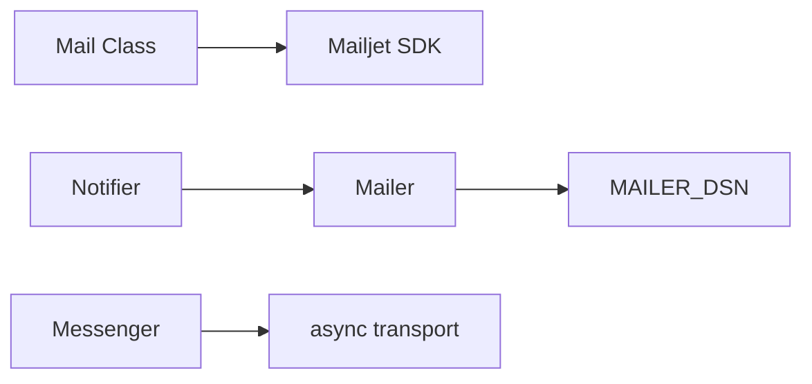

# Email Notification System

<cite>
**Referenced Files in This Document**
- [Mail.php](file://src/Classe/Mail.php)
- [mailer.yaml](file://config/packages/mailer.yaml)
- [messenger.yaml](file://config/packages/messenger.yaml)
- [notifier.yaml](file://config/packages/notifier.yaml)
- [framework.yaml](file://config/packages/framework.yaml)
- [ReservationController.php](file://src/Controller/ReservationController.php)
- [Reservation.php](file://src/Entity/Reservation.php)
- [Client.php](file://src/Entity/Client.php)
- [ReservationType.php](file://src/Form/ReservationType.php)
- [composer.lock](file://composer.lock)
</cite>

## Table of Contents
1. [Introduction](#introduction)
2. [Project Structure](#project-structure)
3. [Core Components](#core-components)
4. [Architecture Overview](#architecture-overview)
5. [Detailed Component Analysis](#detailed-component-analysis)
6. [Dependency Analysis](#dependency-analysis)
7. [Performance Considerations](#performance-considerations)
8. [Troubleshooting Guide](#troubleshooting-guide)
9. [Conclusion](#conclusion)
10. [Appendices](#appendices)

## Introduction
This document describes the email notification system for the accommodation booking platform. It covers the custom Mail class, Mailjet API integration, email template management, and the current state of automated notification triggers. It also documents configuration for email delivery via Symfony Mailer and Messenger, queue processing, retry mechanisms, and error handling. Guidance is included for deliverability, spam prevention, localization, and branding consistency.

## Project Structure
The email system integrates a custom PHP class with the Mailjet API and leverages Symfony’s Mailer and Messenger components for transport and queuing. Configuration files define DSNs, routing, and retry policies. Entities and forms model reservation data, while controllers orchestrate user actions.

**Diagram sources**
- [ReservationController.php:14-81](file://src/Controller/ReservationController.php#L14-L81)
- [Reservation.php:9-99](file://src/Entity/Reservation.php#L9-L99)
- [Client.php:8-70](file://src/Entity/Client.php#L8-L70)
- [ReservationType.php:14-49](file://src/Form/ReservationType.php#L14-L49)
- [Mail.php:8-47](file://src/Classe/Mail.php#L8-L47)
- [mailer.yaml:1-4](file://config/packages/mailer.yaml#L1-L4)
- [messenger.yaml:1-27](file://config/packages/messenger.yaml#L1-L27)
- [notifier.yaml:1-13](file://config/packages/notifier.yaml#L1-L13)

**Section sources**
- [ReservationController.php:14-81](file://src/Controller/ReservationController.php#L14-L81)
- [Reservation.php:9-99](file://src/Entity/Reservation.php#L9-L99)
- [Client.php:8-70](file://src/Entity/Client.php#L8-L70)
- [ReservationType.php:14-49](file://src/Form/ReservationType.php#L14-L49)
- [Mail.php:8-47](file://src/Classe/Mail.php#L8-L47)
- [mailer.yaml:1-4](file://config/packages/mailer.yaml#L1-L4)
- [messenger.yaml:1-27](file://config/packages/messenger.yaml#L1-L27)
- [notifier.yaml:1-13](file://config/packages/notifier.yaml#L1-L13)

## Core Components
- Mail class: Encapsulates Mailjet API client initialization and email sending with a predefined template ID and variables.
- Mailer configuration: Defines the DSN for the mail transport.
- Messenger configuration: Routes email messages to an asynchronous transport with retry strategy and a failure transport.
- Notifier configuration: Sets email as the channel for all urgency levels and defines admin recipients.

Key implementation references:
- Mail class constructor and send method
- Mailer DSN definition
- Messenger async transport and retry settings
- Notifier channel policy and admin recipients

**Section sources**
- [Mail.php:8-47](file://src/Classe/Mail.php#L8-L47)
- [mailer.yaml:1-4](file://config/packages/mailer.yaml#L1-L4)
- [messenger.yaml:1-27](file://config/packages/messenger.yaml#L1-L27)
- [notifier.yaml:1-13](file://config/packages/notifier.yaml#L1-L13)

## Architecture Overview
The system supports two primary email pathways:
- Custom Mail class: Sends templated emails via Mailjet using a fixed template ID and variables.
- Symfony Mailer + Messenger: Routes SendEmailMessage to an async transport for queued delivery with retries.

**Diagram sources**
- [ReservationController.php:25-42](file://src/Controller/ReservationController.php#L25-L42)
- [Mail.php:19-46](file://src/Classe/Mail.php#L19-L46)
- [messenger.yaml:7-13](file://config/packages/messenger.yaml#L7-L13)

## Detailed Component Analysis

### Mail Class Implementation
The Mail class encapsulates Mailjet API usage:
- Constructor accepts API credentials.
- send method builds a payload with From, To, Subject, TemplateID, TemplateLanguage, and Variables.
- Returns success status from the API response.

**Diagram sources**
- [Mail.php:8-47](file://src/Classe/Mail.php#L8-L47)

**Section sources**
- [Mail.php:8-47](file://src/Classe/Mail.php#L8-L47)

### Mailjet API Integration
- Client initialization uses Mailjet SDK with API key, secret, version v3.1.
- Email endpoint is invoked with a Messages array containing sender, recipient, template ID, language toggle, subject, and variables.
- The template ID is hardcoded in the class.

Operational implications:
- Template management occurs in the Mailjet dashboard; the class references a specific template by ID.
- Variables passed to the API include a content field mapped to the template variable.

**Section sources**
- [Mail.php:19-46](file://src/Classe/Mail.php#L19-L46)
- [composer.lock:1806-1835](file://composer.lock#L1806-L1835)

### Email Template Management
- The Mail class uses a fixed TemplateID and passes content via Variables.
- No local Twig templates are rendered within the Mail class; the content is supplied as a variable to the Mailjet template.
- The project includes default Symfony email templates under vendor paths, but the custom Mail class does not utilize them.

Recommendations:
- Centralize template IDs and variable schemas in configuration or constants.
- Consider adding template language selection and subject customization per locale.

**Section sources**
- [Mail.php:35-40](file://src/Classe/Mail.php#L35-L40)
- [composer.lock:1806-1835](file://composer.lock#L1806-L1835)

### Automated Notification Triggers
Current state:
- The reservation controller persists and redirects after form submission but does not trigger email sending.
- There is no explicit call to the Mail class within the reservation workflow.
- No cancellation or confirmation flows are implemented in the controller.

Potential triggers to implement:
- New reservation confirmation sent to the client.
- Administrative alert to admin recipients when a reservation is created or modified.
- Cancellation confirmation when a reservation is deleted.

**Diagram sources**
- [ReservationController.php:25-42](file://src/Controller/ReservationController.php#L25-L42)
- [notifier.yaml:7-12](file://config/packages/notifier.yaml#L7-L12)

**Section sources**
- [ReservationController.php:25-42](file://src/Controller/ReservationController.php#L25-L42)
- [ReservationController.php:71-80](file://src/Controller/ReservationController.php#L71-L80)
- [notifier.yaml:1-13](file://config/packages/notifier.yaml#L1-L13)

### Email Configuration and Delivery Reliability
- Mailer DSN: Defined via environment variable for flexible deployment.
- Messenger async transport: Routes SendEmailMessage to an async queue with retry strategy and failure transport.
- Retry configuration: Maximum retries and exponential backoff multiplier are set.

**Diagram sources**
- [messenger.yaml:7-13](file://config/packages/messenger.yaml#L7-L13)
- [messenger.yaml:20-23](file://config/packages/messenger.yaml#L20-L23)

**Section sources**
- [mailer.yaml:1-4](file://config/packages/mailer.yaml#L1-L4)
- [messenger.yaml:1-27](file://config/packages/messenger.yaml#L1-L27)

### Email Queue Processing, Retry Mechanisms, and Error Handling
- Routing: SendEmailMessage is routed to the async transport.
- Retry strategy: Configured with max retries and multiplier.
- Failure transport: Messages moved to a failure transport after retries are exhausted.
- Error handling: The Mail class returns a boolean success indicator; callers should handle failures accordingly.

Operational notes:
- Ensure workers are running to process the async transport.
- Monitor the failure transport for failed deliveries.

**Section sources**
- [messenger.yaml:7-13](file://config/packages/messenger.yaml#L7-L13)
- [messenger.yaml:20-23](file://config/packages/messenger.yaml#L20-L23)
- [Mail.php:45](file://src/Classe/Mail.php#L45)

### Deliverability, Spam Prevention, and Inbox Placement
- DKIM signing: Available via mailer configuration keys for DKIM signer.
- Branding consistency: The Mail class hardcodes sender email and name; centralize these values for consistency.
- Localization: TemplateLanguage is enabled; ensure Mailjet template variables align with localized content.
- Security: Session configuration is enabled; ensure secure cookie settings and CSRF protection are considered for email-triggered actions.

**Section sources**
- [framework.yaml:1-16](file://config/packages/framework.yaml#L1-L16)
- [Mail.php:25-28](file://src/Classe/Mail.php#L25-L28)

### Examples of Workflows

#### Example: Sending a Confirmation Email After Reservation Creation
- Controller action persists the reservation.
- Build content for the Mailjet template.
- Call Mail::send with recipient email/name, subject, and content.
- Optionally dispatch a Symfony Mailer message for queued delivery.

**Diagram sources**
- [ReservationController.php:25-42](file://src/Controller/ReservationController.php#L25-L42)
- [Mail.php:19-46](file://src/Classe/Mail.php#L19-L46)

#### Example: Administrative Alert on Reservation Change
- Configure notifier recipients.
- Dispatch a notification message when a reservation is created/updated/deleted.
- The notifier routes email notifications to the configured recipients.

**Diagram sources**
- [notifier.yaml:7-12](file://config/packages/notifier.yaml#L7-L12)
- [ReservationController.php:71-80](file://src/Controller/ReservationController.php#L71-L80)

## Dependency Analysis
- Mail class depends on the Mailjet SDK (loaded via Composer autoloading).
- Symfony Mailer is configured via DSN; Messenger routes SendEmailMessage to async transport.
- Notifier integrates with Mailer to send administrative alerts.

**Diagram sources**
- [Mail.php:5-6](file://src/Classe/Mail.php#L5-L6)
- [composer.lock:1806-1835](file://composer.lock#L1806-L1835)
- [mailer.yaml:1-4](file://config/packages/mailer.yaml#L1-4)
- [messenger.yaml:7-13](file://config/packages/messenger.yaml#L7-L13)
- [notifier.yaml:7-12](file://config/packages/notifier.yaml#L7-L12)

**Section sources**
- [Mail.php:5-6](file://src/Classe/Mail.php#L5-L6)
- [composer.lock:1806-1835](file://composer.lock#L1806-L1835)
- [mailer.yaml:1-4](file://config/packages/mailer.yaml#L1-L4)
- [messenger.yaml:7-13](file://config/packages/messenger.yaml#L7-L13)
- [notifier.yaml:1-13](file://config/packages/notifier.yaml#L1-L13)

## Performance Considerations
- Asynchronous delivery: Use the async transport to avoid blocking requests during email sending.
- Retry strategy: Tune max_retries and multiplier based on expected delivery SLAs.
- Template rendering: Prefer server-side template rendering via Mailjet templates to reduce client-side processing overhead.
- Monitoring: Track failure transport backlog and adjust retry settings accordingly.

## Troubleshooting Guide
Common issues and resolutions:
- Authentication failures: Verify Mailjet API key and secret are correctly set and loaded.
- Template errors: Confirm TemplateID exists and Variables match the template schema.
- Delivery failures: Inspect the failure transport and logs; adjust retry settings if needed.
- Notifier recipients: Ensure admin recipients are properly configured and reachable.

**Section sources**
- [Mail.php:13-17](file://src/Classe/Mail.php#L13-L17)
- [Mail.php:35](file://src/Classe/Mail.php#L35)
- [messenger.yaml:9-11](file://config/packages/messenger.yaml#L9-L11)
- [notifier.yaml:11-12](file://config/packages/notifier.yaml#L11-L12)

## Conclusion
The email notification system combines a custom Mail class with Mailjet for templated emails and Symfony Mailer + Messenger for queued, reliable delivery. While the current reservation workflow persists data without triggering notifications, extending it to call the Mail class and leveraging the notifier for administrative alerts will provide a robust, scalable email infrastructure. Focus on centralizing configuration, ensuring deliverability best practices, and monitoring queue health for optimal operation.

## Appendices

### Configuration Options Summary
- Mailer DSN: Environment-driven configuration for transport.
- Messenger async transport: Queued delivery with retry strategy and failure transport.
- Notifier channel policy: Email used for all urgency levels with admin recipients.

**Section sources**
- [mailer.yaml:1-4](file://config/packages/mailer.yaml#L1-L4)
- [messenger.yaml:7-13](file://config/packages/messenger.yaml#L7-L13)
- [messenger.yaml:20-23](file://config/packages/messenger.yaml#L20-L23)
- [notifier.yaml:5-12](file://config/packages/notifier.yaml#L5-L12)