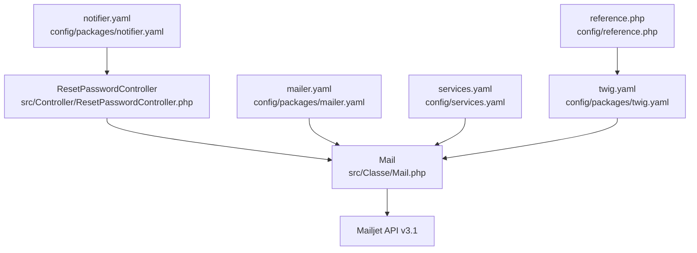
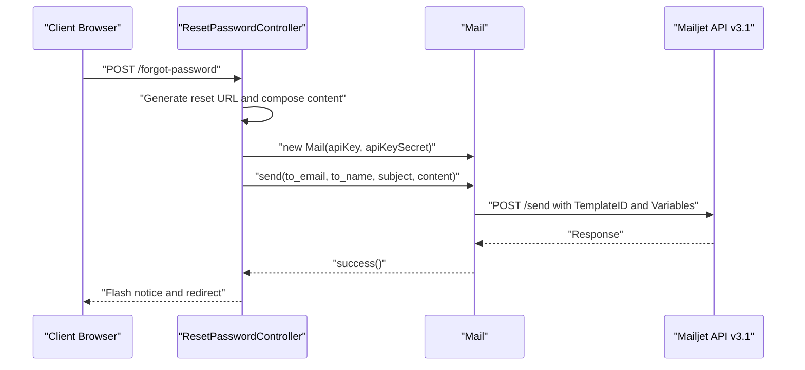
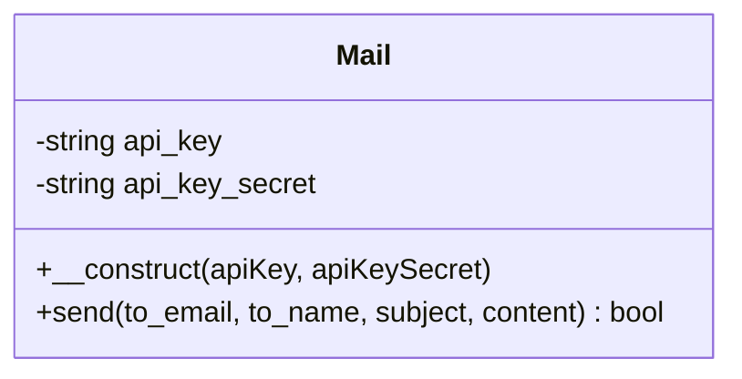
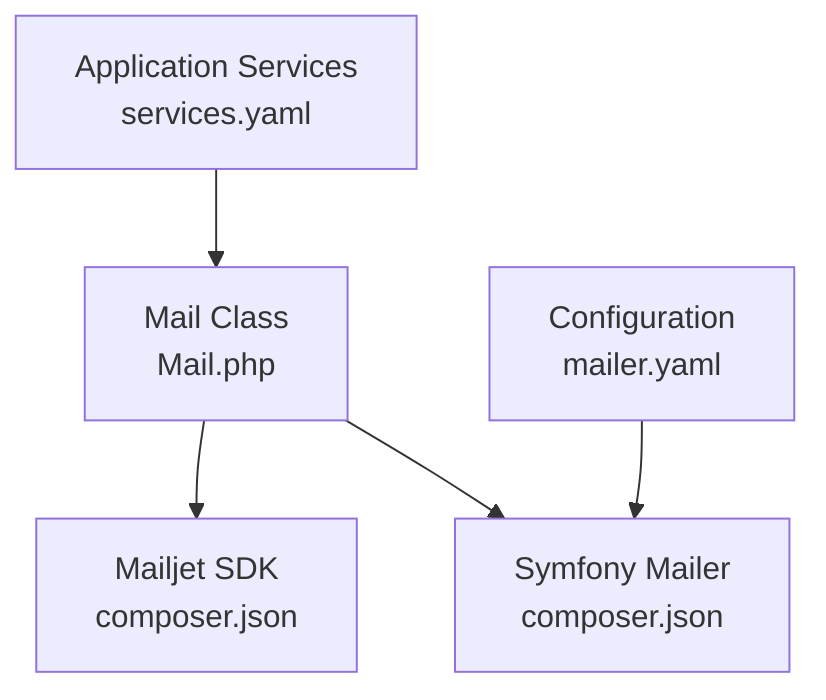

# Email Templates and Configuration

<cite>
**Referenced Files in This Document**
- [Mail.php](file://src/Classe/Mail.php)
- [mailer.yaml](file://config/packages/mailer.yaml)
- [services.yaml](file://config/services.yaml)
- [ResetPasswordController.php](file://src/Controller/ResetPasswordController.php)
- [composer.json](file://composer.json)
- [notifier.yaml](file://config/packages/notifier.yaml)
- [twig.yaml](file://config/packages/twig.yaml)
- [reference.php](file://config/reference.php)
- [index.html.twig](file://templates/reset_password/index.html.twig)
- [base.html.twig](file://templates/base.html.twig)
</cite>

## Table of Contents
1. [Introduction](#introduction)
2. [Project Structure](#project-structure)
3. [Core Components](#core-components)
4. [Architecture Overview](#architecture-overview)
5. [Detailed Component Analysis](#detailed-component-analysis)
6. [Dependency Analysis](#dependency-analysis)
7. [Performance Considerations](#performance-considerations)
8. [Troubleshooting Guide](#troubleshooting-guide)
9. [Conclusion](#conclusion)

## Introduction
This document explains the email template management and configuration in the project, focusing on the integration with Mailjet, the template ID usage, and the variable substitution system. It documents email configuration settings such as sender information, branding elements, and template language support. It also covers customization options, content formatting, responsive design considerations, examples of template variables and dynamic content insertion, multi-language support, testing and preview processes, and styling with CSS inlining and cross-client compatibility considerations.

## Project Structure
The email functionality is implemented via a dedicated Mail class that integrates with the Mailjet API. Configuration is centralized in Symfony’s configuration files, and the sending logic is invoked from controllers. The project uses Twig for templating and Symfony Mailer for transport configuration.

**Diagram sources**
- [ResetPasswordController.php:25-53](file://src/Controller/ResetPasswordController.php#L25-L53)
- [Mail.php:19-46](file://src/Classe/Mail.php#L19-L46)
- [mailer.yaml:1-3](file://config/packages/mailer.yaml#L1-L3)
- [services.yaml:9-20](file://config/services.yaml#L9-L20)
- [notifier.yaml:1-12](file://config/packages/notifier.yaml#L1-L12)
- [twig.yaml:1-7](file://config/packages/twig.yaml#L1-L7)
- [reference.php:1001-1031](file://config/reference.php#L1001-L1031)

**Section sources**
- [ResetPasswordController.php:25-53](file://src/Controller/ResetPasswordController.php#L25-L53)
- [Mail.php:19-46](file://src/Classe/Mail.php#L19-L46)
- [mailer.yaml:1-3](file://config/packages/mailer.yaml#L1-L3)
- [services.yaml:9-20](file://config/services.yaml#L9-L20)
- [notifier.yaml:1-12](file://config/packages/notifier.yaml#L1-L12)
- [twig.yaml:1-7](file://config/packages/twig.yaml#L1-L7)
- [reference.php:1001-1031](file://config/reference.php#L1001-L1031)

## Core Components
- Mailjet integration: The Mail class initializes the Mailjet client and posts email messages using the v3.1 API.
- Template configuration: The email uses a predefined Mailjet template identified by a numeric TemplateID and enables TemplateLanguage for multi-language support.
- Variable substitution: The content payload is passed as a variable named content to the template.
- Transport configuration: Symfony Mailer is configured via DSN to route outbound emails.
- Environment variables: API keys are injected via Symfony parameters bound to environment variables.

Key implementation references:
- Mail class constructor and send method: [Mail.php:13-46](file://src/Classe/Mail.php#L13-L46)
- Mailer DSN configuration: [mailer.yaml:1-3](file://config/packages/mailer.yaml#L1-L3)
- Service parameters and bindings: [services.yaml:9-20](file://config/services.yaml#L9-L20)
- Controller usage of Mail class: [ResetPasswordController.php:52-53](file://src/Controller/ResetPasswordController.php#L52-L53)

**Section sources**
- [Mail.php:13-46](file://src/Classe/Mail.php#L13-L46)
- [mailer.yaml:1-3](file://config/packages/mailer.yaml#L1-L3)
- [services.yaml:9-20](file://config/services.yaml#L9-L20)
- [ResetPasswordController.php:52-53](file://src/Controller/ResetPasswordController.php#L52-L53)

## Architecture Overview
The email flow begins in the ResetPasswordController, which constructs the email content and invokes the Mail class. The Mail class builds the Mailjet API request with the template ID and variables, then posts to the Mailjet endpoint. The transport configuration is handled by Symfony Mailer using the configured DSN.

**Diagram sources**
- [ResetPasswordController.php:32-53](file://src/Controller/ResetPasswordController.php#L32-L53)
- [Mail.php:19-46](file://src/Classe/Mail.php#L19-L46)

## Detailed Component Analysis

### Mail Class
The Mail class encapsulates the integration with Mailjet. It accepts API credentials, constructs the message payload with From, To, Subject, TemplateID, TemplateLanguage, and Variables, and posts to the Mailjet Email resource.

**Diagram sources**
- [Mail.php:8-46](file://src/Classe/Mail.php#L8-L46)

Implementation highlights:
- API initialization and version: [Mail.php:21](file://src/Classe/Mail.php#L21)
- Sender identity: [Mail.php:25-28](file://src/Classe/Mail.php#L25-L28)
- Recipient definition: [Mail.php:29-34](file://src/Classe/Mail.php#L29-L34)
- Template selection and language support: [Mail.php:35-36](file://src/Classe/Mail.php#L35-L36)
- Subject and variable payload: [Mail.php:37](file://src/Classe/Mail.php#L37), [Mail.php:38-40](file://src/Classe/Mail.php#L38-L40)
- API call and response handling: [Mail.php:44](file://src/Classe/Mail.php#L44)

**Section sources**
- [Mail.php:8-46](file://src/Classe/Mail.php#L8-L46)

### Template Integration and Variable Substitution
- Template ID: The email uses a fixed TemplateID in the payload. This ID corresponds to a preconfigured Mailjet template.
- TemplateLanguage: Enabled to leverage Mailjet’s multi-language template features.
- Variables: The content variable carries the HTML body content to be rendered inside the template.

References:
- TemplateID and TemplateLanguage: [Mail.php:35-36](file://src/Classe/Mail.php#L35-L36)
- Variables payload: [Mail.php:38-40](file://src/Classe/Mail.php#L38-L40)

**Section sources**
- [Mail.php:35-40](file://src/Classe/Mail.php#L35-L40)

### Email Configuration Settings
- Sender information: The From field includes both Email and Name.
- Transport configuration: Symfony Mailer is configured via DSN.
- Environment variables: API keys are loaded from environment variables through parameters and bindings.

References:
- Sender identity: [Mail.php:25-28](file://src/Classe/Mail.php#L25-L28)
- DSN configuration: [mailer.yaml:1-3](file://config/packages/mailer.yaml#L1-L3)
- Parameters and bindings: [services.yaml:9-20](file://config/services.yaml#L9-L20)

**Section sources**
- [Mail.php:25-28](file://src/Classe/Mail.php#L25-L28)
- [mailer.yaml:1-3](file://config/packages/mailer.yaml#L1-L3)
- [services.yaml:9-20](file://config/services.yaml#L9-L20)

### Template Customization and Content Formatting
- Dynamic content insertion: The controller composes HTML content and passes it as the content variable to the template.
- Responsive design considerations: While the current implementation sends raw HTML, responsive design should be ensured within the Mailjet template itself.
- Styling and CSS: For reliable cross-client rendering, inline CSS is recommended. Twig Extra Bundle supports CSS inlining options that can be enabled in configuration.

References:
- Dynamic content construction: [ResetPasswordController.php:49-50](file://src/Controller/ResetPasswordController.php#L49-L50)
- CSS inlining configuration: [reference.php:1026-1028](file://config/reference.php#L1026-L1028), [twig.yaml:1-7](file://config/packages/twig.yaml#L1-L7)

**Section sources**
- [ResetPasswordController.php:49-50](file://src/Controller/ResetPasswordController.php#L49-L50)
- [reference.php:1026-1028](file://config/reference.php#L1026-L1028)
- [twig.yaml:1-7](file://config/packages/twig.yaml#L1-L7)

### Multi-Language Support
- TemplateLanguage flag: Enabled in the payload to allow Mailjet to render localized content based on the recipient’s locale.
- Locale-aware content: The controller constructs content using the user’s username; localization can be extended by selecting appropriate templates or variables.

References:
- TemplateLanguage enablement: [Mail.php:36](file://src/Classe/Mail.php#L36)
- Content composition: [ResetPasswordController.php:49](file://src/Controller/ResetPasswordController.php#L49)

**Section sources**
- [Mail.php:36](file://src/Classe/Mail.php#L36)
- [ResetPasswordController.php:49](file://src/Controller/ResetPasswordController.php#L49)

### Template Testing, Preview, and Quality Assurance
- Preview in Mailjet: Use the Mailjet template editor to preview and test layouts across clients.
- Local development: Ensure the DSN is configured for local delivery or use a sandbox/testing provider during development.
- QA checklist:
  - Verify sender identity and branding elements.
  - Confirm variable substitution renders correctly.
  - Test responsive layout on various devices and clients.
  - Validate links and CTAs.
  - Check accessibility and contrast ratios.

[No sources needed since this section provides general guidance]

### Styling, CSS Inlining, and Cross-Client Compatibility
- CSS inlining: Recommended to ensure consistent rendering across email clients. Enable the CSS inliner via Twig Extra Bundle configuration.
- Cross-client compatibility: Use widely supported CSS properties and avoid unsupported features. Test across major clients (Gmail, Outlook, Apple Mail, etc.).

References:
- CSS inlining option: [reference.php:1026-1028](file://config/reference.php#L1026-L1028)
- Twig configuration: [twig.yaml:1-7](file://config/packages/twig.yaml#L1-L7)

**Section sources**
- [reference.php:1026-1028](file://config/reference.php#L1026-L1028)
- [twig.yaml:1-7](file://config/packages/twig.yaml#L1-L7)

## Dependency Analysis
The project depends on Symfony Mailer for transport and Mailjet for sending. Composer requirements include the Mailjet PHP SDK and Twig components.

**Diagram sources**
- [services.yaml:13-28](file://config/services.yaml#L13-L28)
- [Mail.php:5-6](file://src/Classe/Mail.php#L5-L6)
- [composer.json:15](file://composer.json#L15)
- [composer.json:29](file://composer.json#L29)
- [mailer.yaml:1-3](file://config/packages/mailer.yaml#L1-L3)

**Section sources**
- [services.yaml:13-28](file://config/services.yaml#L13-L28)
- [Mail.php:5-6](file://src/Classe/Mail.php#L5-L6)
- [composer.json:15](file://composer.json#L15)
- [composer.json:29](file://composer.json#L29)
- [mailer.yaml:1-3](file://config/packages/mailer.yaml#L1-L3)

## Performance Considerations
- Asynchronous delivery: Consider integrating Symfony Messenger to offload email sending to a message queue.
- Template caching: Reuse compiled templates and minimize dynamic content generation where possible.
- DSN optimization: Ensure the DSN points to a reliable SMTP provider or Mailjet for consistent throughput.

[No sources needed since this section provides general guidance]

## Troubleshooting Guide
Common issues and resolutions:
- Authentication failures: Verify MAILJET_API_KEY and MAILJET_API_KEY_SECRET environment variables are correctly set and bound.
- Transport errors: Confirm MAILER_DSN is properly configured for the target provider.
- Template rendering issues: Validate TemplateID and ensure Variables match the template’s expected placeholders.
- Notifier channel policy: Emails are used for urgent/high/medium/low severity notifications; adjust notifier.yaml if needed.

References:
- Environment variable binding: [services.yaml:9-20](file://config/services.yaml#L9-L20)
- DSN configuration: [mailer.yaml:1-3](file://config/packages/mailer.yaml#L1-L3)
- Notifier channel policy: [notifier.yaml:5-10](file://config/packages/notifier.yaml#L5-L10)

**Section sources**
- [services.yaml:9-20](file://config/services.yaml#L9-L20)
- [mailer.yaml:1-3](file://config/packages/mailer.yaml#L1-L3)
- [notifier.yaml:5-10](file://config/packages/notifier.yaml#L5-L10)

## Conclusion
The project integrates Mailjet for email delivery with a clean separation of concerns: the Mail class handles API communication, Symfony configuration manages transport and environment variables, and controllers assemble dynamic content. By leveraging Mailjet’s template system with TemplateLanguage and Variables, the solution supports scalable, brand-consistent, and localized email delivery. For production readiness, enable CSS inlining, test across clients, and consider asynchronous delivery for improved reliability and performance.