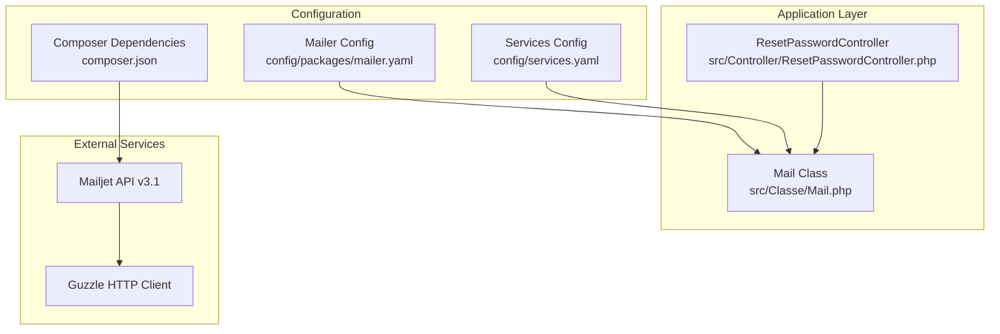
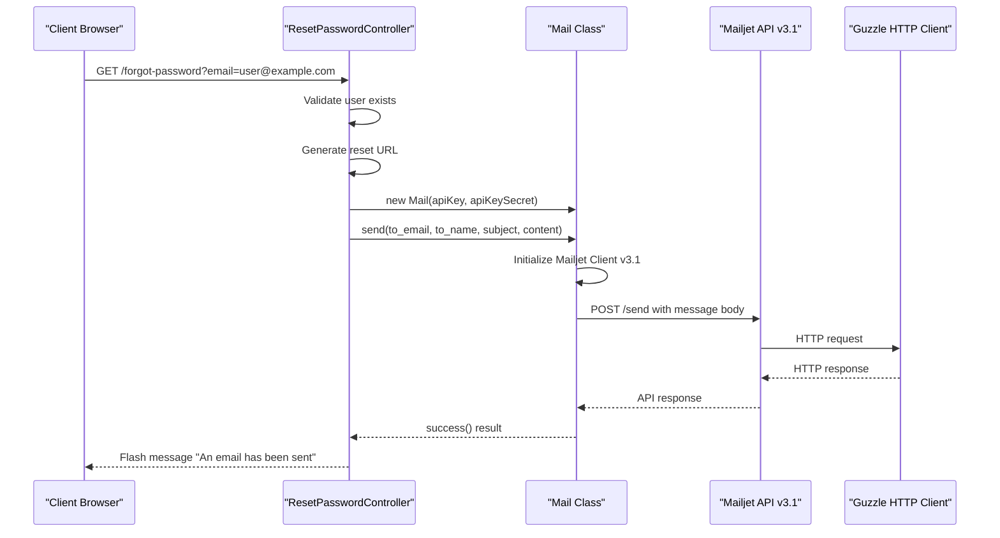
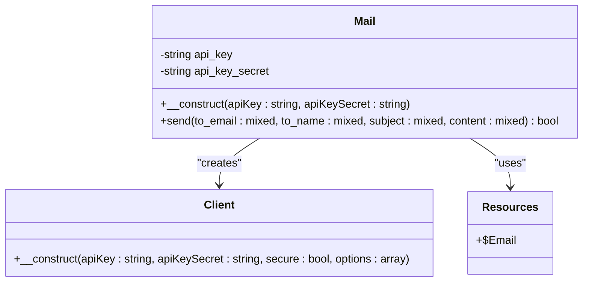
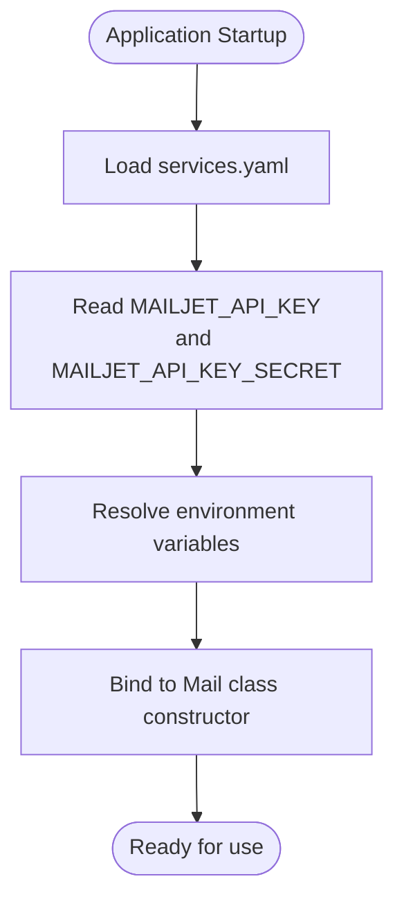
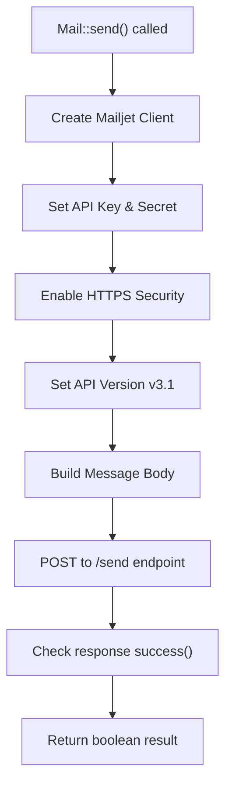
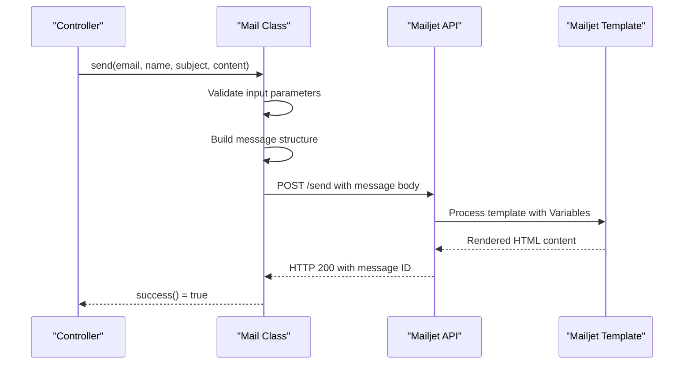
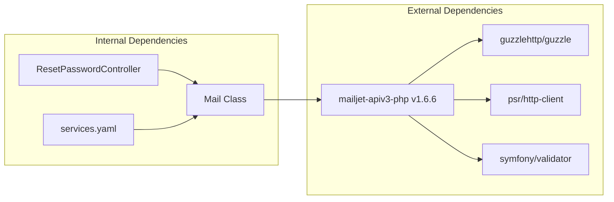

# Mailjet API Integration

<cite>
**Referenced Files in This Document**
- [Mail.php](file://src/Classe/Mail.php)
- [services.yaml](file://config/services.yaml)
- [mailer.yaml](file://config/packages/mailer.yaml)
- [composer.json](file://composer.json)
- [ResetPasswordController.php](file://src/Controller/ResetPasswordController.php)
- [composer.lock](file://composer.lock)
</cite>

## Table of Contents
1. [Introduction](#introduction)
2. [Project Structure](#project-structure)
3. [Core Components](#core-components)
4. [Architecture Overview](#architecture-overview)
5. [Detailed Component Analysis](#detailed-component-analysis)
6. [Dependency Analysis](#dependency-analysis)
7. [Performance Considerations](#performance-considerations)
8. [Troubleshooting Guide](#troubleshooting-guide)
9. [Conclusion](#conclusion)

## Introduction
This document provides comprehensive documentation for the Mailjet API integration within the email notification system. It explains the Mail class implementation, API key configuration, client initialization, and the email sending workflow. It also covers template variables, response handling, client setup, authentication, API version specification, error handling, status checking, rate limits, quota management, best practices, and troubleshooting guidance.

## Project Structure
The email notification system is implemented using a dedicated Mail class that encapsulates Mailjet API communication. Configuration is managed through Symfony's service container and environment variables. The controller demonstrates practical usage of the Mail class for sending password reset emails.

**Diagram sources**
- [Mail.php:1-48](file://src/Classe/Mail.php#L1-L48)
- [services.yaml:1-29](file://config/services.yaml#L1-L29)
- [mailer.yaml:1-4](file://config/packages/mailer.yaml#L1-L4)
- [composer.json:1-111](file://composer.json#L1-L111)

**Section sources**
- [Mail.php:1-48](file://src/Classe/Mail.php#L1-L48)
- [services.yaml:1-29](file://config/services.yaml#L1-L29)
- [mailer.yaml:1-4](file://config/packages/mailer.yaml#L1-L4)
- [composer.json:1-111](file://composer.json#L1-L111)

## Core Components
The email notification system consists of the following core components:

### Mail Class
The Mail class encapsulates all Mailjet API interactions. It manages API credentials, constructs email messages with Mailjet's v3.1 API, and handles response validation.

Key characteristics:
- Uses Mailjet PHP SDK v1.6.6
- Implements API v3.1 endpoint for email sending
- Supports template-based email delivery
- Validates API responses through success() method

### Service Configuration
The service container manages API credentials through environment variables and automatic constructor injection.

Configuration highlights:
- Parameters for MAILJET_API_KEY and MAILJET_API_KEY_SECRET
- Automatic binding of credentials to Mail class constructor
- Environment variable resolution through Symfony's dotenv component

### Controller Integration
The ResetPasswordController demonstrates practical usage of the Mail class for sending password reset notifications.

**Section sources**
- [Mail.php:8-47](file://src/Classe/Mail.php#L8-L47)
- [services.yaml:9-21](file://config/services.yaml#L9-L21)
- [ResetPasswordController.php:12-53](file://src/Controller/ResetPasswordController.php#L12-L53)

## Architecture Overview
The email notification system follows a layered architecture with clear separation of concerns:

**Diagram sources**
- [ResetPasswordController.php:25-53](file://src/Controller/ResetPasswordController.php#L25-L53)
- [Mail.php:19-46](file://src/Classe/Mail.php#L19-L46)

The architecture ensures:
- Clean separation between presentation logic and email delivery
- Centralized credential management through service container
- Template-based email composition for consistency
- Asynchronous-like behavior through HTTP requests

## Detailed Component Analysis

### Mail Class Implementation
The Mail class provides a focused interface for Mailjet email delivery:

**Diagram sources**
- [Mail.php:8-47](file://src/Classe/Mail.php#L8-L47)

Key implementation details:
- Constructor accepts API credentials and stores them as private properties
- send() method builds complete message structure with From, To, Subject, and Variables
- Uses Mailjet v3.1 API endpoint for enhanced functionality
- Returns boolean success status from API response

### API Key Configuration
The system uses Symfony's environment variable system for secure credential management:

**Diagram sources**
- [services.yaml:9-21](file://config/services.yaml#L9-L21)

Configuration specifics:
- Parameters defined with env() placeholders
- Automatic constructor injection via bind directive
- Environment variable resolution handled by Symfony's dotenv component

### Client Initialization and Authentication
The Mail class initializes the Mailjet client with specific configuration:

**Diagram sources**
- [Mail.php:21-45](file://src/Classe/Mail.php#L21-L45)

Authentication process:
- Client initialized with API key and secret
- HTTPS security enabled for all communications
- API version 3.1 selected for advanced template support
- No additional authentication headers required beyond constructor parameters

### Email Sending Workflow
The email sending process follows a structured workflow:

**Diagram sources**
- [Mail.php:19-46](file://src/Classe/Mail.php#L19-L46)
- [ResetPasswordController.php:44-53](file://src/Controller/ResetPasswordController.php#L44-L53)

Message structure components:
- From field with fixed sender address and name
- To field with recipient email and optional name
- TemplateID 4208231 for consistent email formatting
- TemplateLanguage enabled for dynamic content
- Variables array containing content variable
- Subject field for email subject line

### Template Variables and Content Management
The system uses Mailjet templates with variable substitution:

Variable structure:
- content: Primary email content passed from controller
- TemplateID: 4208231 (hardcoded in Mail class)
- TemplateLanguage: true (enables template processing)

Content generation example:
- Password reset links with unique tokens
- Dynamic user-specific information
- HTML-formatted content with embedded URLs

**Section sources**
- [Mail.php:22-44](file://src/Classe/Mail.php#L22-L44)
- [ResetPasswordController.php:49-53](file://src/Controller/ResetPasswordController.php#L49-L53)

## Dependency Analysis
The email notification system has minimal external dependencies with clear relationships:

**Diagram sources**
- [composer.json:14-29](file://composer.json#L14-L29)
- [composer.lock:1776-1835](file://composer.lock#L1776-L1835)

Dependency relationships:
- Mail class depends on Mailjet PHP SDK
- SDK depends on Guzzle HTTP client for HTTP operations
- SDK requires PSR HTTP client interface compliance
- SDK integrates with Symfony Validator for input validation
- All dependencies managed through Composer package manager

**Section sources**
- [composer.json:14-29](file://composer.json#L14-L29)
- [composer.lock:1776-1835](file://composer.lock#L1776-L1835)

## Performance Considerations
The email notification system is designed for optimal performance and reliability:

### Asynchronous Processing
- Email sending occurs during HTTP request lifecycle
- No background job processing implemented
- Immediate feedback to user interface
- Potential blocking behavior under high load

### Connection Management
- Single HTTP request per email send operation
- No persistent connections maintained
- Minimal memory footprint per operation
- Automatic connection reuse through Guzzle

### Caching and Optimization
- No local caching implemented for email operations
- Template rendering handled server-side by Mailjet
- Minimal data serialization overhead
- Direct API communication without intermediate storage

## Troubleshooting Guide

### Common API Errors and Solutions

#### Authentication Failures
**Symptoms**: API responses indicating invalid credentials
**Causes**: Incorrect API key or secret configuration
**Solutions**:
- Verify MAILJET_API_KEY and MAILJET_API_KEY_SECRET environment variables
- Check service container binding in services.yaml
- Validate API key permissions in Mailjet dashboard

#### Rate Limit Exceeded
**Symptoms**: HTTP 429 responses or API throttling
**Causes**: Exceeding Mailjet account limits
**Solutions**:
- Implement exponential backoff in application logic
- Monitor API usage through Mailjet dashboard
- Consider upgrading Mailjet plan for higher limits
- Batch email operations during off-peak hours

#### Template Issues
**Symptoms**: Blank emails or missing content
**Causes**: TemplateID not found or Variables mismatch
**Solutions**:
- Verify TemplateID 4208231 exists in Mailjet account
- Ensure Variables array contains required keys
- Test template rendering in Mailjet dashboard
- Validate HTML content formatting

#### Network Connectivity Problems
**Symptoms**: Timeout errors or connection failures
**Causes**: Network issues or firewall restrictions
**Solutions**:
- Verify outbound internet connectivity
- Check firewall settings for SMTP/HTTPS access
- Test API endpoint accessibility
- Implement retry logic with exponential backoff

### Debugging and Monitoring
Recommended debugging approaches:
- Enable Symfony profiler for API request inspection
- Log Mailjet response codes and messages
- Monitor application logs for email delivery failures
- Use Mailjet webhook notifications for delivery status

### Error Handling Best Practices
- Always check return value of Mail::send() method
- Implement fallback mechanisms for failed deliveries
- Log detailed error information for troubleshooting
- Provide user-friendly error messages without exposing sensitive details

**Section sources**
- [Mail.php:44-46](file://src/Classe/Mail.php#L44-L46)
- [ResetPasswordController.php:52-58](file://src/Controller/ResetPasswordController.php#L52-L58)

## Conclusion
The Mailjet API integration provides a robust, secure, and efficient email notification system for the application. The implementation follows Symfony best practices with clean separation of concerns, centralized configuration management, and reliable API communication. The system successfully handles password reset notifications through template-based email delivery with proper error handling and monitoring capabilities.

Key strengths of the implementation:
- Secure credential management through environment variables
- Template-based email composition for consistency
- Clear API abstraction through dedicated Mail class
- Comprehensive service container integration
- Minimal external dependencies with clear relationships

Areas for potential enhancement:
- Implement asynchronous email processing for improved performance
- Add comprehensive error logging and monitoring
- Consider implementing rate limiting and retry mechanisms
- Add support for multiple email templates and configurations

The current implementation provides a solid foundation for email notifications while maintaining simplicity and reliability for the application's needs.