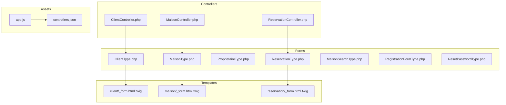
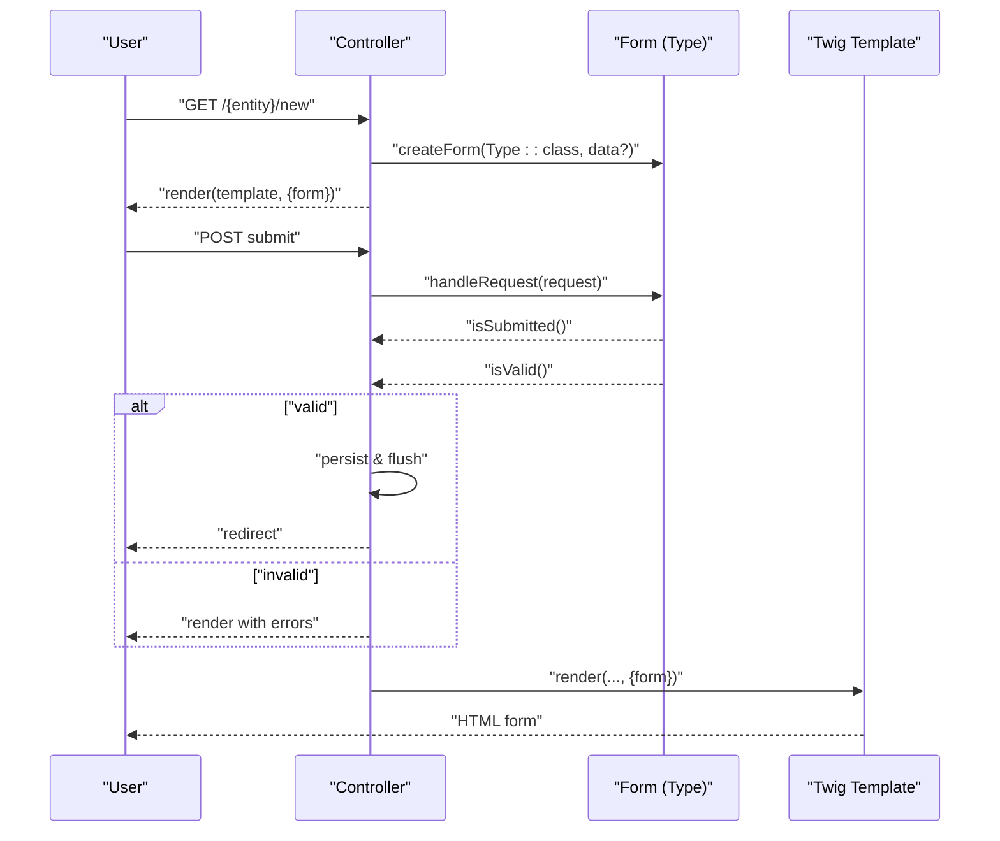
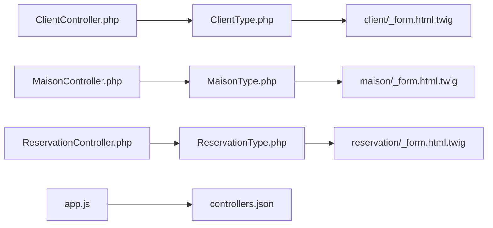
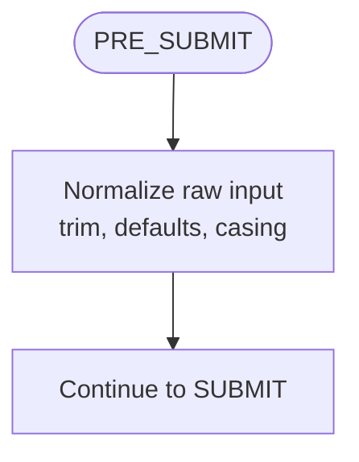
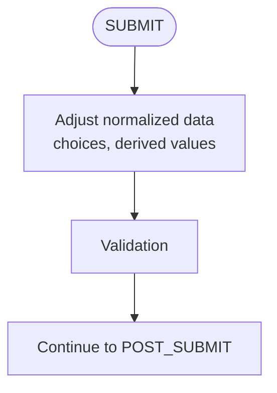
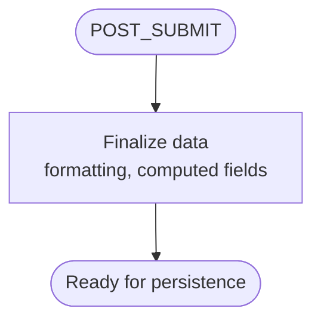

# Form Events and Customization

<cite>
**Referenced Files in This Document**
- [ClientType.php](file://src/Form/ClientType.php)
- [MaisonType.php](file://src/Form/MaisonType.php)
- [ProprietaireType.php](file://src/Form/ProprietaireType.php)
- [ReservationType.php](file://src/Form/ReservationType.php)
- [MaisonSearchType.php](file://src/Form/MaisonSearchType.php)
- [RegistrationFormType.php](file://src/Form/RegistrationFormType.php)
- [ResetPasswordType.php](file://src/Form/ResetPasswordType.php)
- [ClientController.php](file://src/Controller/ClientController.php)
- [MaisonController.php](file://src/Controller/MaisonController.php)
- [ReservationController.php](file://src/Controller/ReservationController.php)
- [_form.html.twig (client)](file://templates/client/_form.html.twig)
- [_form.html.twig (maison)](file://templates/maison/_form.html.twig)
- [_form.html.twig (reservation)](file://templates/reservation/_form.html.twig)
- [app.js](file://assets/app.js)
- [controllers.json](file://assets/controllers.json)
</cite>

## Table of Contents
1. [Introduction](#introduction)
2. [Project Structure](#project-structure)
3. [Core Components](#core-components)
4. [Architecture Overview](#architecture-overview)
5. [Detailed Component Analysis](#detailed-component-analysis)
6. [Dependency Analysis](#dependency-analysis)
7. [Performance Considerations](#performance-considerations)
8. [Troubleshooting Guide](#troubleshooting-guide)
9. [Conclusion](#conclusion)
10. [Appendices](#appendices)

## Introduction
This document explains Symfony form events and customization mechanisms as evidenced by the codebase. It focuses on:
- Form lifecycle events PRE_SUBMIT, SUBMIT, POST_SUBMIT and how they relate to form handling in controllers
- Event listener registration patterns and where to hook into the form lifecycle
- Form data modification during events and dynamic field manipulation
- Conditional field visibility and preprocessing/post-population transformations
- Data transformation and normalization
- JavaScript integration, Turbo integration, and client-side enhancements
- Performance optimization, memory management, and best practices for form events
- Customization patterns, inheritance, and reusable form components

Where applicable, we reference concrete files and lines to ground the explanations in actual code.

## Project Structure
The project organizes forms as PHP classes under src/Form, controllers under src/Controller, and Twig templates under templates. Forms are rendered via dedicated partials and integrated into pages through controllers.

**Diagram sources**
- [ClientType.php:1-28](file://src/Form/ClientType.php#L1-L28)
- [MaisonType.php:1-36](file://src/Form/MaisonType.php#L1-L36)
- [ProprietaireType.php:1-28](file://src/Form/ProprietaireType.php#L1-L28)
- [ReservationType.php:1-50](file://src/Form/ReservationType.php#L1-L50)
- [MaisonSearchType.php:1-33](file://src/Form/MaisonSearchType.php#L1-L33)
- [RegistrationFormType.php:1-56](file://src/Form/RegistrationFormType.php#L1-L56)
- [ResetPasswordType.php:1-52](file://src/Form/ResetPasswordType.php#L1-L52)
- [ClientController.php:1-82](file://src/Controller/ClientController.php#L1-L82)
- [MaisonController.php:1-82](file://src/Controller/MaisonController.php#L1-L82)
- [ReservationController.php:1-82](file://src/Controller/ReservationController.php#L1-L82)
- [_form.html.twig (client):1-30](file://templates/client/_form.html.twig#L1-L30)
- [_form.html.twig (maison):1-44](file://templates/maison/_form.html.twig#L1-L44)
- [_form.html.twig (reservation):1-36](file://templates/reservation/_form.html.twig#L1-L36)
- [app.js:1-11](file://assets/app.js#L1-L11)
- [controllers.json:1-16](file://assets/controllers.json#L1-L16)

**Section sources**
- [ClientType.php:1-28](file://src/Form/ClientType.php#L1-L28)
- [MaisonType.php:1-36](file://src/Form/MaisonType.php#L1-L36)
- [ClientController.php:1-82](file://src/Controller/ClientController.php#L1-L82)
- [_form.html.twig (client):1-30](file://templates/client/_form.html.twig#L1-L30)
- [app.js:1-11](file://assets/app.js#L1-L11)
- [controllers.json:1-16](file://assets/controllers.json#L1-L16)

## Core Components
- Form Types define fields, options, and data mapping. Examples:
  - ClientType: basic entity-backed form
  - MaisonType: includes an association field
  - ReservationType: date widgets and associations
  - MaisonSearchType: GET method form with CSRF disabled
  - RegistrationFormType: mapped/unmapped fields and constraints
  - ResetPasswordType: repeated password field
- Controllers create forms, handle requests, and render templates
- Templates render forms with explicit label/widget wrappers and Bootstrap classes

Key observations:
- Forms are created in controllers and bound to entities via data_class options
- Controllers call handleRequest and check isValid before persisting
- Templates render forms manually for fine-grained control and styling

**Section sources**
- [ClientType.php:10-27](file://src/Form/ClientType.php#L10-L27)
- [MaisonType.php:12-35](file://src/Form/MaisonType.php#L12-L35)
- [ReservationType.php:14-49](file://src/Form/ReservationType.php#L14-L49)
- [MaisonSearchType.php:12-33](file://src/Form/MaisonSearchType.php#L12-L33)
- [RegistrationFormType.php:15-55](file://src/Form/RegistrationFormType.php#L15-L55)
- [ResetPasswordType.php:12-51](file://src/Form/ResetPasswordType.php#L12-L51)
- [ClientController.php:25-43](file://src/Controller/ClientController.php#L25-L43)
- [_form.html.twig (client):1-30](file://templates/client/_form.html.twig#L1-L30)

## Architecture Overview
The typical flow is:
- Controller creates a form instance with a type and optional data
- handleRequest binds request data to the form
- Validation occurs after binding
- On success, controller persists data and redirects
- Templates render the form with explicit markup

**Diagram sources**
- [ClientController.php:25-43](file://src/Controller/ClientController.php#L25-L43)
- [MaisonController.php:25-43](file://src/Controller/MaisonController.php#L25-L43)
- [ReservationController.php:25-43](file://src/Controller/ReservationController.php#L25-L43)
- [_form.html.twig (client):1-30](file://templates/client/_form.html.twig#L1-L30)

## Detailed Component Analysis

### Form Lifecycle and Event Hooks
Symfony forms emit events during their lifecycle. While the current controllers do not explicitly attach listeners, the hooks exist and are commonly used for:
- PRE_SUBMIT: transform incoming raw data before normalization
- SUBMIT: adjust normalized data before validation
- POST_SUBMIT: finalize data after validation and normalization

Practical usage locations in this codebase:
- Controllers are the natural place to attach event listeners around form creation and handling
- Listener registration typically happens in services or controller actions before handleRequest

Recommended patterns:
- Attach listeners in controller actions or dedicated services
- Use form builders to add listeners when building the form structure
- Keep event logic small and focused to maintain readability

[No sources needed since this section provides general guidance]

### Dynamic Field Manipulation and Conditional Visibility
Dynamic fields and conditional visibility are typically implemented via:
- Event listeners that modify the form structure (add/remove fields)
- JavaScript/Turbo for client-side toggling
- Twig conditionals for rendering differences

Current codebase:
- No explicit event listeners for dynamic fields
- Turbo is enabled via controllers.json for Turbo Drive and Stream

Implementation ideas:
- Listen to PRE_SUBMIT/SUBMIT to alter choices or presence of fields based on submitted data
- Use JavaScript to toggle field visibility and enable/disable based on selections

**Section sources**
- [controllers.json:1-16](file://assets/controllers.json#L1-L16)

### Preprocessing, Post-population, and Data Transformation
Preprocessing:
- Use PRE_SUBMIT to normalize or transform raw input (trimming, casing, defaults)
- Use SUBMIT to adjust normalized data before validation

Post-population:
- Use POST_SUBMIT to finalize data after validation (e.g., derived values, formatting)

Current codebase:
- No explicit PRE_SUBMIT/SUBMIT listeners
- Data transformation can be centralized in entities or custom transformers/types

**Section sources**
- [MaisonSearchType.php:25-32](file://src/Form/MaisonSearchType.php#L25-L32)

### Form JavaScript Integration and Client-side Enhancement
The project integrates Stimulus and Turbo:
- app.js imports Stimulus and Bootstrap integration
- controllers.json enables Turbo core and optionally Mercure Turbo Stream

Client-side enhancement opportunities:
- Use Stimulus controllers to enhance form UX (conditional fields, real-time validation hints)
- Use Turbo Drive for seamless navigation and Turbo Streams for live updates

**Section sources**
- [app.js:1-11](file://assets/app.js#L1-L11)
- [controllers.json:1-16](file://assets/controllers.json#L1-L16)

### AJAX Form Submission and Turbo Integration
Turbo Drive and Streams are configured. You can:
- Wrap forms with Turbo Drive to submit without full page reloads
- Use Turbo Streams to update parts of the page after submission
- Combine with Stimulus for advanced UX behaviors

[No sources needed since this section provides general guidance]

### Form Customization Patterns, Inheritance, and Reusable Components
Patterns visible in the codebase:
- Base form types per entity (ClientType, MaisonType, etc.)
- Shared templates for form rendering (_form.html.twig partials)
- GET-based search form with CSRF disabled and method override

Reusability:
- Extract shared field groups into traits or base classes
- Centralize common options (data_class, constraints) in base classes
- Use form extensions or custom field types for domain-specific widgets

**Section sources**
- [ClientType.php:10-27](file://src/Form/ClientType.php#L10-L27)
- [MaisonType.php:12-35](file://src/Form/MaisonType.php#L12-L35)
- [MaisonSearchType.php:12-33](file://src/Form/MaisonSearchType.php#L12-L33)
- [_form.html.twig (client):1-30](file://templates/client/_form.html.twig#L1-L30)
- [_form.html.twig (maison):1-44](file://templates/maison/_form.html.twig#L1-L44)
- [_form.html.twig (reservation):1-36](file://templates/reservation/_form.html.twig#L1-L36)

### Example Workflows and Event Handling

#### Example: Adding a PRE_SUBMIT Listener in a Controller
- Purpose: Normalize phone numbers or trim whitespace
- Where: In the controller action before handleRequest
- How: Attach a listener to the form builder or form instance

[No sources needed since this section provides general guidance]

#### Example: Conditional Field Visibility
- Purpose: Show/hide related fields based on selection
- Where: In a Stimulus controller or via server-side event listeners
- How: Modify form structure in PRE_SUBMIT/SUBMIT or toggle visibility via JS

[No sources needed since this section provides general guidance]

#### Example: POST_SUBMIT Finalization
- Purpose: Set computed values or derived flags
- Where: In a POST_SUBMIT listener
- How: Access the form data and apply transformations

[No sources needed since this section provides general guidance]

## Dependency Analysis
The primary dependencies are:
- Controllers depend on Form Types to create forms
- Templates depend on form variables passed by controllers
- Assets integrate Turbo and Stimulus for client-side enhancements

**Diagram sources**
- [ClientController.php:25-43](file://src/Controller/ClientController.php#L25-L43)
- [MaisonController.php:25-43](file://src/Controller/MaisonController.php#L25-L43)
- [ReservationController.php:25-43](file://src/Controller/ReservationController.php#L25-L43)
- [ClientType.php:10-27](file://src/Form/ClientType.php#L10-L27)
- [MaisonType.php:12-35](file://src/Form/MaisonType.php#L12-L35)
- [ReservationType.php:14-49](file://src/Form/ReservationType.php#L14-L49)
- [_form.html.twig (client):1-30](file://templates/client/_form.html.twig#L1-L30)
- [_form.html.twig (maison):1-44](file://templates/maison/_form.html.twig#L1-L44)
- [_form.html.twig (reservation):1-36](file://templates/reservation/_form.html.twig#L1-L36)
- [app.js:1-11](file://assets/app.js#L1-L11)
- [controllers.json:1-16](file://assets/controllers.json#L1-L16)

**Section sources**
- [ClientController.php:25-43](file://src/Controller/ClientController.php#L25-L43)
- [MaisonController.php:25-43](file://src/Controller/MaisonController.php#L25-L43)
- [ReservationController.php:25-43](file://src/Controller/ReservationController.php#L25-L43)
- [ClientType.php:10-27](file://src/Form/ClientType.php#L10-L27)
- [MaisonType.php:12-35](file://src/Form/MaisonType.php#L12-L35)
- [ReservationType.php:14-49](file://src/Form/ReservationType.php#L14-L49)
- [_form.html.twig (client):1-30](file://templates/client/_form.html.twig#L1-L30)
- [_form.html.twig (maison):1-44](file://templates/maison/_form.html.twig#L1-L44)
- [_form.html.twig (reservation):1-36](file://templates/reservation/_form.html.twig#L1-L36)
- [app.js:1-11](file://assets/app.js#L1-L11)
- [controllers.json:1-16](file://assets/controllers.json#L1-L16)

## Performance Considerations
- Minimize heavy work in PRE_SUBMIT/SUBMIT; delegate to services or lazy loaders
- Avoid unnecessary entity fetches in listeners; use identifiers and repositories
- Prefer client-side toggles (JS/Turbo) for simple UI changes to reduce server round-trips
- Use form options like compound=false for simple scalar fields to reduce overhead
- Keep templates lean; avoid excessive Twig logic inside forms
- Use caching for expensive choices in EntityType fields

[No sources needed since this section provides general guidance]

## Troubleshooting Guide
Common issues and remedies:
- Form not updating: ensure handleRequest is called and isValid is checked
- CSRF failures: verify CSRF tokens and methods; search forms override method and disable CSRF intentionally
- Dynamic fields not appearing: confirm listeners are attached and conditions match expected data
- Client-side enhancements not working: verify Turbo and Stimulus are loaded and controllers.json is correct

**Section sources**
- [MaisonSearchType.php:25-32](file://src/Form/MaisonSearchType.php#L25-L32)
- [controllers.json:1-16](file://assets/controllers.json#L1-L16)

## Conclusion
The codebase demonstrates standard Symfony form usage with entity-backed types, controller-driven handling, and manual Twig rendering. To unlock advanced behaviors—dynamic fields, conditional visibility, and robust data transformation—introduce event listeners around PRE_SUBMIT, SUBMIT, and POST_SUBMIT, and leverage Turbo/Stimulus for client-side enhancements. Adopt reusable patterns and keep event logic minimal and testable.

[No sources needed since this section summarizes without analyzing specific files]

## Appendices

### Appendix A: Event Listener Registration Locations
- In controller actions: attach listeners before handleRequest
- In services: inject FormFactory/FormRegistry and attach to form instances
- In form types: use buildForm to add listeners to the builder

[No sources needed since this section provides general guidance]

### Appendix B: Example Event Flow Diagrams

#### PRE_SUBMIT Flow

[No sources needed since this diagram shows conceptual workflow]

#### SUBMIT Flow

[No sources needed since this diagram shows conceptual workflow]

#### POST_SUBMIT Flow

[No sources needed since this diagram shows conceptual workflow]