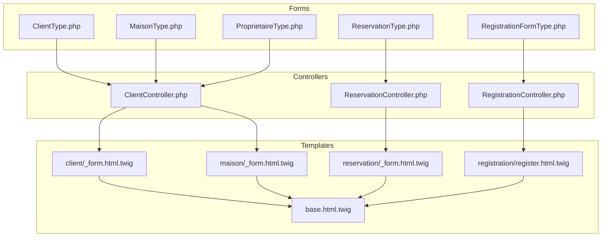
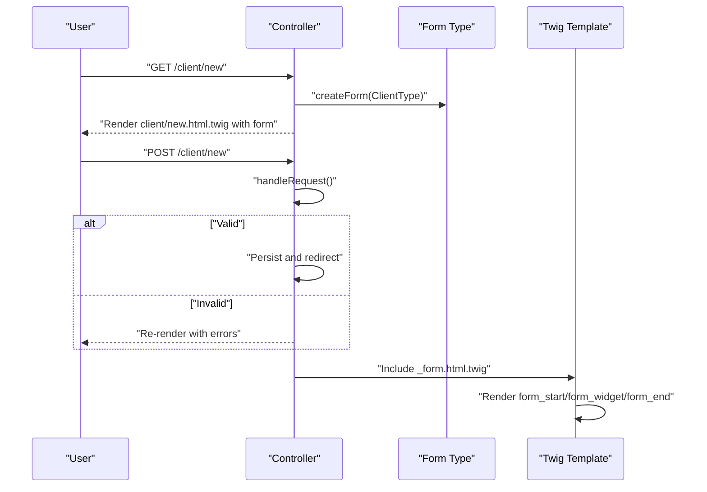
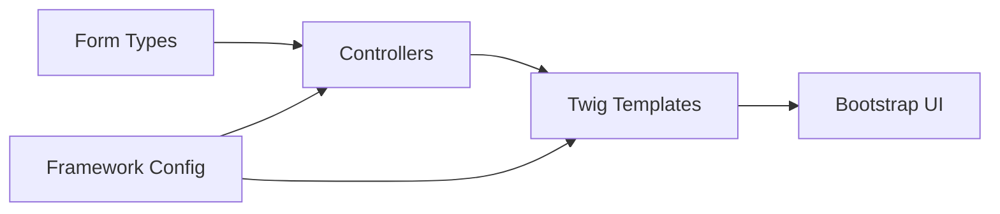

# Form Rendering and Twig Templates

<cite>
**Referenced Files in This Document**
- [ClientType.php](file://src/Form/ClientType.php)
- [MaisonType.php](file://src/Form/MaisonType.php)
- [ProprietaireType.php](file://src/Form/ProprietaireType.php)
- [RegistrationFormType.php](file://src/Form/RegistrationFormType.php)
- [ReservationType.php](file://src/Form/ReservationType.php)
- [ClientController.php](file://src/Controller/ClientController.php)
- [RegistrationController.php](file://src/Controller/RegistrationController.php)
- [ReservationController.php](file://src/Controller/ReservationController.php)
- [_form.html.twig (client)](file://templates/client/_form.html.twig)
- [_form.html.twig (maison)](file://templates/maison/_form.html.twig)
- [_form.html.twig (reservation)](file://templates/reservation/_form.html.twig)
- [register.html.twig](file://templates/registration/register.html.twig)
- [base.html.twig](file://templates/base.html.twig)
- [twig.yaml](file://config/packages/twig.yaml)
- [framework.yaml](file://config/packages/framework.yaml)
- [twig_component.yaml](file://config/packages/twig_component.yaml)
</cite>

## Table of Contents
1. [Introduction](#introduction)
2. [Project Structure](#project-structure)
3. [Core Components](#core-components)
4. [Architecture Overview](#architecture-overview)
5. [Detailed Component Analysis](#detailed-component-analysis)
6. [Dependency Analysis](#dependency-analysis)
7. [Performance Considerations](#performance-considerations)
8. [Troubleshooting Guide](#troubleshooting-guide)
9. [Conclusion](#conclusion)
10. [Appendices](#appendices)

## Introduction
This document explains how forms are built and rendered across the application using Symfony Forms and Twig. It focuses on:
- Form rendering helpers (form_start, form_widget, form_end)
- Field-level rendering, labels, errors, and accessibility
- Theme customization and Bootstrap integration
- Layout patterns, conditional rendering, and dynamic modifications
- CSRF protection, validation error display, and responsive design
- Reusable form components and practical examples from the codebase

## Project Structure
The form system spans PHP form types, controllers, and Twig templates:
- Form types define fields and validation constraints
- Controllers create forms, handle submissions, and render templates
- Twig templates render forms with Bootstrap classes and error handling

**Diagram sources**
- [ClientType.php:1-28](file://src/Form/ClientType.php#L1-L28)
- [MaisonType.php:1-36](file://src/Form/MaisonType.php#L1-L36)
- [ProprietaireType.php:1-28](file://src/Form/ProprietaireType.php#L1-L28)
- [RegistrationFormType.php:1-56](file://src/Form/RegistrationFormType.php#L1-L56)
- [ReservationType.php:1-50](file://src/Form/ReservationType.php#L1-L50)
- [ClientController.php:1-82](file://src/Controller/ClientController.php#L1-L82)
- [RegistrationController.php:1-44](file://src/Controller/RegistrationController.php#L1-L44)
- [ReservationController.php:1-82](file://src/Controller/ReservationController.php#L1-L82)
- [_form.html.twig (client):1-30](file://templates/client/_form.html.twig#L1-L30)
- [_form.html.twig (maison):1-44](file://templates/maison/_form.html.twig#L1-L44)
- [_form.html.twig (reservation):1-36](file://templates/reservation/_form.html.twig#L1-L36)
- [register.html.twig:1-42](file://templates/registration/register.html.twig#L1-L42)
- [base.html.twig:1-184](file://templates/base.html.twig#L1-L184)

**Section sources**
- [ClientType.php:1-28](file://src/Form/ClientType.php#L1-L28)
- [MaisonType.php:1-36](file://src/Form/MaisonType.php#L1-L36)
- [ProprietaireType.php:1-28](file://src/Form/ProprietaireType.php#L1-L28)
- [RegistrationFormType.php:1-56](file://src/Form/RegistrationFormType.php#L1-L56)
- [ReservationType.php:1-50](file://src/Form/ReservationType.php#L1-L50)
- [ClientController.php:1-82](file://src/Controller/ClientController.php#L1-L82)
- [RegistrationController.php:1-44](file://src/Controller/RegistrationController.php#L1-L44)
- [ReservationController.php:1-82](file://src/Controller/ReservationController.php#L1-L82)
- [_form.html.twig (client):1-30](file://templates/client/_form.html.twig#L1-L30)
- [_form.html.twig (maison):1-44](file://templates/maison/_form.html.twig#L1-L44)
- [_form.html.twig (reservation):1-36](file://templates/reservation/_form.html.twig#L1-L36)
- [register.html.twig:1-42](file://templates/registration/register.html.twig#L1-L42)
- [base.html.twig:1-184](file://templates/base.html.twig#L1-L184)

## Core Components
- Form Types: Define fields, options, and constraints for domain entities.
- Controllers: Build forms, process submissions, and render views.
- Twig Templates: Render forms with Bootstrap classes, labels, and error blocks.

Key capabilities demonstrated:
- Explicit field rendering with labels and widgets
- Error rendering per field and globally
- Bootstrap-styled controls and layout containers
- CSRF protection via framework configuration and controller checks

**Section sources**
- [ClientType.php:12-26](file://src/Form/ClientType.php#L12-L26)
- [MaisonType.php:14-34](file://src/Form/MaisonType.php#L14-L34)
- [ProprietaireType.php:12-26](file://src/Form/ProprietaireType.php#L12-L26)
- [RegistrationFormType.php:17-54](file://src/Form/RegistrationFormType.php#L17-L54)
- [ReservationType.php:16-48](file://src/Form/ReservationType.php#L16-L48)
- [ClientController.php:25-42](file://src/Controller/ClientController.php#L25-L42)
- [RegistrationController.php:16-42](file://src/Controller/RegistrationController.php#L16-L42)
- [ReservationController.php:25-42](file://src/Controller/ReservationController.php#L25-L42)
- [_form.html.twig (client):1-29](file://templates/client/_form.html.twig#L1-L29)
- [_form.html.twig (maison):1-43](file://templates/maison/_form.html.twig#L1-L43)
- [_form.html.twig (reservation):1-35](file://templates/reservation/_form.html.twig#L1-L35)
- [register.html.twig:13-37](file://templates/registration/register.html.twig#L13-L37)

## Architecture Overview
The form rendering pipeline connects form types, controllers, and templates:

**Diagram sources**
- [ClientController.php:25-42](file://src/Controller/ClientController.php#L25-L42)
- [ClientType.php:12-26](file://src/Form/ClientType.php#L12-L26)
- [_form.html.twig (client):1-29](file://templates/client/_form.html.twig#L1-L29)

## Detailed Component Analysis

### Form Rendering Helpers
- form_start(form): Opens the form tag with method and action attributes.
- form_widget(form.field, { attr: { class: ... } }): Renders the input element with Bootstrap classes.
- form_label(form.field): Renders the label with proper for attribute.
- form_errors(form.field): Displays field-specific validation errors.
- form_errors(form): Displays global form errors.
- form_end(form): Closes the form tag.

Patterns in templates:
- Explicit label/widget pairing with Bootstrap form-control classes
- Global form_errors at the top of registration form
- Field-specific error blocks beneath inputs

**Section sources**
- [_form.html.twig (client):1-29](file://templates/client/_form.html.twig#L1-L29)
- [_form.html.twig (maison):1-43](file://templates/maison/_form.html.twig#L1-L43)
- [_form.html.twig (reservation):1-35](file://templates/reservation/_form.html.twig#L1-L35)
- [register.html.twig:13-37](file://templates/registration/register.html.twig#L13-L37)

### Form Fields and Widgets
- Text inputs: username, title, description, price, city, name, surname, email
- Password input: plainPassword with autocomplete attribute
- Checkbox: agreeTerms mapped to false to avoid persisting to entity
- DateType single_text widget with form-control class
- EntityType selects for related entities (proprietaires, client, maison)

Field-level customization:
- attr classes applied to widgets for Bootstrap styling
- choice_label configured for EntityType fields
- widget option for DateType to use compact single_text input

**Section sources**
- [RegistrationFormType.php:17-54](file://src/Form/RegistrationFormType.php#L17-L54)
- [ReservationType.php:16-48](file://src/Form/ReservationType.php#L16-L48)
- [MaisonType.php:14-34](file://src/Form/MaisonType.php#L14-L34)
- [ClientType.php:12-26](file://src/Form/ClientType.php#L12-L26)
- [ProprietaireType.php:12-26](file://src/Form/ProprietaireType.php#L12-L26)

### Error Display and Accessibility
- Global errors: form_errors(form) at the top of registration form
- Field-specific errors: form_errors(form.field) placed after each input
- Labels: form_label(form.field) paired with matching for attribute on inputs
- Bootstrap classes: form-label for labels, form-control for inputs, form-check-input and form-check-label for checkbox

Accessibility considerations:
- Proper label-for linkage ensures screen readers announce labels
- Semantic markup with div wrappers around form groups
- Clear error messages positioned close to affected fields

**Section sources**
- [register.html.twig:13-37](file://templates/registration/register.html.twig#L13-L37)
- [_form.html.twig (client):4-22](file://templates/client/_form.html.twig#L4-L22)
- [_form.html.twig (maison):3-36](file://templates/maison/_form.html.twig#L3-L36)
- [_form.html.twig (reservation):3-29](file://templates/reservation/_form.html.twig#L3-L29)

### Bootstrap Integration and Responsive Design
- Base template loads Bootstrap 5 CSS and JS from CDN
- Cards, buttons, grid classes (row, col-*), and spacing utilities used
- Consistent form-control classes on inputs and form-label on labels
- Responsive container and column sizing in registration form

Responsive patterns:
- Centered card layout with col-md-6 and col-lg-5 widths
- Flex utilities and gap classes for spacing
- Alert dismissible behavior with Bootstrap JS

**Section sources**
- [base.html.twig:8-90](file://templates/base.html.twig#L8-L90)
- [register.html.twig:6-41](file://templates/registration/register.html.twig#L6-L41)

### Form Theme Customization
- No custom form themes are defined in the configuration files
- Rendering relies on default Symfony form themes with explicit widget attributes
- Customization achieved by passing attr options and wrapping labels/widgets in Bootstrap markup

Opportunities:
- Create a custom form theme to centralize label and error rendering
- Define macros for reusable form-group patterns
- Integrate icons or help text consistently across fields

**Section sources**
- [twig.yaml:1-7](file://config/packages/twig.yaml#L1-L7)
- [framework.yaml:1-16](file://config/packages/framework.yaml#L1-L16)

### CSRF Protection
- CSRF tokens are enabled by default in the framework configuration
- Controllers validate CSRF tokens for destructive actions using token-based checks
- Tokens are embedded automatically in forms; controllers verify them during POST

Security pattern:
- Token generation and embedding via framework
- Validation via isCsrfTokenValid in controllers for delete routes

**Section sources**
- [framework.yaml:1-16](file://config/packages/framework.yaml#L1-L16)
- [ClientController.php:74-79](file://src/Controller/ClientController.php#L74-L79)
- [ReservationController.php:74-79](file://src/Controller/ReservationController.php#L74-L79)

### Conditional Field Rendering and Dynamic Modification
- Checkbox field agreeTerms is mapped to false to prevent persistence
- DateType fields use single_text widget for compact presentation
- EntityType fields populate select options from related entities

Dynamic behavior:
- Selection lists are populated server-side from repositories
- Widget selection impacts UX (single-line date picker vs. three-select)

**Section sources**
- [RegistrationFormType.php:21-28](file://src/Form/RegistrationFormType.php#L21-L28)
- [ReservationType.php:19-30](file://src/Form/ReservationType.php#L19-L30)
- [MaisonType.php:22-25](file://src/Form/MaisonType.php#L22-L25)

### Form Layout Patterns
- Vertical stacked layout with labeled inputs and inline error messages
- Card-based registration form with header and body sections
- Simple two-column grid for responsive alignment
- Consistent use of Bootstrap utility classes for spacing and alignment

Layout examples:
- Client and Maison forms wrap each field in a div with label and widget
- Reservation form mirrors the same pattern for entity relations and dates
- Registration form demonstrates a cohesive card layout with global and field-level errors

**Section sources**
- [_form.html.twig (client):1-29](file://templates/client/_form.html.twig#L1-L29)
- [_form.html.twig (maison):1-43](file://templates/maison/_form.html.twig#L1-L43)
- [_form.html.twig (reservation):1-35](file://templates/reservation/_form.html.twig#L1-L35)
- [register.html.twig:5-41](file://templates/registration/register.html.twig#L5-L41)

### Form Component Reusability
- Shared partials: _form.html.twig reused across client, maison, and reservation contexts
- Centralized base template provides consistent Bootstrap scaffolding
- Twig components configuration enables building reusable UI components

Recommendations:
- Extract macros for form-group rendering to reduce duplication
- Create a base form macro that accepts label, widget, errors, and attributes
- Use twig_component to encapsulate complex widgets as components

**Section sources**
- [_form.html.twig (client):1-29](file://templates/client/_form.html.twig#L1-L29)
- [_form.html.twig (maison):1-43](file://templates/maison/_form.html.twig#L1-L43)
- [_form.html.twig (reservation):1-35](file://templates/reservation/_form.html.twig#L1-L35)
- [base.html.twig:1-184](file://templates/base.html.twig#L1-L184)
- [twig_component.yaml:1-5](file://config/packages/twig_component.yaml#L1-L5)

### Examples of Form Templates and Bootstrap Integration
- Client form: Explicit label/widget pairs with form-control classes and a submit button
- Maison form: Similar structure with additional fields and consistent Bootstrap styling
- Reservation form: Uses DateType single_text widgets and entity selects styled with form-control
- Registration form: Comprehensive example with global errors, field-specific errors, and card layout

**Section sources**
- [_form.html.twig (client):1-29](file://templates/client/_form.html.twig#L1-L29)
- [_form.html.twig (maison):1-43](file://templates/maison/_form.html.twig#L1-L43)
- [_form.html.twig (reservation):1-35](file://templates/reservation/_form.html.twig#L1-L35)
- [register.html.twig:13-37](file://templates/registration/register.html.twig#L13-L37)

## Dependency Analysis
Form rendering depends on:
- Form types for field definitions and constraints
- Controllers for form creation, handling, and rendering
- Twig templates for presentation and Bootstrap integration
- Framework configuration for CSRF and sessions

**Diagram sources**
- [ClientType.php:12-26](file://src/Form/ClientType.php#L12-L26)
- [RegistrationFormType.php:17-54](file://src/Form/RegistrationFormType.php#L17-L54)
- [ReservationType.php:16-48](file://src/Form/ReservationType.php#L16-L48)
- [ClientController.php:25-42](file://src/Controller/ClientController.php#L25-L42)
- [RegistrationController.php:16-42](file://src/Controller/RegistrationController.php#L16-L42)
- [ReservationController.php:25-42](file://src/Controller/ReservationController.php#L25-L42)
- [_form.html.twig (client):1-29](file://templates/client/_form.html.twig#L1-L29)
- [register.html.twig:13-37](file://templates/registration/register.html.twig#L13-L37)
- [framework.yaml:1-16](file://config/packages/framework.yaml#L1-L16)

**Section sources**
- [ClientType.php:12-26](file://src/Form/ClientType.php#L12-L26)
- [RegistrationFormType.php:17-54](file://src/Form/RegistrationFormType.php#L17-L54)
- [ReservationType.php:16-48](file://src/Form/ReservationType.php#L16-L48)
- [ClientController.php:25-42](file://src/Controller/ClientController.php#L25-L42)
- [RegistrationController.php:16-42](file://src/Controller/RegistrationController.php#L16-L42)
- [ReservationController.php:25-42](file://src/Controller/ReservationController.php#L25-L42)
- [_form.html.twig (client):1-29](file://templates/client/_form.html.twig#L1-L29)
- [register.html.twig:13-37](file://templates/registration/register.html.twig#L13-L37)
- [framework.yaml:1-16](file://config/packages/framework.yaml#L1-L16)

## Performance Considerations
- Keep form types minimal and focused; avoid heavy computations in buildForm
- Prefer EntityType choices with appropriate query builders to limit result sets
- Use single_text widgets for date/time fields to reduce DOM complexity
- Cache frequently accessed select options when possible
- Minimize repeated error rendering by consolidating where appropriate

## Troubleshooting Guide
Common issues and resolutions:
- Missing labels or incorrect for attributes: Ensure form_label is paired with the matching input id
- Unstyled inputs: Verify attr classes include form-control and labels include form-label
- CSRF failures on delete: Confirm isCsrfTokenValid is called with correct domain object id and token value
- Global errors not visible: Add form_errors(form) at the top of the form block
- Checkbox not validating: For unmapped fields like agreeTerms, ensure mapped is false and constraints are present

**Section sources**
- [ClientController.php:74-79](file://src/Controller/ClientController.php#L74-L79)
- [RegistrationFormType.php:21-28](file://src/Form/RegistrationFormType.php#L21-L28)
- [register.html.twig:13-19](file://templates/registration/register.html.twig#L13-L19)

## Conclusion
The application demonstrates robust form rendering with explicit field control, Bootstrap integration, and consistent error handling. By leveraging form_start, form_widget, and form_end helpers alongside semantic labels and error blocks, the templates provide accessible and responsive forms. Controllers manage CSRF protection and validation outcomes, while shared partials promote reuse. Extending the system with custom form themes or Twig components can further improve maintainability and consistency.

## Appendices
- Configuration references:
  - Twig configuration: [twig.yaml:1-7](file://config/packages/twig.yaml#L1-L7)
  - Framework configuration: [framework.yaml:1-16](file://config/packages/framework.yaml#L1-L16)
  - Twig components configuration: [twig_component.yaml:1-5](file://config/packages/twig_component.yaml#L1-L5)