# Form Type Creation and Configuration

<cite>
**Referenced Files in This Document**
- [MaisonType.php](file://src/Form/MaisonType.php)
- [ClientType.php](file://src/Form/ClientType.php)
- [ProprietaireType.php](file://src/Form/ProprietaireType.php)
- [MaisonSearchType.php](file://src/Form/MaisonSearchType.php)
- [ReservationType.php](file://src/Form/ReservationType.php)
- [RegistrationFormType.php](file://src/Form/RegistrationFormType.php)
- [ResetPasswordType.php](file://src/Form/ResetPasswordType.php)
- [Maison.php](file://src/Entity/Maison.php)
- [Client.php](file://src/Entity/Client.php)
- [Proprietaire.php](file://src/Entity/Proprietaire.php)
- [Reservation.php](file://src/Entity/Reservation.php)
- [User.php](file://src/Entity/User.php)
- [MaisonController.php](file://src/Controller/MaisonController.php)
- [ClientController.php](file://src/Controller/ClientController.php)
- [ReservationController.php](file://src/Controller/ReservationController.php)
</cite>

## Table of Contents
1. [Introduction](#introduction)
2. [Project Structure](#project-structure)
3. [Core Components](#core-components)
4. [Architecture Overview](#architecture-overview)
5. [Detailed Component Analysis](#detailed-component-analysis)
6. [Dependency Analysis](#dependency-analysis)
7. [Performance Considerations](#performance-considerations)
8. [Troubleshooting Guide](#troubleshooting-guide)
9. [Conclusion](#conclusion)
10. [Appendices](#appendices)

## Introduction
This document explains how Symfony form types are created and configured in this project. It focuses on the AbstractType class structure, form builder configuration, field definition patterns, option configuration, and data class binding. It also covers EntityType integration, choice fields, collection fields, form type services, dependency injection in form types, form type extensions, validation integration, custom form type creation, and reuse patterns. Practical examples are drawn from MaisonType, ClientType, and other form types, along with their associated entities and controllers.

## Project Structure
The form types live under src/Form and are paired with entities under src/Entity. Controllers orchestrate form creation and submission via createForm and handleRequest, then persist entities on successful validation.

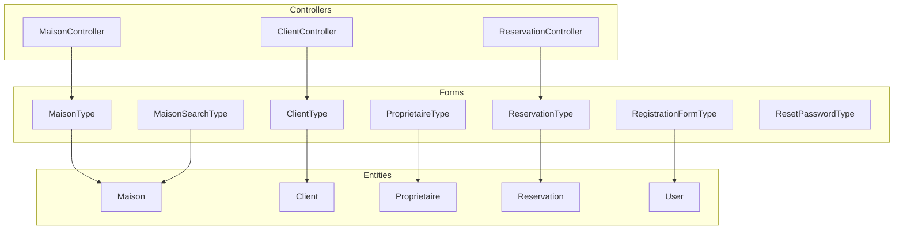

**Diagram sources**
- [MaisonType.php:12-35](file://src/Form/MaisonType.php#L12-L35)
- [ClientType.php:10-27](file://src/Form/ClientType.php#L10-L27)
- [ProprietaireType.php:10-27](file://src/Form/ProprietaireType.php#L10-L27)
- [MaisonSearchType.php:12-32](file://src/Form/MaisonSearchType.php#L12-L32)
- [ReservationType.php:14-49](file://src/Form/ReservationType.php#L14-L49)
- [RegistrationFormType.php:15-55](file://src/Form/RegistrationFormType.php#L15-L55)
- [ResetPasswordType.php:12-51](file://src/Form/ResetPasswordType.php#L12-L51)
- [Maison.php:10-117](file://src/Entity/Maison.php#L10-L117)
- [Client.php:9-70](file://src/Entity/Client.php#L9-L70)
- [Proprietaire.php:9-69](file://src/Entity/Proprietaire.php#L9-L69)
- [Reservation.php:9-99](file://src/Entity/Reservation.php#L9-L99)
- [User.php:14-118](file://src/Entity/User.php#L14-L118)
- [MaisonController.php:15-81](file://src/Controller/MaisonController.php#L15-L81)
- [ClientController.php:15-81](file://src/Controller/ClientController.php#L15-L81)
- [ReservationController.php:15-81](file://src/Controller/ReservationController.php#L15-L81)

**Section sources**
- [MaisonType.php:12-35](file://src/Form/MaisonType.php#L12-L35)
- [ClientType.php:10-27](file://src/Form/ClientType.php#L10-L27)
- [MaisonController.php:15-81](file://src/Controller/MaisonController.php#L15-L81)

## Core Components
- AbstractType class structure: Each form type extends AbstractType and implements two primary methods:
  - buildForm: Defines the fields and their configuration.
  - configureOptions: Sets defaults such as data_class and method-specific options.
- Field definition patterns:
  - Simple scalar fields: add('fieldName').
  - Choice/entity fields: add('field', EntityType::class, [...]).
  - Specialized fields: add('field', DateType::class, [...]), add('field', RepeatedType::class, [...]).
- Option configuration:
  - data_class binds the form to an entity class.
  - method and csrf_protection can be customized per form type.
- Data class binding:
  - Forms bind to entities via data_class, enabling automatic mapping of submitted data to entity setters/getters.

Examples in this project:
- MaisonType binds to Maison and adds multiple scalar fields plus an EntityType field for Proprietaire.
- ClientType and ProprietaireType bind to their respective entities and define basic scalar fields.
- ReservationType binds to Reservation and integrates Client and Maison via EntityType.
- RegistrationFormType and ResetPasswordType demonstrate specialized field types and constraints.
- MaisonSearchType binds to a search DTO-like entity and disables CSRF for GET submissions.

**Section sources**
- [MaisonType.php:12-35](file://src/Form/MaisonType.php#L12-L35)
- [ClientType.php:10-27](file://src/Form/ClientType.php#L10-L27)
- [ProprietaireType.php:10-27](file://src/Form/ProprietaireType.php#L10-L27)
- [ReservationType.php:14-49](file://src/Form/ReservationType.php#L14-L49)
- [RegistrationFormType.php:15-55](file://src/Form/RegistrationFormType.php#L15-L55)
- [ResetPasswordType.php:12-51](file://src/Form/ResetPasswordType.php#L12-L51)
- [MaisonSearchType.php:12-32](file://src/Form/MaisonSearchType.php#L12-L32)

## Architecture Overview
The typical flow is:
- Controller creates a form instance with createForm(Type::class, $entityOrData).
- The form processes incoming requests via handleRequest.
- On submission, isValid checks pass, and the controller persists the entity.

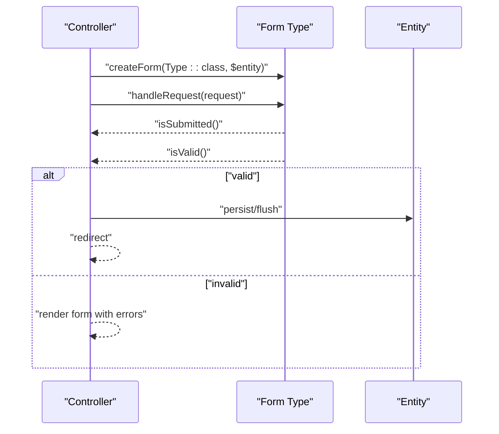

**Diagram sources**
- [MaisonController.php:25-42](file://src/Controller/MaisonController.php#L25-L42)
- [ClientController.php:25-42](file://src/Controller/ClientController.php#L25-L42)
- [ReservationController.php:25-42](file://src/Controller/ReservationController.php#L25-L42)
- [MaisonType.php:12-35](file://src/Form/MaisonType.php#L12-L35)
- [ClientType.php:10-27](file://src/Form/ClientType.php#L10-L27)
- [ReservationType.php:14-49](file://src/Form/ReservationType.php#L14-L49)

## Detailed Component Analysis

### AbstractType Class Structure
- buildForm(FormBuilderInterface $builder, array $options): Adds fields to the form builder.
- configureOptions(OptionsResolver $resolver): Sets defaults like data_class and method.

Key patterns:
- Scalar fields: add('field').
- Choice fields: add('field', EntityType::class, ['class' => ..., 'choice_label' => ...]).
- Specialized fields: DateType, RepeatedType, SubmitType, CheckboxType, PasswordType.

**Section sources**
- [MaisonType.php:12-35](file://src/Form/MaisonType.php#L12-L35)
- [ClientType.php:10-27](file://src/Form/ClientType.php#L10-L27)
- [ProprietaireType.php:10-27](file://src/Form/ProprietaireType.php#L10-L27)
- [ReservationType.php:14-49](file://src/Form/ReservationType.php#L14-L49)
- [RegistrationFormType.php:15-55](file://src/Form/RegistrationFormType.php#L15-L55)
- [ResetPasswordType.php:12-51](file://src/Form/ResetPasswordType.php#L12-L51)
- [MaisonSearchType.php:12-32](file://src/Form/MaisonSearchType.php#L12-L32)

### Form Builder Configuration and Field Definition Patterns
- Scalar fields: add('title'), add('description'), add('price'), add('city'), add('image').
- Choice fields: add('proprietaires', EntityType::class, ['class' => Proprietaire::class, 'choice_label' => 'id']).
- Date fields: add('dateDebut', DateType::class, ['widget' => 'single_text', 'attr' => [...]]) and similarly for dateFin.
- Specialized fields: RepeatedType for password confirmation, SubmitType for submit button, CheckboxType for terms agreement.

**Section sources**
- [MaisonType.php:14-26](file://src/Form/MaisonType.php#L14-L26)
- [ReservationType.php:16-40](file://src/Form/ReservationType.php#L16-L40)
- [ResetPasswordType.php:14-42](file://src/Form/ResetPasswordType.php#L14-L42)
- [RegistrationFormType.php:17-46](file://src/Form/RegistrationFormType.php#L17-L46)

### Option Configuration and Data Class Binding
- data_class: Binds the form to an entity class so that submitted data maps to the entity.
- Method and CSRF: For search forms, method can be forced to GET and CSRF disabled to simplify query handling.

Examples:
- MaisonType, ClientType, ProprietaireType, ReservationType set data_class to their respective entities.
- MaisonSearchType sets data_class to a search entity and configures method to GET with csrf_protection disabled.

**Section sources**
- [MaisonType.php:29-34](file://src/Form/MaisonType.php#L29-L34)
- [ClientType.php:21-26](file://src/Form/ClientType.php#L21-L26)
- [ProprietaireType.php:21-26](file://src/Form/ProprietaireType.php#L21-L26)
- [ReservationType.php:43-48](file://src/Form/ReservationType.php#L43-L48)
- [MaisonSearchType.php:25-32](file://src/Form/MaisonSearchType.php#L25-L32)

### EntityType Integration
- Proprietaire selection in MaisonType uses EntityType with class and choice_label.
- Client and Maison selection in ReservationType use EntityType to link related entities.
- Search form uses EntityType to select a Maison with label customization and optional selection.

Best practices shown:
- Use choice_label to control how options are rendered.
- Set required false for optional filters.
- Keep class aligned with the target entity.

**Section sources**
- [MaisonType.php:22-25](file://src/Form/MaisonType.php#L22-L25)
- [ReservationType.php:32-39](file://src/Form/ReservationType.php#L32-L39)
- [MaisonSearchType.php:16-22](file://src/Form/MaisonSearchType.php#L16-L22)

### Choice Fields and Collection Fields
- Choice fields: Defined via EntityType with class and choice_label.
- Collections: Not present in the analyzed files; however, Symfony’s CollectionType can be used similarly by adding a field with CollectionType::class and configuring entry_type and allow_add/allow_delete options.

Note: The current codebase does not include explicit collection fields. When needed, follow the same pattern as EntityType: add('field', CollectionType::class, [...]).

**Section sources**
- [MaisonType.php:22-25](file://src/Form/MaisonType.php#L22-L25)
- [ReservationType.php:32-39](file://src/Form/ReservationType.php#L32-L39)

### Form Type Services and Dependency Injection
- Form types are service-like and instantiated by the Form Factory. They are not declared as services in services.yaml in the provided context.
- To inject services into a form type, declare it as a service and add constructor arguments. The form factory will pass the service during instantiation.
- Example pattern:
  - Declare the form type as a service.
  - Add a constructor parameter for the injected service.
  - Use the injected service inside buildForm or other methods.

Note: No explicit service declaration was found in the provided services configuration. If dependency injection is required, follow the above pattern.

**Section sources**
- [MaisonType.php:12-35](file://src/Form/MaisonType.php#L12-L35)
- [ClientType.php:10-27](file://src/Form/ClientType.php#L10-L27)
- [ReservationType.php:14-49](file://src/Form/ReservationType.php#L14-L49)

### Form Type Extensions
- Not present in the analyzed files. Symfony form extensions allow modifying existing field types globally or per form.
- To use extensions, register them in configuration and apply them to fields or globally.

Note: No extension usage observed in the provided code.

**Section sources**
- [MaisonType.php:12-35](file://src/Form/MaisonType.php#L12-L35)
- [ClientType.php:10-27](file://src/Form/ClientType.php#L10-L27)
- [ReservationType.php:14-49](file://src/Form/ReservationType.php#L14-L49)

### Validation Integration
- Annotation-based validation: UniqueEntity constraint on User.username.
- Constraint-based validation: Not mapped to entity fields in the analyzed form types; however, form types can define constraints inline (as seen in RegistrationFormType for non-mapped fields).
- Best practice: Prefer entity-level constraints for reusable validation logic, and use form-level constraints for UI-specific rules.

**Section sources**
- [User.php:13-13](file://src/Entity/User.php#L13-L13)
- [RegistrationFormType.php:17-46](file://src/Form/RegistrationFormType.php#L17-L46)

### Custom Form Type Creation and Reuse Patterns
- Reuse patterns:
  - Base form type: Extract shared fields into a parent type and extend it in specialized types.
  - Shared options: Centralize option defaults in a base type’s configureOptions.
- Practical example from the codebase:
  - ClientType and ProprietaireType share the same pattern: simple scalar fields and data_class binding.
  - ReservationType reuses EntityType for related entities, demonstrating cross-entity reuse.

**Section sources**
- [ClientType.php:10-27](file://src/Form/ClientType.php#L10-L27)
- [ProprietaireType.php:10-27](file://src/Form/ProprietaireType.php#L10-L27)
- [ReservationType.php:14-49](file://src/Form/ReservationType.php#L14-L49)

### Practical Examples: MaisonType, ClientType, and Others

#### MaisonType
- Purpose: Create and edit Maison entities with related Proprietaire.
- Fields: title, description, price, city, image, proprietaires (EntityType).
- Options: data_class set to Maison.

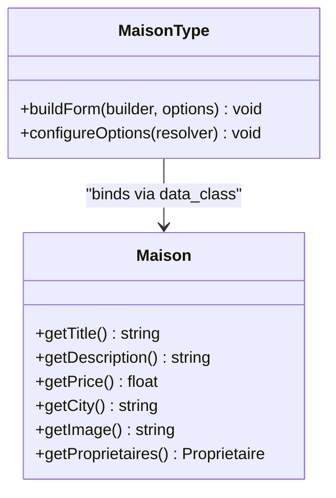

**Diagram sources**
- [MaisonType.php:12-35](file://src/Form/MaisonType.php#L12-L35)
- [Maison.php:10-117](file://src/Entity/Maison.php#L10-L117)

**Section sources**
- [MaisonType.php:12-35](file://src/Form/MaisonType.php#L12-L35)
- [Maison.php:10-117](file://src/Entity/Maison.php#L10-L117)

#### ClientType
- Purpose: Create and edit Client entities.
- Fields: name, surname, email.
- Options: data_class set to Client.

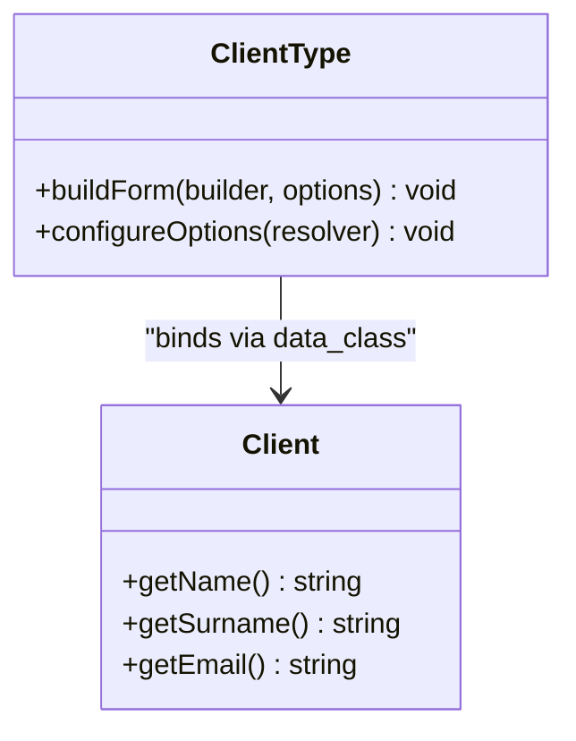

**Diagram sources**
- [ClientType.php:10-27](file://src/Form/ClientType.php#L10-L27)
- [Client.php:9-70](file://src/Entity/Client.php#L9-L70)

**Section sources**
- [ClientType.php:10-27](file://src/Form/ClientType.php#L10-L27)
- [Client.php:9-70](file://src/Entity/Client.php#L9-L70)

#### ProprietaireType
- Purpose: Create and edit Proprietaire entities.
- Fields: name, surname, phone.
- Options: data_class set to Proprietaire.

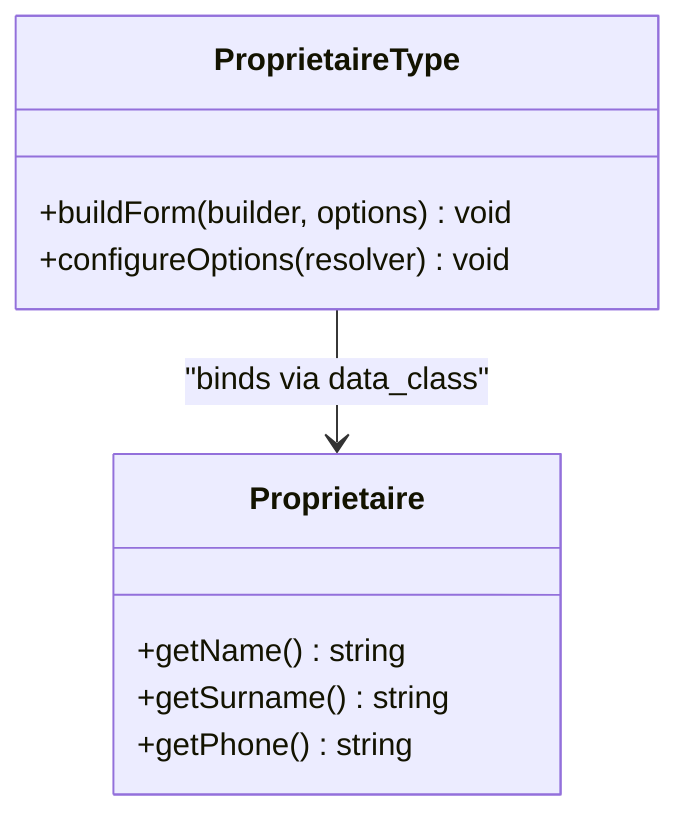

**Diagram sources**
- [ProprietaireType.php:10-27](file://src/Form/ProprietaireType.php#L10-L27)
- [Proprietaire.php:9-69](file://src/Entity/Proprietaire.php#L9-L69)

**Section sources**
- [ProprietaireType.php:10-27](file://src/Form/ProprietaireType.php#L10-L27)
- [Proprietaire.php:9-69](file://src/Entity/Proprietaire.php#L9-L69)

#### ReservationType
- Purpose: Create and edit Reservation entities with date range and related Client/Maison.
- Fields: dateDebut, dateFin (DateType), paye, client (EntityType), maison (EntityType).
- Options: data_class set to Reservation.

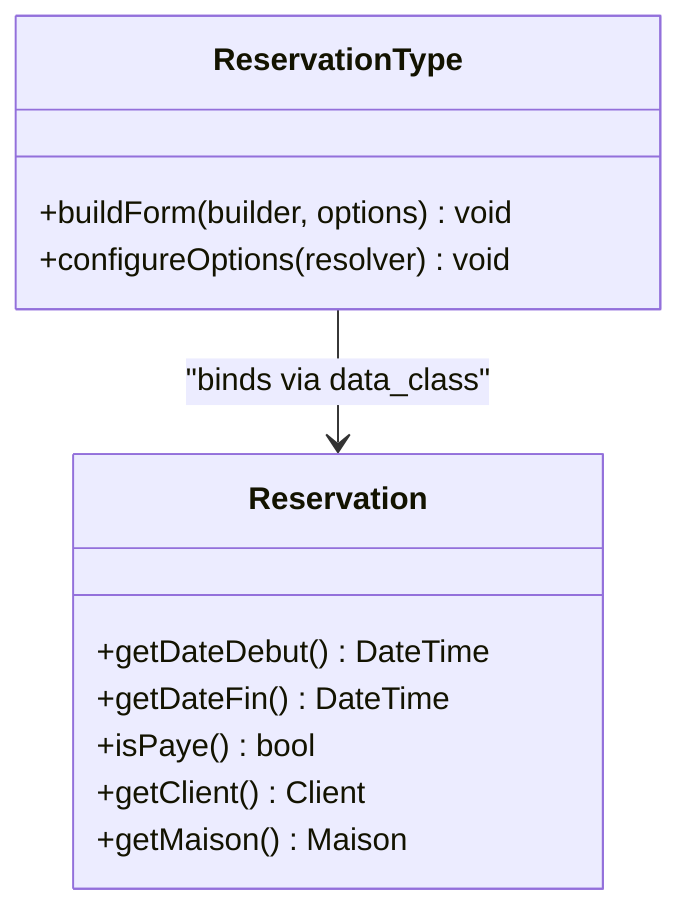

**Diagram sources**
- [ReservationType.php:14-49](file://src/Form/ReservationType.php#L14-L49)
- [Reservation.php:9-99](file://src/Entity/Reservation.php#L9-L99)

**Section sources**
- [ReservationType.php:14-49](file://src/Form/ReservationType.php#L14-L49)
- [Reservation.php:9-99](file://src/Entity/Reservation.php#L9-L99)

#### RegistrationFormType
- Purpose: User registration with terms agreement and password constraints.
- Fields: username, agreeTerms (CheckboxType), plainPassword (PasswordType with constraints).
- Constraints: NotBlank and Length for password; IsTrue for terms.

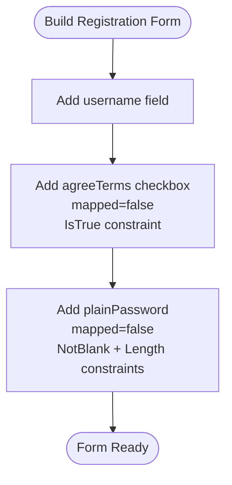

**Diagram sources**
- [RegistrationFormType.php:15-55](file://src/Form/RegistrationFormType.php#L15-L55)

**Section sources**
- [RegistrationFormType.php:15-55](file://src/Form/RegistrationFormType.php#L15-L55)

#### ResetPasswordType
- Purpose: Password reset with repeated password confirmation.
- Fields: new_password (RepeatedType with PasswordType), submit (SubmitType).
- Options: mapped=false for repeated field; labels and attributes for UX.

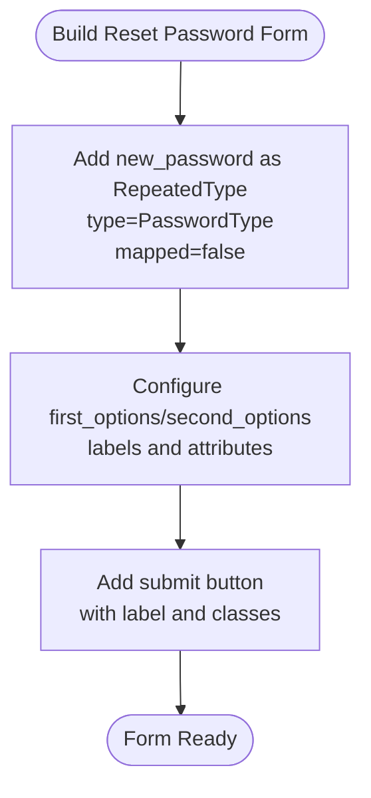

**Diagram sources**
- [ResetPasswordType.php:12-51](file://src/Form/ResetPasswordType.php#L12-L51)

**Section sources**
- [ResetPasswordType.php:12-51](file://src/Form/ResetPasswordType.php#L12-L51)

#### MaisonSearchType
- Purpose: Search filter for Maison with optional selection.
- Fields: maison (EntityType with placeholder and required=false).
- Options: data_class to a search entity, method GET, csrf_protection false.

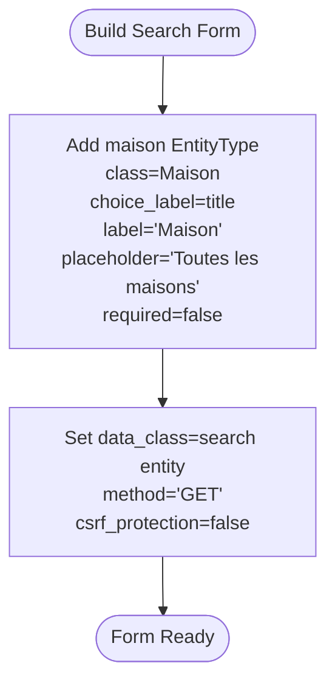

**Diagram sources**
- [MaisonSearchType.php:12-32](file://src/Form/MaisonSearchType.php#L12-L32)

**Section sources**
- [MaisonSearchType.php:12-32](file://src/Form/MaisonSearchType.php#L12-L32)

### Controller Integration Examples
- MaisonController demonstrates creating a form, handling requests, validating, and persisting Maison entities.
- ClientController and ReservationController follow the same pattern for their respective entities.

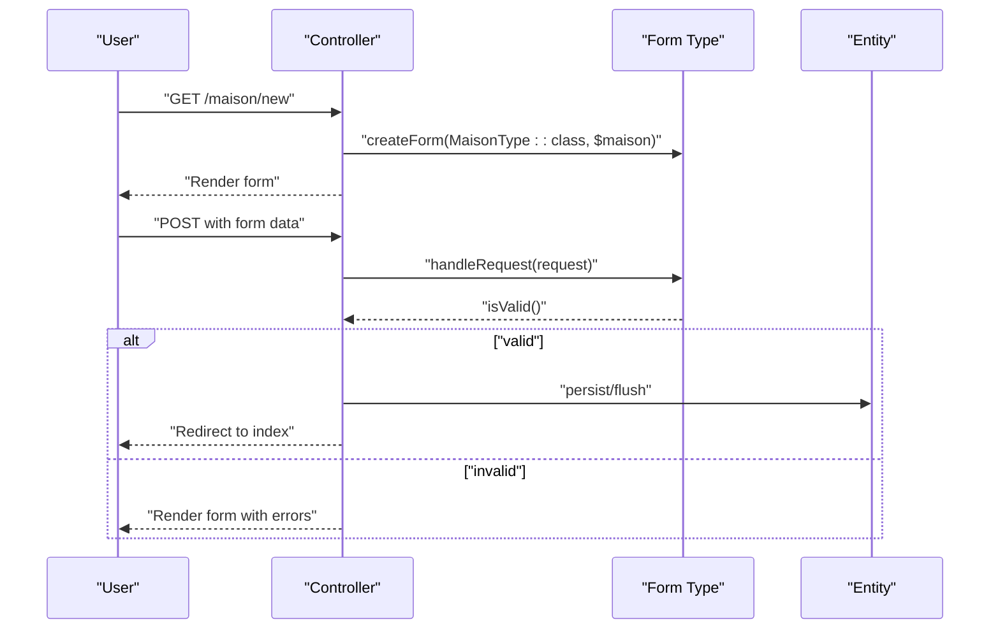

**Diagram sources**
- [MaisonController.php:25-42](file://src/Controller/MaisonController.php#L25-L42)
- [MaisonType.php:12-35](file://src/Form/MaisonType.php#L12-L35)

**Section sources**
- [MaisonController.php:25-42](file://src/Controller/MaisonController.php#L25-L42)
- [ClientController.php:25-42](file://src/Controller/ClientController.php#L25-L42)
- [ReservationController.php:25-42](file://src/Controller/ReservationController.php#L25-L42)

## Dependency Analysis
- Forms depend on entities via data_class.
- Controllers depend on form types via createForm.
- EntityType fields depend on related entities and repositories for choices.

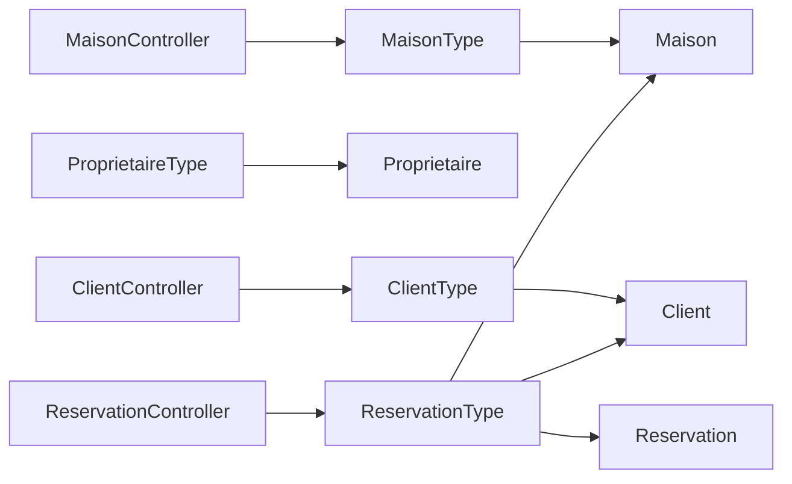

**Diagram sources**
- [ClientType.php:10-27](file://src/Form/ClientType.php#L10-L27)
- [ProprietaireType.php:10-27](file://src/Form/ProprietaireType.php#L10-L27)
- [MaisonType.php:12-35](file://src/Form/MaisonType.php#L12-L35)
- [ReservationType.php:14-49](file://src/Form/ReservationType.php#L14-L49)
- [MaisonController.php:15-81](file://src/Controller/MaisonController.php#L15-L81)
- [ClientController.php:15-81](file://src/Controller/ClientController.php#L15-L81)
- [ReservationController.php:15-81](file://src/Controller/ReservationController.php#L15-L81)

**Section sources**
- [ClientType.php:10-27](file://src/Form/ClientType.php#L10-L27)
- [ProprietaireType.php:10-27](file://src/Form/ProprietaireType.php#L10-L27)
- [MaisonType.php:12-35](file://src/Form/MaisonType.php#L12-L35)
- [ReservationType.php:14-49](file://src/Form/ReservationType.php#L14-L49)
- [MaisonController.php:15-81](file://src/Controller/MaisonController.php#L15-L81)
- [ClientController.php:15-81](file://src/Controller/ClientController.php#L15-L81)
- [ReservationController.php:15-81](file://src/Controller/ReservationController.php#L15-L81)

## Performance Considerations
- Use EntityType with appropriate choice_label to avoid heavy queries; consider lazy loading and query optimization.
- For search forms, disabling CSRF and forcing GET reduces overhead and simplifies filtering.
- Avoid unnecessary mapped=false fields unless intentionally bypassing entity mapping.

[No sources needed since this section provides general guidance]

## Troubleshooting Guide
- Form not binding to entity:
  - Verify data_class matches the entity class.
  - Ensure entity setters/getters exist and are typed correctly.
- EntityType not showing choices:
  - Confirm class and choice_label are set.
  - Ensure the related entity repository returns expected results.
- Validation errors not visible:
  - Check constraints are properly defined (entity or form level).
  - Ensure form rendering includes error display.
- CSRF or method mismatch:
  - For search forms, confirm method is GET and csrf_protection is disabled as intended.

**Section sources**
- [MaisonType.php:29-34](file://src/Form/MaisonType.php#L29-L34)
- [MaisonSearchType.php:25-32](file://src/Form/MaisonSearchType.php#L25-L32)
- [RegistrationFormType.php:17-46](file://src/Form/RegistrationFormType.php#L17-L46)

## Conclusion
This project demonstrates clean, reusable Symfony form types that bind to entities via data_class, leverage EntityType for related selections, and integrate validation through constraints. Controllers consistently create forms, handle requests, validate, and persist entities. The patterns shown—scalar fields, choice fields, specialized fields, option configuration, and method-specific settings—are broadly applicable and serve as a foundation for extending and customizing forms.

[No sources needed since this section summarizes without analyzing specific files]

## Appendices
- Additional patterns to explore:
  - Form extensions for global field behavior.
  - CollectionType for dynamic lists.
  - Custom form types with dependency injection via services.

[No sources needed since this section provides general guidance]