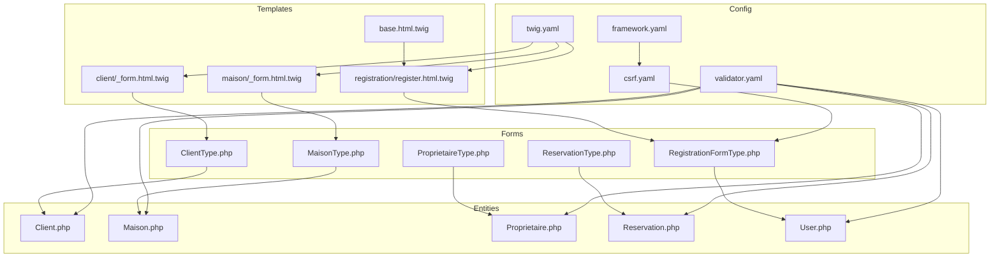
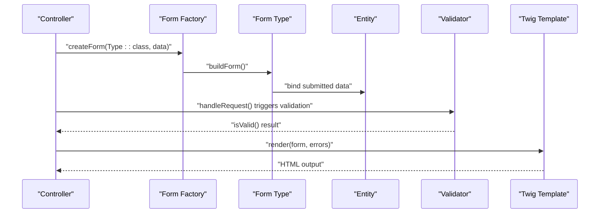
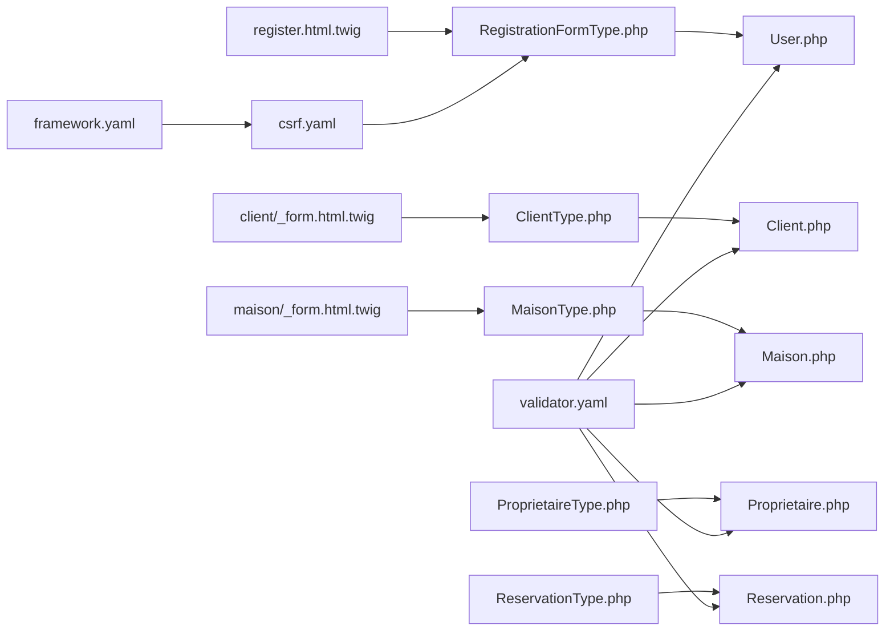
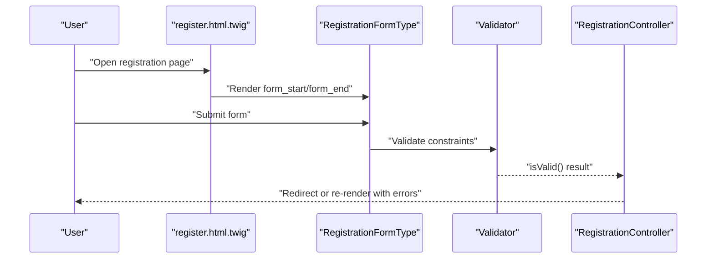
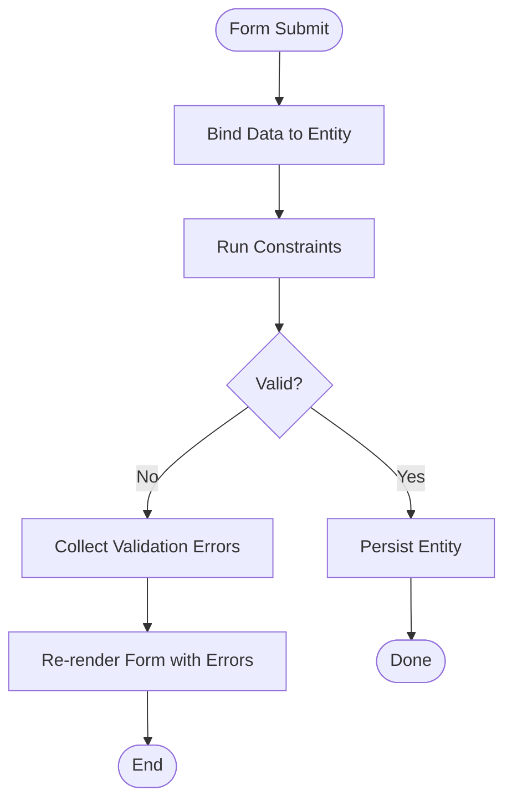

# Forms and Validation System

<cite>
**Referenced Files in This Document**
- [ClientType.php](file://src/Form/ClientType.php)
- [MaisonType.php](file://src/Form/MaisonType.php)
- [ProprietaireType.php](file://src/Form/ProprietaireType.php)
- [ReservationType.php](file://src/Form/ReservationType.php)
- [RegistrationFormType.php](file://src/Form/RegistrationFormType.php)
- [Client.php](file://src/Entity/Client.php)
- [Maison.php](file://src/Entity/Maison.php)
- [Proprietaire.php](file://src/Entity/Proprietaire.php)
- [Reservation.php](file://src/Entity/Reservation.php)
- [User.php](file://src/Entity/User.php)
- [_form.html.twig (client)](file://templates/client/_form.html.twig)
- [_form.html.twig (maison)](file://templates/maison/_form.html.twig)
- [register.html.twig](file://templates/registration/register.html.twig)
- [base.html.twig](file://templates/base.html.twig)
- [framework.yaml](file://config/packages/framework.yaml)
- [csrf.yaml](file://config/packages/csrf.yaml)
- [validator.yaml](file://config/packages/validator.yaml)
- [twig.yaml](file://config/packages/twig.yaml)
- [csrf_protection_controller.js](file://assets/controllers/csrf_protection_controller.js)
</cite>

## Table of Contents
1. [Introduction](#introduction)
2. [Project Structure](#project-structure)
3. [Core Components](#core-components)
4. [Architecture Overview](#architecture-overview)
5. [Detailed Component Analysis](#detailed-component-analysis)
6. [Dependency Analysis](#dependency-analysis)
7. [Performance Considerations](#performance-considerations)
8. [Troubleshooting Guide](#troubleshooting-guide)
9. [Conclusion](#conclusion)
10. [Appendices](#appendices)

## Introduction
This document explains the Symfony Forms and Validation system used in the project. It covers form type creation, field configuration, validation constraints, rendering in Twig templates, custom themes, styling integration, validation groups, conditional and cross-field validation, data transformation and normalization, serialization, form events and dynamic modifications, CSRF protection, performance optimization, and accessibility compliance. Examples include real-world form types and templates present in the repository.

## Project Structure
The forms and validation system spans several areas:
- Form types under src/Form define the UI and binding for entities.
- Entities under src/Entity define data models and validation constraints.
- Twig templates under templates render forms and integrate Bootstrap styling.
- Configuration under config/packages controls framework, CSRF, validator, and Twig behavior.

**Diagram sources**
- [ClientType.php:1-28](file://src/Form/ClientType.php#L1-L28)
- [MaisonType.php:1-36](file://src/Form/MaisonType.php#L1-L36)
- [ProprietaireType.php:1-28](file://src/Form/ProprietaireType.php#L1-L28)
- [ReservationType.php:1-50](file://src/Form/ReservationType.php#L1-L50)
- [RegistrationFormType.php:1-56](file://src/Form/RegistrationFormType.php#L1-L56)
- [Client.php:1-71](file://src/Entity/Client.php#L1-L71)
- [Maison.php:1-118](file://src/Entity/Maison.php#L1-L118)
- [Proprietaire.php:1-70](file://src/Entity/Proprietaire.php#L1-L70)
- [Reservation.php:1-100](file://src/Entity/Reservation.php#L1-L100)
- [User.php:1-119](file://src/Entity/User.php#L1-L119)
- [_form.html.twig (client):1-30](file://templates/client/_form.html.twig#L1-L30)
- [_form.html.twig (maison):1-44](file://templates/maison/_form.html.twig#L1-L44)
- [register.html.twig:1-42](file://templates/registration/register.html.twig#L1-L42)
- [base.html.twig:1-184](file://templates/base.html.twig#L1-L184)
- [framework.yaml:1-16](file://config/packages/framework.yaml#L1-L16)
- [csrf.yaml](file://config/packages/csrf.yaml)
- [validator.yaml](file://config/packages/validator.yaml)
- [twig.yaml](file://config/packages/twig.yaml)

**Section sources**
- [framework.yaml:1-16](file://config/packages/framework.yaml#L1-L16)

## Core Components
- Form Types: Define fields, options, and binding to entities.
- Entities: Provide data models and declarative validation via attributes.
- Twig Templates: Render forms, labels, widgets, errors, and integrate Bootstrap classes.
- Configuration: Enable CSRF protection, validation, and Twig rendering behavior.

Key responsibilities:
- ClientType, MaisonType, ProprietaireType, ReservationType, RegistrationFormType: Build forms and bind to respective entities.
- Client, Maison, Proprietaire, Reservation, User: Model data and validation constraints.
- Twig templates: Render forms with Bootstrap classes and display validation errors.
- framework.yaml, csrf.yaml, validator.yaml, twig.yaml: Configure CSRF, validation, and Twig.

**Section sources**
- [ClientType.php:1-28](file://src/Form/ClientType.php#L1-L28)
- [MaisonType.php:1-36](file://src/Form/MaisonType.php#L1-L36)
- [ProprietaireType.php:1-28](file://src/Form/ProprietaireType.php#L1-L28)
- [ReservationType.php:1-50](file://src/Form/ReservationType.php#L1-L50)
- [RegistrationFormType.php:1-56](file://src/Form/RegistrationFormType.php#L1-L56)
- [Client.php:1-71](file://src/Entity/Client.php#L1-L71)
- [Maison.php:1-118](file://src/Entity/Maison.php#L1-L118)
- [Proprietaire.php:1-70](file://src/Entity/Proprietaire.php#L1-L70)
- [Reservation.php:1-100](file://src/Entity/Reservation.php#L1-L100)
- [User.php:1-119](file://src/Entity/User.php#L1-L119)
- [_form.html.twig (client):1-30](file://templates/client/_form.html.twig#L1-L30)
- [_form.html.twig (maison):1-44](file://templates/maison/_form.html.twig#L1-L44)
- [register.html.twig:1-42](file://templates/registration/register.html.twig#L1-L42)
- [base.html.twig:1-184](file://templates/base.html.twig#L1-L184)
- [framework.yaml:1-16](file://config/packages/framework.yaml#L1-L16)
- [csrf.yaml](file://config/packages/csrf.yaml)
- [validator.yaml](file://config/packages/validator.yaml)
- [twig.yaml](file://config/packages/twig.yaml)

## Architecture Overview
The forms pipeline integrates form types, entities, validation, and Twig rendering:
- Controllers create forms using form factories and pass them to templates.
- Twig renders forms with labels, widgets, and errors.
- Validation runs during submission based on entity constraints and form constraints.
- CSRF protection is enabled via framework/session and CSRF configuration.

**Diagram sources**
- [ClientType.php:1-28](file://src/Form/ClientType.php#L1-L28)
- [MaisonType.php:1-36](file://src/Form/MaisonType.php#L1-L36)
- [ProprietaireType.php:1-28](file://src/Form/ProprietaireType.php#L1-L28)
- [ReservationType.php:1-50](file://src/Form/ReservationType.php#L1-L50)
- [RegistrationFormType.php:1-56](file://src/Form/RegistrationFormType.php#L1-L56)
- [Client.php:1-71](file://src/Entity/Client.php#L1-L71)
- [Maison.php:1-118](file://src/Entity/Maison.php#L1-L118)
- [Proprietaire.php:1-70](file://src/Entity/Proprietaire.php#L1-L70)
- [Reservation.php:1-100](file://src/Entity/Reservation.php#L1-L100)
- [User.php:1-119](file://src/Entity/User.php#L1-L119)
- [register.html.twig:1-42](file://templates/registration/register.html.twig#L1-L42)

## Detailed Component Analysis

### Form Types and Field Configuration
- ClientType: Adds name, surname, email fields bound to Client entity.
- MaisonType: Adds title, description, price, city, image; includes a multi-valued property with EntityType for Proprietaire.
- ProprietaireType: Adds name, surname, phone fields bound to Proprietaire entity.
- ReservationType: Adds dateDebut, dateFin (single_text widget), paye, and entity fields for Client and Maison.
- RegistrationFormType: Adds username, a non-mapped checkbox constraint for terms, and a non-mapped password with length constraints.

Field configuration highlights:
- EntityType fields specify class and choice_label.
- DateType single_text widget integrates with Bootstrap classes.
- Non-mapped fields avoid persisting to the entity while enabling validation.

**Section sources**
- [ClientType.php:10-26](file://src/Form/ClientType.php#L10-L26)
- [MaisonType.php:12-34](file://src/Form/MaisonType.php#L12-L34)
- [ProprietaireType.php:10-26](file://src/Form/ProprietaireType.php#L10-L26)
- [ReservationType.php:14-48](file://src/Form/ReservationType.php#L14-L48)
- [RegistrationFormType.php:15-54](file://src/Form/RegistrationFormType.php#L15-L54)

### Validation Constraints and Groups
- UniqueEntity on User enforces unique usernames.
- Length and NotBlank constraints on RegistrationFormType password.
- IsTrue constraint on RegistrationFormType terms agreement.
- Doctrine ORM column constraints implicitly validate presence and lengths on Client, Maison, Proprietaire, Reservation.

Validation groups:
- Not explicitly configured in the provided files; defaults apply. To enable custom groups, configure form options and validator groups accordingly.

Cross-field validation:
- No explicit cross-field validators in the provided files. Cross-field checks can be implemented via custom constraints or form events.

Conditional validation:
- Not implemented in the provided files. Can be achieved using form events to modify constraints dynamically.

**Section sources**
- [User.php:12-13](file://src/Entity/User.php#L12-L13)
- [RegistrationFormType.php:11-44](file://src/Form/RegistrationFormType.php#L11-L44)

### Form Rendering in Twig and Custom Themes
- Base template includes Bootstrap CSS/JS and defines global styles.
- Client and Maison forms render labels, widgets, and buttons with Bootstrap classes.
- Registration form demonstrates explicit label and error rendering per field, plus card layout and responsive grid.

Styling integration:
- Widgets receive form-control classes.
- Buttons use btn and btn-primary classes.
- Errors are rendered via form_errors for global and per-field contexts.

Custom themes:
- The project does not define custom Twig form themes. Rendering relies on default Bootstrap-like macros and manual label/widget/error rendering.

**Section sources**
- [base.html.twig:8-84](file://templates/base.html.twig#L8-L84)
- [_form.html.twig (client):1-29](file://templates/client/_form.html.twig#L1-L29)
- [_form.html.twig (maison):1-43](file://templates/maison/_form.html.twig#L1-L43)
- [register.html.twig:13-36](file://templates/registration/register.html.twig#L13-L36)

### Data Transformation, Normalization, and Serialization
- Entities expose getters/setters for primitive types and DateTime.
- User implements a serialization method to avoid storing raw password hashes in sessions, enhancing security.

Normalization:
- Not explicitly implemented in the provided files. Use form transformers or custom types for complex normalization needs.

**Section sources**
- [Reservation.php:64-86](file://src/Entity/Reservation.php#L64-L86)
- [User.php:105-111](file://src/Entity/User.php#L105-L111)

### Form Events, Listeners, and Dynamic Modifications
- Not implemented in the provided files. Dynamic field addition/removal, dependent selects, or conditional visibility can be handled via form events in form types.

**Section sources**
- [ClientType.php:12-18](file://src/Form/ClientType.php#L12-L18)
- [MaisonType.php:14-26](file://src/Form/MaisonType.php#L14-L26)
- [ProprietaireType.php:12-18](file://src/Form/ProprietaireType.php#L12-L18)
- [ReservationType.php:16-39](file://src/Form/ReservationType.php#L16-L39)
- [RegistrationFormType.php:17-46](file://src/Form/RegistrationFormType.php#L17-L46)

### Security: CSRF Protection
- Session is enabled in framework configuration.
- CSRF configuration exists under csrf.yaml.
- CSRF tokens are automatically included in forms when enabled by framework/session and CSRF settings.

Integration:
- Ensure framework.session is true and CSRF is enabled in csrf.yaml. Twig forms will include CSRF fields automatically.

**Section sources**
- [framework.yaml:1-16](file://config/packages/framework.yaml#L1-L16)
- [csrf.yaml](file://config/packages/csrf.yaml)

### Accessibility Compliance
- Labels explicitly associate with inputs using form_label.
- Bootstrap classes provide focus styles and contrast.
- Consider adding aria-describedby for complex help texts and aria-invalid for invalid fields in templates.

**Section sources**
- [_form.html.twig (client):4-21](file://templates/client/_form.html.twig#L4-L21)
- [_form.html.twig (maison):3-35](file://templates/maison/_form.html.twig#L3-L35)
- [register.html.twig:16-29](file://templates/registration/register.html.twig#L16-L29)

### Complex Forms and Error Handling
- Registration form showcases per-field error rendering and structured layout.
- Client and Maison forms demonstrate straightforward rendering with global form_errors and per-field feedback.

Examples:
- Use form_errors(registrationForm) for global errors.
- Use form_errors(form.fieldName) for per-field errors.

**Section sources**
- [register.html.twig:13-36](file://templates/registration/register.html.twig#L13-L36)
- [_form.html.twig (client):1-29](file://templates/client/_form.html.twig#L1-L29)
- [_form.html.twig (maison):1-43](file://templates/maison/_form.html.twig#L1-L43)

### Custom Form Widgets
- Not implemented in the provided files. Custom widgets can be created via form types or Twig form themes.

**Section sources**
- [ClientType.php:14-18](file://src/Form/ClientType.php#L14-L18)
- [MaisonType.php:16-25](file://src/Form/MaisonType.php#L16-L25)
- [ProprietaireType.php:14-18](file://src/Form/ProprietaireType.php#L14-L18)
- [ReservationType.php:19-39](file://src/Form/ReservationType.php#L19-L39)
- [RegistrationFormType.php:19-45](file://src/Form/RegistrationFormType.php#L19-L45)

## Dependency Analysis
- Form types depend on their corresponding entities for data_class and field mapping.
- Twig templates depend on form variables passed by controllers.
- Validation depends on validator.yaml and entity constraints.
- CSRF depends on framework.yaml and csrf.yaml.

**Diagram sources**
- [RegistrationFormType.php:1-56](file://src/Form/RegistrationFormType.php#L1-L56)
- [ClientType.php:1-28](file://src/Form/ClientType.php#L1-L28)
- [MaisonType.php:1-36](file://src/Form/MaisonType.php#L1-L36)
- [ProprietaireType.php:1-28](file://src/Form/ProprietaireType.php#L1-L28)
- [ReservationType.php:1-50](file://src/Form/ReservationType.php#L1-L50)
- [User.php:1-119](file://src/Entity/User.php#L1-L119)
- [Client.php:1-71](file://src/Entity/Client.php#L1-L71)
- [Maison.php:1-118](file://src/Entity/Maison.php#L1-L118)
- [Proprietaire.php:1-70](file://src/Entity/Proprietaire.php#L1-L70)
- [Reservation.php:1-100](file://src/Entity/Reservation.php#L1-L100)
- [register.html.twig:1-42](file://templates/registration/register.html.twig#L1-L42)
- [client/_form.html.twig:1-30](file://templates/client/_form.html.twig#L1-L30)
- [maison/_form.html.twig:1-44](file://templates/maison/_form.html.twig#L1-L44)
- [validator.yaml](file://config/packages/validator.yaml)
- [csrf.yaml](file://config/packages/csrf.yaml)
- [framework.yaml:1-16](file://config/packages/framework.yaml#L1-L16)

**Section sources**
- [validator.yaml](file://config/packages/validator.yaml)
- [csrf.yaml](file://config/packages/csrf.yaml)
- [framework.yaml:1-16](file://config/packages/framework.yaml#L1-L16)

## Performance Considerations
- Prefer single-text widgets for dates to reduce DOM complexity.
- Minimize unnecessary form fields and conditional logic in templates.
- Use validation groups to limit validation scope when forms are large.
- Leverage caching for static select choices (e.g., countries, statuses) when applicable.
- Keep form templates minimal and reuse partials to reduce duplication.

[No sources needed since this section provides general guidance]

## Troubleshooting Guide
Common issues and resolutions:
- Missing CSRF token: Ensure framework.session is enabled and CSRF is configured.
- Validation not firing: Verify validator.yaml is loaded and constraints are declared on entities or forms.
- Styling inconsistencies: Confirm Bootstrap classes are applied in templates and base.html.twig includes required CSS/JS.
- Non-mapped fields not validating: Ensure constraints are attached to non-mapped fields in form types and mapped=false is set.

**Section sources**
- [framework.yaml:1-16](file://config/packages/framework.yaml#L1-L16)
- [csrf.yaml](file://config/packages/csrf.yaml)
- [validator.yaml](file://config/packages/validator.yaml)
- [register.html.twig:13-36](file://templates/registration/register.html.twig#L13-L36)
- [RegistrationFormType.php:21-45](file://src/Form/RegistrationFormType.php#L21-L45)

## Conclusion
The project implements a clean separation of concerns for forms and validation:
- Form types define UI and binding.
- Entities declare validation constraints.
- Twig templates render forms with Bootstrap styling and error reporting.
- CSRF protection is enabled via framework/session and CSRF configuration.
To extend functionality, consider adding validation groups, cross-field validators, form events for dynamic behavior, custom form themes, and accessibility attributes.

[No sources needed since this section summarizes without analyzing specific files]

## Appendices

### Example Workflows

#### Registration Form Submission Flow

**Diagram sources**
- [register.html.twig:15-37](file://templates/registration/register.html.twig#L15-L37)
- [RegistrationFormType.php:17-46](file://src/Form/RegistrationFormType.php#L17-L46)
- [User.php:12-13](file://src/Entity/User.php#L12-L13)

### Validation Flow

**Diagram sources**
- [Client.php:16-23](file://src/Entity/Client.php#L16-L23)
- [Maison.php:17-30](file://src/Entity/Maison.php#L17-L30)
- [Proprietaire.php:16-23](file://src/Entity/Proprietaire.php#L16-L23)
- [Reservation.php:25-32](file://src/Entity/Reservation.php#L25-L32)
- [User.php:12-13](file://src/Entity/User.php#L12-L13)
- [RegistrationFormType.php:11-44](file://src/Form/RegistrationFormType.php#L11-L44)