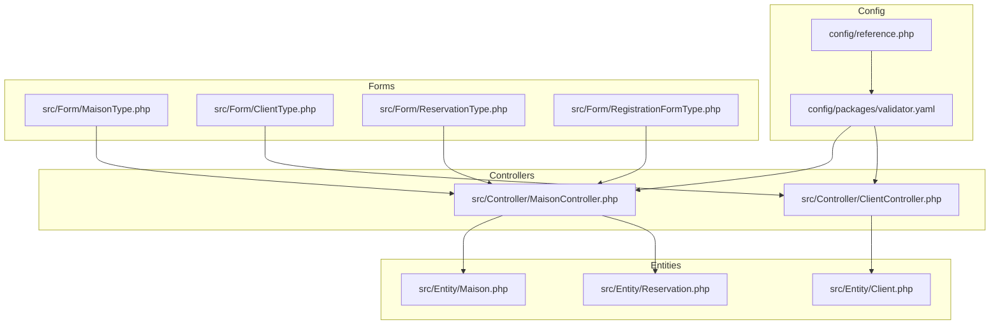
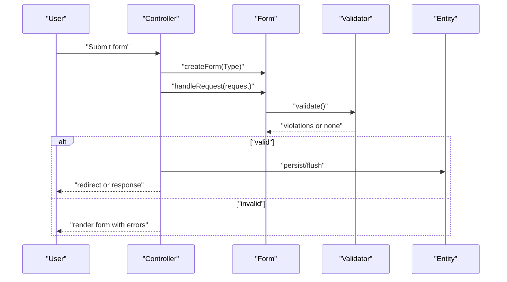
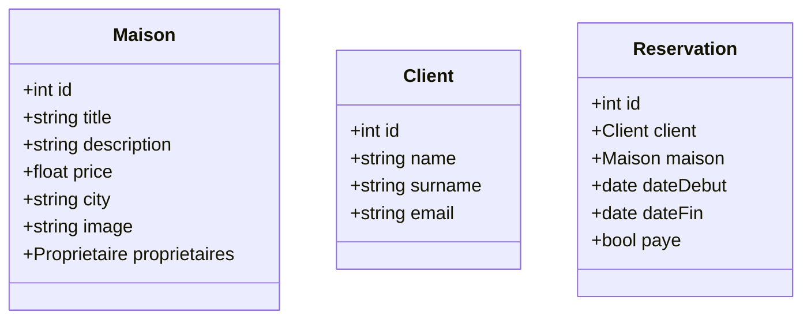
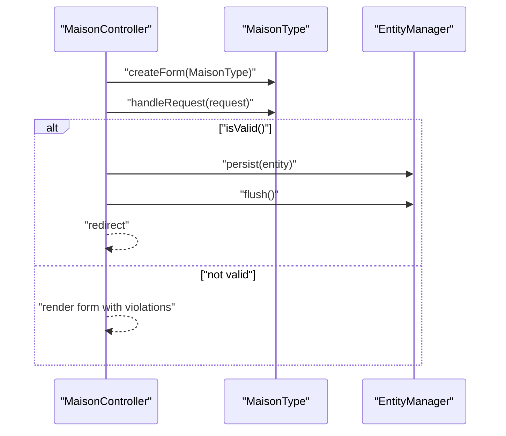
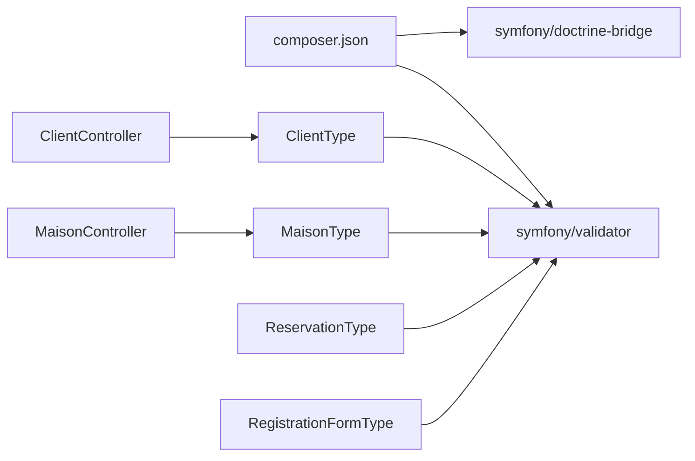

# Validation Constraints and Rules

<cite>
**Referenced Files in This Document**
- [validator.yaml](file://config/packages/validator.yaml)
- [reference.php](file://config/reference.php)
- [composer.json](file://composer.json)
- [Maison.php](file://src/Entity/Maison.php)
- [Client.php](file://src/Entity/Client.php)
- [Reservation.php](file://src/Entity/Reservation.php)
- [MaisonType.php](file://src/Form/MaisonType.php)
- [ClientType.php](file://src/Form/ClientType.php)
- [ReservationType.php](file://src/Form/ReservationType.php)
- [RegistrationFormType.php](file://src/Form/RegistrationFormType.php)
- [MaisonController.php](file://src/Controller/MaisonController.php)
- [ClientController.php](file://src/Controller/ClientController.php)
</cite>

## Table of Contents
1. [Introduction](#introduction)
2. [Project Structure](#project-structure)
3. [Core Components](#core-components)
4. [Architecture Overview](#architecture-overview)
5. [Detailed Component Analysis](#detailed-component-analysis)
6. [Dependency Analysis](#dependency-analysis)
7. [Performance Considerations](#performance-considerations)
8. [Troubleshooting Guide](#troubleshooting-guide)
9. [Conclusion](#conclusion)
10. [Appendices](#appendices)

## Introduction
This document explains how validation works in this Symfony project, focusing on built-in constraints, form-driven validation, and practical usage across entities and forms. It covers:
- Built-in constraints used in the project (NotBlank, Length, IsTrue)
- How Symfony’s validator integrates with forms and entities
- Validation groups, conditional validation, and cross-field validation
- Cross-entity constraints via UniqueEntity
- Validation error handling and rendering in Twig templates
- Practical examples from Maison, Client, and Reservation entities
- Performance and configuration tips

## Project Structure
The validation stack in this project is primarily driven by:
- Symfony Validator (enabled via composer)
- Form types that attach constraints to fields
- Controllers that trigger validation via Form::handleRequest and check isValid()
- Optional auto-mapping configuration for Doctrine-backed entities

**Diagram sources**
- [validator.yaml:1-12](file://config/packages/validator.yaml#L1-L12)
- [reference.php:332-347](file://config/reference.php#L332-L347)
- [MaisonType.php:1-36](file://src/Form/MaisonType.php#L1-L36)
- [ClientType.php:1-28](file://src/Form/ClientType.php#L1-L28)
- [ReservationType.php:1-50](file://src/Form/ReservationType.php#L1-L50)
- [RegistrationFormType.php:1-56](file://src/Form/RegistrationFormType.php#L1-L56)
- [MaisonController.php:1-82](file://src/Controller/MaisonController.php#L1-L82)
- [ClientController.php:1-82](file://src/Controller/ClientController.php#L1-L82)
- [Maison.php:1-118](file://src/Entity/Maison.php#L1-L118)
- [Client.php:1-71](file://src/Entity/Client.php#L1-L71)
- [Reservation.php:1-100](file://src/Entity/Reservation.php#L1-L100)

**Section sources**
- [validator.yaml:1-12](file://config/packages/validator.yaml#L1-L12)
- [reference.php:332-347](file://config/reference.php#L332-L347)
- [composer.json:44-44](file://composer.json#L44-L44)

## Core Components
- Symfony Validator is enabled via composer and configured in validator.yaml. Auto-mapping is present but commented out, meaning explicit constraints on forms and attributes are preferred.
- Form types define field-level constraints (e.g., NotBlank, Length, IsTrue) and map to entity fields.
- Controllers bind requests to forms, trigger validation, and persist validated entities.
- Entities are simple PHP objects with no explicit constraints attached; validation is enforced at the form boundary.

Key built-in constraints used in the project:
- NotBlank: Ensures a field is not empty.
- Length: Enforces minimum and maximum length for strings.
- IsTrue: Validates that a checkbox/collection of choices evaluates to true.

Cross-entity uniqueness is supported by UniqueEntity (from Symfony Doctrine Bridge), which is part of the symfony/doctrine-bridge package included in this project.

**Section sources**
- [validator.yaml:1-12](file://config/packages/validator.yaml#L1-L12)
- [RegistrationFormType.php:11-44](file://src/Form/RegistrationFormType.php#L11-L44)
- [composer.json:44-44](file://composer.json#L44-L44)

## Architecture Overview
The validation lifecycle follows a predictable flow:
- Request enters a controller action
- A form is created and populated from the request
- Form::handleRequest triggers validation
- If valid, the controller persists the entity
- If invalid, errors are collected and rendered in the template

**Diagram sources**
- [MaisonController.php:25-42](file://src/Controller/MaisonController.php#L25-L42)
- [ClientController.php:25-42](file://src/Controller/ClientController.php#L25-L42)
- [MaisonType.php:14-26](file://src/Form/MaisonType.php#L14-L26)
- [ClientType.php:12-18](file://src/Form/ClientType.php#L12-L18)
- [RegistrationFormType.php:17-46](file://src/Form/RegistrationFormType.php#L17-L46)

## Detailed Component Analysis

### Built-in Constraints in Forms
- RegistrationFormType demonstrates:
  - NotBlank on a password field
  - Length with min/max constraints
  - IsTrue on a terms agreement checkbox (mapped=false)
- These constraints are attached directly to form fields, ensuring validation occurs during form submission.

Practical implications:
- Constraints are enforced before any entity persistence.
- Messages are customizable per constraint.

**Section sources**
- [RegistrationFormType.php:11-44](file://src/Form/RegistrationFormType.php#L11-L44)

### Entity Validation Integration
- Entities (Maison, Client, Reservation) are simple PHP objects without explicit validation annotations.
- Validation is enforced at the form boundary via form types.
- This keeps entities clean and validation logic centralized in forms.

**Diagram sources**
- [Maison.php:10-117](file://src/Entity/Maison.php#L10-L117)
- [Client.php:9-70](file://src/Entity/Client.php#L9-L70)
- [Reservation.php:10-99](file://src/Entity/Reservation.php#L10-L99)

**Section sources**
- [Maison.php:1-118](file://src/Entity/Maison.php#L1-L118)
- [Client.php:1-71](file://src/Entity/Client.php#L1-L71)
- [Reservation.php:1-100](file://src/Entity/Reservation.php#L1-L100)

### Form Validation Flow
- Controllers create forms and call handleRequest. They check isValid() to branch logic.
- If valid, entities are persisted; otherwise, the form is re-rendered with validation errors.

**Diagram sources**
- [MaisonController.php:25-42](file://src/Controller/MaisonController.php#L25-L42)
- [MaisonType.php:14-26](file://src/Form/MaisonType.php#L14-L26)

**Section sources**
- [MaisonController.php:25-42](file://src/Controller/MaisonController.php#L25-L42)
- [ClientController.php:25-42](file://src/Controller/ClientController.php#L25-L42)

### Cross-Field Validation Scenarios
- Date range validation (dateDebut < dateFin) is not currently implemented in the project. To enforce this:
  - Add a custom validator that compares dates on the Reservation entity.
  - Alternatively, perform server-side checks after form isValid() and add a form-level violation programmatically.
- Terms agreement validation is handled by IsTrue on the form level in RegistrationFormType.

**Section sources**
- [ReservationType.php:16-40](file://src/Form/ReservationType.php#L16-L40)
- [RegistrationFormType.php:21-28](file://src/Form/RegistrationFormType.php#L21-L28)

### Cross-Entity Validation (UniqueEntity)
- UniqueEntity ensures uniqueness across related entities (e.g., preventing duplicate emails for clients).
- This constraint is part of symfony/doctrine-bridge and can be applied via attributes or YAML/PHP metadata.

How to apply:
- Use the UniqueEntity attribute on the Client entity for the email field.
- Configure the validator to target the unique field and optionally specify a group.

**Section sources**
- [composer.json:11-11](file://composer.json#L11-L11)

### Validation Groups and Conditional Validation
- Validation groups are not used in the current codebase.
- To implement conditional validation:
  - Define groups in constraints and form types.
  - Use GroupSequence or conditional constraints to change validation sets based on entity state.

[No sources needed since this section provides general guidance]

### Constraint Configuration and Auto-Mapping
- Auto-mapping is configured but disabled in validator.yaml. Explicit constraints in forms and attributes are recommended.
- The reference configuration shows available options including translation domain, email validation mode, and not_compromised_password toggles.

**Section sources**
- [validator.yaml:1-12](file://config/packages/validator.yaml#L1-L12)
- [reference.php:332-347](file://config/reference.php#L332-L347)

### Validation Error Handling and Rendering
- When forms are invalid, errors are automatically available in Twig templates and rendered with form widgets.
- There is no custom error listener or event handling in the current codebase.

[No sources needed since this section describes general behavior]

## Dependency Analysis
- symfony/validator is required and enables form validation.
- symfony/doctrine-bridge provides UniqueEntity and Doctrine-related validators.
- Forms depend on validator constraints; controllers depend on forms; entities are validated indirectly via forms.

**Diagram sources**
- [composer.json:44-44](file://composer.json#L44-L44)
- [MaisonType.php:1-36](file://src/Form/MaisonType.php#L1-L36)
- [ClientType.php:1-28](file://src/Form/ClientType.php#L1-L28)
- [ReservationType.php:1-50](file://src/Form/ReservationType.php#L1-L50)
- [RegistrationFormType.php:1-56](file://src/Form/RegistrationFormType.php#L1-L56)
- [MaisonController.php:1-82](file://src/Controller/MaisonController.php#L1-L82)
- [ClientController.php:1-82](file://src/Controller/ClientController.php#L1-L82)

**Section sources**
- [composer.json:44-44](file://composer.json#L44-L44)

## Performance Considerations
- Prefer form-level constraints to avoid unnecessary entity-level metadata.
- Keep validation logic simple; avoid heavy computations inside custom validators.
- Use appropriate groups to reduce validation overhead when editing vs. creating.
- Leverage browser-side validation (HTML5 constraints) to reduce server load where feasible.

[No sources needed since this section provides general guidance]

## Troubleshooting Guide
Common issues and resolutions:
- Form does not validate as expected:
  - Ensure constraints are attached to the correct form fields and mapped to entity properties.
  - Verify that handleRequest is called and isValid() is checked in controllers.
- Unique constraint failures:
  - Confirm UniqueEntity is configured correctly on the entity and that the database supports the uniqueness requirement.
- Translation and messages:
  - Adjust translation_domain in validator.yaml or override messages in form constraints.

**Section sources**
- [MaisonController.php:25-42](file://src/Controller/MaisonController.php#L25-L42)
- [ClientController.php:25-42](file://src/Controller/ClientController.php#L25-L42)
- [validator.yaml:1-12](file://config/packages/validator.yaml#L1-L12)

## Conclusion
This project uses Symfony’s validator primarily through form types, keeping entities free of validation annotations. Built-in constraints like NotBlank, Length, and IsTrue are applied in forms to ensure robust input validation. Cross-field and cross-entity validations can be extended with custom validators and UniqueEntity. The controllers consistently check isValid() and persist entities upon successful validation, while invalid submissions render with error feedback.

[No sources needed since this section summarizes without analyzing specific files]

## Appendices

### Appendix A: Practical Examples from Entities
- Maison
  - Fields validated via form fields (title, description, price, city, image, proprietaires).
  - No explicit entity constraints; rely on form-level validation.
- Client
  - Fields validated via form fields (name, surname, email).
  - Cross-entity uniqueness can be added via UniqueEntity on the email field.
- Reservation
  - Date range validation (dateDebut < dateFin) is not implemented; can be added via a custom validator or post-validation checks.

**Section sources**
- [Maison.php:1-118](file://src/Entity/Maison.php#L1-L118)
- [Client.php:1-71](file://src/Entity/Client.php#L1-L71)
- [Reservation.php:1-100](file://src/Entity/Reservation.php#L1-L100)
- [MaisonType.php:14-26](file://src/Form/MaisonType.php#L14-L26)
- [ClientType.php:12-18](file://src/Form/ClientType.php#L12-L18)
- [ReservationType.php:16-40](file://src/Form/ReservationType.php#L16-L40)