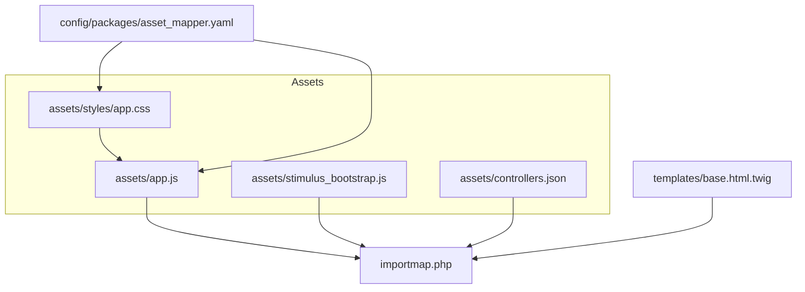
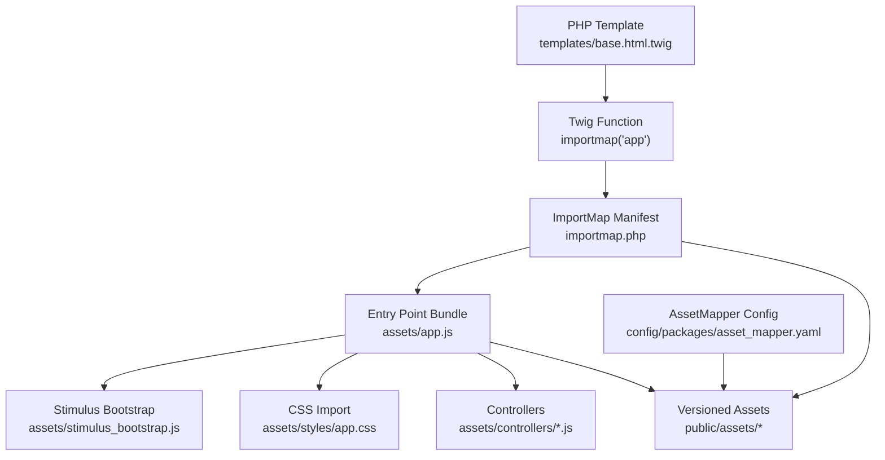
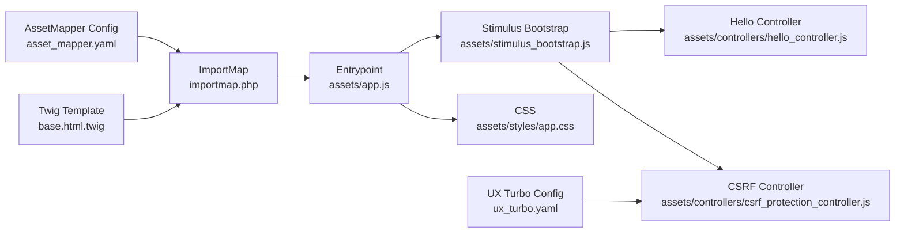

# Asset Management

<cite>
**Referenced Files in This Document**
- [importmap.php](file://importmap.php)
- [asset_mapper.yaml](file://config/packages/asset_mapper.yaml)
- [app.js](file://assets/app.js)
- [stimulus_bootstrap.js](file://assets/stimulus_bootstrap.js)
- [app.css](file://assets/styles/app.css)
- [controllers.json](file://assets/controllers.json)
- [composer.json](file://composer.json)
- [framework.yaml](file://config/packages/framework.yaml)
- [twig.yaml](file://config/packages/twig.yaml)
- [base.html.twig](file://templates/base.html.twig)
- [csrf_protection_controller.js](file://assets/controllers/csrf_protection_controller.js)
- [hello_controller.js](file://assets/controllers/hello_controller.js)
- [bundles.php](file://config/bundles.php)
- [ux_turbo.yaml](file://config/ux_turbo.yaml)
</cite>

## Table of Contents
1. [Introduction](#introduction)
2. [Project Structure](#project-structure)
3. [Core Components](#core-components)
4. [Architecture Overview](#architecture-overview)
5. [Detailed Component Analysis](#detailed-component-analysis)
6. [Dependency Analysis](#dependency-analysis)
7. [Performance Considerations](#performance-considerations)
8. [Troubleshooting Guide](#troubleshooting-guide)
9. [Conclusion](#conclusion)
10. [Appendices](#appendices)

## Introduction
This document explains how asset management works in this Symfony project using AssetMapper and ImportMap. It covers the asset pipeline configuration, JavaScript module imports, CSS processing workflow, importmap.php setup, package management, dependency resolution, build and development processes, and how PHP templates integrate with frontend assets. Practical guidance is provided for importing external libraries, local modules, optimizing assets, and debugging workflows.

## Project Structure
The asset system centers around:
- assets/ directory containing JavaScript, CSS, and Stimulus controllers
- importmap.php defining import map entries and entrypoints
- config/packages/asset_mapper.yaml configuring AssetMapper behavior
- templates/base.html.twig rendering the importmap() Twig function
- composer.json declaring Symfony packages and scripts for asset installation

**Diagram sources**
- [app.js:1-11](file://assets/app.js#L1-L11)
- [app.css:1-3](file://assets/styles/app.css#L1-L3)
- [stimulus_bootstrap.js:1-6](file://assets/stimulus_bootstrap.js#L1-L6)
- [controllers.json:1-16](file://assets/controllers.json#L1-L16)
- [importmap.php:1-29](file://importmap.php#L1-L29)
- [asset_mapper.yaml:1-12](file://config/packages/asset_mapper.yaml#L1-L12)
- [base.html.twig:87-90](file://templates/base.html.twig#L87-L90)

**Section sources**
- [asset_mapper.yaml:1-12](file://config/packages/asset_mapper.yaml#L1-L12)
- [importmap.php:1-29](file://importmap.php#L1-L29)
- [app.js:1-11](file://assets/app.js#L1-L11)
- [base.html.twig:87-90](file://templates/base.html.twig#L87-L90)

## Core Components
- AssetMapper configuration:
  - Declares the assets/ directory as an asset source and sets missing import behavior per environment.
- ImportMap definition:
  - Declares the primary entrypoint app and third-party packages with versions or local paths.
- Frontend entrypoint:
  - assets/app.js imports Stimulus bootstrap and CSS, acting as the single JS entrypoint.
- Twig integration:
  - templates/base.html.twig renders the importmap('app') tag to include the generated import map and entrypoint bundle.

Key behaviors:
- Development vs production:
  - missing_import_mode is strict during development and warns in production.
- Entry points:
  - The app entrypoint is marked for inclusion via importmap().

**Section sources**
- [asset_mapper.yaml:1-12](file://config/packages/asset_mapper.yaml#L1-L12)
- [importmap.php:14-28](file://importmap.php#L14-L28)
- [app.js:1-11](file://assets/app.js#L1-L11)
- [base.html.twig:87-90](file://templates/base.html.twig#L87-L90)

## Architecture Overview
The asset pipeline links PHP templates to frontend assets through AssetMapper and ImportMap. AssetMapper scans assets/, resolves imports, and writes versioned assets to the public directory. ImportMap defines module names and versions, while Twig’s importmap() function emits the import map and loads the entrypoint bundle.

**Diagram sources**
- [base.html.twig:87-90](file://templates/base.html.twig#L87-L90)
- [importmap.php:14-28](file://importmap.php#L14-L28)
- [app.js:1-11](file://assets/app.js#L1-L11)
- [stimulus_bootstrap.js:1-6](file://assets/stimulus_bootstrap.js#L1-L6)
- [app.css:1-3](file://assets/styles/app.css#L1-L3)
- [asset_mapper.yaml:1-12](file://config/packages/asset_mapper.yaml#L1-L12)

## Detailed Component Analysis

### AssetMapper Configuration
- Paths:
  - assets/ is exposed to AssetMapper so imports resolve against this directory.
- Missing import behavior:
  - Strict mode in development helps catch typos early.
  - Warn mode in production avoids hard failures while logging issues.

Environment-specific behavior:
- Production switches missing_import_mode to warn to prevent build-time errors.

**Section sources**
- [asset_mapper.yaml:1-12](file://config/packages/asset_mapper.yaml#L1-L12)

### ImportMap Setup (importmap.php)
- Entrypoints:
  - app is declared as an entrypoint and mapped to assets/app.js.
- Third-party packages:
  - @hotwired/stimulus and @hotwired/turbo are pinned to specific versions.
  - @symfony/stimulus-bundle is mapped to a local loader script path.
- Local loader:
  - assets/stimulus_bootstrap.js initializes Stimulus using the Symfony bundle loader.

**Section sources**
- [importmap.php:14-28](file://importmap.php#L14-L28)
- [stimulus_bootstrap.js:1-6](file://assets/stimulus_bootstrap.js#L1-L6)

### Frontend Entrypoint (assets/app.js)
- Imports:
  - Stimulus bootstrap initializer.
  - Local CSS file to be processed and included.
- Purpose:
  - Acts as the single JS entrypoint loaded by the importmap() Twig function.

**Section sources**
- [app.js:1-11](file://assets/app.js#L1-L11)

### CSS Processing Workflow
- assets/app.js imports assets/styles/app.css.
- AssetMapper processes CSS imports and writes versioned assets to public/assets/.
- The importmap() function emits the import map and loads the entrypoint bundle, which includes the CSS.

**Section sources**
- [app.js:8-8](file://assets/app.js#L8-L8)
- [app.css:1-3](file://assets/styles/app.css#L1-L3)
- [asset_mapper.yaml:1-12](file://config/packages/asset_mapper.yaml#L1-L12)

### Stimulus Controllers and CSRF Protection
- Hello controller:
  - Demonstrates a basic Stimulus controller connected to assets/controllers/hello_controller.js.
- CSRF protection controller:
  - Handles CSRF token generation, cookie setting, and header injection for Turbo form submissions.
  - Integrates with Symfony’s CSRF protection header checking.

**Section sources**
- [hello_controller.js:1-17](file://assets/controllers/hello_controller.js#L1-L17)
- [csrf_protection_controller.js:1-82](file://assets/controllers/csrf_protection_controller.js#L1-L82)

### Package Management and Scripts
- Composer requirements:
  - symfony/asset-mapper and related UX/Turbo/Stimulus packages are included.
- Scripts:
  - auto-scripts include assets:install and importmap:install to prepare assets and import map.

**Section sources**
- [composer.json:6-48](file://composer.json#L6-L48)
- [composer.json:88-99](file://composer.json#L88-L99)

### Twig Integration and Template Rendering
- templates/base.html.twig:
  - Provides a block for importmap() to render the import map and entrypoint.
  - Ensures the entrypoint app is loaded via importmap('app').

**Section sources**
- [base.html.twig:87-90](file://templates/base.html.twig#L87-L90)

### Controllers Configuration
- assets/controllers.json:
  - Declares controllers for UX Turbo and entrypoints.
  - Controls eager loading and enablement of specific controllers.

**Section sources**
- [controllers.json:1-16](file://assets/controllers.json#L1-L16)

## Dependency Analysis
- AssetMapper depends on:
  - assets/ directory and importmap.php for resolving and bundling.
- Twig depends on:
  - importmap() to emit the import map and load the entrypoint bundle.
- Stimulus integration depends on:
  - @symfony/stimulus-bundle loader and @hotwired/stimulus for controllers.
- Turbo integration depends on:
  - @hotwired/turbo and CSRF protection configuration.

**Diagram sources**
- [asset_mapper.yaml:1-12](file://config/packages/asset_mapper.yaml#L1-L12)
- [importmap.php:14-28](file://importmap.php#L14-L28)
- [app.js:1-11](file://assets/app.js#L1-L11)
- [stimulus_bootstrap.js:1-6](file://assets/stimulus_bootstrap.js#L1-L6)
- [app.css:1-3](file://assets/styles/app.css#L1-L3)
- [base.html.twig:87-90](file://templates/base.html.twig#L87-L90)
- [hello_controller.js:1-17](file://assets/controllers/hello_controller.js#L1-L17)
- [csrf_protection_controller.js:1-82](file://assets/controllers/csrf_protection_controller.js#L1-L82)
- [ux_turbo.yaml:1-5](file://config/ux_turbo.yaml#L1-L5)

**Section sources**
- [asset_mapper.yaml:1-12](file://config/packages/asset_mapper.yaml#L1-L12)
- [importmap.php:14-28](file://importmap.php#L14-L28)
- [app.js:1-11](file://assets/app.js#L1-L11)
- [base.html.twig:87-90](file://templates/base.html.twig#L87-L90)
- [ux_turbo.yaml:1-5](file://config/ux_turbo.yaml#L1-L5)

## Performance Considerations
- Missing import behavior:
  - Use strict mode in development to catch issues early; switch to warn in production to avoid build failures.
- Asset versioning:
  - AssetMapper writes versioned assets to public/assets/. Prefer relying on AssetMapper’s versioning rather than manual cache-busting.
- CSS and JS bundling:
  - Keep a single entrypoint (app) to minimize overhead and simplify dependency resolution.
- Vendor scripts:
  - Use importmap.php to pin versions of third-party libraries (@hotwired/stimulus, @hotwired/turbo) for stability.
- Templates:
  - Load only necessary assets in blocks to reduce payload.

[No sources needed since this section provides general guidance]

## Troubleshooting Guide
- Missing imports in development:
  - With missing_import_mode set to strict, unresolved imports will cause exceptions. Verify import paths and ensure files exist under assets/.
- Production warnings:
  - With missing_import_mode set to warn, unresolved imports log warnings. Review and fix import paths.
- Stimulus initialization:
  - Ensure @symfony/stimulus-bundle loader is present and assets/stimulus_bootstrap.js is imported by the entrypoint.
- CSRF and Turbo:
  - Confirm CSRF header checking is enabled in framework configuration and that the CSRF controller attaches to forms.
- Twig importmap rendering:
  - Ensure templates/base.html.twig includes the importmap('app') block.

**Section sources**
- [asset_mapper.yaml:6-11](file://config/packages/asset_mapper.yaml#L6-L11)
- [stimulus_bootstrap.js:1-6](file://assets/stimulus_bootstrap.js#L1-L6)
- [csrf_protection_controller.js:1-82](file://assets/controllers/csrf_protection_controller.js#L1-L82)
- [base.html.twig:87-90](file://templates/base.html.twig#L87-L90)

## Conclusion
This project integrates AssetMapper and ImportMap to deliver a modern, versioned asset pipeline. AssetMapper scans assets/, resolves imports, and writes versioned assets to public/assets/. ImportMap defines entrypoints and third-party dependencies, while Twig’s importmap() function renders the import map and loads the entrypoint bundle. Development and production environments are configured to balance strictness and stability. Following the patterns shown here ensures predictable builds, efficient asset loading, and maintainable frontend code.

[No sources needed since this section summarizes without analyzing specific files]

## Appendices

### Build and Development Workflow
- Development:
  - Run the application in debug mode. AssetMapper resolves imports strictly and reports issues immediately.
- Production:
  - Build and deploy with missing_import_mode set to warn to avoid build-time failures.
- Scripts:
  - Composer auto-scripts install assets and import map entries automatically.

**Section sources**
- [asset_mapper.yaml:8-11](file://config/packages/asset_mapper.yaml#L8-L11)
- [composer.json:88-99](file://composer.json#L88-L99)

### Importing External Libraries and Local Modules
- External libraries:
  - Add entries to importmap.php with versions for @hotwired/stimulus and @hotwired/turbo.
- Local modules:
  - Import local files from assets/ using relative paths in the entrypoint or other modules.

**Section sources**
- [importmap.php:19-27](file://importmap.php#L19-L27)
- [app.js:1-11](file://assets/app.js#L1-L11)

### Hot Module Replacement and Development Server
- AssetMapper supports a development server returning assets from the public directory in debug mode.
- Configure dev server behavior via AssetMapper configuration keys such as server and public_prefix.

**Section sources**
- [asset_mapper.yaml:1-12](file://config/packages/asset_mapper.yaml#L1-L12)
- [config/reference.php:290-292](file://config/reference.php#L290-L292)

### Debugging Workflows
- Use the debug:asset-map command to inspect the asset map and resolve path issues.
- Verify importmap rendering in templates/base.html.twig.
- Check Stimulus controller registration and Turbo CSRF integration.

**Section sources**
- [importmap.php:6-12](file://importmap.php#L6-L12)
- [base.html.twig:87-90](file://templates/base.html.twig#L87-L90)
- [csrf_protection_controller.js:1-82](file://assets/controllers/csrf_protection_controller.js#L1-L82)