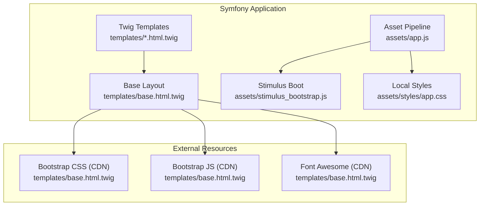
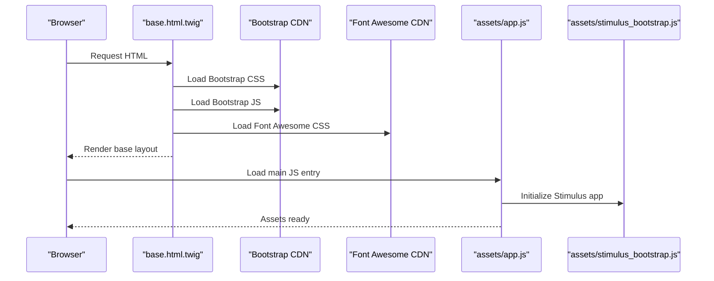
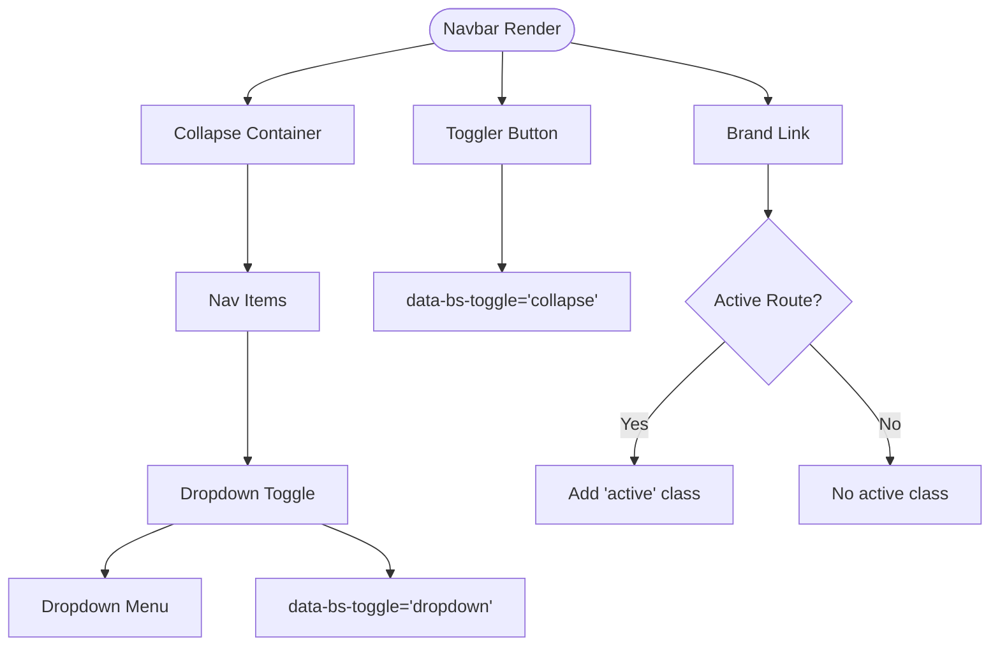
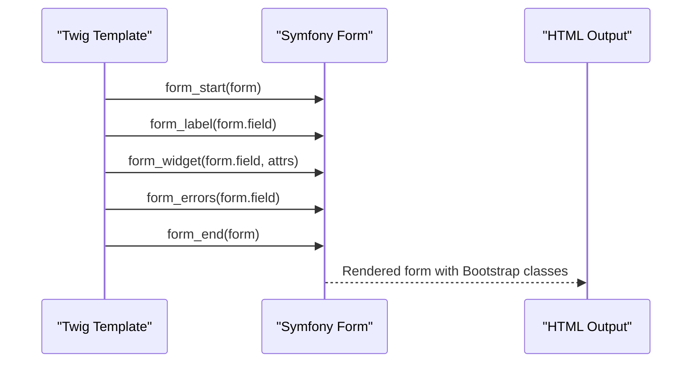
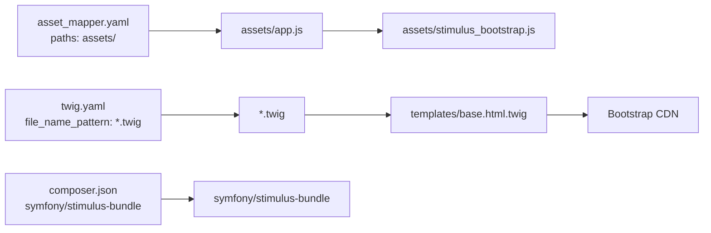

# Bootstrap Integration

<cite>
**Referenced Files in This Document**
- [assets/app.js](file://assets/app.js)
- [assets/stimulus_bootstrap.js](file://assets/stimulus_bootstrap.js)
- [assets/styles/app.css](file://assets/styles/app.css)
- [templates/base.html.twig](file://templates/base.html.twig)
- [templates/admin/dashboard.html.twig](file://templates/admin/dashboard.html.twig)
- [templates/maison/index.html.twig](file://templates/maison/index.html.twig)
- [templates/maison/_form.html.twig](file://templates/maison/_form.html.twig)
- [templates/client/_form.html.twig](file://templates/client/_form.html.twig)
- [templates/registration/register.html.twig](file://templates/registration/register.html.twig)
- [templates/login/index.html.twig](file://templates/login/index.html.twig)
- [composer.json](file://composer.json)
- [config/packages/asset_mapper.yaml](file://config/packages/asset_mapper.yaml)
- [config/packages/twig.yaml](file://config/packages/twig.yaml)
</cite>

## Table of Contents
1. [Introduction](#introduction)
2. [Project Structure](#project-structure)
3. [Core Components](#core-components)
4. [Architecture Overview](#architecture-overview)
5. [Detailed Component Analysis](#detailed-component-analysis)
6. [Dependency Analysis](#dependency-analysis)
7. [Performance Considerations](#performance-considerations)
8. [Troubleshooting Guide](#troubleshooting-guide)
9. [Conclusion](#conclusion)
10. [Appendices](#appendices)

## Introduction
This document explains how Bootstrap 5 is integrated into the Symfony application. It covers CSS framework setup, component usage, responsive grid system, utilities, and custom styling. It also documents how Bootstrap classes are applied in Twig templates, how JavaScript plugins are initialized, and how theme consistency is maintained across pages. Accessibility, mobile-first design, and cross-browser considerations are addressed.

## Project Structure
Bootstrap is integrated at two layers:
- Frontend asset pipeline: Bootstrap CSS and JS are loaded via CDN in the base layout, while local styles and Stimulus bootstrapping are handled by AssetMapper and Stimulus bundle.
- Twig templates: Bootstrap utility and component classes are applied directly in templates for navigation, cards, forms, alerts, and tables.

**Diagram sources**
- [templates/base.html.twig:87-90](file://templates/base.html.twig#L87-L90)
- [assets/app.js:1-11](file://assets/app.js#L1-L11)
- [assets/stimulus_bootstrap.js:1-6](file://assets/stimulus_bootstrap.js#L1-L6)
- [assets/styles/app.css:1-3](file://assets/styles/app.css#L1-L3)

**Section sources**
- [templates/base.html.twig:87-90](file://templates/base.html.twig#L87-L90)
- [assets/app.js:1-11](file://assets/app.js#L1-L11)
- [assets/stimulus_bootstrap.js:1-6](file://assets/stimulus_bootstrap.js#L1-L6)
- [assets/styles/app.css:1-3](file://assets/styles/app.css#L1-L3)

## Core Components
- Base layout and theme: The base layout defines the viewport, loads Bootstrap CSS and JS from CDN, Font Awesome, and injects a custom stylesheet with CSS variables and component overrides.
- Navigation bar: A responsive navbar with toggler, dropdown menus, and brand link, leveraging Bootstrap’s grid and component classes.
- Alerts and flash messages: Flash messages are rendered as Bootstrap alerts with dismiss controls.
- Cards: Used in registration and login pages for content containers with shadows and header styling.
- Forms: Symfony form widgets are wrapped with Bootstrap form classes (labels, inputs, checkboxes, buttons).
- Tables: Data lists use Bootstrap tables with hover and responsive enhancements.
- Asset pipeline: Local JavaScript and Stimulus bootstrapping are included via AssetMapper; local CSS is imported in the main JS entry.

**Section sources**
- [templates/base.html.twig:9-84](file://templates/base.html.twig#L9-L84)
- [templates/base.html.twig:94-161](file://templates/base.html.twig#L94-L161)
- [templates/base.html.twig:163-174](file://templates/base.html.twig#L163-L174)
- [templates/registration/register.html.twig:8-39](file://templates/registration/register.html.twig#L8-L39)
- [templates/login/index.html.twig:8-57](file://templates/login/index.html.twig#L8-L57)
- [templates/maison/_form.html.twig:1-44](file://templates/maison/_form.html.twig#L1-L44)
- [templates/client/_form.html.twig:1-30](file://templates/client/_form.html.twig#L1-L30)
- [templates/maison/index.html.twig:8-40](file://templates/maison/index.html.twig#L8-L40)
- [assets/app.js:1-11](file://assets/app.js#L1-L11)

## Architecture Overview
The Bootstrap integration follows a CDN-first approach for core CSS/JS, complemented by local overrides and component customizations. Stimulus bootstrapping is configured to enable interactive behaviors, while AssetMapper manages local assets.

**Diagram sources**
- [templates/base.html.twig:87-90](file://templates/base.html.twig#L87-L90)
- [assets/app.js:1-11](file://assets/app.js#L1-L11)
- [assets/stimulus_bootstrap.js:1-6](file://assets/stimulus_bootstrap.js#L1-L6)

## Detailed Component Analysis

### Responsive Grid System and Utilities
- Container and spacing: The main content area uses a responsive container with top margin. Utility classes like justify-content-center and responsive column widths are used in login and registration pages.
- Column sizing: Examples include centered card layouts using md and lg breakpoint-specific column sizes.
- Flex utilities: Flex alignment utilities support navbar items and form layouts.

**Section sources**
- [templates/base.html.twig:163](file://templates/base.html.twig#L163)
- [templates/registration/register.html.twig:6-41](file://templates/registration/register.html.twig#L6-L41)
- [templates/login/index.html.twig:6-58](file://templates/login/index.html.twig#L6-L58)

### Navigation Bar and Dropdowns
- Responsive navbar: Uses expand classes, toggler, and collapse container. Brand and nav items leverage utility classes for spacing and active states.
- Dropdowns: Dropdown toggles and menu items are styled with Bootstrap classes; icons enhance visual cues.
- Theming: Custom CSS variables define gradients and shadows for the navbar.

**Diagram sources**
- [templates/base.html.twig:94-161](file://templates/base.html.twig#L94-L161)

**Section sources**
- [templates/base.html.twig:94-161](file://templates/base.html.twig#L94-L161)

### Cards and Content Containers
- Card usage: Registration and login pages wrap content in Bootstrap cards with header styling and shadows.
- Theming: Header colors reflect primary and secondary theme colors; hover effects are customized via CSS.

**Section sources**
- [templates/registration/register.html.twig:8-39](file://templates/registration/register.html.twig#L8-L39)
- [templates/login/index.html.twig:8-57](file://templates/login/index.html.twig#L8-L57)
- [templates/base.html.twig:45-54](file://templates/base.html.twig#L45-L54)

### Forms and Validation States
- Form rendering: Symfony form helpers apply Bootstrap classes to labels, inputs, and checkboxes. Buttons use primary button classes.
- Validation feedback: Form errors are displayed inline with Bootstrap form helpers.
- Spacing and layout: Utility classes like mb-3 and d-grid gap-2 organize form groups and submit actions.

**Diagram sources**
- [templates/maison/_form.html.twig:1-44](file://templates/maison/_form.html.twig#L1-L44)
- [templates/client/_form.html.twig:1-30](file://templates/client/_form.html.twig#L1-L30)
- [templates/registration/register.html.twig:15-37](file://templates/registration/register.html.twig#L15-L37)

**Section sources**
- [templates/maison/_form.html.twig:1-44](file://templates/maison/_form.html.twig#L1-L44)
- [templates/client/_form.html.twig:1-30](file://templates/client/_form.html.twig#L1-L30)
- [templates/registration/register.html.twig:15-37](file://templates/registration/register.html.twig#L15-L37)
- [templates/login/index.html.twig:32-54](file://templates/login/index.html.twig#L32-L54)

### Tables and Data Presentation
- Table styling: Data listings use Bootstrap table classes with hover effects and responsive containers.
- Dashboard tables: EasyAdmin dashboard leverages responsive tables and badges for statuses.

**Section sources**
- [templates/maison/index.html.twig:8-40](file://templates/maison/index.html.twig#L8-L40)
- [templates/admin/dashboard.html.twig:108-128](file://templates/admin/dashboard.html.twig#L108-L128)
- [templates/admin/dashboard.html.twig:145-166](file://templates/admin/dashboard.html.twig#L145-L166)
- [templates/admin/dashboard.html.twig:186-218](file://templates/admin/dashboard.html.twig#L186-L218)

### Alerts and Flash Messages
- Alert rendering: Flash messages are shown as Bootstrap alerts with dismiss controls.
- Security errors: Login page displays security-related errors as alerts.

**Section sources**
- [templates/base.html.twig:163-174](file://templates/base.html.twig#L163-L174)
- [templates/login/index.html.twig:13-25](file://templates/login/index.html.twig#L13-L25)

### Custom Styling and Theme Consistency
- CSS variables: Root-level variables define primary, secondary, accent, and light background colors.
- Component overrides: Navbar, cards, buttons, alerts, and tables receive custom styling for gradients, shadows, and transitions.
- Local CSS: A minimal background override exists in the local stylesheet.

**Section sources**
- [templates/base.html.twig:11-84](file://templates/base.html.twig#L11-L84)
- [assets/styles/app.css:1-3](file://assets/styles/app.css#L1-L3)

### Bootstrap JavaScript Plugins and Initialization
- Plugin loading: Bootstrap JS bundle is loaded from CDN in the base layout.
- Initialization: No manual plugin initialization is performed in the current code; Bootstrap components rely on data attributes (e.g., toggles, dropdowns).
- Stimulus integration: Stimulus app is started but no custom controllers are registered in the provided code.

**Section sources**
- [templates/base.html.twig:87-90](file://templates/base.html.twig#L87-L90)
- [assets/stimulus_bootstrap.js:1-6](file://assets/stimulus_bootstrap.js#L1-L6)

### Accessibility and Mobile-First Design
- Viewport meta tag ensures proper scaling on mobile devices.
- Semantic markup: Lists, tables, and form elements use appropriate semantic structures.
- Focus and keyboard navigation: Bootstrap components (toggles, dropdowns) are designed to be keyboard accessible by default.
- Responsive breakpoints: Column classes and utility classes adapt content across device sizes.

**Section sources**
- [templates/base.html.twig:4-5](file://templates/base.html.twig#L4-L5)
- [templates/base.html.twig:94-161](file://templates/base.html.twig#L94-L161)
- [templates/registration/register.html.twig:6-41](file://templates/registration/register.html.twig#L6-L41)
- [templates/login/index.html.twig:6-58](file://templates/login/index.html.twig#L6-L58)

## Dependency Analysis
- AssetMapper configuration exposes the assets directory and enforces strict import modes for missing imports.
- Twig configuration sets the file pattern for templates.
- Composer requires the Stimulus bundle, enabling Stimulus bootstrapping in the frontend.

**Diagram sources**
- [config/packages/asset_mapper.yaml:1-12](file://config/packages/asset_mapper.yaml#L1-L12)
- [config/packages/twig.yaml:1-7](file://config/packages/twig.yaml#L1-L7)
- [composer.json:39](file://composer.json#L39)
- [assets/app.js:1-11](file://assets/app.js#L1-L11)
- [assets/stimulus_bootstrap.js:1-6](file://assets/stimulus_bootstrap.js#L1-L6)
- [templates/base.html.twig:87-90](file://templates/base.html.twig#L87-L90)

**Section sources**
- [config/packages/asset_mapper.yaml:1-12](file://config/packages/asset_mapper.yaml#L1-L12)
- [config/packages/twig.yaml:1-7](file://config/packages/twig.yaml#L1-L7)
- [composer.json:39](file://composer.json#L39)

## Performance Considerations
- CDN usage: Loading Bootstrap from CDN reduces local bandwidth and benefits from global caching.
- Minimized JS: Using the Bootstrap bundle minimizes payload while including all necessary plugins.
- Asset pipeline: AssetMapper handles local assets efficiently; ensure production builds optimize assets.

## Troubleshooting Guide
- Missing Bootstrap classes: Verify that the base layout includes Bootstrap CSS and JS CDNs.
- Stimulus not initializing: Confirm that the Stimulus boot script is executed after the DOM is ready.
- Local styles not applied: Ensure the main JS entry imports the local stylesheet and that AssetMapper is enabled.
- Form rendering issues: Check that form widgets include the correct Bootstrap classes and that form errors are rendered.

**Section sources**
- [templates/base.html.twig:87-90](file://templates/base.html.twig#L87-L90)
- [assets/stimulus_bootstrap.js:1-6](file://assets/stimulus_bootstrap.js#L1-L6)
- [assets/app.js:1-11](file://assets/app.js#L1-L11)
- [templates/maison/_form.html.twig:1-44](file://templates/maison/_form.html.twig#L1-L44)

## Conclusion
Bootstrap 5 is integrated via CDN for core CSS/JS and enhanced with local custom styles and Stimulus bootstrapping. Twig templates consistently apply Bootstrap utilities and components for navigation, cards, forms, tables, and alerts. The responsive grid and utility classes ensure mobile-first design, while data-attribute-driven plugins minimize manual initialization. Theme consistency is achieved through CSS variables and targeted component overrides.

## Appendices
- Responsive breakpoints and grid usage are demonstrated across registration, login, and dashboard templates.
- Utility classes such as justify-content-center, d-grid gap-2, mb-3, and text-center are widely used for layout and spacing.
- Component customization patterns include gradient backgrounds, shadows, and hover transitions for interactive elements.