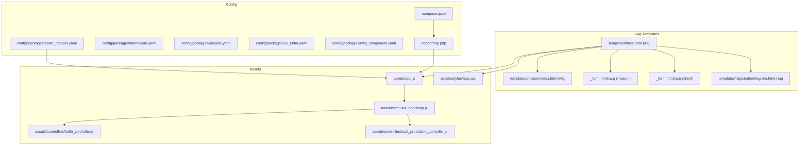
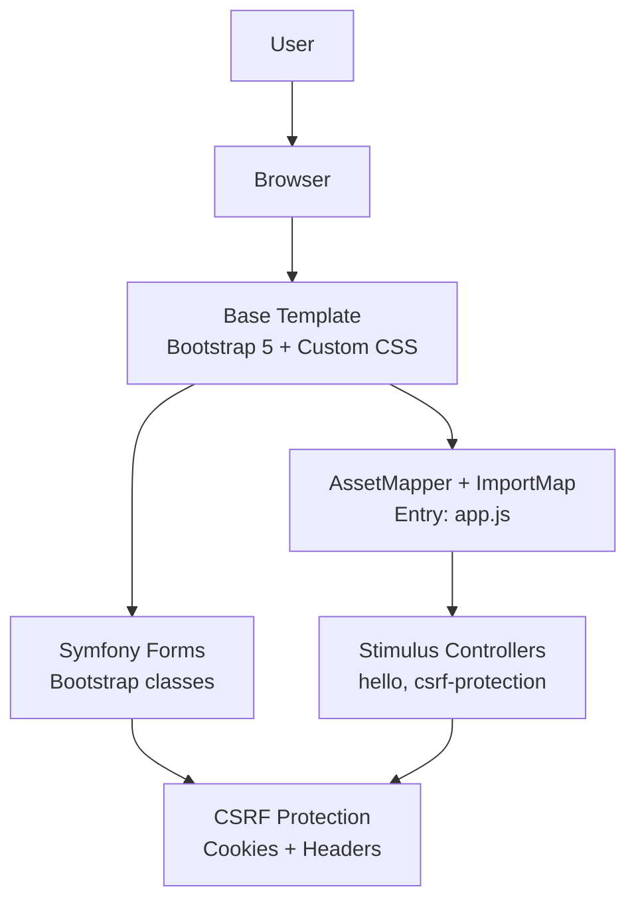
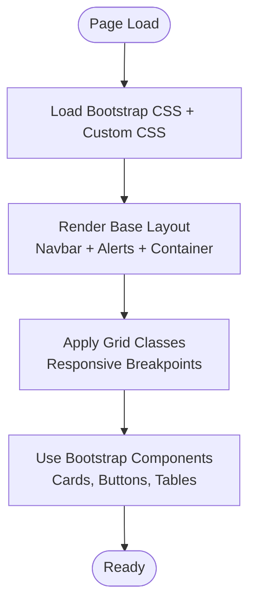
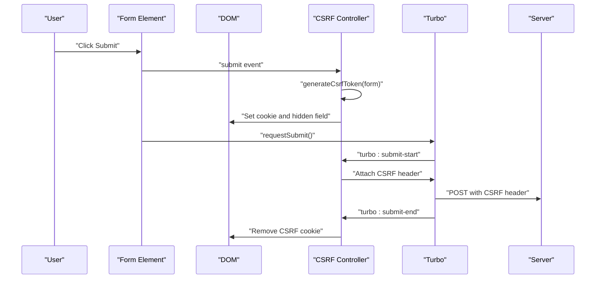
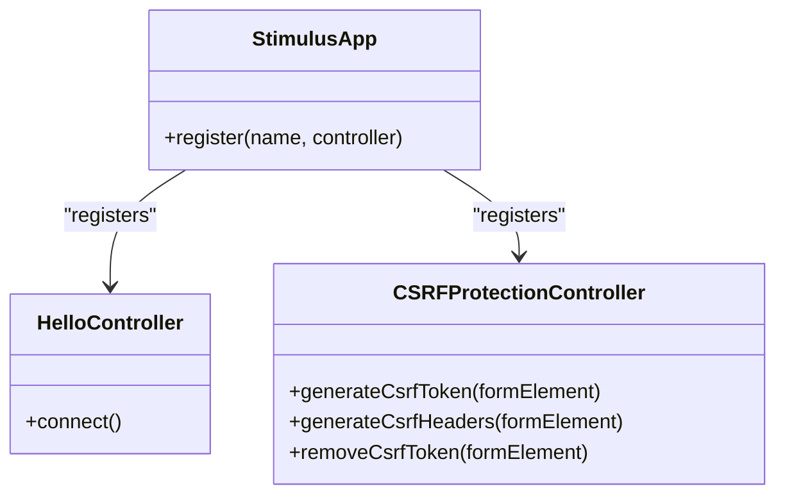
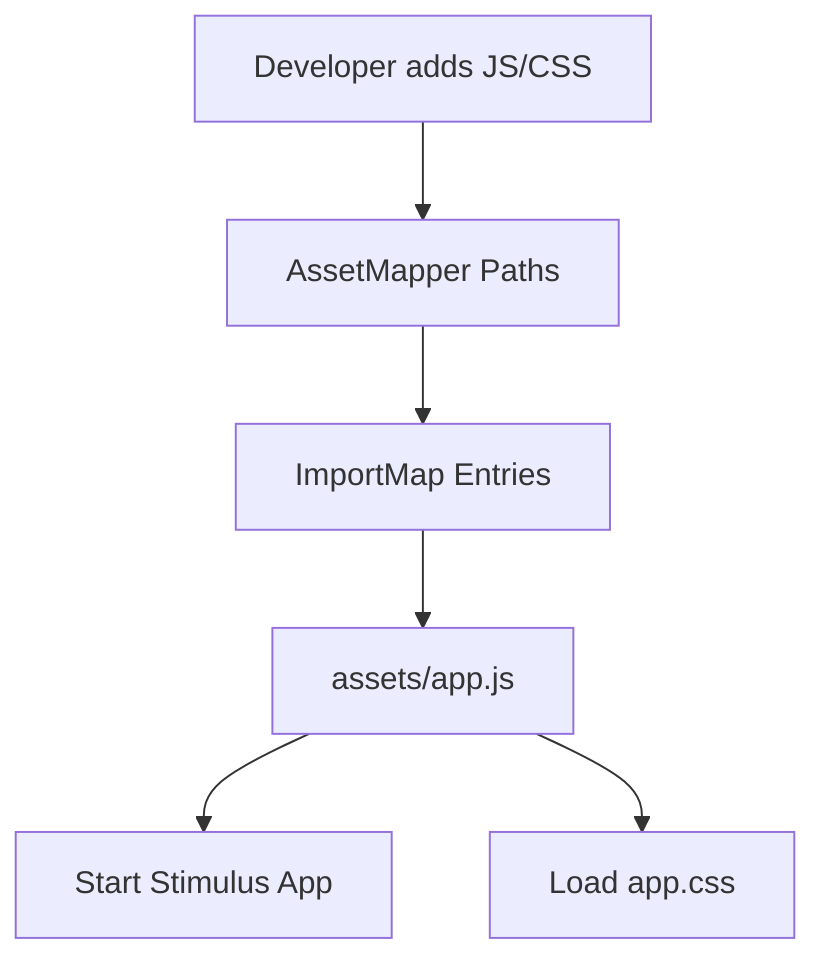
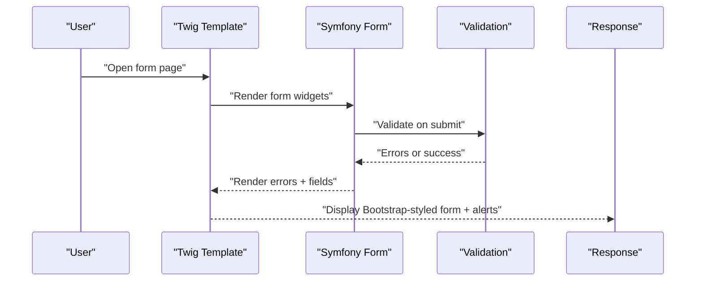
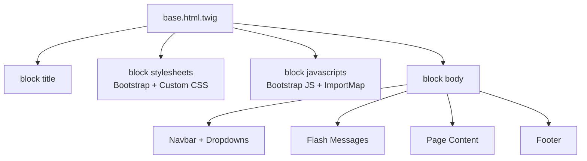
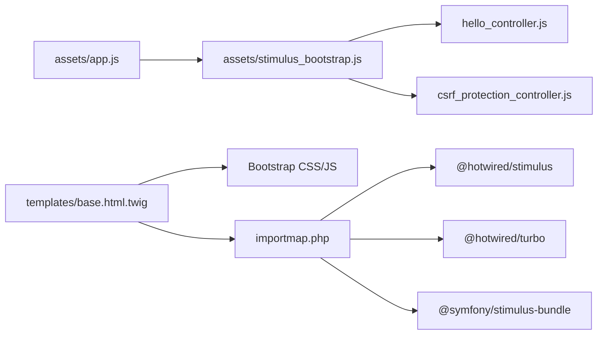

# Frontend Architecture

<cite>
**Referenced Files in This Document**
- [assets/app.js](file://assets/app.js)
- [assets/stimulus_bootstrap.js](file://assets/stimulus_bootstrap.js)
- [assets/controllers/hello_controller.js](file://assets/controllers/hello_controller.js)
- [assets/controllers/csrf_protection_controller.js](file://assets/controllers/csrf_protection_controller.js)
- [assets/styles/app.css](file://assets/styles/app.css)
- [templates/base.html.twig](file://templates/base.html.twig)
- [templates/maison/_form.html.twig](file://templates/maison/_form.html.twig)
- [templates/client/_form.html.twig](file://templates/client/_form.html.twig)
- [templates/maison/index.html.twig](file://templates/maison/index.html.twig)
- [templates/registration/register.html.twig](file://templates/registration/register.html.twig)
- [config/packages/asset_mapper.yaml](file://config/packages/asset_mapper.yaml)
- [config/packages/framework.yaml](file://config/packages/framework.yaml)
- [config/packages/security.yaml](file://config/packages/security.yaml)
- [config/packages/ux_turbo.yaml](file://config/packages/ux_turbo.yaml)
- [config/packages/twig_component.yaml](file://config/packages/twig_component.yaml)
- [importmap.php](file://importmap.php)
- [composer.json](file://composer.json)
</cite>

## Table of Contents
1. [Introduction](#introduction)
2. [Project Structure](#project-structure)
3. [Core Components](#core-components)
4. [Architecture Overview](#architecture-overview)
5. [Detailed Component Analysis](#detailed-component-analysis)
6. [Dependency Analysis](#dependency-analysis)
7. [Performance Considerations](#performance-considerations)
8. [Troubleshooting Guide](#troubleshooting-guide)
9. [Conclusion](#conclusion)
10. [Appendices](#appendices)

## Introduction
This document explains the frontend architecture and user interface of the project, focusing on:
- Bootstrap 5 integration and responsive design
- Stimulus.js controller system and interactivity
- Asset management via AssetMapper and ImportMap
- Build processes and performance optimization
- Form validation feedback and UX enhancements
- Accessibility and security considerations
- Base template structure, layout inheritance, and component reusability
- Browser compatibility and progressive enhancement

## Project Structure
The frontend stack combines Symfony’s AssetMapper and ImportMap with Stimulus.js and Bootstrap 5. The base template defines global styles, scripts, and layout blocks. Controllers live under assets/controllers and are registered via a small bootstrap script. Forms are rendered in Twig using Bootstrap classes and Symfony Form helpers.

**Diagram sources**
- [templates/base.html.twig:1-184](file://templates/base.html.twig#L1-L184)
- [assets/app.js:1-11](file://assets/app.js#L1-L11)
- [assets/stimulus_bootstrap.js:1-6](file://assets/stimulus_bootstrap.js#L1-L6)
- [assets/controllers/hello_controller.js:1-17](file://assets/controllers/hello_controller.js#L1-L17)
- [assets/controllers/csrf_protection_controller.js:1-82](file://assets/controllers/csrf_protection_controller.js#L1-L82)
- [assets/styles/app.css:1-3](file://assets/styles/app.css#L1-L3)
- [config/packages/asset_mapper.yaml:1-12](file://config/packages/asset_mapper.yaml#L1-L12)
- [config/packages/framework.yaml:1-16](file://config/packages/framework.yaml#L1-L16)
- [config/packages/security.yaml:1-55](file://config/packages/security.yaml#L1-L55)
- [config/packages/ux_turbo.yaml:1-5](file://config/packages/ux_turbo.yaml#L1-L5)
- [config/packages/twig_component.yaml:1-6](file://config/packages/twig_component.yaml#L1-L6)
- [importmap.php:1-29](file://importmap.php#L1-L29)
- [composer.json:1-111](file://composer.json#L1-L111)

**Section sources**
- [templates/base.html.twig:1-184](file://templates/base.html.twig#L1-L184)
- [assets/app.js:1-11](file://assets/app.js#L1-L11)
- [assets/stimulus_bootstrap.js:1-6](file://assets/stimulus_bootstrap.js#L1-L6)
- [config/packages/asset_mapper.yaml:1-12](file://config/packages/asset_mapper.yaml#L1-L12)
- [importmap.php:1-29](file://importmap.php#L1-L29)
- [composer.json:1-111](file://composer.json#L1-L111)

## Core Components
- Bootstrap 5 integration: Loaded via CDN in the base template and styled globally with custom CSS variables and component overrides.
- Stimulus.js controllers: Registered via a dedicated bootstrap script; includes a demo controller and a CSRF protection controller.
- AssetMapper and ImportMap: AssetMapper exposes assets/ to the frontend; ImportMap declares app entrypoint and third-party packages.
- Forms: Rendered with Symfony Form components and Bootstrap classes for responsive layout and validation feedback.
- Layout inheritance: All pages extend base.html.twig and override blocks for title and body.

**Section sources**
- [templates/base.html.twig:8-85](file://templates/base.html.twig#L8-L85)
- [assets/stimulus_bootstrap.js:1-6](file://assets/stimulus_bootstrap.js#L1-L6)
- [assets/controllers/hello_controller.js:1-17](file://assets/controllers/hello_controller.js#L1-L17)
- [assets/controllers/csrf_protection_controller.js:1-82](file://assets/controllers/csrf_protection_controller.js#L1-L82)
- [templates/maison/_form.html.twig:1-44](file://templates/maison/_form.html.twig#L1-L44)
- [templates/client/_form.html.twig:1-30](file://templates/client/_form.html.twig#L1-L30)
- [templates/maison/index.html.twig:1-42](file://templates/maison/index.html.twig#L1-L42)
- [templates/registration/register.html.twig:1-42](file://templates/registration/register.html.twig#L1-L42)

## Architecture Overview
The frontend architecture follows a layered approach:
- Template layer (Twig): Provides layout, blocks, and reusable form fragments.
- Asset layer (AssetMapper/ImportMap): Manages JS/CSS entrypoints and package resolution.
- Behavior layer (Stimulus): Adds lightweight interactivity per element.
- Security layer (CSRF protection): Ensures safe form submissions via cookies and headers.

**Diagram sources**
- [templates/base.html.twig:1-184](file://templates/base.html.twig#L1-L184)
- [assets/app.js:1-11](file://assets/app.js#L1-L11)
- [assets/stimulus_bootstrap.js:1-6](file://assets/stimulus_bootstrap.js#L1-L6)
- [assets/controllers/csrf_protection_controller.js:1-82](file://assets/controllers/csrf_protection_controller.js#L1-L82)
- [templates/maison/_form.html.twig:1-44](file://templates/maison/_form.html.twig#L1-L44)

## Detailed Component Analysis

### Bootstrap 5 Integration and Responsive Design
- Global Bootstrap CSS is loaded from a CDN in the base template head.
- Custom CSS variables define primary, secondary, and accent colors; applied to navbars, cards, buttons, alerts, and tables.
- Responsive utilities are used in templates (e.g., centered card layout with grid breakpoints).
- Navbar toggler and collapse behavior are handled by Bootstrap JS.

**Diagram sources**
- [templates/base.html.twig:8-85](file://templates/base.html.twig#L8-L85)
- [templates/registration/register.html.twig:6-41](file://templates/registration/register.html.twig#L6-L41)

**Section sources**
- [templates/base.html.twig:8-85](file://templates/base.html.twig#L8-L85)
- [templates/registration/register.html.twig:6-41](file://templates/registration/register.html.twig#L6-L41)

### Stimulus.js Controller System
- Controllers are auto-registered via a bootstrap script that starts the Stimulus app.
- Demo controller demonstrates connecting to an element and updating its content.
- CSRF protection controller:
  - Listens to form submits and Turbo events.
  - Generates a CSRF token and sets a cookie pair.
  - Sends CSRF token in a custom header during Turbo submissions.
  - Removes the CSRF cookie after submission ends.
  - Includes validation checks for token and cookie name formats.

**Diagram sources**
- [assets/controllers/csrf_protection_controller.js:7-23](file://assets/controllers/csrf_protection_controller.js#L7-L23)
- [assets/controllers/csrf_protection_controller.js:25-45](file://assets/controllers/csrf_protection_controller.js#L25-L45)
- [assets/controllers/csrf_protection_controller.js:47-62](file://assets/controllers/csrf_protection_controller.js#L47-L62)
- [assets/controllers/csrf_protection_controller.js:64-78](file://assets/controllers/csrf_protection_controller.js#L64-L78)

**Diagram sources**
- [assets/controllers/hello_controller.js:12-16](file://assets/controllers/hello_controller.js#L12-L16)
- [assets/controllers/csrf_protection_controller.js:25-78](file://assets/controllers/csrf_protection_controller.js#L25-L78)
- [assets/stimulus_bootstrap.js:1-6](file://assets/stimulus_bootstrap.js#L1-L6)

**Section sources**
- [assets/stimulus_bootstrap.js:1-6](file://assets/stimulus_bootstrap.js#L1-L6)
- [assets/controllers/hello_controller.js:1-17](file://assets/controllers/hello_controller.js#L1-L17)
- [assets/controllers/csrf_protection_controller.js:1-82](file://assets/controllers/csrf_protection_controller.js#L1-L82)

### Asset Management with AssetMapper and ImportMap
- AssetMapper exposes the assets/ directory and enforces strict import mode in development.
- ImportMap defines the app entrypoint pointing to assets/app.js and registers Stimulus, Turbo, and the Stimulus loader.
- The app entrypoint imports the Stimulus bootstrap and local styles.

**Diagram sources**
- [config/packages/asset_mapper.yaml:4-6](file://config/packages/asset_mapper.yaml#L4-L6)
- [importmap.php:14-28](file://importmap.php#L14-L28)
- [assets/app.js:1-11](file://assets/app.js#L1-L11)

**Section sources**
- [config/packages/asset_mapper.yaml:1-12](file://config/packages/asset_mapper.yaml#L1-L12)
- [importmap.php:1-29](file://importmap.php#L1-L29)
- [assets/app.js:1-11](file://assets/app.js#L1-L11)

### Build Processes and Scripts
- Composer scripts automate cache clearing, assets installation, and ImportMap installation.
- AssetMapper and ImportMap are part of the Symfony 7.4 stack configured in composer.json.

**Section sources**
- [composer.json:88-99](file://composer.json#L88-L99)
- [composer.json:18-48](file://composer.json#L18-L48)

### Form Validation Feedback and UX Enhancements
- Forms use Bootstrap classes for labels, inputs, and validation messages.
- Flash messages render Bootstrap alerts with dismiss controls.
- Card-based layout for registration form improves readability and spacing.
- Responsive grid ensures forms adapt across devices.

**Diagram sources**
- [templates/maison/_form.html.twig:1-44](file://templates/maison/_form.html.twig#L1-L44)
- [templates/client/_form.html.twig:1-30](file://templates/client/_form.html.twig#L1-L30)
- [templates/registration/register.html.twig:13-37](file://templates/registration/register.html.twig#L13-L37)
- [templates/base.html.twig:164-171](file://templates/base.html.twig#L164-L171)

**Section sources**
- [templates/maison/_form.html.twig:1-44](file://templates/maison/_form.html.twig#L1-L44)
- [templates/client/_form.html.twig:1-30](file://templates/client/_form.html.twig#L1-L30)
- [templates/registration/register.html.twig:1-42](file://templates/registration/register.html.twig#L1-L42)
- [templates/base.html.twig:164-171](file://templates/base.html.twig#L164-L171)

### Base Template Structure and Layout Inheritance
- The base template defines meta tags, viewport, favicon, and block regions for stylesheets, javascripts, and body.
- Navigation bar uses Bootstrap classes, toggler, and dropdown menus.
- Flash messages are rendered centrally within the container.
- Footer is consistently placed at the bottom of the page.

**Diagram sources**
- [templates/base.html.twig:1-184](file://templates/base.html.twig#L1-L184)

**Section sources**
- [templates/base.html.twig:1-184](file://templates/base.html.twig#L1-L184)

### Component Reusability and Twig Components
- Twig components namespace is configured to load components from a dedicated directory.
- This enables modular UI composition and reuse across templates.

**Section sources**
- [config/packages/twig_component.yaml:1-6](file://config/packages/twig_component.yaml#L1-L6)

## Dependency Analysis
Key runtime dependencies and their roles:
- @hotwired/stimulus: Lightweight framework for attaching behavior to DOM elements.
- @symfony/stimulus-bundle: Loader and registration utilities for Stimulus in Symfony.
- @hotwired/turbo: Enables unobtrusive page navigation and form submission improvements.
- Bootstrap 5: UI framework for responsive components and utilities.
- AssetMapper and ImportMap: Asset pipeline and module resolution.

**Diagram sources**
- [assets/app.js:1-11](file://assets/app.js#L1-L11)
- [assets/stimulus_bootstrap.js:1-6](file://assets/stimulus_bootstrap.js#L1-L6)
- [assets/controllers/hello_controller.js:1-17](file://assets/controllers/hello_controller.js#L1-L17)
- [assets/controllers/csrf_protection_controller.js:1-82](file://assets/controllers/csrf_protection_controller.js#L1-L82)
- [templates/base.html.twig:87-90](file://templates/base.html.twig#L87-L90)
- [importmap.php:19-28](file://importmap.php#L19-L28)

**Section sources**
- [importmap.php:1-29](file://importmap.php#L1-L29)
- [composer.json:39-43](file://composer.json#L39-L43)

## Performance Considerations
- Prefer loading Bootstrap and icons from CDNs to leverage caching and reduce bundle size.
- Keep Stimulus controllers small and scoped to specific elements to minimize overhead.
- Use AssetMapper’s production warning mode to catch unused imports.
- Lazy-load controllers where appropriate to defer initialization.
- Minimize custom CSS and reuse Bootstrap utilities to reduce CSS payload.
- Ensure Turbo and CSRF controllers are only active where forms exist.

[No sources needed since this section provides general guidance]

## Troubleshooting Guide
- CSRF failures:
  - Verify the CSRF controller is attached to forms and that the cookie/header exchange occurs during Turbo submissions.
  - Confirm the server-side CSRF header checking is enabled.
- Stimulus not activating:
  - Ensure the Stimulus bootstrap is imported and controllers are auto-registered.
  - Check that data-controller attributes match controller names.
- Missing assets:
  - Confirm AssetMapper paths include assets/ and ImportMap entrypoint points to assets/app.js.
- Form validation not visible:
  - Ensure form errors are rendered and Bootstrap classes are applied to labels and inputs.

**Section sources**
- [assets/controllers/csrf_protection_controller.js:1-82](file://assets/controllers/csrf_protection_controller.js#L1-L82)
- [config/packages/ux_turbo.yaml:3-4](file://config/packages/ux_turbo.yaml#L3-L4)
- [assets/stimulus_bootstrap.js:1-6](file://assets/stimulus_bootstrap.js#L1-L6)
- [templates/maison/_form.html.twig:1-44](file://templates/maison/_form.html.twig#L1-L44)
- [config/packages/asset_mapper.yaml:4-6](file://config/packages/asset_mapper.yaml#L4-L6)
- [importmap.php:15-18](file://importmap.php#L15-L18)

## Conclusion
The frontend architecture integrates Bootstrap 5, AssetMapper, ImportMap, Stimulus.js, and Turbo to deliver a responsive, accessible, and secure user interface. The base template provides a consistent layout and global styling, while controllers encapsulate interactivity. Forms leverage Symfony Form components with Bootstrap classes for robust validation feedback. CSRF protection is enforced via cookies and headers, and Turbo enhances navigation and submission behavior. The structure supports component reusability and maintainability through Twig components and modular asset management.

[No sources needed since this section summarizes without analyzing specific files]

## Appendices

### Example: Interactive Component (Stimulus Controller)
- Controller name: hello
- Behavior: On connect, updates the element text to a greeting message.
- Registration: Auto via Stimulus bootstrap.

**Section sources**
- [assets/controllers/hello_controller.js:12-16](file://assets/controllers/hello_controller.js#L12-L16)
- [assets/stimulus_bootstrap.js:1-6](file://assets/stimulus_bootstrap.js#L1-L6)

### Example: Form Handling (Registration Page)
- Layout: Card-based, centered grid.
- Fields: Username, password, terms agreement.
- Validation: Errors rendered with Bootstrap alerts and inline messages.
- Submission: Uses Bootstrap-styled buttons and form helpers.

**Section sources**
- [templates/registration/register.html.twig:6-41](file://templates/registration/register.html.twig#L6-L41)
- [templates/maison/_form.html.twig:1-44](file://templates/maison/_form.html.twig#L1-L44)

### Example: Responsive Layout (Maison Index)
- Table with responsive design and action links.
- Action buttons styled with Bootstrap classes.

**Section sources**
- [templates/maison/index.html.twig:8-41](file://templates/maison/index.html.twig#L8-L41)

### Accessibility and Security Checklist
- Accessibility:
  - Use semantic HTML and ARIA attributes where needed.
  - Ensure sufficient color contrast for custom CSS variables.
  - Provide focus management for modals and dropdowns.
- Security:
  - CSRF protection via cookies and headers is enabled and enforced.
  - Session configuration is active and tested environments use mock storage.

**Section sources**
- [templates/base.html.twig:18-84](file://templates/base.html.twig#L18-L84)
- [config/packages/security.yaml:20-38](file://config/packages/security.yaml#L20-L38)
- [config/packages/framework.yaml:5-6](file://config/packages/framework.yaml#L5-L6)
- [config/packages/ux_turbo.yaml:3-4](file://config/packages/ux_turbo.yaml#L3-L4)