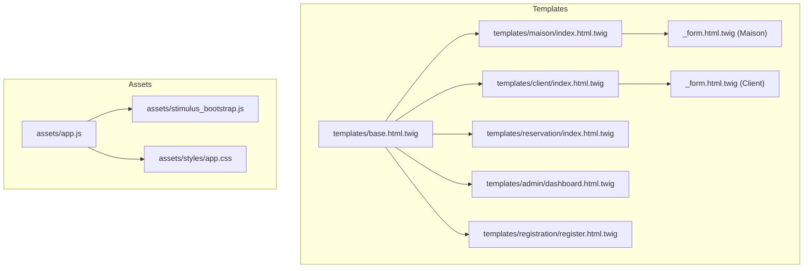
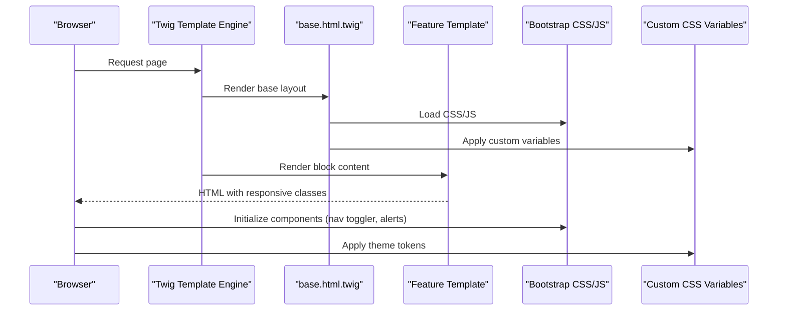
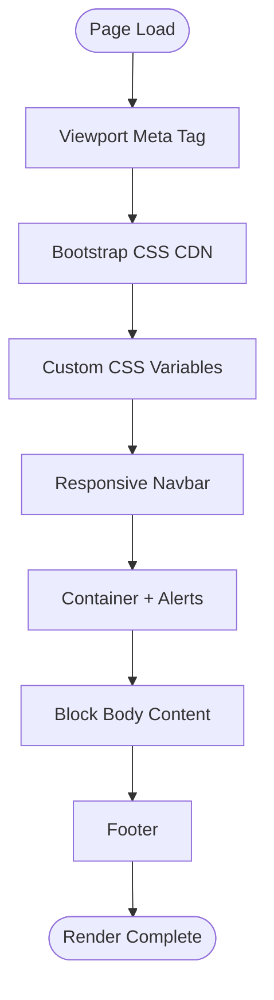
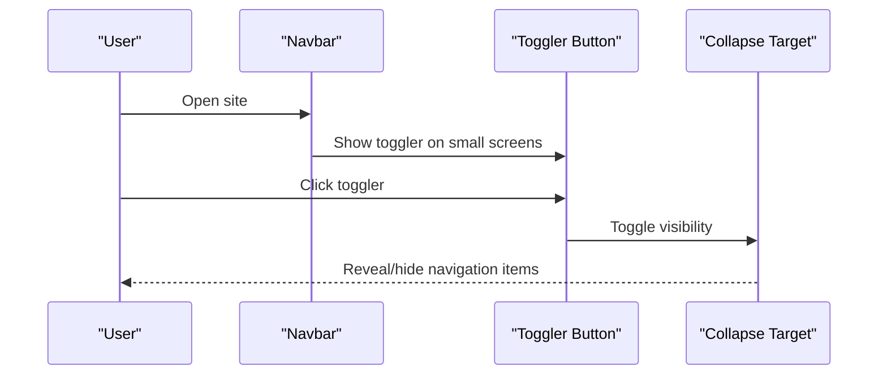
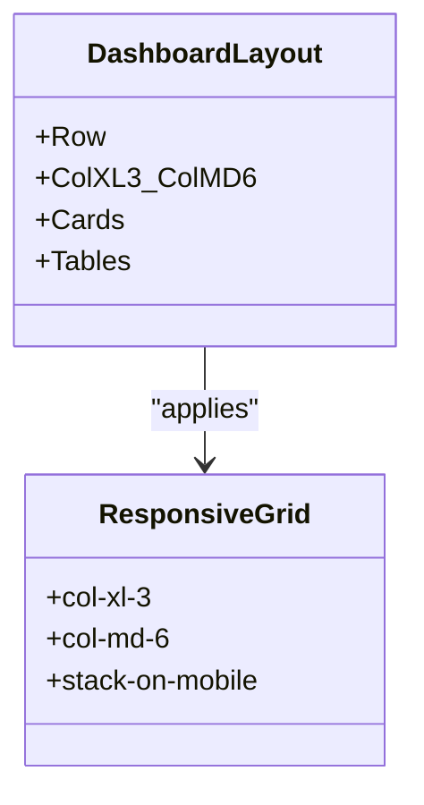
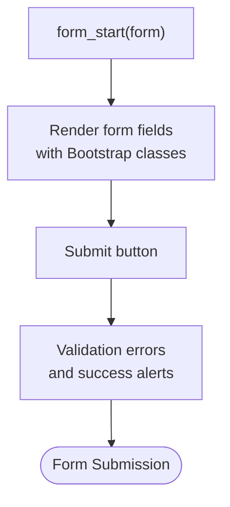
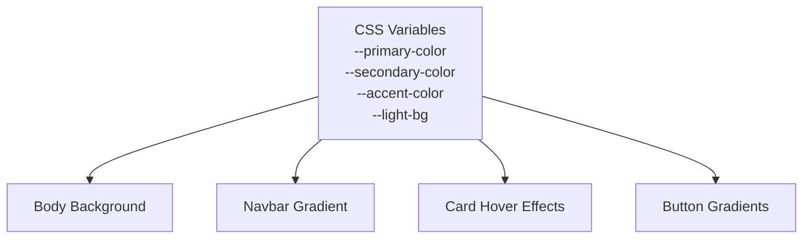
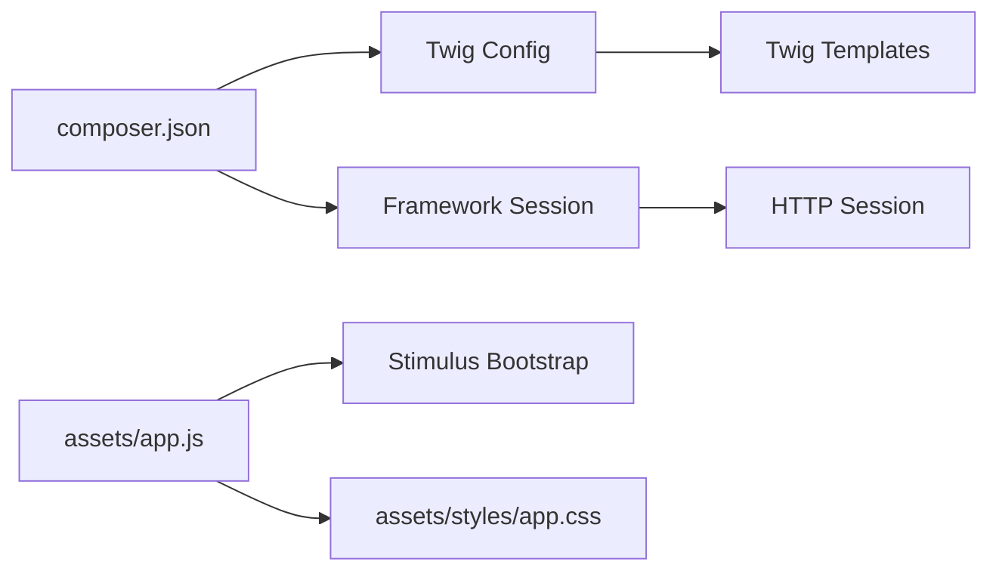

# Responsive Design & Layout

<cite>
**Referenced Files in This Document**
- [base.html.twig](file://templates/base.html.twig)
- [app.css](file://assets/styles/app.css)
- [app.js](file://assets/app.js)
- [stimulus_bootstrap.js](file://assets/stimulus_bootstrap.js)
- [index.html.twig (Maison)](file://templates/maison/index.html.twig)
- [index.html.twig (Client)](file://templates/client/index.html.twig)
- [index.html.twig (Reservation)](file://templates/reservation/index.html.twig)
- [dashboard.html.twig](file://templates/admin/dashboard.html.twig)
- [_form.html.twig (Maison)](file://templates/maison/_form.html.twig)
- [_form.html.twig (Client)](file://templates/client/_form.html.twig)
- [register.html.twig](file://templates/registration/register.html.twig)
- [framework.yaml](file://config/packages/framework.yaml)
- [twig.yaml](file://config/packages/twig.yaml)
- [twig_component.yaml](file://config/packages/twig_component.yaml)
- [composer.json](file://composer.json)
</cite>

## Table of Contents
1. [Introduction](#introduction)
2. [Project Structure](#project-structure)
3. [Core Components](#core-components)
4. [Architecture Overview](#architecture-overview)
5. [Detailed Component Analysis](#detailed-component-analysis)
6. [Dependency Analysis](#dependency-analysis)
7. [Performance Considerations](#performance-considerations)
8. [Troubleshooting Guide](#troubleshooting-guide)
9. [Conclusion](#conclusion)
10. [Appendices](#appendices)

## Introduction
This document explains how responsive design and layout management are implemented in the project. It covers the base template structure, layout inheritance patterns, and component reusability principles. It documents Bootstrap grid usage, breakpoint management, and the mobile-first approach. It also details CSS custom properties, media queries, responsive typography, and practical examples for navigation, cards, and forms. Accessibility considerations, cross-device testing strategies, performance optimization for mobile, and progressive enhancement techniques are addressed alongside layout patterns for different screen sizes and user interaction scenarios.

## Project Structure
The project follows a classic Symfony/Twig structure with a central base template and feature-specific templates extending it. Assets are managed via AssetMapper and Stimulus, integrating Bootstrap 5 for responsive components and layout primitives.

**Diagram sources**
- [base.html.twig:1-184](file://templates/base.html.twig#L1-L184)
- [index.html.twig (Maison):1-42](file://templates/maison/index.html.twig#L1-L42)
- [index.html.twig (Client):1-38](file://templates/client/index.html.twig#L1-L38)
- [index.html.twig (Reservation):1-40](file://templates/reservation/index.html.twig#L1-L40)
- [dashboard.html.twig:1-263](file://templates/admin/dashboard.html.twig#L1-L263)
- [register.html.twig:1-42](file://templates/registration/register.html.twig#L1-L42)
- [app.js:1-11](file://assets/app.js#L1-L11)
- [stimulus_bootstrap.js:1-6](file://assets/stimulus_bootstrap.js#L1-L6)
- [app.css:1-3](file://assets/styles/app.css#L1-L3)

**Section sources**
- [base.html.twig:1-184](file://templates/base.html.twig#L1-L184)
- [app.js:1-11](file://assets/app.js#L1-L11)
- [composer.json:1-111](file://composer.json#L1-L111)

## Core Components
- Base template: Provides the HTML shell, viewport meta tag, Bootstrap integration, custom CSS variables, and reusable navigation and footer blocks.
- Feature templates: Extend the base and inject content into the body block, leveraging Bootstrap utilities for spacing, alignment, and grid.
- Forms: Rendered with Bootstrap form controls and validation feedback classes.
- Admin dashboard: Uses EasyAdmin’s layout while applying Bootstrap grid classes for responsive card grids and tables.

Key responsive building blocks:
- Viewport meta tag ensures proper scaling on mobile.
- Bootstrap CSS CDN provides grid, utilities, and components.
- Custom CSS variables define theme tokens applied across components.
- Container and grid classes manage content width and column distribution.

**Section sources**
- [base.html.twig:4-5](file://templates/base.html.twig#L4-L5)
- [base.html.twig:9-10](file://templates/base.html.twig#L9-L10)
- [base.html.twig:11-84](file://templates/base.html.twig#L11-L84)
- [index.html.twig (Maison):1-42](file://templates/maison/index.html.twig#L1-L42)
- [_form.html.twig (Maison):1-44](file://templates/maison/_form.html.twig#L1-L44)
- [dashboard.html.twig:1-263](file://templates/admin/dashboard.html.twig#L1-L263)

## Architecture Overview
The runtime rendering pipeline integrates Twig templates with Bootstrap and custom CSS. AssetMapper loads JavaScript and CSS, while Stimulus initializes interactive behaviors. The base template centralizes responsive scaffolding, and feature templates specialize content.

**Diagram sources**
- [base.html.twig:85-90](file://templates/base.html.twig#L85-L90)
- [base.html.twig:11-84](file://templates/base.html.twig#L11-L84)
- [app.js:8-8](file://assets/app.js#L8-L8)
- [stimulus_bootstrap.js:1-6](file://assets/stimulus_bootstrap.js#L1-L6)

## Detailed Component Analysis

### Base Template and Layout Inheritance
- Mobile-first viewport meta tag enables responsive scaling.
- Bootstrap CSS and JS are included via CDN; Bootstrap bundle script is loaded for interactive components.
- Custom CSS variables define primary, secondary, accent, and light background colors, consumed by components like navbar, cards, buttons, and tables.
- Navigation bar uses responsive classes and toggler to collapse on small screens.
- Body content is wrapped in a container with top margin; flash messages render as Bootstrap alerts.

**Diagram sources**
- [base.html.twig:4-5](file://templates/base.html.twig#L4-L5)
- [base.html.twig:9-10](file://templates/base.html.twig#L9-L10)
- [base.html.twig:11-84](file://templates/base.html.twig#L11-L84)
- [base.html.twig:94-180](file://templates/base.html.twig#L94-L180)

**Section sources**
- [base.html.twig:4-5](file://templates/base.html.twig#L4-L5)
- [base.html.twig:9-10](file://templates/base.html.twig#L9-L10)
- [base.html.twig:11-84](file://templates/base.html.twig#L11-L84)
- [base.html.twig:94-180](file://templates/base.html.twig#L94-L180)

### Navigation Responsiveness
- The navbar uses responsive expansion classes and a toggler button bound to a collapsible content area.
- Active states reflect current route segments.
- Dropdown menus and user account menu demonstrate responsive stacking behavior.

**Diagram sources**
- [base.html.twig:94-101](file://templates/base.html.twig#L94-L101)
- [base.html.twig:102-160](file://templates/base.html.twig#L102-L160)

**Section sources**
- [base.html.twig:94-160](file://templates/base.html.twig#L94-L160)

### Card Layouts and Grid Patterns
- Feature index pages use Bootstrap tables for tabular data.
- Admin dashboard demonstrates a responsive card grid using column classes that stack on small screens and expand on larger breakpoints.
- Cards include shadows, hover transitions, and responsive tables for compact display on smaller screens.

**Diagram sources**
- [dashboard.html.twig:16-92](file://templates/admin/dashboard.html.twig#L16-L92)
- [dashboard.html.twig:95-169](file://templates/admin/dashboard.html.twig#L95-L169)

**Section sources**
- [dashboard.html.twig:16-92](file://templates/admin/dashboard.html.twig#L16-L92)
- [dashboard.html.twig:95-169](file://templates/admin/dashboard.html.twig#L95-L169)

### Form Adaptations and Validation Feedback
- Forms use Bootstrap form controls and validation classes.
- Registration page centers a card form with responsive column sizing and a grid gap for spacing.
- Form widgets apply Bootstrap input classes; errors are rendered inline.

**Diagram sources**
- [_form.html.twig (Maison):1-44](file://templates/maison/_form.html.twig#L1-L44)
- [_form.html.twig (Client):1-30](file://templates/client/_form.html.twig#L1-L30)
- [register.html.twig:6-41](file://templates/registration/register.html.twig#L6-L41)

**Section sources**
- [_form.html.twig (Maison):1-44](file://templates/maison/_form.html.twig#L1-L44)
- [_form.html.twig (Client):1-30](file://templates/client/_form.html.twig#L1-L30)
- [register.html.twig:6-41](file://templates/registration/register.html.twig#L6-L41)

### Typography and Custom Properties
- Custom CSS variables define theme tokens applied to backgrounds, gradients, and component styles.
- Font family and body background leverage variables for consistent theming.
- Component-specific styles (navbar, cards, buttons) use variables for cohesive appearance.

**Diagram sources**
- [base.html.twig:12-17](file://templates/base.html.twig#L12-L17)
- [base.html.twig:18-84](file://templates/base.html.twig#L18-L84)

**Section sources**
- [base.html.twig:12-17](file://templates/base.html.twig#L12-L17)
- [base.html.twig:18-84](file://templates/base.html.twig#L18-L84)

### Accessibility Considerations
- Semantic markup and ARIA attributes: The navbar toggler includes explicit aria-controls, aria-expanded, and aria-label attributes to support assistive technologies.
- Keyboard navigation: Bootstrap’s JS components handle focus management for collapsible navigation and dropdowns.
- Screen reader compatibility: Use of semantic headings, landmarks, and Bootstrap’s accessible component classes supports SR compatibility.

**Section sources**
- [base.html.twig:99-101](file://templates/base.html.twig#L99-L101)
- [base.html.twig:102-160](file://templates/base.html.twig#L102-L160)

### Component Reusability Principles
- Centralized base template reduces duplication and enforces consistent layout and branding.
- Feature templates extend the base and override only the body block, promoting reuse of navigation, alerts, and footer.
- Shared form partials can be composed similarly to maintain consistent field rendering across entities.

**Section sources**
- [base.html.twig:1-184](file://templates/base.html.twig#L1-L184)
- [index.html.twig (Maison):1-42](file://templates/maison/index.html.twig#L1-L42)
- [index.html.twig (Client):1-38](file://templates/client/index.html.twig#L1-L38)
- [index.html.twig (Reservation):1-40](file://templates/reservation/index.html.twig#L1-L40)

## Dependency Analysis
- Asset loading: The app’s JavaScript imports the Bootstrap integration and CSS, ensuring Bootstrap components and styles are available globally.
- Twig configuration: Twig settings enable component namespaces and template discovery.
- Framework session: Sessions are enabled, supporting flash messages and user state across requests.

**Diagram sources**
- [composer.json:1-111](file://composer.json#L1-L111)
- [twig.yaml:1-7](file://config/packages/twig.yaml#L1-L7)
- [twig_component.yaml:1-6](file://config/packages/twig_component.yaml#L1-L6)
- [framework.yaml:1-16](file://config/packages/framework.yaml#L1-L16)
- [app.js:1-11](file://assets/app.js#L1-L11)
- [stimulus_bootstrap.js:1-6](file://assets/stimulus_bootstrap.js#L1-L6)
- [app.css:1-3](file://assets/styles/app.css#L1-L3)

**Section sources**
- [composer.json:1-111](file://composer.json#L1-L111)
- [twig.yaml:1-7](file://config/packages/twig.yaml#L1-L7)
- [twig_component.yaml:1-6](file://config/packages/twig_component.yaml#L1-L6)
- [framework.yaml:1-16](file://config/packages/framework.yaml#L1-L16)
- [app.js:1-11](file://assets/app.js#L1-L11)

## Performance Considerations
- Bootstrap CDN: Using a CDN reduces local bandwidth and leverages browser caching; consider self-hosting for privacy or offline needs.
- AssetMapper: Bundle and optimize assets; minimize unused CSS/JS.
- Images: Lazy-load images and serve appropriately sized assets for mobile networks.
- Minimize DOM: Prefer efficient grid classes and avoid deeply nested wrappers.
- Progressive enhancement: Start with semantic HTML and Bootstrap utilities; enhance with Stimulus controllers for interactivity.

## Troubleshooting Guide
- Responsive nav not collapsing: Verify toggler button targets the correct collapse element and that Bootstrap JS is loaded.
- Flash messages not visible: Ensure the container wraps the flash rendering loop and that Bootstrap alert classes are present.
- Form fields misaligned: Confirm form widgets apply Bootstrap input classes and that labels use appropriate Bootstrap label classes.
- Admin layout anomalies: EasyAdmin’s layout may override base styles; confirm grid classes are applied at the intended breakpoints.

**Section sources**
- [base.html.twig:99-101](file://templates/base.html.twig#L99-L101)
- [base.html.twig:163-171](file://templates/base.html.twig#L163-L171)
- [_form.html.twig (Maison):4-7](file://templates/maison/_form.html.twig#L4-L7)
- [dashboard.html.twig:1-263](file://templates/admin/dashboard.html.twig#L1-L263)

## Conclusion
The project implements a robust, mobile-first responsive design centered on a shared base template, Bootstrap utilities, and custom CSS variables. Layout inheritance simplifies maintenance, while grid classes and component patterns deliver consistent experiences across screen sizes. Accessibility and performance are addressed through semantic markup, ARIA attributes, and CDN-delivered assets. Progressive enhancement and cross-device testing further ensure reliable, inclusive interfaces.

## Appendices

### Breakpoint Management and Grid Usage
- Column classes: Use responsive column modifiers to control stacking and distribution across breakpoints.
- Containers: Full-width containers with gutters ensure content fits within readable widths on larger screens.
- Alignment utilities: Flex utilities support centering and vertical alignment for cards and forms.

**Section sources**
- [dashboard.html.twig:16-92](file://templates/admin/dashboard.html.twig#L16-L92)
- [register.html.twig:6-7](file://templates/registration/register.html.twig#L6-L7)

### Cross-Device Testing Strategies
- Emulation: Test common device widths and orientations using browser devtools.
- Real devices: Validate touch interactions, font rendering, and navigation behavior on phones and tablets.
- Performance: Measure load times and interactivity metrics on slower networks and older devices.
- Accessibility: Audit with screen readers and keyboard-only navigation.

### Progressive Enhancement Techniques
- Start with semantic HTML and Bootstrap utility classes.
- Enhance with Stimulus controllers for dynamic behaviors.
- Defer heavy assets until after initial render.
- Provide fallbacks for JavaScript-disabled environments.

**Section sources**
- [stimulus_bootstrap.js:1-6](file://assets/stimulus_bootstrap.js#L1-L6)
- [app.js:1-11](file://assets/app.js#L1-L11)