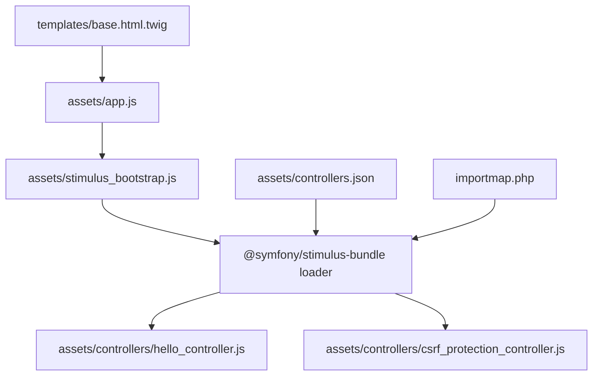
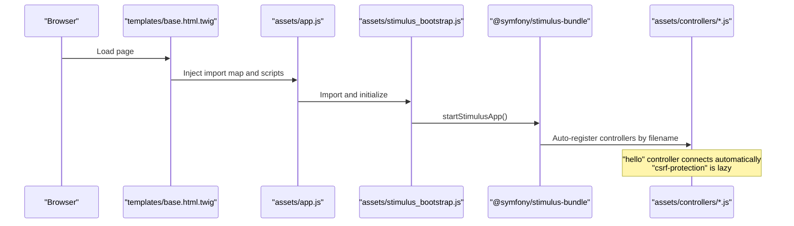
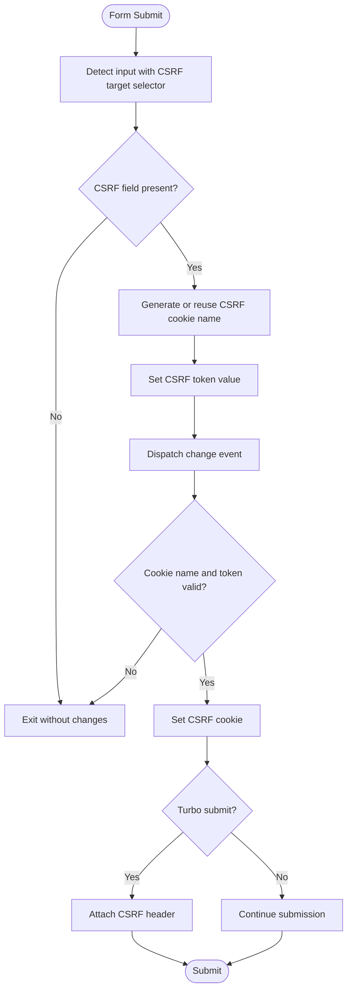
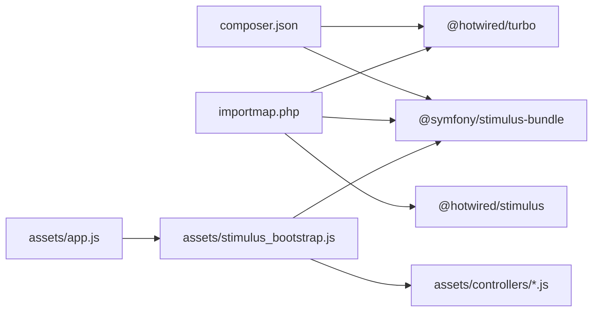

# Stimulus.js Controllers

<cite>
**Referenced Files in This Document**
- [hello_controller.js](file://assets/controllers/hello_controller.js)
- [csrf_protection_controller.js](file://assets/controllers/csrf_protection_controller.js)
- [controllers.json](file://assets/controllers.json)
- [app.js](file://assets/app.js)
- [stimulus_bootstrap.js](file://assets/stimulus_bootstrap.js)
- [importmap.php](file://importmap.php)
- [framework.yaml](file://config/packages/framework.yaml)
- [asset_mapper.yaml](file://config/packages/asset_mapper.yaml)
- [composer.json](file://composer.json)
- [_form.html.twig](file://templates/client/_form.html.twig)
- [register.html.twig](file://templates/registration/register.html.twig)
- [base.html.twig](file://templates/base.html.twig)
</cite>

## Table of Contents
1. [Introduction](#introduction)
2. [Project Structure](#project-structure)
3. [Core Components](#core-components)
4. [Architecture Overview](#architecture-overview)
5. [Detailed Component Analysis](#detailed-component-analysis)
6. [Dependency Analysis](#dependency-analysis)
7. [Performance Considerations](#performance-considerations)
8. [Troubleshooting Guide](#troubleshooting-guide)
9. [Conclusion](#conclusion)
10. [Appendices](#appendices)

## Introduction
This document explains the Stimulus.js controller implementation and JavaScript interactivity in this Symfony project. It covers controller architecture, DOM binding patterns, event handling, lifecycle methods, element targeting, and data attribute usage. It documents the hello_controller.js example and csrf_protection_controller.js functionality, along with controllers.json configuration, automatic loading, and controller naming conventions. It also addresses best practices, error handling, progressive enhancement, and integration with Bootstrap components and form handling workflows.

## Project Structure
The JavaScript stack centers on Asset Mapper and Stimulus integration:
- Entry point: assets/app.js imports the Stimulus bootstrap module.
- Stimulus bootstrap: assets/stimulus_bootstrap.js initializes the Stimulus application.
- Controllers: assets/controllers/*.js define Stimulus controllers.
- Controllers configuration: assets/controllers.json controls Turbo and other UX integrations.
- Frontend integration: templates/base.html.twig loads Bootstrap and injects the import map for JavaScript entrypoints.

**Diagram sources**
- [app.js:1-11](file://assets/app.js#L1-L11)
- [stimulus_bootstrap.js:1-6](file://assets/stimulus_bootstrap.js#L1-L6)
- [hello_controller.js:1-17](file://assets/controllers/hello_controller.js#L1-L17)
- [csrf_protection_controller.js:1-82](file://assets/controllers/csrf_protection_controller.js#L1-L82)
- [controllers.json:1-16](file://assets/controllers.json#L1-L16)
- [importmap.php:14-28](file://importmap.php#L14-L28)
- [base.html.twig:87-90](file://templates/base.html.twig#L87-L90)

**Section sources**
- [app.js:1-11](file://assets/app.js#L1-L11)
- [stimulus_bootstrap.js:1-6](file://assets/stimulus_bootstrap.js#L1-L6)
- [controllers.json:1-16](file://assets/controllers.json#L1-L16)
- [importmap.php:14-28](file://importmap.php#L14-L28)
- [base.html.twig:87-90](file://templates/base.html.twig#L87-L90)

## Core Components
- Hello controller: Demonstrates a minimal Stimulus controller with a connect lifecycle method that updates the element’s text content.
- CSRF protection controller: Implements CSRF token generation, cookie setting, and header injection for Turbo-enabled forms, plus cleanup after submission.
- Stimulus bootstrap: Initializes the Stimulus application and exposes a registry hook for custom controllers.
- Controllers configuration: Declares UX Turbo settings and fetch strategies.
- Import map: Declares the JavaScript entrypoint and required libraries.

Key behaviors:
- Automatic loading: Controllers are auto-registered by name derived from filenames under assets/controllers.
- Lazy loading: The CSRF protection controller is marked lazy to defer initialization until needed.
- Turbo integration: Listens to Turbo events to attach CSRF tokens to requests and clean up cookies afterward.

**Section sources**
- [hello_controller.js:12-16](file://assets/controllers/hello_controller.js#L12-L16)
- [csrf_protection_controller.js:7-23](file://assets/controllers/csrf_protection_controller.js#L7-L23)
- [csrf_protection_controller.js:80-81](file://assets/controllers/csrf_protection_controller.js#L80-L81)
- [stimulus_bootstrap.js:1-6](file://assets/stimulus_bootstrap.js#L1-L6)
- [controllers.json:1-16](file://assets/controllers.json#L1-L16)
- [importmap.php:14-28](file://importmap.php#L14-L28)

## Architecture Overview
The runtime architecture ties together the frontend entrypoint, Stimulus initialization, controller discovery, and Turbo-aware CSRF handling.

**Diagram sources**
- [base.html.twig:87-90](file://templates/base.html.twig#L87-L90)
- [app.js:1-2](file://assets/app.js#L1-L2)
- [stimulus_bootstrap.js:1-3](file://assets/stimulus_bootstrap.js#L1-L3)
- [hello_controller.js:6-8](file://assets/controllers/hello_controller.js#L6-L8)
- [csrf_protection_controller.js:80-81](file://assets/controllers/csrf_protection_controller.js#L80-L81)

## Detailed Component Analysis

### Hello Controller
Purpose:
- Demonstrates a basic Stimulus controller that runs when an element with a matching data-controller attribute is present.

Lifecycle and DOM binding:
- The controller’s connect method executes when the associated DOM element is connected to the document.
- The controller targets its own element and updates its text content.

DOM binding pattern:
- Elements bind to controllers via a data-controller attribute whose value corresponds to the controller name derived from the filename.

Best practices shown:
- Keep controllers small and focused.
- Use connect for one-time setup and element targeting.

**Section sources**
- [hello_controller.js:3-16](file://assets/controllers/hello_controller.js#L3-L16)

### CSRF Protection Controller
Purpose:
- Ensures CSRF tokens are generated, stored in a cookie, and sent alongside form submissions, including Turbo-driven submissions.

Key functions and flows:
- On native form submit, generate and set CSRF token and cookie.
- On Turbo submit start, attach CSRF token as a custom header.
- On Turbo submit end, remove the CSRF cookie.

Event handling:
- Listens to the native submit event to capture standard form submissions.
- Listens to Turbo-specific events to support Turbo-driven submissions.

Data attributes and targeting:
- Targets input elements with either a data-controller attribute or a specific name used by Symfony’s CSRF token mechanism.
- Uses a data attribute to persist the CSRF cookie name across sessions.

Validation and safety:
- Validates CSRF token and cookie name formats before applying changes.
- Uses secure cookie attributes when served over HTTPS.

Lazy loading:
- Marked as lazy to avoid initializing until the controller is needed.

**Diagram sources**
- [csrf_protection_controller.js:25-45](file://assets/controllers/csrf_protection_controller.js#L25-L45)
- [csrf_protection_controller.js:47-62](file://assets/controllers/csrf_protection_controller.js#L47-L62)
- [csrf_protection_controller.js:64-78](file://assets/controllers/csrf_protection_controller.js#L64-L78)

**Section sources**
- [csrf_protection_controller.js:1-82](file://assets/controllers/csrf_protection_controller.js#L1-L82)

### Stimulus Bootstrap and Controller Discovery
Initialization:
- The bootstrap module starts the Stimulus application and exposes a registry hook for registering additional controllers.

Automatic loading:
- Controllers are auto-registered based on filenames under assets/controllers. The controller name is derived from the filename suffix.

Lazy loading:
- The CSRF protection controller is exported as a string with a special comment indicating lazy loading, deferring instantiation until needed.

**Section sources**
- [stimulus_bootstrap.js:1-6](file://assets/stimulus_bootstrap.js#L1-L6)
- [csrf_protection_controller.js:80-81](file://assets/controllers/csrf_protection_controller.js#L80-L81)
- [hello_controller.js:6-8](file://assets/controllers/hello_controller.js#L6-L8)

### Controllers Configuration (controllers.json)
Purpose:
- Controls UX integrations, specifically Turbo settings and fetch strategies for Turbo core.

Behavior:
- Enables Turbo core and sets fetch strategy.
- Disables Mercure Turbo Stream by default.

**Section sources**
- [controllers.json:1-16](file://assets/controllers.json#L1-L16)

### Integration with Bootstrap Components and Forms
Bootstrap integration:
- Bootstrap CSS and JS are loaded in the base template, enabling Bootstrap components and interactions.

Form rendering:
- Twig forms render standard HTML with Bootstrap classes applied to inputs and buttons.

CSRF integration:
- While the project includes server-side CSRF tokens in forms, the client-side CSRF protection controller augments submission handling for Turbo and standard forms.

**Section sources**
- [base.html.twig:87-90](file://templates/base.html.twig#L87-L90)
- [_form.html.twig:1-29](file://templates/client/_form.html.twig#L1-L29)
- [register.html.twig:15-42](file://templates/registration/register.html.twig#L15-L42)

## Dependency Analysis
External dependencies and their roles:
- @hotwired/stimulus: Provides the Stimulus core library for controller lifecycle and DOM binding.
- @symfony/stimulus-bundle: Supplies the loader and integration with Symfony Asset Mapper and controllers discovery.
- @hotwired/turbo: Enables Turbo-driven navigation and form submissions, integrating with CSRF handling.

Asset Mapper and entrypoints:
- The import map declares the JavaScript entrypoint and required libraries.
- Asset Mapper serves assets from the configured paths and enforces import modes.

Framework configuration:
- Asset Mapper configuration defines the assets path and import mode policies.
- Framework configuration enables sessions and other runtime settings.

**Diagram sources**
- [composer.json:39-43](file://composer.json#L39-L43)
- [importmap.php:14-28](file://importmap.php#L14-L28)
- [app.js:1-2](file://assets/app.js#L1-L2)
- [stimulus_bootstrap.js:1-3](file://assets/stimulus_bootstrap.js#L1-L3)

**Section sources**
- [composer.json:39-43](file://composer.json#L39-L43)
- [importmap.php:14-28](file://importmap.php#L14-L28)
- [asset_mapper.yaml:1-12](file://config/packages/asset_mapper.yaml#L1-L12)
- [framework.yaml:1-16](file://config/packages/framework.yaml#L1-L16)

## Performance Considerations
- Lazy loading: The CSRF protection controller is lazy-loaded to reduce initial bundle size and startup cost.
- Minimal work in connect: Keep controller connect methods lightweight to avoid blocking page rendering.
- Event delegation: Prefer listening to document-level events for broad coverage while minimizing per-element listeners.
- Turbo-aware handling: Use Turbo events to avoid redundant work during Turbo-driven submissions.

## Troubleshooting Guide
Common issues and resolutions:
- Controller not executing:
  - Verify the data-controller attribute matches the controller name derived from the filename.
  - Confirm the controller file is placed under assets/controllers and follows the naming convention.
- CSRF failures:
  - Ensure the CSRF field selector targets the intended input element.
  - Confirm the CSRF cookie name and token formats meet validation criteria.
  - For Turbo submissions, verify the CSRF header is attached and the cookie is removed after submission.
- Asset loading:
  - Confirm the import map includes the entrypoint and required libraries.
  - Ensure Asset Mapper paths are configured correctly and missing imports are handled per policy.

**Section sources**
- [hello_controller.js:6-8](file://assets/controllers/hello_controller.js#L6-L8)
- [csrf_protection_controller.js:25-45](file://assets/controllers/csrf_protection_controller.js#L25-L45)
- [csrf_protection_controller.js:47-62](file://assets/controllers/csrf_protection_controller.js#L47-L62)
- [csrf_protection_controller.js:64-78](file://assets/controllers/csrf_protection_controller.js#L64-L78)
- [importmap.php:14-28](file://importmap.php#L14-L28)
- [asset_mapper.yaml:1-12](file://config/packages/asset_mapper.yaml#L1-L12)

## Conclusion
This project integrates Stimulus.js with Symfony using Asset Mapper and the Stimulus bundle. Controllers are auto-discovered by filename-derived names, with a practical example controller and a robust CSRF protection controller supporting both standard and Turbo-driven form submissions. The configuration supports lazy loading and Turbo core features, while Bootstrap integration provides responsive UI components. Following the documented patterns ensures maintainable, progressive enhancements and secure form handling.

## Appendices

### Controller Naming Conventions
- Filename: kebab-case_controller.js
- Controller name: derived from the filename (e.g., hello_controller.js -> "hello")

**Section sources**
- [hello_controller.js:6-8](file://assets/controllers/hello_controller.js#L6-L8)

### Example Usage Patterns
- Dynamic content updates: Use the connect lifecycle to update element content or bind event listeners.
- Form validation feedback: Attach input listeners to provide immediate feedback and integrate with server-side validation.
- User interaction patterns: Bind click handlers to toggle visibility, open modals, or manage UI state.

[No sources needed since this section provides general guidance]