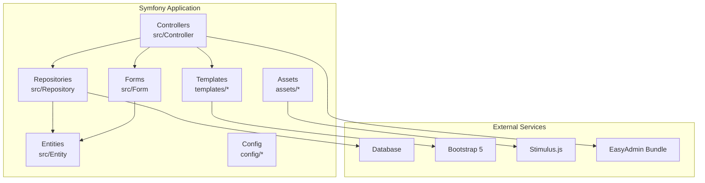
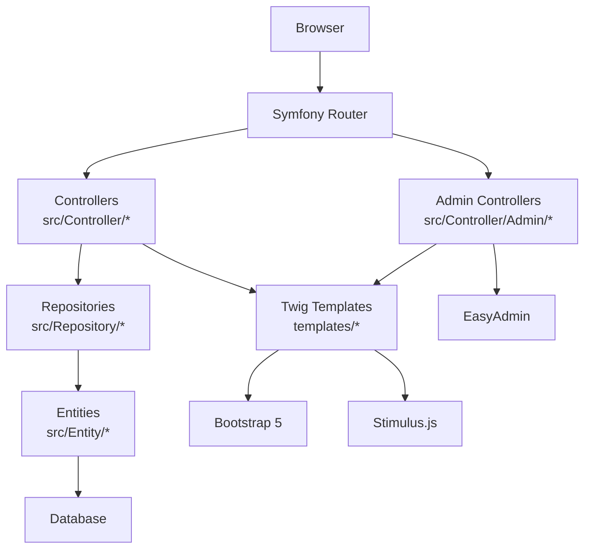
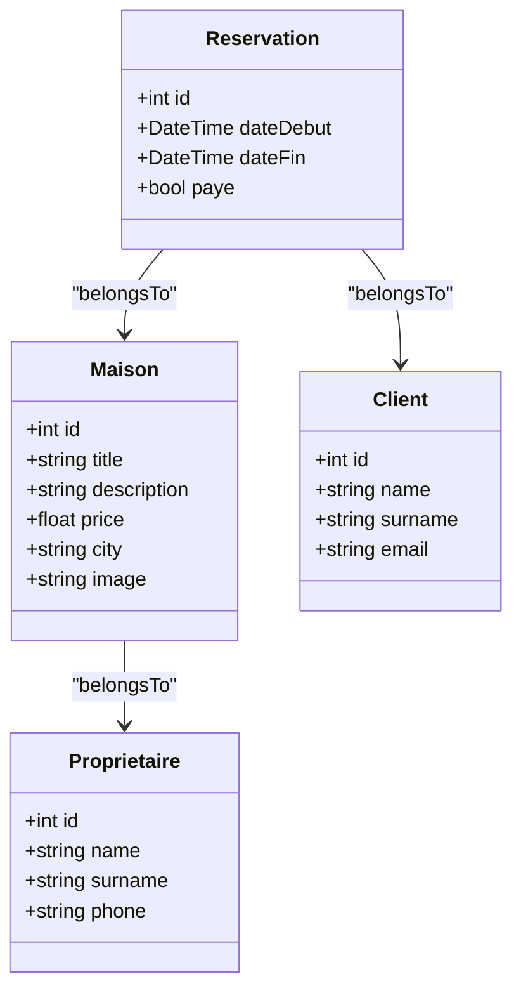
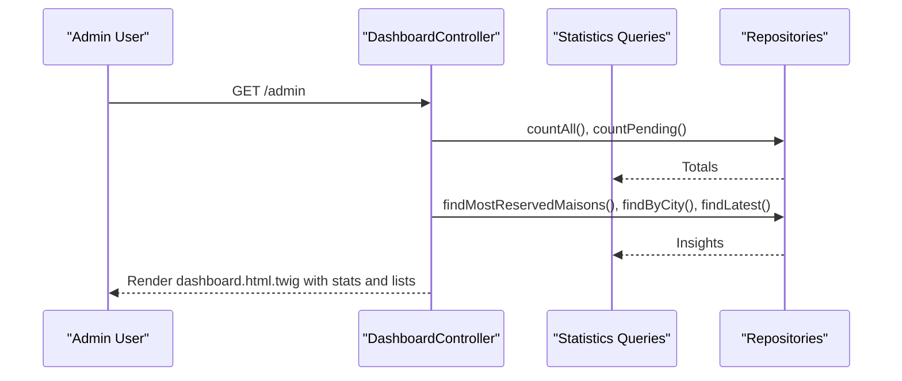
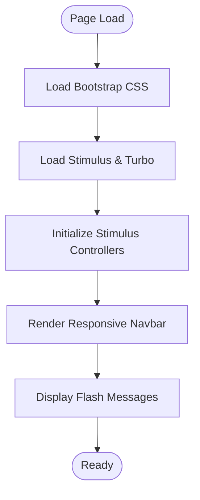
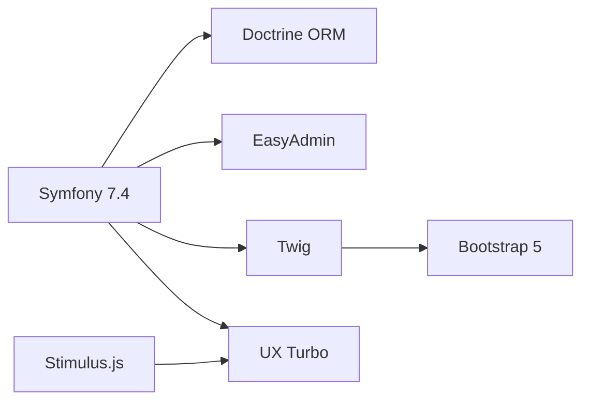

# Project Overview

<cite>
**Referenced Files in This Document**
- [composer.json](file://composer.json)
- [Kernel.php](file://src/Kernel.php)
- [doctrine.yaml](file://config/packages/doctrine.yaml)
- [framework.yaml](file://config/packages/framework.yaml)
- [security.yaml](file://config/packages/security.yaml)
- [twig.yaml](file://config/packages/twig.yaml)
- [easyadmin.yaml](file://config/routes/easyadmin.yaml)
- [Maison.php](file://src/Entity/Maison.php)
- [Client.php](file://src/Entity/Client.php)
- [Proprietaire.php](file://src/Entity/Proprietaire.php)
- [Reservation.php](file://src/Entity/Reservation.php)
- [DashboardController.php](file://src/Controller/Admin/DashboardController.php)
- [app.js](file://assets/app.js)
- [controllers.json](file://assets/controllers.json)
- [base.html.twig](file://templates/base.html.twig)
</cite>

## Table of Contents
1. [Introduction](#introduction)
2. [Project Structure](#project-structure)
3. [Core Components](#core-components)
4. [Architecture Overview](#architecture-overview)
5. [Detailed Component Analysis](#detailed-component-analysis)
6. [Dependency Analysis](#dependency-analysis)
7. [Performance Considerations](#performance-considerations)
8. [Troubleshooting Guide](#troubleshooting-guide)
9. [Conclusion](#conclusion)

## Introduction
Maisons d'Hôtes is a vacation rental management system designed to streamline the process of listing, discovering, and booking holiday homes. The platform serves three primary audiences:
- Property owners who want to list and manage their rental properties
- Clients who search and reserve accommodations
- Administrators who oversee the platform via an integrated administrative dashboard

Key capabilities include property management (listing, editing, and organizing properties by location), client management (registration and profile handling), a reservation system (booking dates and payment tracking), and an EasyAdmin-powered backend for efficient administration.

## Project Structure
The project follows a conventional Symfony 7.4 application layout with feature-based organization:
- src/Entity: Domain models for properties, clients, owners, reservations, and users
- src/Controller: Application controllers including EasyAdmin-backed admin controllers
- src/Form: Form types for creating/editing domain entities
- src/Repository: Doctrine repositories for data access
- config/: Symfony configuration for routing, security, database, and templating
- templates/: Twig templates for rendering pages and admin dashboards
- assets/: Frontend assets with Stimulus controllers and Bootstrap 5 styling
- public/uploads/images: Media storage for property images

**Diagram sources**
- [Kernel.php:1-12](file://src/Kernel.php#L1-L12)
- [doctrine.yaml:1-55](file://config/packages/doctrine.yaml#L1-L55)
- [security.yaml:1-55](file://config/packages/security.yaml#L1-L55)
- [easyadmin.yaml:1-4](file://config/routes/easyadmin.yaml#L1-L4)
- [base.html.twig:1-184](file://templates/base.html.twig#L1-L184)
- [app.js:1-11](file://assets/app.js#L1-L11)

**Section sources**
- [composer.json:1-111](file://composer.json#L1-L111)
- [Kernel.php:1-12](file://src/Kernel.php#L1-L12)
- [doctrine.yaml:1-55](file://config/packages/doctrine.yaml#L1-L55)
- [security.yaml:1-55](file://config/packages/security.yaml#L1-L55)
- [easyadmin.yaml:1-4](file://config/routes/easyadmin.yaml#L1-L4)
- [base.html.twig:1-184](file://templates/base.html.twig#L1-L184)
- [app.js:1-11](file://assets/app.js#L1-L11)

## Core Components
- Technology Stack
  - Backend: Symfony 7.4 (Framework Bundle), Doctrine ORM, Security, Validator, Twig
  - Administration: EasyAdmin Bundle
  - Frontend: Bootstrap 5, Stimulus.js, AssetMapper, Turbo (UX)
  - Database: Doctrine DBAL configured via environment variable
  - Templating: Twig with custom base template and responsive navigation

- Domain Model
  - Maison (property): title, description, price, city, image, owner relationship
  - Client (guest): name, surname, email
  - Proprietaire (owner): name, surname, phone
  - Reservation (booking): client, maison, date range, payment status
  - User (authentication): managed by Security component with password hashing

- Administrative Dashboard
  - EasyAdmin-based interface with menu items for properties, clients, reservations, owners, and users
  - Dashboard displays statistics (counts, pending payments), top reserved properties, and recent entries

**Section sources**
- [composer.json:6-48](file://composer.json#L6-L48)
- [Maison.php:1-118](file://src/Entity/Maison.php#L1-L118)
- [Client.php:1-71](file://src/Entity/Client.php#L1-L71)
- [Proprietaire.php:1-70](file://src/Entity/Proprietaire.php#L1-L70)
- [Reservation.php:1-100](file://src/Entity/Reservation.php#L1-L100)
- [DashboardController.php:1-88](file://src/Controller/Admin/DashboardController.php#L1-L88)
- [base.html.twig:1-184](file://templates/base.html.twig#L1-L184)
- [app.js:1-11](file://assets/app.js#L1-L11)

## Architecture Overview
The system uses a layered architecture:
- Presentation Layer: Controllers handle requests, render Twig templates, and orchestrate forms
- Business Logic: Entities encapsulate domain data; repositories provide data access
- Persistence Layer: Doctrine ORM maps entities to the database
- Administration Layer: EasyAdmin generates CRUD interfaces from controllers
- Frontend Layer: Bootstrap 5 provides responsive UI; Stimulus enhances interactivity

**Diagram sources**
- [DashboardController.php:1-88](file://src/Controller/Admin/DashboardController.php#L1-L88)
- [doctrine.yaml:1-55](file://config/packages/doctrine.yaml#L1-L55)
- [security.yaml:1-55](file://config/packages/security.yaml#L1-L55)
- [base.html.twig:1-184](file://templates/base.html.twig#L1-L184)
- [app.js:1-11](file://assets/app.js#L1-L11)

## Detailed Component Analysis

### Domain Entities and Relationships
The core domain revolves around four entities with clear associations:
- Proprietaire owns multiple Maisons
- Client can have multiple Reservations
- Reservation links a Client to a Maison for a date range and tracks payment

**Diagram sources**
- [Maison.php:1-118](file://src/Entity/Maison.php#L1-L118)
- [Client.php:1-71](file://src/Entity/Client.php#L1-L71)
- [Proprietaire.php:1-70](file://src/Entity/Proprietaire.php#L1-L70)
- [Reservation.php:1-100](file://src/Entity/Reservation.php#L1-L100)

**Section sources**
- [Maison.php:1-118](file://src/Entity/Maison.php#L1-L118)
- [Client.php:1-71](file://src/Entity/Client.php#L1-L71)
- [Proprietaire.php:1-70](file://src/Entity/Proprietaire.php#L1-L70)
- [Reservation.php:1-100](file://src/Entity/Reservation.php#L1-L100)

### Administrative Dashboard Workflow
The admin dashboard aggregates key metrics and navigation:
- Statistics: total properties, clients, reservations, and pending payments
- Insights: most reserved properties, properties grouped by city, latest reservations and properties
- Navigation: links to property, client, reservation, owner, and user management screens

**Diagram sources**
- [DashboardController.php:32-61](file://src/Controller/Admin/DashboardController.php#L32-L61)

**Section sources**
- [DashboardController.php:1-88](file://src/Controller/Admin/DashboardController.php#L1-L88)

### Frontend Integration and UX
- Bootstrap 5 provides responsive navigation, cards, buttons, and alerts
- Stimulus controllers enhance interactivity (e.g., CSRF protection)
- Turbo integration via UX packages supports optimistic updates
- AssetMapper loads application scripts and styles

**Diagram sources**
- [base.html.twig:8-90](file://templates/base.html.twig#L8-L90)
- [app.js:1-11](file://assets/app.js#L1-L11)
- [controllers.json:1-16](file://assets/controllers.json#L1-L16)

**Section sources**
- [base.html.twig:1-184](file://templates/base.html.twig#L1-L184)
- [app.js:1-11](file://assets/app.js#L1-L11)
- [controllers.json:1-16](file://assets/controllers.json#L1-L16)

## Dependency Analysis
- Framework and Bundles
  - Symfony 7.4 components provide routing, security, validation, templating, and HTTP client
  - Doctrine ORM and migrations power persistence
  - EasyAdmin Bundle enables rapid CRUD generation
  - Twig renders templates; AssetMapper manages frontend assets
  - UX Turbo integrates optimistic UI updates

- Runtime Behavior
  - Session enabled for user state
  - Security firewall handles login/logout and access control
  - Database connection configured via environment variable

**Diagram sources**
- [composer.json:6-48](file://composer.json#L6-L48)
- [framework.yaml:1-16](file://config/packages/framework.yaml#L1-L16)
- [security.yaml:1-55](file://config/packages/security.yaml#L1-L55)
- [twig.yaml:1-7](file://config/packages/twig.yaml#L1-L7)

**Section sources**
- [composer.json:1-111](file://composer.json#L1-L111)
- [framework.yaml:1-16](file://config/packages/framework.yaml#L1-L16)
- [security.yaml:1-55](file://config/packages/security.yaml#L1-L55)
- [twig.yaml:1-7](file://config/packages/twig.yaml#L1-L7)

## Performance Considerations
- Database tuning: Configure server version and connection pooling in production
- Caching: Enable result/system cache pools for Doctrine in production
- Lazy loading: Leverage Doctrine lazy ghost objects to minimize object graph loading
- Asset optimization: Use AssetMapper and CDN-hosted libraries for Bootstrap and icons
- Pagination: Implement pagination for long lists in admin and public views
- Indexes: Ensure database indexes on frequently queried columns (e.g., city, dates)

## Troubleshooting Guide
- Authentication and Authorization
  - Verify login route and access control rules for admin and user areas
  - Confirm password hashers and user provider configuration

- Database Connectivity
  - Check DATABASE_URL environment variable and server version settings
  - Validate auto-mapping and naming strategy configurations

- Template Rendering
  - Ensure base template includes Bootstrap and Stimulus assets
  - Confirm flash messages and navigation are rendered correctly

- Admin Routes
  - Confirm EasyAdmin routes are loaded and accessible under /admin

**Section sources**
- [security.yaml:1-55](file://config/packages/security.yaml#L1-L55)
- [doctrine.yaml:1-55](file://config/packages/doctrine.yaml#L1-L55)
- [easyadmin.yaml:1-4](file://config/routes/easyadmin.yaml#L1-L4)
- [base.html.twig:1-184](file://templates/base.html.twig#L1-L184)

## Conclusion
Maisons d'Hôtes delivers a practical, scalable solution for managing vacation rentals. Its Symfony 7.4 foundation, combined with Doctrine ORM, EasyAdmin, Bootstrap 5, and Stimulus.js, provides a robust architecture supporting property owners, guests, and administrators. The clear separation of concerns, strong domain modeling, and admin-driven workflows position the system for growth and maintenance.