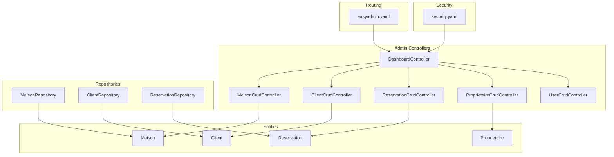
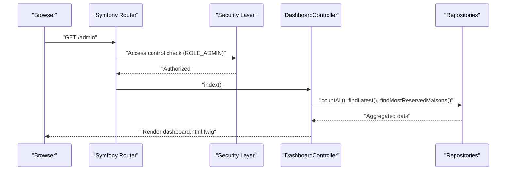
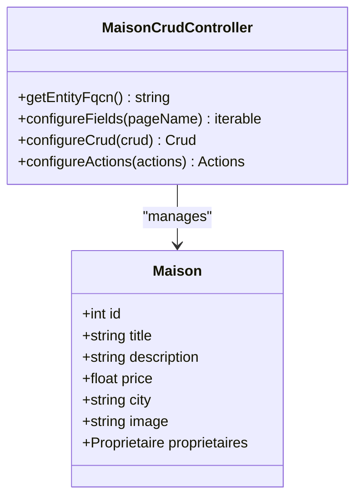
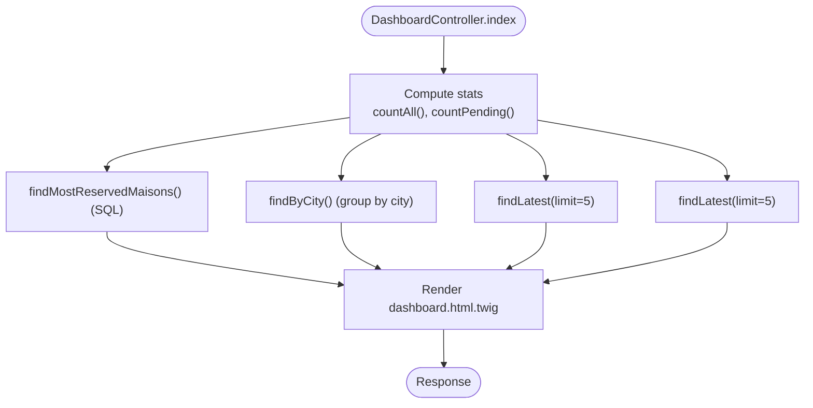
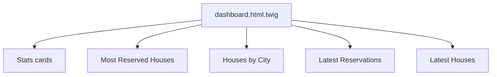
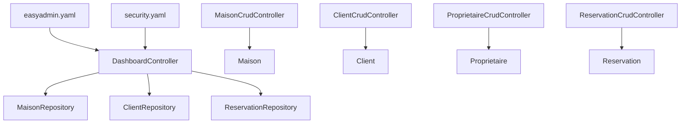

# Administrative Property Interface

<cite>
**Referenced Files in This Document**
- [MaisonCrudController.php](file://src/Controller/Admin/MaisonCrudController.php)
- [Maison.php](file://src/Entity/Maison.php)
- [easyadmin.yaml](file://config/routes/easyadmin.yaml)
- [DashboardController.php](file://src/Controller/Admin/DashboardController.php)
- [dashboard.html.twig](file://templates/admin/dashboard.html.twig)
- [security.yaml](file://config/packages/security.yaml)
- [MaisonRepository.php](file://src/Repository/MaisonRepository.php)
- [ClientRepository.php](file://src/Repository/ClientRepository.php)
- [ReservationRepository.php](file://src/Repository/ReservationRepository.php)
- [ClientCrudController.php](file://src/Controller/Admin/ClientCrudController.php)
- [ProprietaireCrudController.php](file://src/Controller/Admin/ProprietaireCrudController.php)
- [ReservationCrudController.php](file://src/Controller/Admin/ReservationCrudController.php)
- [UserCrudController.php](file://src/Controller/Admin/UserCrudController.php)
- [Client.php](file://src/Entity/Client.php)
- [Proprietaire.php](file://src/Entity/Proprietaire.php)
</cite>

## Table of Contents
1. [Introduction](#introduction)
2. [Project Structure](#project-structure)
3. [Core Components](#core-components)
4. [Architecture Overview](#architecture-overview)
5. [Detailed Component Analysis](#detailed-component-analysis)
6. [Dependency Analysis](#dependency-analysis)
7. [Performance Considerations](#performance-considerations)
8. [Troubleshooting Guide](#troubleshooting-guide)
9. [Conclusion](#conclusion)
10. [Appendices](#appendices)

## Introduction
This document describes the administrative property management interface built with EasyAdmin in the guest house management application. It covers CRUD configuration for the Maison entity, administrative permissions and access control, dashboard integration with property statistics and shortcuts, and the navigation structure linking to related entities. It also outlines available customization points for forms, validation, and audit logging, and explains current administrative workflows for property listing and management.

## Project Structure
The administrative interface is organized around EasyAdmin controllers grouped under the Admin namespace, with dedicated controllers per entity and a central Dashboard controller. EasyAdmin routes are configured via a dedicated route resource.

**Diagram sources**
- [DashboardController.php:21-86](file://src/Controller/Admin/DashboardController.php#L21-L86)
- [MaisonCrudController.php:16-50](file://src/Controller/Admin/MaisonCrudController.php#L16-L50)
- [ClientCrudController.php:13-42](file://src/Controller/Admin/ClientCrudController.php#L13-L42)
- [ReservationCrudController.php:15-46](file://src/Controller/Admin/ReservationCrudController.php#L15-L46)
- [ProprietaireCrudController.php:12-40](file://src/Controller/Admin/ProprietaireCrudController.php#L12-L40)
- [UserCrudController.php:15-44](file://src/Controller/Admin/UserCrudController.php#L15-L44)
- [Maison.php:10-117](file://src/Entity/Maison.php#L10-L117)
- [Client.php:9-70](file://src/Entity/Client.php#L9-L70)
- [Proprietaire.php:9-69](file://src/Entity/Proprietaire.php#L9-L69)
- [MaisonRepository.php:12-46](file://src/Repository/MaisonRepository.php#L12-L46)
- [ClientRepository.php:12-35](file://src/Repository/ClientRepository.php#L12-L35)
- [ReservationRepository.php:13-92](file://src/Repository/ReservationRepository.php#L13-L92)
- [easyadmin.yaml:1-4](file://config/routes/easyadmin.yaml#L1-L4)
- [security.yaml:40-45](file://config/packages/security.yaml#L40-L45)

**Section sources**
- [easyadmin.yaml:1-4](file://config/routes/easyadmin.yaml#L1-L4)
- [DashboardController.php:21-86](file://src/Controller/Admin/DashboardController.php#L21-L86)

## Core Components
- EasyAdmin Maison CRUD controller defines the field layout for listing and forms, pagination sizing, and action additions.
- The Maison entity defines persistent attributes and associations used by the controller and repositories.
- The Dashboard controller aggregates statistics and renders a custom dashboard template with charts and tables.
- Security configuration enforces ROLE_ADMIN for the /admin area.

Key responsibilities:
- MaisonCrudController: field definitions, list/form layout, pagination, and action configuration.
- DashboardController: dashboard rendering, menu items, and repository-driven analytics.
- security.yaml: access control enforcing ROLE_ADMIN for administrative routes.

**Section sources**
- [MaisonCrudController.php:16-50](file://src/Controller/Admin/MaisonCrudController.php#L16-L50)
- [Maison.php:10-117](file://src/Entity/Maison.php#L10-L117)
- [DashboardController.php:32-61](file://src/Controller/Admin/DashboardController.php#L32-L61)
- [security.yaml:40-45](file://config/packages/security.yaml#L40-L45)

## Architecture Overview
The administrative interface follows EasyAdmin conventions:
- Controllers extend EasyAdmin’s AbstractCrudController or AbstractDashboardController.
- Entities are mapped via Doctrine ORM annotations.
- Repositories encapsulate queries for analytics and listings.
- The dashboard aggregates data from repositories and renders a Twig template.

**Diagram sources**
- [DashboardController.php:32-61](file://src/Controller/Admin/DashboardController.php#L32-L61)
- [MaisonRepository.php:19-45](file://src/Repository/MaisonRepository.php#L19-L45)
- [ClientRepository.php:19-34](file://src/Repository/ClientRepository.php#L19-L34)
- [ReservationRepository.php:20-68](file://src/Repository/ReservationRepository.php#L20-L68)
- [security.yaml:40-45](file://config/packages/security.yaml#L40-L45)

## Detailed Component Analysis

### EasyAdmin Maison CRUD Controller
- Entity binding: statically returns the Maison entity fully qualified class name.
- Field configuration:
  - Hidden ID on forms.
  - Title, description, price, city, and image fields.
  - Image field configured with base path, upload directory, and random filename pattern; optional upload.
- Pagination: page size and range size configured.
- Actions: adds a detail action to the index view.

**Diagram sources**
- [MaisonCrudController.php:16-50](file://src/Controller/Admin/MaisonCrudController.php#L16-L50)
- [Maison.php:10-117](file://src/Entity/Maison.php#L10-L117)

**Section sources**
- [MaisonCrudController.php:18-50](file://src/Controller/Admin/MaisonCrudController.php#L18-L50)
- [Maison.php:14-34](file://src/Entity/Maison.php#L14-L34)

### EasyAdmin Dashboard Controller
- Index action computes:
  - Counts for Maisons, Clients, Reservations, and pending payments.
  - Most reserved houses via a raw SQL query.
  - Houses by city aggregation.
  - Latest reservations and latest houses.
- Dashboard configuration sets title, maximized content, and favicon.
- Menu items include links to all administrative sections and a shortcut back to the site.

**Diagram sources**
- [DashboardController.php:32-61](file://src/Controller/Admin/DashboardController.php#L32-L61)
- [ReservationRepository.php:57-68](file://src/Repository/ReservationRepository.php#L57-L68)
- [MaisonRepository.php:27-45](file://src/Repository/MaisonRepository.php#L27-L45)
- [ReservationRepository.php:38-55](file://src/Repository/ReservationRepository.php#L38-L55)

**Section sources**
- [DashboardController.php:32-86](file://src/Controller/Admin/DashboardController.php#L32-L86)

### Dashboard Template
The dashboard template organizes statistics cards, “Most Reserved Houses,” “Houses by City,” “Latest Reservations,” and “Latest Houses Added.” It uses Bootstrap and Font Awesome for presentation and iterates over repository-provided data.

**Diagram sources**
- [dashboard.html.twig:1-263](file://templates/admin/dashboard.html.twig#L1-L263)

**Section sources**
- [dashboard.html.twig:15-260](file://templates/admin/dashboard.html.twig#L15-L260)

### Related Admin Controllers
- Client, Proprietaire, Reservation, and User controllers follow similar EasyAdmin patterns: entity binding, field definitions, pagination, and action additions.
- These controllers integrate into the dashboard menu via the Dashboard controller.

**Section sources**
- [ClientCrudController.php:13-42](file://src/Controller/Admin/ClientCrudController.php#L13-L42)
- [ProprietaireCrudController.php:12-40](file://src/Controller/Admin/ProprietaireCrudController.php#L12-L40)
- [ReservationCrudController.php:15-46](file://src/Controller/Admin/ReservationCrudController.php#L15-L46)
- [UserCrudController.php:15-44](file://src/Controller/Admin/UserCrudController.php#L15-L44)
- [DashboardController.php:71-86](file://src/Controller/Admin/DashboardController.php#L71-L86)

### Access Control and Permissions
- Access control enforces ROLE_ADMIN for the /admin path, ensuring only administrators can access the dashboard and CRUD controllers.
- Authentication uses a form login provider backed by the User entity.

**Section sources**
- [security.yaml:40-45](file://config/packages/security.yaml#L40-L45)
- [security.yaml:20-35](file://config/packages/security.yaml#L20-L35)

## Dependency Analysis
The following diagram shows how the dashboard depends on repositories and how controllers relate to entities.

**Diagram sources**
- [DashboardController.php:24-30](file://src/Controller/Admin/DashboardController.php#L24-L30)
- [MaisonRepository.php:12-46](file://src/Repository/MaisonRepository.php#L12-L46)
- [ClientRepository.php:12-35](file://src/Repository/ClientRepository.php#L12-L35)
- [ReservationRepository.php:13-92](file://src/Repository/ReservationRepository.php#L13-L92)
- [MaisonCrudController.php:16-21](file://src/Controller/Admin/MaisonCrudController.php#L16-L21)
- [ClientCrudController.php:13-18](file://src/Controller/Admin/ClientCrudController.php#L13-L18)
- [ProprietaireCrudController.php:12-17](file://src/Controller/Admin/ProprietaireCrudController.php#L12-L17)
- [ReservationCrudController.php:15-20](file://src/Controller/Admin/ReservationCrudController.php#L15-L20)
- [easyadmin.yaml:1-4](file://config/routes/easyadmin.yaml#L1-L4)
- [security.yaml:40-45](file://config/packages/security.yaml#L40-L45)

**Section sources**
- [DashboardController.php:24-30](file://src/Controller/Admin/DashboardController.php#L24-L30)
- [MaisonRepository.php:12-46](file://src/Repository/MaisonRepository.php#L12-L46)
- [ClientRepository.php:12-35](file://src/Repository/ClientRepository.php#L12-L35)
- [ReservationRepository.php:13-92](file://src/Repository/ReservationRepository.php#L13-L92)

## Performance Considerations
- Pagination: EasyAdmin pagination is configured with a fixed page size and range size in controllers, limiting result set sizes per page.
- Aggregation queries: The dashboard uses repository methods for counts and grouped aggregations; ensure database indexes exist on frequently filtered/sorted columns (e.g., city, date fields).
- Image uploads: The image field is optional and uses a random filename pattern; consider adding server-side validation and sanitization for uploaded files.

[No sources needed since this section provides general guidance]

## Troubleshooting Guide
- Access denied: Verify ROLE_ADMIN is assigned to the authenticated user and that the /admin path matches the configured access control.
- Empty dashboard data: Confirm repositories return data for the expected entities and that database records exist for Maisons, Clients, and Reservations.
- Upload issues: Ensure the upload directory exists and is writable; confirm the image field configuration matches the expected base path and upload directory.

**Section sources**
- [security.yaml:40-45](file://config/packages/security.yaml#L40-L45)
- [MaisonRepository.php:19-45](file://src/Repository/MaisonRepository.php#L19-L45)
- [ClientRepository.php:19-34](file://src/Repository/ClientRepository.php#L19-L34)
- [ReservationRepository.php:20-68](file://src/Repository/ReservationRepository.php#L20-L68)
- [MaisonCrudController.php:32-35](file://src/Controller/Admin/MaisonCrudController.php#L32-L35)

## Conclusion
The administrative property interface leverages EasyAdmin to provide a streamlined management experience for Maisons and related entities. The Maison controller defines essential fields and actions, while the Dashboard aggregates meaningful statistics and integrates navigation to related sections. Access control is enforced via ROLE_ADMIN, and the dashboard template presents actionable insights. Current workflows focus on listing, viewing, and basic property management; further enhancements can include bulk operations, status transitions, and audit logging.

[No sources needed since this section summarizes without analyzing specific files]

## Appendices

### Administrative Workflows Overview
- Property listing and viewing: Managed by the Maison controller with configured fields and actions.
- Navigation: The dashboard provides quick links to all administrative sections.
- Approval/status changes: Not implemented in the current codebase; can be introduced via custom actions and form widgets in the Maison controller.
- Bulk operations: Not implemented; can be added by extending the Maison controller actions and integrating batch update handlers.

[No sources needed since this section provides general guidance]