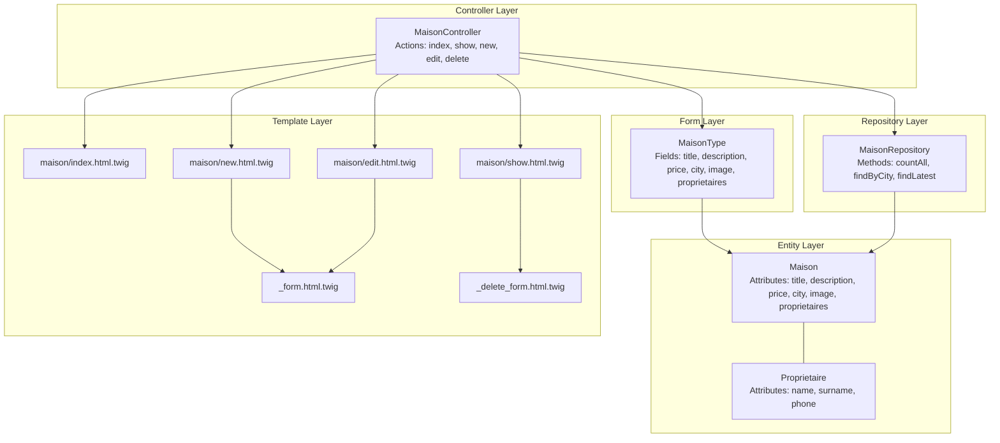
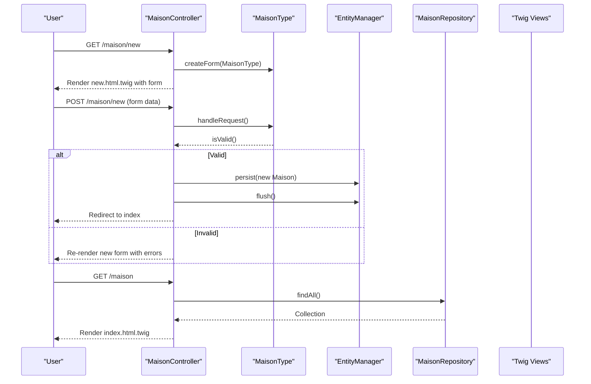
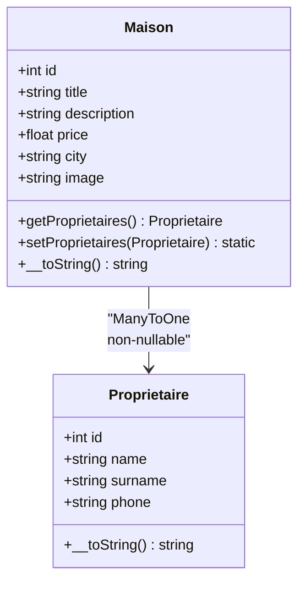
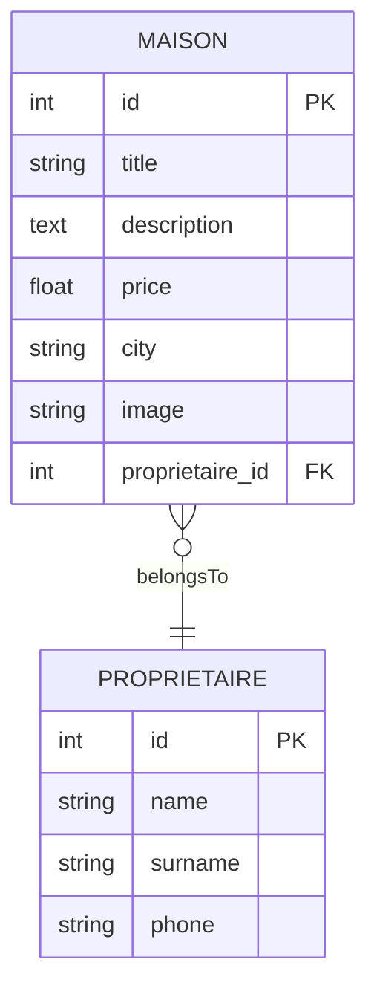
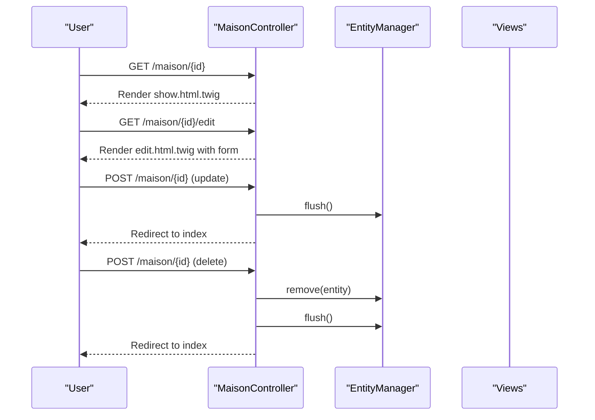
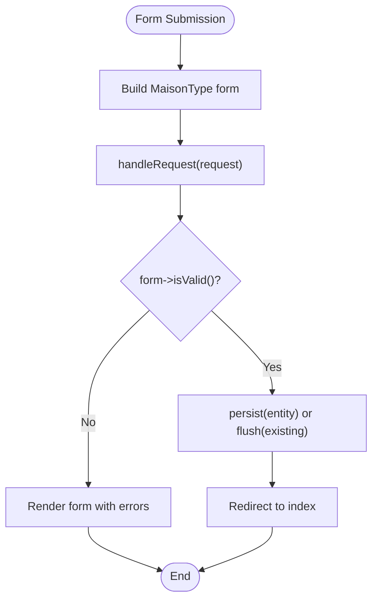
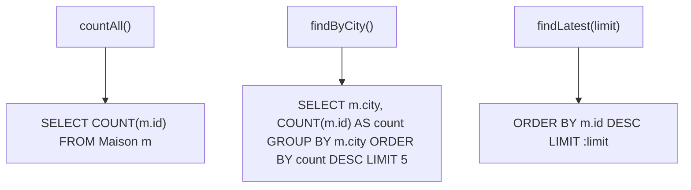
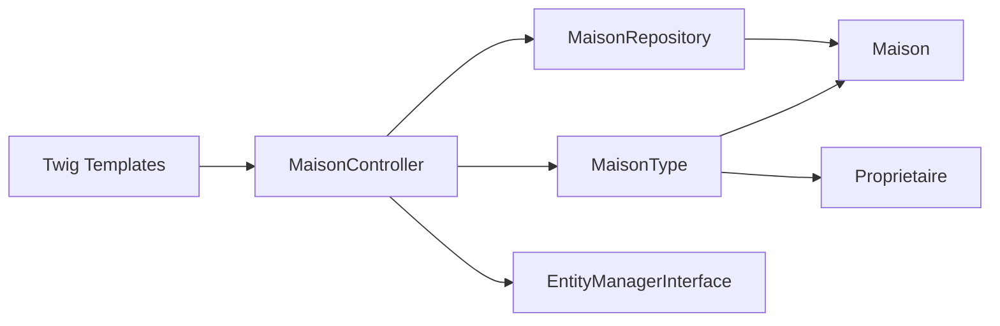

# Property Entity and CRUD Operations

<cite>
**Referenced Files in This Document**
- [Maison.php](file://src/Entity/Maison.php)
- [MaisonController.php](file://src/Controller/MaisonController.php)
- [MaisonType.php](file://src/Form/MaisonType.php)
- [MaisonRepository.php](file://src/Repository/MaisonRepository.php)
- [Proprietaire.php](file://src/Entity/Proprietaire.php)
- [index.html.twig](file://templates/maison/index.html.twig)
- [new.html.twig](file://templates/maison/new.html.twig)
- [edit.html.twig](file://templates/maison/edit.html.twig)
- [show.html.twig](file://templates/maison/show.html.twig)
- [_form.html.twig](file://templates/maison/_form.html.twig)
- [_delete_form.html.twig](file://templates/maison/_delete_form.html.twig)
- [validator.yaml](file://config/packages/validator.yaml)
- [doctrine.yaml](file://config/packages/doctrine.yaml)
</cite>

## Table of Contents
1. [Introduction](#introduction)
2. [Project Structure](#project-structure)
3. [Core Components](#core-components)
4. [Architecture Overview](#architecture-overview)
5. [Detailed Component Analysis](#detailed-component-analysis)
6. [Dependency Analysis](#dependency-analysis)
7. [Performance Considerations](#performance-considerations)
8. [Troubleshooting Guide](#troubleshooting-guide)
9. [Conclusion](#conclusion)

## Introduction
This document focuses on the property entity and its CRUD operations within the application. It explains the Maison entity structure, attributes, and constraints, details the One-to-Many relationship with the Proprietaire entity, and documents the implementation of CRUD actions in MaisonController. It also covers form handling via MaisonType, validation constraints, data binding, repository methods, and workflows for creating, modifying, and deleting properties. Finally, it addresses entity lifecycle, cascading operations, and data integrity constraints.

## Project Structure
The Maison feature spans several layers:
- Entity layer: Maison and Proprietaire entities define the domain model.
- Form layer: MaisonType builds the property creation/editing form.
- Controller layer: MaisonController orchestrates requests and responses.
- Repository layer: MaisonRepository encapsulates data access patterns.
- Template layer: Twig templates render views and forms.

**Diagram sources**
- [Maison.php:10-34](file://src/Entity/Maison.php#L10-L34)
- [Proprietaire.php:9-23](file://src/Entity/Proprietaire.php#L9-L23)
- [MaisonType.php:12-26](file://src/Form/MaisonType.php#L12-L26)
- [MaisonController.php:14-81](file://src/Controller/MaisonController.php#L14-L81)
- [MaisonRepository.php:12-46](file://src/Repository/MaisonRepository.php#L12-L46)
- [index.html.twig:1-42](file://templates/maison/index.html.twig#L1-L42)
- [show.html.twig:1-43](file://templates/maison/show.html.twig#L1-L43)
- [new.html.twig:1-14](file://templates/maison/new.html.twig#L1-L14)
- [edit.html.twig:1-14](file://templates/maison/edit.html.twig#L1-L14)
- [_form.html.twig:1-44](file://templates/maison/_form.html.twig#L1-L44)
- [_delete_form.html.twig:1-5](file://templates/maison/_delete_form.html.twig#L1-L5)

**Section sources**
- [Maison.php:10-34](file://src/Entity/Maison.php#L10-L34)
- [MaisonController.php:14-81](file://src/Controller/MaisonController.php#L14-L81)
- [MaisonType.php:12-26](file://src/Form/MaisonType.php#L12-L26)
- [MaisonRepository.php:12-46](file://src/Repository/MaisonRepository.php#L12-L46)
- [index.html.twig:1-42](file://templates/maison/index.html.twig#L1-L42)
- [show.html.twig:1-43](file://templates/maison/show.html.twig#L1-L43)
- [new.html.twig:1-14](file://templates/maison/new.html.twig#L1-L14)
- [edit.html.twig:1-14](file://templates/maison/edit.html.twig#L1-L14)
- [_form.html.twig:1-44](file://templates/maison/_form.html.twig#L1-L44)
- [_delete_form.html.twig:1-5](file://templates/maison/_delete_form.html.twig#L1-L5)

## Core Components
- Maison entity defines the property record with scalar attributes and a ManyToOne association to Proprietaire.
- MaisonType form exposes fields for all property attributes and allows selecting an owner.
- MaisonController implements index, show, new, edit, and delete actions with form handling and persistence.
- MaisonRepository provides convenience methods for counting, grouping by city, and retrieving latest records.
- Templates render lists, details, forms, and delete prompts with CSRF protection.

**Section sources**
- [Maison.php:10-34](file://src/Entity/Maison.php#L10-L34)
- [MaisonType.php:12-26](file://src/Form/MaisonType.php#L12-L26)
- [MaisonController.php:17-80](file://src/Controller/MaisonController.php#L17-L80)
- [MaisonRepository.php:19-45](file://src/Repository/MaisonRepository.php#L19-L45)
- [index.html.twig:8-38](file://templates/maison/index.html.twig#L8-L38)
- [show.html.twig:8-35](file://templates/maison/show.html.twig#L8-L35)
- [new.html.twig:5-12](file://templates/maison/new.html.twig#L5-L12)
- [edit.html.twig:5-13](file://templates/maison/edit.html.twig#L5-L13)
- [_form.html.twig:1-44](file://templates/maison/_form.html.twig#L1-L44)
- [_delete_form.html.twig:1-5](file://templates/maison/_delete_form.html.twig#L1-L5)

## Architecture Overview
The system follows a layered MVC pattern:
- Controllers handle HTTP requests and delegate to repositories and forms.
- Forms bind user input to the entity and trigger validation.
- Repositories encapsulate data access and query building.
- Entities represent domain objects with associations.
- Templates render views and include partials for forms and delete prompts.

**Diagram sources**
- [MaisonController.php:25-43](file://src/Controller/MaisonController.php#L25-L43)
- [MaisonController.php:17-23](file://src/Controller/MaisonController.php#L17-L23)
- [MaisonType.php:14-26](file://src/Form/MaisonType.php#L14-L26)
- [MaisonRepository.php:19-25](file://src/Repository/MaisonRepository.php#L19-L25)
- [new.html.twig:8](file://templates/maison/new.html.twig#L8)
- [index.html.twig:20](file://templates/maison/index.html.twig#L20)

## Detailed Component Analysis

### Maison Entity Structure and Validation Rules
- Attributes and types:
  - title: string, length limit defined by ORM mapping.
  - description: text type for extended content.
  - price: float for numeric pricing.
  - city: string, length-limited.
  - image: string, likely a filename/path.
  - proprietaires: ManyToOne to Proprietaire; join column is non-nullable.
- Validation:
  - Auto-mapping is enabled for validation constraints inferred from Doctrine metadata.
  - No explicit validation annotations are present in the Maison entity; defaults apply from Doctrine mapping (e.g., length constraints).
- String representation:
  - Implements __toString returning the title for use in select widgets.

**Diagram sources**
- [Maison.php:10-34](file://src/Entity/Maison.php#L10-L34)
- [Proprietaire.php:9-23](file://src/Entity/Proprietaire.php#L9-L23)

**Section sources**
- [Maison.php:17-34](file://src/Entity/Maison.php#L17-L34)
- [validator.yaml:1-12](file://config/packages/validator.yaml#L1-L12)
- [doctrine.yaml:20-26](file://config/packages/doctrine.yaml#L20-L26)

### One-to-Many Relationship with Proprietaire
- The Maison entity declares a ManyToOne association to Proprietaire with a non-nullable join column.
- The form uses an EntityType field to select an owner, ensuring referential integrity at the UI level.
- The absence of cascade operations in the association mapping indicates manual lifecycle management.

**Diagram sources**
- [Maison.php:32-34](file://src/Entity/Maison.php#L32-L34)
- [MaisonType.php:22-25](file://src/Form/MaisonType.php#L22-L25)
- [Proprietaire.php:9-23](file://src/Entity/Proprietaire.php#L9-L23)

**Section sources**
- [Maison.php:32-34](file://src/Entity/Maison.php#L32-L34)
- [MaisonType.php:22-25](file://src/Form/MaisonType.php#L22-L25)

### CRUD Operations Implementation in MaisonController
- Index: Retrieves all properties and renders the list view.
- Show: Renders a single property’s details.
- New: Builds the form, handles submission, persists, and flushes.
- Edit: Loads existing entity, binds form, validates, flushes updates.
- Delete: Validates CSRF token, removes entity, flushes.

**Diagram sources**
- [MaisonController.php:45-80](file://src/Controller/MaisonController.php#L45-L80)
- [show.html.twig:1-43](file://templates/maison/show.html.twig#L1-L43)
- [edit.html.twig:1-14](file://templates/maison/edit.html.twig#L1-L14)
- [_delete_form.html.twig:1-5](file://templates/maison/_delete_form.html.twig#L1-L5)

**Section sources**
- [MaisonController.php:17-80](file://src/Controller/MaisonController.php#L17-L80)

### Form Handling with MaisonType, Validation Constraints, and Data Binding
- MaisonType adds fields for title, description, price, city, image, and proprietaires.
- Data binding occurs automatically when the form processes the request.
- Validation is inferred from Doctrine metadata due to auto-mapping configuration.
- The form template renders labeled inputs with Bootstrap-style classes.

**Diagram sources**
- [MaisonType.php:14-26](file://src/Form/MaisonType.php#L14-L26)
- [MaisonController.php:29-37](file://src/Controller/MaisonController.php#L29-L37)
- [MaisonController.php:56-68](file://src/Controller/MaisonController.php#L56-L68)
- [_form.html.twig:1-44](file://templates/maison/_form.html.twig#L1-L44)

**Section sources**
- [MaisonType.php:12-35](file://src/Form/MaisonType.php#L12-L35)
- [MaisonController.php:25-69](file://src/Controller/MaisonController.php#L25-L69)
- [validator.yaml:1-12](file://config/packages/validator.yaml#L1-L12)
- [_form.html.twig:1-44](file://templates/maison/_form.html.twig#L1-L44)

### Repository Methods for Data Access Patterns and Custom Queries
- countAll: Returns total number of properties using a simple COUNT query.
- findByCity: Groups properties by city, counts occurrences, orders by count descending, and limits to top 5.
- findLatest: Orders by primary key descending and limits results to a configurable count.

**Diagram sources**
- [MaisonRepository.php:19-45](file://src/Repository/MaisonRepository.php#L19-L45)

**Section sources**
- [MaisonRepository.php:19-45](file://src/Repository/MaisonRepository.php#L19-L45)

### Examples of Workflows

#### Creating a Property
- Navigate to the new form, fill in fields, select an owner, submit.
- On success, the controller persists and flushes, then redirects to the index.

**Section sources**
- [MaisonController.php:25-43](file://src/Controller/MaisonController.php#L25-L43)
- [new.html.twig:8](file://templates/maison/new.html.twig#L8)
- [_form.html.twig:1-44](file://templates/maison/_form.html.twig#L1-L44)

#### Modifying a Property
- Load the edit page, update fields, submit.
- The controller validates and flushes changes, then redirects.

**Section sources**
- [MaisonController.php:53-69](file://src/Controller/MaisonController.php#L53-L69)
- [edit.html.twig:8](file://templates/maison/edit.html.twig#L8)
- [_form.html.twig:1-44](file://templates/maison/_form.html.twig#L1-L44)

#### Deleting a Property
- Submit a POST request with a valid CSRF token.
- The controller removes and flushes the entity, then redirects.

**Section sources**
- [MaisonController.php:71-80](file://src/Controller/MaisonController.php#L71-L80)
- [_delete_form.html.twig:1-5](file://templates/maison/_delete_form.html.twig#L1-L5)

### Entity Lifecycle, Cascading Operations, and Data Integrity
- Lifecycle:
  - New entities are managed after persist and flush.
  - Existing entities are updated via flush after binding form data.
  - Removal requires a valid CSRF token and flush.
- Cascading:
  - No cascade options are declared on the Maison-Proprietaire association; operations are not cascaded automatically.
- Data integrity:
  - The join column for the owner is non-nullable, preventing orphaned properties.
  - Validation constraints are inferred from Doctrine mapping; explicit annotations are not present.

**Section sources**
- [Maison.php:32-34](file://src/Entity/Maison.php#L32-L34)
- [MaisonController.php:33-36](file://src/Controller/MaisonController.php#L33-L36)
- [MaisonController.php:59-62](file://src/Controller/MaisonController.php#L59-L62)
- [MaisonController.php:74-77](file://src/Controller/MaisonController.php#L74-L77)

## Dependency Analysis
- Controller depends on:
  - MaisonType for form construction.
  - EntityManagerInterface for persistence operations.
  - MaisonRepository for listing and retrieval.
- Form depends on:
  - Maison entity for data binding.
  - Proprietaire entity for owner selection.
- Repository depends on:
  - Doctrine registry for entity management.
- Templates depend on:
  - Controller-provided variables and form rendering helpers.

**Diagram sources**
- [MaisonController.php:5-12](file://src/Controller/MaisonController.php#L5-L12)
- [MaisonType.php:5-10](file://src/Form/MaisonType.php#L5-L10)
- [MaisonRepository.php:5-7](file://src/Repository/MaisonRepository.php#L5-L7)
- [Maison.php:5-7](file://src/Entity/Maison.php#L5-L7)
- [Proprietaire.php:5-6](file://src/Entity/Proprietaire.php#L5-L6)

**Section sources**
- [MaisonController.php:5-12](file://src/Controller/MaisonController.php#L5-L12)
- [MaisonType.php:5-10](file://src/Form/MaisonType.php#L5-L10)
- [MaisonRepository.php:5-7](file://src/Repository/MaisonRepository.php#L5-L7)
- [Maison.php:5-7](file://src/Entity/Maison.php#L5-L7)
- [Proprietaire.php:5-6](file://src/Entity/Proprietaire.php#L5-L6)

## Performance Considerations
- Prefer paginated or limited queries for large datasets (e.g., limit results in listing views).
- Use repository methods like findLatest to avoid heavy sorting in templates.
- Leverage database indexes on frequently filtered columns (e.g., city) to improve query performance.

[No sources needed since this section provides general guidance]

## Troubleshooting Guide
- Validation errors:
  - Ensure form submissions pass isValid() checks; review form rendering and labels.
- CSRF failures:
  - Confirm the delete form includes a hidden CSRF token and the controller validates it.
- Association issues:
  - Verify the owner selection is non-empty when creating or editing properties.
- Redirect loops:
  - After successful persistence or updates, ensure redirect routes are correct.

**Section sources**
- [MaisonController.php:32-37](file://src/Controller/MaisonController.php#L32-L37)
- [MaisonController.php:59-62](file://src/Controller/MaisonController.php#L59-L62)
- [MaisonController.php:74-77](file://src/Controller/MaisonController.php#L74-L77)
- [_delete_form.html.twig:1-5](file://templates/maison/_delete_form.html.twig#L1-L5)

## Conclusion
The Maison entity and its CRUD implementation provide a clean, maintainable foundation for property management. The controller actions, form handling, and repository methods work together to deliver a robust user experience. While validation constraints are inferred from Doctrine metadata, explicit annotations can be added to refine validation rules. The non-cascading association with Proprietaire enforces explicit ownership semantics, improving data integrity.