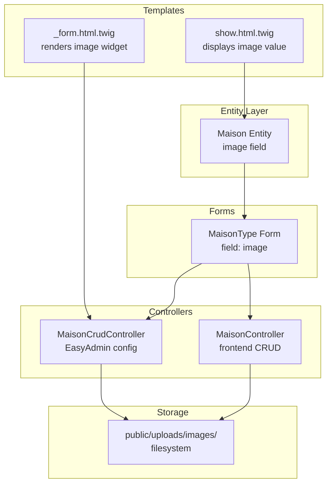
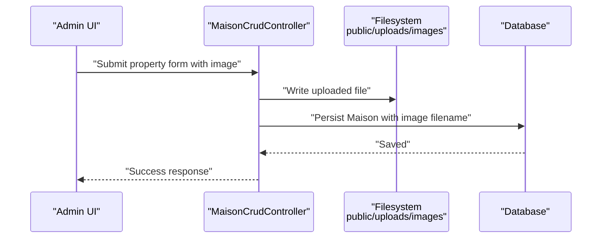
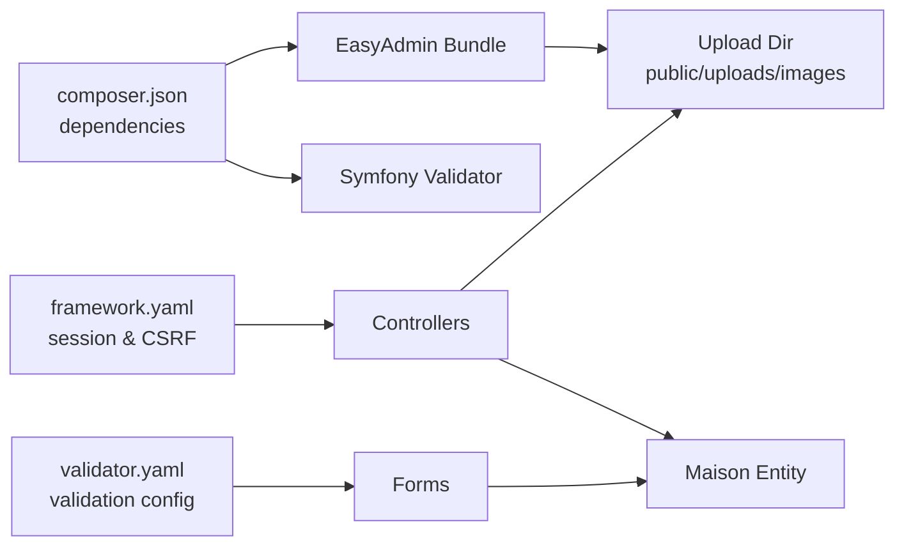

# Property Image Management

<cite>
**Referenced Files in This Document**
- [Maison.php](file://src/Entity/Maison.php)
- [MaisonType.php](file://src/Form/MaisonType.php)
- [MaisonCrudController.php](file://src/Controller/Admin/MaisonCrudController.php)
- [MaisonController.php](file://src/Controller/MaisonController.php)
- [show.html.twig](file://templates/maison/show.html.twig)
- [_form.html.twig](file://templates/maison/_form.html.twig)
- [framework.yaml](file://config/packages/framework.yaml)
- [validator.yaml](file://config/packages/validator.yaml)
- [composer.json](file://composer.json)
</cite>

## Table of Contents
1. [Introduction](#introduction)
2. [Project Structure](#project-structure)
3. [Core Components](#core-components)
4. [Architecture Overview](#architecture-overview)
5. [Detailed Component Analysis](#detailed-component-analysis)
6. [Dependency Analysis](#dependency-analysis)
7. [Performance Considerations](#performance-considerations)
8. [Security Considerations](#security-considerations)
9. [Troubleshooting Guide](#troubleshooting-guide)
10. [Conclusion](#conclusion)

## Introduction
This document describes the property image management system for the property rental application. It covers how images are uploaded, validated, stored, and displayed for property listings. It also documents the underlying entity model, form integration, administrative interface configuration, and operational procedures for adding, replacing, removing, and cleaning up images. Guidance is included for performance optimization and CDN integration.

## Project Structure
The image management functionality spans several layers:
- Entity layer defines the property record and its image field.
- Forms integrate the image field into property creation and editing.
- Controllers handle requests and persist data.
- Templates render forms and property details.
- EasyAdmin configures the administrative interface for managing images.
- Validation and framework configuration support safe uploads.

**Diagram sources**
- [Maison.php:29-30](file://src/Entity/Maison.php#L29-L30)
- [MaisonType.php:20-21](file://src/Form/MaisonType.php#L20-L21)
- [MaisonCrudController.php:30-35](file://src/Controller/Admin/MaisonCrudController.php#L30-L35)
- [MaisonController.php:25-43](file://src/Controller/MaisonController.php#L25-L43)
- [show.html.twig:31-33](file://templates/maison/show.html.twig#L31-L33)
- [_form.html.twig:31-36](file://templates/maison/_form.html.twig#L31-L36)

**Section sources**
- [Maison.php:10-118](file://src/Entity/Maison.php#L10-L118)
- [MaisonType.php:12-36](file://src/Form/MaisonType.php#L12-L36)
- [MaisonCrudController.php:16-51](file://src/Controller/Admin/MaisonCrudController.php#L16-L51)
- [MaisonController.php:14-82](file://src/Controller/MaisonController.php#L14-L82)
- [show.html.twig:1-43](file://templates/maison/show.html.twig#L1-L43)
- [_form.html.twig:1-44](file://templates/maison/_form.html.twig#L1-L44)

## Core Components
- Maison entity: Declares the image field to store the filename/path for the property’s main image.
- MaisonType form: Adds the image field to the property creation/editing form.
- EasyAdmin MaisonCrudController: Configures the administrative interface to upload images into public/uploads/images/, sets base path and filesystem location, and applies a randomized filename pattern.
- Frontend MaisonController: Handles property listing, creation, editing, and deletion via standard Symfony form flows.
- Templates: Render the image field in forms and display the stored image value in property details.

Key implementation references:
- Entity image field definition and accessors.
- Form integration of the image field.
- EasyAdmin ImageField configuration for upload directory, base path, and filename pattern.
- Frontend controller actions for new/edit.
- Twig templates rendering the image field and displaying the image value.

**Section sources**
- [Maison.php:29-99](file://src/Entity/Maison.php#L29-L99)
- [MaisonType.php:20-21](file://src/Form/MaisonType.php#L20-L21)
- [MaisonCrudController.php:30-35](file://src/Controller/Admin/MaisonCrudController.php#L30-L35)
- [MaisonController.php:25-69](file://src/Controller/MaisonController.php#L25-L69)
- [show.html.twig:31-33](file://templates/maison/show.html.twig#L31-L33)
- [_form.html.twig:31-36](file://templates/maison/_form.html.twig#L31-L36)

## Architecture Overview
The image lifecycle follows a consistent flow:
- Upload: EasyAdmin receives an image file and writes it to the configured upload directory.
- Storage: Files are saved under public/uploads/images/ with randomized filenames.
- Persistence: The entity stores only the filename/path (relative to base path).
- Display: Templates render the image value; in EasyAdmin, the configured base path is prepended to show the image.

**Diagram sources**
- [MaisonCrudController.php:30-35](file://src/Controller/Admin/MaisonCrudController.php#L30-L35)
- [Maison.php:89-99](file://src/Entity/Maison.php#L89-L99)

## Detailed Component Analysis

### Entity: Maison image field
- Purpose: Store the filename of the property’s main image.
- Type: String (length 255).
- Accessors: Getters and setters for the image field.
- Behavior: The entity does not enforce file existence; it only persists the filename/path.

Implementation references:
- Field declaration and setter/getter.

**Section sources**
- [Maison.php:29-30](file://src/Entity/Maison.php#L29-L30)
- [Maison.php:89-99](file://src/Entity/Maison.php#L89-L99)

### Form: MaisonType image field
- Integration: Adds the image field to the property form builder.
- Effect: Renders an upload widget in both frontend and EasyAdmin contexts.

Implementation references:
- Form field addition.

**Section sources**
- [MaisonType.php:20-21](file://src/Form/MaisonType.php#L20-L21)

### Admin: EasyAdmin ImageField configuration
- Base path: Relative URL path shown to browsers for image rendering.
- Upload directory: Absolute filesystem path where uploaded files are stored.
- Filename pattern: Randomized hash plus original extension to avoid collisions and preserve extension.
- Required: Optional field for images in EasyAdmin.

Implementation references:
- ImageField configuration options.

**Section sources**
- [MaisonCrudController.php:30-35](file://src/Controller/Admin/MaisonCrudController.php#L30-L35)

### Frontend: MaisonController CRUD actions
- New: Creates a new property with an optional image.
- Edit: Updates an existing property, allowing image replacement.
- Delete: Removes a property and its associated record; filesystem cleanup is not performed automatically by the controller.

Implementation references:
- Controller actions for new, edit, and delete.

**Section sources**
- [MaisonController.php:25-69](file://src/Controller/MaisonController.php#L25-L69)

### Templates: Rendering and display
- Form template: Renders the image upload widget for property forms.
- Show template: Displays the stored image value in property details.

Implementation references:
- Form rendering of the image field.
- Show page rendering of the image value.

**Section sources**
- [_form.html.twig:31-36](file://templates/maison/_form.html.twig#L31-L36)
- [show.html.twig:31-33](file://templates/maison/show.html.twig#L31-L33)

### Directory structure and file naming
- Upload directory: public/uploads/images/
- Base path for URLs: uploads/images
- Filename pattern: [randomhash].[extension] ensures uniqueness and preserves the original extension.

Implementation references:
- Upload directory and base path configuration.
- Filename pattern configuration.

**Section sources**
- [MaisonCrudController.php:32-34](file://src/Controller/Admin/MaisonCrudController.php#L32-L34)

### Image display in templates
- The show template prints the image value. In EasyAdmin, the configured base path is prepended to render the image.
- For custom templates, prepend the base path to the stored filename to produce a valid URL.

Implementation references:
- Show template rendering of the image value.

**Section sources**
- [show.html.twig:31-33](file://templates/maison/show.html.twig#L31-L33)
- [MaisonCrudController.php:31-32](file://src/Controller/Admin/MaisonCrudController.php#L31-L32)

### Responsive image loading and thumbnails
- The current implementation stores and serves the original uploaded image.
- To support responsive loading and thumbnails:
  - Generate multiple sizes during upload or post-upload processing.
  - Store additional metadata (e.g., alt text, sizes) in the entity if needed.
  - Use modern HTML features (e.g., picture element, srcset) in templates to serve appropriate sizes.

[No sources needed since this section provides general guidance]

### Removal, replacement, and cleanup
- Replacement: Submitting a new image replaces the previous filename in the entity; the old file remains on disk until manually removed.
- Removal: Deleting a property removes the record but does not remove the image file from the filesystem.
- Cleanup: Implement a scheduled job or background task to remove unused files by comparing stored filenames against existing records.

[No sources needed since this section provides general guidance]

## Dependency Analysis
The image management stack depends on:
- EasyAdmin bundle for administrative image upload configuration.
- Symfony Validator for constraints (e.g., Image constraint).
- Framework configuration for sessions and CSRF protection.

**Diagram sources**
- [composer.json:14](file://composer.json#L14)
- [composer.json:44](file://composer.json#L44)
- [framework.yaml:1-16](file://config/packages/framework.yaml#L1-L16)
- [validator.yaml:1-12](file://config/packages/validator.yaml#L1-L12)
- [MaisonCrudController.php:30-35](file://src/Controller/Admin/MaisonCrudController.php#L30-L35)

**Section sources**
- [composer.json:14](file://composer.json#L14)
- [composer.json:44](file://composer.json#L44)
- [framework.yaml:1-16](file://config/packages/framework.yaml#L1-L16)
- [validator.yaml:1-12](file://config/packages/validator.yaml#L1-L12)
- [MaisonCrudController.php:30-35](file://src/Controller/Admin/MaisonCrudController.php#L30-L35)

## Performance Considerations
- Serve images from the configured base path under public/.
- Optimize original images before upload (size and compression).
- Use lazy loading for images in listings.
- Consider CDN integration:
  - Mirror public/uploads/images/ to a CDN origin.
  - Configure CDN domain and ensure relative paths resolve correctly.
  - Use signed URLs or token-based access for private assets if needed.

[No sources needed since this section provides general guidance]

## Security Considerations
- File type validation: Use the Symfony Image constraint to restrict uploads to images only.
- File size limits: Configure maximum file size in EasyAdmin or form constraints.
- Sanitization: Avoid rendering untrusted filenames directly in contexts that could lead to XSS; the base path is controlled and static.
- Permissions: Ensure the upload directory is writable by the web server and not executable.
- Token protection: CSRF tokens are enforced for delete operations.

Validation and security references:
- Symfony Validator configuration.
- CSRF protection in controller actions.

**Section sources**
- [validator.yaml:1-12](file://config/packages/validator.yaml#L1-L12)
- [MaisonController.php:74-79](file://src/Controller/MaisonController.php#L74-L79)

## Troubleshooting Guide
- Uploaded file not visible:
  - Verify the base path and upload directory match the configured values.
  - Confirm the filename stored in the entity ends with a supported extension.
- Duplicate filename collisions:
  - The filename pattern uses a random hash; collisions are unlikely, but ensure the filesystem supports the chosen encoding.
- Old files not removed after edits/deletes:
  - Implement a cleanup job to remove unused files by comparing stored filenames against existing records.
- Large file uploads fail:
  - Increase PHP upload limits and configure EasyAdmin/file constraints accordingly.

[No sources needed since this section provides general guidance]

## Conclusion
The property image management system leverages EasyAdmin for secure, configurable uploads into public/uploads/images/ with randomized filenames. The entity stores only the filename/path, while templates render the image using the configured base path. For production, add validation constraints, optimize images, and consider CDN integration. Implement cleanup processes to maintain a healthy filesystem and ensure robust security and performance.