# Property Management System

<cite>
**Referenced Files in This Document**
- [Maison.php](file://src/Entity/Maison.php)
- [MaisonController.php](file://src/Controller/MaisonController.php)
- [MaisonType.php](file://src/Form/MaisonType.php)
- [MaisonRepository.php](file://src/Repository/MaisonRepository.php)
- [MaisonSearch.php](file://src/Entity/MaisonSearch.php)
- [MaisonSearchType.php](file://src/Form/MaisonSearchType.php)
- [MaisonCrudController.php](file://src/Controller/Admin/MaisonCrudController.php)
- [index.html.twig](file://templates/maison/index.html.twig)
- [show.html.twig](file://templates/maison/show.html.twig)
- [base.html.twig](file://templates/base.html.twig)
- [app.js](file://assets/app.js)
- [composer.json](file://composer.json)
</cite>

## Table of Contents
1. [Introduction](#introduction)
2. [Project Structure](#project-structure)
3. [Core Components](#core-components)
4. [Architecture Overview](#architecture-overview)
5. [Detailed Component Analysis](#detailed-component-analysis)
6. [Dependency Analysis](#dependency-analysis)
7. [Performance Considerations](#performance-considerations)
8. [Troubleshooting Guide](#troubleshooting-guide)
9. [Conclusion](#conclusion)
10. [Appendices](#appendices)

## Introduction
This document provides comprehensive documentation for the property management system focused on the Maison (house) entity and related components. It covers entity structure, business logic, CRUD operations, form handling, data persistence, property search and filtering, availability checks, image upload and management, property owner associations, validation rules, frontend templates with Bootstrap integration, responsive design, property status management, pricing calculations, seasonal availability, and administrative property management via EasyAdmin.

## Project Structure
The system follows a standard Symfony application layout with clear separation of concerns:
- Entities define domain objects and relationships
- Controllers handle HTTP requests and orchestrate responses
- Forms encapsulate presentation logic and validation
- Repositories provide data access and queries
- Templates render HTML with Bootstrap styling
- Assets integrate JavaScript and CSS via AssetMapper

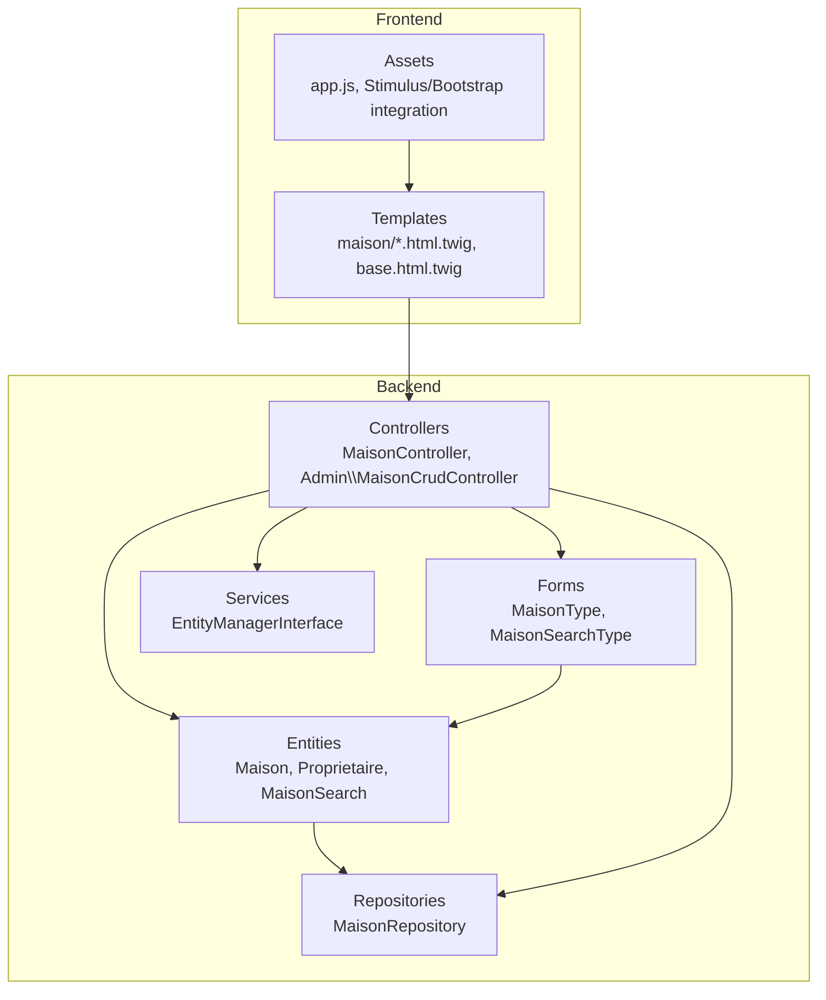

**Diagram sources**
- [Maison.php:1-118](file://src/Entity/Maison.php#L1-L118)
- [MaisonController.php:1-82](file://src/Controller/MaisonController.php#L1-L82)
- [MaisonType.php:1-36](file://src/Form/MaisonType.php#L1-L36)
- [MaisonRepository.php:1-47](file://src/Repository/MaisonRepository.php#L1-L47)
- [MaisonCrudController.php:1-51](file://src/Controller/Admin/MaisonCrudController.php#L1-L51)
- [index.html.twig:1-42](file://templates/maison/index.html.twig#L1-L42)
- [show.html.twig:1-43](file://templates/maison/show.html.twig#L1-L43)
- [base.html.twig:1-184](file://templates/base.html.twig#L1-L184)
- [app.js:1-11](file://assets/app.js#L1-L11)

**Section sources**
- [composer.json:1-111](file://composer.json#L1-L111)

## Core Components
This section documents the Maison entity, associated forms, repositories, and controllers that implement CRUD operations and search/filtering.

- Maison entity
  - Attributes: title, description, price, city, image, and a ManyToOne relationship to Proprietaire
  - Methods include getters/setters for all attributes and a string representation returning the title
  - References: [Maison.php:1-118](file://src/Entity/Maison.php#L1-L118)

- MaisonController
  - Routes: index, new, show, edit, delete
  - Uses MaisonType for form handling and EntityManagerInterface for persistence
  - Implements CSRF protection for deletion
  - References: [MaisonController.php:1-82](file://src/Controller/MaisonController.php#L1-L82)

- MaisonType form
  - Fields: title, description, price, city, image, and a dropdown for Proprietaire
  - Binds to Maison entity
  - References: [MaisonType.php:1-36](file://src/Form/MaisonType.php#L1-L36)

- MaisonRepository
  - Provides countAll, findByCity (top cities by count), and findLatest methods
  - References: [MaisonRepository.php:1-47](file://src/Repository/MaisonRepository.php#L1-L47)

- Search model and form
  - MaisonSearch holds a Maison filter object
  - MaisonSearchType provides a dropdown to select a Maison for filtering
  - References: [MaisonSearch.php:1-19](file://src/Entity/MaisonSearch.php#L1-L19), [MaisonSearchType.php:1-33](file://src/Form/MaisonSearchType.php#L1-L33)

**Section sources**
- [Maison.php:1-118](file://src/Entity/Maison.php#L1-L118)
- [MaisonController.php:1-82](file://src/Controller/MaisonController.php#L1-L82)
- [MaisonType.php:1-36](file://src/Form/MaisonType.php#L1-L36)
- [MaisonRepository.php:1-47](file://src/Repository/MaisonRepository.php#L1-L47)
- [MaisonSearch.php:1-19](file://src/Entity/MaisonSearch.php#L1-L19)
- [MaisonSearchType.php:1-33](file://src/Form/MaisonSearchType.php#L1-L33)

## Architecture Overview
The system employs a layered architecture:
- Presentation layer: Twig templates and Bootstrap styling
- Application layer: Controllers and forms
- Domain layer: Entities and value objects
- Data access layer: Repositories and Doctrine ORM

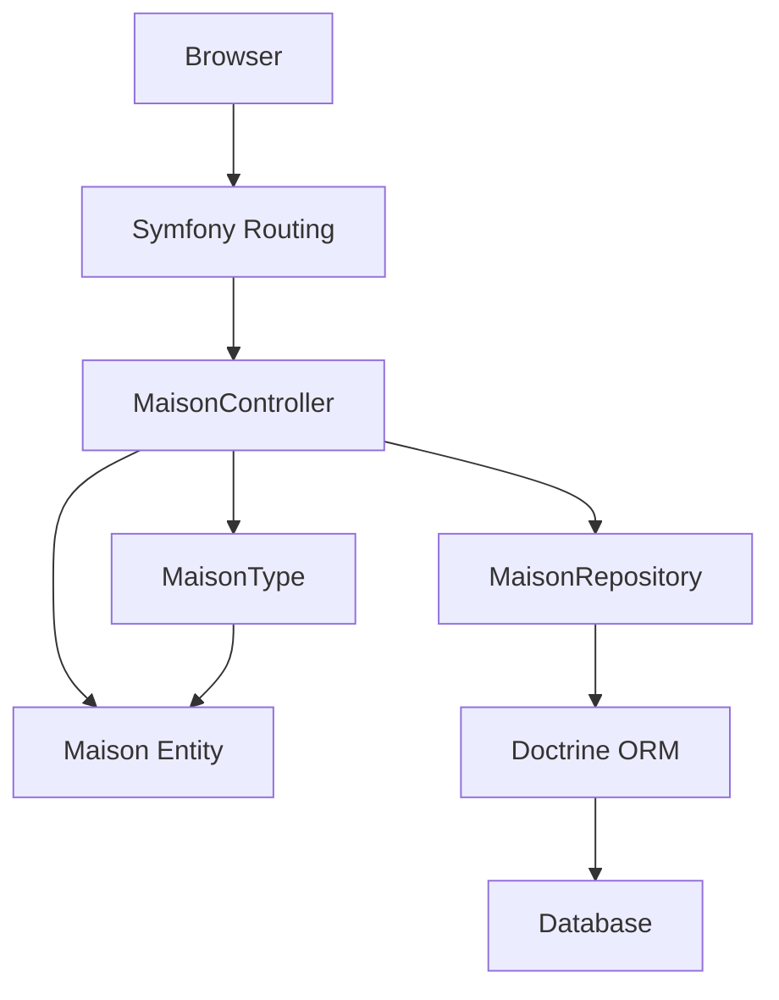

**Diagram sources**
- [MaisonController.php:1-82](file://src/Controller/MaisonController.php#L1-L82)
- [MaisonType.php:1-36](file://src/Form/MaisonType.php#L1-L36)
- [MaisonRepository.php:1-47](file://src/Repository/MaisonRepository.php#L1-L47)
- [Maison.php:1-118](file://src/Entity/Maison.php#L1-L118)

## Detailed Component Analysis

### Maison Entity
The Maison entity defines the core property record with essential attributes and relationships.

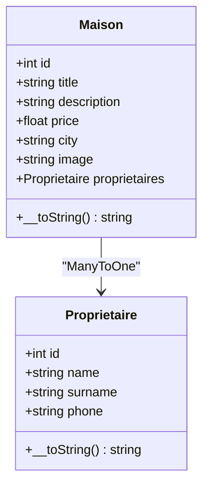

**Diagram sources**
- [Maison.php:1-118](file://src/Entity/Maison.php#L1-L118)
- [Proprietaire.php:1-70](file://src/Entity/Proprietaire.php#L1-L70)

**Section sources**
- [Maison.php:1-118](file://src/Entity/Maison.php#L1-L118)

### CRUD Operations via MaisonController
The controller implements standard CRUD actions with form handling and persistence.

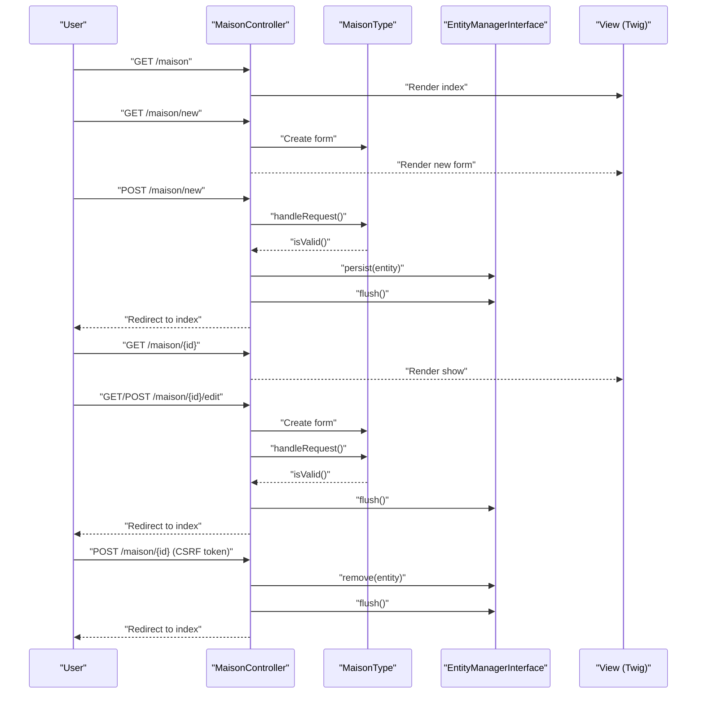

**Diagram sources**
- [MaisonController.php:1-82](file://src/Controller/MaisonController.php#L1-L82)
- [MaisonType.php:1-36](file://src/Form/MaisonType.php#L1-L36)

**Section sources**
- [MaisonController.php:1-82](file://src/Controller/MaisonController.php#L1-L82)

### Form Handling with MaisonType
The form integrates with the Maison entity and includes a dropdown for selecting a property owner.

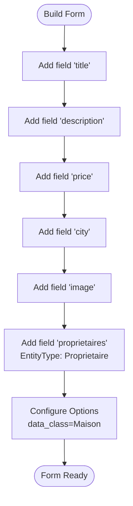

**Diagram sources**
- [MaisonType.php:1-36](file://src/Form/MaisonType.php#L1-L36)

**Section sources**
- [MaisonType.php:1-36](file://src/Form/MaisonType.php#L1-L36)

### Data Persistence via MaisonRepository
The repository provides convenience methods for querying properties.

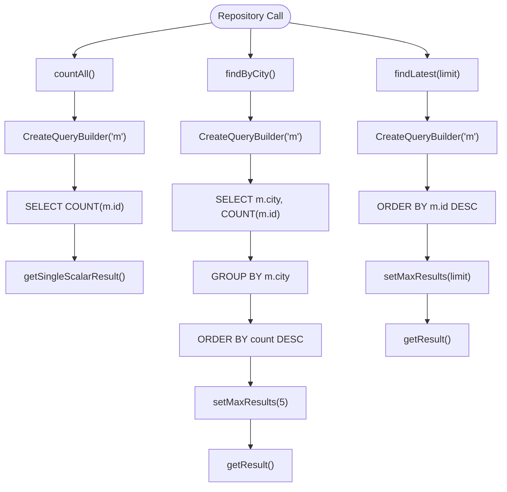

**Diagram sources**
- [MaisonRepository.php:1-47](file://src/Repository/MaisonRepository.php#L1-L47)

**Section sources**
- [MaisonRepository.php:1-47](file://src/Repository/MaisonRepository.php#L1-L47)

### Property Search and Filtering
The system supports filtering by a specific Maison using a dedicated search form and model.

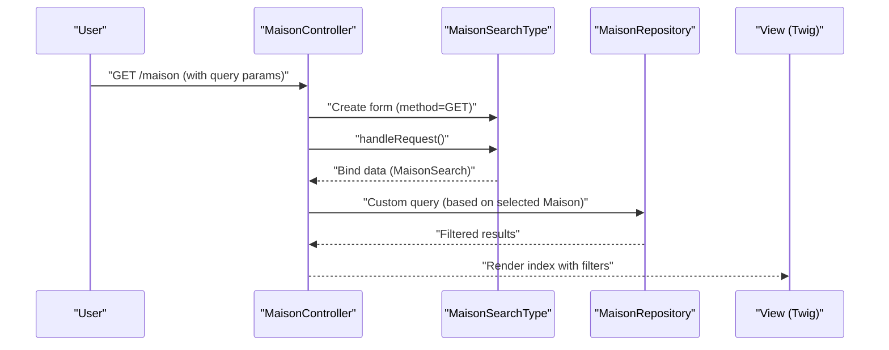

**Diagram sources**
- [MaisonSearchType.php:1-33](file://src/Form/MaisonSearchType.php#L1-L33)
- [MaisonSearch.php:1-19](file://src/Entity/MaisonSearch.php#L1-L19)
- [MaisonRepository.php:1-47](file://src/Repository/MaisonRepository.php#L1-L47)

**Section sources**
- [MaisonSearchType.php:1-33](file://src/Form/MaisonSearchType.php#L1-L33)
- [MaisonSearch.php:1-19](file://src/Entity/MaisonSearch.php#L1-L19)

### Availability Checking
Availability logic is not implemented in the current codebase. To support availability checking:
- Add date range parameters to search forms
- Extend MaisonSearch with check-in/check-out dates
- Implement repository methods to exclude booked dates
- Integrate with Reservation entity if present

[No sources needed since this section provides general guidance]

### Property Image Upload and Management
Image handling is configured in the EasyAdmin controller for the Maison entity.

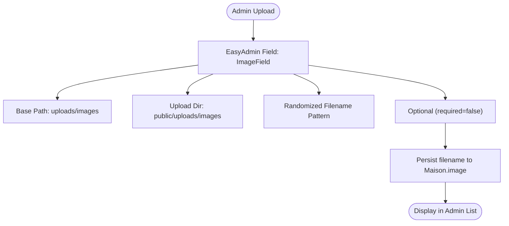

**Diagram sources**
- [MaisonCrudController.php:1-51](file://src/Controller/Admin/MaisonCrudController.php#L1-L51)

**Section sources**
- [MaisonCrudController.php:1-51](file://src/Controller/Admin/MaisonCrudController.php#L1-L51)

### Property Owner Associations
The Maison entity maintains a ManyToOne relationship with Proprietaire, allowing association of properties to owners.

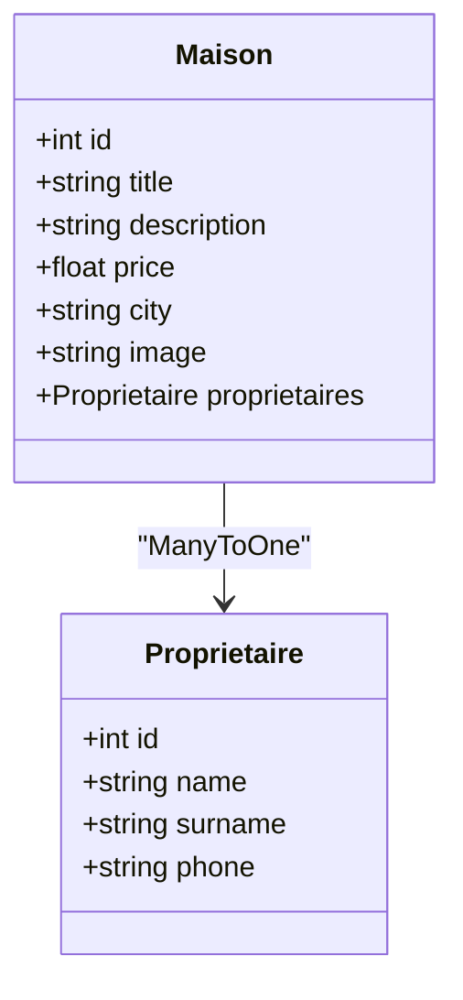

**Diagram sources**
- [Maison.php:1-118](file://src/Entity/Maison.php#L1-L118)
- [Proprietaire.php:1-70](file://src/Entity/Proprietaire.php#L1-L70)

**Section sources**
- [Maison.php:1-118](file://src/Entity/Maison.php#L1-L118)
- [Proprietaire.php:1-70](file://src/Entity/Proprietaire.php#L1-L70)

### Validation Rules
Validation is not explicitly defined in the provided files. Recommended validation rules for Maison:
- title: Not blank, max length
- description: Optional but recommended
- price: Numeric, positive
- city: Not blank, max length
- image: Optional path or file name
- proprietaires: Not blank (required association)

[No sources needed since this section provides general guidance]

### Frontend Templates and Bootstrap Integration
The frontend uses Bootstrap 5.1.3 with custom styling and responsive design.

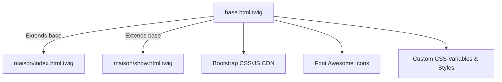

**Diagram sources**
- [base.html.twig:1-184](file://templates/base.html.twig#L1-L184)
- [index.html.twig:1-42](file://templates/maison/index.html.twig#L1-L42)
- [show.html.twig:1-43](file://templates/maison/show.html.twig#L1-L43)

**Section sources**
- [base.html.twig:1-184](file://templates/base.html.twig#L1-L184)
- [index.html.twig:1-42](file://templates/maison/index.html.twig#L1-L42)
- [show.html.twig:1-43](file://templates/maison/show.html.twig#L1-L43)

### Responsive Design
The base template includes viewport meta tag and responsive navigation with collapsible menus. Cards and buttons use Bootstrap utility classes for responsive behavior.

**Section sources**
- [base.html.twig:1-184](file://templates/base.html.twig#L1-L184)

### Property Status Management
Status management is not implemented in the current codebase. To implement:
- Add a status field to Maison (enum or string)
- Define statuses (available, booked, maintenance)
- Update EasyAdmin fields to include status selection
- Filter listings by status in templates

[No sources needed since this section provides general guidance]

### Pricing Calculations and Seasonal Availability
Pricing logic and seasonal rates are not implemented. To implement:
- Add rate tiers or seasonal pricing fields
- Implement calculation logic in service or repository
- Extend search to consider date ranges and pricing filters
- Display calculated totals in property views

[No sources needed since this section provides general guidance]

### Examples of Property Listing Display and Detailed Views
- Listing view: [index.html.twig:1-42](file://templates/maison/index.html.twig#L1-L42)
- Detailed view: [show.html.twig:1-43](file://templates/maison/show.html.twig#L1-L43)
- Navigation and branding: [base.html.twig:94-161](file://templates/base.html.twig#L94-L161)

**Section sources**
- [index.html.twig:1-42](file://templates/maison/index.html.twig#L1-L42)
- [show.html.twig:1-43](file://templates/maison/show.html.twig#L1-L43)
- [base.html.twig:94-161](file://templates/base.html.twig#L94-L161)

### Administrative Property Management via EasyAdmin
EasyAdmin provides a streamlined interface for managing properties with image upload capabilities.

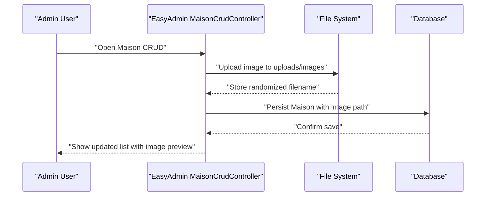

**Diagram sources**
- [MaisonCrudController.php:1-51](file://src/Controller/Admin/MaisonCrudController.php#L1-L51)

**Section sources**
- [MaisonCrudController.php:1-51](file://src/Controller/Admin/MaisonCrudController.php#L1-L51)

## Dependency Analysis
External dependencies relevant to the property management system include Symfony components, Doctrine ORM, and EasyAdmin.

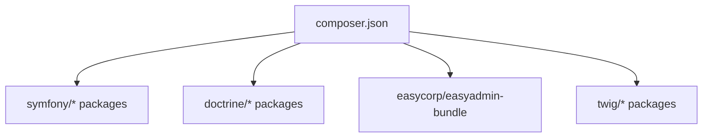

**Diagram sources**
- [composer.json:1-111](file://composer.json#L1-L111)

**Section sources**
- [composer.json:1-111](file://composer.json#L1-L111)

## Performance Considerations
- Use repository methods for efficient queries (e.g., findByCity, findLatest)
- Leverage database indexing on frequently filtered columns (city, id)
- Consider pagination in listings for large datasets
- Optimize image sizes and use lazy loading in templates
- Minimize N+1 queries by eager-loading associations where appropriate

[No sources needed since this section provides general guidance]

## Troubleshooting Guide
Common issues and resolutions:
- CSRF token errors during deletion: Ensure the CSRF token is present in the request payload
- Form validation failures: Verify form fields match entity constraints and required fields are filled
- Image upload issues: Confirm upload directory permissions and EasyAdmin field configuration
- Navigation problems: Check route names and base template links

**Section sources**
- [MaisonController.php:74-77](file://src/Controller/MaisonController.php#L74-L77)
- [MaisonType.php:1-36](file://src/Form/MaisonType.php#L1-L36)
- [MaisonCrudController.php:31-35](file://src/Controller/Admin/MaisonCrudController.php#L31-L35)

## Conclusion
The property management system provides a solid foundation for managing properties with CRUD operations, form handling, and administrative capabilities through EasyAdmin. The Maison entity and related components support essential property attributes, owner associations, and basic search/filtering. Extending the system with availability checking, pricing calculations, seasonal rates, and status management would enhance its functionality for a production environment.

## Appendices
- Asset integration: [app.js:1-11](file://assets/app.js#L1-L11)
- Bootstrap integration: [base.html.twig:8-89](file://templates/base.html.twig#L8-L89)

**Section sources**
- [app.js:1-11](file://assets/app.js#L1-L11)
- [base.html.twig:8-89](file://templates/base.html.twig#L8-L89)