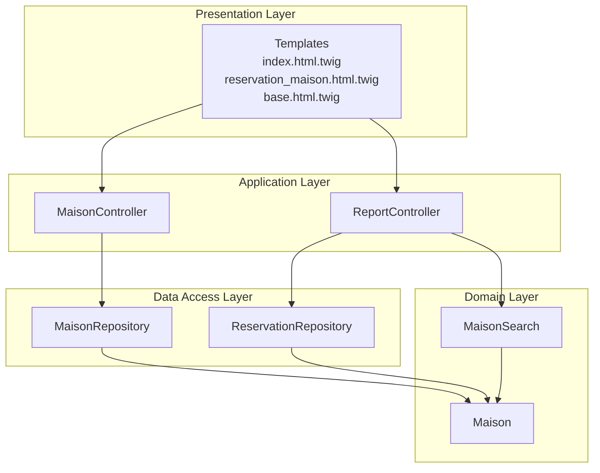
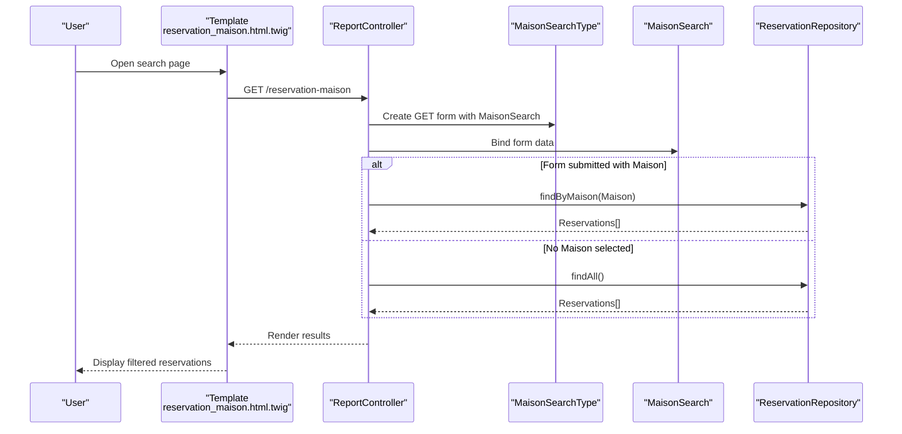
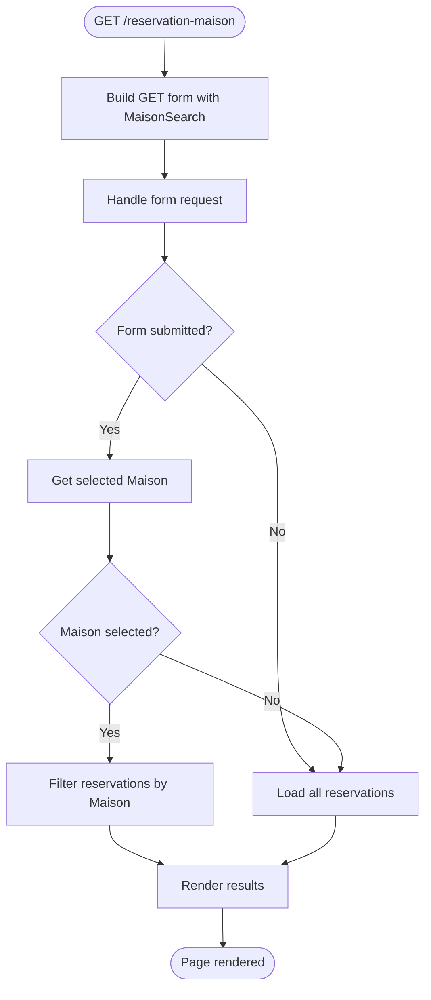
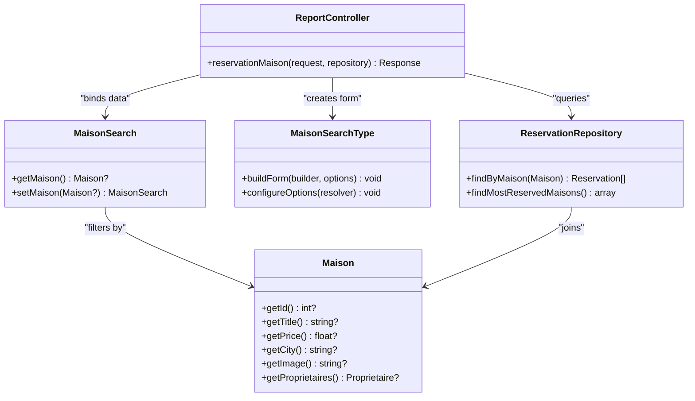

# Property Search and Filtering

<cite>
**Referenced Files in This Document**
- [MaisonSearch.php](file://src/Entity/MaisonSearch.php)
- [MaisonSearchType.php](file://src/Form/MaisonSearchType.php)
- [Maison.php](file://src/Entity/Maison.php)
- [MaisonRepository.php](file://src/Repository/MaisonRepository.php)
- [MaisonController.php](file://src/Controller/MaisonController.php)
- [ReportController.php](file://src/Controller/ReportController.php)
- [ReservationRepository.php](file://src/Repository/ReservationRepository.php)
- [reservation_maison.html.twig](file://templates/report/reservation_maison.html.twig)
- [index.html.twig](file://templates/maison/index.html.twig)
- [base.html.twig](file://templates/base.html.twig)
</cite>

## Table of Contents
1. [Introduction](#introduction)
2. [Project Structure](#project-structure)
3. [Core Components](#core-components)
4. [Architecture Overview](#architecture-overview)
5. [Detailed Component Analysis](#detailed-component-analysis)
6. [Dependency Analysis](#dependency-analysis)
7. [Performance Considerations](#performance-considerations)
8. [Troubleshooting Guide](#troubleshooting-guide)
9. [Conclusion](#conclusion)

## Introduction
This document explains the property search and filtering functionality implemented in the application. It focuses on the MaisonSearch entity and form type used to capture search criteria, the current search query construction in MaisonRepository, and the filtering logic demonstrated in the reservation reporting module. It also provides guidance on extending the system to support city-based searches, price comparisons, and availability validation, along with examples of search form rendering, query execution, result pagination, performance optimization, indexing strategies, and AJAX integration.

## Project Structure
The search and filtering features span several layers:
- Entities define the searchable attributes (Maison) and the search criteria holder (MaisonSearch).
- Forms encapsulate the user interface for search input (MaisonSearchType).
- Controllers orchestrate request handling and render results (MaisonController, ReportController).
- Repositories implement data retrieval and aggregation (MaisonRepository, ReservationRepository).
- Templates render forms and results (reservation_maison.html.twig, index.html.twig, base.html.twig).

**Diagram sources**
- [MaisonController.php:14-82](file://src/Controller/MaisonController.php#L14-L82)
- [ReportController.php:13-54](file://src/Controller/ReportController.php#L13-L54)
- [Maison.php:10-118](file://src/Entity/Maison.php#L10-L118)
- [MaisonSearch.php:5-19](file://src/Entity/MaisonSearch.php#L5-L19)
- [MaisonRepository.php:12-47](file://src/Repository/MaisonRepository.php#L12-L47)
- [ReservationRepository.php:13-93](file://src/Repository/ReservationRepository.php#L13-L93)
- [index.html.twig:1-42](file://templates/maison/index.html.twig#L1-L42)
- [reservation_maison.html.twig:1-42](file://templates/report/reservation_maison.html.twig#L1-L42)
- [base.html.twig:1-184](file://templates/base.html.twig#L1-L184)

**Section sources**
- [MaisonController.php:14-82](file://src/Controller/MaisonController.php#L14-L82)
- [ReportController.php:13-54](file://src/Controller/ReportController.php#L13-L54)
- [Maison.php:10-118](file://src/Entity/Maison.php#L10-L118)
- [MaisonSearch.php:5-19](file://src/Entity/MaisonSearch.php#L5-L19)
- [MaisonRepository.php:12-47](file://src/Repository/MaisonRepository.php#L12-L47)
- [ReservationRepository.php:13-93](file://src/Repository/ReservationRepository.php#L13-L93)
- [index.html.twig:1-42](file://templates/maison/index.html.twig#L1-L42)
- [reservation_maison.html.twig:1-42](file://templates/report/reservation_maison.html.twig#L1-L42)
- [base.html.twig:1-184](file://templates/base.html.twig#L1-L184)

## Core Components
- MaisonSearch: Holds the selected Maison for filtering. It currently supports filtering by a specific property but can be extended to include price range and availability fields.
- MaisonSearchType: A Symfony form type that renders a Maison selection dropdown with GET method and disabled CSRF protection for simpler query string handling.
- Maison: The entity containing searchable attributes such as title, description, price, city, and image.
- MaisonRepository: Provides basic queries for counts, top cities, and latest entries. It does not yet implement property search filters.
- ReportController: Demonstrates GET-based form handling and filtering by Maison in the reservation reporting context.
- ReservationRepository: Implements a custom SQL query to aggregate reservation counts per house and a DQL query to filter reservations by Maison.

**Section sources**
- [MaisonSearch.php:5-19](file://src/Entity/MaisonSearch.php#L5-L19)
- [MaisonSearchType.php:12-33](file://src/Form/MaisonSearchType.php#L12-L33)
- [Maison.php:10-118](file://src/Entity/Maison.php#L10-L118)
- [MaisonRepository.php:12-47](file://src/Repository/MaisonRepository.php#L12-L47)
- [ReportController.php:24-53](file://src/Controller/ReportController.php#L24-L53)
- [ReservationRepository.php:57-93](file://src/Repository/ReservationRepository.php#L57-L93)

## Architecture Overview
The current search architecture follows a layered pattern:
- Presentation: Twig templates render forms and results.
- Application: Controllers handle requests and coordinate repositories.
- Domain: Entities model the data and search criteria.
- Data Access: Repositories encapsulate persistence and queries.

**Diagram sources**
- [reservation_maison.html.twig:1-42](file://templates/report/reservation_maison.html.twig#L1-L42)
- [ReportController.php:24-53](file://src/Controller/ReportController.php#L24-L53)
- [MaisonSearchType.php:12-33](file://src/Form/MaisonSearchType.php#L12-L33)
- [MaisonSearch.php:5-19](file://src/Entity/MaisonSearch.php#L5-L19)
- [ReservationRepository.php:70-78](file://src/Repository/ReservationRepository.php#L70-L78)

## Detailed Component Analysis

### MaisonSearch Entity
Purpose:
- Encapsulates the selected Maison for filtering.
- Can be extended to include price min/max and availability date fields.

Key characteristics:
- Single property: maison (nullable Maison).
- Getters and setters for the Maison association.

Extensibility:
- Add priceMin, priceMax, availabilityDate fields.
- Add validation constraints for price ranges and date logic.

**Section sources**
- [MaisonSearch.php:5-19](file://src/Entity/MaisonSearch.php#L5-L19)

### MaisonSearchType Form Type
Purpose:
- Renders a Maison selection dropdown with GET method.
- Disables CSRF protection to simplify query string handling.

Behavior:
- Uses EntityType with choice_label set to title.
- Allows empty selection (required=false).
- Forces method GET and disables CSRF for cleaner URLs.

Integration:
- Used in ReportController for reservation filtering.
- Can be reused for property search pages.

**Section sources**
- [MaisonSearchType.php:12-33](file://src/Form/MaisonSearchType.php#L12-L33)

### Maison Entity
Attributes relevant to search:
- title, description, price, city, image, and owner relationship.

Implications:
- Price and city are suitable for filtering and grouping.
- Image and title support presentation in results.

**Section sources**
- [Maison.php:10-118](file://src/Entity/Maison.php#L10-L118)

### MaisonRepository Queries
Current capabilities:
- countAll(): Returns total property count.
- findByCity(): Groups by city and orders by count (top 5).
- findLatest(): Returns latest properties by ID.

Missing:
- A dedicated search method for city-based filtering, price comparisons, and availability validation.

Recommendations:
- Add a method like findByCriteria(MaisonSearch $criteria, array $options = []).
- Support city LIKE, price BETWEEN, and availability checks via joins with Reservation.

**Section sources**
- [MaisonRepository.php:19-45](file://src/Repository/MaisonRepository.php#L19-L45)

### ReportController Reservation Search
Workflow:
- Creates a GET form bound to MaisonSearch.
- Defaults to returning all reservations.
- If a Maison is selected, filters reservations by that Maison.
- Renders results in reservation_maison.html.twig.

**Diagram sources**
- [ReportController.php:24-53](file://src/Controller/ReportController.php#L24-L53)
- [MaisonSearchType.php:12-33](file://src/Form/MaisonSearchType.php#L12-L33)
- [MaisonSearch.php:5-19](file://src/Entity/MaisonSearch.php#L5-L19)
- [ReservationRepository.php:70-78](file://src/Repository/ReservationRepository.php#L70-L78)

**Section sources**
- [ReportController.php:24-53](file://src/Controller/ReportController.php#L24-L53)
- [reservation_maison.html.twig:1-42](file://templates/report/reservation_maison.html.twig#L1-L42)

### ReservationRepository Custom Queries
- findMostReservedMaisons(): Executes a native SQL query joining reservation and maison tables, grouping by house title and ordering by reservation count.
- findByMaison(): Uses DQL to filter reservations by a specific Maison and order by start date descending.

These demonstrate patterns for:
- Aggregation queries with SQL.
- Association-based filtering with DQL.

**Section sources**
- [ReservationRepository.php:57-93](file://src/Repository/ReservationRepository.php#L57-L93)

### Template Rendering Examples
- Base layout: Provides navigation and responsive styling.
- Maison index: Lists properties with title, description, price, city, image, and actions.
- Reservation-Maison search: Renders a GET form with Maison dropdown and displays filtered reservations.

**Section sources**
- [base.html.twig:1-184](file://templates/base.html.twig#L1-L184)
- [index.html.twig:1-42](file://templates/maison/index.html.twig#L1-L42)
- [reservation_maison.html.twig:1-42](file://templates/report/reservation_maison.html.twig#L1-L42)

## Dependency Analysis
Relationships:
- ReportController depends on MaisonSearchType and MaisonSearch for filtering.
- ReservationRepository depends on Maison for association-based queries.
- Templates depend on controllers for data and on forms for rendering.

**Diagram sources**
- [MaisonSearch.php:5-19](file://src/Entity/MaisonSearch.php#L5-L19)
- [MaisonSearchType.php:12-33](file://src/Form/MaisonSearchType.php#L12-L33)
- [Maison.php:10-118](file://src/Entity/Maison.php#L10-L118)
- [ReportController.php:24-53](file://src/Controller/ReportController.php#L24-L53)
- [ReservationRepository.php:57-93](file://src/Repository/ReservationRepository.php#L57-L93)

**Section sources**
- [MaisonSearch.php:5-19](file://src/Entity/MaisonSearch.php#L5-L19)
- [MaisonSearchType.php:12-33](file://src/Form/MaisonSearchType.php#L12-L33)
- [Maison.php:10-118](file://src/Entity/Maison.php#L10-L118)
- [ReportController.php:24-53](file://src/Controller/ReportController.php#L24-L53)
- [ReservationRepository.php:57-93](file://src/Repository/ReservationRepository.php#L57-L93)

## Performance Considerations
Indexing strategies:
- Add database indexes on frequently filtered columns:
  - maison(city)
  - maison(price)
  - reservation(date_debut, date_fin)
  - reservation(maison_id)
- Consider composite indexes for multi-column filters (e.g., city + price).

Query optimization:
- Use LIMIT and OFFSET for pagination.
- Prefer EXISTS or JOIN with early termination when checking availability.
- Cache aggregation results (e.g., top cities) periodically.

Caching:
- Cache popular city lists and counts.
- Use query result caching for expensive aggregations.

Monitoring:
- Profile slow queries with Doctrine DBAL logging.
- Track average response times for search endpoints.

[No sources needed since this section provides general guidance]

## Troubleshooting Guide
Common issues and resolutions:
- Empty results after filtering:
  - Verify the selected Maison exists and is associated with reservations.
  - Ensure GET parameters are present and correctly bound to MaisonSearch.
- Unexpected form submission:
  - Confirm MaisonSearchType is configured with method GET and CSRF disabled.
- Performance degradation:
  - Add database indexes on city and price.
  - Implement pagination and limit result sets.

**Section sources**
- [MaisonSearchType.php:25-32](file://src/Form/MaisonSearchType.php#L25-L32)
- [ReportController.php:39-47](file://src/Controller/ReportController.php#L39-L47)

## Conclusion
The application currently demonstrates a clean GET-based search pattern for reservations using a Maison filter. To implement comprehensive property search and filtering (city-based, price range, availability), extend MaisonSearch with price and date fields, add a search method to MaisonRepository supporting LIKE, BETWEEN, and availability checks, and integrate pagination. Follow the established patterns shown in ReportController and ReservationRepository to maintain consistency and performance.