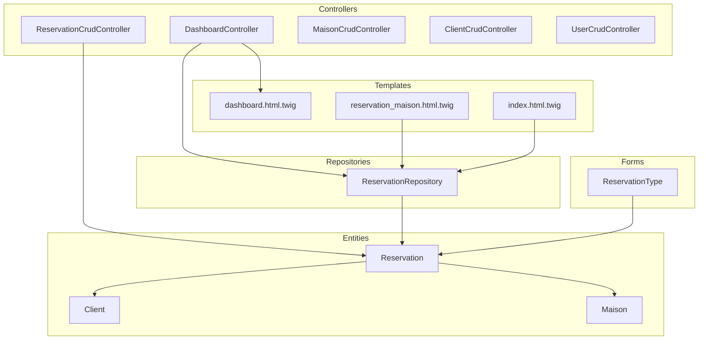
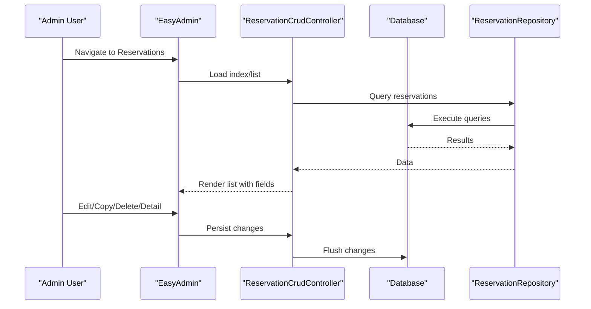
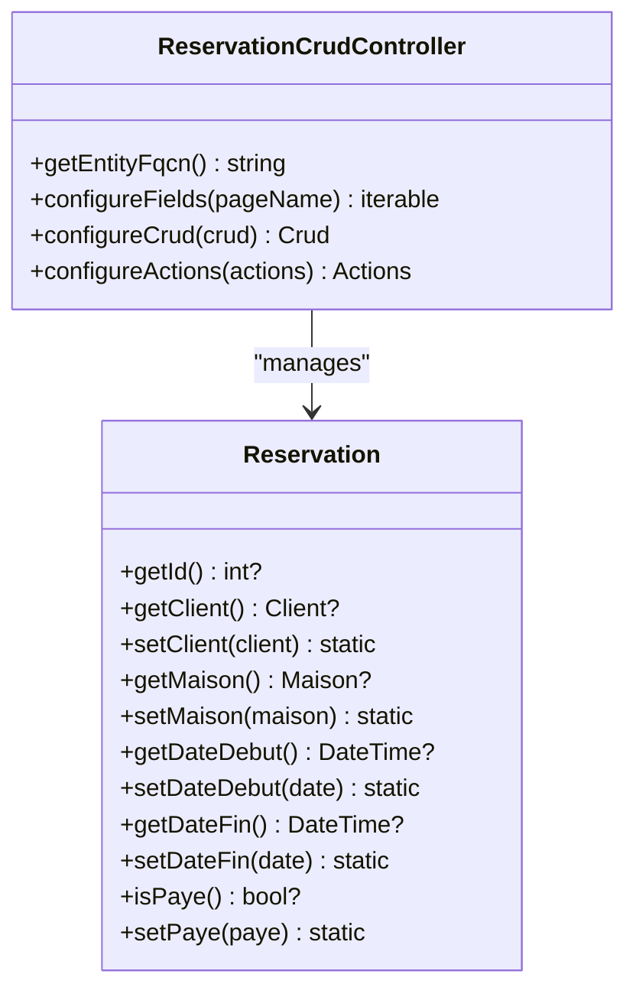
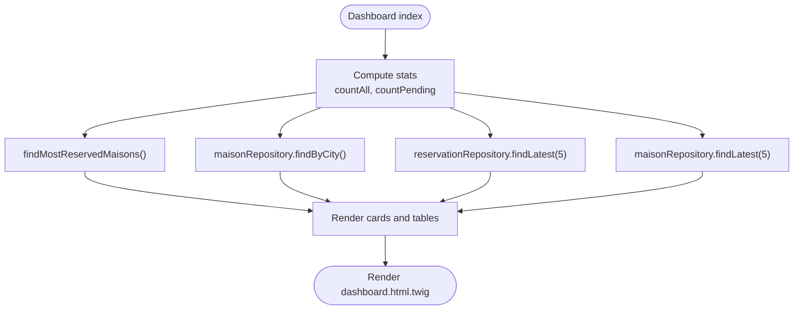
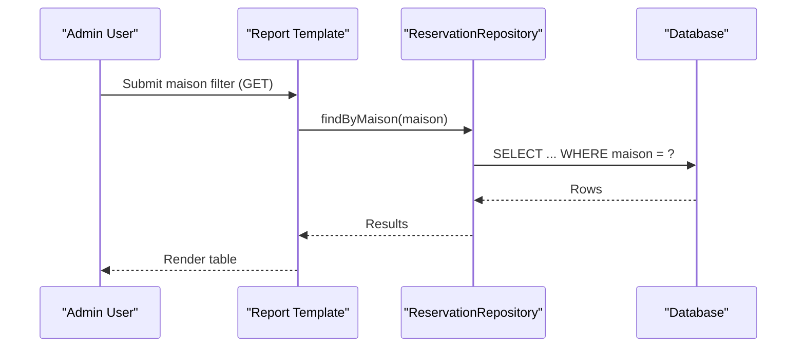
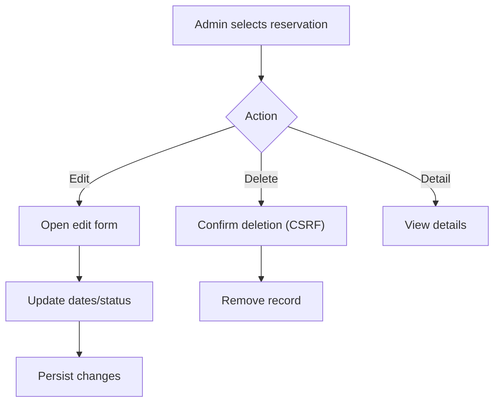
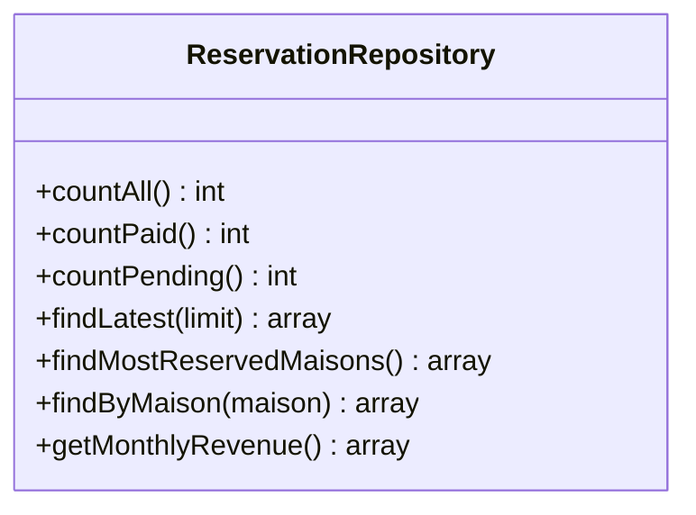
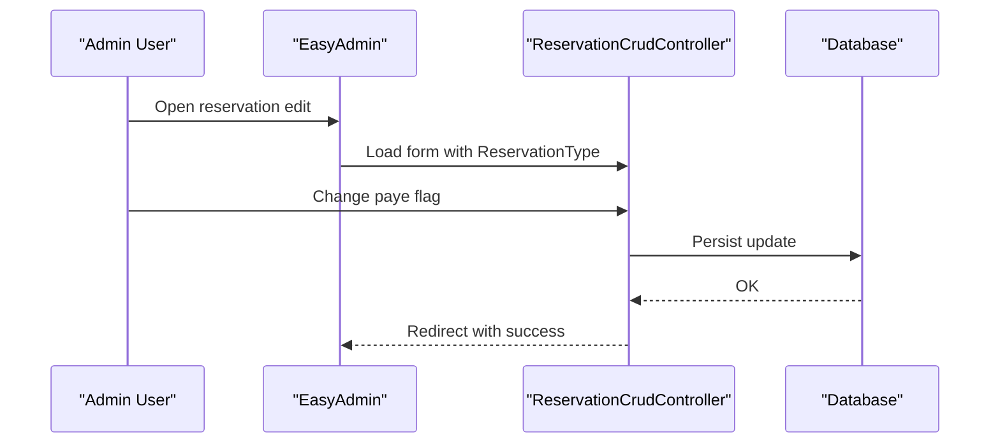
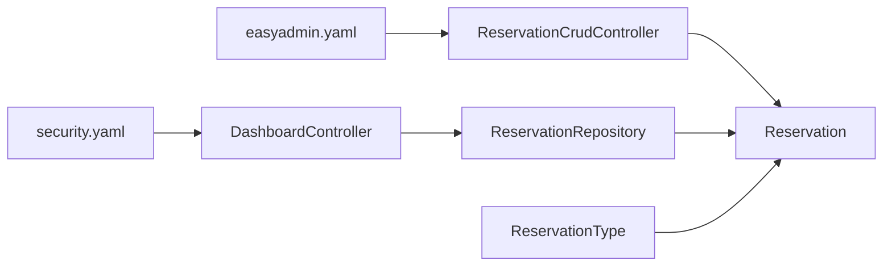

# Administrative Reservation Management

<cite>
**Referenced Files in This Document**
- [ReservationCrudController.php](file://src/Controller/Admin/ReservationCrudController.php)
- [DashboardController.php](file://src/Controller/Admin/DashboardController.php)
- [Reservation.php](file://src/Entity/Reservation.php)
- [ReservationRepository.php](file://src/Repository/ReservationRepository.php)
- [ReservationType.php](file://src/Form/ReservationType.php)
- [ReservationController.php](file://src/Controller/ReservationController.php)
- [dashboard.html.twig](file://templates/admin/dashboard.html.twig)
- [reservation_maison.html.twig](file://templates/report/reservation_maison.html.twig)
- [index.html.twig](file://templates/report/index.html.twig)
- [security.yaml](file://config/packages/security.yaml)
- [easyadmin.yaml](file://config/routes/easyadmin.yaml)
- [MaisonCrudController.php](file://src/Controller/Admin/MaisonCrudController.php)
- [ClientCrudController.php](file://src/Controller/Admin/ClientCrudController.php)
- [UserCrudController.php](file://src/Controller/Admin/UserCrudController.php)
</cite>

## Table of Contents
1. [Introduction](#introduction)
2. [Project Structure](#project-structure)
3. [Core Components](#core-components)
4. [Architecture Overview](#architecture-overview)
5. [Detailed Component Analysis](#detailed-component-analysis)
6. [Dependency Analysis](#dependency-analysis)
7. [Performance Considerations](#performance-considerations)
8. [Troubleshooting Guide](#troubleshooting-guide)
9. [Conclusion](#conclusion)
10. [Appendices](#appendices)

## Introduction
This document describes the administrative reservation management capabilities built with EasyAdmin in the guest house management application. It covers the ReservationCrudController configuration, CRUD operations, administrative interface customization, dashboard overview, reporting, bulk management, administrative workflows (modification, cancellation, status adjustment), filters and search, analytics, permissions, audit trails, and integration with reservation business logic including approval workflows and administrative overrides.

## Project Structure
The administrative reservation management spans several layers:
- Controllers: EasyAdmin CRUD controllers for reservations and other entities, plus a custom Dashboard controller
- Entities: Reservation entity with associations to Client and Maison
- Repositories: ReservationRepository providing analytics and queries
- Forms: ReservationType for user-facing forms
- Templates: Twig templates for the admin dashboard and reports
- Security: Access control enforcing ROLE_ADMIN for the admin area

**Diagram sources**
- [ReservationCrudController.php:15-46](file://src/Controller/Admin/ReservationCrudController.php#L15-L46)
- [DashboardController.php:22-88](file://src/Controller/Admin/DashboardController.php#L22-L88)
- [Reservation.php:10-99](file://src/Entity/Reservation.php#L10-L99)
- [ReservationRepository.php:13-92](file://src/Repository/ReservationRepository.php#L13-L92)
- [ReservationType.php:14-49](file://src/Form/ReservationType.php#L14-L49)
- [dashboard.html.twig:1-263](file://templates/admin/dashboard.html.twig#L1-L263)
- [reservation_maison.html.twig:1-42](file://templates/report/reservation_maison.html.twig#L1-L42)
- [index.html.twig:1-22](file://templates/report/index.html.twig#L1-L22)

**Section sources**
- [easyadmin.yaml:1-4](file://config/routes/easyadmin.yaml#L1-L4)
- [security.yaml:40-45](file://config/packages/security.yaml#L40-L45)

## Core Components
- ReservationCrudController: Defines the EasyAdmin CRUD interface for reservations, field layout, pagination, and action additions.
- DashboardController: Provides administrative dashboard with statistics, charts, and recent activity.
- Reservation entity: Core domain model with associations to Client and Maison and payment status.
- ReservationRepository: Analytics and queries for counts, pending payments, latest reservations, most reserved houses, monthly revenue, and per-house reservations.
- ReservationType: Form definition for creating and editing reservations.
- Security configuration: Enforces ROLE_ADMIN for the admin area.

**Section sources**
- [ReservationCrudController.php:15-46](file://src/Controller/Admin/ReservationCrudController.php#L15-L46)
- [DashboardController.php:22-88](file://src/Controller/Admin/DashboardController.php#L22-L88)
- [Reservation.php:10-99](file://src/Entity/Reservation.php#L10-L99)
- [ReservationRepository.php:13-92](file://src/Repository/ReservationRepository.php#L13-L92)
- [ReservationType.php:14-49](file://src/Form/ReservationType.php#L14-L49)
- [security.yaml:40-45](file://config/packages/security.yaml#L40-L45)

## Architecture Overview
The administrative interface leverages EasyAdmin for CRUD operations and custom dashboard rendering. Business logic resides in repositories and entities, while templates render analytics and reports.

**Diagram sources**
- [ReservationCrudController.php:22-45](file://src/Controller/Admin/ReservationCrudController.php#L22-L45)
- [ReservationRepository.php:20-55](file://src/Repository/ReservationRepository.php#L20-L55)

## Detailed Component Analysis

### Reservation CRUD Controller
- Entity mapping: Returns the Reservation class.
- Fields: id (hidden on form), client, maison, dateDebut, dateFin, paye.
- Pagination: Page size 10, range size 4.
- Actions: Adds detail action to index view.

**Diagram sources**
- [ReservationCrudController.php:15-46](file://src/Controller/Admin/ReservationCrudController.php#L15-L46)
- [Reservation.php:10-99](file://src/Entity/Reservation.php#L10-L99)

**Section sources**
- [ReservationCrudController.php:15-46](file://src/Controller/Admin/ReservationCrudController.php#L15-L46)

### Administrative Dashboard
- Statistics: Total houses, clients, reservations, pending payments.
- Charts and tables: Most reserved houses, houses by city, latest reservations, latest houses.
- Navigation: Links to entities and back to the site.

**Diagram sources**
- [DashboardController.php:32-61](file://src/Controller/Admin/DashboardController.php#L32-L61)
- [dashboard.html.twig:15-260](file://templates/admin/dashboard.html.twig#L15-L260)
- [ReservationRepository.php:20-68](file://src/Repository/ReservationRepository.php#L20-L68)

**Section sources**
- [DashboardController.php:32-61](file://src/Controller/Admin/DashboardController.php#L32-L61)
- [dashboard.html.twig:15-260](file://templates/admin/dashboard.html.twig#L15-L260)

### Reservation Reporting and Search
- Per-house reservation search: Filter by Maison with a dedicated template and GET form.
- Most reserved houses report: Aggregated view of reservations per house.

**Diagram sources**
- [reservation_maison.html.twig:8-12](file://templates/report/reservation_maison.html.twig#L8-L12)
- [ReservationRepository.php:70-78](file://src/Repository/ReservationRepository.php#L70-L78)

**Section sources**
- [reservation_maison.html.twig:1-42](file://templates/report/reservation_maison.html.twig#L1-L42)
- [index.html.twig:1-22](file://templates/report/index.html.twig#L1-L22)
- [ReservationRepository.php:57-68](file://src/Repository/ReservationRepository.php#L57-L68)

### Administrative Workflows
- Modification: Edit via EasyAdmin form; fields include dates, payment status, and associations.
- Cancellation: Removal via EasyAdmin delete action with CSRF protection.
- Status adjustment: Toggle paye flag in the reservation form.
- Bulk management: EasyAdmin supports batch actions; the index view includes a detail action for quick inspection.

**Section sources**
- [ReservationCrudController.php:22-45](file://src/Controller/Admin/ReservationCrudController.php#L22-L45)
- [ReservationType.php:16-40](file://src/Form/ReservationType.php#L16-L40)
- [ReservationController.php:53-79](file://src/Controller/ReservationController.php#L53-L79)

### Filters, Search, and Analytics
- Administrative filters: EasyAdmin provides filtering by association fields (client, maison) and boolean (paye).
- Search: Dashboard displays latest items; reservation listing supports sorting and pagination.
- Analytics: Monthly revenue calculation and most reserved houses aggregation.

**Diagram sources**
- [ReservationRepository.php:20-91](file://src/Repository/ReservationRepository.php#L20-L91)

**Section sources**
- [ReservationRepository.php:20-91](file://src/Repository/ReservationRepository.php#L20-L91)
- [ReservationCrudController.php:22-39](file://src/Controller/Admin/ReservationCrudController.php#L22-L39)

### Permissions, Audit Trails, and History Tracking
- Permissions: ROLE_ADMIN enforced for admin routes.
- Audit trails: No explicit audit logging is present in the reviewed files.
- History tracking: No dedicated reservation history entity or service found in the reviewed files.

Recommendations:
- Add an AuditLog entity and listener/service to track reservation modifications and deletions.
- Store user identity and timestamps for each change.

**Section sources**
- [security.yaml:40-45](file://config/packages/security.yaml#L40-L45)

### Integration with Business Logic and Approval Workflows
- Approval workflows: Payment status (paye) is part of the reservation model; administrative overrides can be performed via EasyAdmin edits.
- Administrative overrides: Direct field updates in the reservation form enable immediate status changes.

**Diagram sources**
- [ReservationType.php:16-40](file://src/Form/ReservationType.php#L16-L40)
- [ReservationCrudController.php:22-31](file://src/Controller/Admin/ReservationCrudController.php#L22-L31)

**Section sources**
- [Reservation.php:88-98](file://src/Entity/Reservation.php#L88-L98)
- [ReservationType.php:16-40](file://src/Form/ReservationType.php#L16-L40)

## Dependency Analysis
- ReservationCrudController depends on the Reservation entity and EasyAdmin fields/actions.
- DashboardController depends on repositories for statistics and renders dashboard.html.twig.
- ReservationRepository encapsulates all analytics queries.
- ReservationType binds form fields to the Reservation entity.
- Security.yaml enforces ROLE_ADMIN for admin routes.

**Diagram sources**
- [ReservationCrudController.php:15-46](file://src/Controller/Admin/ReservationCrudController.php#L15-L46)
- [DashboardController.php:22-88](file://src/Controller/Admin/DashboardController.php#L22-L88)
- [ReservationRepository.php:13-92](file://src/Repository/ReservationRepository.php#L13-L92)
- [ReservationType.php:14-49](file://src/Form/ReservationType.php#L14-L49)
- [security.yaml:40-45](file://config/packages/security.yaml#L40-L45)
- [easyadmin.yaml:1-4](file://config/routes/easyadmin.yaml#L1-L4)

**Section sources**
- [ReservationCrudController.php:15-46](file://src/Controller/Admin/ReservationCrudController.php#L15-L46)
- [DashboardController.php:22-88](file://src/Controller/Admin/DashboardController.php#L22-L88)
- [ReservationRepository.php:13-92](file://src/Repository/ReservationRepository.php#L13-L92)
- [ReservationType.php:14-49](file://src/Form/ReservationType.php#L14-L49)
- [security.yaml:40-45](file://config/packages/security.yaml#L40-L45)
- [easyadmin.yaml:1-4](file://config/routes/easyadmin.yaml#L1-L4)

## Performance Considerations
- Pagination: Set to 10 per page; adjust based on dataset size and admin performance needs.
- Queries: Repository methods use efficient DQL/SQL; consider adding database indexes on frequently filtered columns (e.g., dateDebut, paye, maison_id).
- Dashboard rendering: Aggregation queries are straightforward; avoid heavy joins on large datasets.

## Troubleshooting Guide
- Access denied: Ensure ROLE_ADMIN is granted to administrators.
- Empty dashboard: Verify repository methods return data; confirm entities exist.
- Edit failures: Check form validation and persistence; ensure associations are valid.
- Reports not showing data: Confirm filter parameters and query results.

**Section sources**
- [security.yaml:40-45](file://config/packages/security.yaml#L40-L45)
- [ReservationRepository.php:20-91](file://src/Repository/ReservationRepository.php#L20-L91)
- [ReservationType.php:16-40](file://src/Form/ReservationType.php#L16-L40)

## Conclusion
The administrative reservation management leverages EasyAdmin for efficient CRUD operations, a custom dashboard for insights, and repository-driven analytics. While the current implementation focuses on essential administrative tasks, extending it with audit trails and history tracking would strengthen compliance and operational visibility.

## Appendices

### Administrative Menu Items
- Dashboard, Maisons, Clients, Réservations, Propriétaires, Utilisateurs, Back to site.

**Section sources**
- [DashboardController.php:71-86](file://src/Controller/Admin/DashboardController.php#L71-L86)