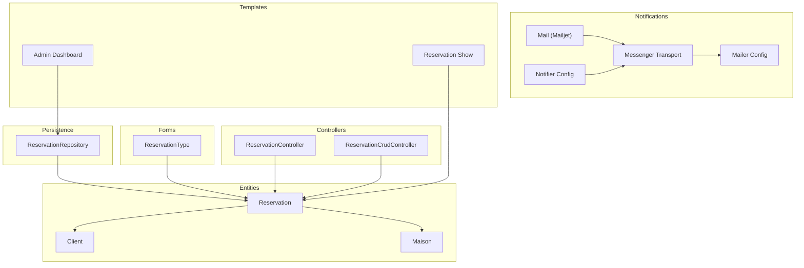
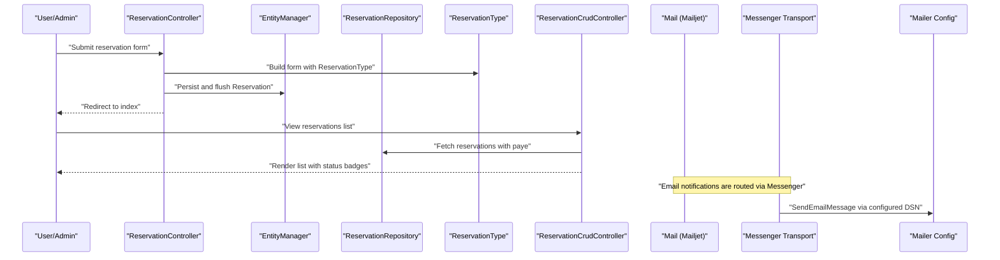
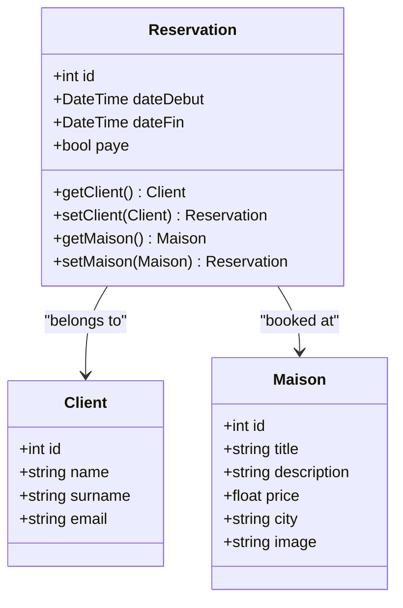
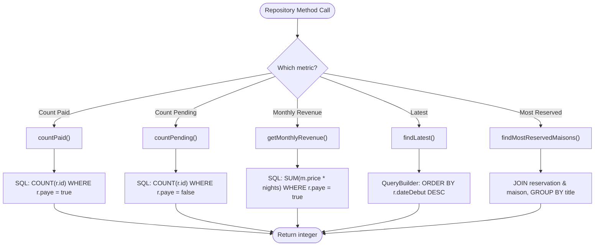
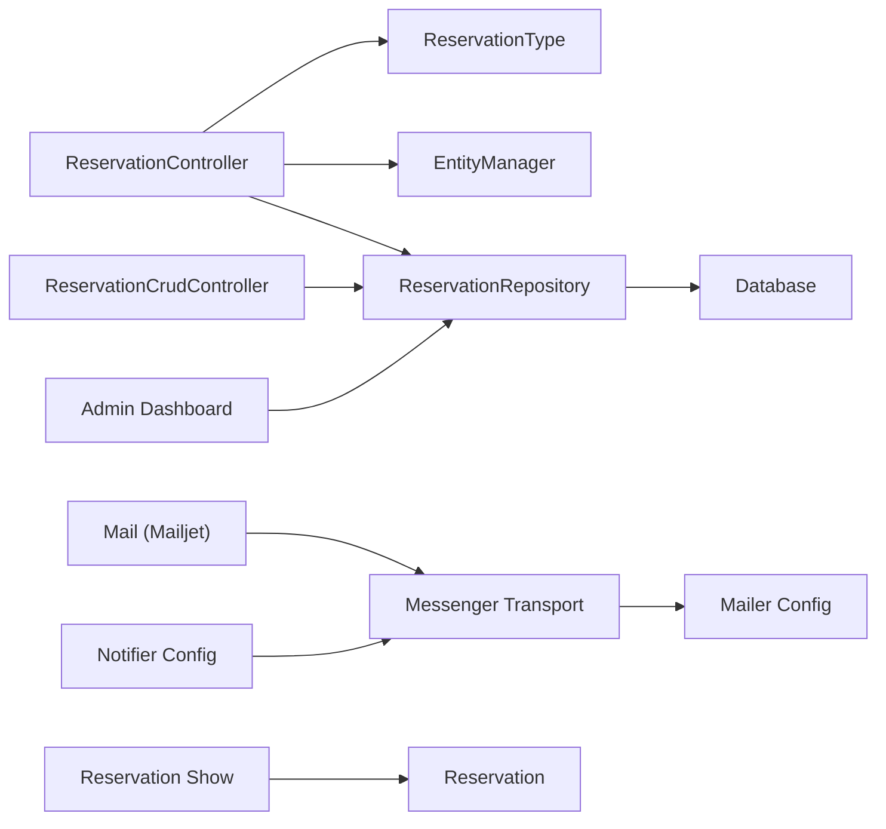

# Payment Processing and Status Management

<cite>
**Referenced Files in This Document**
- [Reservation.php](file://src/Entity/Reservation.php)
- [ReservationRepository.php](file://src/Repository/ReservationRepository.php)
- [ReservationType.php](file://src/Form/ReservationType.php)
- [ReservationController.php](file://src/Controller/ReservationController.php)
- [ReservationCrudController.php](file://src/Controller/Admin/ReservationCrudController.php)
- [Mail.php](file://src/Classe/Mail.php)
- [messenger.yaml](file://config/packages/messenger.yaml)
- [mailer.yaml](file://config/packages/mailer.yaml)
- [notifier.yaml](file://config/packages/notifier.yaml)
- [dashboard.html.twig](file://templates/admin/dashboard.html.twig)
- [show.html.twig](file://templates/reservation/show.html.twig)
- [Client.php](file://src/Entity/Client.php)
- [Maison.php](file://src/Entity/Maison.php)
- [Version20260322195642.php](file://migrations/Version20260322195642.php)
</cite>

## Table of Contents
1. [Introduction](#introduction)
2. [Project Structure](#project-structure)
3. [Core Components](#core-components)
4. [Architecture Overview](#architecture-overview)
5. [Detailed Component Analysis](#detailed-component-analysis)
6. [Dependency Analysis](#dependency-analysis)
7. [Performance Considerations](#performance-considerations)
8. [Troubleshooting Guide](#troubleshooting-guide)
9. [Conclusion](#conclusion)

## Introduction
This document explains the payment processing and reservation status management capabilities implemented in the application. It focuses on the payment status field, confirmation workflows, automated status updates, integration with external payment systems, verification processes, status synchronization, and the reservation lifecycle. It also covers automated email notifications for payment confirmation, payment failure handling, refund processing, reconciliation procedures, and the relationship between payment status and property availability management.

## Project Structure
The payment and status management features are centered around the Reservation entity and its supporting components:
- Entity model: Reservation, Client, Maison
- Persistence: ReservationRepository with aggregation queries
- Forms: ReservationType exposing the paye field
- Controllers: ReservationController for CRUD, ReservationCrudController for admin
- Notifications: Mail class via Mailjet, configured via messenger and notifier
- Templates: Admin dashboard and reservation views

**Diagram sources**
- [Reservation.php:10-99](file://src/Entity/Reservation.php#L10-L99)
- [ReservationRepository.php:13-92](file://src/Repository/ReservationRepository.php#L13-L92)
- [ReservationType.php:14-49](file://src/Form/ReservationType.php#L14-L49)
- [ReservationController.php:15-81](file://src/Controller/ReservationController.php#L15-L81)
- [ReservationCrudController.php:15-45](file://src/Controller/Admin/ReservationCrudController.php#L15-L45)
- [Mail.php:8-47](file://src/Classe/Mail.php#L8-L47)
- [messenger.yaml:1-27](file://config/packages/messenger.yaml#L1-L27)
- [mailer.yaml:1-4](file://config/packages/mailer.yaml#L1-L4)
- [notifier.yaml:1-12](file://config/packages/notifier.yaml#L1-L12)
- [dashboard.html.twig:61-226](file://templates/admin/dashboard.html.twig#L61-L226)
- [show.html.twig:1-34](file://templates/reservation/show.html.twig#L1-L34)

**Section sources**
- [Reservation.php:10-99](file://src/Entity/Reservation.php#L10-L99)
- [ReservationRepository.php:13-92](file://src/Repository/ReservationRepository.php#L13-L92)
- [ReservationType.php:14-49](file://src/Form/ReservationType.php#L14-L49)
- [ReservationController.php:15-81](file://src/Controller/ReservationController.php#L15-L81)
- [ReservationCrudController.php:15-45](file://src/Controller/Admin/ReservationCrudController.php#L15-L45)
- [Mail.php:8-47](file://src/Classe/Mail.php#L8-L47)
- [messenger.yaml:1-27](file://config/packages/messenger.yaml#L1-L27)
- [mailer.yaml:1-4](file://config/packages/mailer.yaml#L1-L4)
- [notifier.yaml:1-12](file://config/packages/notifier.yaml#L1-L12)
- [dashboard.html.twig:61-226](file://templates/admin/dashboard.html.twig#L61-L226)
- [show.html.twig:1-34](file://templates/reservation/show.html.twig#L1-L34)

## Core Components
- Reservation entity: Holds booking dates and the payment flag (paye). It links to Client and Maison.
- ReservationRepository: Provides counts for paid and pending reservations, monthly revenue computation, and related queries.
- ReservationType: Exposes the paye field in forms for admin editing.
- Controllers: Handle creation, viewing, editing, and deletion of reservations; admin controller surfaces the paye field in listings.
- Notification stack: Mailer and Messenger transport route SendEmailMessage to async delivery; Notifier config sets email policy.

Key implementation references:
- Payment status field definition and getters/setters
- Aggregation queries for paid/pending counts and revenue
- Form exposure of paye
- Admin listing and detail views reflecting paye
- Email notification infrastructure

**Section sources**
- [Reservation.php:31-98](file://src/Entity/Reservation.php#L31-L98)
- [ReservationRepository.php:20-91](file://src/Repository/ReservationRepository.php#L20-L91)
- [ReservationType.php:31-31](file://src/Form/ReservationType.php#L31-L31)
- [ReservationCrudController.php:22-31](file://src/Controller/Admin/ReservationCrudController.php#L22-L31)
- [messenger.yaml:20-24](file://config/packages/messenger.yaml#L20-L24)
- [mailer.yaml:1-4](file://config/packages/mailer.yaml#L1-L4)
- [notifier.yaml:5-11](file://config/packages/notifier.yaml#L5-L11)

## Architecture Overview
The payment and status management architecture integrates domain entities, persistence, form handling, admin interface, and asynchronous notifications.

**Diagram sources**
- [ReservationController.php:25-42](file://src/Controller/ReservationController.php#L25-L42)
- [ReservationType.php:16-40](file://src/Form/ReservationType.php#L16-L40)
- [ReservationRepository.php:13-18](file://src/Repository/ReservationRepository.php#L13-L18)
- [ReservationCrudController.php:22-31](file://src/Controller/Admin/ReservationCrudController.php#L22-L31)
- [messenger.yaml:20-24](file://config/packages/messenger.yaml#L20-L24)
- [mailer.yaml:1-4](file://config/packages/mailer.yaml#L1-L4)

## Detailed Component Analysis

### Reservation Entity and Payment Status Field
The Reservation entity includes a boolean field for payment status (paye). This field is persisted and exposed via the admin interface and forms.

- Payment status semantics: true indicates paid; false indicates pending.
- The field is editable in forms and visible in admin listings and reservation details.

**Diagram sources**
- [Reservation.php:10-99](file://src/Entity/Reservation.php#L10-L99)
- [Client.php:9-70](file://src/Entity/Client.php#L9-L70)
- [Maison.php:10-117](file://src/Entity/Maison.php#L10-L117)

**Section sources**
- [Reservation.php:31-98](file://src/Entity/Reservation.php#L31-L98)
- [ReservationType.php:31-31](file://src/Form/ReservationType.php#L31-L31)
- [ReservationCrudController.php:22-31](file://src/Controller/Admin/ReservationCrudController.php#L22-L31)
- [show.html.twig:23-25](file://templates/reservation/show.html.twig#L23-L25)

### ReservationRepository: Aggregations and Queries
The repository provides:
- Count of total reservations
- Count of paid and pending reservations
- Monthly revenue calculation based on paid reservations
- Latest reservations and most reserved houses

These aggregations support dashboards and reporting.

**Diagram sources**
- [ReservationRepository.php:20-91](file://src/Repository/ReservationRepository.php#L20-L91)

**Section sources**
- [ReservationRepository.php:20-91](file://src/Repository/ReservationRepository.php#L20-L91)
- [dashboard.html.twig:61-226](file://templates/admin/dashboard.html.twig#L61-L226)

### Admin Interface and Status Presentation
The admin dashboard displays pending payments and reservation lists with status badges. The reservation listing includes the paye field for quick visibility and editing.

- Dashboard widgets show totals and pending counts.
- Reservation list shows date range and status badges (Paid/Pending).
- Admin CRUD controller exposes the paye field in listings.

**Section sources**
- [dashboard.html.twig:61-226](file://templates/admin/dashboard.html.twig#L61-L226)
- [ReservationCrudController.php:22-31](file://src/Controller/Admin/ReservationCrudController.php#L22-L31)

### Payment Confirmation Workflows and Automated Updates
Current implementation highlights:
- The paye field exists in the model and is editable in forms and admin.
- Aggregations support counting paid/pending reservations and computing revenue.
- No explicit payment processing hooks or external payment system integration are present in the current codebase.

Recommended workflow outline (conceptual):
- On successful payment confirmation from an external system, update the reservation’s paye flag to true.
- Trigger an asynchronous email notification via the mailer/messenger pipeline.
- Update dashboard metrics reflecting paid reservations and revenue.

[No sources needed since this section provides conceptual workflow guidance]

### Automated Email Notifications for Payment Confirmation
The application is configured to route email notifications asynchronously:
- Messenger routes SendEmailMessage to an async transport.
- Mailer is configured via DSN.
- Notifier sets email channel policy for various urgency levels.

Implementation references:
- Asynchronous routing for email messages
- Mailer DSN configuration
- Notifier channel policy

**Section sources**
- [messenger.yaml:20-24](file://config/packages/messenger.yaml#L20-L24)
- [mailer.yaml:1-4](file://config/packages/mailer.yaml#L1-L4)
- [notifier.yaml:5-11](file://config/packages/notifier.yaml#L5-L11)

### Payment Failure Handling, Refunds, and Reconciliation
Current codebase does not include explicit payment failure handling, refund processing, or reconciliation procedures. These would typically involve:
- Recording failure events and reasons
- Initiating refunds via the payment provider
- Updating reservation status accordingly
- Generating reconciliation reports

[No sources needed since this section provides general guidance]

### Relationship Between Payment Status and Property Availability Management
The current codebase does not enforce availability constraints based on payment status. To prevent double bookings:
- Implement availability checks during reservation creation
- Consider payment status when releasing inventory (e.g., cancel/unpaid reservations after a grace period)
- Add business rules to ensure availability conflicts are prevented

[No sources needed since this section provides general guidance]

## Dependency Analysis
The following diagram maps key dependencies among components involved in payment and status management:

**Diagram sources**
- [ReservationController.php:25-42](file://src/Controller/ReservationController.php#L25-L42)
- [ReservationType.php:16-40](file://src/Form/ReservationType.php#L16-L40)
- [ReservationRepository.php:13-18](file://src/Repository/ReservationRepository.php#L13-L18)
- [ReservationCrudController.php:22-31](file://src/Controller/Admin/ReservationCrudController.php#L22-L31)
- [Mail.php:19-46](file://src/Classe/Mail.php#L19-L46)
- [messenger.yaml:20-24](file://config/packages/messenger.yaml#L20-L24)
- [mailer.yaml:1-4](file://config/packages/mailer.yaml#L1-L4)
- [notifier.yaml:5-11](file://config/packages/notifier.yaml#L5-L11)
- [dashboard.html.twig:61-226](file://templates/admin/dashboard.html.twig#L61-L226)
- [show.html.twig:1-34](file://templates/reservation/show.html.twig#L1-34)

**Section sources**
- [ReservationController.php:25-42](file://src/Controller/ReservationController.php#L25-L42)
- [ReservationType.php:16-40](file://src/Form/ReservationType.php#L16-L40)
- [ReservationRepository.php:13-18](file://src/Repository/ReservationRepository.php#L13-L18)
- [ReservationCrudController.php:22-31](file://src/Controller/Admin/ReservationCrudController.php#L22-L31)
- [Mail.php:19-46](file://src/Classe/Mail.php#L19-L46)
- [messenger.yaml:20-24](file://config/packages/messenger.yaml#L20-L24)
- [mailer.yaml:1-4](file://config/packages/mailer.yaml#L1-L4)
- [notifier.yaml:5-11](file://config/packages/notifier.yaml#L5-L11)
- [dashboard.html.twig:61-226](file://templates/admin/dashboard.html.twig#L61-L226)
- [show.html.twig:1-34](file://templates/reservation/show.html.twig#L1-34)

## Performance Considerations
- Use the existing repository aggregations (countPaid, countPending, getMonthlyRevenue) to avoid heavy computations in controllers.
- Leverage async messaging for email notifications to keep request-response fast.
- Ensure database indexes on frequently queried columns (e.g., dateDebut, paye) to optimize dashboard queries.

[No sources needed since this section provides general guidance]

## Troubleshooting Guide
- Payment status not updating: Verify that the paye field is being set in the persistence layer and that the admin form is submitting the value.
- Incorrect counts in dashboard: Confirm that the aggregation queries are executed against the correct dataset and that paye values are consistently stored.
- Email notifications not sent: Check the messenger transport configuration and mailer DSN; ensure SendEmailMessage is dispatched for payment confirmations.

**Section sources**
- [ReservationRepository.php:28-46](file://src/Repository/ReservationRepository.php#L28-L46)
- [messenger.yaml:20-24](file://config/packages/messenger.yaml#L20-L24)
- [mailer.yaml:1-4](file://config/packages/mailer.yaml#L1-L4)

## Conclusion
The application currently provides a foundational payment status field (paye) integrated into the Reservation entity, admin interface, and reporting queries. While the model supports payment confirmation and status synchronization, explicit payment processing hooks, external payment system integration, failure handling, refunds, and reconciliation are not present in the current codebase. The notification stack is configured for asynchronous email delivery. Extending the system to include robust payment workflows, availability management safeguards, and reconciliation procedures would complete the payment and status management solution.