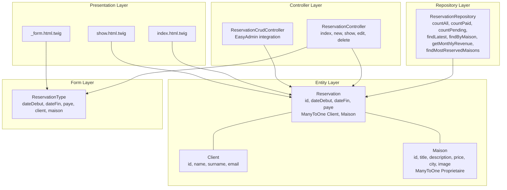
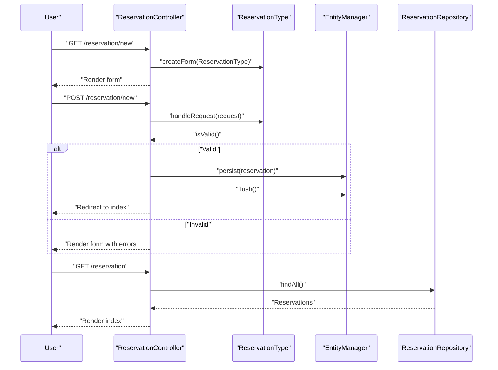
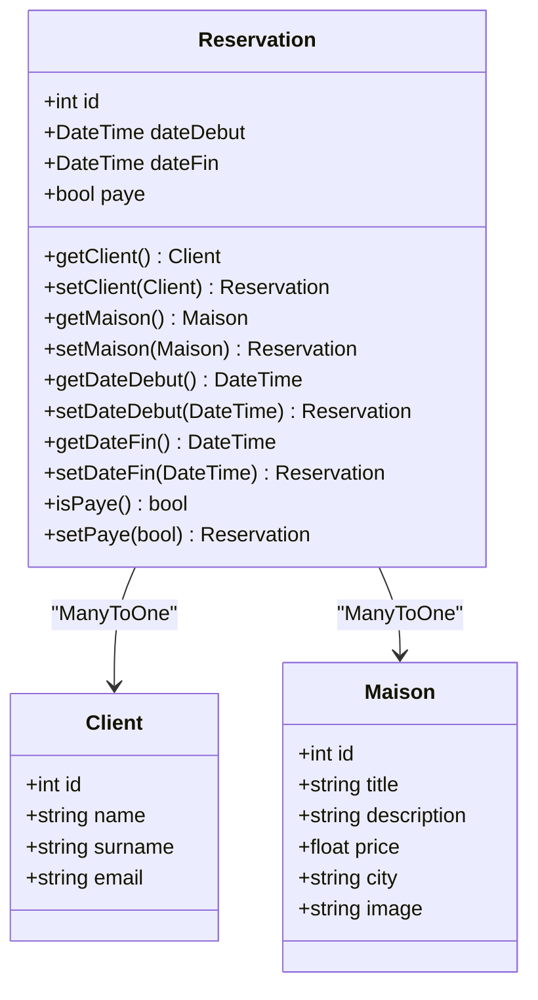
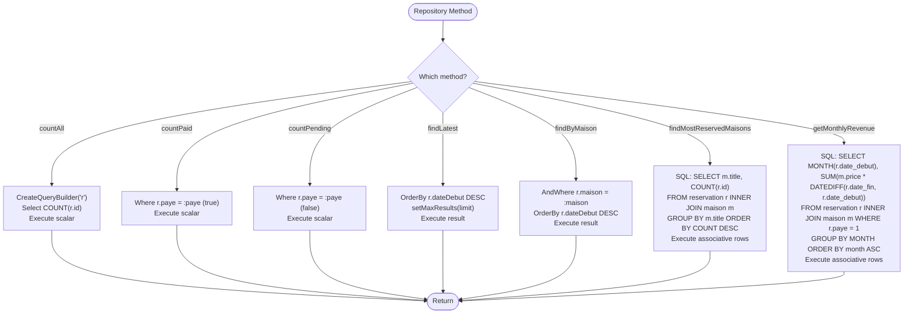
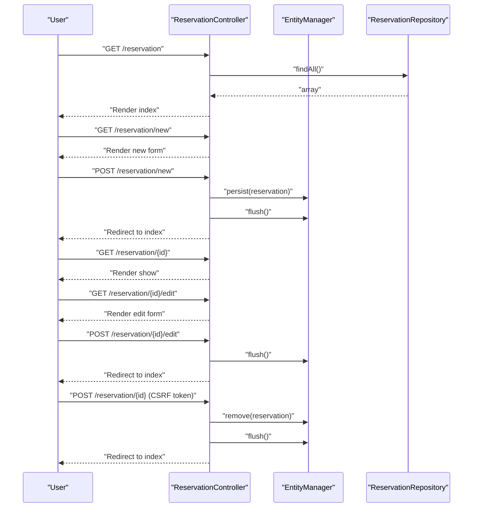
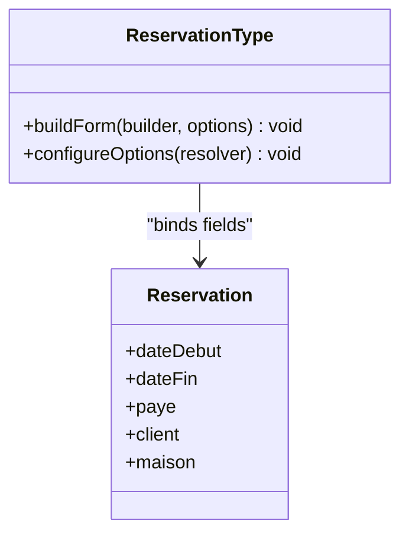
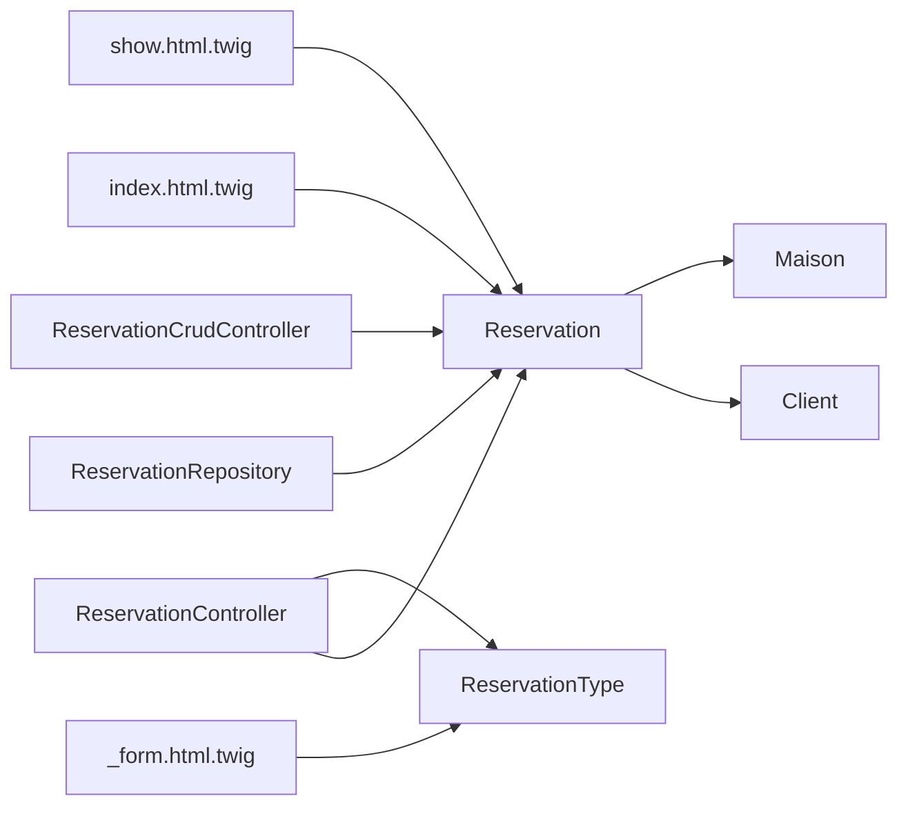

# Reservation Entity and Business Logic

<cite>
**Referenced Files in This Document**
- [Reservation.php](file://src/Entity/Reservation.php)
- [ReservationRepository.php](file://src/Repository/ReservationRepository.php)
- [ReservationController.php](file://src/Controller/ReservationController.php)
- [ReservationType.php](file://src/Form/ReservationType.php)
- [ReservationCrudController.php](file://src/Controller/Admin/ReservationCrudController.php)
- [Client.php](file://src/Entity/Client.php)
- [Maison.php](file://src/Entity/Maison.php)
- [index.html.twig](file://templates/reservation/index.html.twig)
- [_form.html.twig](file://templates/reservation/_form.html.twig)
- [show.html.twig](file://templates/reservation/show.html.twig)
- [dev.log](file://var/log/dev.log)
</cite>

## Table of Contents
1. [Introduction](#introduction)
2. [Project Structure](#project-structure)
3. [Core Components](#core-components)
4. [Architecture Overview](#architecture-overview)
5. [Detailed Component Analysis](#detailed-component-analysis)
6. [Dependency Analysis](#dependency-analysis)
7. [Performance Considerations](#performance-considerations)
8. [Troubleshooting Guide](#troubleshooting-guide)
9. [Conclusion](#conclusion)

## Introduction
This document provides comprehensive coverage of the Reservation entity and its associated business logic. It explains the entity structure, relationships with Client and Maison, date fields, and payment status. It documents Doctrine annotations, getters/setters, and business rule implementations. It details custom repository methods for counting, latest reservations, most reserved properties, monthly revenue, and property-specific queries. It also covers CRUD operations via the ReservationController, form handling, and validation logic. Finally, it includes examples of entity instantiation, relationship management, lifecycle considerations, and data integrity constraints.

## Project Structure
The Reservation feature spans several layers:
- Entity layer: Reservation, Client, Maison
- Repository layer: ReservationRepository
- Controller layer: ReservationController and Admin ReservationCrudController
- Form layer: ReservationType
- Presentation layer: Twig templates for listing, forms, and display

**Diagram sources**
- [Reservation.php:10-99](file://src/Entity/Reservation.php#L10-L99)
- [Client.php:9-70](file://src/Entity/Client.php#L9-L70)
- [Maison.php:10-117](file://src/Entity/Maison.php#L10-L117)
- [ReservationRepository.php:13-92](file://src/Repository/ReservationRepository.php#L13-L92)
- [ReservationController.php:15-81](file://src/Controller/ReservationController.php#L15-L81)
- [ReservationCrudController.php:15-45](file://src/Controller/Admin/ReservationCrudController.php#L15-L45)
- [ReservationType.php:14-49](file://src/Form/ReservationType.php#L14-L49)
- [index.html.twig:5-39](file://templates/reservation/index.html.twig#L5-L39)
- [_form.html.twig:1-36](file://templates/reservation/_form.html.twig#L1-L36)
- [show.html.twig:5-34](file://templates/reservation/show.html.twig#L5-L34)

**Section sources**
- [Reservation.php:10-99](file://src/Entity/Reservation.php#L10-L99)
- [ReservationRepository.php:13-92](file://src/Repository/ReservationRepository.php#L13-L92)
- [ReservationController.php:15-81](file://src/Controller/ReservationController.php#L15-L81)
- [ReservationType.php:14-49](file://src/Form/ReservationType.php#L14-L49)
- [ReservationCrudController.php:15-45](file://src/Controller/Admin/ReservationCrudController.php#L15-L45)
- [Client.php:9-70](file://src/Entity/Client.php#L9-L70)
- [Maison.php:10-117](file://src/Entity/Maison.php#L10-L117)
- [index.html.twig:5-39](file://templates/reservation/index.html.twig#L5-L39)
- [_form.html.twig:1-36](file://templates/reservation/_form.html.twig#L1-L36)
- [show.html.twig:5-34](file://templates/reservation/show.html.twig#L5-L34)

## Core Components
- Reservation entity encapsulates booking details with:
  - Identity: id
  - Dates: dateDebut and dateFin
  - Payment: paye (boolean)
  - Relationships: ManyToOne to Client and Maison
- Repository provides analytics and filtering:
  - Counters for total, paid, pending
  - Latest reservations ordering by dateDebut
  - Monthly revenue computation
  - Most reserved properties aggregation
  - Property-specific queries
- Controllers manage CRUD:
  - Listing, creation, viewing, editing, deletion
  - CSRF protection for deletion
- Forms render and bind data:
  - Date pickers for dateDebut and dateFin
  - Choice widgets for client and maison
  - Boolean toggle for paye

**Section sources**
- [Reservation.php:10-99](file://src/Entity/Reservation.php#L10-L99)
- [ReservationRepository.php:20-91](file://src/Repository/ReservationRepository.php#L20-L91)
- [ReservationController.php:17-80](file://src/Controller/ReservationController.php#L17-L80)
- [ReservationType.php:16-41](file://src/Form/ReservationType.php#L16-L41)

## Architecture Overview
The Reservation feature follows a layered architecture:
- Entities define domain objects and relationships
- Repositories encapsulate data access and analytics
- Controllers orchestrate requests and responses
- Forms handle user input binding
- Templates render views and present data

**Diagram sources**
- [ReservationController.php:25-43](file://src/Controller/ReservationController.php#L25-L43)
- [ReservationType.php:16-41](file://src/Form/ReservationType.php#L16-L41)
- [ReservationRepository.php:18-22](file://src/Repository/ReservationRepository.php#L18-L22)

## Detailed Component Analysis

### Reservation Entity
- Structure and annotations:
  - Identifiable entity mapped to the reservation table
  - ManyToOne to Client and Maison with non-nullable join columns
  - DateDebut and DateFin as DATE columns
  - Paye as boolean flag
- Accessors and mutators:
  - getId/getClient/setClient/getMaison/setMaison
  - getDateDebut/setDateDebut/getDateFin/setDateFin
  - isPaye/setPaye
- Business rule implementations:
  - Payment status is represented by the paye field; repository methods compute counts for paid/pending
  - No explicit runtime business rules are implemented in the entity itself

**Diagram sources**
- [Reservation.php:10-99](file://src/Entity/Reservation.php#L10-L99)
- [Client.php:9-70](file://src/Entity/Client.php#L9-L70)
- [Maison.php:10-117](file://src/Entity/Maison.php#L10-L117)

**Section sources**
- [Reservation.php:10-99](file://src/Entity/Reservation.php#L10-L99)

### ReservationRepository Methods
- Analytics and counters:
  - countAll: total reservation count
  - countPaid: reservations where paye is true
  - countPending: reservations where paye is false
- Ordering and pagination:
  - findLatest(limit): reservations ordered by dateDebut descending
- Aggregation:
  - findMostReservedMaisons: top properties by reservation count
  - getMonthlyRevenue: computed revenue grouped by month for paid reservations
- Filtering:
  - findByMaison(Maison): reservations for a given property, ordered by dateDebut desc

**Diagram sources**
- [ReservationRepository.php:20-91](file://src/Repository/ReservationRepository.php#L20-L91)

**Section sources**
- [ReservationRepository.php:20-91](file://src/Repository/ReservationRepository.php#L20-L91)

### ReservationController CRUD Operations
- Index: GET /reservation lists all reservations
- New: GET/POST /reservation/new handles form submission and persistence
- Show: GET /reservation/{id} displays a reservation
- Edit: GET/POST /reservation/{id}/edit updates persisted data
- Delete: POST /reservation/{id} removes a reservation after CSRF validation

**Diagram sources**
- [ReservationController.php:17-80](file://src/Controller/ReservationController.php#L17-L80)
- [ReservationRepository.php:18-22](file://src/Repository/ReservationRepository.php#L18-L22)

**Section sources**
- [ReservationController.php:17-80](file://src/Controller/ReservationController.php#L17-L80)

### Form Handling and Validation
- ReservationType defines:
  - dateDebut and dateFin as single-text date widgets
  - paye as a boolean toggle
  - client and maison as choice widgets bound to their respective entities
- Validation:
  - The framework’s auto-mapping support infers constraints from Doctrine metadata
  - No explicit Assert annotations are present in the Reservation entity; validation relies on entity constraints and form bindings

**Diagram sources**
- [ReservationType.php:14-49](file://src/Form/ReservationType.php#L14-L49)
- [Reservation.php:10-99](file://src/Entity/Reservation.php#L10-L99)

**Section sources**
- [ReservationType.php:16-41](file://src/Form/ReservationType.php#L16-L41)

### Presentation Layer
- index.html.twig renders a table of reservations with date, property title, client name/surname, and payment status
- show.html.twig displays reservation details including id, dates, and payment status
- _form.html.twig renders the form with labeled inputs for client, maison, dateDebut, dateFin, and submit button

**Section sources**
- [index.html.twig:5-39](file://templates/reservation/index.html.twig#L5-L39)
- [show.html.twig:5-34](file://templates/reservation/show.html.twig#L5-L34)
- [_form.html.twig:1-36](file://templates/reservation/_form.html.twig#L1-L36)

### Admin Integration
- ReservationCrudController integrates with EasyAdmin to:
  - List reservations with fields: id, client, maison, dateDebut, dateFin, paye
  - Configure paginator page size and range
  - Add detail action to index

**Section sources**
- [ReservationCrudController.php:22-45](file://src/Controller/Admin/ReservationCrudController.php#L22-L45)

## Dependency Analysis
- Entity dependencies:
  - Reservation depends on Client and Maison via ManyToOne associations
- Repository dependencies:
  - ReservationRepository extends ServiceEntityRepository for Reservation
  - Uses Doctrine DBAL for raw SQL aggregations
- Controller dependencies:
  - ReservationController depends on ReservationType, ReservationRepository, and EntityManagerInterface
- Form dependencies:
  - ReservationType depends on Client and Maison entities for choice rendering

**Diagram sources**
- [Reservation.php:17-23](file://src/Entity/Reservation.php#L17-L23)
- [ReservationRepository.php:13-18](file://src/Repository/ReservationRepository.php#L13-L18)
- [ReservationController.php:15-12](file://src/Controller/ReservationController.php#L15-L12)
- [ReservationType.php:14-12](file://src/Form/ReservationType.php#L14-L12)
- [ReservationCrudController.php:15-20](file://src/Controller/Admin/ReservationCrudController.php#L15-L20)
- [index.html.twig:19-24](file://templates/reservation/index.html.twig#L19-L24)
- [show.html.twig:10-25](file://templates/reservation/show.html.twig#L10-L25)
- [_form.html.twig:3-39](file://templates/reservation/_form.html.twig#L3-L39)

**Section sources**
- [Reservation.php:17-23](file://src/Entity/Reservation.php#L17-L23)
- [ReservationRepository.php:13-18](file://src/Repository/ReservationRepository.php#L13-L18)
- [ReservationController.php:15-12](file://src/Controller/ReservationController.php#L15-L12)
- [ReservationType.php:14-12](file://src/Form/ReservationType.php#L14-L12)
- [ReservationCrudController.php:15-20](file://src/Controller/Admin/ReservationCrudController.php#L15-L20)
- [index.html.twig:19-24](file://templates/reservation/index.html.twig#L19-L24)
- [show.html.twig:10-25](file://templates/reservation/show.html.twig#L10-L25)
- [_form.html.twig:3-39](file://templates/reservation/_form.html.twig#L3-L39)

## Performance Considerations
- Prefer repository methods for analytics to leverage optimized queries and indexing
- Use findLatest with appropriate limit to avoid heavy result sets
- Monthly revenue and most reserved properties queries use raw SQL; ensure proper indexing on date and foreign keys
- Consider caching strategies for frequently accessed counts and latest reservations

## Troubleshooting Guide
- Entity lifecycle and cascading:
  - The Reservation entity does not declare cascade operations; persist/remove must be managed explicitly via the controller
- Data integrity constraints:
  - Client and Maison relationships are non-nullable; ensure valid entities are selected in forms
  - Date fields must be valid dates; the form widget enforces single-text input
- Payment status:
  - paye is a boolean flag; repository methods rely on this field for counts and revenue calculations
- Database schema:
  - Historical logs show column name transitions from "valide" to "paye"; ensure migrations are applied and current schema reflects "paye"

**Section sources**
- [Reservation.php:17-32](file://src/Entity/Reservation.php#L17-L32)
- [dev.log:318](file://var/log/dev.log#L318)

## Conclusion
The Reservation feature is a cohesive, layered implementation centered around the Reservation entity and its relationships with Client and Maison. The ReservationRepository provides essential analytics and filtering capabilities, while the ReservationController and ReservationType deliver robust CRUD and form handling. The presentation layer renders meaningful views for listing, creating, editing, and displaying reservations. Adhering to the established patterns ensures maintainable and extensible business logic aligned with Symfony and Doctrine best practices.