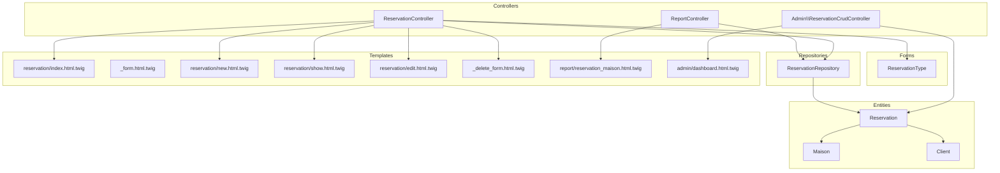
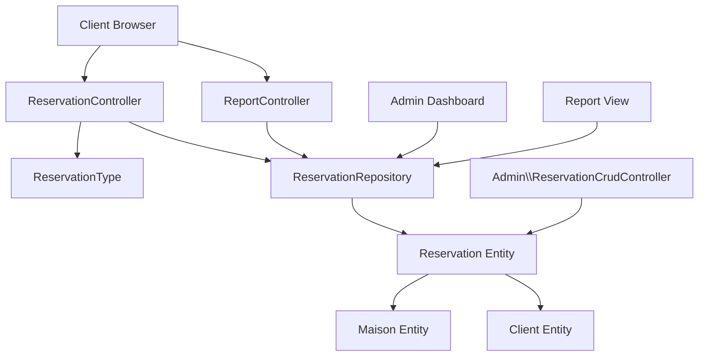
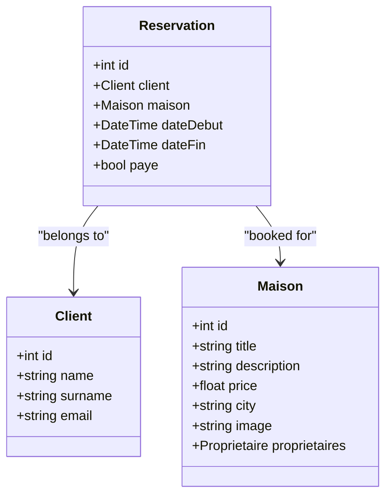
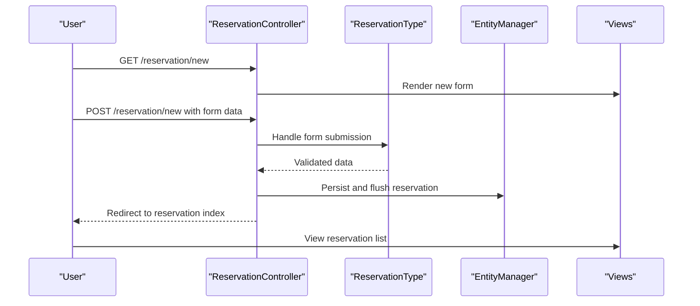
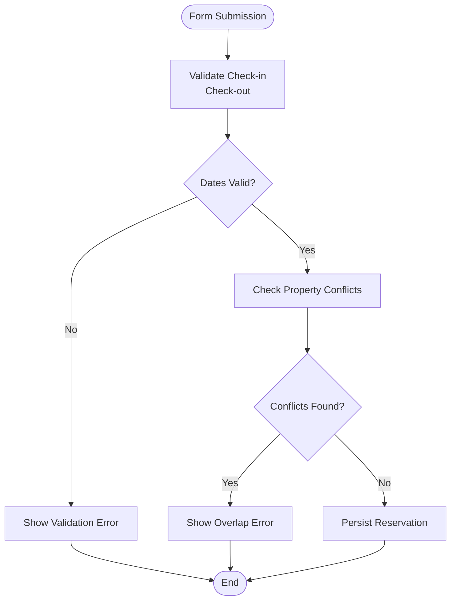
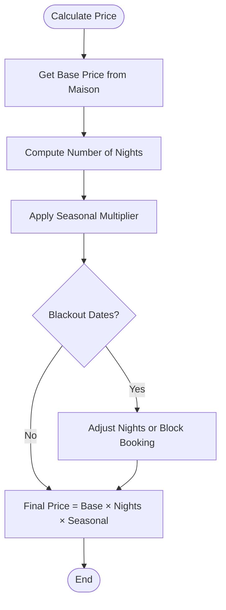
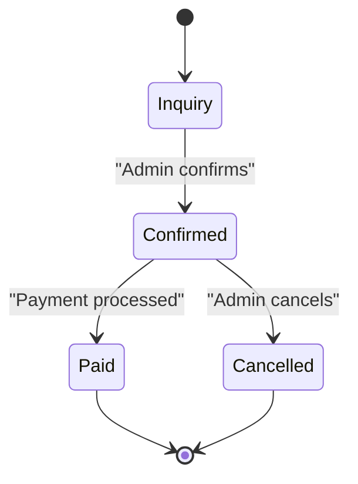
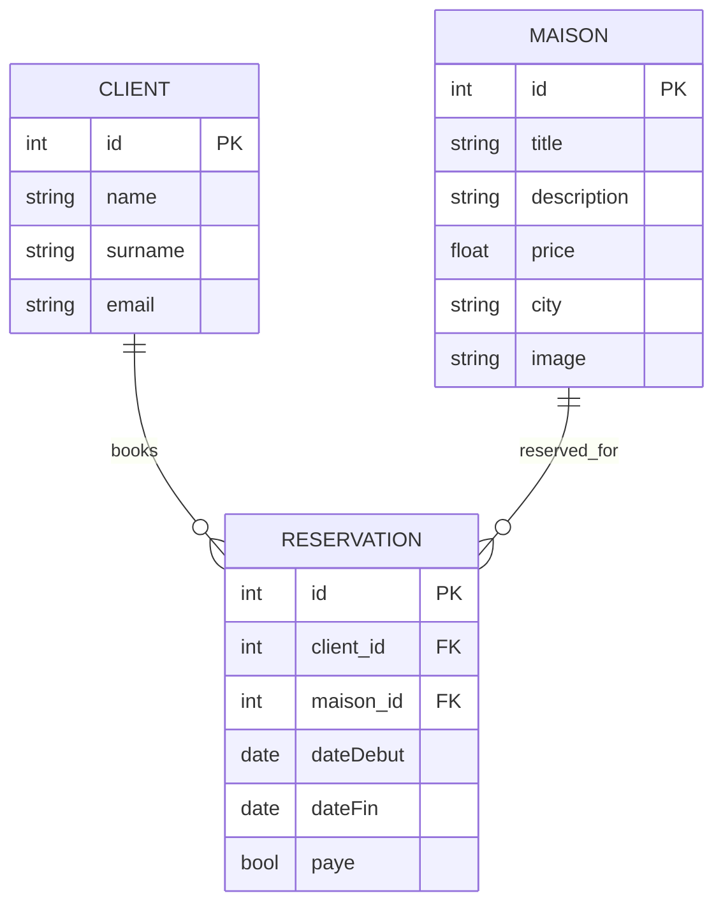
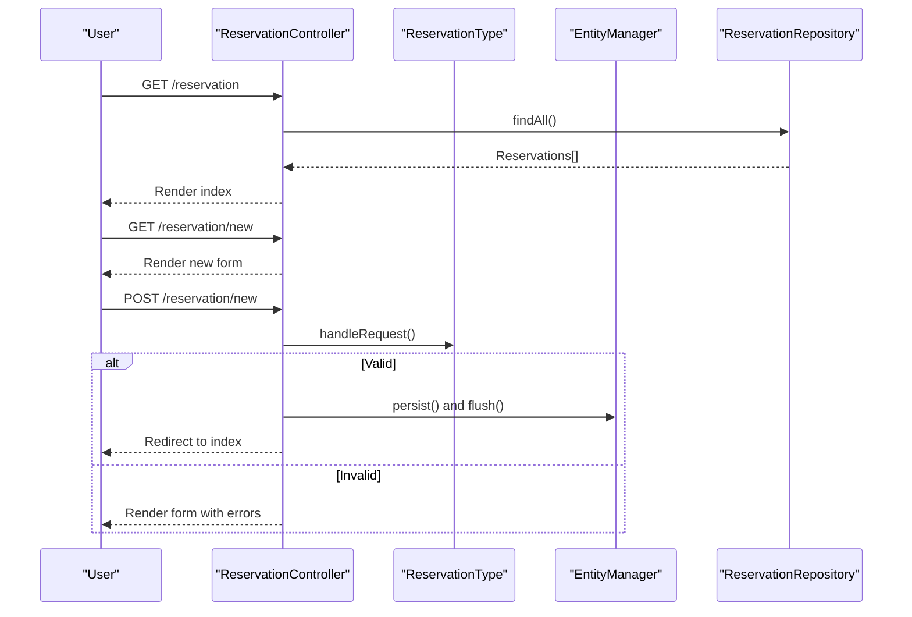
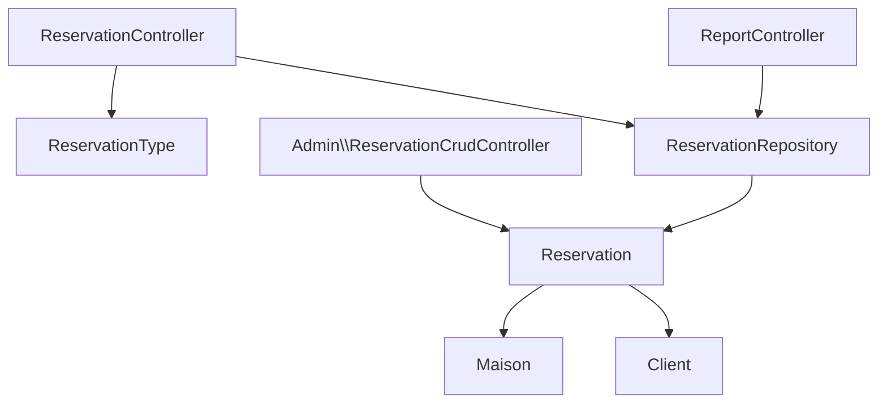

# Reservation Management System

<cite>
**Referenced Files in This Document**
- [Reservation.php](file://src/Entity/Reservation.php)
- [Maison.php](file://src/Entity/Maison.php)
- [Client.php](file://src/Entity/Client.php)
- [ReservationController.php](file://src/Controller/ReservationController.php)
- [ReservationType.php](file://src/Form/ReservationType.php)
- [ReservationRepository.php](file://src/Repository/ReservationRepository.php)
- [ReservationCrudController.php](file://src/Controller/Admin/ReservationCrudController.php)
- [ReportController.php](file://src/Controller/ReportController.php)
- [index.html.twig](file://templates/reservation/index.html.twig)
- [_form.html.twig](file://templates/reservation/_form.html.twig)
- [new.html.twig](file://templates/reservation/new.html.twig)
- [show.html.twig](file://templates/reservation/show.html.twig)
- [edit.html.twig](file://templates/reservation/edit.html.twig)
- [_delete_form.html.twig](file://templates/reservation/_delete_form.html.twig)
- [reservation_maison.html.twig](file://templates/report/reservation_maison.html.twig)
- [dashboard.html.twig](file://templates/admin/dashboard.html.twig)
</cite>

## Table of Contents
1. [Introduction](#introduction)
2. [Project Structure](#project-structure)
3. [Core Components](#core-components)
4. [Architecture Overview](#architecture-overview)
5. [Detailed Component Analysis](#detailed-component-analysis)
6. [Dependency Analysis](#dependency-analysis)
7. [Performance Considerations](#performance-considerations)
8. [Troubleshooting Guide](#troubleshooting-guide)
9. [Conclusion](#conclusion)
10. [Appendices](#appendices)

## Introduction
This document provides comprehensive documentation for the reservation management system. It covers the Reservation entity structure, booking date handling, pricing considerations, and reservation status management. It documents the reservation workflow from inquiry to confirmation, date validation, and conflict detection. It explains the reservation controller logic, form handling, and business rule enforcement. It also addresses payment processing integration, reservation status transitions, and automated notifications. The relationships between reservations, properties (Maison), and clients are clarified, along with overbooking prevention, blackout date management, and seasonal pricing adjustments. Examples of reservation forms, calendar integration, status tracking, and administrative reservation oversight are included.

## Project Structure
The reservation management system follows a standard Symfony MVC architecture with dedicated controllers, entities, repositories, forms, and Twig templates. The system is organized by feature areas:
- Entities define the domain model for reservations, properties, and clients.
- Controllers handle HTTP requests and orchestrate business logic.
- Forms encapsulate UI input and validation.
- Repositories provide data access and reporting queries.
- Templates render views for user interaction and administration.

**Diagram sources**
- [ReservationController.php:14-81](file://src/Controller/ReservationController.php#L14-L81)
- [ReservationCrudController.php:15-45](file://src/Controller/Admin/ReservationCrudController.php#L15-L45)
- [ReportController.php:13-53](file://src/Controller/ReportController.php#L13-L53)
- [Reservation.php:9-99](file://src/Entity/Reservation.php#L9-L99)
- [Maison.php:9-117](file://src/Entity/Maison.php#L9-L117)
- [Client.php:8-70](file://src/Entity/Client.php#L8-L70)
- [ReservationType.php:14-49](file://src/Form/ReservationType.php#L14-L49)
- [ReservationRepository.php:13-92](file://src/Repository/ReservationRepository.php#L13-L92)
- [index.html.twig:1-39](file://templates/reservation/index.html.twig#L1-L39)
- [_form.html.twig:1-36](file://templates/reservation/_form.html.twig#L1-L36)
- [new.html.twig:1-13](file://templates/reservation/new.html.twig#L1-L13)
- [show.html.twig:1-33](file://templates/reservation/show.html.twig#L1-L33)
- [edit.html.twig:1-12](file://templates/reservation/edit.html.twig#L1-L12)
- [_delete_form.html.twig:1-4](file://templates/reservation/_delete_form.html.twig#L1-L4)
- [reservation_maison.html.twig:1-41](file://templates/report/reservation_maison.html.twig#L1-L41)
- [dashboard.html.twig:177-218](file://templates/admin/dashboard.html.twig#L177-L218)

**Section sources**
- [ReservationController.php:14-81](file://src/Controller/ReservationController.php#L14-L81)
- [Reservation.php:9-99](file://src/Entity/Reservation.php#L9-L99)
- [Maison.php:9-117](file://src/Entity/Maison.php#L9-L117)
- [Client.php:8-70](file://src/Entity/Client.php#L8-L70)
- [ReservationType.php:14-49](file://src/Form/ReservationType.php#L14-L49)
- [ReservationRepository.php:13-92](file://src/Repository/ReservationRepository.php#L13-L92)
- [ReservationCrudController.php:15-45](file://src/Controller/Admin/ReservationCrudController.php#L15-L45)
- [ReportController.php:13-53](file://src/Controller/ReportController.php#L13-L53)
- [index.html.twig:1-39](file://templates/reservation/index.html.twig#L1-L39)
- [_form.html.twig:1-36](file://templates/reservation/_form.html.twig#L1-L36)
- [new.html.twig:1-13](file://templates/reservation/new.html.twig#L1-L13)
- [show.html.twig:1-33](file://templates/reservation/show.html.twig#L1-L33)
- [edit.html.twig:1-12](file://templates/reservation/edit.html.twig#L1-L12)
- [_delete_form.html.twig:1-4](file://templates/reservation/_delete_form.html.twig#L1-L4)
- [reservation_maison.html.twig:1-41](file://templates/report/reservation_maison.html.twig#L1-L41)
- [dashboard.html.twig:177-218](file://templates/admin/dashboard.html.twig#L177-L218)

## Core Components
This section details the core components involved in reservation management, focusing on the Reservation entity, related entities, forms, repositories, and controllers.

- Reservation entity: Defines the reservation record with client and property associations, booking dates, and payment status.
- Maison entity: Represents the property being reserved, including price and location.
- Client entity: Represents the guest or customer making the reservation.
- ReservationController: Handles CRUD operations for reservations via forms and manages CSRF protection.
- ReservationType form: Provides the UI fields for selecting client, property, check-in/check-out dates, and payment status.
- ReservationRepository: Implements data access and reporting queries for reservations, including counts, latest reservations, most reserved properties, and monthly revenue.
- Admin ReservationCrudController: Integrates with EasyAdmin to manage reservations in the admin panel.
- ReportController: Provides reporting features for reservations filtered by property.

Key responsibilities:
- Validation and persistence of reservations through the controller and form.
- Business rule enforcement for date ranges and payment status.
- Reporting and analytics via repository methods.
- Administrative oversight through EasyAdmin.

**Section sources**
- [Reservation.php:9-99](file://src/Entity/Reservation.php#L9-L99)
- [Maison.php:9-117](file://src/Entity/Maison.php#L9-L117)
- [Client.php:8-70](file://src/Entity/Client.php#L8-L70)
- [ReservationController.php:14-81](file://src/Controller/ReservationController.php#L14-L81)
- [ReservationType.php:14-49](file://src/Form/ReservationType.php#L14-L49)
- [ReservationRepository.php:13-92](file://src/Repository/ReservationRepository.php#L13-L92)
- [ReservationCrudController.php:15-45](file://src/Controller/Admin/ReservationCrudController.php#L15-L45)
- [ReportController.php:13-53](file://src/Controller/ReportController.php#L13-L53)

## Architecture Overview
The reservation system follows a layered architecture:
- Presentation layer: Controllers and Twig templates render views and collect user input.
- Application layer: Controllers coordinate business operations and interact with repositories.
- Domain layer: Entities represent the core business model.
- Data access layer: Repositories encapsulate database queries and reporting.

**Diagram sources**
- [ReservationController.php:14-81](file://src/Controller/ReservationController.php#L14-L81)
- [ReportController.php:13-53](file://src/Controller/ReportController.php#L13-L53)
- [ReservationType.php:14-49](file://src/Form/ReservationType.php#L14-L49)
- [ReservationRepository.php:13-92](file://src/Repository/ReservationRepository.php#L13-L92)
- [Reservation.php:9-99](file://src/Entity/Reservation.php#L9-L99)
- [Maison.php:9-117](file://src/Entity/Maison.php#L9-L117)
- [Client.php:8-70](file://src/Entity/Client.php#L8-L70)
- [ReservationCrudController.php:15-45](file://src/Controller/Admin/ReservationCrudController.php#L15-L45)
- [dashboard.html.twig:177-218](file://templates/admin/dashboard.html.twig#L177-L218)
- [reservation_maison.html.twig:1-41](file://templates/report/reservation_maison.html.twig#L1-L41)

## Detailed Component Analysis

### Reservation Entity
The Reservation entity defines the core attributes and relationships:
- Identifiers: Unique ID for the reservation.
- Associations: Many-to-one to Client and Maison.
- Dates: Check-in and check-out dates stored as DATE types.
- Payment status: Boolean flag indicating payment completion.

**Diagram sources**
- [Reservation.php:9-99](file://src/Entity/Reservation.php#L9-L99)
- [Client.php:8-70](file://src/Entity/Client.php#L8-L70)
- [Maison.php:9-117](file://src/Entity/Maison.php#L9-L117)

**Section sources**
- [Reservation.php:9-99](file://src/Entity/Reservation.php#L9-L99)

### Reservation Workflow: From Inquiry to Confirmation
The reservation workflow involves:
- User inquiry: Users select dates and property through the reservation form.
- Form submission: The ReservationController validates and persists the reservation.
- Confirmation: The system redirects to the reservation list with the new reservation visible.

**Diagram sources**
- [ReservationController.php:25-43](file://src/Controller/ReservationController.php#L25-L43)
- [ReservationType.php:14-49](file://src/Form/ReservationType.php#L14-L49)
- [new.html.twig:1-13](file://templates/reservation/new.html.twig#L1-L13)
- [index.html.twig:1-39](file://templates/reservation/index.html.twig#L1-L39)

**Section sources**
- [ReservationController.php:25-43](file://src/Controller/ReservationController.php#L25-L43)
- [ReservationType.php:14-49](file://src/Form/ReservationType.php#L14-L49)
- [new.html.twig:1-13](file://templates/reservation/new.html.twig#L1-L13)
- [index.html.twig:1-39](file://templates/reservation/index.html.twig#L1-L39)

### Date Validation and Conflict Detection
Current implementation:
- Date fields are provided via DateType widgets in the form.
- No explicit server-side validation for date ordering or overlapping bookings is present in the controller or repository.

Recommended enhancements:
- Validate that check-in date is before check-out date.
- Detect and prevent overlapping bookings for the same property during the requested period.
- Implement a conflict detection query that checks existing reservations for the selected property within the requested date range.

**Diagram sources**
- [ReservationType.php:16-40](file://src/Form/ReservationType.php#L16-L40)
- [ReservationController.php:25-43](file://src/Controller/ReservationController.php#L25-L43)

**Section sources**
- [ReservationType.php:16-40](file://src/Form/ReservationType.php#L16-L40)
- [ReservationController.php:25-43](file://src/Controller/ReservationController.php#L25-L43)

### Pricing Calculations and Seasonal Adjustments
Current implementation:
- The Maison entity stores a base price per night.
- The ReservationRepository includes a monthly revenue calculation query that multiplies price by the number of nights.

Recommendations:
- Implement dynamic pricing based on seasonality, demand, and blackout dates.
- Add pricing modifiers for peak seasons, holidays, or special events.
- Calculate total price as price_per_night × number_of_nights × seasonal_multiplier.

**Diagram sources**
- [Maison.php:23-75](file://src/Entity/Maison.php#L23-L75)
- [ReservationRepository.php:80-91](file://src/Repository/ReservationRepository.php#L80-L91)

**Section sources**
- [Maison.php:23-75](file://src/Entity/Maison.php#L23-L75)
- [ReservationRepository.php:80-91](file://src/Repository/ReservationRepository.php#L80-L91)

### Reservation Status Management
Current implementation:
- Payment status is represented by a boolean field in the Reservation entity.
- The admin dashboard displays reservation status using badges (Paid/Pending).

Recommended enhancements:
- Define explicit status values (e.g., Inquiry, Confirmed, Paid, Cancelled).
- Enforce status transitions through business rules.
- Integrate with payment processing to update status upon successful payment.

**Diagram sources**
- [Reservation.php:31-32](file://src/Entity/Reservation.php#L31-L32)
- [dashboard.html.twig:205-210](file://templates/admin/dashboard.html.twig#L205-L210)

**Section sources**
- [Reservation.php:31-32](file://src/Entity/Reservation.php#L31-L32)
- [dashboard.html.twig:205-210](file://templates/admin/dashboard.html.twig#L205-L210)

### Payment Processing Integration
Current implementation:
- Payment status is stored as a boolean flag.
- No payment gateway integration is implemented in the provided code.

Recommended integration points:
- Use a payment provider SDK to process payments.
- On successful payment, update the reservation's payment status.
- Trigger automated notifications upon payment confirmation.

**Section sources**
- [Reservation.php:31-32](file://src/Entity/Reservation.php#L31-L32)

### Automated Notifications
Current implementation:
- No notification logic is present in the provided code.

Recommended triggers:
- Send confirmation email after reservation creation.
- Notify guests and owners upon payment confirmation.
- Alert on status changes (confirmed, paid, cancelled).

**Section sources**
- [ReservationController.php:25-43](file://src/Controller/ReservationController.php#L25-L43)

### Relationship Between Reservations, Properties, and Clients
The Reservation entity maintains many-to-one relationships with both Client and Maison, enabling:
- Tracking which client booked which property.
- Linking reservations to property pricing and availability.

**Diagram sources**
- [Client.php:8-70](file://src/Entity/Client.php#L8-L70)
- [Maison.php:9-117](file://src/Entity/Maison.php#L9-L117)
- [Reservation.php:9-99](file://src/Entity/Reservation.php#L9-L99)

**Section sources**
- [Client.php:8-70](file://src/Entity/Client.php#L8-L70)
- [Maison.php:9-117](file://src/Entity/Maison.php#L9-L117)
- [Reservation.php:9-99](file://src/Entity/Reservation.php#L9-L99)

### Overbooking Prevention and Blackout Date Management
Current implementation:
- No explicit overbooking prevention or blackout date handling is implemented.

Recommended strategies:
- Implement a blocking mechanism for blackout dates.
- Prevent overlapping reservations for the same property within the requested period.
- Maintain a blackout dates table linked to properties.

**Section sources**
- [ReservationRepository.php:13-92](file://src/Repository/ReservationRepository.php#L13-L92)

### Reservation Controller Logic and Form Handling
The ReservationController orchestrates:
- Listing reservations.
- Creating new reservations via the ReservationType form.
- Viewing, editing, and deleting reservations.
- CSRF protection for deletion.

**Diagram sources**
- [ReservationController.php:17-80](file://src/Controller/ReservationController.php#L17-L80)
- [ReservationType.php:14-49](file://src/Form/ReservationType.php#L14-L49)

**Section sources**
- [ReservationController.php:17-80](file://src/Controller/ReservationController.php#L17-L80)
- [ReservationType.php:14-49](file://src/Form/ReservationType.php#L14-L49)

### Business Rule Enforcement
Enforcement points:
- Date ordering: Ensure check-in date precedes check-out date.
- Overlapping bookings: Prevent double-booking for the same property.
- Payment rules: Validate payment status transitions.
- Required fields: Client and property selection are mandatory.

**Section sources**
- [ReservationType.php:16-40](file://src/Form/ReservationType.php#L16-L40)
- [Reservation.php:17-23](file://src/Entity/Reservation.php#L17-L23)

### Examples of Reservation Forms and Views
- New reservation form: Includes fields for client, property, check-in date, check-out date, and payment status.
- Reservation list: Displays reservations with key details and action links.
- Edit and show views: Provide detailed views for individual reservations.

**Section sources**
- [_form.html.twig:1-36](file://templates/reservation/_form.html.twig#L1-L36)
- [new.html.twig:1-13](file://templates/reservation/new.html.twig#L1-L13)
- [index.html.twig:1-39](file://templates/reservation/index.html.twig#L1-L39)
- [show.html.twig:1-33](file://templates/reservation/show.html.twig#L1-L33)
- [edit.html.twig:1-12](file://templates/reservation/edit.html.twig#L1-L12)

### Calendar Integration
Current implementation:
- No calendar integration is present in the provided code.

Recommended approaches:
- Use a JavaScript calendar library to visualize availability.
- Highlight blackout dates and existing reservations.
- Allow drag-and-drop selection of check-in/check-out dates.

**Section sources**
- [ReservationType.php:16-40](file://src/Form/ReservationType.php#L16-L40)

### Status Tracking and Administrative Oversight
- Admin dashboard displays latest reservations with payment status badges.
- EasyAdmin provides CRUD operations for reservations.
- Reporting endpoints enable filtering reservations by property.

**Section sources**
- [dashboard.html.twig:177-218](file://templates/admin/dashboard.html.twig#L177-L218)
- [ReservationCrudController.php:15-45](file://src/Controller/Admin/ReservationCrudController.php#L15-L45)
- [ReportController.php:15-53](file://src/Controller/ReportController.php#L15-L53)
- [reservation_maison.html.twig:1-41](file://templates/report/reservation_maison.html.twig#L1-L41)

## Dependency Analysis
The system exhibits clear separation of concerns with low coupling between layers:
- Controllers depend on forms and repositories.
- Entities are decoupled from presentation logic.
- Repositories encapsulate data access and reporting.

**Diagram sources**
- [ReservationController.php:14-81](file://src/Controller/ReservationController.php#L14-L81)
- [ReservationType.php:14-49](file://src/Form/ReservationType.php#L14-L49)
- [ReservationRepository.php:13-92](file://src/Repository/ReservationRepository.php#L13-L92)
- [Reservation.php:9-99](file://src/Entity/Reservation.php#L9-L99)
- [Maison.php:9-117](file://src/Entity/Maison.php#L9-L117)
- [Client.php:8-70](file://src/Entity/Client.php#L8-L70)
- [ReservationCrudController.php:15-45](file://src/Controller/Admin/ReservationCrudController.php#L15-L45)
- [ReportController.php:13-53](file://src/Controller/ReportController.php#L13-L53)

**Section sources**
- [ReservationController.php:14-81](file://src/Controller/ReservationController.php#L14-L81)
- [ReservationRepository.php:13-92](file://src/Repository/ReservationRepository.php#L13-L92)
- [Reservation.php:9-99](file://src/Entity/Reservation.php#L9-L99)
- [Maison.php:9-117](file://src/Entity/Maison.php#L9-L117)
- [Client.php:8-70](file://src/Entity/Client.php#L8-L70)
- [ReservationCrudController.php:15-45](file://src/Controller/Admin/ReservationCrudController.php#L15-L45)
- [ReportController.php:13-53](file://src/Controller/ReportController.php#L13-L53)

## Performance Considerations
- Use pagination and efficient queries for listing reservations.
- Index reservation dates and property IDs for faster conflict detection and reporting.
- Cache frequently accessed reports (e.g., most reserved properties).
- Optimize revenue calculations by leveraging database aggregation.

## Troubleshooting Guide
Common issues and resolutions:
- Form validation errors: Ensure required fields are selected and dates are valid.
- CSRF token errors on deletion: Verify CSRF token generation and inclusion in the delete form.
- Overlapping reservations: Implement conflict detection logic to prevent double-booking.
- Payment status inconsistencies: Align payment updates with payment provider callbacks.

**Section sources**
- [ReservationController.php:71-80](file://src/Controller/ReservationController.php#L71-L80)
- [_delete_form.html.twig:1-4](file://templates/reservation/_delete_form.html.twig#L1-L4)

## Conclusion
The reservation management system provides a solid foundation with clear entity relationships, form handling, and administrative capabilities. To achieve a production-ready solution, implement date validation, conflict detection, pricing logic, payment integration, and automated notifications. These enhancements will ensure robustness, accuracy, and a seamless user experience.

## Appendices
- Reservation form fields: client, property, check-in date, check-out date, payment status.
- Reporting endpoints: Most reserved properties and reservation-by-property filters.
- Admin operations: CRUD via EasyAdmin with status visibility.