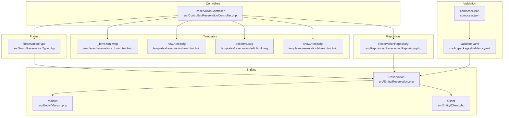
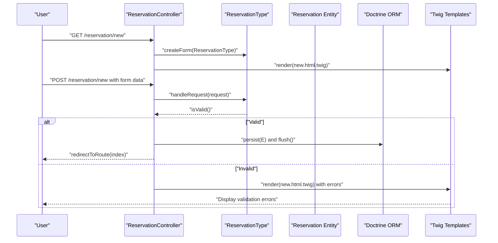
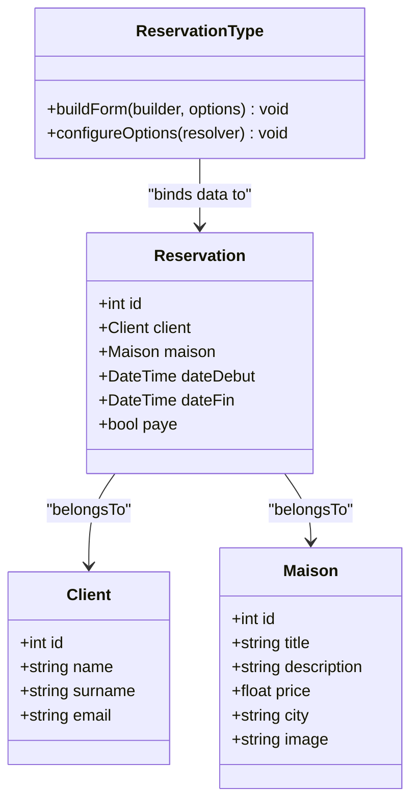
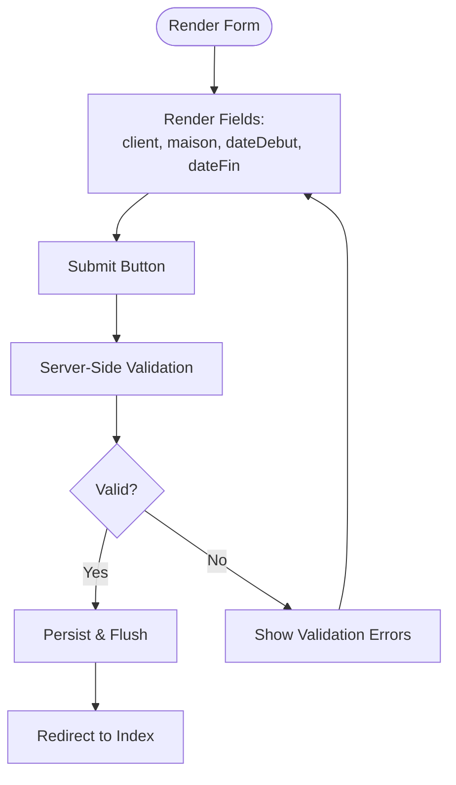
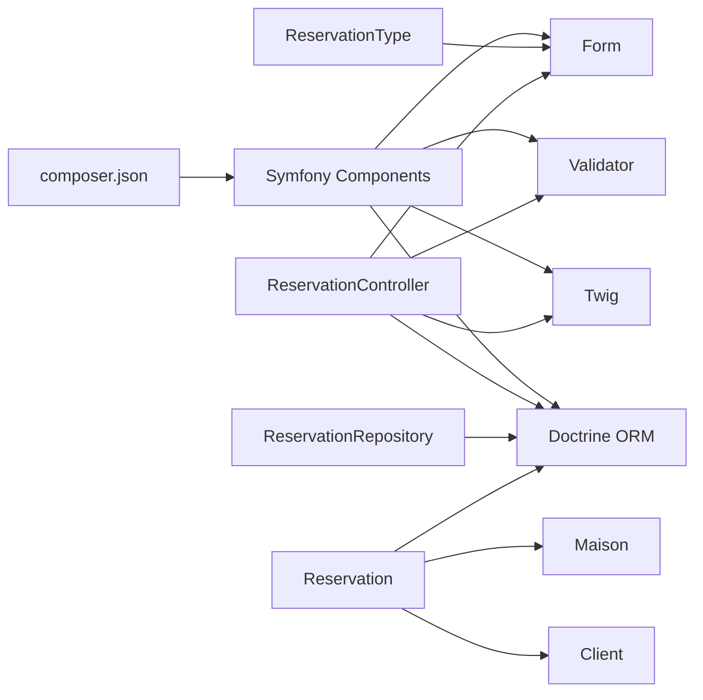

# Reservation Workflow and Validation

<cite>
**Referenced Files in This Document**
- [ReservationType.php](file://src/Form/ReservationType.php)
- [Reservation.php](file://src/Entity/Reservation.php)
- [ReservationController.php](file://src/Controller/ReservationController.php)
- [_form.html.twig](file://templates/reservation/_form.html.twig)
- [new.html.twig](file://templates/reservation/new.html.twig)
- [edit.html.twig](file://templates/reservation/edit.html.twig)
- [show.html.twig](file://templates/reservation/show.html.twig)
- [ReservationRepository.php](file://src/Repository/ReservationRepository.php)
- [validator.yaml](file://config/packages/validator.yaml)
- [composer.json](file://composer.json)
- [Maison.php](file://src/Entity/Maison.php)
- [Client.php](file://src/Entity/Client.php)
</cite>

## Table of Contents
1. [Introduction](#introduction)
2. [Project Structure](#project-structure)
3. [Core Components](#core-components)
4. [Architecture Overview](#architecture-overview)
5. [Detailed Component Analysis](#detailed-component-analysis)
6. [Dependency Analysis](#dependency-analysis)
7. [Performance Considerations](#performance-considerations)
8. [Troubleshooting Guide](#troubleshooting-guide)
9. [Conclusion](#conclusion)

## Introduction
This document explains the reservation workflow and validation system in the application. It covers how the reservation form is constructed, how validation constraints are applied, and how user input is processed. It documents the ReservationType form class, field validation rules, and error handling. It also explains the reservation workflow from initial inquiry through booking confirmation, including date validation, conflict detection, and availability checks. Examples of form rendering, validation error display, and user feedback mechanisms are included. Business rule validation, date range validation, and overbooking prevention logic are addressed along with the integration between forms, validation, and the reservation entity persistence.

## Project Structure
The reservation system spans several layers:
- Forms: The ReservationType form defines the fields exposed to users.
- Entities: Reservation, Maison, and Client define the data model and relationships.
- Controllers: ReservationController orchestrates form handling, validation, persistence, and navigation.
- Templates: Twig templates render the form and present results.
- Repository: ReservationRepository provides queries for reporting and listing.
- Validation: Symfony Validator integrates with Doctrine metadata and configuration.

**Diagram sources**
- [ReservationType.php:14-49](file://src/Form/ReservationType.php#L14-L49)
- [Reservation.php:10-99](file://src/Entity/Reservation.php#L10-L99)
- [Maison.php:10-117](file://src/Entity/Maison.php#L10-L117)
- [Client.php:9-70](file://src/Entity/Client.php#L9-L70)
- [ReservationController.php:15-81](file://src/Controller/ReservationController.php#L15-L81)
- [_form.html.twig:1-36](file://templates/reservation/_form.html.twig#L1-L36)
- [new.html.twig:1-14](file://templates/reservation/new.html.twig#L1-L14)
- [edit.html.twig:1-13](file://templates/reservation/edit.html.twig#L1-L13)
- [show.html.twig:1-34](file://templates/reservation/show.html.twig#L1-L34)
- [ReservationRepository.php:13-92](file://src/Repository/ReservationRepository.php#L13-L92)
- [validator.yaml:1-12](file://config/packages/validator.yaml#L1-L12)
- [composer.json:44-44](file://composer.json#L44-L44)

**Section sources**
- [ReservationType.php:14-49](file://src/Form/ReservationType.php#L14-L49)
- [Reservation.php:10-99](file://src/Entity/Reservation.php#L10-L99)
- [ReservationController.php:15-81](file://src/Controller/ReservationController.php#L15-L81)
- [_form.html.twig:1-36](file://templates/reservation/_form.html.twig#L1-L36)
- [new.html.twig:1-14](file://templates/reservation/new.html.twig#L1-L14)
- [edit.html.twig:1-13](file://templates/reservation/edit.html.twig#L1-L13)
- [show.html.twig:1-34](file://templates/reservation/show.html.twig#L1-L34)
- [ReservationRepository.php:13-92](file://src/Repository/ReservationRepository.php#L13-L92)
- [validator.yaml:1-12](file://config/packages/validator.yaml#L1-L12)
- [composer.json:44-44](file://composer.json#L44-L44)

## Core Components
- ReservationType form class: Defines the reservation form fields, including date range and foreign keys to Maison and Client. It sets the data class to Reservation.
- Reservation entity: Holds reservation attributes, relationships to Maison and Client, and getters/setters for date range and payment status.
- ReservationController: Handles GET/POST requests for listing, creating, editing, viewing, and deleting reservations. It processes form submission, validation, and persistence.
- Twig templates: Render the form and provide user feedback. The form template includes labels and widgets for each field.
- ReservationRepository: Provides reporting queries and listing helpers for reservations.
- Validation configuration: Symfony Validator is configured via validator.yaml and composer.json.

Key responsibilities:
- Form construction and rendering
- Input validation and error propagation
- Persistence and navigation after successful submission
- Reporting and listing of reservations

**Section sources**
- [ReservationType.php:14-49](file://src/Form/ReservationType.php#L14-L49)
- [Reservation.php:10-99](file://src/Entity/Reservation.php#L10-L99)
- [ReservationController.php:15-81](file://src/Controller/ReservationController.php#L15-L81)
- [_form.html.twig:1-36](file://templates/reservation/_form.html.twig#L1-L36)
- [ReservationRepository.php:13-92](file://src/Repository/ReservationRepository.php#L13-L92)
- [validator.yaml:1-12](file://config/packages/validator.yaml#L1-L12)
- [composer.json:44-44](file://composer.json#L44-L44)

## Architecture Overview
The reservation workflow follows a standard MVC pattern with Symfony Form and Validator integrated with Doctrine ORM.

**Diagram sources**
- [ReservationController.php:25-43](file://src/Controller/ReservationController.php#L25-L43)
- [ReservationType.php:14-49](file://src/Form/ReservationType.php#L14-L49)
- [new.html.twig:1-14](file://templates/reservation/new.html.twig#L1-L14)
- [_form.html.twig:1-36](file://templates/reservation/_form.html.twig#L1-L36)

## Detailed Component Analysis

### ReservationType Form Class
The ReservationType form class builds the reservation form with:
- dateDebut: DateType widget configured for single-line input.
- dateFin: DateType widget configured for single-line input.
- paye: Boolean checkbox.
- client: EntityType for selecting a Client by ID.
- maison: EntityType for selecting a Maison by ID.

It sets the data class to Reservation so bound data maps to the entity.

**Diagram sources**
- [ReservationType.php:14-49](file://src/Form/ReservationType.php#L14-L49)
- [Reservation.php:10-99](file://src/Entity/Reservation.php#L10-L99)
- [Client.php:9-70](file://src/Entity/Client.php#L9-L70)
- [Maison.php:10-117](file://src/Entity/Maison.php#L10-L117)

**Section sources**
- [ReservationType.php:14-49](file://src/Form/ReservationType.php#L14-L49)

### Reservation Entity
The Reservation entity defines:
- Relationships: ManyToOne to Client and Maison.
- Date fields: dateDebut and dateFin as DATE_MUTABLE.
- Payment flag: paye as boolean.
- Getters and setters for all attributes.

Constraints and validation:
- The form enforces non-null selection for client and maison.
- Date fields are validated by the DateType widget and Symfony Validator.
- No explicit validation annotations are present in the entity; validation relies on form constraints and Doctrine metadata.

**Section sources**
- [Reservation.php:10-99](file://src/Entity/Reservation.php#L10-L99)

### ReservationController Workflow
The controller manages CRUD operations:
- Index: Lists all reservations.
- New: Creates a new reservation form, handles submission, validates, persists, and redirects.
- Show: Displays a single reservation.
- Edit: Edits an existing reservation with form handling and validation.
- Delete: Removes a reservation with CSRF protection.

Form handling:
- Uses createForm with ReservationType and binds to a Reservation entity.
- Submissions are handled via handleRequest.
- Validation is checked with isSubmitted() && isValid().
- On success, the entity is persisted and flushed; otherwise, the form is re-rendered with validation errors.

Navigation:
- Redirects to index after successful save or update.
- Provides links back to the list in templates.

**Section sources**
- [ReservationController.php:15-81](file://src/Controller/ReservationController.php#L15-L81)

### Form Rendering and User Feedback
The form template renders:
- Labels and widgets for client, maison, dateDebut, dateFin.
- A submit button.
- The form is embedded in new.html.twig and edit.html.twig.

User feedback:
- On validation failure, errors are displayed alongside fields.
- Successful submissions redirect to the index page.

**Diagram sources**
- [_form.html.twig:1-36](file://templates/reservation/_form.html.twig#L1-L36)
- [new.html.twig:1-14](file://templates/reservation/new.html.twig#L1-L14)
- [edit.html.twig:1-13](file://templates/reservation/edit.html.twig#L1-L13)
- [ReservationController.php:25-43](file://src/Controller/ReservationController.php#L25-L43)

**Section sources**
- [_form.html.twig:1-36](file://templates/reservation/_form.html.twig#L1-L36)
- [new.html.twig:1-14](file://templates/reservation/new.html.twig#L1-L14)
- [edit.html.twig:1-13](file://templates/reservation/edit.html.twig#L1-L13)

### Validation Constraints and Error Handling
Validation configuration:
- Symfony Validator is enabled via composer.json and configured in validator.yaml.
- Auto-mapping from Doctrine metadata is available but not explicitly enabled in the current configuration.

Constraints observed in the form:
- dateDebut and dateFin are DateType widgets; validation occurs during binding and submission.
- client and maison are EntityType fields; non-null selection is enforced by the form.
- paye is a boolean field; validation ensures a proper boolean value.

Error handling:
- On invalid submissions, the controller re-renders the form with validation errors surfaced by Twig.
- The templates rely on Symfony Form’s built-in error rendering.

Business rule validation:
- No explicit custom constraints are defined in the codebase.
- Date range validation and overbooking prevention are not implemented in the current code.

**Section sources**
- [validator.yaml:1-12](file://config/packages/validator.yaml#L1-L12)
- [composer.json:44-44](file://composer.json#L44-L44)
- [ReservationType.php:14-49](file://src/Form/ReservationType.php#L14-L49)
- [ReservationController.php:25-43](file://src/Controller/ReservationController.php#L25-L43)

### Reservation Reporting and Listing
The ReservationRepository provides:
- Counting paid and pending reservations.
- Finding latest reservations ordered by date.
- Finding reservations by Maison.
- Monthly revenue calculation based on paid reservations and days between dates.

These capabilities support reporting and analytics around reservations.

**Section sources**
- [ReservationRepository.php:13-92](file://src/Repository/ReservationRepository.php#L13-L92)

## Dependency Analysis
The reservation system depends on:
- Symfony Form and Validator for form building and validation.
- Doctrine ORM for entity mapping and persistence.
- Twig for templating and rendering.

**Diagram sources**
- [composer.json:25-44](file://composer.json#L25-L44)
- [ReservationType.php:14-49](file://src/Form/ReservationType.php#L14-L49)
- [ReservationController.php:15-81](file://src/Controller/ReservationController.php#L15-L81)
- [ReservationRepository.php:13-92](file://src/Repository/ReservationRepository.php#L13-L92)
- [Reservation.php:10-99](file://src/Entity/Reservation.php#L10-L99)
- [Maison.php:10-117](file://src/Entity/Maison.php#L10-L117)
- [Client.php:9-70](file://src/Entity/Client.php#L9-L70)

**Section sources**
- [composer.json:25-44](file://composer.json#L25-L44)
- [ReservationType.php:14-49](file://src/Form/ReservationType.php#L14-L49)
- [ReservationController.php:15-81](file://src/Controller/ReservationController.php#L15-L81)
- [ReservationRepository.php:13-92](file://src/Repository/ReservationRepository.php#L13-L92)
- [Reservation.php:10-99](file://src/Entity/Reservation.php#L10-L99)

## Performance Considerations
- Form rendering: Using EntityType fields for client and maison may trigger additional queries. Consider optimizing with query hints or preloading related data where appropriate.
- Validation: Keep validation rules minimal and efficient; avoid heavy computations in form constraints.
- Persistence: Batch operations and transaction boundaries should be considered for bulk updates or imports.
- Reporting: The monthly revenue query aggregates data; ensure proper indexing on date and foreign key columns for optimal performance.

## Troubleshooting Guide
Common issues and resolutions:
- Validation errors not visible: Ensure the form template renders errors. Check that the form includes error rendering and that the controller passes the form to the template on invalid submissions.
- Overbooking scenarios: The current implementation does not prevent overlapping reservations. Add a custom validator or service to check for conflicts before persisting.
- Date range validation: Implement a constraint to ensure dateDebut <= dateFin. This can be added to the form or entity constraints.
- CSRF protection: Confirm CSRF tokens are present in forms and validated on delete actions.
- Navigation after save: Verify redirects to the index route occur on successful form submission.

**Section sources**
- [ReservationController.php:25-43](file://src/Controller/ReservationController.php#L25-L43)
- [ReservationController.php:71-80](file://src/Controller/ReservationController.php#L71-L80)
- [_form.html.twig:1-36](file://templates/reservation/_form.html.twig#L1-L36)

## Conclusion
The reservation workflow leverages Symfony’s Form and Validator components with Doctrine ORM to provide a clean separation of concerns. The ReservationType form exposes essential fields, while the ReservationController coordinates validation and persistence. The templates render the form and communicate outcomes to users. While the current implementation provides foundational functionality, enhancements such as date range validation, overbooking prevention, and explicit business rule constraints would strengthen the system’s robustness and reliability.