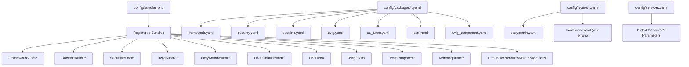
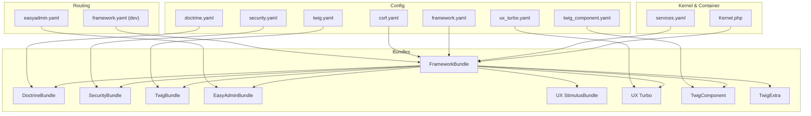
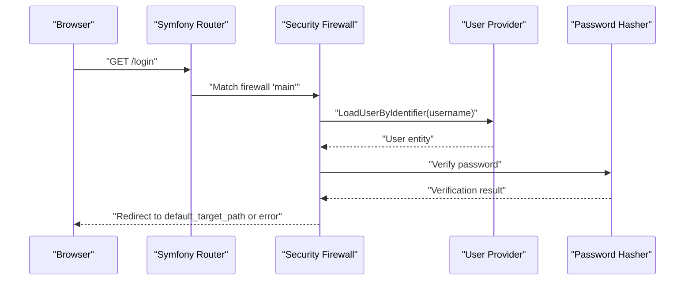
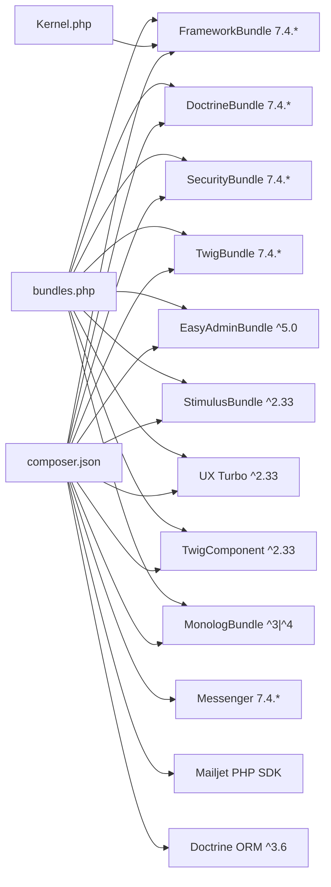

# Bundle Integration and Configuration

<cite>
**Referenced Files in This Document**
- [bundles.php](file://config/bundles.php)
- [composer.json](file://composer.json)
- [Kernel.php](file://src/Kernel.php)
- [services.yaml](file://config/services.yaml)
- [framework.yaml](file://config/packages/framework.yaml)
- [routing.yaml](file://config/packages/routing.yaml)
- [security.yaml](file://config/packages/security.yaml)
- [doctrine.yaml](file://config/packages/doctrine.yaml)
- [twig.yaml](file://config/packages/twig.yaml)
- [ux_turbo.yaml](file://config/packages/ux_turbo.yaml)
- [csrf.yaml](file://config/packages/csrf.yaml)
- [twig_component.yaml](file://config/packages/twig_component.yaml)
- [easyadmin.yaml](file://config/routes/easyadmin.yaml)
- [framework_routes_dev.yaml](file://config/routes/framework.yaml)
- [monolog.yaml](file://config/packages/monolog.yaml)
- [messenger.yaml](file://config/packages/messenger.yaml)
- [translation.yaml](file://config/packages/translation.yaml)
- [cache.yaml](file://config/packages/cache.yaml)
- [validator.yaml](file://config/packages/validator.yaml)
</cite>

## Table of Contents
1. [Introduction](#introduction)
2. [Project Structure](#project-structure)
3. [Core Components](#core-components)
4. [Architecture Overview](#architecture-overview)
5. [Detailed Component Analysis](#detailed-component-analysis)
6. [Dependency Analysis](#dependency-analysis)
7. [Performance Considerations](#performance-considerations)
8. [Troubleshooting Guide](#troubleshooting-guide)
9. [Conclusion](#conclusion)
10. [Appendices](#appendices)

## Introduction
This document explains how Symfony bundles are integrated and configured in this project. It covers bundle registration, environment-specific activation, bundle configuration under config/packages, initialization order, and practical integration patterns. It focuses on the key bundles used: FrameworkBundle, DoctrineBundle, SecurityBundle, TwigBundle, EasyAdminBundle, and UX bundles (StimulusBundle, Turbo, TwigComponent). It also documents bundle-specific routing, service registration, configuration options, version compatibility, and troubleshooting.

## Project Structure
The project follows Symfony’s standard directory layout with a clear separation of bundle configuration, routing, and services:
- Bundle registration is centralized in config/bundles.php.
- Bundle-specific configuration lives under config/packages/<bundle-name>.yaml.
- Routing for bundles is defined under config/routes/<bundle>.yaml.
- Global services are configured via config/services.yaml.
- The Kernel class enables micro-kernel features.

**Diagram sources**
- [bundles.php:1-19](file://config/bundles.php#L1-L19)
- [framework.yaml:1-16](file://config/packages/framework.yaml#L1-L16)
- [security.yaml:1-55](file://config/packages/security.yaml#L1-L55)
- [doctrine.yaml:1-55](file://config/packages/doctrine.yaml#L1-L55)
- [twig.yaml:1-7](file://config/packages/twig.yaml#L1-L7)
- [ux_turbo.yaml:1-5](file://config/packages/ux_turbo.yaml#L1-L5)
- [csrf.yaml:1-12](file://config/packages/csrf.yaml#L1-L12)
- [twig_component.yaml:1-6](file://config/packages/twig_component.yaml#L1-L6)
- [easyadmin.yaml:1-4](file://config/routes/easyadmin.yaml#L1-L4)
- [framework_routes_dev.yaml:1-5](file://config/routes/framework.yaml#L1-L5)
- [services.yaml:1-29](file://config/services.yaml#L1-L29)

**Section sources**
- [bundles.php:1-19](file://config/bundles.php#L1-L19)
- [Kernel.php:1-12](file://src/Kernel.php#L1-L12)
- [services.yaml:1-29](file://config/services.yaml#L1-L29)

## Core Components
This section outlines the primary bundles used and their roles:
- FrameworkBundle: Core framework services, routing, sessions, validation, CSRF, cache, and messenger.
- DoctrineBundle: DBAL and ORM integration, auto-mapping for entities, and production caching pools.
- SecurityBundle: Authentication and access control via form_login, logout, providers, and password hashers.
- TwigBundle: Templating engine configuration and strict variable enforcement in tests.
- EasyAdminBundle: Admin interface routing via a dedicated route loader.
- UX bundles: StimulusBundle (frontend controller wiring), Turbo (stateless CSRF and Turbo Drive), TwigComponent (component rendering), and TwigExtra (additional Twig extensions).

Key bundle registration and environment activation are defined in config/bundles.php. Composer constraints define compatible versions for each bundle.

**Section sources**
- [bundles.php:1-19](file://config/bundles.php#L1-L19)
- [composer.json:6-48](file://composer.json#L6-L48)
- [framework.yaml:1-16](file://config/packages/framework.yaml#L1-L16)
- [security.yaml:1-55](file://config/packages/security.yaml#L1-L55)
- [doctrine.yaml:1-55](file://config/packages/doctrine.yaml#L1-L55)
- [twig.yaml:1-7](file://config/packages/twig.yaml#L1-L7)
- [ux_turbo.yaml:1-5](file://config/packages/ux_turbo.yaml#L1-L5)
- [twig_component.yaml:1-6](file://config/packages/twig_component.yaml#L1-L6)
- [easyadmin.yaml:1-4](file://config/routes/easyadmin.yaml#L1-L4)

## Architecture Overview
The runtime architecture integrates bundles through registration, configuration, and routing. The Kernel enables micro-kernel features. FrameworkBundle orchestrates routing, sessions, CSRF, validation, cache, and messenger. DoctrineBundle manages persistence. SecurityBundle controls authentication and access. TwigBundle renders views. EasyAdminBundle exposes administrative routes. UX bundles enhance frontend interactivity and componentization.

**Diagram sources**
- [Kernel.php:1-12](file://src/Kernel.php#L1-L12)
- [services.yaml:1-29](file://config/services.yaml#L1-L29)
- [bundles.php:1-19](file://config/bundles.php#L1-L19)
- [framework.yaml:1-16](file://config/packages/framework.yaml#L1-L16)
- [security.yaml:1-55](file://config/packages/security.yaml#L1-L55)
- [doctrine.yaml:1-55](file://config/packages/doctrine.yaml#L1-L55)
- [twig.yaml:1-7](file://config/packages/twig.yaml#L1-L7)
- [ux_turbo.yaml:1-5](file://config/packages/ux_turbo.yaml#L1-L5)
- [csrf.yaml:1-12](file://config/packages/csrf.yaml#L1-L12)
- [twig_component.yaml:1-6](file://config/packages/twig_component.yaml#L1-L6)
- [easyadmin.yaml:1-4](file://config/routes/easyadmin.yaml#L1-L4)
- [framework_routes_dev.yaml:1-5](file://config/routes/framework.yaml#L1-L5)

## Detailed Component Analysis

### FrameworkBundle Integration
FrameworkBundle is registered for all environments and provides:
- Session management and CSRF protection.
- Validation, cache, router, and messenger configuration.
- Environment-specific behavior (e.g., test session factory, production cache pools).

Configuration highlights:
- Sessions enabled globally.
- CSRF protection configured via csrf.yaml and framework.yaml.
- Router default URI and strict requirements toggled by environment.
- Validator and cache pools configured under framework settings.
- Messenger transport and routing configured centrally.

**Section sources**
- [bundles.php:4-4](file://config/bundles.php#L4-L4)
- [framework.yaml:1-16](file://config/packages/framework.yaml#L1-L16)
- [routing.yaml:1-11](file://config/packages/routing.yaml#L1-L11)
- [csrf.yaml:1-12](file://config/packages/csrf.yaml#L1-L12)
- [validator.yaml:1-12](file://config/packages/validator.yaml#L1-L12)
- [cache.yaml:1-20](file://config/packages/cache.yaml#L1-L20)
- [messenger.yaml:1-27](file://config/packages/messenger.yaml#L1-L27)

### DoctrineBundle Integration
DoctrineBundle integrates DBAL and ORM:
- DBAL connection via DATABASE_URL environment variable.
- ORM auto-mapping for App\Entity namespace using attributes.
- Production optimizations: disabled proxy generation and configured cache pools.
- Test environment adjusts database naming.

Key options:
- Naming strategy, identity generation preferences, and lazy ghost objects.
- Auto-controller resolution disabled for clarity.

**Section sources**
- [bundles.php:7-8](file://config/bundles.php#L7-L8)
- [doctrine.yaml:1-55](file://config/packages/doctrine.yaml#L1-L55)
- [composer.json:11-13](file://composer.json#L11-L13)

### SecurityBundle Integration
SecurityBundle defines:
- Password hashers for the User entity.
- Entity user provider using the username property.
- Firewalls: dev bypass and main firewall with form_login and logout.
- Access control rules for public pages and admin area.
- Test-time password hasher tuning.

**Diagram sources**
- [security.yaml:14-38](file://config/packages/security.yaml#L14-L38)

**Section sources**
- [bundles.php:14-14](file://config/bundles.php#L14-L14)
- [security.yaml:1-55](file://config/packages/security.yaml#L1-L55)
- [csrf.yaml:7-12](file://config/packages/csrf.yaml#L7-L12)

### TwigBundle Integration
TwigBundle configuration:
- Template file pattern and strict variables in tests.
- TwigComponent integration for component rendering and anonymous templates.

**Section sources**
- [bundles.php:6-6](file://config/bundles.php#L6-L6)
- [twig.yaml:1-7](file://config/packages/twig.yaml#L1-L7)
- [twig_component.yaml:1-6](file://config/packages/twig_component.yaml#L1-L6)

### EasyAdminBundle Integration
EasyAdminBundle is registered and exposed via a dedicated route loader:
- Resource-based routing for admin CRUD controllers.

**Section sources**
- [bundles.php:17-17](file://config/bundles.php#L17-L17)
- [easyadmin.yaml:1-4](file://config/routes/easyadmin.yaml#L1-L4)

### UX Bundle Integrations
UX bundles enhance frontend and componentization:
- StimulusBundle: frontend controller wiring.
- Turbo: stateless CSRF header checking for forms/logins.
- TwigComponent: component defaults and anonymous template directory.

**Section sources**
- [bundles.php:11-16](file://config/bundles.php#L11-L16)
- [ux_turbo.yaml:1-5](file://config/packages/ux_turbo.yaml#L1-L5)
- [twig_component.yaml:1-6](file://config/packages/twig_component.yaml#L1-L6)

### Bundle Initialization Order
Registration order in config/bundles.php determines initialization precedence:
1. FrameworkBundle
2. MakerBundle (dev)
3. TwigBundle
4. DoctrineBundle
5. DoctrineMigrationsBundle
6. DebugBundle (dev)
7. WebProfilerBundle (dev/test)
8. StimulusBundle
9. Turbo
10. TwigExtra
11. SecurityBundle
12. MonologBundle
13. TwigComponent
14. EasyAdminBundle

This order ensures core services are initialized early, followed by persistence, security, templating, UX enhancements, and admin.

**Section sources**
- [bundles.php:3-18](file://config/bundles.php#L3-L18)

### Bundle-Specific Routing
- EasyAdminBundle: routes loaded via a dedicated loader under config/routes/easyadmin.yaml.
- FrameworkBundle dev: error page routing under config/routes/framework.yaml when in dev environment.

**Section sources**
- [easyadmin.yaml:1-4](file://config/routes/easyadmin.yaml#L1-L4)
- [framework_routes_dev.yaml:1-5](file://config/routes/framework.yaml#L1-L5)

### Bundle Configuration Options and Service Registration
- FrameworkBundle: centralizes CSRF, validation, cache, router, and messenger.
- DoctrineBundle: DBAL/ORM, auto-mapping, and production cache pools.
- SecurityBundle: providers, firewalls, access control, and password hashers.
- TwigBundle/TwigComponent: template patterns and component defaults.
- UX Turbo: CSRF header checking.
- MonologBundle: logging channels and environment-specific handlers.
- Messenger: transports, failure transport, and routing rules.

**Section sources**
- [framework.yaml:1-16](file://config/packages/framework.yaml#L1-L16)
- [doctrine.yaml:1-55](file://config/packages/doctrine.yaml#L1-L55)
- [security.yaml:1-55](file://config/packages/security.yaml#L1-L55)
- [twig.yaml:1-7](file://config/packages/twig.yaml#L1-L7)
- [twig_component.yaml:1-6](file://config/packages/twig_component.yaml#L1-L6)
- [ux_turbo.yaml:1-5](file://config/packages/ux_turbo.yaml#L1-L5)
- [monolog.yaml:1-56](file://config/packages/monolog.yaml#L1-L56)
- [messenger.yaml:1-27](file://config/packages/messenger.yaml#L1-L27)

## Dependency Analysis
Composer constraints define compatible versions for each bundle. The Kernel class enables micro-kernel features. Bundle registration ties configuration and routing together.

**Diagram sources**
- [composer.json:6-48](file://composer.json#L6-L48)
- [Kernel.php:1-12](file://src/Kernel.php#L1-L12)
- [bundles.php:1-19](file://config/bundles.php#L1-L19)

**Section sources**
- [composer.json:6-48](file://composer.json#L6-L48)
- [bundles.php:1-19](file://config/bundles.php#L1-L19)
- [Kernel.php:1-12](file://src/Kernel.php#L1-L12)

## Performance Considerations
- Disable proxy generation in production for Doctrine ORM to reduce overhead.
- Use cache pools for query and result caches in production.
- Tune router strict requirements per environment.
- Configure messenger retry strategy and failure transport for reliable async processing.
- Adjust logging handlers for production to avoid excessive disk writes.

**Section sources**
- [doctrine.yaml:36-55](file://config/packages/doctrine.yaml#L36-L55)
- [cache.yaml:1-20](file://config/packages/cache.yaml#L1-L20)
- [routing.yaml:7-11](file://config/packages/routing.yaml#L7-L11)
- [messenger.yaml:1-27](file://config/packages/messenger.yaml#L1-L27)
- [monolog.yaml:32-56](file://config/packages/monolog.yaml#L32-L56)

## Troubleshooting Guide
Common issues and resolutions:
- CSRF failures: Verify stateless tokens and header checks for Turbo and forms.
- Login/logout problems: Confirm form_login paths and logout target in security.yaml.
- Admin routes not loading: Ensure EasyAdminBundle route loader is present and correct.
- Twig component rendering: Check component defaults and anonymous template directory.
- Doctrine connection errors: Validate DATABASE_URL and server version settings.
- Dev error pages missing: Confirm dev environment and framework error route inclusion.
- Messenger delivery: Review transport DSN and routing rules.

**Section sources**
- [csrf.yaml:1-12](file://config/packages/csrf.yaml#L1-L12)
- [ux_turbo.yaml:1-5](file://config/packages/ux_turbo.yaml#L1-L5)
- [security.yaml:25-38](file://config/packages/security.yaml#L25-L38)
- [easyadmin.yaml:1-4](file://config/routes/easyadmin.yaml#L1-L4)
- [twig_component.yaml:1-6](file://config/packages/twig_component.yaml#L1-L6)
- [doctrine.yaml:1-10](file://config/packages/doctrine.yaml#L1-L10)
- [framework_routes_dev.yaml:1-5](file://config/routes/framework.yaml#L1-L5)
- [messenger.yaml:1-27](file://config/packages/messenger.yaml#L1-L27)

## Conclusion
This project integrates Symfony bundles through a centralized registration model, environment-aware configuration, and dedicated routing for admin. FrameworkBundle orchestrates core services, DoctrineBundle handles persistence, SecurityBundle secures the application, TwigBundle powers templating, EasyAdminBundle provides administration, and UX bundles enhance frontend experiences. Composer constraints ensure version compatibility, while bundle-specific configuration files tailor behavior per environment.

## Appendices
- Translation configuration sets default locale and translation path.
- Global services define parameters and automatic wiring for the application.

**Section sources**
- [translation.yaml:1-6](file://config/packages/translation.yaml#L1-L6)
- [services.yaml:9-29](file://config/services.yaml#L9-L29)