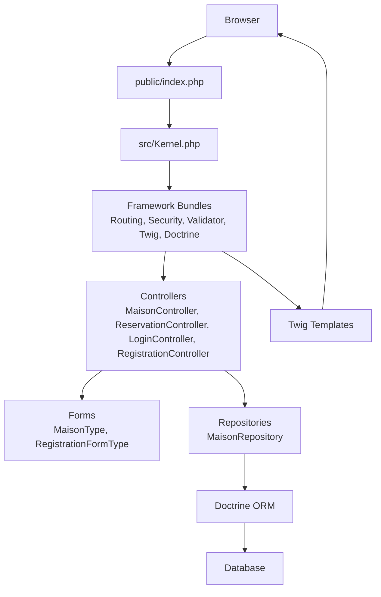
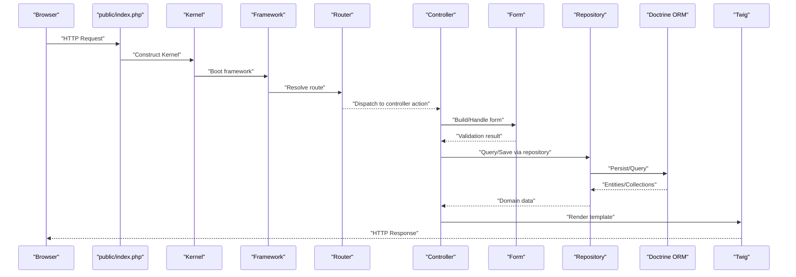
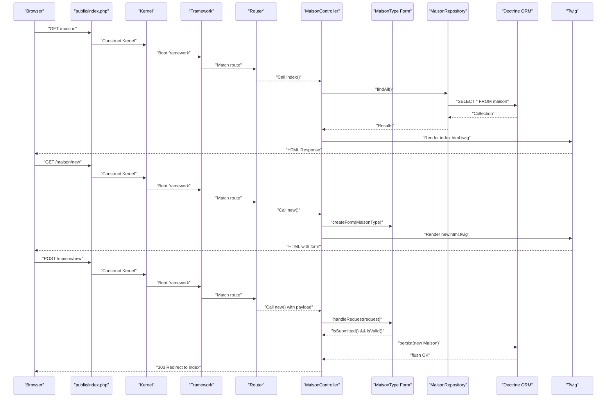
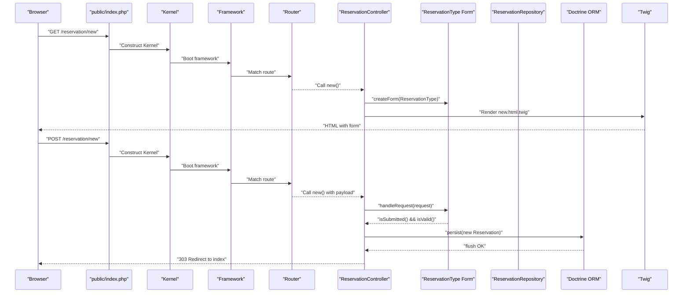
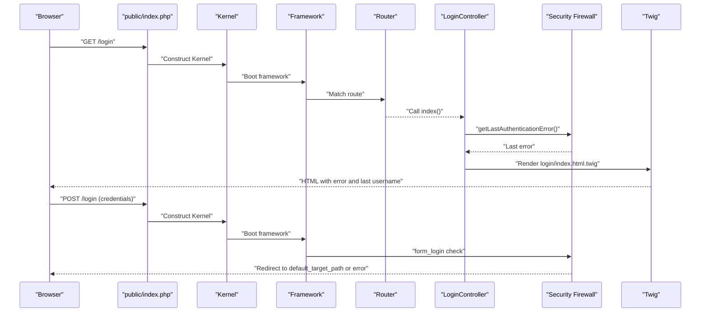
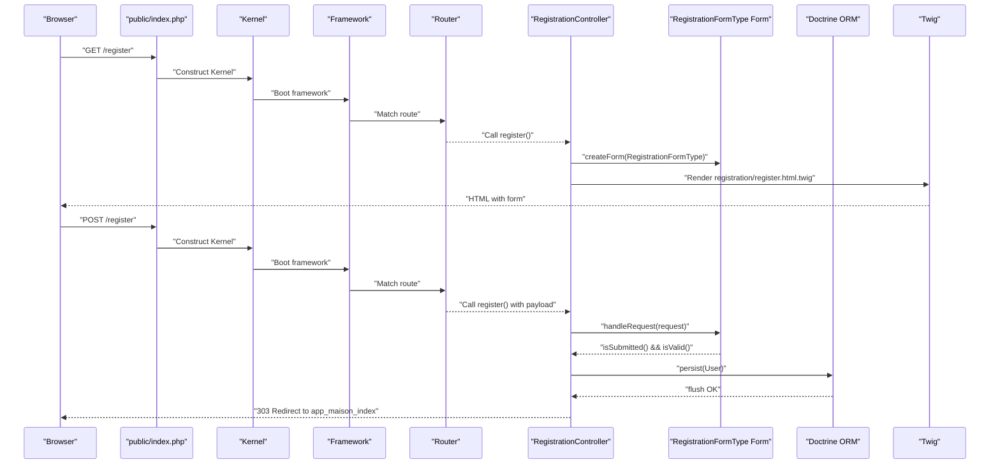
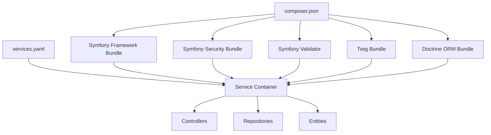

# Data Flow and Request Processing

<cite>
**Referenced Files in This Document**
- [Kernel.php](file://src/Kernel.php)
- [index.php](file://public/index.php)
- [routes.yaml](file://config/routes.yaml)
- [framework.yaml](file://config/packages/framework.yaml)
- [security.yaml](file://config/packages/security.yaml)
- [services.yaml](file://config/services.yaml)
- [MaisonController.php](file://src/Controller/MaisonController.php)
- [ReservationController.php](file://src/Controller/ReservationController.php)
- [LoginController.php](file://src/Controller/LoginController.php)
- [RegistrationController.php](file://src/Controller/RegistrationController.php)
- [Maison.php](file://src/Entity/Maison.php)
- [MaisonRepository.php](file://src/Repository/MaisonRepository.php)
- [MaisonType.php](file://src/Form/MaisonType.php)
- [composer.json](file://composer.json)
</cite>

## Table of Contents
1. [Introduction](#introduction)
2. [Project Structure](#project-structure)
3. [Core Components](#core-components)
4. [Architecture Overview](#architecture-overview)
5. [Detailed Component Analysis](#detailed-component-analysis)
6. [Dependency Analysis](#dependency-analysis)
7. [Performance Considerations](#performance-considerations)
8. [Troubleshooting Guide](#troubleshooting-guide)
9. [Conclusion](#conclusion)

## Introduction
This document explains how requests flow through the application from HTTP entry to response delivery. It covers the complete request-response cycle, including routing, controller actions, forms and validation, persistence via repositories and Doctrine ORM, security and authentication, and cross-cutting concerns such as sessions and CSRF protection. Typical workflows include property listing and creation, reservation handling, and user registration and login.

## Project Structure
The application follows a standard Symfony structure:
- Public entry point initializes the runtime and constructs the Kernel.
- The Kernel boots the framework and loads configuration.
- Routing discovers controllers annotated with #[Route].
- Controllers orchestrate request handling, form processing, and rendering.
- Entities and Repositories encapsulate persistence logic.
- Security configuration governs authentication and access control.
- Services are auto-wired and configured centrally.

**Diagram sources**
- [index.php:1-10](file://public/index.php#L1-L10)
- [Kernel.php:1-12](file://src/Kernel.php#L1-L12)
- [routes.yaml:10-15](file://config/routes.yaml#L10-L15)
- [MaisonController.php:14-82](file://src/Controller/MaisonController.php#L14-L82)
- [ReservationController.php:14-82](file://src/Controller/ReservationController.php#L14-L82)
- [LoginController.php:7-22](file://src/Controller/LoginController.php#L7-L22)
- [RegistrationController.php:14-44](file://src/Controller/RegistrationController.php#L14-L44)
- [MaisonRepository.php:12-47](file://src/Repository/MaisonRepository.php#L12-L47)
- [MaisonType.php:12-36](file://src/Form/MaisonType.php#L12-L36)

**Section sources**
- [index.php:1-10](file://public/index.php#L1-L10)
- [Kernel.php:1-12](file://src/Kernel.php#L1-L12)
- [routes.yaml:1-15](file://config/routes.yaml#L1-L15)
- [framework.yaml:1-16](file://config/packages/framework.yaml#L1-L16)
- [services.yaml:13-29](file://config/services.yaml#L13-L29)

## Core Components
- HTTP entry and kernel bootstrap: The public front controller delegates to the runtime and constructs the Kernel, which initializes the framework.
- Routing: Routes are discovered via #[Route] attributes on controllers and a small set of explicit routes in YAML.
- Controllers: Action methods handle requests, bind route arguments, process forms, and render views or redirect.
- Forms and validation: Form types define fields and constraints; validation occurs during form submission.
- Persistence: Entities map to database tables; repositories encapsulate queries; Doctrine manages persistence.
- Security: Authentication via form_login, logout, and access control rules.
- Services: Auto-wiring and auto-configuration simplify dependency injection across the application.

**Section sources**
- [index.php:7-9](file://public/index.php#L7-L9)
- [Kernel.php:8-11](file://src/Kernel.php#L8-L11)
- [routes.yaml:10-15](file://config/routes.yaml#L10-L15)
- [MaisonController.php:17-43](file://src/Controller/MaisonController.php#L17-L43)
- [MaisonType.php:14-34](file://src/Form/MaisonType.php#L14-L34)
- [MaisonRepository.php:19-45](file://src/Repository/MaisonRepository.php#L19-L45)
- [security.yaml:14-45](file://config/packages/security.yaml#L14-L45)
- [services.yaml:15-25](file://config/services.yaml#L15-L25)

## Architecture Overview
The request lifecycle follows a predictable path:
1. HTTP request enters via public/index.php.
2. Kernel boots the framework with configuration loaded from config/packages.
3. Router matches the incoming path to a controller action.
4. Controller executes business logic: form handling, validation, persistence, and response selection.
5. Views are rendered via Twig; responses are sent to the browser.

**Diagram sources**
- [index.php:7-9](file://public/index.php#L7-L9)
- [Kernel.php:8-11](file://src/Kernel.php#L8-L11)
- [routes.yaml:10-15](file://config/routes.yaml#L10-L15)
- [MaisonController.php:25-43](file://src/Controller/MaisonController.php#L25-L43)
- [MaisonRepository.php:19-45](file://src/Repository/MaisonRepository.php#L19-L45)

## Detailed Component Analysis

### Property Listing and Creation Workflow (Property Search)
This workflow demonstrates GET listing, form rendering, and POST creation with validation and persistence.

Key processing points:
- Route discovery and controller invocation are handled by the framework’s router.
- The controller builds and handles the form; validation is performed automatically.
- Persistence uses Doctrine EntityManager injected via autowire.
- CSRF protection is enforced on deletion actions using tokens extracted from the request payload.

**Diagram sources**
- [MaisonController.php:17-43](file://src/Controller/MaisonController.php#L17-L43)
- [MaisonType.php:14-34](file://src/Form/MaisonType.php#L14-L34)
- [MaisonRepository.php:19-25](file://src/Repository/MaisonRepository.php#L19-L25)

**Section sources**
- [MaisonController.php:17-43](file://src/Controller/MaisonController.php#L17-L43)
- [MaisonType.php:14-34](file://src/Form/MaisonType.php#L14-L34)
- [MaisonRepository.php:19-25](file://src/Repository/MaisonRepository.php#L19-L25)

### Reservation Creation Workflow
Reservations follow the same pattern: GET form, POST submission, validation, persistence, and redirect.

**Diagram sources**
- [ReservationController.php:25-43](file://src/Controller/ReservationController.php#L25-L43)

**Section sources**
- [ReservationController.php:25-43](file://src/Controller/ReservationController.php#L25-L43)

### User Authentication Workflow
Authentication uses form_login with automatic error retrieval and last username capture.

**Diagram sources**
- [LoginController.php:9-21](file://src/Controller/LoginController.php#L9-L21)
- [security.yaml:25-34](file://config/packages/security.yaml#L25-L34)

**Section sources**
- [LoginController.php:9-21](file://src/Controller/LoginController.php#L9-L21)
- [security.yaml:25-34](file://config/packages/security.yaml#L25-L34)

### User Registration Workflow
Registration hashes passwords, persists the user, and redirects to the property index.

**Diagram sources**
- [RegistrationController.php:16-44](file://src/Controller/RegistrationController.php#L16-L44)

**Section sources**
- [RegistrationController.php:16-44](file://src/Controller/RegistrationController.php#L16-L44)

### Parameter Validation and Error Handling Patterns
- Form validation: Controllers use Symfony Forms to validate submissions. Validation occurs after handleRequest and is checked via isSubmitted() && isValid().
- CSRF protection: Token validation is performed on destructive actions (e.g., deletion) using isCsrfTokenValid with a token extracted from the request payload.
- Error reporting: Login errors are retrieved via AuthenticationUtils and passed to the template.
- Redirect after post: Controllers consistently redirect after successful POST to avoid duplicate submissions.

**Section sources**
- [MaisonController.php:32-37](file://src/Controller/MaisonController.php#L32-L37)
- [MaisonController.php:74-79](file://src/Controller/MaisonController.php#L74-L79)
- [LoginController.php:12-20](file://src/Controller/LoginController.php#L12-L20)
- [ReservationController.php:32-37](file://src/Controller/ReservationController.php#L32-L37)

### Middleware and Cross-Cutting Concerns
- Session management: Sessions are enabled globally via framework configuration and are lazily started when accessed.
- Security middleware: The security firewall handles authentication, logout, and access control rules.
- Routing: Routes are discovered via attributes and a minimal YAML configuration for explicit paths.
- Service container: Auto-wiring and auto-configuration reduce boilerplate and centralize service definitions.

**Section sources**
- [framework.yaml:3-6](file://config/packages/framework.yaml#L3-L6)
- [security.yaml:14-45](file://config/packages/security.yaml#L14-L45)
- [routes.yaml:10-15](file://config/routes.yaml#L10-L15)
- [services.yaml:15-25](file://config/services.yaml#L15-L25)

## Dependency Analysis
The application relies on Symfony components and Doctrine for core functionality. Composer defines the dependency graph, while services.yaml and framework.yaml configure runtime behavior.

**Diagram sources**
- [composer.json:6-48](file://composer.json#L6-L48)
- [services.yaml:13-29](file://config/services.yaml#L13-L29)

**Section sources**
- [composer.json:6-48](file://composer.json#L6-L48)
- [services.yaml:13-29](file://config/services.yaml#L13-L29)

## Performance Considerations
- Use repository methods for efficient queries (e.g., countAll, findByCity, findLatest) to minimize ad-hoc SQL.
- Prefer paginated or limited queries for listing pages to reduce memory usage.
- Enable caching for frequently accessed data where appropriate.
- Keep forms minimal and validated server-side to reduce unnecessary client-side round trips.
- Use lazy loading and batch operations for bulk updates to reduce database load.

## Troubleshooting Guide
- Authentication failures: Retrieve the last authentication error via AuthenticationUtils and display it in the login template.
- CSRF errors: Ensure the hidden token field is present in forms and validated on the server.
- Redirect loops: Verify access control rules and default_target_path in security configuration.
- Service autowiring issues: Confirm service definitions and auto-wiring in services.yaml.

**Section sources**
- [LoginController.php:12-20](file://src/Controller/LoginController.php#L12-L20)
- [MaisonController.php:74-79](file://src/Controller/MaisonController.php#L74-L79)
- [security.yaml:29-34](file://config/packages/security.yaml#L29-L34)
- [services.yaml:15-25](file://config/services.yaml#L15-L25)

## Conclusion
The application implements a clean separation of concerns: routing, controllers, forms, repositories, and persistence. Requests traverse a predictable pipeline with robust validation, CSRF protection, and security enforcement. By leveraging Symfony’s auto-wiring, routing, and security features, the system remains maintainable and extensible.